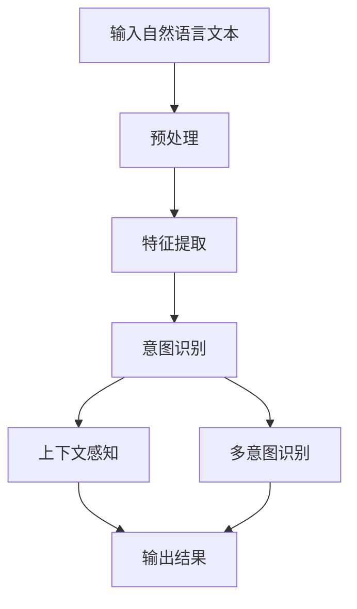

# 构建企业级自然语言理解系统：上下文感知与多意图识别

> 关键词：企业级自然语言理解系统、上下文感知、多意图识别、自然语言处理、人工智能

> 摘要：本文聚焦于企业级自然语言理解系统中上下文感知与多意图识别的关键技术。详细阐述了相关核心概念、算法原理、数学模型，通过实际项目案例展示了系统的实现过程。探讨了其在不同企业场景中的应用，推荐了学习资源、开发工具框架及相关论文著作。最后总结了未来发展趋势与挑战，为构建高效的企业级自然语言理解系统提供全面的技术指导和理论支持。

## 1. 背景介绍 
### 1.1 目的和范围
在当今数字化时代，企业面临着海量的自然语言数据，如客户咨询、社交媒体评论、内部文档等。构建企业级自然语言理解系统的目的在于让计算机能够准确理解人类语言的含义，特别是在处理复杂的上下文和多意图表述时，实现更智能、高效的信息处理。本文章的范围涵盖了从核心概念的介绍，到算法原理的讲解，再到实际项目的开发和应用，全面探讨如何构建具备上下文感知与多意图识别能力的企业级自然语言理解系统。

### 1.2 预期读者
本文预期读者包括自然语言处理领域的研究人员、人工智能工程师、企业级软件开发者、对自然语言理解技术感兴趣的技术爱好者等。对于想要深入了解和应用上下文感知与多意图识别技术来构建企业级自然语言理解系统的人员具有较高的参考价值。

### 1.3 文档结构概述
本文首先介绍相关背景知识，包括目的、预期读者和文档结构。接着阐述核心概念与联系，通过文本示意图和 Mermaid 流程图展示其原理和架构。然后详细讲解核心算法原理和具体操作步骤，结合 Python 源代码进行说明。再介绍数学模型和公式，并举例说明。之后通过项目实战展示代码实现和详细解释。随后探讨实际应用场景，推荐相关工具和资源。最后总结未来发展趋势与挑战，提供常见问题解答和扩展阅读参考资料。

### 1.4 术语表
#### 1.4.1 核心术语定义
- **自然语言理解（Natural Language Understanding, NLU）**：是指让计算机能够理解人类语言的含义，将自然语言文本转化为计算机能够处理的结构化表示。
- **上下文感知（Context Awareness）**：指系统能够理解文本所处的语境信息，包括前文内容、对话历史、用户背景等，从而更准确地理解文本的含义。
- **多意图识别（Multi - Intent Recognition）**：在一个自然语言文本中识别出多个不同的意图，例如用户在一句话中可能同时表达了查询信息和提出请求等多个意图。

#### 1.4.2 相关概念解释
- **词法分析**：对自然语言文本进行分词、词性标注等处理，将文本分解为基本的词汇单元，并确定每个词汇的词性。
- **句法分析**：分析句子的语法结构，确定句子中各个成分之间的关系，如主谓宾等关系。
- **语义分析**：理解文本的语义信息，包括词汇的含义、句子的语义角色等。

#### 1.4.3 缩略词列表
- **NLU**：Natural Language Understanding（自然语言理解）
- **RNN**：Recurrent Neural Network（循环神经网络）
- **LSTM**：Long Short - Term Memory（长短期记忆网络）
- **GRU**：Gated Recurrent Unit（门控循环单元）
- **BERT**：Bidirectional Encoder Representations from Transformers（基于变换器的双向编码器表示）

## 2. 核心概念与联系 
### 2.1 自然语言理解系统的整体架构
自然语言理解系统主要由输入层、预处理层、特征提取层、意图识别层和输出层组成。输入层接收自然语言文本，预处理层对文本进行清洗、分词等操作，特征提取层将文本转换为计算机能够处理的特征表示，意图识别层识别文本的意图，输出层将识别结果以合适的形式输出。

### 2.2 上下文感知的原理
上下文感知的核心在于利用文本的历史信息和相关背景知识来辅助理解当前文本的含义。例如，在对话系统中，通过记录对话历史，系统可以知道用户之前的问题和回复，从而更好地理解当前用户的问题。可以使用基于规则的方法、机器学习方法或深度学习方法来实现上下文感知。

### 2.3 多意图识别的原理
多意图识别需要解决如何从一个文本中准确地识别出多个不同的意图。一种常见的方法是将多意图识别问题转化为多标签分类问题，每个意图对应一个标签。可以使用多标签分类算法，如基于神经网络的多标签分类器来实现多意图识别。

### 2.4 文本示意图
```plaintext
自然语言理解系统
|-- 输入层（自然语言文本）
|-- 预处理层（清洗、分词、词性标注等）
|-- 特征提取层（词向量、句向量等）
|-- 意图识别层（单意图或多意图识别）
|   |-- 上下文感知模块
|   |-- 多意图识别模块
|-- 输出层（意图标签、结构化信息等）
```

### 2.5 Mermaid 流程图


## 3. 核心算法原理 & 具体操作步骤 
### 3.1 词向量表示算法 - Word2Vec
Word2Vec 是一种用于将词汇转换为向量表示的算法，其核心思想是通过训练神经网络来学习词汇的语义信息。下面是使用 Python 和 gensim 库实现 Word2Vec 的示例代码：
```python
from gensim.models import Word2Vec

# 示例文本数据
sentences = [["I", "love", "natural", "language", "processing"],
             ["Natural", "language", "processing", "is", "amazing"]]

# 训练 Word2Vec 模型
model = Word2Vec(sentences, min_count=1)

# 获取某个词汇的向量表示
vector = model.wv['language']
print(vector)
```
### 3.2 基于 LSTM 的单意图识别算法
LSTM 是一种特殊的循环神经网络，能够有效地处理序列数据，如自然语言文本。下面是使用 Keras 实现基于 LSTM 的单意图识别的示例代码：
```python
from keras.preprocessing.text import Tokenizer
from keras.preprocessing.sequence import pad_sequences
from keras.models import Sequential
from keras.layers import Embedding, LSTM, Dense
import numpy as np

# 示例文本数据和标签
texts = ["I want to book a hotel", "I need to check the weather"]
labels = [0, 1]

# 分词和编码
tokenizer = Tokenizer()
tokenizer.fit_on_texts(texts)
sequences = tokenizer.texts_to_sequences(texts)

# 填充序列
max_length = max([len(seq) for seq in sequences])
padded_sequences = pad_sequences(sequences, maxlen=max_length)

# 构建 LSTM 模型
model = Sequential()
model.add(Embedding(input_dim=len(tokenizer.word_index) + 1, output_dim=100, input_length=max_length))
model.add(LSTM(100))
model.add(Dense(1, activation='sigmoid'))

# 编译模型
model.compile(optimizer='adam', loss='binary_crossentropy', metrics=['accuracy'])

# 训练模型
model.fit(padded_sequences, np.array(labels), epochs=10, batch_size=1)
```
### 3.3 基于 BERT 的多意图识别算法
BERT 是一种预训练的语言模型，能够学习到丰富的语言表示。下面是使用 transformers 库实现基于 BERT 的多意图识别的示例代码：
```python
from transformers import BertTokenizer, BertForSequenceClassification
import torch

# 加载预训练的 BERT 模型和分词器
tokenizer = BertTokenizer.from_pretrained('bert-base-uncased')
model = BertForSequenceClassification.from_pretrained('bert-base-uncased', num_labels=3)

# 示例文本数据
text = "I want to book a hotel and check the weather"

# 分词和编码
inputs = tokenizer(text, return_tensors='pt')

# 进行预测
outputs = model(**inputs)
logits = outputs.logits
predicted_labels = torch.argmax(logits, dim=1)
print(predicted_labels)
```

## 4. 数学模型和公式 & 详细讲解 & 举例说明 
### 4.1 Word2Vec 的数学模型
Word2Vec 主要有两种模型：Skip - gram 模型和 Continuous Bag - of - Words (CBOW) 模型。

#### Skip - gram 模型
Skip - gram 模型的目标是根据中心词预测其上下文词。设中心词为 $w_c$，上下文词为 $w_{c - k}, \cdots, w_{c - 1}, w_{c + 1}, \cdots, w_{c + k}$，其中 $k$ 是上下文窗口的大小。Skip - gram 模型的损失函数可以表示为：
$$
L = -\sum_{t = 1}^{T}\sum_{-k \leq j \leq k, j \neq 0} \log p(w_{t + j}|w_t)
$$
其中 $p(w_{t + j}|w_t)$ 是根据中心词 $w_t$ 预测上下文词 $w_{t + j}$ 的概率，通常使用 softmax 函数来计算：
$$
p(w_{t + j}|w_t) = \frac{\exp(u_{w_{t + j}}^T v_{w_t})}{\sum_{w = 1}^{V} \exp(u_w^T v_{w_t})}
$$
其中 $v_{w_t}$ 是中心词 $w_t$ 的向量表示，$u_w$ 是上下文词 $w$ 的向量表示，$V$ 是词汇表的大小。

#### CBOW 模型
CBOW 模型的目标是根据上下文词预测中心词。设上下文词为 $w_{c - k}, \cdots, w_{c - 1}, w_{c + 1}, \cdots, w_{c + k}$，中心词为 $w_c$。CBOW 模型的损失函数可以表示为：
$$
L = -\sum_{t = 1}^{T} \log p(w_t|w_{t - k}, \cdots, w_{t - 1}, w_{t + 1}, \cdots, w_{t + k})
$$
其中 $p(w_t|w_{t - k}, \cdots, w_{t - 1}, w_{t + 1}, \cdots, w_{t + k})$ 是根据上下文词预测中心词 $w_t$ 的概率，同样使用 softmax 函数来计算。

### 4.2 LSTM 的数学模型
LSTM 单元由输入门 $i_t$、遗忘门 $f_t$、输出门 $o_t$ 和细胞状态 $C_t$ 组成。其计算公式如下：
$$
i_t = \sigma(W_{ii}x_t + W_{hi}h_{t - 1} + b_i)
$$
$$
f_t = \sigma(W_{if}x_t + W_{hf}h_{t - 1} + b_f)
$$
$$
o_t = \sigma(W_{io}x_t + W_{ho}h_{t - 1} + b_o)
$$
$$
\tilde{C}_t = \tanh(W_{ic}x_t + W_{hc}h_{t - 1} + b_c)
$$
$$
C_t = f_t \odot C_{t - 1} + i_t \odot \tilde{C}_t
$$
$$
h_t = o_t \odot \tanh(C_t)
$$
其中 $x_t$ 是输入向量，$h_{t - 1}$ 是上一时刻的隐藏状态，$W$ 是权重矩阵，$b$ 是偏置向量，$\sigma$ 是 sigmoid 函数，$\tanh$ 是双曲正切函数，$\odot$ 表示逐元素相乘。

### 4.3 BERT 的数学模型
BERT 基于 Transformer 架构，Transformer 主要由多头自注意力机制和前馈神经网络组成。多头自注意力机制的计算公式如下：
$$
\text{MultiHead}(Q, K, V) = \text{Concat}(\text{head}_1, \cdots, \text{head}_h)W^O
$$
其中 $\text{head}_i = \text{Attention}(QW_i^Q, KW_i^K, VW_i^V)$，$\text{Attention}(Q, K, V) = \text{softmax}(\frac{QK^T}{\sqrt{d_k}})V$，$Q$、$K$、$V$ 分别是查询、键、值矩阵，$W_i^Q$、$W_i^K$、$W_i^V$、$W^O$ 是权重矩阵，$d_k$ 是键的维度。

### 4.4 举例说明
以 Word2Vec 的 Skip - gram 模型为例，假设我们有一个词汇表 $V = \{w_1, w_2, w_3\}$，中心词 $w_c = w_1$，上下文词 $w_{c - 1} = w_2$，$w_{c + 1} = w_3$。我们可以根据上述公式计算预测上下文词的概率，从而更新词向量。

## 5. 项目实战：代码实际案例和详细解释说明 
### 5.1  开发环境搭建
#### 5.1.1 安装 Python
首先需要安装 Python 环境，建议使用 Python 3.7 及以上版本。可以从 Python 官方网站（https://www.python.org/downloads/）下载并安装。

#### 5.1.2 安装相关库
使用 pip 命令安装所需的库，例如：
```sh
pip install gensim keras transformers torch numpy
```

### 5.2  源代码详细实现和代码解读
#### 5.2.1 数据预处理
```python
import pandas as pd
from sklearn.model_selection import train_test_split
from keras.preprocessing.text import Tokenizer
from keras.preprocessing.sequence import pad_sequences

# 读取数据
data = pd.read_csv('data.csv')
texts = data['text'].tolist()
labels = data['label'].tolist()

# 分词和编码
tokenizer = Tokenizer()
tokenizer.fit_on_texts(texts)
sequences = tokenizer.texts_to_sequences(texts)

# 填充序列
max_length = max([len(seq) for seq in sequences])
padded_sequences = pad_sequences(sequences, maxlen=max_length)

# 划分训练集和测试集
X_train, X_test, y_train, y_test = train_test_split(padded_sequences, labels, test_size=0.2, random_state=42)
```
**代码解读**：首先使用 pandas 读取数据，然后使用 Tokenizer 对文本进行分词和编码，将文本转换为序列。接着使用 pad_sequences 对序列进行填充，使其长度一致。最后使用 train_test_split 划分训练集和测试集。

#### 5.2.2 构建模型
```python
from keras.models import Sequential
from keras.layers import Embedding, LSTM, Dense

# 构建 LSTM 模型
model = Sequential()
model.add(Embedding(input_dim=len(tokenizer.word_index) + 1, output_dim=100, input_length=max_length))
model.add(LSTM(100))
model.add(Dense(1, activation='sigmoid'))

# 编译模型
model.compile(optimizer='adam', loss='binary_crossentropy', metrics=['accuracy'])
```
**代码解读**：使用 Sequential 模型构建 LSTM 模型，首先添加 Embedding 层将词汇转换为向量表示，然后添加 LSTM 层处理序列数据，最后添加 Dense 层进行分类。使用 adam 优化器和 binary_crossentropy 损失函数进行编译。

#### 5.2.3 训练模型
```python
# 训练模型
model.fit(X_train, y_train, epochs=10, batch_size=32, validation_data=(X_test, y_test))
```
**代码解读**：使用 fit 方法对模型进行训练，指定训练集、训练轮数、批次大小和验证集。

### 5.3  代码解读与分析
通过上述代码，我们完成了一个简单的自然语言理解系统的开发。数据预处理阶段将文本数据转换为计算机能够处理的格式，模型构建阶段选择了合适的模型结构，训练阶段使用训练数据对模型进行优化。在实际应用中，可以根据具体需求调整模型结构和超参数，以提高模型的性能。

## 6. 实际应用场景 
### 6.1 智能客服系统
在智能客服系统中，上下文感知和多意图识别技术可以帮助系统更好地理解用户的问题。例如，用户可能会在对话中先询问产品信息，然后提出购买请求，系统能够根据上下文准确识别用户的多意图，并提供相应的服务。

### 6.2 智能助手
智能助手可以根据用户的语音指令进行多意图识别，例如用户可能会说“提醒我明天上午开会，顺便查询一下会议地点”，智能助手能够识别出提醒和查询两个意图，并分别进行处理。

### 6.3 舆情分析
在舆情分析中，上下文感知可以帮助系统理解文本的真实含义，多意图识别可以识别出文本中包含的多种情感和意图，如赞扬、批评、建议等，从而更全面地分析舆情。

### 6.4 信息检索
在信息检索中，上下文感知可以根据用户的历史查询记录和当前查询的上下文，提供更准确的检索结果。多意图识别可以帮助系统理解用户的多种查询意图，提高检索的准确性。

## 7. 工具和资源推荐
### 7.1 学习资源推荐
#### 7.1.1 书籍推荐
- 《自然语言处理入门》：这本书详细介绍了自然语言处理的基础知识和常用技术，适合初学者入门。
- 《深度学习》：全面介绍了深度学习的理论和应用，对于理解自然语言处理中的深度学习模型有很大帮助。
- 《Python 自然语言处理》：通过 Python 代码示例介绍自然语言处理的实践方法，非常实用。

#### 7.1.2 在线课程
- Coursera 上的“Natural Language Processing Specialization”：由顶尖大学的教授授课，系统地介绍了自然语言处理的各个方面。
- edX 上的“Deep Learning for Natural Language Processing”：专注于深度学习在自然语言处理中的应用。

#### 7.1.3 技术博客和网站
- 博客园：有很多自然语言处理领域的技术博客，分享了最新的研究成果和实践经验。
- 机器之心：提供了丰富的人工智能和自然语言处理的资讯和技术文章。
- arXiv：可以查阅最新的自然语言处理相关的学术论文。

### 7.2 开发工具框架推荐
#### 7.2.1 IDE和编辑器
- PyCharm：功能强大的 Python 集成开发环境，适合开发自然语言处理项目。
- Jupyter Notebook：交互式的开发环境，方便进行代码调试和实验。

#### 7.2.2 调试和性能分析工具
- TensorBoard：可以可视化深度学习模型的训练过程和性能指标。
- Pyflame：用于分析 Python 代码的性能瓶颈。

#### 7.2.3 相关框架和库
- NLTK：自然语言处理工具包，提供了丰富的自然语言处理功能，如分词、词性标注等。
- SpaCy：高效的自然语言处理库，支持多种语言的处理。
- AllenNLP：用于自然语言处理的深度学习框架，提供了很多预训练模型和工具。

### 7.3 相关论文著作推荐
#### 7.3.1 经典论文
- “Efficient Estimation of Word Representations in Vector Space”：介绍了 Word2Vec 算法。
- “Long Short - Term Memory”：提出了 LSTM 模型。
- “Attention Is All You Need”：介绍了 Transformer 架构。

#### 7.3.2 最新研究成果
- 关注 ACL（Association for Computational Linguistics）、EMNLP（Conference on Empirical Methods in Natural Language Processing）等自然语言处理领域的顶级会议，了解最新的研究成果。

#### 7.3.3 应用案例分析
- 可以在各大企业的技术博客上查找自然语言理解系统的应用案例，学习实际应用中的经验和技巧。

## 8. 总结：未来发展趋势与挑战
### 8.1 未来发展趋势
- **多模态融合**：将自然语言处理与图像、语音等其他模态的信息融合，实现更全面的智能理解。例如，在智能客服系统中，结合用户的语音和表情信息，更好地理解用户的意图。
- **低资源语言处理**：随着全球化的发展，对低资源语言的自然语言处理需求越来越大。未来的研究将更加关注如何在低资源的情况下实现高效的自然语言理解。
- **可解释性增强**：随着自然语言理解系统在越来越多的关键领域应用，如医疗、法律等，对系统的可解释性要求越来越高。未来的研究将致力于提高自然语言理解系统的可解释性，让用户能够理解系统的决策过程。

### 8.2 挑战
- **数据质量和标注成本**：高质量的数据是训练自然语言理解系统的关键，但数据的收集、清洗和标注成本较高。如何降低标注成本，提高数据质量是一个挑战。
- **语义理解的复杂性**：自然语言的语义非常复杂，存在歧义、隐喻等现象。如何准确理解自然语言的语义，特别是在上下文感知和多意图识别的情况下，仍然是一个难题。
- **计算资源的需求**：深度学习模型在自然语言处理中取得了很好的效果，但这些模型通常需要大量的计算资源。如何在有限的计算资源下实现高效的自然语言理解是一个挑战。

## 9. 附录：常见问题与解答
### 9.1 如何选择合适的词向量表示方法？
选择合适的词向量表示方法需要考虑数据的特点和任务的需求。如果数据量较小，可以选择预训练的词向量，如 Word2Vec、GloVe 等。如果数据量较大，可以考虑使用基于深度学习的方法，如 ELMo、BERT 等。

### 9.2 如何处理长文本的上下文感知？
可以使用基于注意力机制的模型，如 Transformer 模型，来处理长文本的上下文感知。注意力机制可以让模型自动关注文本中的重要部分，从而更好地理解上下文信息。

### 9.3 如何提高多意图识别的准确率？
可以采用以下方法提高多意图识别的准确率：使用更多的训练数据、选择合适的模型结构、进行数据增强、使用集成学习等。

## 10. 扩展阅读 & 参考资料
### 10.1 扩展阅读
- 《自然语言处理综论》：对自然语言处理的各个方面进行了深入的探讨，是一本很好的扩展阅读书籍。
- 《人工智能：现代方法》：全面介绍了人工智能的理论和方法，对于理解自然语言处理在人工智能中的地位和作用有很大帮助。

### 10.2 参考资料
- 相关的学术论文和研究报告，如 ACL、EMNLP 等会议的论文。
- 开源项目的文档和代码，如 NLTK、SpaCy 等库的官方文档。
- 企业的技术博客和官方文档，如 Google、Microsoft 等公司的自然语言处理相关技术文档。