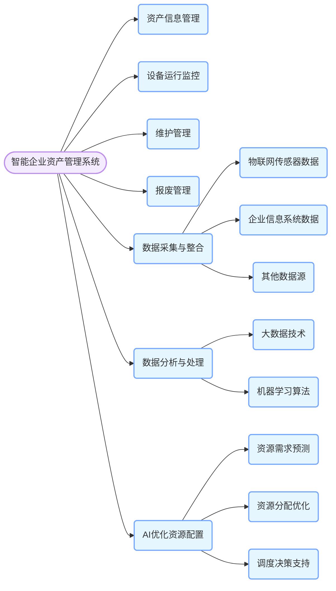

# 构建智能企业资产管理系统：AI优化资源配置

> 关键词：智能企业资产管理系统、AI、资源配置、优化、大数据、机器学习、物联网

> 摘要：本文围绕构建智能企业资产管理系统展开，详细阐述了如何利用AI技术实现资源的优化配置。首先介绍了相关背景，包括目的、预期读者等内容；接着深入探讨核心概念与联系，通过示意图和流程图进行清晰展示；阐述核心算法原理并给出Python源代码示例；讲解数学模型和公式并举例说明；进行项目实战，包含开发环境搭建、源代码实现与解读；分析实际应用场景；推荐相关工具和资源；最后总结未来发展趋势与挑战，提供常见问题解答和扩展阅读参考资料，旨在为企业构建智能资产管理系统、提升资源配置效率提供全面且深入的技术指导。

## 1. 背景介绍 
### 1.1 目的和范围
企业的资产是其运营和发展的基础，有效的资产管理能够提高企业的运营效率、降低成本并增强竞争力。然而，传统的企业资产管理方式往往依赖人工操作，存在数据不准确、管理效率低下、资源配置不合理等问题。本文章的目的在于探讨如何构建智能企业资产管理系统，利用人工智能（AI）技术对企业的资产进行全面、高效的管理，实现资源的优化配置。

本文章的范围涵盖智能企业资产管理系统的各个方面，包括核心概念、算法原理、数学模型、项目实战、实际应用场景等，旨在为企业提供一个完整的技术解决方案。

### 1.2 预期读者
本文预期读者包括企业的管理人员、技术人员、IT从业者以及对智能企业资产管理系统和AI技术感兴趣的人士。对于企业管理人员，本文可以帮助他们了解智能企业资产管理系统的价值和应用，为企业的决策提供参考；对于技术人员和IT从业者，本文可以提供详细的技术指导和实现思路，帮助他们构建和优化智能企业资产管理系统；对于对AI技术感兴趣的人士，本文可以作为一个学习和了解AI在企业资产管理中应用的资料。

### 1.3 文档结构概述
本文将按照以下结构进行组织：
1. **背景介绍**：介绍文章的目的、预期读者、文档结构概述和术语表。
2. **核心概念与联系**：阐述智能企业资产管理系统和AI优化资源配置的核心概念，展示它们之间的联系，并通过文本示意图和Mermaid流程图进行说明。
3. **核心算法原理 & 具体操作步骤**：讲解实现AI优化资源配置的核心算法原理，并给出Python源代码示例和具体操作步骤。
4. **数学模型和公式 & 详细讲解 & 举例说明**：介绍相关的数学模型和公式，进行详细讲解，并通过实际例子进行说明。
5. **项目实战：代码实际案例和详细解释说明**：通过一个项目实战，介绍开发环境搭建、源代码详细实现和代码解读。
6. **实际应用场景**：分析智能企业资产管理系统在不同行业的实际应用场景。
7. **工具和资源推荐**：推荐相关的学习资源、开发工具框架和论文著作。
8. **总结：未来发展趋势与挑战**：总结智能企业资产管理系统的未来发展趋势和面临的挑战。
9. **附录：常见问题与解答**：解答关于智能企业资产管理系统和AI优化资源配置的常见问题。
10. **扩展阅读 & 参考资料**：提供扩展阅读的资料和参考资料。

### 1.4 术语表
#### 1.4.1 核心术语定义
- **智能企业资产管理系统**：利用先进的信息技术和管理理念，对企业的资产进行全面、动态、智能化管理的系统。
- **AI（人工智能）**：研究、开发用于模拟、延伸和扩展人的智能的理论、方法、技术及应用系统的一门新的技术科学。
- **资源配置**：对相对稀缺的资源在各种不同用途之间加以比较作出的选择。
- **大数据**：指无法在一定时间范围内用常规软件工具进行捕捉、管理和处理的数据集合，是需要新处理模式才能具有更强的决策力、洞察发现力和流程优化能力的海量、高增长率和多样化的信息资产。
- **机器学习**：一门多领域交叉学科，涉及概率论、统计学、逼近论、凸分析、算法复杂度理论等多门学科。它专门研究计算机怎样模拟或实现人类的学习行为，以获取新的知识或技能，重新组织已有的知识结构使之不断改善自身的性能。
- **物联网**：通过各种信息传感器、射频识别技术、全球定位系统、红外感应器、激光扫描器等各种装置与技术，实时采集任何需要监控、 连接、互动的物体或过程，采集其声、光、热、电、力学、化学、生物、位置等各种需要的信息，通过各类可能的网络接入，实现物与物、物与人的泛在连接，实现对物品和过程的智能化感知、识别和管理。

#### 1.4.2 相关概念解释
- **资产全生命周期管理**：对资产从规划、采购、使用、维护、更新到报废的整个生命周期进行管理，以提高资产的使用效率和效益。
- **预测性维护**：利用数据分析和机器学习技术，对资产的运行状态进行实时监测和预测，提前发现潜在的故障和问题，采取预防性措施，减少设备停机时间和维修成本。
- **优化算法**：用于在一定的约束条件下，寻找最优解的算法，如遗传算法、粒子群算法等。

#### 1.4.3 缩略词列表
- **AI**：Artificial Intelligence（人工智能）
- **IoT**：Internet of Things（物联网）
- **ML**：Machine Learning（机器学习）
- **ERP**：Enterprise Resource Planning（企业资源计划）

## 2. 核心概念与联系 

### 智能企业资产管理系统核心概念
智能企业资产管理系统是一个综合性的管理系统，它集成了企业的资产信息、设备运行数据、维护记录等多方面的数据，通过数据分析和处理，实现对资产的全面、动态管理。该系统的核心目标是提高资产的使用效率、降低维护成本、延长资产的使用寿命。

### AI优化资源配置核心概念
AI优化资源配置是指利用人工智能技术，对企业的资源进行合理的分配和调度，以实现资源的最大化利用。AI技术可以通过对大量数据的分析和学习，预测企业的需求和资源的使用情况，从而制定最优的资源配置方案。

### 两者之间的联系
智能企业资产管理系统为AI优化资源配置提供了数据基础，而AI优化资源配置则为智能企业资产管理系统提供了决策支持。通过将AI技术应用于智能企业资产管理系统中，可以实现对企业资产的智能化管理和资源的优化配置，提高企业的运营效率和竞争力。

### 文本示意图
```plaintext
智能企业资产管理系统
|
|-- 资产信息管理
|-- 设备运行监控
|-- 维护管理
|-- 报废管理
|
|-- 数据采集与整合
|   |
|   |-- 物联网传感器数据
|   |-- 企业信息系统数据
|   |-- 其他数据源
|
|-- 数据分析与处理
|   |
|   |-- 大数据技术
|   |-- 机器学习算法
|
|-- AI优化资源配置
    |
    |-- 资源需求预测
    |-- 资源分配优化
    |-- 调度决策支持
```

### Mermaid流程图


## 3. 核心算法原理 & 具体操作步骤 

### 核心算法原理
在智能企业资产管理系统中，实现AI优化资源配置的核心算法主要包括机器学习算法和优化算法。

#### 机器学习算法
机器学习算法可以用于对资产的运行状态进行预测和分析，例如通过对设备的历史运行数据进行学习，预测设备的故障概率和剩余使用寿命。常用的机器学习算法包括决策树、随机森林、支持向量机、神经网络等。

以下是一个使用Python的Scikit-learn库实现的简单决策树回归模型示例，用于预测设备的剩余使用寿命：
```python
import numpy as np
from sklearn.tree import DecisionTreeRegressor
from sklearn.model_selection import train_test_split
from sklearn.metrics import mean_squared_error

# 生成示例数据
np.random.seed(42)
X = np.random.rand(100, 5)  # 100个样本，每个样本有5个特征
y = np.random.rand(100)     # 对应的目标值

# 划分训练集和测试集
X_train, X_test, y_train, y_test = train_test_split(X, y, test_size=0.2, random_state=42)

# 创建决策树回归模型
model = DecisionTreeRegressor()

# 训练模型
model.fit(X_train, y_train)

# 预测
y_pred = model.predict(X_test)

# 计算均方误差
mse = mean_squared_error(y_test, y_pred)
print(f"均方误差: {mse}")
```

#### 优化算法
优化算法可以用于在一定的约束条件下，寻找最优的资源配置方案。常用的优化算法包括遗传算法、粒子群算法、模拟退火算法等。

以下是一个使用Python的`pyswarm`库实现的简单粒子群优化算法示例，用于求解一个简单的优化问题：
```python
from pyswarm import pso

# 定义目标函数
def objective(x):
    return (x[0] - 1) ** 2 + (x[1] - 2.5) ** 2

# 定义约束条件
def constraint(x):
    return [x[0] - 2 * x[1] + 2, -x[0] - 2 * x[1] + 6, -x[0] + 2 * x[1] + 2]

# 定义变量的边界
lb = [0, 0]
ub = [10, 10]

# 运行粒子群优化算法
xopt, fopt = pso(objective, lb, ub, f_ieqcons=constraint)

print(f"最优解: {xopt}")
print(f"最优目标值: {fopt}")
```

### 具体操作步骤
1. **数据收集**：收集企业的资产信息、设备运行数据、维护记录等相关数据。
2. **数据预处理**：对收集到的数据进行清洗、转换和归一化等预处理操作，以提高数据的质量和可用性。
3. **特征工程**：从预处理后的数据中提取有价值的特征，用于模型训练。
4. **模型选择与训练**：根据具体的问题选择合适的机器学习算法和优化算法，并使用训练数据对模型进行训练。
5. **模型评估与优化**：使用测试数据对训练好的模型进行评估，根据评估结果对模型进行优化。
6. **资源配置优化**：将训练好的模型应用于实际的资源配置问题中，根据模型的预测结果和优化算法的求解结果，制定最优的资源配置方案。
7. **监控与调整**：对资源配置方案的实施效果进行实时监控，根据实际情况对方案进行调整和优化。

## 4. 数学模型和公式 & 详细讲解 & 举例说明 

### 机器学习模型的数学基础
#### 决策树回归模型
决策树回归模型是一种基于树结构进行决策的机器学习模型。其基本思想是将数据集按照某个特征的取值进行划分，直到划分的子集满足一定的条件为止。

决策树回归模型的目标是最小化每个子集中样本的目标值的均方误差。假设我们有一个数据集 $D = \{(x_1, y_1), (x_2, y_2), \cdots, (x_n, y_n)\}$，其中 $x_i$ 是第 $i$ 个样本的特征向量，$y_i$ 是对应的目标值。对于一个节点 $t$，其包含的样本集合为 $D_t$，该节点的预测值为：
$$
\hat{y}_t = \frac{1}{|D_t|} \sum_{(x_i, y_i) \in D_t} y_i
$$
其中 $|D_t|$ 是集合 $D_t$ 中样本的数量。

节点 $t$ 的均方误差为：
$$
MSE_t = \frac{1}{|D_t|} \sum_{(x_i, y_i) \in D_t} (y_i - \hat{y}_t)^2
$$

在构建决策树时，我们需要选择一个最优的特征和划分点，使得划分后的子节点的均方误差之和最小。

#### 粒子群优化算法
粒子群优化算法是一种基于群体智能的优化算法，其基本思想是通过模拟鸟群或鱼群的群体行为来寻找最优解。

在粒子群优化算法中，每个粒子代表一个潜在的解，粒子在搜索空间中移动，通过不断更新自己的位置和速度来寻找最优解。

设第 $i$ 个粒子的位置为 $x_i = (x_{i1}, x_{i2}, \cdots, x_{id})$，速度为 $v_i = (v_{i1}, v_{i2}, \cdots, v_{id})$，其中 $d$ 是问题的维度。

粒子的速度更新公式为：
$$
v_{ij}(t + 1) = w v_{ij}(t) + c_1 r_1 (p_{ij} - x_{ij}(t)) + c_2 r_2 (g_j - x_{ij}(t))
$$
其中 $w$ 是惯性权重，$c_1$ 和 $c_2$ 是学习因子，$r_1$ 和 $r_2$ 是 $[0, 1]$ 之间的随机数，$p_{ij}$ 是第 $i$ 个粒子的个体最优位置的第 $j$ 维，$g_j$ 是全局最优位置的第 $j$ 维。

粒子的位置更新公式为：
$$
x_{ij}(t + 1) = x_{ij}(t) + v_{ij}(t + 1)
$$

### 举例说明
#### 决策树回归模型举例
假设我们有一个简单的数据集，包含设备的运行时间、温度、压力等特征，以及对应的设备剩余使用寿命。我们可以使用决策树回归模型来预测设备的剩余使用寿命。

| 运行时间（小时） | 温度（℃） | 压力（MPa） | 剩余使用寿命（小时） |
|------------------|-----------|-------------|----------------------|
| 100              | 50        | 2           | 500                  |
| 200              | 60        | 3           | 400                  |
| 300              | 70        | 4           | 300                  |
| 400              | 80        | 5           | 200                  |
| 500              | 90        | 6           | 100                  |

我们可以使用前面给出的Python代码示例对这个数据集进行训练和预测，得到设备剩余使用寿命的预测值。

#### 粒子群优化算法举例
假设我们要在一个二维平面上寻找函数 $f(x, y) = (x - 1)^2 + (y - 2.5)^2$ 的最小值，同时满足约束条件 $x - 2y + 2 \geq 0$，$-x - 2y + 6 \geq 0$，$-x + 2y + 2 \geq 0$。

我们可以使用前面给出的Python代码示例，通过粒子群优化算法来求解这个优化问题，得到最优解和最优目标值。

## 5. 项目实战：代码实际案例和详细解释说明 

### 5.1  开发环境搭建
#### 操作系统
可以选择Windows、Linux或macOS等常见的操作系统。

#### 编程语言和开发工具
- **Python**：选择Python 3.x版本，建议使用Anaconda发行版，它包含了许多常用的科学计算库。
- **集成开发环境（IDE）**：可以选择PyCharm、Jupyter Notebook等。

#### 安装必要的库
在命令行中使用以下命令安装必要的库：
```sh
pip install numpy pandas scikit-learn pyswarm
```

### 5.2  源代码详细实现和代码解读
#### 数据准备
首先，我们需要准备一个包含资产信息和相关数据的数据集。假设我们有一个CSV文件`asset_data.csv`，包含以下列：`运行时间`、`温度`、`压力`、`剩余使用寿命`。

```python
import pandas as pd

# 读取数据
data = pd.read_csv('asset_data.csv')

# 划分特征和目标值
X = data[['运行时间', '温度', '压力']]
y = data['剩余使用寿命']
```

#### 数据预处理
对数据进行标准化处理，以提高模型的性能。

```python
from sklearn.preprocessing import StandardScaler

# 创建标准化对象
scaler = StandardScaler()

# 对特征进行标准化
X_scaled = scaler.fit_transform(X)
```

#### 模型训练和预测
使用决策树回归模型进行训练和预测。

```python
from sklearn.tree import DecisionTreeRegressor
from sklearn.model_selection import train_test_split
from sklearn.metrics import mean_squared_error

# 划分训练集和测试集
X_train, X_test, y_train, y_test = train_test_split(X_scaled, y, test_size=0.2, random_state=42)

# 创建决策树回归模型
model = DecisionTreeRegressor()

# 训练模型
model.fit(X_train, y_train)

# 预测
y_pred = model.predict(X_test)

# 计算均方误差
mse = mean_squared_error(y_test, y_pred)
print(f"均方误差: {mse}")
```

#### 资源配置优化
假设我们有一个资源分配问题，需要在满足一定约束条件的情况下，最小化资源分配的成本。我们可以使用粒子群优化算法来求解这个问题。

```python
from pyswarm import pso

# 定义目标函数
def objective(x):
    # 假设目标函数是资源分配的成本
    return x[0] ** 2 + x[1] ** 2

# 定义约束条件
def constraint(x):
    # 假设约束条件是资源分配的总量限制
    return [x[0] + x[1] - 10]

# 定义变量的边界
lb = [0, 0]
ub = [10, 10]

# 运行粒子群优化算法
xopt, fopt = pso(objective, lb, ub, f_ieqcons=constraint)

print(f"最优解: {xopt}")
print(f"最优目标值: {fopt}")
```

### 5.3  代码解读与分析
#### 数据准备部分
- 使用`pandas`库读取CSV文件，将数据加载到DataFrame中。
- 划分特征和目标值，以便后续的模型训练。

#### 数据预处理部分
- 使用`StandardScaler`对特征进行标准化处理，使得所有特征具有相同的尺度，避免某些特征对模型的影响过大。

#### 模型训练和预测部分
- 使用`train_test_split`函数将数据集划分为训练集和测试集，比例为80:20。
- 创建`DecisionTreeRegressor`模型，并使用训练集进行训练。
- 使用训练好的模型对测试集进行预测，并计算均方误差，评估模型的性能。

#### 资源配置优化部分
- 定义目标函数`objective`，表示资源分配的成本。
- 定义约束条件`constraint`，表示资源分配的总量限制。
- 使用`pso`函数运行粒子群优化算法，求解最优的资源分配方案。

## 6. 实际应用场景 
### 制造业
在制造业中，智能企业资产管理系统可以对生产设备进行实时监控和管理，通过AI技术预测设备的故障概率和剩余使用寿命，实现预测性维护，减少设备停机时间，提高生产效率。同时，利用AI优化资源配置，可以合理安排生产计划，优化原材料和劳动力的分配，降低生产成本。

### 能源行业
在能源行业，智能企业资产管理系统可以对发电设备、输电线路等资产进行管理，通过对设备运行数据的分析，优化设备的运行参数，提高能源生产效率。在资源配置方面，AI技术可以根据能源需求的预测，合理分配能源资源，实现能源的高效利用。

### 交通运输业
在交通运输业，智能企业资产管理系统可以对车辆、船舶、飞机等运输设备进行管理，通过实时监控设备的运行状态，确保运输安全。利用AI优化资源配置，可以合理安排运输路线和调度车辆，提高运输效率，降低运输成本。

### 金融行业
在金融行业，智能企业资产管理系统可以对金融资产进行管理，通过对市场数据的分析和预测，优化资产配置，降低投资风险。同时，利用AI技术可以对客户的信用风险进行评估，提高金融机构的风险管理能力。

## 7. 工具和资源推荐
### 7.1 学习资源推荐
#### 7.1.1 书籍推荐
- 《机器学习》（周志华）：全面介绍了机器学习的基本概念、算法和应用，是学习机器学习的经典教材。
- 《Python机器学习》（Sebastian Raschka）：结合Python语言，详细介绍了机器学习的算法和实现，适合初学者。
- 《人工智能：一种现代的方法》（Stuart Russell, Peter Norvig）：人工智能领域的经典著作，全面介绍了人工智能的理论、算法和应用。

#### 7.1.2 在线课程
- Coursera上的“机器学习”课程（Andrew Ng）：由斯坦福大学教授Andrew Ng主讲，是学习机器学习的经典课程。
- edX上的“人工智能基础”课程：介绍了人工智能的基本概念、算法和应用。
- 中国大学MOOC上的“Python数据分析与挖掘实战”课程：结合Python语言，介绍了数据分析和挖掘的方法和应用。

#### 7.1.3 技术博客和网站
- 机器之心（https://www.alternativedata.org/）：专注于人工智能领域的技术和应用，提供最新的技术资讯和深度分析。
- 数据派THU（http://www.datapi.cn/）：关注数据分析和挖掘领域的技术和应用，提供丰富的技术文章和案例分析。
- Kaggle（https://www.kaggle.com/）：一个数据科学竞赛平台，提供大量的数据集和竞赛项目，可以通过参与竞赛来提高自己的技术水平。

### 7.2 开发工具框架推荐
#### 7.2.1 IDE和编辑器
- PyCharm：一款功能强大的Python集成开发环境，提供代码编辑、调试、版本控制等功能。
- Jupyter Notebook：一个交互式的开发环境，适合进行数据探索和模型实验。
- Visual Studio Code：一款轻量级的代码编辑器，支持多种编程语言和插件扩展。

#### 7.2.2 调试和性能分析工具
- PDB：Python自带的调试工具，可以对Python代码进行调试。
- cProfile：Python自带的性能分析工具，可以分析代码的运行时间和函数调用关系。
- Py-Spy：一个用于分析Python程序性能的工具，可以实时查看程序的CPU使用率和函数调用栈。

#### 7.2.3 相关框架和库
- Scikit-learn：一个简单易用的机器学习库，提供了多种机器学习算法和工具。
- TensorFlow：一个开源的深度学习框架，广泛应用于图像识别、自然语言处理等领域。
- PyTorch：一个开源的深度学习框架，具有动态图的特点，易于使用和调试。

### 7.3 相关论文著作推荐
#### 7.3.1 经典论文
- “A Decision-Theoretic Generalization of On-Line Learning and an Application to Boosting”（Yoav Freund, Robert E. Schapire）：介绍了AdaBoost算法的基本原理和应用。
- “Gradient-Based Learning Applied to Document Recognition”（Yann LeCun, Léon Bottou, Yoshua Bengio, Patrick Haffner）：介绍了卷积神经网络（CNN）在手写字符识别中的应用。
- “Long Short-Term Memory”（Sepp Hochreiter, Jürgen Schmidhuber）：介绍了长短期记忆网络（LSTM）的基本原理和应用。

#### 7.3.2 最新研究成果
- 关注顶级学术会议如NeurIPS、ICML、CVPR等的最新研究成果，了解人工智能领域的最新发展趋势。
- 阅读顶级学术期刊如Journal of Artificial Intelligence Research（JAIR）、Artificial Intelligence等的最新论文，获取高质量的研究成果。

#### 7.3.3 应用案例分析
- 参考相关企业和机构发布的应用案例分析报告，了解智能企业资产管理系统和AI优化资源配置在实际应用中的经验和教训。
- 关注行业论坛和社交媒体上的案例分享，获取最新的应用案例和实践经验。

## 8. 总结：未来发展趋势与挑战
### 未来发展趋势
#### 智能化程度不断提高
随着AI技术的不断发展，智能企业资产管理系统的智能化程度将不断提高。系统将能够自动感知资产的状态和环境变化，自动调整资源配置方案，实现更加智能化的管理。

#### 与物联网的深度融合
物联网技术的发展将为智能企业资产管理系统提供更多的数据来源。通过与物联网的深度融合，系统可以实时获取资产的运行数据和位置信息，实现对资产的全面、实时监控和管理。

#### 云计算和边缘计算的应用
云计算和边缘计算技术的应用将为智能企业资产管理系统提供更强大的计算能力和存储能力。系统可以将数据处理和分析任务分布到云端和边缘设备上，提高系统的性能和响应速度。

#### 跨领域融合
智能企业资产管理系统将与其他领域的技术进行跨领域融合，如区块链、大数据、虚拟现实等。通过跨领域融合，系统将能够提供更加全面、高效的服务。

### 面临的挑战
#### 数据安全和隐私问题
智能企业资产管理系统涉及大量的企业敏感数据，如资产信息、设备运行数据等。如何保障数据的安全和隐私是一个重要的挑战。需要采取有效的数据加密、访问控制等措施，防止数据泄露和滥用。

#### 算法复杂度和可解释性问题
AI算法的复杂度较高，特别是深度学习算法，需要大量的计算资源和数据。同时，一些AI算法的可解释性较差，难以理解模型的决策过程。如何降低算法的复杂度，提高算法的可解释性是一个需要解决的问题。

#### 人才短缺问题
智能企业资产管理系统的开发和应用需要既懂AI技术又懂企业管理的复合型人才。目前，这类人才相对短缺，如何培养和吸引相关人才是企业面临的一个挑战。

#### 标准和规范问题
目前，智能企业资产管理系统的标准和规范还不够完善，不同企业和系统之间的数据格式和接口不统一，导致数据共享和集成困难。如何制定统一的标准和规范，促进系统的互操作性和数据共享是一个重要的问题。

## 9. 附录：常见问题与解答
### 1. 智能企业资产管理系统与传统资产管理系统有什么区别？
智能企业资产管理系统利用先进的信息技术和AI技术，实现对资产的全面、动态、智能化管理。与传统资产管理系统相比，智能企业资产管理系统具有以下优点：
- **数据驱动**：通过对大量数据的分析和处理，提供更准确的决策支持。
- **预测性维护**：能够预测设备的故障概率和剩余使用寿命，提前采取预防性措施，减少设备停机时间。
- **资源优化配置**：利用AI技术优化资源的分配和调度，提高资源的利用效率。
- **实时监控**：实时监控资产的运行状态和环境变化，及时发现问题并采取措施。

### 2. 如何选择适合的AI算法？
选择适合的AI算法需要考虑以下因素：
- **问题类型**：根据具体的问题类型，如分类、回归、聚类等，选择合适的算法。
- **数据特点**：考虑数据的规模、维度、分布等特点，选择适合的算法。
- **算法性能**：比较不同算法的性能指标，如准确率、召回率、均方误差等，选择性能最优的算法。
- **可解释性**：如果需要解释模型的决策过程，选择可解释性较好的算法，如决策树、线性回归等。

### 3. 如何保障智能企业资产管理系统的数据安全？
保障智能企业资产管理系统的数据安全可以采取以下措施：
- **数据加密**：对敏感数据进行加密处理，防止数据在传输和存储过程中被窃取。
- **访问控制**：设置严格的访问权限，只有授权人员才能访问和操作数据。
- **备份和恢复**：定期对数据进行备份，确保在数据丢失或损坏时能够及时恢复。
- **安全审计**：对系统的操作和访问进行审计，及时发现和处理安全事件。

### 4. 智能企业资产管理系统的实施需要注意哪些问题？
智能企业资产管理系统的实施需要注意以下问题：
- **需求分析**：充分了解企业的业务需求和管理流程，确保系统能够满足企业的实际需求。
- **数据质量**：确保数据的准确性、完整性和一致性，提高数据的质量。
- **系统集成**：考虑系统与企业现有信息系统的集成，实现数据的共享和交互。
- **人员培训**：对相关人员进行系统培训，提高他们的操作技能和应用水平。
- **项目管理**：制定合理的项目计划和进度安排，加强项目管理，确保项目的顺利实施。

## 10. 扩展阅读 & 参考资料
### 扩展阅读
- 《工业4.0：正在发生的未来》（乌尔里希·森德勒）：介绍了工业4.0的概念、技术和应用，探讨了智能企业资产管理系统在工业4.0中的作用和发展趋势。
- 《大数据时代：生活、工作与思维的大变革》（维克托·迈尔 - 舍恩伯格, 肯尼思·库克耶）：介绍了大数据的概念、技术和应用，为智能企业资产管理系统的数据处理和分析提供了理论基础。
- 《人工智能时代：人与机器共舞》（李开复, 王咏刚）：介绍了人工智能的发展历程、技术和应用，探讨了人工智能对企业管理和社会发展的影响。

### 参考资料
- [Scikit-learn官方文档](https://scikit-learn.org/stable/)
- [TensorFlow官方文档](https://www.tensorflow.org/)
- [PyTorch官方文档](https://pytorch.org/)
- [pyswarm库文档](https://pythonhosted.org/pyswarm/)
- [工业和信息化部关于推动工业互联网加快发展的通知](https://www.miit.gov.cn/xxxgk/gongbao/202004/t20200422_3693348.html)