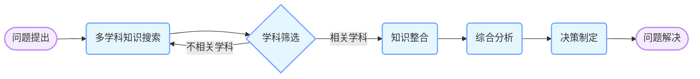

# 查理·芒格的多元思维模型实际案例分析

> 关键词：查理·芒格、多元思维模型、实际案例、投资决策、跨学科知识

> 摘要：本文旨在深入剖析查理·芒格的多元思维模型，并通过实际案例进行详细分析。多元思维模型强调跨学科知识的运用，以更全面、深入的视角看待问题和做出决策。文章首先介绍多元思维模型的背景，包括其目的、预期读者等；接着阐述核心概念与联系，构建相应的流程图；然后讲解核心算法原理和具体操作步骤，并结合数学模型和公式进行说明；通过项目实战的代码案例进一步解释多元思维模型的应用；探讨其实际应用场景；推荐相关的工具和资源；最后总结未来发展趋势与挑战，解答常见问题并提供扩展阅读和参考资料，帮助读者更好地理解和运用多元思维模型。

## 1. 背景介绍 
### 1.1 目的和范围
查理·芒格的多元思维模型是一种极具价值的思考方式和决策工具。本文章的目的在于深入研究这一模型，并通过实际案例展示其在不同领域的应用效果。范围涵盖对多元思维模型的理论解析、算法原理、数学模型的探讨，以及在投资、商业决策等实际场景中的具体应用案例分析。通过全面的研究和分析，帮助读者理解和掌握如何运用多元思维模型来提升决策的质量和效率。

### 1.2 预期读者
本文预期读者包括对投资、商业决策、思维方法等领域感兴趣的人士，如投资者、企业管理者、创业者、学生以及对知识管理和思维提升有需求的人群。无论是专业人士寻求更深入的决策方法，还是初学者希望拓展思维视野，都能从本文中获得有价值的信息和启发。

### 1.3 文档结构概述
本文将按照以下结构展开：首先介绍多元思维模型的背景信息，包括目的、预期读者和文档结构概述等；接着阐述核心概念与联系，通过文本示意图和 Mermaid 流程图清晰展示模型的架构；然后讲解核心算法原理和具体操作步骤，并结合 Python 代码进行详细说明；通过数学模型和公式进一步深入分析；通过项目实战的代码案例详细解释多元思维模型在实际中的应用；探讨其实际应用场景；推荐相关的学习资源、开发工具框架和论文著作；最后总结未来发展趋势与挑战，解答常见问题并提供扩展阅读和参考资料。

### 1.4 术语表
#### 1.4.1 核心术语定义
- **多元思维模型**：查理·芒格提出的一种思维方式，主张从多个不同学科的角度去分析和解决问题，综合运用多学科的知识和方法，以获得更全面、深入的理解和更合理的决策。
- **跨学科知识**：涉及多个不同学科领域的知识，如经济学、心理学、数学、物理学、生物学等，将这些不同学科的知识融合运用到实际问题的解决中。

#### 1.4.2 相关概念解释
- **思维格栅理论**：这是多元思维模型的一种形象化表述，将不同学科的思维方式和知识看作是格栅的不同栏栅，通过构建这样的思维格栅，能够从多个角度观察和思考问题，避免单一思维的局限性。
- **决策树**：一种决策分析工具，通过构建树形结构，将不同的决策路径和可能的结果展示出来，帮助决策者在复杂的情况下做出更合理的决策。在多元思维模型中，决策树可以结合多学科的知识和因素进行构建。

#### 1.4.3 缩略词列表
无

## 2. 核心概念与联系 
### 核心概念原理
多元思维模型的核心原理在于认识到世界是复杂的，单一学科的知识往往不足以全面、准确地理解和解决问题。不同学科的知识和方法都有其独特的视角和优势，通过将这些不同学科的思维方式和知识融合在一起，能够形成一个更全面、深入的思维体系。

例如，在投资决策中，仅仅从经济学的角度考虑公司的财务状况和市场趋势是不够的。还需要结合心理学的知识，了解投资者的情绪和行为对市场的影响；运用数学的方法进行风险评估和收益计算；考虑物理学中的熵增原理，理解企业在竞争环境中的变化趋势；借鉴生物学中的进化理论，分析企业的适应性和竞争力等。

### 架构的文本示意图
多元思维模型的架构可以看作是一个以问题为中心，由多个不同学科的知识和思维方式组成的网络。每个学科的知识和思维方式就像网络中的节点，通过相互连接和交互，形成一个有机的整体。当面对一个问题时，这个网络会从各个节点获取相关的信息和方法，进行综合分析和判断，从而得出更合理的解决方案。

### Mermaid 流程图

这个流程图展示了多元思维模型的基本运作过程。首先提出问题，然后进行多学科知识的搜索，对搜索到的学科进行筛选，将相关学科的知识进行整合，通过综合分析得出决策，最终实现问题的解决。

## 3. 核心算法原理 & 具体操作步骤 
### 核心算法原理
多元思维模型的核心算法原理可以看作是一个信息整合和决策优化的过程。其基本思想是从多个不同的学科领域获取相关的信息和知识，将这些信息进行整合和分析，然后根据一定的决策准则做出最优决策。

### 具体操作步骤
1. **问题定义**：明确需要解决的问题，确保问题的描述清晰、准确。例如，在投资决策中，问题可能是“是否应该投资某家公司的股票”。
2. **学科选择**：根据问题的性质和特点，选择可能相关的学科领域。对于投资决策问题，可能涉及的学科包括经济学、会计学、金融学、心理学、管理学等。
3. **知识获取**：从选择的学科领域中获取相关的知识和信息。可以通过阅读书籍、文献、报告，咨询专家等方式进行。例如，从经济学中了解宏观经济环境和行业趋势，从会计学中获取公司的财务报表和财务指标等。
4. **知识整合**：将获取的不同学科的知识和信息进行整合，形成一个综合的信息集合。在整合过程中，需要注意不同学科知识之间的联系和相互影响。例如，将公司的财务指标与行业趋势相结合，分析公司的竞争力和发展前景。
5. **分析与评估**：运用综合的信息集合，对问题进行分析和评估。可以采用各种分析方法和工具，如 SWOT 分析、财务比率分析、风险评估模型等。例如，通过 SWOT 分析，评估公司的优势、劣势、机会和威胁，从而判断投资的可行性。
6. **决策制定**：根据分析和评估的结果，结合一定的决策准则，做出最终的决策。决策准则可以是基于风险偏好、收益目标等因素确定的。例如，如果投资者风险偏好较低，可能会更倾向于选择风险较小、收益稳定的投资项目。

### Python 源代码详细阐述
```python
# 定义问题类
class Problem:
    def __init__(self, description):
        self.description = description

# 定义学科类
class Discipline:
    def __init__(self, name):
        self.name = name
        self.knowledge = []

    def add_knowledge(self, knowledge):
        self.knowledge.append(knowledge)

# 定义多元思维模型类
class MultiDisciplinaryThinkingModel:
    def __init__(self, problem):
        self.problem = problem
        self.disciplines = []

    def add_discipline(self, discipline):
        self.disciplines.append(discipline)

    def integrate_knowledge(self):
        integrated_knowledge = []
        for discipline in self.disciplines:
            integrated_knowledge.extend(discipline.knowledge)
        return integrated_knowledge

    def analyze_and_evaluate(self, integrated_knowledge):
        # 这里简单模拟分析和评估过程，实际中需要根据具体问题和方法实现
        evaluation_result = "初步评估结果：需要进一步研究"
        return evaluation_result

    def make_decision(self, evaluation_result):
        # 这里简单模拟决策制定过程，实际中需要根据决策准则实现
        if "需要进一步研究" in evaluation_result:
            decision = "暂不做决策，继续收集信息"
        else:
            decision = "根据评估结果做出决策"
        return decision

# 示例使用
if __name__ == "__main__":
    # 定义问题
    problem = Problem("是否应该投资某家公司的股票")

    # 定义学科
    economics = Discipline("经济学")
    economics.add_knowledge("宏观经济环境分析")
    economics.add_knowledge("行业趋势预测")

    accounting = Discipline("会计学")
    accounting.add_knowledge("公司财务报表分析")
    accounting.add_knowledge("财务指标计算")

    # 创建多元思维模型
    model = MultiDisciplinaryThinkingModel(problem)
    model.add_discipline(economics)
    model.add_discipline(accounting)

    # 整合知识
    integrated_knowledge = model.integrate_knowledge()

    # 分析与评估
    evaluation_result = model.analyze_and_evaluate(integrated_knowledge)

    # 决策制定
    decision = model.make_decision(evaluation_result)

    print(f"问题：{problem.description}")
    print(f"整合知识：{integrated_knowledge}")
    print(f"评估结果：{evaluation_result}")
    print(f"决策：{decision}")
```
这段代码通过定义问题类、学科类和多元思维模型类，实现了多元思维模型的基本操作步骤。首先定义问题，然后选择相关学科并添加知识，接着整合知识，进行分析和评估，最后根据评估结果做出决策。

## 4. 数学模型和公式 & 详细讲解 & 举例说明 
### 数学模型
在多元思维模型中，可以使用决策树模型来辅助决策。决策树是一种基于概率和收益的决策分析工具，通过构建树形结构，将不同的决策路径和可能的结果展示出来。

### 公式
设 $S$ 为决策问题的所有可能状态，$A$ 为所有可能的决策方案，$P(s)$ 为状态 $s \in S$ 发生的概率，$R(a, s)$ 为在状态 $s$ 下采取决策方案 $a \in A$ 的收益。则决策方案 $a$ 的期望收益 $E(a)$ 可以表示为：
$$E(a) = \sum_{s \in S} P(s) \times R(a, s)$$

### 详细讲解
这个公式的含义是，对于每个决策方案 $a$，其期望收益是所有可能状态下的收益乘以该状态发生的概率之和。通过计算不同决策方案的期望收益，可以选择期望收益最大的方案作为最优决策。

### 举例说明
假设我们面临一个投资决策问题，有两种投资方案：方案 $A$ 投资股票，方案 $B$ 投资债券。市场有两种可能状态：牛市和熊市，牛市发生的概率为 $P(牛市) = 0.6$，熊市发生的概率为 $P(熊市) = 0.4$。在牛市和熊市下，两种投资方案的收益如下表所示：

| 状态 | 方案 A 收益 | 方案 B 收益 |
| ---- | ---- | ---- |
| 牛市 | 10000 元 | 5000 元 |
| 熊市 | -5000 元 | 2000 元 |

根据上述公式，计算方案 $A$ 的期望收益：
$$E(A) = P(牛市) \times R(A, 牛市) + P(熊市) \times R(A, 熊市)$$
$$= 0.6 \times 10000 + 0.4 \times (-5000)$$
$$= 6000 - 2000$$
$$= 4000$$

计算方案 $B$ 的期望收益：
$$E(B) = P(牛市) \times R(B, 牛市) + P(熊市) \times R(B, 熊市)$$
$$= 0.6 \times 5000 + 0.4 \times 2000$$
$$= 3000 + 800$$
$$= 3800$$

由于 $E(A) > E(B)$，所以选择方案 $A$ 投资股票作为最优决策。

## 5. 项目实战：代码实际案例和详细解释说明 
### 5.1  开发环境搭建
在进行多元思维模型的项目实战时，我们可以使用 Python 语言进行开发。以下是开发环境搭建的步骤：
1. **安装 Python**：从 Python 官方网站（https://www.python.org/downloads/）下载并安装适合你操作系统的 Python 版本。建议安装 Python 3.x 版本。
2. **安装开发工具**：可以选择使用 PyCharm、VS Code 等集成开发环境（IDE），或者使用 Jupyter Notebook 进行交互式开发。
3. **安装必要的库**：在项目中，我们可能需要使用一些 Python 库，如 `pandas`、`numpy` 等。可以使用 `pip` 命令进行安装，例如：
```sh
pip install pandas numpy
```

### 5.2  源代码详细实现和代码解读
以下是一个更复杂的多元思维模型在投资决策中的项目实战代码示例：
```python
import pandas as pd
import numpy as np

# 定义公司类
class Company:
    def __init__(self, name, financial_data, industry_trend):
        self.name = name
        self.financial_data = financial_data
        self.industry_trend = industry_trend

    def get_financial_ratio(self, ratio_type):
        if ratio_type == "ROE":
            return self.financial_data["net_income"] / self.financial_data["equity"]
        elif ratio_type == "PE":
            return self.financial_data["market_value"] / self.financial_data["net_income"]
        else:
            return None

    def is_industry_growing(self):
        return self.industry_trend > 0

# 定义投资者类
class Investor:
    def __init__(self, risk_preference, investment_goal):
        self.risk_preference = risk_preference
        self.investment_goal = investment_goal

    def evaluate_company(self, company):
        roe = company.get_financial_ratio("ROE")
        pe = company.get_financial_ratio("PE")
        industry_growing = company.is_industry_growing()

        # 简单的评估模型，根据不同指标和投资者偏好进行评估
        if roe > 0.1 and pe < 20 and industry_growing and self.risk_preference == "moderate":
            return "值得投资"
        elif roe > 0.15 and pe < 15 and industry_growing and self.risk_preference == "aggressive":
            return "强烈推荐投资"
        else:
            return "不建议投资"

# 示例使用
if __name__ == "__main__":
    # 定义公司财务数据和行业趋势
    financial_data = {
        "net_income": 1000000,
        "equity": 5000000,
        "market_value": 20000000
    }
    industry_trend = 0.1

    # 创建公司对象
    company = Company("ABC 公司", financial_data, industry_trend)

    # 创建投资者对象
    investor = Investor("moderate", "长期增值")

    # 评估公司
    evaluation_result = investor.evaluate_company(company)

    print(f"公司名称：{company.name}")
    print(f"评估结果：{evaluation_result}")
```
### 代码解读与分析
1. **公司类（`Company`）**：
    - 该类用于表示一家公司，包含公司名称、财务数据和行业趋势等属性。
    - `get_financial_ratio` 方法用于计算公司的财务比率，如 ROE（净资产收益率）和 PE（市盈率）。
    - `is_industry_growing` 方法用于判断公司所在行业是否处于增长状态。

2. **投资者类（`Investor`）**：
    - 该类用于表示投资者，包含投资者的风险偏好和投资目标等属性。
    - `evaluate_company` 方法用于评估一家公司是否值得投资，根据公司的财务比率、行业趋势和投资者的风险偏好进行综合判断。

3. **示例使用**：
    - 首先定义公司的财务数据和行业趋势，创建公司对象。
    - 然后创建投资者对象，设置投资者的风险偏好和投资目标。
    - 最后调用投资者的 `evaluate_company` 方法对公司进行评估，并输出评估结果。

通过这个项目实战，我们可以看到多元思维模型在投资决策中的应用。在评估公司是否值得投资时，不仅考虑了公司的财务数据（经济学和会计学知识），还考虑了行业趋势（经济学知识）和投资者的风险偏好（心理学知识），体现了多元思维模型的跨学科特点。

## 6. 实际应用场景 
### 投资决策
在投资领域，多元思维模型具有重要的应用价值。投资者可以从多个学科的角度来分析投资项目，如从经济学角度分析宏观经济环境和行业趋势，从会计学角度分析公司的财务状况，从心理学角度了解投资者的情绪和行为对市场的影响，从数学角度进行风险评估和收益计算等。通过综合运用这些学科的知识和方法，投资者可以做出更明智、更合理的投资决策，降低投资风险，提高投资收益。

### 商业决策
在企业的商业决策中，多元思维模型也能发挥重要作用。企业管理者在制定战略规划、产品研发、市场推广等决策时，需要考虑多个方面的因素。例如，在产品研发决策中，不仅要考虑技术可行性（工程学知识），还要考虑市场需求（市场营销学知识）、成本效益（经济学知识）、用户体验（心理学知识）等因素。通过运用多元思维模型，企业管理者可以全面、深入地分析问题，做出更符合企业利益和市场需求的决策。

### 问题解决
在日常生活和工作中，我们会遇到各种各样的问题。多元思维模型可以帮助我们从多个角度看待问题，找到更有效的解决方法。例如，在解决交通拥堵问题时，我们可以从城市规划（城市规划学知识）、交通工程（交通工程学知识）、公共政策（政治学知识）、行为科学（心理学知识）等多个学科的角度进行分析，综合考虑各种因素，制定出更合理、更有效的解决方案。

### 创新创造
在创新创造领域，多元思维模型能够激发创新思维，拓宽创新视野。不同学科的知识和方法可以相互启发、相互融合，产生新的创意和想法。例如，在设计一款新产品时，设计师可以结合工程学、美学、材料科学、人机工程学等多个学科的知识，创造出既实用又美观的产品。在科技创新中，跨学科的研究和合作也越来越受到重视，通过融合不同学科的知识和技术，可以推动科技的进步和创新。

## 7. 工具和资源推荐
### 7.1 学习资源推荐
#### 7.1.1 书籍推荐
- 《穷查理宝典：查理·芒格的智慧箴言录》：这是了解查理·芒格多元思维模型的经典著作，书中收录了芒格的演讲、文章和访谈等内容，详细阐述了他的投资理念、思维方法和人生哲学。
- 《思考，快与慢》：作者丹尼尔·卡尼曼是诺贝尔经济学奖获得者，书中介绍了人类思维的两种模式：快思考和慢思考，并分析了人类在决策过程中存在的认知偏差和心理误区，对于理解多元思维模型中的心理学知识有很大帮助。
- 《经济学原理》：由 N·格里高利·曼昆所著，是经济学领域的经典教材，系统地介绍了经济学的基本原理和方法，对于理解多元思维模型中的经济学知识非常有帮助。

#### 7.1.2 在线课程
- Coursera 上的“机器学习”课程：由斯坦福大学教授吴恩达讲授，该课程系统地介绍了机器学习的基本原理和算法，对于理解多元思维模型中的数据分析和模型构建有很大帮助。
- edX 上的“微观经济学原理”课程：由麻省理工学院教授开设，该课程深入讲解了微观经济学的基本原理和应用，对于理解多元思维模型中的经济学知识有很大帮助。

#### 7.1.3 技术博客和网站
- 雪球网：是一个投资交流平台，汇聚了众多投资者的经验和观点，对于学习投资知识和了解市场动态有很大帮助。
- 36氪：是一个专注于科技、商业和创新的媒体平台，提供了大量的商业资讯、创业故事和科技趋势分析，对于了解商业和科技领域的最新动态有很大帮助。

### 7.2 开发工具框架推荐
#### 7.2.1 IDE和编辑器
- PyCharm：是一款专门为 Python 开发设计的集成开发环境，具有强大的代码编辑、调试、自动完成等功能，适合专业的 Python 开发者使用。
- VS Code：是一款轻量级的代码编辑器，支持多种编程语言，具有丰富的插件生态系统，可以根据需要进行扩展，适合初学者和快速开发。

#### 7.2.2 调试和性能分析工具
- `pdb`：是 Python 自带的调试器，可以帮助开发者在代码中设置断点、单步执行、查看变量值等，方便调试代码。
- `cProfile`：是 Python 标准库中的性能分析工具，可以帮助开发者分析代码的性能瓶颈，找出运行时间较长的代码段。

#### 7.2.3 相关框架和库
- `pandas`：是一个用于数据处理和分析的 Python 库，提供了高效的数据结构和数据分析工具，如数据读取、清洗、转换、统计分析等。
- `numpy`：是一个用于科学计算的 Python 库，提供了高效的多维数组对象和各种数学函数，如矩阵运算、随机数生成等。

### 7.3 相关论文著作推荐
#### 7.3.1 经典论文
- 《有效市场假说》：由尤金·法玛提出，该论文阐述了有效市场的概念和三种形式，对于理解金融市场的效率和投资决策有重要影响。
- 《资本资产定价模型》：由威廉·夏普等人提出，该论文建立了资产预期收益率与风险之间的关系模型，对于资产定价和投资组合管理有重要意义。

#### 7.3.2 最新研究成果
- 关于行为金融学的最新研究成果，探讨了投资者的心理和行为对金融市场的影响，为投资决策提供了新的视角和方法。
- 关于人工智能在投资决策中的应用研究，如机器学习算法在股票预测、风险评估等方面的应用，为投资决策提供了更科学、更精准的方法。

#### 7.3.3 应用案例分析
- 一些大型企业的战略决策案例分析，如苹果公司的产品研发和市场推广策略，通过分析这些案例可以学习到多元思维模型在企业决策中的实际应用。
- 一些成功投资者的投资案例分析，如巴菲特的投资决策过程，通过分析这些案例可以学习到多元思维模型在投资领域的实际应用。

## 8. 总结：未来发展趋势与挑战
### 未来发展趋势
1. **跨学科融合加深**：随着科技的不断进步和社会的发展，各个学科之间的界限越来越模糊，跨学科融合将成为未来的发展趋势。多元思维模型将更加注重不同学科知识的深度融合，产生更多创新的思维方式和解决问题的方法。
2. **人工智能与多元思维模型的结合**：人工智能技术的发展将为多元思维模型的应用提供更强大的工具和支持。例如，通过机器学习算法可以对大量的数据进行分析和挖掘，帮助人们更快速、更准确地获取不同学科的知识和信息；通过自然语言处理技术可以实现不同学科知识的自动整合和分析。
3. **在更多领域的应用**：多元思维模型将不仅仅局限于投资、商业决策等领域，还将在教育、医疗、环保、社会管理等更多领域得到广泛应用。通过运用多元思维模型，可以解决这些领域中复杂的问题，提高决策的质量和效率。

### 挑战
1. **知识获取和整合的难度**：随着学科的不断细分和知识的爆炸式增长，获取和整合不同学科的知识变得越来越困难。需要人们具备更广泛的知识储备和更强的学习能力，同时也需要开发更高效的知识管理工具和方法。
2. **思维方式的转变**：人们长期以来形成的单一学科思维方式很难在短时间内改变，要推广和应用多元思维模型，需要人们进行思维方式的转变。这需要加强教育和培训，提高人们对多元思维模型的认识和理解。
3. **伦理和道德问题**：在多元思维模型的应用过程中，可能会涉及到伦理和道德问题。例如，在人工智能与多元思维模型结合的过程中，如何确保算法的公平性和透明度，如何保护个人隐私和数据安全等，都是需要解决的问题。

## 9. 附录：常见问题与解答
### 问题 1：多元思维模型是否适用于所有问题？
解答：多元思维模型虽然具有很多优点，但并不是适用于所有问题。对于一些简单的、单一领域的问题，可能不需要运用多元思维模型，采用单一学科的方法就可以解决。而对于复杂的、涉及多个领域的问题，多元思维模型可以提供更全面、深入的分析和解决方案。

### 问题 2：如何学习和掌握多元思维模型？
解答：学习和掌握多元思维模型需要从多个方面入手。首先，要广泛学习不同学科的知识，建立起自己的知识体系。其次，要注重实践，将不同学科的知识应用到实际问题的解决中，通过实践来加深对多元思维模型的理解和掌握。此外，还可以阅读相关的书籍、文章，参加培训课程等，学习他人的经验和方法。

### 问题 3：多元思维模型与传统思维方式有什么区别？
解答：传统思维方式往往是从单一学科的角度看待问题，而多元思维模型强调从多个不同学科的角度去分析和解决问题。传统思维方式可能会受到学科界限的限制，导致对问题的理解不够全面和深入；而多元思维模型可以打破学科界限，综合运用多学科的知识和方法，提供更全面、更合理的解决方案。

### 问题 4：在实际应用中，如何选择相关的学科知识？
解答：在实际应用中，选择相关的学科知识需要根据问题的性质和特点来确定。首先，要明确问题的核心和关键因素，然后思考哪些学科的知识和方法可以对这些因素进行分析和解决。可以通过头脑风暴、咨询专家等方式来确定相关的学科知识。同时，要不断积累经验，提高自己选择相关学科知识的能力。

## 10. 扩展阅读 & 参考资料
### 扩展阅读
- 《人类简史：从动物到上帝》：作者尤瓦尔·赫拉利以全新的视角讲述了人类的历史，涉及生物学、历史学、社会学、心理学等多个学科的知识，对于拓宽思维视野有很大帮助。
- 《创新者的窘境》：作者克莱顿·克里斯坦森探讨了企业在创新过程中面临的挑战和困境，以及如何通过创新实现持续发展，对于理解商业创新和决策有重要启示。

### 参考资料
- 《穷查理宝典：查理·芒格的智慧箴言录》，彼得·考夫曼编著，李继宏译，中信出版社。
- 《思考，快与慢》，丹尼尔·卡尼曼著，胡晓姣、李爱民、何梦莹译，中信出版社。
- 《经济学原理》，N·格里高利·曼昆著，梁小民、梁砾译，北京大学出版社。