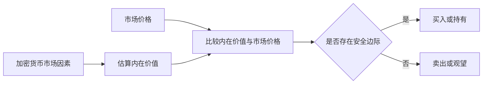

# 格雷厄姆安全边际概念在加密货币市场中的应用

> 关键词：格雷厄姆、安全边际、加密货币市场、价值投资、风险控制、市场估值、投资策略

> 摘要：本文聚焦于格雷厄姆安全边际概念在加密货币市场中的应用。首先介绍了格雷厄姆安全边际概念的背景及在传统金融领域的重要性，接着详细阐述安全边际概念的核心原理及其与加密货币市场的联系。通过具体的算法原理、数学模型和公式，深入剖析如何在加密货币市场中运用安全边际概念进行估值和风险控制。结合项目实战，给出代码实际案例并进行详细解释。探讨了该概念在加密货币市场的实际应用场景，推荐了相关的学习资源、开发工具框架和论文著作。最后总结了其未来发展趋势与挑战，还设置了附录解答常见问题，并提供扩展阅读和参考资料，旨在为投资者在加密货币市场中运用安全边际概念提供全面且深入的指导。

## 1. 背景介绍 
### 1.1 目的和范围
本研究的主要目的在于探讨如何将格雷厄姆的安全边际概念应用于加密货币市场。在传统金融市场中，安全边际概念已经被证明是一种有效的投资策略，能够帮助投资者降低风险并提高投资回报。然而，加密货币市场具有高度的波动性、创新性和不确定性，与传统金融市场有很大的不同。因此，研究安全边际概念在加密货币市场中的应用具有重要的理论和实践意义。

本研究的范围涵盖了加密货币市场的基本特点、格雷厄姆安全边际概念的核心原理、如何在加密货币市场中计算和应用安全边际、相关的数学模型和公式，以及通过实际项目案例展示安全边际概念的应用。同时，还将探讨该概念在不同加密货币投资场景中的应用效果和局限性。

### 1.2 预期读者
本文预期读者包括对加密货币投资感兴趣的个人投资者、专业的金融分析师、加密货币交易员、区块链技术开发者以及相关领域的研究人员。对于个人投资者，本文可以提供一种更科学、更稳健的投资思路，帮助他们在复杂多变的加密货币市场中做出更明智的投资决策。专业金融分析师和交易员可以从本文中获取新的分析视角和投资策略，优化他们的投资组合。区块链技术开发者可以了解投资者的需求，为加密货币市场的发展提供更符合市场需求的技术支持。研究人员则可以将本文作为进一步研究加密货币市场投资理论和实践的参考资料。

### 1.3 文档结构概述
本文将按照以下结构展开：
1. 背景介绍：阐述研究的目的和范围、预期读者、文档结构概述以及相关术语表。
2. 核心概念与联系：详细介绍格雷厄姆安全边际概念的核心原理，以及该概念与加密货币市场的联系，并通过文本示意图和 Mermaid 流程图进行直观展示。
3. 核心算法原理 & 具体操作步骤：讲解在加密货币市场中应用安全边际概念的核心算法原理，并使用 Python 源代码详细阐述具体操作步骤。
4. 数学模型和公式 & 详细讲解 & 举例说明：给出相关的数学模型和公式，对其进行详细讲解，并通过实际例子说明如何应用这些公式进行加密货币的估值和安全边际计算。
5. 项目实战：代码实际案例和详细解释说明：通过具体的项目实战，展示如何在实际应用中运用安全边际概念进行加密货币投资决策，并对源代码进行详细解读和分析。
6. 实际应用场景：探讨安全边际概念在加密货币市场中的实际应用场景，包括不同投资阶段、不同市场环境下的应用策略。
7. 工具和资源推荐：推荐相关的学习资源、开发工具框架和论文著作，帮助读者进一步深入学习和研究。
8. 总结：未来发展趋势与挑战：总结安全边际概念在加密货币市场中的应用现状，分析其未来发展趋势和面临的挑战。
9. 附录：常见问题与解答：解答读者在学习和应用过程中可能遇到的常见问题。
10. 扩展阅读 & 参考资料：提供相关的扩展阅读材料和参考资料，方便读者进一步深入研究。

### 1.4 术语表
#### 1.4.1 核心术语定义
- **格雷厄姆安全边际**：由本杰明·格雷厄姆提出的投资概念，指的是股票或其他投资资产的内在价值与市场价格之间的差值。当市场价格低于内在价值时，就存在安全边际，投资者可以在这个差值的保护下进行投资，降低投资风险。
- **加密货币**：一种基于密码学原理的数字货币，使用去中心化的分布式账本技术（如区块链）来记录交易和管理货币发行。加密货币不受任何中央机构的控制，具有匿名性、全球性和高度的流动性等特点。
- **内在价值**：资产在合理的经济假设下所具有的真实价值，不依赖于市场价格的波动。对于加密货币来说，内在价值可以通过其技术特性、应用场景、市场需求等多种因素来评估。
- **市场价格**：在加密货币市场中，买卖双方达成交易的价格，由市场供求关系决定，具有高度的波动性。

#### 1.4.2 相关概念解释
- **价值投资**：一种投资策略，强调通过分析资产的内在价值来选择投资对象，而不是仅仅关注市场价格的短期波动。格雷厄姆的安全边际概念是价值投资的核心原则之一。
- **风险控制**：在投资过程中，通过各种方法和策略来降低投资风险的行为。安全边际可以作为一种有效的风险控制手段，帮助投资者在市场波动时减少损失。
- **市场估值**：对市场中资产的价值进行评估的过程。在加密货币市场中，市场估值需要考虑多种因素，如技术发展、市场需求、竞争态势等。

#### 1.4.3 缩略词列表
- **BTC**：比特币（Bitcoin），是最早也是最著名的加密货币。
- **ETH**：以太坊（Ethereum），一种基于区块链技术的智能合约平台，其原生加密货币为以太币。
- **ICO**：首次代币发行（Initial Coin Offering），是一种加密货币融资方式，类似于传统金融市场中的首次公开募股（IPO）。

## 2. 核心概念与联系 
### 2.1 格雷厄姆安全边际概念原理
格雷厄姆的安全边际概念是基于对投资风险和回报的深刻理解。他认为，投资者在进行投资时，应该关注资产的内在价值，而不是市场价格的短期波动。当市场价格低于内在价值时，就存在安全边际，投资者可以在这个差值的保护下进行投资，降低投资风险。

例如，假设一只股票的内在价值为 100 元，而市场价格为 80 元，那么安全边际就是 20 元。这意味着即使市场价格在未来出现一定程度的下跌，投资者仍然有一定的缓冲空间，不会立即遭受损失。

### 2.2 安全边际概念与加密货币市场的联系
加密货币市场具有高度的波动性和不确定性，价格波动幅度较大。在这样的市场环境中，应用安全边际概念可以帮助投资者更好地评估加密货币的价值，降低投资风险。

与传统金融市场类似，加密货币的内在价值也受到多种因素的影响，如技术特性、应用场景、市场需求等。通过分析这些因素，投资者可以估算出加密货币的内在价值，然后与市场价格进行比较，确定是否存在安全边际。

### 2.3 文本示意图
格雷厄姆安全边际概念与加密货币市场的联系可以用以下文本示意图表示：

加密货币市场的各种因素（技术、应用、市场需求等） -> 加密货币的内在价值 -> 与市场价格比较 -> 确定安全边际 -> 投资决策（买入、持有、卖出）

### 2.4 Mermaid 流程图


## 3. 核心算法原理 & 具体操作步骤 
### 3.1 核心算法原理
在加密货币市场中应用安全边际概念，核心算法原理是估算加密货币的内在价值，并将其与市场价格进行比较。常见的估算加密货币内在价值的方法包括：
- **基于基本面分析**：考虑加密货币的技术特性、应用场景、市场需求、团队实力等因素，对其内在价值进行综合评估。
- **基于市场比较**：将目标加密货币与同类型的其他加密货币进行比较，参考其市场价格和估值指标，估算目标加密货币的内在价值。

### 3.2 具体操作步骤
以下是在加密货币市场中应用安全边际概念的具体操作步骤：
1. **收集数据**：收集加密货币的相关数据，包括技术文档、市场报告、交易数据等。
2. **基本面分析**：对加密货币的技术特性、应用场景、市场需求、团队实力等因素进行分析，评估其内在价值。
3. **市场比较**：将目标加密货币与同类型的其他加密货币进行比较，参考其市场价格和估值指标，进一步估算内在价值。
4. **确定安全边际**：将估算的内在价值与市场价格进行比较，确定是否存在安全边际。
5. **投资决策**：根据安全边际的大小，做出投资决策（买入、持有、卖出）。

### 3.3 Python 源代码实现
以下是一个简单的 Python 代码示例，用于演示如何在加密货币市场中应用安全边际概念：

```python
# 定义加密货币类
class Cryptocurrency:
    def __init__(self, name, intrinsic_value, market_price):
        self.name = name
        self.intrinsic_value = intrinsic_value
        self.market_price = market_price

    def calculate_safety_margin(self):
        """计算安全边际"""
        return self.intrinsic_value - self.market_price

    def investment_decision(self):
        """根据安全边际做出投资决策"""
        safety_margin = self.calculate_safety_margin()
        if safety_margin > 0:
            return "买入或持有"
        else:
            return "卖出或观望"

# 创建加密货币对象
btc = Cryptocurrency("比特币", 50000, 45000)

# 计算安全边际
safety_margin = btc.calculate_safety_margin()
print(f"比特币的安全边际为: {safety_margin}")

# 做出投资决策
decision = btc.investment_decision()
print(f"投资决策: {decision}")
```

### 3.4 代码解释
- `Cryptocurrency` 类：用于表示加密货币，包含加密货币的名称、内在价值和市场价格。
- `calculate_safety_margin` 方法：用于计算加密货币的安全边际，即内在价值与市场价格的差值。
- `investment_decision` 方法：根据安全边际的大小，做出投资决策。如果安全边际大于 0，则建议买入或持有；否则，建议卖出或观望。

## 4. 数学模型和公式 & 详细讲解 & 举例说明 
### 4.1 数学模型和公式
在加密货币市场中，计算安全边际的基本公式为：

$$安全边际 = 内在价值 - 市场价格$$

其中，内在价值的估算可以使用多种方法，常见的方法包括：
- **基于未来现金流折现法**：假设加密货币在未来会产生一定的现金流，将这些现金流折现到当前时刻，得到加密货币的内在价值。公式为：

$$V = \sum_{t=1}^{n} \frac{CF_t}{(1 + r)^t}$$

其中，$V$ 表示内在价值，$CF_t$ 表示第 $t$ 期的现金流，$r$ 表示折现率，$n$ 表示预测期数。

- **基于市场比较法**：参考同类型加密货币的估值指标，如市盈率（P/E）、市净率（P/B）等，估算目标加密货币的内在价值。公式为：

$$V = 可比加密货币的估值指标 \times 目标加密货币的相关指标$$

### 4.2 详细讲解
- **未来现金流折现法**：该方法的核心思想是将加密货币未来产生的现金流折现到当前时刻，考虑了货币的时间价值。折现率 $r$ 反映了投资者对风险的偏好程度，风险越高，折现率越高。预测期数 $n$ 则根据加密货币的发展阶段和市场前景进行合理估计。
- **市场比较法**：该方法通过参考同类型加密货币的估值指标，来估算目标加密货币的内在价值。选择可比加密货币时，需要考虑其技术特性、应用场景、市场份额等因素的相似性。

### 4.3 举例说明
#### 4.3.1 未来现金流折现法举例
假设一种加密货币预计在未来 3 年内每年产生的现金流分别为 1000 元、1500 元、2000 元，折现率为 10%。则该加密货币的内在价值为：

$$V = \frac{1000}{(1 + 0.1)^1} + \frac{1500}{(1 + 0.1)^2} + \frac{2000}{(1 + 0.1)^3}$$

$$V = \frac{1000}{1.1} + \frac{1500}{1.21} + \frac{2000}{1.331}$$

$$V \approx 909.09 + 1239.67 + 1502.63$$

$$V \approx 3651.39$$

如果该加密货币的市场价格为 3000 元，则安全边际为：

$$安全边际 = 3651.39 - 3000 = 651.39$$

#### 4.3.2 市场比较法举例
假设一种目标加密货币的净利润为 500 万元，同类型可比加密货币的市盈率为 20 倍。则该目标加密货币的内在价值为：

$$V = 20 \times 500 = 10000$$（万元）

如果该加密货币的市场价格为 8000 万元，则安全边际为：

$$安全边际 = 10000 - 8000 = 2000$$（万元）

## 5. 项目实战：代码实际案例和详细解释说明 
### 5.1  开发环境搭建
在进行加密货币投资决策的项目实战时，需要搭建相应的开发环境。以下是具体的步骤：
1. **安装 Python**：Python 是一种广泛使用的编程语言，具有丰富的库和工具。可以从 Python 官方网站（https://www.python.org/downloads/）下载并安装最新版本的 Python。
2. **安装必要的库**：在项目中，需要使用一些 Python 库来进行数据处理、分析和可视化。可以使用以下命令安装这些库：
```bash
pip install pandas numpy matplotlib requests
```
- `pandas`：用于数据处理和分析。
- `numpy`：用于科学计算。
- `matplotlib`：用于数据可视化。
- `requests`：用于发送 HTTP 请求，获取加密货币的市场数据。

### 5.2  源代码详细实现和代码解读
以下是一个完整的 Python 代码示例，用于获取加密货币的市场数据，估算其内在价值，计算安全边际，并做出投资决策：

```python
import requests
import pandas as pd
import numpy as np
import matplotlib.pyplot as plt

# 获取加密货币的市场数据
def get_crypto_market_data(symbol, start_date, end_date):
    url = f"https://api.coingecko.com/api/v3/coins/{symbol}/market_chart/range?vs_currency=usd&from={start_date}&to={end_date}"
    response = requests.get(url)
    if response.status_code == 200:
        data = response.json()
        prices = data['prices']
        df = pd.DataFrame(prices, columns=['timestamp', 'price'])
        df['timestamp'] = pd.to_datetime(df['timestamp'], unit='ms')
        df.set_index('timestamp', inplace=True)
        return df
    else:
        print(f"请求失败，状态码: {response.status_code}")
        return None

# 估算加密货币的内在价值（简单示例：使用平均价格）
def estimate_intrinsic_value(market_data):
    return market_data['price'].mean()

# 计算安全边际
def calculate_safety_margin(intrinsic_value, market_price):
    return intrinsic_value - market_price

# 做出投资决策
def investment_decision(safety_margin):
    if safety_margin > 0:
        return "买入或持有"
    else:
        return "卖出或观望"

# 主函数
def main():
    symbol = "bitcoin"
    start_date = "1609459200"  # 2021-01-01
    end_date = "1640995200"    # 2022-01-01

    # 获取市场数据
    market_data = get_crypto_market_data(symbol, start_date, end_date)
    if market_data is not None:
        # 估算内在价值
        intrinsic_value = estimate_intrinsic_value(market_data)

        # 获取最新市场价格
        latest_price = market_data['price'].iloc[-1]

        # 计算安全边际
        safety_margin = calculate_safety_margin(intrinsic_value, latest_price)

        # 做出投资决策
        decision = investment_decision(safety_margin)

        # 输出结果
        print(f"{symbol} 的内在价值: {intrinsic_value}")
        print(f"{symbol} 的最新市场价格: {latest_price}")
        print(f"{symbol} 的安全边际: {safety_margin}")
        print(f"投资决策: {decision}")

        # 可视化市场数据
        plt.figure(figsize=(12, 6))
        plt.plot(market_data['price'])
        plt.axhline(y=intrinsic_value, color='r', linestyle='--', label='内在价值')
        plt.title(f"{symbol} 市场价格走势")
        plt.xlabel("日期")
        plt.ylabel("价格 (USD)")
        plt.legend()
        plt.show()

if __name__ == "__main__":
    main()
```

### 5.3  代码解读与分析
- **`get_crypto_market_data` 函数**：该函数使用 CoinGecko API 获取指定加密货币在指定日期范围内的市场数据，并将其转换为 Pandas DataFrame 格式。
- **`estimate_intrinsic_value` 函数**：该函数简单地使用市场数据的平均价格作为加密货币的内在价值。在实际应用中，可以使用更复杂的方法来估算内在价值。
- **`calculate_safety_margin` 函数**：该函数计算加密货币的安全边际，即内在价值与市场价格的差值。
- **`investment_decision` 函数**：该函数根据安全边际的大小，做出投资决策。如果安全边际大于 0，则建议买入或持有；否则，建议卖出或观望。
- **`main` 函数**：该函数是主函数，调用上述函数完成数据获取、内在价值估算、安全边际计算、投资决策和数据可视化等任务。

通过这个项目实战，我们可以看到如何使用 Python 代码在加密货币市场中应用安全边际概念进行投资决策。

## 6. 实际应用场景 
### 6.1 长期投资场景
在长期投资场景中，投资者更关注加密货币的内在价值和长期发展潜力。应用安全边际概念可以帮助投资者在市场价格低于内在价值时买入加密货币，从而在长期持有过程中获得较高的回报。

例如，投资者通过对某种加密货币的技术特性、应用场景、市场需求等因素进行深入分析，估算出其内在价值为 1000 元。当市场价格由于短期市场波动下跌到 800 元时，存在 200 元的安全边际。此时，投资者可以考虑买入该加密货币，等待其价格回归内在价值或随着时间的推移实现价值增长。

### 6.2 短期交易场景
在短期交易场景中，安全边际概念同样具有一定的应用价值。虽然短期交易更注重市场价格的波动，但通过估算加密货币的内在价值和安全边际，投资者可以更好地把握交易时机，降低交易风险。

例如，投资者在进行短期交易时，发现某种加密货币的市场价格在短期内快速上涨，但通过分析其内在价值，发现当前市场价格已经远远超过内在价值，安全边际为负数。此时，投资者可以考虑卖出该加密货币，避免市场价格回调带来的损失。

### 6.3 新发行加密货币投资场景
对于新发行的加密货币，由于其市场数据有限，估值难度较大。但应用安全边际概念可以帮助投资者在投资新发行加密货币时更加谨慎。

投资者可以通过对新发行加密货币的白皮书、团队背景、技术创新等因素进行分析，估算其内在价值。如果新发行加密货币的初始价格过高，安全边际为负数，投资者可以选择观望，等待价格调整到合理水平后再进行投资。

### 6.4 市场波动较大时的投资场景
在加密货币市场波动较大时，应用安全边际概念可以帮助投资者保持冷静，避免盲目跟风操作。

当市场价格大幅下跌时，投资者可以通过估算加密货币的内在价值，判断当前价格是否具有足够的安全边际。如果安全边际较大，投资者可以考虑增加投资；如果安全边际较小或为负数，投资者则需要谨慎操作，避免进一步损失。

## 7. 工具和资源推荐
### 7.1 学习资源推荐
#### 7.1.1 书籍推荐
- 《聪明的投资者》（The Intelligent Investor）：本杰明·格雷厄姆的经典著作，详细阐述了价值投资的理论和方法，包括安全边际概念的应用。
- 《加密资产：新的投资前沿》（Cryptoassets: The Innovative Investor's Guide to Bitcoin and Beyond）：这本书介绍了加密货币和区块链技术的基本概念，以及如何在加密货币市场中进行投资。
- 《区块链革命：比特币背后的技术如何改变货币、商业和世界》（The Blockchain Revolution: How the Technology Behind Bitcoin Is Changing Money, Business, and the World）：深入探讨了区块链技术的原理和应用，对理解加密货币的底层技术有很大帮助。

#### 7.1.2 在线课程
- Coursera 上的“区块链基础”（Blockchain Basics）课程：由专业的教授讲解区块链技术的基本原理和应用场景。
- Udemy 上的“加密货币投资策略”（Cryptocurrency Investment Strategies）课程：介绍了在加密货币市场中进行投资的各种策略和方法。
- edX 上的“比特币和加密货币技术”（Bitcoin and Cryptocurrency Technologies）课程：深入讲解比特币和其他加密货币的技术原理。

#### 7.1.3 技术博客和网站
- CoinDesk：提供最新的加密货币新闻、市场分析和技术文章。
- CoinTelegraph：专注于加密货币和区块链领域的新闻报道和分析。
- Medium 上的区块链和加密货币相关博客：有很多专业人士分享的关于加密货币投资和技术的文章。

### 7.2 开发工具框架推荐
#### 7.2.1 IDE和编辑器
- PyCharm：一款专业的 Python 集成开发环境，具有强大的代码编辑、调试和自动补全功能。
- Visual Studio Code：一款轻量级的代码编辑器，支持多种编程语言，通过安装相关插件可以方便地进行 Python 开发。
- Jupyter Notebook：一种交互式的开发环境，适合进行数据探索、分析和可视化。

#### 7.2.2 调试和性能分析工具
- pdb：Python 内置的调试器，可以帮助开发者在代码中设置断点，逐步执行代码，查找问题。
- cProfile：Python 内置的性能分析工具，可以分析代码的运行时间和函数调用次数，帮助开发者优化代码性能。
- Py-Spy：一个跨平台的 Python 性能分析工具，可以实时监测 Python 程序的性能。

#### 7.2.3 相关框架和库
- Pandas：用于数据处理和分析的 Python 库，提供了高效的数据结构和数据操作方法。
- Numpy：用于科学计算的 Python 库，提供了高效的数组和矩阵运算功能。
- Matplotlib：用于数据可视化的 Python 库，可以绘制各种类型的图表。
- Requests：用于发送 HTTP 请求的 Python 库，方便获取加密货币的市场数据。

### 7.3 相关论文著作推荐
#### 7.3.1 经典论文
- Satoshi Nakamoto 的“比特币：一种点对点的电子现金系统”（Bitcoin: A Peer-to-Peer Electronic Cash System）：比特币的创世论文，介绍了比特币的基本原理和设计思路。
- Vitalik Buterin 的“以太坊白皮书”（Ethereum Whitepaper）：介绍了以太坊的技术架构和智能合约的概念。

#### 7.3.2 最新研究成果
- 可以通过学术数据库（如 IEEE Xplore、ACM Digital Library 等）搜索关于加密货币和区块链技术的最新研究论文，了解该领域的最新发展动态。

#### 7.3.3 应用案例分析
- 一些专业的金融研究机构和咨询公司会发布关于加密货币投资的应用案例分析报告，可以通过这些报告了解安全边际概念在实际投资中的应用效果和经验教训。

## 8. 总结：未来发展趋势与挑战
### 8.1 未来发展趋势
- **更广泛的应用**：随着加密货币市场的不断发展和成熟，格雷厄姆安全边际概念将在加密货币投资中得到更广泛的应用。投资者将更加注重加密货币的内在价值和安全边际，从而使市场更加理性和稳定。
- **与新技术的结合**：随着人工智能、大数据等新技术的发展，安全边际概念的应用将更加智能化和精准化。例如，通过大数据分析和机器学习算法，可以更准确地估算加密货币的内在价值，提高安全边际计算的准确性。
- **跨市场应用**：加密货币市场与传统金融市场的联系将越来越紧密，安全边际概念可能会在跨市场投资中得到应用。投资者可以通过比较不同市场中资产的安全边际，进行更优化的资产配置。

### 8.2 挑战
- **估值难度大**：加密货币市场具有高度的创新性和不确定性，其内在价值的估算难度较大。不同的投资者对加密货币的技术特性、应用场景、市场需求等因素的理解和评估可能存在差异，导致内在价值的估算结果不一致。
- **市场波动性高**：加密货币市场价格波动幅度较大，市场情绪对价格的影响较为明显。这使得安全边际的计算结果可能在短期内发生较大变化，增加了投资决策的难度。
- **监管政策不确定**：加密货币市场的监管政策尚不完善，不同国家和地区对加密货币的态度和监管措施存在差异。监管政策的变化可能会对加密货币的市场价格和内在价值产生重大影响，增加了投资风险。

## 9. 附录：常见问题与解答
### 9.1 如何准确估算加密货币的内在价值？
估算加密货币的内在价值是一个复杂的过程，需要综合考虑多种因素。常见的方法包括基本面分析、市场比较法、未来现金流折现法等。在实际应用中，可以结合多种方法进行估算，并根据市场情况和个人经验进行调整。

### 9.2 安全边际的大小是否有一个固定的标准？
安全边际的大小没有一个固定的标准，不同的投资者对安全边际的要求可能不同。一般来说，安全边际越大，投资风险越低。但在实际投资中，需要根据市场情况、投资目标和个人风险承受能力等因素来确定合适的安全边际。

### 9.3 加密货币市场的波动性对安全边际的计算有什么影响？
加密货币市场的波动性较大，市场价格可能在短期内发生较大变化。这使得安全边际的计算结果可能在短期内不稳定。在计算安全边际时，需要考虑市场波动性的影响，并采用适当的方法进行平滑处理，以提高计算结果的准确性。

### 9.4 如何应对加密货币市场的监管政策变化？
投资者需要密切关注加密货币市场的监管政策变化，及时了解相关政策的出台和调整。在投资决策中，需要考虑监管政策变化对加密货币的市场价格和内在价值的影响，合理调整投资策略，降低投资风险。

## 10. 扩展阅读 & 参考资料
### 10.1 扩展阅读
- 《金融炼金术》（The Alchemy of Finance）：乔治·索罗斯的著作，探讨了金融市场的运行规律和投资哲学。
- 《黑天鹅：如何应对不可预知的未来》（The Black Swan: The Impact of the Highly Improbable）：纳西姆·尼古拉斯·塔勒布的著作，介绍了如何应对不确定性和风险。

### 10.2 参考资料
- CoinGecko 官方网站：https://www.coingecko.com/
- 比特币官方网站：https://bitcoin.org/
- 以太坊官方网站：https://ethereum.org/

以上是关于格雷厄姆安全边际概念在加密货币市场中应用的详细技术博客，希望对读者有所帮助。