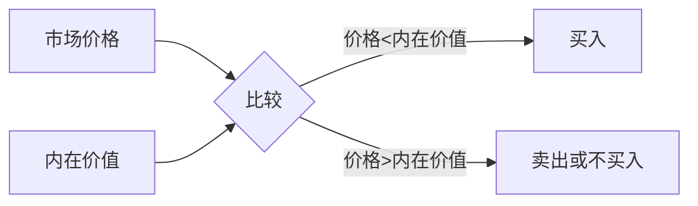

# 格雷厄姆特价股票理论在平台经济时代的新思考

> 关键词：格雷厄姆特价股票理论、平台经济时代、价值投资、股票估值、新思考

> 摘要：本文旨在探讨格雷厄姆特价股票理论在平台经济时代所面临的机遇与挑战，并对其进行新的思考。格雷厄姆特价股票理论作为价值投资的经典理论，在传统经济模式下具有重要的指导意义。然而，平台经济时代的到来，使得经济环境、企业商业模式等发生了巨大变化。文章将深入分析该理论的核心概念，探讨其在平台经济时代的适用性，通过数学模型、实际案例等进行详细阐述，并对其未来发展趋势与挑战进行总结，以期为投资者在新经济时代的投资决策提供有价值的参考。

## 1. 背景介绍 
### 1.1 目的和范围
本研究的目的在于全面审视格雷厄姆特价股票理论在平台经济时代的有效性和局限性，探索其在新经济环境下的应用和发展方向。研究范围涵盖了格雷厄姆特价股票理论的基本原理、平台经济的特征以及两者之间的相互关系。通过对相关理论和实际案例的分析，为投资者提供在平台经济时代运用该理论进行股票投资的思路和方法。

### 1.2 预期读者
本文预期读者包括对价值投资理论感兴趣的投资者、金融从业者、经济学者以及相关专业的学生。对于希望深入了解格雷厄姆特价股票理论在新经济环境下应用的人士，本文将提供有价值的参考和启示。

### 1.3 文档结构概述
本文首先介绍格雷厄姆特价股票理论的背景和平台经济时代的特点，然后阐述该理论的核心概念及其与平台经济的联系。接着详细讲解核心算法原理、数学模型和公式，并通过项目实战案例进行说明。之后探讨该理论在实际应用场景中的表现，推荐相关的学习资源、开发工具和论文著作。最后总结未来发展趋势与挑战，并提供常见问题解答和扩展阅读参考资料。

### 1.4 术语表
#### 1.4.1 核心术语定义
- **格雷厄姆特价股票理论**：由本杰明·格雷厄姆提出的一种价值投资理论，强调通过分析股票的内在价值，寻找价格低于内在价值的股票进行投资。
- **平台经济**：一种基于数字技术，由数据驱动、平台支撑、网络协同的经济活动单元所构成的新经济系统，具有双边市场、网络效应等特征。
- **内在价值**：股票所代表的企业的真实价值，通常通过对企业的财务状况、盈利能力、资产等因素进行分析和评估得出。
- **安全边际**：股票价格与内在价值之间的差值，是格雷厄姆特价股票理论中的重要概念，用于衡量投资的风险程度。

#### 1.4.2 相关概念解释
- **价值投资**：一种投资策略，强调通过对企业基本面的分析，寻找被低估的股票进行长期投资，以获取企业价值增长带来的收益。
- **双边市场**：平台经济中的一种市场结构，平台连接着两类不同的用户群体，如买家和卖家，通过促进双方的交易来实现自身的价值。
- **网络效应**：指平台的价值随着用户数量的增加而增加的现象，用户越多，平台对新用户的吸引力越大，形成正反馈循环。

#### 1.4.3 缩略词列表
- **PE**：市盈率（Price - Earnings Ratio），指股票价格与每股收益的比率，用于衡量股票的估值水平。
- **PB**：市净率（Price - Book Ratio），指股票价格与每股净资产的比率，反映了市场对企业净资产的估值。

## 2. 核心概念与联系 

### 2.1 格雷厄姆特价股票理论核心原理
格雷厄姆特价股票理论的核心在于寻找被市场低估的股票，即股票价格低于其内在价值的股票。该理论认为，市场有时会出现非理性行为，导致股票价格偏离其内在价值。投资者可以通过深入分析企业的财务报表、资产状况、盈利能力等基本面因素，计算出股票的内在价值，然后寻找价格低于内在价值的股票进行投资。

其基本架构可以用以下示意图表示：



### 2.2 平台经济时代的特征
平台经济时代具有以下显著特征：
- **双边市场结构**：平台连接着不同类型的用户群体，如电商平台连接买家和卖家，社交平台连接用户和广告商。平台通过提供交易、交流等服务，促进双边用户的互动和交易，实现自身的价值创造。
- **网络效应**：平台的价值随着用户数量的增加而迅速增长。用户越多，平台的功能越完善，对新用户的吸引力越大，形成正反馈循环。例如，社交媒体平台上的用户越多，其内容越丰富，新用户就越愿意加入。
- **数据驱动**：平台经济高度依赖数据，通过对用户数据的收集、分析和挖掘，平台可以更好地了解用户需求，提供个性化的服务和产品，提高用户满意度和忠诚度。
- **快速创新**：平台经济领域竞争激烈，企业需要不断进行技术创新和商业模式创新，以保持竞争优势。例如，电商平台不断推出新的营销方式和物流配送模式。

### 2.3 两者的联系
在平台经济时代，格雷厄姆特价股票理论面临着新的挑战和机遇。一方面，平台经济企业的商业模式和盈利模式与传统企业有很大不同，其内在价值的评估更加复杂。传统的财务指标如市盈率、市净率等可能无法准确反映平台企业的价值。例如，一些平台企业在发展初期可能亏损，但由于其具有巨大的用户增长潜力和网络效应，未来的盈利前景广阔。

另一方面，平台经济时代的市场波动更加剧烈，股票价格的非理性波动可能更为频繁。这为投资者运用格雷厄姆特价股票理论寻找被低估的股票提供了更多机会。但同时，也要求投资者更加深入地了解平台经济的特点，采用更加灵活和综合的方法来评估股票的内在价值。

## 3. 核心算法原理 & 具体操作步骤 

### 3.1 传统格雷厄姆算法原理
格雷厄姆提出了一些简单的公式来估算股票的内在价值，其中一个经典公式为：

$V = EPS \times (8.5 + 2g)$

其中，$V$ 表示股票的内在价值，$EPS$ 表示每股收益，$g$ 表示预期的未来增长率。

### 3.2 基于 Python 的实现
```python
def graham_intrinsic_value(eps, growth_rate):
    """
    计算格雷厄姆公式下的股票内在价值
    :param eps: 每股收益
    :param growth_rate: 预期的未来增长率
    :return: 股票的内在价值
    """
    return eps * (8.5 + 2 * growth_rate)

# 示例数据
eps = 2.0
growth_rate = 5.0

# 计算内在价值
intrinsic_value = graham_intrinsic_value(eps, growth_rate)
print(f"股票的内在价值为: {intrinsic_value}")
```

### 3.3 具体操作步骤
1. **收集数据**：收集目标企业的财务报表，获取每股收益（EPS）等数据。同时，通过研究行业报告、企业公告等资料，估算企业预期的未来增长率（$g$）。
2. **计算内在价值**：将收集到的数据代入格雷厄姆公式，计算股票的内在价值。
3. **比较价格与内在价值**：获取股票的当前市场价格，将其与计算得到的内在价值进行比较。如果市场价格低于内在价值，且存在一定的安全边际，则可以考虑买入该股票。
4. **风险评估**：除了考虑价格与内在价值的关系外，还需要对企业的风险因素进行评估，如行业竞争、政策变化等。

## 4. 数学模型和公式 & 详细讲解 & 举例说明 

### 4.1 传统格雷厄姆公式详细讲解
格雷厄姆公式 $V = EPS \times (8.5 + 2g)$ 中，8.5 是格雷厄姆认为的一家业绩稳定、无增长预期的企业的合理市盈率倍数。$2g$ 则是对企业未来增长的调整，$g$ 为预期的未来增长率。该公式的基本思想是，企业的内在价值与其当前的盈利能力（EPS）和未来的增长潜力（$g$）相关。

### 4.2 对平台经济企业的调整
在平台经济时代，由于平台企业的特殊性，传统的格雷厄姆公式可能需要进行调整。例如，考虑到平台企业的网络效应和用户增长对未来盈利的影响，可以引入用户数量、用户活跃度等指标。

假设我们引入用户数量（$U$）和用户增长率（$u$），对公式进行调整：

$V = EPS \times (8.5 + 2g) \times (1 + k_1U + k_2u)$

其中，$k_1$ 和 $k_2$ 是权重系数，需要根据具体行业和企业情况进行确定。

### 4.3 举例说明
假设一家电商平台企业，每股收益 $EPS = 1.5$，预期未来增长率 $g = 8\%$，当前用户数量 $U = 1000$ 万，用户增长率 $u = 15\%$。假设 $k_1 = 0.0001$，$k_2 = 0.5$。

首先，计算传统格雷厄姆公式下的内在价值：

$V_1 = EPS \times (8.5 + 2g)$

$= 1.5 \times (8.5 + 2 \times 8)$

$= 1.5 \times (8.5 + 16)$

$= 1.5 \times 24.5$

$= 36.75$

然后，计算调整后的内在价值：

$V_2 = V_1 \times (1 + k_1U + k_2u)$

$= 36.75 \times (1 + 0.0001 \times 1000 + 0.5 \times 0.15)$

$= 36.75 \times (1 + 0.1 + 0.075)$

$= 36.75 \times 1.175$

$= 43.18125$

通过这个例子可以看出，考虑到平台企业的用户因素后，其内在价值有所提高。

## 5. 项目实战：代码实际案例和详细解释说明 

### 5.1 开发环境搭建
- **Python 环境**：建议使用 Python 3.7 及以上版本。可以从 Python 官方网站（https://www.python.org/downloads/）下载安装。
- **相关库**：需要安装 `pandas`、`numpy` 等数据处理库，以及 `yfinance` 库用于获取股票数据。可以使用以下命令进行安装：
```sh
pip install pandas numpy yfinance
```

### 5.2 源代码详细实现和代码解读
```python
import yfinance as yf
import pandas as pd

def get_stock_data(ticker, start_date, end_date):
    """
    获取股票数据
    :param ticker: 股票代码
    :param start_date: 开始日期
    :param end_date: 结束日期
    :return: 股票数据 DataFrame
    """
    data = yf.download(ticker, start=start_date, end=end_date)
    return data

def calculate_graham_value(eps, growth_rate):
    """
    计算格雷厄姆公式下的股票内在价值
    :param eps: 每股收益
    :param growth_rate: 预期的未来增长率
    :return: 股票的内在价值
    """
    return eps * (8.5 + 2 * growth_rate)

# 示例参数
ticker = "AAPL"  # 苹果公司股票代码
start_date = "2020-01-01"
end_date = "2021-01-01"
eps = 3.2  # 假设的每股收益
growth_rate = 6.0  # 假设的预期未来增长率

# 获取股票数据
stock_data = get_stock_data(ticker, start_date, end_date)

# 计算内在价值
intrinsic_value = calculate_graham_value(eps, growth_rate)

# 获取最后一个交易日的收盘价
last_close_price = stock_data['Close'][-1]

# 比较价格与内在价值
if last_close_price < intrinsic_value:
    print(f"股票 {ticker} 的市场价格低于内在价值，可以考虑买入。")
else:
    print(f"股票 {ticker} 的市场价格高于内在价值，不建议买入。")
```

### 5.3 代码解读与分析
1. **`get_stock_data` 函数**：该函数使用 `yfinance` 库从雅虎财经获取指定股票在指定日期范围内的数据。返回一个 `pandas` 的 `DataFrame` 对象，包含股票的开盘价、收盘价、最高价、最低价等信息。
2. **`calculate_graham_value` 函数**：该函数实现了格雷厄姆公式，根据输入的每股收益和预期未来增长率计算股票的内在价值。
3. **主程序部分**：首先设置示例参数，包括股票代码、日期范围、每股收益和预期未来增长率。然后调用 `get_stock_data` 函数获取股票数据，调用 `calculate_graham_value` 函数计算内在价值。最后获取最后一个交易日的收盘价，并将其与内在价值进行比较，给出投资建议。

需要注意的是，这里的每股收益和预期未来增长率是假设值，实际应用中需要通过对企业财务报表和行业研究进行准确估算。

## 6. 实际应用场景 
### 6.1 长期投资
在平台经济时代，对于长期投资者来说，格雷厄姆特价股票理论仍然具有重要的指导意义。投资者可以通过深入分析平台企业的基本面，寻找被市场低估的股票进行长期持有。例如，一些新兴的平台企业在发展初期可能由于市场对其未来盈利的不确定性而被低估，但如果其具有良好的商业模式、强大的技术实力和广阔的市场前景，随着企业的发展和市场对其认识的提高，股票价格可能会逐渐回归其内在价值，为投资者带来丰厚的回报。

### 6.2 价值发现
格雷厄姆特价股票理论可以帮助投资者发现平台经济领域中的价值洼地。通过对不同平台企业的内在价值进行评估和比较，投资者可以找出那些被市场忽视或低估的企业。例如，一些细分领域的平台企业可能由于知名度较低或市场关注度不高，其股票价格没有充分反映其内在价值。投资者可以通过研究这些企业的财务状况、用户增长情况、竞争优势等因素，发现其投资价值。

### 6.3 风险控制
安全边际是格雷厄姆特价股票理论的重要概念，在平台经济时代，它对于风险控制具有重要作用。由于平台经济企业的发展具有一定的不确定性，市场波动较大，投资者在投资平台企业股票时，通过寻找具有较大安全边际的股票，可以降低投资风险。即使企业的发展不如预期，由于股票价格低于其内在价值，投资者也有一定的缓冲空间，减少损失。

## 7. 工具和资源推荐
### 7.1 学习资源推荐
#### 7.1.1 书籍推荐
- 《聪明的投资者》（The Intelligent Investor）：本杰明·格雷厄姆的经典著作，详细阐述了价值投资的理论和方法，是学习格雷厄姆特价股票理论的必读之书。
- 《证券分析》（Security Analysis）：同样是格雷厄姆的著作，对证券分析的基本原理和方法进行了系统的介绍，对于深入理解股票估值和投资分析具有重要意义。
- 《平台革命：改变世界的商业模式》（Platform Revolution: How Networked Markets Are Transforming the Economy - and How to Make Them Work for You）：介绍了平台经济的商业模式、发展趋势和战略，帮助读者了解平台经济的基本概念和特点。

#### 7.1.2 在线课程
- Coursera 上的“价值投资原理”课程：由知名大学的教授授课，系统讲解价值投资的理论和实践，包括格雷厄姆特价股票理论的应用。
- edX 上的“平台经济与创新”课程：介绍平台经济的基本理论、商业模式和创新实践，帮助学习者了解平台经济的发展趋势和挑战。

#### 7.1.3 技术博客和网站
- Seeking Alpha：提供股票分析、投资策略和市场评论等内容，有许多关于价值投资和平台经济企业分析的文章。
- Investopedia：一个专业的金融知识学习网站，提供各种金融术语解释、投资策略分析和市场动态报道，对于学习格雷厄姆特价股票理论和平台经济相关知识有很大帮助。

### 7.2 开发工具框架推荐
#### 7.2.1 IDE和编辑器
- PyCharm：一款功能强大的 Python 集成开发环境，提供代码编辑、调试、版本控制等功能，适合开发与股票数据分析相关的 Python 程序。
- Jupyter Notebook：一种交互式的开发环境，适合进行数据探索、分析和可视化，对于验证格雷厄姆特价股票理论的算法和进行案例分析非常方便。

#### 7.2.2 调试和性能分析工具
- `pdb`：Python 内置的调试工具，可以帮助开发者在程序运行过程中进行调试，查找和解决代码中的问题。
- `cProfile`：Python 的性能分析工具，可以分析程序的运行时间和资源消耗情况，帮助优化代码性能。

#### 7.2.3 相关框架和库
- `pandas`：一个强大的数据处理和分析库，提供了丰富的数据结构和数据操作方法，适合处理股票数据和进行财务分析。
- `numpy`：Python 的数值计算库，提供了高效的数组操作和数学函数，在股票数据计算和数学模型实现中经常使用。
- `matplotlib`：一个常用的 Python 绘图库，可以用于绘制股票价格走势、财务指标变化等图表，帮助直观地分析数据。

### 7.3 相关论文著作推荐
#### 7.3.1 经典论文
- Benjamin Graham and David Dodd, "Security Analysis"：格雷厄姆和多德的经典论文，奠定了价值投资理论的基础，对股票估值和投资分析的方法进行了深入探讨。
- Rochet, J. - C., & Tirole, J. (2003). "Platform competition in two - sided markets". The Journal of the European Economic Association，该论文对双边市场和平台竞争的理论进行了深入研究，为理解平台经济的市场结构和竞争机制提供了重要的理论基础。

#### 7.3.2 最新研究成果
- 近年来，关于平台经济和价值投资的研究不断涌现。可以通过学术数据库如 Web of Science、EBSCOhost 等搜索相关的最新研究论文，了解该领域的前沿动态和研究成果。

#### 7.3.3 应用案例分析
- 一些商业杂志和研究机构会发布关于平台经济企业的案例分析报告，如哈佛商业评论、麦肯锡季刊等。这些案例分析可以帮助读者了解平台经济企业的商业模式、发展战略和投资价值，以及格雷厄姆特价股票理论在实际投资中的应用。

## 8. 总结：未来发展趋势与挑战
### 8.1 未来发展趋势
- **数据驱动的估值方法**：在平台经济时代，数据将成为评估企业价值的重要因素。未来，基于大数据和人工智能的估值方法可能会得到更广泛的应用，通过对用户数据、交易数据等的深入分析，更准确地评估平台企业的内在价值。
- **跨学科融合**：格雷厄姆特价股票理论的应用将与计算机科学、经济学、管理学等多个学科进行更深入的融合。例如，运用机器学习算法对股票数据进行分析和预测，结合经济学理论对平台经济的市场结构和竞争机制进行研究，为投资决策提供更全面的依据。
- **全球化投资**：随着平台经济的全球化发展，投资者将有更多机会投资于全球范围内的平台企业。格雷厄姆特价股票理论将在全球市场中得到更广泛的应用，投资者需要考虑不同国家和地区的经济环境、政策法规等因素，进行更加多元化的投资。

### 8.2 挑战
- **估值难度增加**：平台经济企业的商业模式和盈利模式复杂多变，其内在价值的评估难度较大。传统的财务指标可能无法准确反映平台企业的价值，需要开发新的估值方法和指标体系。
- **市场波动加剧**：平台经济时代的市场波动更加剧烈，股票价格的非理性波动可能更为频繁。投资者需要具备更强的风险承受能力和市场分析能力，准确判断市场趋势，避免盲目跟风投资。
- **技术变革快速**：平台经济领域的技术变革日新月异，新的商业模式和技术不断涌现。投资者需要不断学习和更新知识，跟上技术发展的步伐，及时调整投资策略。

## 9. 附录：常见问题与解答
### 9.1 如何准确估算平台企业的预期未来增长率？
估算平台企业的预期未来增长率需要综合考虑多个因素。可以从以下几个方面入手：
- **行业发展趋势**：研究平台企业所在行业的发展前景和增长潜力，了解行业的市场规模、增长率、竞争格局等信息。
- **企业自身发展战略**：分析平台企业的发展战略，如产品创新、市场拓展、用户增长计划等，评估其对未来增长的影响。
- **用户数据**：关注平台企业的用户数量、用户活跃度、用户留存率等数据，这些数据可以反映企业的市场竞争力和增长潜力。
- **财务数据**：分析企业的历史财务数据，如营业收入、净利润等的增长情况，以及各项成本费用的变化趋势，预测未来的盈利增长。

### 9.2 格雷厄姆特价股票理论在平台经济时代是否仍然适用？
格雷厄姆特价股票理论的核心思想在平台经济时代仍然具有一定的适用性。虽然平台经济企业的商业模式和特点与传统企业有所不同，但寻找被低估的股票、注重安全边际等价值投资的理念仍然是有效的。然而，在应用该理论时，需要对其进行适当的调整和改进，以适应平台经济的特点。例如，引入新的估值指标、考虑网络效应和用户增长等因素。

### 9.3 如何应对平台经济时代股票投资的风险？
可以从以下几个方面应对平台经济时代股票投资的风险：
- **分散投资**：将资金分散投资于不同的平台企业和行业，降低单一股票的风险。
- **深入研究**：对目标企业进行深入的研究和分析，了解其商业模式、竞争优势、财务状况等，评估其投资价值和风险。
- **设定止损点**：在投资前设定合理的止损点，当股票价格下跌到一定程度时，及时卖出，避免损失进一步扩大。
- **关注宏观经济和政策变化**：宏观经济环境和政策法规的变化可能会对平台经济企业产生重大影响，投资者需要密切关注相关信息，及时调整投资策略。

## 10. 扩展阅读 & 参考资料
- 本杰明·格雷厄姆. 《聪明的投资者》. 人民邮电出版社.
- 本杰明·格雷厄姆, 大卫·多德. 《证券分析》. 海南出版社.
- Geoffrey G. Parker, Marshall W. Van Alstyne, Sangeet Paul Choudary. 《平台革命：改变世界的商业模式》. 机械工业出版社.
- Rochet, J. - C., & Tirole, J. (2003). "Platform competition in two - sided markets". The Journal of the European Economic Association.
- Seeking Alpha 网站：https://seekingalpha.com/
- Investopedia 网站：https://www.investopedia.com/
- Coursera 在线学习平台：https://www.coursera.org/
- edX 在线学习平台：https://www.edx.org/