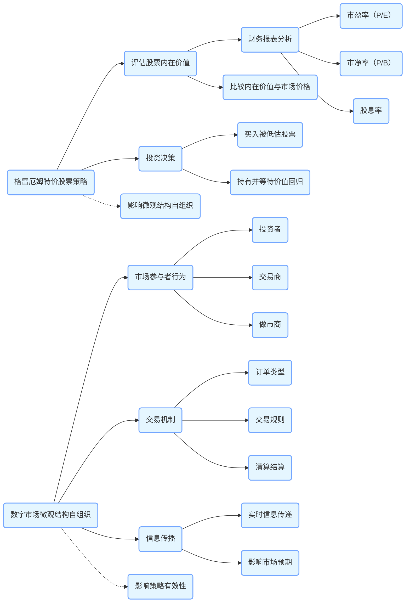

# 格雷厄姆特价股票策略在不同数字市场微观结构自组织中的动态调整

> 关键词：格雷厄姆特价股票策略、数字市场、微观结构自组织、动态调整、股票投资

> 摘要：本文深入探讨了格雷厄姆特价股票策略在不同数字市场微观结构自组织中的动态调整问题。首先介绍了研究的背景、目的和范围等基础信息，接着阐述了核心概念及其联系，详细讲解了核心算法原理和具体操作步骤，通过数学模型和公式进行理论分析并举例说明。然后结合项目实战给出代码实际案例及详细解释，探讨了该策略的实际应用场景。同时推荐了相关的学习资源、开发工具框架以及论文著作。最后总结了未来发展趋势与挑战，提供了常见问题解答和扩展阅读参考资料，旨在为投资者在数字市场环境下运用格雷厄姆特价股票策略提供全面且深入的理论和实践指导。

## 1. 背景介绍 
### 1.1 目的和范围
在当今数字化迅速发展的时代，金融市场发生了巨大的变革，数字市场逐渐成为金融活动的重要领域。格雷厄姆特价股票策略作为一种经典的价值投资策略，在传统金融市场中取得了显著的成效。然而，数字市场具有独特的微观结构自组织特性，这些特性与传统市场存在较大差异，使得格雷厄姆特价股票策略在数字市场中的应用面临新的挑战和机遇。

本研究的目的在于深入分析格雷厄姆特价股票策略在不同数字市场微观结构自组织中的适应性，并探讨如何对该策略进行动态调整，以提高其在数字市场中的有效性和盈利能力。研究范围涵盖了各种类型的数字市场，包括但不限于数字货币市场、电子股票市场等，以及这些市场中不同的微观结构自组织模式。

### 1.2 预期读者
本文预期读者包括金融投资领域的专业人士，如股票分析师、基金经理、投资顾问等，他们可以通过本文深入了解格雷厄姆特价股票策略在数字市场中的应用和调整方法，为实际投资决策提供参考。同时，对于计算机科学与金融交叉领域的研究人员，本文可以为他们在研究数字市场微观结构和投资策略优化方面提供理论和实践依据。此外，对金融投资和数字市场感兴趣的普通投资者也可以从本文中获取有价值的信息，提升自己的投资知识和技能。

### 1.3 文档结构概述
本文共分为十个部分。第一部分为背景介绍，阐述了研究的目的、范围、预期读者和文档结构概述，并对相关术语进行了定义和解释。第二部分介绍了核心概念与联系，包括格雷厄姆特价股票策略、数字市场微观结构自组织等概念的原理和架构，并通过文本示意图和 Mermaid 流程图进行展示。第三部分详细讲解了核心算法原理和具体操作步骤，使用 Python 源代码进行阐述。第四部分给出了数学模型和公式，并进行详细讲解和举例说明。第五部分通过项目实战，给出代码实际案例和详细解释说明，包括开发环境搭建、源代码详细实现和代码解读。第六部分探讨了该策略的实际应用场景。第七部分推荐了相关的学习资源、开发工具框架和论文著作。第八部分总结了未来发展趋势与挑战。第九部分为附录，提供常见问题与解答。第十部分给出扩展阅读和参考资料。

### 1.4 术语表
#### 1.4.1 核心术语定义
- **格雷厄姆特价股票策略**：由本杰明·格雷厄姆（Benjamin Graham）提出的一种价值投资策略，其核心思想是寻找价格低于内在价值的股票进行投资，以获取长期的投资回报。该策略注重股票的基本面分析，通过评估公司的财务状况、盈利能力等指标来确定股票的内在价值。
- **数字市场**：指基于数字化技术进行金融交易的市场，包括数字货币市场、电子股票市场、在线期货市场等。数字市场具有交易速度快、信息传播迅速、交易成本低等特点。
- **微观结构自组织**：指数字市场中各个参与者（如投资者、交易商、做市商等）之间的相互作用和关系，以及这些相互作用和关系如何影响市场的价格形成、流动性和稳定性等微观特征。微观结构自组织是一个动态的过程，会随着市场环境的变化而不断调整。

#### 1.4.2 相关概念解释
- **价值投资**：一种投资理念，强调通过分析公司的基本面，寻找被市场低估的股票进行投资，以实现长期的资本增值。价值投资者通常关注公司的财务报表、行业地位、竞争优势等因素，认为股票的价格最终会回归其内在价值。
- **内在价值**：指股票所代表的公司的真实价值，是基于公司的未来现金流、资产价值、盈利能力等因素进行评估的结果。内在价值是一个相对主观的概念，不同的投资者可能会对同一公司的内在价值有不同的评估。
- **市场微观结构**：指市场的交易机制、交易规则、参与者行为等微观层面的特征，这些特征会影响市场的价格形成、流动性和稳定性等。市场微观结构是金融市场研究的重要领域之一。

#### 1.4.3 缩略词列表
- **AI**：Artificial Intelligence，人工智能
- **ML**：Machine Learning，机器学习
- **HFT**：High-Frequency Trading，高频交易
- **ETF**：Exchange-Traded Fund，交易型开放式指数基金

## 2. 核心概念与联系 

### 格雷厄姆特价股票策略原理
格雷厄姆特价股票策略的核心在于寻找被市场低估的股票。其基本原理是通过对公司的财务报表进行分析，计算出股票的内在价值，然后将其与当前市场价格进行比较。如果市场价格低于内在价值，那么该股票就被认为是被低估的，具有投资价值。

具体来说，格雷厄姆提出了一些评估股票内在价值的指标，如市盈率（P/E）、市净率（P/B）、股息率等。市盈率是指股票价格与每股收益的比率，市净率是指股票价格与每股净资产的比率，股息率是指股息与股票价格的比率。一般来说，较低的市盈率和市净率，以及较高的股息率，表明股票可能被低估。

### 数字市场微观结构自组织原理
数字市场微观结构自组织是一个复杂的过程，涉及到市场参与者的行为、交易机制和信息传播等多个方面。市场参与者包括投资者、交易商、做市商等，他们的行为会影响市场的供求关系和价格形成。交易机制包括订单类型、交易规则、清算结算等，这些机制会影响市场的流动性和效率。信息传播则会影响市场参与者的决策和市场的预期。

在数字市场中，微观结构自组织的一个重要特点是信息的快速传播和处理。由于数字化技术的应用，市场信息可以实时传递给所有参与者，这使得市场参与者能够更快地做出决策，从而影响市场的价格和流动性。此外，数字市场中的高频交易和算法交易也对微观结构自组织产生了重要影响，这些交易方式可以在短时间内完成大量的交易，从而改变市场的供求关系和价格走势。

### 两者联系
格雷厄姆特价股票策略在数字市场中的应用受到微观结构自组织的影响。一方面，数字市场的微观结构自组织会影响股票的价格形成和市场效率，从而影响格雷厄姆特价股票策略的有效性。例如，高频交易和算法交易的存在可能会导致股票价格的波动加剧，使得股票的市场价格更难反映其内在价值。另一方面，格雷厄姆特价股票策略也可以通过影响市场参与者的行为，对数字市场的微观结构自组织产生反作用。例如，如果大量投资者采用格雷厄姆特价股票策略，寻找被低估的股票进行投资，那么这些股票的需求可能会增加，从而推动其价格上涨，进而影响市场的供求关系和价格形成。

### 文本示意图
```plaintext
格雷厄姆特价股票策略
    |
    |-- 评估股票内在价值
    |   |-- 财务报表分析
    |   |   |-- 市盈率（P/E）
    |   |   |-- 市净率（P/B）
    |   |   |-- 股息率
    |   |
    |   |-- 比较内在价值与市场价格
    |
    |-- 投资决策
    |   |-- 买入被低估股票
    |   |-- 持有并等待价值回归

数字市场微观结构自组织
    |
    |-- 市场参与者行为
    |   |-- 投资者
    |   |-- 交易商
    |   |-- 做市商
    |
    |-- 交易机制
    |   |-- 订单类型
    |   |-- 交易规则
    |   |-- 清算结算
    |
    |-- 信息传播
    |   |-- 实时信息传递
    |   |-- 影响市场预期

两者联系
    |
    |-- 微观结构自组织影响策略有效性
    |
    |-- 策略影响微观结构自组织
```

### Mermaid 流程图


## 3. 核心算法原理 & 具体操作步骤 

### 核心算法原理
格雷厄姆特价股票策略的核心算法在于计算股票的内在价值，并将其与市场价格进行比较。一种常见的计算内在价值的方法是使用股息折现模型（Dividend Discount Model，DDM）。股息折现模型的基本思想是，股票的内在价值等于其未来股息的现值之和。

假设股票的股息以固定的增长率 $g$ 增长，且投资者要求的回报率为 $r$，则股票的内在价值 $V$ 可以通过以下公式计算：

$$V = \frac{D_1}{r - g}$$

其中，$D_1$ 是下一期的股息。

### 具体操作步骤
1. **数据收集**：收集股票的相关数据，包括财务报表数据（如每股收益、每股净资产、股息等）、市场价格数据等。
2. **计算内在价值**：使用股息折现模型或其他方法计算股票的内在价值。
3. **比较内在价值与市场价格**：将计算得到的内在价值与当前市场价格进行比较，如果市场价格低于内在价值，则认为该股票被低估。
4. **投资决策**：根据比较结果，决定是否买入被低估的股票。

### Python 源代码实现
```python
# 定义股息折现模型函数
def ddm_value(D1, r, g):
    """
    计算股票的内在价值
    :param D1: 下一期的股息
    :param r: 投资者要求的回报率
    :param g: 股息增长率
    :return: 股票的内在价值
    """
    if r <= g:
        raise ValueError("投资者要求的回报率必须大于股息增长率")
    return D1 / (r - g)

# 示例数据
D1 = 2.0  # 下一期的股息
r = 0.1  # 投资者要求的回报率
g = 0.05  # 股息增长率

# 计算内在价值
intrinsic_value = ddm_value(D1, r, g)
print(f"股票的内在价值为: {intrinsic_value}")

# 假设当前市场价格
market_price = 30.0

# 比较内在价值与市场价格
if market_price < intrinsic_value:
    print("股票被低估，可以考虑买入")
else:
    print("股票未被低估，不建议买入")
```

### 代码解释
- `ddm_value` 函数实现了股息折现模型，用于计算股票的内在价值。
- 示例数据中，我们设定了下一期的股息 $D_1$、投资者要求的回报率 $r$ 和股息增长率 $g$。
- 调用 `ddm_value` 函数计算股票的内在价值，并将其存储在 `intrinsic_value` 变量中。
- 假设当前市场价格为 `market_price`，将其与内在价值进行比较，根据比较结果输出相应的投资建议。

## 4. 数学模型和公式 & 详细讲解 & 举例说明 

### 股息折现模型（DDM）
股息折现模型（Dividend Discount Model，DDM）是一种常用的计算股票内在价值的方法。其基本思想是，股票的内在价值等于其未来股息的现值之和。

#### 基本公式
假设股票的股息以固定的增长率 $g$ 增长，且投资者要求的回报率为 $r$，则股票的内在价值 $V$ 可以通过以下公式计算：

$$V = \frac{D_1}{r - g}$$

其中，$D_1$ 是下一期的股息。

#### 详细讲解
- **$D_1$**：下一期的股息，通常可以根据公司的历史股息数据和股息政策进行预测。
- **$r$**：投资者要求的回报率，反映了投资者对投资风险的预期。一般来说，风险越高，投资者要求的回报率也越高。
- **$g$**：股息增长率，反映了公司的盈利增长能力。股息增长率通常可以根据公司的历史盈利数据和行业发展趋势进行预测。

#### 举例说明
假设某公司下一期的股息 $D_1$ 为 2 元，投资者要求的回报率 $r$ 为 10%，股息增长率 $g$ 为 5%。则该公司股票的内在价值 $V$ 为：

$$V = \frac{2}{0.1 - 0.05} = 40 \text{（元）}$$

如果当前市场价格低于 40 元，则认为该股票被低估，可以考虑买入；如果当前市场价格高于 40 元，则认为该股票未被低估，不建议买入。

### 修正的股息折现模型
在实际应用中，股息增长率可能不是固定的，而是会随着时间的推移而发生变化。为了更准确地计算股票的内在价值，可以使用修正的股息折现模型。

#### 两阶段股息折现模型
两阶段股息折现模型假设股息在第一阶段以较高的增长率 $g_1$ 增长，在第二阶段以较低的增长率 $g_2$ 增长。股票的内在价值 $V$ 可以通过以下公式计算：

$$V = \sum_{t = 1}^{n} \frac{D_0(1 + g_1)^t}{(1 + r)^t} + \frac{D_n(1 + g_2)}{(r - g_2)(1 + r)^n}$$

其中，$D_0$ 是当前的股息，$n$ 是第一阶段的持续时间，$D_n$ 是第 $n$ 期的股息。

#### 详细讲解
- 第一阶段：股息以较高的增长率 $g_1$ 增长，持续时间为 $n$ 期。在这一阶段，需要计算每一期股息的现值，并将它们相加。
- 第二阶段：从第 $n + 1$ 期开始，股息以较低的增长率 $g_2$ 增长。在这一阶段，需要计算第 $n + 1$ 期股息的现值，并将其作为一个永续年金进行折现。

#### 举例说明
假设某公司当前的股息 $D_0$ 为 1 元，第一阶段的股息增长率 $g_1$ 为 15%，持续时间 $n$ 为 5 年，第二阶段的股息增长率 $g_2$ 为 5%，投资者要求的回报率 $r$ 为 10%。

首先，计算前 5 期股息的现值：

$$\begin{align*}
PV_1 &= \frac{D_0(1 + g_1)}{(1 + r)^1} + \frac{D_0(1 + g_1)^2}{(1 + r)^2} + \frac{D_0(1 + g_1)^3}{(1 + r)^3} + \frac{D_0(1 + g_1)^4}{(1 + r)^4} + \frac{D_0(1 + g_1)^5}{(1 + r)^5}\\
&= \frac{1\times(1 + 0.15)}{(1 + 0.1)^1} + \frac{1\times(1 + 0.15)^2}{(1 + 0.1)^2} + \frac{1\times(1 + 0.15)^3}{(1 + 0.1)^3} + \frac{1\times(1 + 0.15)^4}{(1 + 0.1)^4} + \frac{1\times(1 + 0.15)^5}{(1 + 0.1)^5}\\
&\approx 1.045 + 1.092 + 1.142 + 1.194 + 1.249\\
&\approx 5.722
\end{align*}$$

然后，计算第 6 期的股息 $D_6$：

$$D_6 = D_0(1 + g_1)^5(1 + g_2) = 1\times(1 + 0.15)^5\times(1 + 0.05) \approx 2.02$$

最后，计算第二阶段股息的现值：

$$PV_2 = \frac{D_6}{(r - g_2)(1 + r)^5} = \frac{2.02}{(0.1 - 0.05)(1 + 0.1)^5} \approx 25.44$$

则该公司股票的内在价值 $V$ 为：

$$V = PV_1 + PV_2 \approx 5.722 + 25.44 = 31.162 \text{（元）}$$

如果当前市场价格低于 31.162 元，则认为该股票被低估，可以考虑买入；如果当前市场价格高于 31.162 元，则认为该股票未被低估，不建议买入。

## 5. 项目实战：代码实际案例和详细解释说明 

### 5.1  开发环境搭建
#### 操作系统
本项目可以在 Windows、Linux 或 macOS 等主流操作系统上进行开发。建议使用较新的操作系统版本，以确保兼容性和性能。

#### 编程语言
本项目使用 Python 作为开发语言，建议使用 Python 3.7 及以上版本。

#### 开发工具
可以使用以下开发工具进行项目开发：
- **PyCharm**：一款功能强大的 Python 集成开发环境（IDE），提供了代码编辑、调试、版本控制等丰富的功能。
- **Jupyter Notebook**：一种交互式的开发环境，适合进行数据探索、模型验证和代码演示。

#### 第三方库
本项目需要使用以下第三方库：
- **pandas**：用于数据处理和分析。
- **numpy**：用于数值计算。
- **matplotlib**：用于数据可视化。

可以使用以下命令安装这些库：
```sh
pip install pandas numpy matplotlib
```

### 5.2  源代码详细实现和代码解读
以下是一个使用 Python 实现格雷厄姆特价股票策略的完整代码示例：

```python
import pandas as pd
import numpy as np
import matplotlib.pyplot as plt

# 模拟股票数据
data = {
    '股票代码': ['AAPL', 'GOOG', 'MSFT', 'AMZN'],
    '每股收益': [3.28, 46.07, 5.76, 23.46],
    '每股净资产': [35.94, 277.47, 15.24, 118.68],
    '股息': [0.88, 0, 2.04, 0],
    '市场价格': [150.0, 2700.0, 300.0, 3500.0]
}

df = pd.DataFrame(data)

# 计算市盈率（P/E）
df['市盈率（P/E）'] = df['市场价格'] / df['每股收益']

# 计算市净率（P/B）
df['市净率（P/B）'] = df['市场价格'] / df['每股净资产']

# 计算股息率
df['股息率'] = df['股息'] / df['市场价格']

# 设定格雷厄姆选股标准
pe_threshold = 15  # 市盈率阈值
pb_threshold = 1.5  # 市净率阈值
dividend_threshold = 0.03  # 股息率阈值

# 筛选符合条件的股票
selected_stocks = df[(df['市盈率（P/E）'] < pe_threshold) & (df['市净率（P/B）'] < pb_threshold) & (df['股息率'] > dividend_threshold)]

# 输出筛选结果
print("符合格雷厄姆选股标准的股票：")
print(selected_stocks)

# 可视化结果
plt.figure(figsize=(10, 6))
plt.bar(selected_stocks['股票代码'], selected_stocks['市场价格'], label='市场价格')
plt.xlabel('股票代码')
plt.ylabel('价格')
plt.title('符合格雷厄姆选股标准的股票市场价格')
plt.legend()
plt.show()
```

### 5.3  代码解读与分析
#### 数据模拟
```python
data = {
    '股票代码': ['AAPL', 'GOOG', 'MSFT', 'AMZN'],
    '每股收益': [3.28, 46.07, 5.76, 23.46],
    '每股净资产': [35.94, 277.47, 15.24, 118.68],
    '股息': [0.88, 0, 2.04, 0],
    '市场价格': [150.0, 2700.0, 300.0, 3500.0]
}

df = pd.DataFrame(data)
```
这段代码模拟了一些股票的基本数据，包括股票代码、每股收益、每股净资产、股息和市场价格，并使用 `pandas` 库将其转换为数据框 `df`。

#### 计算指标
```python
# 计算市盈率（P/E）
df['市盈率（P/E）'] = df['市场价格'] / df['每股收益']

# 计算市净率（P/B）
df['市净率（P/B）'] = df['市场价格'] / df['每股净资产']

# 计算股息率
df['股息率'] = df['股息'] / df['市场价格']
```
这段代码计算了每只股票的市盈率、市净率和股息率，并将结果添加到数据框 `df` 中。

#### 设定选股标准
```python
pe_threshold = 15  # 市盈率阈值
pb_threshold = 1.5  # 市净率阈值
dividend_threshold = 0.03  # 股息率阈值
```
这段代码设定了格雷厄姆选股的标准，即市盈率小于 15、市净率小于 1.5 且股息率大于 3%。

#### 筛选股票
```python
selected_stocks = df[(df['市盈率（P/E）'] < pe_threshold) & (df['市净率（P/B）'] < pb_threshold) & (df['股息率'] > dividend_threshold)]
```
这段代码根据设定的选股标准，筛选出符合条件的股票，并将结果存储在 `selected_stocks` 数据框中。

#### 输出结果和可视化
```python
# 输出筛选结果
print("符合格雷厄姆选股标准的股票：")
print(selected_stocks)

# 可视化结果
plt.figure(figsize=(10, 6))
plt.bar(selected_stocks['股票代码'], selected_stocks['市场价格'], label='市场价格')
plt.xlabel('股票代码')
plt.ylabel('价格')
plt.title('符合格雷厄姆选股标准的股票市场价格')
plt.legend()
plt.show()
```
这段代码输出了筛选结果，并使用 `matplotlib` 库将符合条件的股票的市场价格进行可视化展示。

## 6. 实际应用场景 
### 个人投资者
对于个人投资者来说，格雷厄姆特价股票策略在数字市场中的动态调整可以帮助他们更好地进行股票投资决策。个人投资者可以通过分析数字市场的微观结构自组织特征，如信息传播速度、交易活跃度等，调整格雷厄姆策略的选股标准和投资时机。例如，在信息传播迅速的数字市场中，股票价格可能会更快地反映公司的基本面信息，因此个人投资者可以适当提高市盈率和市净率的阈值，以扩大选股范围。同时，个人投资者还可以利用数字市场的交易便利性，及时买入和卖出被低估的股票，提高投资收益。

### 机构投资者
机构投资者，如基金公司、保险公司等，通常管理着大量的资金，需要寻找稳定的投资回报。格雷厄姆特价股票策略在数字市场中的动态调整可以为机构投资者提供一种有效的投资方法。机构投资者可以通过建立复杂的量化模型，结合数字市场的微观结构自组织数据，对格雷厄姆策略进行优化和调整。例如，机构投资者可以利用机器学习算法，分析数字市场中的高频交易数据和市场情绪指标，预测股票价格的走势，从而更准确地选择被低估的股票。此外，机构投资者还可以通过分散投资的方式，降低投资风险，提高投资组合的稳定性。

### 金融科技公司
金融科技公司可以利用格雷厄姆特价股票策略在数字市场中的动态调整，开发创新的金融产品和服务。例如，金融科技公司可以开发基于格雷厄姆策略的智能投顾产品，根据客户的风险偏好和投资目标，为客户提供个性化的投资建议。金融科技公司还可以利用区块链技术，提高数字市场的透明度和安全性，为格雷厄姆策略的应用提供更好的市场环境。此外，金融科技公司还可以通过大数据分析和人工智能技术，挖掘数字市场中的潜在投资机会，为投资者提供更有价值的信息和服务。

## 7. 工具和资源推荐
### 7.1 学习资源推荐
#### 7.1.1 书籍推荐
- 《聪明的投资者》（The Intelligent Investor）：本杰明·格雷厄姆的经典著作，详细阐述了价值投资的理念和方法，是学习格雷厄姆特价股票策略的必读之书。
- 《证券分析》（Security Analysis）：同样是本杰明·格雷厄姆的著作，对证券分析的基本原理和方法进行了系统的介绍，为投资者提供了深入了解股票估值和投资分析的理论基础。
- 《金融市场微观结构理论》（The Microstructure of Financial Markets）：由 Maureen O'Hara 所著，全面介绍了金融市场微观结构的理论和实证研究，对于理解数字市场的微观结构自组织具有重要的参考价值。

#### 7.1.2 在线课程
- Coursera 上的“投资学原理”（Principles of Investing）课程：由宾夕法尼亚大学的教授授课，系统介绍了投资学的基本原理和方法，包括价值投资、资产定价等内容。
- edX 上的“金融市场与投资”（Financial Markets and Investments）课程：由麻省理工学院的教授授课，深入探讨了金融市场的运作机制和投资策略，对于学习格雷厄姆特价股票策略在数字市场中的应用具有重要的指导意义。

#### 7.1.3 技术博客和网站
- Seeking Alpha：一个提供股票分析和投资建议的网站，有大量的专业投资者和分析师分享他们的研究成果和投资观点，对于了解市场动态和股票估值具有重要的参考价值。
- Alpha Architect：一个专注于量化投资和价值投资的博客，提供了许多关于格雷厄姆特价股票策略和数字市场投资的研究文章和案例分析。

### 7.2 开发工具框架推荐
#### 7.2.1 IDE和编辑器
- PyCharm：一款功能强大的 Python 集成开发环境（IDE），提供了代码编辑、调试、版本控制等丰富的功能，适合进行大规模的 Python 项目开发。
- Jupyter Notebook：一种交互式的开发环境，适合进行数据探索、模型验证和代码演示。Jupyter Notebook 可以将代码、文本、图表等内容整合在一起，方便用户进行数据分析和可视化。

#### 7.2.2 调试和性能分析工具
- pdb：Python 内置的调试器，可以帮助用户在代码中设置断点、单步执行代码、查看变量值等，方便进行代码调试。
- cProfile：Python 内置的性能分析工具，可以帮助用户分析代码的性能瓶颈，找出耗时较长的函数和代码段，从而进行优化。

#### 7.2.3 相关框架和库
- pandas：用于数据处理和分析的 Python 库，提供了高效的数据结构和数据操作方法，适合处理大规模的金融数据。
- numpy：用于数值计算的 Python 库，提供了高效的数组操作和数学函数，适合进行金融模型的数值计算。
- scikit-learn：一个用于机器学习的 Python 库，提供了丰富的机器学习算法和工具，适合进行股票价格预测和投资策略优化。

### 7.3 相关论文著作推荐
#### 7.3.1 经典论文
- Fama, E. F., & French, K. R. (1992). The cross-section of expected stock returns. Journal of Finance, 47(2), 427-465. 该论文提出了著名的 Fama-French 三因子模型，对股票预期收益率的横截面进行了深入研究，对于理解股票价格的形成机制具有重要的意义。
- Grossman, S. J., & Stiglitz, J. E. (1980). On the impossibility of informationally efficient markets. American Economic Review, 70(3), 393-408. 该论文探讨了信息效率市场的不可能性，指出在现实市场中，信息是不完全的，投资者需要付出成本来获取信息，这对于理解数字市场的微观结构自组织和信息传播具有重要的启示。

#### 7.3.2 最新研究成果
- Budish, E., Cramton, P. C., & Shim, J. (2015). The high-frequency trading arms race: Frequent batch auctions as a market design response. The Quarterly Journal of Economics, 130(4), 1547-1621. 该论文研究了高频交易对市场的影响，并提出了频繁批量拍卖作为一种市场设计响应，对于理解数字市场中的高频交易和市场微观结构具有重要的参考价值。
- Chordia, T., Roll, R., & Subrahmanyam, A. (2019). Liquidity and market efficiency. Journal of Financial Economics, 134(3), 437-460. 该论文研究了流动性与市场效率之间的关系，指出流动性的提高可以促进市场效率的提升，对于理解数字市场的流动性和效率具有重要的意义。

#### 7.3.3 应用案例分析
- 一些金融机构和研究机构会发布关于格雷厄姆特价股票策略在实际应用中的案例分析报告，这些报告可以帮助读者了解该策略在不同市场环境下的应用效果和风险控制方法。例如，晨星公司（Morningstar）会定期发布关于价值投资策略的研究报告和案例分析，其中包括格雷厄姆特价股票策略的应用案例。

## 8. 总结：未来发展趋势与挑战
### 未来发展趋势
#### 数字化与智能化融合
随着数字化技术和人工智能的不断发展，格雷厄姆特价股票策略在数字市场中的应用将越来越多地与智能化技术相结合。例如，利用机器学习算法对数字市场的微观结构自组织数据进行分析和挖掘，预测股票价格的走势，从而更准确地选择被低估的股票。同时，智能投顾等创新金融服务也将不断涌现，为投资者提供更加个性化、智能化的投资建议。

#### 跨市场与跨境投资
数字市场的发展打破了地域和市场的限制，使得投资者可以更容易地进行跨市场和跨境投资。未来，格雷厄姆特价股票策略将在更广泛的市场范围内得到应用，投资者可以通过分析不同数字市场的微观结构自组织特征，调整投资策略，寻找全球范围内的投资机会。

#### 绿色与可持续投资
随着社会对环境保护和可持续发展的关注度不断提高，绿色与可持续投资将成为未来金融市场的重要发展方向。格雷厄姆特价股票策略也将逐渐融入绿色与可持续投资的理念，投资者将更加关注公司的环境、社会和治理（ESG）表现，选择具有良好 ESG 记录的公司进行投资。

### 挑战
#### 数据质量与安全
数字市场中产生了大量的数据，这些数据的质量和安全对于格雷厄姆特价股票策略的应用至关重要。数据质量不佳可能会导致错误的投资决策，而数据安全问题则可能会导致投资者的信息泄露和资产损失。因此，如何保证数据的质量和安全是未来需要解决的重要问题。

#### 市场复杂性与不确定性
数字市场的微观结构自组织具有高度的复杂性和不确定性，股票价格的走势受到多种因素的影响，如宏观经济环境、政策变化、市场情绪等。这些因素的复杂性和不确定性增加了格雷厄姆特价股票策略应用的难度，投资者需要不断调整和优化投资策略，以适应市场的变化。

#### 技术创新与监管
数字化技术和人工智能的快速发展带来了金融市场的创新和变革，但也给监管带来了新的挑战。如何在鼓励技术创新的同时，加强对金融市场的监管，防范金融风险，是未来需要解决的重要问题。同时，监管政策的变化也可能会对格雷厄姆特价股票策略的应用产生影响，投资者需要密切关注监管政策的变化，及时调整投资策略。

## 9. 附录：常见问题与解答
### 1. 格雷厄姆特价股票策略在数字市场中是否仍然有效？
格雷厄姆特价股票策略的核心思想是寻找被低估的股票，这一思想在数字市场中仍然具有一定的有效性。然而，数字市场具有独特的微观结构自组织特性，如信息传播迅速、高频交易活跃等，这些特性会影响股票的价格形成和市场效率，从而对格雷厄姆特价股票策略的有效性产生一定的影响。因此，在数字市场中应用格雷厄姆特价股票策略时，需要根据市场的特点进行动态调整。

### 2. 如何确定股票的内在价值？
确定股票的内在价值是格雷厄姆特价股票策略的关键。常见的方法包括股息折现模型（DDM）、现金流折现模型（DCF）、相对估值法等。股息折现模型通过预测股票未来的股息，并将其折现到当前时刻来计算股票的内在价值；现金流折现模型则通过预测公司未来的自由现金流，并将其折现到当前时刻来计算公司的内在价值；相对估值法通过比较同行业其他公司的估值指标，如市盈率、市净率等，来确定股票的合理估值。

### 3. 如何根据数字市场的微观结构自组织特征调整格雷厄姆特价股票策略？
可以从以下几个方面进行调整：
- **选股标准**：根据数字市场的信息传播速度和市场效率，适当调整市盈率、市净率等选股标准。例如，在信息传播迅速的市场中，可以适当提高选股标准的阈值，以扩大选股范围。
- **投资时机**：关注数字市场的交易活跃度和市场情绪指标，选择合适的投资时机。例如，在市场情绪低迷时，可以加大对被低估股票的投资力度。
- **风险管理**：考虑数字市场的波动性和不确定性，加强风险管理。例如，通过分散投资、设置止损点等方式降低投资风险。

### 4. 格雷厄姆特价股票策略与其他投资策略有什么区别？
格雷厄姆特价股票策略是一种价值投资策略，强调寻找被市场低估的股票进行投资，注重股票的基本面分析。与其他投资策略相比，如成长投资策略、技术分析策略等，格雷厄姆特价股票策略更注重股票的内在价值和长期投资回报，而不是短期的市场波动和趋势。

### 5. 如何学习和掌握格雷厄姆特价股票策略？
可以通过以下途径学习和掌握格雷厄姆特价股票策略：
- **阅读经典著作**：阅读本杰明·格雷厄姆的《聪明的投资者》《证券分析》等经典著作，深入了解价值投资的理念和方法。
- **学习金融知识**：学习金融市场的基本知识，如股票估值、财务报表分析、投资组合理论等，为应用格雷厄姆特价股票策略打下坚实的理论基础。
- **实践操作**：通过模拟交易或小额投资的方式，实践格雷厄姆特价股票策略，积累投资经验。
- **关注市场动态**：关注金融市场的动态和相关研究成果，不断学习和调整投资策略。

## 10. 扩展阅读 & 参考资料
### 扩展阅读
- 《漫步华尔街》（A Random Walk Down Wall Street）：由 Burton G. Malkiel 所著，介绍了各种投资理论和策略，包括有效市场假说、技术分析、基本面分析等，对于投资者全面了解投资市场和投资策略具有重要的参考价值。
- 《黑天鹅》（The Black Swan）：由 Nassim Nicholas Taleb 所著，探讨了不确定性和极端事件对金融市场的影响，提醒投资者要重视风险管理和应对不确定性。

### 参考资料
- Fama, E. F., & French, K. R. (1992). The cross-section of expected stock returns. Journal of Finance, 47(2), 427-465.
- Grossman, S. J., & Stiglitz, J. E. (1980). On the impossibility of informationally efficient markets. American Economic Review, 70(3), 393-408.
- Budish, E., Cramton, P. C., & Shim, J. (2015). The high-frequency trading arms race: Frequent batch auctions as a market design response. The Quarterly Journal of Economics, 130(4), 1547-1621.
- Chordia, T., Roll, R., & Subrahmanyam, A. (2019). Liquidity and market efficiency. Journal of Financial Economics, 134(3), 437-460.
- 本杰明·格雷厄姆. 《聪明的投资者》. 人民邮电出版社.
- 本杰明·格雷厄姆. 《证券分析》. 海南出版社.
- Maureen O'Hara. 《金融市场微观结构理论》. 中国人民大学出版社.