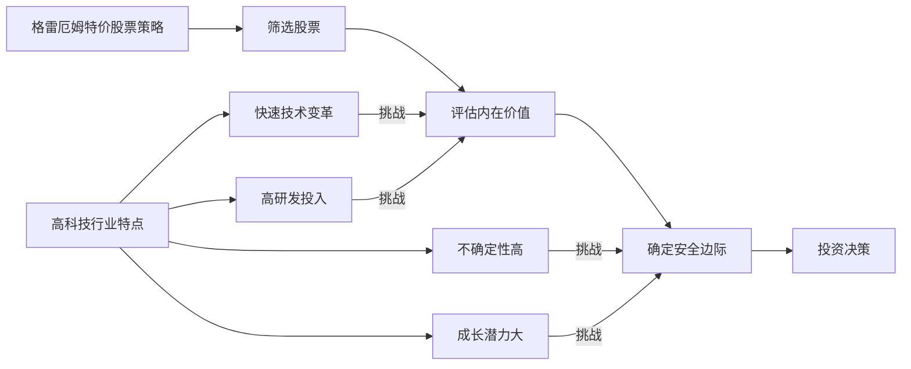

# 格雷厄姆特价股票策略在高科技行业的应用挑战

> 关键词：格雷厄姆特价股票策略、高科技行业、价值投资、应用挑战、财务分析

> 摘要：本文深入探讨了格雷厄姆特价股票策略在高科技行业的应用挑战。格雷厄姆特价股票策略作为价值投资的经典方法，在传统行业中有着广泛应用和成功案例。然而，高科技行业具有独特的特点，如快速的技术变革、高研发投入、不确定性高等，这使得该策略在应用过程中面临诸多挑战。文章将从格雷厄姆策略的核心概念出发，分析其在高科技行业应用时在估值、财务分析、成长评估等方面遇到的问题，并结合实际案例进行详细解读，最后对该策略在高科技行业的未来应用进行展望。

## 1. 背景介绍 
### 1.1 目的和范围
本研究的目的在于全面剖析格雷厄姆特价股票策略在高科技行业应用时所面临的各种挑战。范围涵盖了格雷厄姆特价股票策略的基本原理、高科技行业的特点，以及该策略在高科技行业公司的估值、财务分析、投资决策等方面的应用情况。通过对这些方面的研究，旨在为投资者和相关研究人员提供深入的见解，以便更好地理解该策略在高科技行业的局限性和应对方法。

### 1.2 预期读者
本文预期读者包括对价值投资和高科技行业投资感兴趣的投资者、金融分析师、学术研究人员以及相关专业的学生。这些读者希望通过本文了解格雷厄姆特价股票策略在高科技行业的应用情况，从而为他们的投资决策、学术研究或学习提供参考。

### 1.3 文档结构概述
本文首先介绍格雷厄姆特价股票策略的背景和高科技行业的特点，然后详细阐述该策略的核心概念及其与高科技行业的联系。接着分析该策略在高科技行业应用时涉及的核心算法原理和具体操作步骤，并通过数学模型和公式进行深入讲解。之后通过项目实战，展示该策略在实际应用中的代码案例和详细解释。再探讨该策略在高科技行业的实际应用场景，推荐相关的工具和资源。最后总结该策略在高科技行业的未来发展趋势与挑战，并提供常见问题与解答以及扩展阅读和参考资料。

### 1.4 术语表
#### 1.4.1 核心术语定义
- **格雷厄姆特价股票策略**：由本杰明·格雷厄姆提出的一种价值投资策略，主要通过寻找价格低于内在价值的股票进行投资，强调股票的安全边际。
- **高科技行业**：指那些以高新技术为核心，从事研发、生产和销售高科技产品或提供高科技服务的行业，如信息技术、生物技术、新能源等。
- **安全边际**：股票的内在价值与市场价格之间的差值，差值越大，安全边际越高，投资风险越低。
- **内在价值**：股票所代表的公司的真实价值，通常通过对公司的财务状况、盈利能力、成长潜力等因素进行综合评估得出。

#### 1.4.2 相关概念解释
- **价值投资**：一种投资理念，强调通过分析公司的基本面，寻找被市场低估的股票进行投资，以获取长期的投资回报。
- **成长投资**：一种侧重于公司未来成长潜力的投资策略，更关注公司的收入增长、利润增长等指标。
- **财务比率**：用于评估公司财务状况和经营业绩的各种比率，如市盈率、市净率、净资产收益率等。

#### 1.4.3 缩略词列表
- **PE**：市盈率（Price - Earnings Ratio）
- **PB**：市净率（Price - Book Ratio）
- **ROE**：净资产收益率（Return on Equity）

## 2. 核心概念与联系 
### 2.1 格雷厄姆特价股票策略核心原理
格雷厄姆特价股票策略的核心思想是寻找价格低于内在价值的股票，即具有安全边际的股票。格雷厄姆认为，市场有时会对股票进行错误定价，投资者可以通过深入的基本面分析，找到那些被低估的股票，从而在长期投资中获得超额收益。

该策略的主要步骤包括：
1. **筛选股票**：通过设定一系列的财务标准，如低市盈率、低市净率等，筛选出可能被低估的股票。
2. **评估内在价值**：使用各种方法，如资产估值法、盈利估值法等，评估股票的内在价值。
3. **确定安全边际**：计算股票的内在价值与市场价格之间的差值，确定安全边际的大小。
4. **投资决策**：选择安全边际足够大的股票进行投资。

### 2.2 高科技行业特点
高科技行业具有以下显著特点：
1. **快速的技术变革**：高科技行业的技术更新换代速度极快，新的技术和产品不断涌现，旧的技术和产品很快就会被淘汰。
2. **高研发投入**：为了保持竞争力，高科技公司需要不断投入大量的资金进行研发，以开发新的技术和产品。
3. **不确定性高**：由于技术变革的快速性和市场需求的不确定性，高科技公司的未来发展具有很高的不确定性。
4. **成长潜力大**：一旦高科技公司的技术和产品获得市场认可，就有可能实现快速的增长和高额的利润。

### 2.3 核心概念与高科技行业的联系
格雷厄姆特价股票策略的核心是寻找被低估的股票，而高科技行业的特点使得该策略在应用时面临诸多挑战。例如，由于高科技行业的快速技术变革和高研发投入，公司的资产和盈利状况可能难以准确评估，从而影响内在价值的计算。此外，高科技公司的成长潜力大，但不确定性也高，这使得安全边际的确定变得更加困难。

### 2.4 文本示意图
格雷厄姆特价股票策略在高科技行业的应用可以用以下示意图表示：

格雷厄姆特价股票策略（筛选股票、评估内在价值、确定安全边际、投资决策） --[面临挑战]--> 高科技行业（快速技术变革、高研发投入、不确定性高、成长潜力大）

### 2.5 Mermaid 流程图


## 3. 核心算法原理 & 具体操作步骤 
### 3.1 核心算法原理
格雷厄姆特价股票策略的核心算法主要涉及内在价值的评估和安全边际的计算。以下是一种简化的内在价值评估方法和安全边际计算方法。

#### 3.1.1 内在价值评估
一种常见的内在价值评估方法是盈利估值法，即通过公司的盈利情况来估算其内在价值。假设公司的盈利在未来保持稳定增长，其内在价值可以用以下公式计算：

$$V = \frac{D_1}{r - g}$$

其中，$V$ 表示股票的内在价值，$D_1$ 表示下一年的股息，$r$ 表示必要收益率，$g$ 表示股息的增长率。

#### 3.1.2 安全边际计算
安全边际可以用以下公式计算：

$$安全边际 = \frac{V - P}{P} \times 100\%$$

其中，$P$ 表示股票的市场价格。

### 3.2 具体操作步骤
以下是使用 Python 实现格雷厄姆特价股票策略的具体操作步骤和代码示例：

```python
# 步骤 1: 定义参数
D1 = 2  # 下一年的股息
r = 0.1  # 必要收益率
g = 0.05  # 股息的增长率
P = 30  # 股票的市场价格

# 步骤 2: 计算内在价值
V = D1 / (r - g)

# 步骤 3: 计算安全边际
safety_margin = ((V - P) / P) * 100

# 步骤 4: 输出结果
print(f"内在价值: {V}")
print(f"安全边际: {safety_margin}%")
```

### 3.3 代码解释
1. **参数定义**：定义了下一年的股息 $D_1$、必要收益率 $r$、股息的增长率 $g$ 和股票的市场价格 $P$。
2. **内在价值计算**：根据盈利估值法的公式计算股票的内在价值 $V$。
3. **安全边际计算**：根据安全边际的计算公式计算安全边际。
4. **结果输出**：输出股票的内在价值和安全边际。

## 4. 数学模型和公式 & 详细讲解 & 举例说明 
### 4.1 盈利估值法公式详细讲解
$$V = \frac{D_1}{r - g}$$

- **$D_1$（下一年的股息）**：表示公司预计在下一年向股东支付的股息。股息是公司盈利的一部分，通常由公司的董事会决定。$D_1$ 的大小取决于公司的盈利状况、股息政策等因素。
- **$r$（必要收益率）**：表示投资者要求的最低收益率。必要收益率的大小取决于投资者的风险偏好、市场利率等因素。一般来说，风险越高，必要收益率越高。
- **$g$（股息的增长率）**：表示公司股息的增长速度。股息的增长率通常与公司的盈利增长速度相关。如果公司的盈利增长较快，股息的增长率也可能较高。

### 4.2 安全边际公式详细讲解
$$安全边际 = \frac{V - P}{P} \times 100\%$$

- **$V$（内在价值）**：表示股票的真实价值，通过各种估值方法计算得出。
- **$P$（市场价格）**：表示股票在市场上的交易价格。

安全边际反映了股票的内在价值与市场价格之间的差异。安全边际越大，说明股票被低估的程度越高，投资风险越低。

### 4.3 举例说明
假设某高科技公司下一年的股息预计为 $D_1 = 1$ 元，必要收益率 $r = 0.1$，股息的增长率 $g = 0.03$，股票的市场价格 $P = 15$ 元。

1. **计算内在价值**
$$V = \frac{D_1}{r - g} = \frac{1}{0.1 - 0.03} \approx 14.29$$（元）

2. **计算安全边际**
$$安全边际 = \frac{V - P}{P} \times 100\% = \frac{14.29 - 15}{15} \times 100\% \approx -4.73\%$$

在这个例子中，股票的内在价值约为 14.29 元，市场价格为 15 元，安全边际为 -4.73%，说明该股票可能被高估。

## 5. 项目实战：代码实际案例和详细解释说明 
### 5.1  开发环境搭建
为了实现格雷厄姆特价股票策略的代码，我们需要搭建以下开发环境：
1. **Python 环境**：建议使用 Python 3.6 及以上版本。
2. **开发工具**：可以使用 PyCharm、Jupyter Notebook 等开发工具。
3. **相关库**：需要安装 `pandas`、`numpy` 等库，用于数据处理和分析。

以下是安装相关库的命令：
```sh
pip install pandas numpy
```

### 5.2  源代码详细实现和代码解读
以下是一个更完整的 Python 代码示例，用于筛选可能被低估的高科技股票：

```python
import pandas as pd
import numpy as np

# 步骤 1: 加载股票数据
data = pd.read_csv('tech_stocks.csv')

# 步骤 2: 筛选符合条件的股票
# 假设筛选条件为市盈率低于 20 且市净率低于 2
filtered_data = data[(data['PE'] < 20) & (data['PB'] < 2)]

# 步骤 3: 计算内在价值和安全边际
# 假设使用盈利估值法计算内在价值
r = 0.1  # 必要收益率
g = 0.05  # 股息的增长率
filtered_data['D1'] = filtered_data['EPS'] * 0.5  # 假设股息支付率为 50%
filtered_data['V'] = filtered_data['D1'] / (r - g)
filtered_data['safety_margin'] = ((filtered_data['V'] - filtered_data['Price']) / filtered_data['Price']) * 100

# 步骤 4: 筛选安全边际大于 20% 的股票
undervalued_stocks = filtered_data[filtered_data['safety_margin'] > 20]

# 步骤 5: 输出结果
print(undervalued_stocks)
```

### 5.3  代码解读与分析
1. **数据加载**：使用 `pandas` 库的 `read_csv` 函数加载高科技股票数据，数据文件名为 `tech_stocks.csv`。
2. **条件筛选**：根据市盈率（`PE`）低于 20 且市净率（`PB`）低于 2 的条件筛选出可能被低估的股票。
3. **内在价值和安全边际计算**：使用盈利估值法计算股票的内在价值，并计算安全边际。
4. **再次筛选**：筛选出安全边际大于 20% 的股票，作为最终的低估股票列表。
5. **结果输出**：输出最终的低估股票列表。

## 6. 实际应用场景 
### 6.1 价值投资组合构建
投资者可以使用格雷厄姆特价股票策略在高科技行业中筛选被低估的股票，构建价值投资组合。通过分散投资于多只被低估的高科技股票，可以降低投资风险，提高投资回报。

### 6.2 长期投资决策
对于长期投资者来说，格雷厄姆特价股票策略可以帮助他们在高科技行业中寻找具有安全边际的股票进行长期投资。即使在高科技行业的快速变化中，这些具有安全边际的股票也可能在长期中获得较好的回报。

### 6.3 风险控制
在高科技行业投资中，风险控制至关重要。格雷厄姆特价股票策略强调安全边际的概念，可以帮助投资者在投资高科技股票时控制风险，避免投资那些被高估的股票。

## 7. 工具和资源推荐
### 7.1 学习资源推荐
#### 7.1.1 书籍推荐
- 《聪明的投资者》（The Intelligent Investor）：本杰明·格雷厄姆的经典著作，详细阐述了价值投资的理念和方法。
- 《证券分析》（Security Analysis）：同样是本杰明·格雷厄姆的著作，是价值投资领域的权威书籍。
- 《漫步华尔街》（A Random Walk Down Wall Street）：介绍了各种投资理论和方法，对投资者有很大的启发。

#### 7.1.2 在线课程
- Coursera 上的“投资学原理”课程：由知名大学教授授课，系统介绍了投资学的基本原理和方法。
- edX 上的“价值投资基础”课程：专门讲解价值投资的理论和实践。

#### 7.1.3 技术博客和网站
- Seeking Alpha：提供股票分析和投资建议的网站，有很多关于价值投资的文章。
- ValueWalk：专注于价值投资领域的博客，分享最新的价值投资研究成果和案例。

### 7.2 开发工具框架推荐
#### 7.2.1 IDE和编辑器
- PyCharm：一款功能强大的 Python 集成开发环境，适合开发复杂的数据分析和投资策略代码。
- Jupyter Notebook：交互式的开发环境，适合快速验证和展示投资策略的代码。

#### 7.2.2 调试和性能分析工具
- PySnooper：一个简单易用的 Python 调试工具，可以帮助开发者快速定位代码中的问题。
- cProfile：Python 自带的性能分析工具，可以分析代码的性能瓶颈。

#### 7.2.3 相关框架和库
- pandas：用于数据处理和分析的 Python 库，在股票数据分析中非常有用。
- numpy：用于数值计算的 Python 库，提供了高效的数组操作功能。

### 7.3 相关论文著作推荐
#### 7.3.1 经典论文
- Benjamin Graham and David Dodd, "Security Analysis"：价值投资领域的经典论文，奠定了价值投资的理论基础。
- Eugene F. Fama and Kenneth R. French, "The Cross - Section of Expected Stock Returns"：提出了著名的 Fama - French 三因子模型，对股票收益率的影响因素进行了深入研究。

#### 7.3.2 最新研究成果
- 关注顶级金融学术期刊，如《Journal of Finance》、《Review of Financial Studies》等，了解价值投资和高科技行业投资的最新研究成果。

#### 7.3.3 应用案例分析
- 一些金融研究机构和投资公司会发布关于价值投资策略在高科技行业应用的案例分析报告，可以通过网络搜索获取这些报告。

## 8. 总结：未来发展趋势与挑战
### 8.1 未来发展趋势
1. **融合成长投资理念**：随着高科技行业的发展，单纯的价值投资策略可能无法充分捕捉高科技公司的成长潜力。未来，格雷厄姆特价股票策略可能会与成长投资理念相结合，更加注重公司的未来成长前景。
2. **利用大数据和人工智能**：大数据和人工智能技术的发展为股票分析提供了更强大的工具。未来，投资者可能会利用这些技术更准确地评估高科技公司的内在价值和风险，提高格雷厄姆特价股票策略的应用效果。
3. **跨行业应用**：格雷厄姆特价股票策略可能会在更多的行业中得到应用，不仅仅局限于高科技行业。投资者可以将该策略应用于不同行业的股票筛选，寻找被低估的投资机会。

### 8.2 挑战
1. **技术变革的不确定性**：高科技行业的技术变革速度极快，这使得公司的未来发展具有很高的不确定性。准确评估高科技公司的内在价值和风险变得更加困难，格雷厄姆特价股票策略的应用效果可能会受到影响。
2. **财务报表的局限性**：高科技公司的财务报表可能无法准确反映其真实的价值和潜力。例如，高研发投入可能会在短期内影响公司的盈利，但从长期来看可能会带来巨大的回报。传统的财务分析方法可能无法充分考虑这些因素。
3. **市场情绪的影响**：股票市场的情绪波动较大，尤其是在高科技行业。市场情绪可能会导致股票价格偏离其内在价值，使得格雷厄姆特价股票策略难以准确判断股票的低估程度。

## 9. 附录：常见问题与解答
### 9.1 格雷厄姆特价股票策略适用于所有高科技公司吗？
不是的。格雷厄姆特价股票策略更适用于那些具有稳定盈利和资产基础的高科技公司。对于一些处于初创阶段、尚未实现盈利或资产较轻的高科技公司，该策略可能不太适用。

### 9.2 如何准确评估高科技公司的内在价值？
评估高科技公司的内在价值是一个复杂的过程，需要综合考虑公司的技术实力、市场前景、竞争优势、财务状况等因素。可以使用多种估值方法，如盈利估值法、资产估值法、现金流折现法等，并结合行业分析和市场调研来提高估值的准确性。

### 9.3 安全边际的大小应该如何确定？
安全边际的大小没有固定的标准，取决于投资者的风险偏好和投资目标。一般来说，安全边际越大，投资风险越低。投资者可以根据自己的情况，设定一个合理的安全边际阈值，如 20% 或 30%。

## 10. 扩展阅读 & 参考资料
### 10.1 扩展阅读
- 阅读更多关于价值投资和高科技行业投资的书籍和文章，深入了解相关理论和实践。
- 关注金融市场的动态和高科技行业的发展趋势，不断更新自己的知识和观念。

### 10.2 参考资料
- 本文中引用的书籍、论文、网站等资料。
- 相关的金融数据库和财经媒体，如 Bloomberg、Reuters 等。