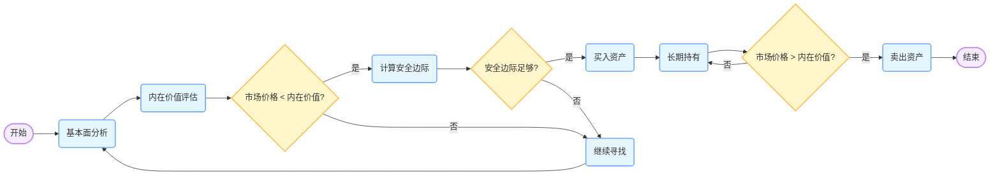

# 格雷厄姆的价值投资原则在不同资产类别中的应用

> 关键词：格雷厄姆、价值投资原则、资产类别、股票、债券、房地产、大宗商品

> 摘要：本文旨在深入探讨格雷厄姆的价值投资原则在不同资产类别中的应用。首先介绍格雷厄姆价值投资原则的背景与核心思想，接着详细分析该原则在股票、债券、房地产、大宗商品等各类资产中的具体应用方式、操作要点及潜在风险。通过实际案例展示价值投资原则在不同资产投资决策中的重要性，并总结其优势与局限性，同时对未来价值投资在不同资产领域的发展趋势进行展望，为投资者提供全面且具有实践指导意义的投资参考。

## 1. 背景介绍 
### 1.1 目的和范围
本研究的目的在于系统地阐述格雷厄姆的价值投资原则在多种资产类别中的应用，帮助投资者理解如何运用这些原则进行不同资产的投资决策，以实现资产的保值增值。研究范围涵盖股票、债券、房地产、大宗商品等主要资产类别，分析价值投资原则在各资产类别中的适用性、具体方法及效果评估。

### 1.2 预期读者
本文预期读者包括对价值投资感兴趣的个人投资者、金融专业学生、投资机构从业者以及希望深入了解资产投资策略的相关人士。通过阅读本文，读者能够对格雷厄姆的价值投资原则有更深入的理解，并掌握其在不同资产类别中的应用技巧。

### 1.3 文档结构概述
本文首先介绍格雷厄姆价值投资原则的背景及相关术语，接着阐述核心概念与联系，包括价值投资的原理和架构。然后详细讲解核心算法原理及具体操作步骤，通过数学模型和公式进一步说明。随后通过项目实战展示代码实际案例及详细解释。再探讨价值投资原则在不同资产类别中的实际应用场景。接着推荐相关的学习资源、开发工具框架及论文著作。最后总结未来发展趋势与挑战，并提供常见问题解答及扩展阅读参考资料。

### 1.4 术语表
#### 1.4.1 核心术语定义
- **价值投资**：由格雷厄姆提出，是一种通过对资产内在价值的分析，以低于内在价值的价格买入资产，并长期持有的投资策略。
- **内在价值**：资产本身所具有的真实价值，它基于资产的基本面因素，如盈利能力、现金流、资产负债状况等进行评估。
- **安全边际**：指资产的市场价格低于其内在价值的幅度，是价值投资中的重要概念，用于降低投资风险。

#### 1.4.2 相关概念解释
- **基本面分析**：通过研究资产的财务报表、行业前景、宏观经济环境等基本面因素，来评估资产的内在价值和投资价值。
- **市场效率**：指市场价格反映资产内在价值的程度。在有效市场中，市场价格能够迅速准确地反映所有可用信息；而在无效市场中，市场价格可能偏离内在价值，为价值投资者提供机会。

#### 1.4.3 缩略词列表
- **P/E**：市盈率（Price-to-Earnings Ratio），指股票价格与每股收益的比率，用于衡量股票的估值水平。
- **P/B**：市净率（Price-to-Book Ratio），指股票价格与每股净资产的比率，也是常用的股票估值指标。

## 2. 核心概念与联系 
格雷厄姆的价值投资原则核心在于寻找被市场低估的资产，以获取长期的投资回报。其基本原理是通过对资产的基本面分析，确定其内在价值，然后在市场价格低于内在价值时买入，等待市场价格回归内在价值。

### 核心概念原理
价值投资的核心原理基于以下几点：
1. **资产具有内在价值**：每个资产都有其基于基本面因素的内在价值，尽管市场价格可能会受到短期供求关系、市场情绪等因素的影响而波动，但从长期来看，市场价格会向内在价值回归。
2. **市场并非总是有效的**：市场存在信息不对称、投资者情绪波动等因素，导致市场价格可能偏离内在价值，为价值投资者提供了寻找低估资产的机会。
3. **安全边际原则**：为了降低投资风险，价值投资者在买入资产时会要求有一定的安全边际，即市场价格低于内在价值的幅度足够大，以应对可能的估值误差和市场波动。

### 架构的文本示意图
```plaintext
价值投资原则
|-- 基本面分析
|   |-- 财务报表分析
|   |   |-- 盈利能力分析
|   |   |-- 偿债能力分析
|   |   |-- 运营能力分析
|   |-- 行业前景分析
|   |   |-- 行业竞争格局
|   |   |-- 行业发展趋势
|   |-- 宏观经济环境分析
|       |-- 经济增长趋势
|       |-- 利率政策
|       |-- 通货膨胀率
|-- 内在价值评估
|   |-- 现金流折现法
|   |-- 相对估值法
|       |-- 市盈率法
|       |-- 市净率法
|-- 安全边际判断
|   |-- 确定内在价值
|   |-- 比较市场价格与内在价值
|   |-- 设定安全边际幅度
|-- 投资决策
|   |-- 买入低估资产
|   |-- 长期持有
|   |-- 卖出高估资产
```

### Mermaid 流程图


## 3. 核心算法原理 & 具体操作步骤 
### 核心算法原理
在价值投资中，常用的内在价值评估方法包括现金流折现法（DCF）和相对估值法。下面以现金流折现法为例，介绍其核心算法原理。

现金流折现法的基本思想是将资产未来产生的现金流按照一定的折现率折现到当前时刻，得到资产的内在价值。其数学公式为：
$$V = \sum_{t=1}^{n} \frac{CF_t}{(1 + r)^t} + \frac{TV}{(1 + r)^n}$$
其中：
- $V$ 表示资产的内在价值
- $CF_t$ 表示第 $t$ 期的现金流
- $r$ 表示折现率
- $n$ 表示预测期数
- $TV$ 表示预测期末的终值

### 具体操作步骤
1. **预测未来现金流**：通过对资产的基本面分析，预测其未来各期的现金流。这需要考虑资产的盈利能力、增长前景、行业趋势等因素。
2. **确定折现率**：折现率反映了投资者对资产风险的预期。一般来说，折现率可以采用资本资产定价模型（CAPM）来确定，其公式为：
$$r = R_f + \beta \times (R_m - R_f)$$
其中：
- $r$ 表示折现率
- $R_f$ 表示无风险利率
- $\beta$ 表示资产的贝塔系数，反映资产相对于市场的风险程度
- $R_m$ 表示市场预期收益率

3. **计算终值**：预测期末的终值可以采用永续增长模型来计算，其公式为：
$$TV = \frac{CF_{n+1}}{r - g}$$
其中：
- $TV$ 表示终值
- $CF_{n+1}$ 表示预测期下一期的现金流
- $r$ 表示折现率
- $g$ 表示永续增长率

4. **计算内在价值**：将预测的未来现金流和终值按照折现率折现到当前时刻，得到资产的内在价值。

### Python 源代码实现
```python
import numpy as np

def dcf_valuation(cash_flows, discount_rate, growth_rate, terminal_year):
    """
    现金流折现法计算资产内在价值

    :param cash_flows: 未来各期现金流列表
    :param discount_rate: 折现率
    :param growth_rate: 永续增长率
    :param terminal_year: 预测期数
    :return: 资产内在价值
    """
    # 计算预测期现金流的现值
    present_values = []
    for t in range(1, terminal_year + 1):
        present_value = cash_flows[t - 1] / (1 + discount_rate) ** t
        present_values.append(present_value)

    # 计算终值
    terminal_cash_flow = cash_flows[-1] * (1 + growth_rate)
    terminal_value = terminal_cash_flow / (discount_rate - growth_rate) / (1 + discount_rate) ** terminal_year

    # 计算内在价值
    intrinsic_value = sum(present_values) + terminal_value
    return intrinsic_value

# 示例数据
cash_flows = [100, 120, 140, 160, 180]  # 未来 5 期现金流
discount_rate = 0.1  # 折现率为 10%
growth_rate = 0.03  # 永续增长率为 3%
terminal_year = 5  # 预测期数为 5 年

# 计算内在价值
intrinsic_value = dcf_valuation(cash_flows, discount_rate, growth_rate, terminal_year)
print(f"资产内在价值: {intrinsic_value}")
```

## 4. 数学模型和公式 & 详细讲解 & 举例说明 
### 现金流折现法（DCF）
#### 详细讲解
现金流折现法的核心在于将资产未来产生的现金流折现到当前时刻，以反映其时间价值。其中，折现率的选择非常关键，它反映了投资者对资产风险的预期。较高的折现率意味着投资者对资产的风险要求更高，相应地，资产的内在价值会降低；反之，较低的折现率会提高资产的内在价值。

永续增长率 $g$ 表示资产在预测期结束后长期的增长速度。一般来说，永续增长率应该低于经济的长期增长率，因为从长期来看，任何资产的增长都不可能超过整个经济的增长速度。

#### 举例说明
假设一家公司未来 5 年的预计现金流分别为 100 万元、120 万元、140 万元、160 万元和 180 万元。无风险利率为 3%，市场预期收益率为 10%，该公司的贝塔系数为 1.2。预测期结束后，公司的永续增长率为 3%。

首先，计算折现率：
$$r = R_f + \beta \times (R_m - R_f) = 0.03 + 1.2 \times (0.1 - 0.03) = 0.114$$

然后，计算终值：
$$CF_{6} = 180 \times (1 + 0.03) = 185.4$$
$$TV = \frac{CF_{6}}{r - g} = \frac{185.4}{0.114 - 0.03} = 2207.14$$

最后，计算内在价值：
$$V = \frac{100}{(1 + 0.114)^1} + \frac{120}{(1 + 0.114)^2} + \frac{140}{(1 + 0.114)^3} + \frac{160}{(1 + 0.114)^4} + \frac{180}{(1 + 0.114)^5} + \frac{2207.14}{(1 + 0.114)^5} \approx 1573.52$$

### 相对估值法
#### 详细讲解
相对估值法是通过比较同行业或类似资产的估值指标，来评估目标资产的价值。常用的相对估值指标包括市盈率（P/E）、市净率（P/B）等。

市盈率法的基本公式为：
$$P = EPS \times P/E$$
其中：
- $P$ 表示股票价格
- $EPS$ 表示每股收益
- $P/E$ 表示市盈率

市净率法的基本公式为：
$$P = BVPS \times P/B$$
其中：
- $P$ 表示股票价格
- $BVPS$ 表示每股净资产
- $P/B$ 表示市净率

#### 举例说明
假设同行业公司的平均市盈率为 15，某公司的每股收益为 2 元，则该公司的合理股价为：
$$P = EPS \times P/E = 2 \times 15 = 30$$

假设同行业公司的平均市净率为 2，某公司的每股净资产为 10 元，则该公司的合理股价为：
$$P = BVPS \times P/B = 10 \times 2 = 20$$

## 5. 项目实战：代码实际案例和详细解释说明 
### 5.1  开发环境搭建
本项目实战使用 Python 进行开发，需要安装以下库：
- `numpy`：用于数值计算
- `pandas`：用于数据处理和分析
- `matplotlib`：用于数据可视化

可以使用以下命令安装这些库：
```sh
pip install numpy pandas matplotlib
```

### 5.2  源代码详细实现和代码解读
以下是一个使用相对估值法对股票进行估值的示例代码：
```python
import pandas as pd

def relative_valuation(eps, industry_pe, bvps, industry_pb):
    """
    相对估值法计算股票价值

    :param eps: 每股收益
    :param industry_pe: 行业平均市盈率
    :param bvps: 每股净资产
    :param industry_pb: 行业平均市净率
    :return: 市盈率法估值、市净率法估值
    """
    pe_valuation = eps * industry_pe
    pb_valuation = bvps * industry_pb
    return pe_valuation, pb_valuation

# 示例数据
data = {
    '股票代码': ['000001', '000002', '000003'],
    '每股收益': [2.0, 1.5, 1.8],
    '每股净资产': [10.0, 8.0, 9.0]
}
df = pd.DataFrame(data)

# 行业平均市盈率和市净率
industry_pe = 15
industry_pb = 2

# 计算估值
df['市盈率法估值'] = df['每股收益'].apply(lambda x: relative_valuation(x, industry_pe, 0, 0)[0])
df['市净率法估值'] = df['每股净资产'].apply(lambda x: relative_valuation(0, 0, x, industry_pb)[1])

print(df)
```

### 5.3  代码解读与分析
1. **函数定义**：`relative_valuation` 函数用于计算股票的市盈率法估值和市净率法估值。
2. **数据准备**：使用 `pandas` 库创建一个包含股票代码、每股收益和每股净资产的 DataFrame。
3. **行业数据设定**：设定行业平均市盈率和市净率。
4. **估值计算**：使用 `apply` 方法对 DataFrame 中的每股收益和每股净资产列分别应用 `relative_valuation` 函数，计算市盈率法估值和市净率法估值。
5. **结果输出**：打印包含估值结果的 DataFrame。

通过这个示例，我们可以看到如何使用相对估值法对股票进行估值，并将结果存储在 DataFrame 中进行分析和比较。

## 6. 实际应用场景 
### 股票投资
在股票投资中，价值投资者会通过基本面分析来确定股票的内在价值。他们会研究公司的财务报表，包括盈利能力、偿债能力、运营能力等指标，同时考虑行业前景和宏观经济环境。例如，当一家公司的市盈率和市净率低于同行业平均水平，且公司具有稳定的现金流和良好的发展前景时，价值投资者可能会认为该股票被低估，从而选择买入。

### 债券投资
在债券投资中，价值投资原则同样适用。投资者会评估债券的信用风险、利率风险和流动性风险等因素，确定债券的内在价值。例如，当市场利率上升时，债券价格会下降，此时如果债券的信用质量良好，且其到期收益率高于市场平均水平，价值投资者可能会认为该债券被低估，从而选择买入。

### 房地产投资
在房地产投资中，价值投资者会考虑房地产的地理位置、租金收益、市场供需关系等因素，评估房地产的内在价值。例如，当某一地区的房地产价格因短期市场波动而下跌，但该地区的经济发展前景良好，租金收益率较高时，价值投资者可能会认为该房地产被低估，从而选择买入。

### 大宗商品投资
在大宗商品投资中，价值投资者会关注大宗商品的供需关系、生产成本、宏观经济环境等因素，确定大宗商品的内在价值。例如，当某种大宗商品的价格因短期市场供需失衡而下跌，但长期来看其需求有望增长，且生产成本相对稳定时，价值投资者可能会认为该大宗商品被低估，从而选择买入。

## 7. 工具和资源推荐
### 7.1 学习资源推荐
#### 7.1.1 书籍推荐
- 《聪明的投资者》（The Intelligent Investor）：格雷厄姆的经典著作，详细阐述了价值投资的原则和方法。
- 《证券分析》（Security Analysis）：同样是格雷厄姆的重要著作，对证券分析的理论和实践进行了系统的介绍。
- 《巴菲特致股东的信》（Letters to Shareholders of Berkshire Hathaway）：巴菲特的书信集，包含了他的投资理念和经验。

#### 7.1.2 在线课程
- Coursera 上的“投资学原理”课程：由知名大学教授授课，涵盖了投资学的基本原理和方法。
- edX 上的“价值投资入门”课程：专门介绍价值投资的基本概念和实践技巧。

#### 7.1.3 技术博客和网站
- 雪球网：国内知名的投资交流社区，提供了丰富的股票分析和投资经验分享。
- Seeking Alpha：国外知名的投资研究网站，提供了大量的股票分析报告和投资观点。

### 7.2 开发工具框架推荐
#### 7.2.1 IDE和编辑器
- PyCharm：一款功能强大的 Python 集成开发环境，适合进行数据分析和投资模型开发。
- Jupyter Notebook：一个交互式的开发环境，方便进行数据探索和可视化。

#### 7.2.2 调试和性能分析工具
- pdb：Python 自带的调试工具，用于调试 Python 代码。
- cProfile：Python 自带的性能分析工具，用于分析代码的性能瓶颈。

#### 7.2.3 相关框架和库
- `pandas`：用于数据处理和分析。
- `numpy`：用于数值计算。
- `matplotlib`：用于数据可视化。

### 7.3 相关论文著作推荐
#### 7.3.1 经典论文
- Graham, Benjamin, and David L. Dodd. "Security Analysis." McGraw-Hill, 1934. 格雷厄姆和多德的经典著作，奠定了价值投资的理论基础。
- Fama, Eugene F., and Kenneth R. French. "The Cross-Section of Expected Stock Returns." Journal of Finance 47, no. 2 (1992): 427-465. 提出了著名的 Fama-French 三因子模型，对股票收益率的截面差异进行了解释。

#### 7.3.2 最新研究成果
- Asness, Clifford S., Andrea Frazzini, and Lasse H. Pedersen. "Quality Minus Junk." Review of Financial Studies 29, no. 11 (2016): 3254-3299. 研究了质量因子在投资中的应用，为价值投资提供了新的视角。
- Harvey, Campbell R., Yan Liu, and Heqing Zhu. "… and the Cross-Section of Expected Returns." Review of Financial Studies 29, no. 1 (2016): 5-68. 对金融领域中大量的因子进行了研究和评估。

#### 7.3.3 应用案例分析
- Greenblatt, Joel. "The Little Book That Beats the Market." John Wiley & Sons, 2005. 通过实际案例介绍了价值投资的选股策略。
- Buffett, Warren E. "The Superinvestors of Graham-and-Doddsville." Hermes 17, no. 1 (1984): 4-22. 介绍了一些遵循格雷厄姆价值投资原则取得成功的投资者案例。

## 8. 总结：未来发展趋势与挑战
### 未来发展趋势
1. **量化价值投资**：随着信息技术的发展，量化投资在价值投资领域的应用将越来越广泛。投资者可以利用大数据、人工智能等技术，对海量的基本面数据进行分析和挖掘，提高价值评估的准确性和效率。
2. **跨资产类别价值投资**：投资者将更加注重跨资产类别之间的价值比较和配置，通过在不同资产类别中寻找被低估的资产，实现资产的多元化和风险的分散。
3. **社会责任价值投资**：越来越多的投资者开始关注企业的社会责任和可持续发展，将社会责任因素纳入价值投资的考量范围。这将促使企业更加注重自身的社会形象和可持续发展能力。

### 挑战
1. **信息过载**：在信息爆炸的时代，投资者面临着海量的信息，如何从这些信息中筛选出有价值的信息，准确评估资产的内在价值，是一个巨大的挑战。
2. **市场有效性提高**：随着市场的不断发展和完善，市场效率逐渐提高，资产价格更能及时反映其内在价值，这使得寻找被低估资产的难度加大。
3. **宏观经济不确定性**：宏观经济环境的不确定性，如经济衰退、通货膨胀、利率波动等，会对资产的内在价值和市场价格产生影响，增加了价值投资的风险。

## 9. 附录：常见问题与解答
### 问题 1：价值投资是否适合所有投资者？
解答：价值投资并不适合所有投资者。价值投资需要投资者具备一定的财务知识和分析能力，能够进行基本面分析和价值评估。同时，价值投资通常需要长期持有资产，投资者需要有足够的耐心和定力。对于那些追求短期收益、缺乏专业知识和耐心的投资者来说，价值投资可能并不适合。

### 问题 2：如何确定安全边际的幅度？
解答：安全边际的幅度没有固定的标准，它取决于投资者的风险偏好、投资目标和市场环境等因素。一般来说，风险偏好较低的投资者会要求更高的安全边际，以降低投资风险。在市场波动较大、不确定性较高的情况下，也需要适当提高安全边际。投资者可以通过历史数据回测、模拟分析等方法，结合自身的经验和判断，确定合适的安全边际幅度。

### 问题 3：价值投资是否意味着只关注基本面，不考虑市场趋势？
解答：价值投资并不意味着只关注基本面，不考虑市场趋势。虽然价值投资的核心是寻找被低估的资产，但市场趋势也会对资产价格产生影响。在市场处于上升趋势时，被低估的资产可能会更快地实现价值回归；而在市场处于下降趋势时，即使是被低估的资产也可能继续下跌。因此，价值投资者在进行投资决策时，也会适当考虑市场趋势，选择合适的投资时机。

## 10. 扩展阅读 & 参考资料
### 扩展阅读
- 《金融炼金术》（The Alchemy of Finance）：乔治·索罗斯的著作，介绍了他的反身性理论和投资哲学。
- 《漫步华尔街》（A Random Walk Down Wall Street）：伯顿·马尔基尔的著作，对有效市场假说和随机漫步理论进行了详细的阐述。

### 参考资料
- Graham, Benjamin. "The Intelligent Investor." HarperBusiness, 2003.
- Buffett, Warren E. "Annual Letters to Shareholders of Berkshire Hathaway." Berkshire Hathaway, Inc.
- Fama, Eugene F., and Kenneth R. French. "Common Risk Factors in the Returns on Stocks and Bonds." Journal of Financial Economics 33, no. 1 (1993): 3-56.