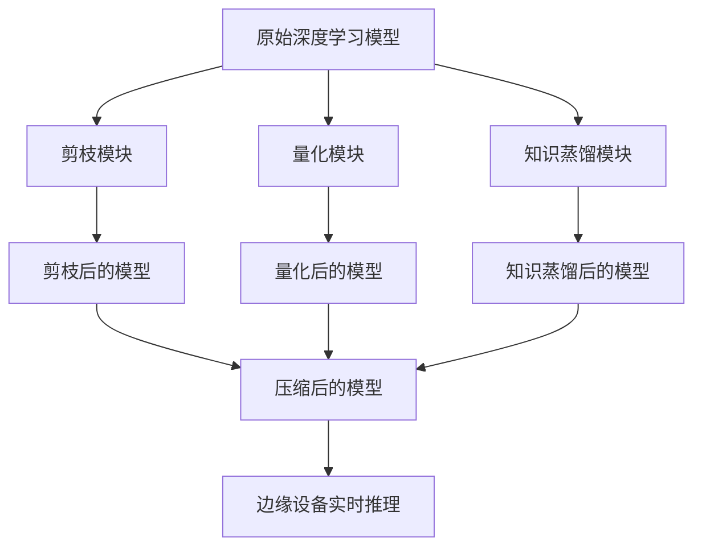

# 模型压缩技术在边缘设备实时推理中的创新应用

> 关键词：模型压缩技术、边缘设备、实时推理、创新应用、深度学习

> 摘要：本文聚焦于模型压缩技术在边缘设备实时推理中的创新应用。随着人工智能的快速发展，深度学习模型的规模不断增大，而边缘设备受限于计算资源和存储容量，难以直接运行这些大型模型。模型压缩技术应运而生，旨在减少模型的参数数量和计算复杂度，从而使边缘设备能够高效地进行实时推理。文章详细介绍了模型压缩技术的背景、核心概念、算法原理、数学模型，通过项目实战展示其具体应用，探讨了实际应用场景，推荐了相关工具和资源，最后总结了未来发展趋势与挑战，并提供常见问题解答和扩展阅读参考资料，以期为相关领域的研究和实践提供全面且深入的参考。

## 1. 背景介绍 
### 1.1 目的和范围
随着物联网（IoT）、自动驾驶、智能安防等领域的快速发展，边缘设备（如智能手机、智能摄像头、传感器节点等）在数据处理和决策中扮演着越来越重要的角色。这些设备需要实时处理大量的数据，并做出快速响应。然而，边缘设备通常具有有限的计算资源、存储容量和能源供应，难以直接运行复杂的深度学习模型。模型压缩技术的出现为解决这一问题提供了有效的途径。本文的目的是深入探讨模型压缩技术在边缘设备实时推理中的创新应用，包括其原理、方法、实际案例以及未来发展趋势。范围涵盖了常见的模型压缩技术，如剪枝、量化、知识蒸馏等，以及这些技术在不同边缘设备和应用场景中的应用。

### 1.2 预期读者
本文预期读者包括从事人工智能、深度学习、边缘计算等领域的研究人员、工程师和学生。对于希望了解模型压缩技术在边缘设备上应用的相关人员，以及对实时推理和资源受限环境下模型优化感兴趣的读者都具有参考价值。

### 1.3 文档结构概述
本文将按照以下结构进行组织：首先介绍模型压缩技术的背景，包括目的、预期读者和文档结构概述；接着阐述模型压缩技术的核心概念与联系，通过文本示意图和 Mermaid 流程图进行详细说明；然后讲解核心算法原理和具体操作步骤，并使用 Python 源代码进行详细阐述；随后介绍数学模型和公式，并通过举例说明；再通过项目实战展示模型压缩技术在边缘设备实时推理中的具体应用，包括开发环境搭建、源代码详细实现和代码解读；之后探讨实际应用场景；推荐相关的工具和资源；总结未来发展趋势与挑战；提供常见问题与解答；最后给出扩展阅读和参考资料。

### 1.4 术语表
#### 1.4.1 核心术语定义
- **模型压缩技术**：指通过各种方法减少深度学习模型的参数数量、计算复杂度和存储需求，同时尽量保持模型的性能。
- **边缘设备**：指位于网络边缘的设备，如智能手机、智能摄像头、传感器节点等，通常具有有限的计算资源、存储容量和能源供应。
- **实时推理**：指在短时间内对输入数据进行处理并输出结果的过程，要求系统具有低延迟和高响应速度。
- **深度学习模型**：指基于神经网络的机器学习模型，通过多层神经元的非线性变换来学习数据的特征和模式。
- **剪枝**：指通过去除神经网络中对模型性能影响较小的连接或神经元，来减少模型的参数数量和计算复杂度。
- **量化**：指将神经网络中的浮点数参数转换为低精度的整数或定点数，以减少模型的存储需求和计算量。
- **知识蒸馏**：指将一个大的、复杂的教师模型的知识迁移到一个小的、简单的学生模型中，使学生模型能够达到与教师模型相近的性能。

#### 1.4.2 相关概念解释
- **稀疏性**：指神经网络中大量的连接或神经元对模型性能的贡献较小，可以被去除，从而使模型具有稀疏结构。
- **低精度计算**：指使用低精度的数据类型（如 8 位整数、16 位浮点数等）进行计算，以减少计算量和存储需求。
- **模型性能**：指模型在特定任务上的表现，通常用准确率、召回率、F1 值等指标来衡量。

#### 1.4.3 缩略词列表
- **IoT**：Internet of Things，物联网
- **CNN**：Convolutional Neural Network，卷积神经网络
- **RNN**：Recurrent Neural Network，循环神经网络
- **GPU**：Graphics Processing Unit，图形处理单元
- **CPU**：Central Processing Unit，中央处理单元

## 2. 核心概念与联系 
### 核心概念原理
模型压缩技术主要基于以下几个核心概念：

#### 剪枝
剪枝的基本思想是通过分析神经网络中连接或神经元的重要性，去除那些对模型性能影响较小的部分。可以从不同的角度来衡量连接或神经元的重要性，例如权重的绝对值、梯度的大小等。剪枝可以分为结构化剪枝和非结构化剪枝。结构化剪枝通常会去除整个卷积核、通道或神经元，而非结构化剪枝则会去除单个连接。

#### 量化
量化是将神经网络中的浮点数参数转换为低精度的整数或定点数。在深度学习中，通常使用 32 位浮点数来表示参数，但在实际应用中，很多参数并不需要这么高的精度。通过量化，可以将参数的位数减少到 8 位、4 位甚至更低，从而减少模型的存储需求和计算量。量化可以分为对称量化和非对称量化，以及均匀量化和非均匀量化。

#### 知识蒸馏
知识蒸馏的核心思想是将一个大的、复杂的教师模型的知识迁移到一个小的、简单的学生模型中。教师模型通常具有较高的性能，但参数数量和计算复杂度较大；学生模型则参数数量较少，计算复杂度较低。通过让学生模型学习教师模型的输出（软标签），可以使学生模型达到与教师模型相近的性能。

### 架构的文本示意图
```plaintext
原始深度学习模型
|
|-- 剪枝模块
|   |-- 分析连接或神经元重要性
|   |-- 去除不重要部分
|   |-- 得到剪枝后的模型
|
|-- 量化模块
|   |-- 将浮点数参数转换为低精度整数或定点数
|   |-- 得到量化后的模型
|
|-- 知识蒸馏模块
|   |-- 教师模型（大而复杂）
|   |   |-- 输出软标签
|   |-- 学生模型（小而简单）
|       |-- 学习教师模型的软标签
|       |-- 得到知识蒸馏后的模型
|
|-- 压缩后的模型（适用于边缘设备实时推理）
```

### Mermaid 流程图


## 3. 核心算法原理 & 具体操作步骤 
### 剪枝算法原理及 Python 实现
#### 原理
剪枝算法的核心是确定连接或神经元的重要性。一种简单的方法是基于权重的绝对值进行剪枝。对于一个神经网络中的权重矩阵 $W$，可以计算每个权重的绝对值 $|w_{ij}|$，然后根据设定的阈值 $\tau$，将绝对值小于 $\tau$ 的权重置为 0。

#### Python 代码实现
```python
import torch
import torch.nn as nn

# 定义一个简单的神经网络
class SimpleNet(nn.Module):
    def __init__(self):
        super(SimpleNet, self).__init__()
        self.fc1 = nn.Linear(10, 20)
        self.fc2 = nn.Linear(20, 5)

    def forward(self, x):
        x = torch.relu(self.fc1(x))
        x = self.fc2(x)
        return x

# 初始化模型
model = SimpleNet()

# 剪枝函数
def prune_model(model, threshold):
    for name, param in model.named_parameters():
        if 'weight' in name:
            weight = param.data
            mask = torch.abs(weight) > threshold
            weight[~mask] = 0
            param.data = weight
    return model

# 设定阈值
threshold = 0.1

# 进行剪枝
pruned_model = prune_model(model, threshold)
```

### 量化算法原理及 Python 实现
#### 原理
量化算法的基本思想是将浮点数参数映射到一个有限的整数范围内。一种简单的均匀量化方法是将浮点数 $x$ 映射到整数 $q$ ，计算公式为：

$q = \text{round}(\frac{x - x_{\text{min}}}{x_{\text{max}} - x_{\text{min}}} \times (q_{\text{max}} - q_{\text{min}}) + q_{\text{min}})$

其中，$x_{\text{min}}$ 和 $x_{\text{max}}$ 是浮点数的最小值和最大值，$q_{\text{min}}$ 和 $q_{\text{max}}$ 是整数的最小值和最大值。

#### Python 代码实现
```python
import torch

# 量化函数
def quantize_tensor(tensor, num_bits=8):
    min_val = tensor.min()
    max_val = tensor.max()
    q_min = -2 ** (num_bits - 1)
    q_max = 2 ** (num_bits - 1) - 1
    scale = (max_val - min_val) / (q_max - q_min)
    zero_point = q_min - round(min_val / scale)
    quantized_tensor = torch.round(tensor / scale + zero_point).clamp(q_min, q_max)
    return quantized_tensor, scale, zero_point

# 示例张量
tensor = torch.randn(10)

# 进行量化
quantized_tensor, scale, zero_point = quantize_tensor(tensor)
```

### 知识蒸馏算法原理及 Python 实现
#### 原理
知识蒸馏的目标是让学生模型学习教师模型的软标签。软标签是教师模型的输出经过温度参数 $T$ 处理后的概率分布。学生模型的损失函数通常由两部分组成：一部分是学生模型的输出与真实标签之间的交叉熵损失，另一部分是学生模型的输出与教师模型的软标签之间的交叉熵损失。

#### Python 代码实现
```python
import torch
import torch.nn as nn
import torch.optim as optim

# 定义教师模型和学生模型
class TeacherNet(nn.Module):
    def __init__(self):
        super(TeacherNet, self).__init__()
        self.fc1 = nn.Linear(10, 20)
        self.fc2 = nn.Linear(20, 5)

    def forward(self, x):
        x = torch.relu(self.fc1(x))
        x = self.fc2(x)
        return x

class StudentNet(nn.Module):
    def __init__(self):
        super(StudentNet, self).__init__()
        self.fc1 = nn.Linear(10, 10)
        self.fc2 = nn.Linear(10, 5)

    def forward(self, x):
        x = torch.relu(self.fc1(x))
        x = self.fc2(x)
        return x

# 初始化模型
teacher_model = TeacherNet()
student_model = StudentNet()

# 定义损失函数和优化器
criterion = nn.CrossEntropyLoss()
optimizer = optim.Adam(student_model.parameters(), lr=0.001)

# 知识蒸馏函数
def knowledge_distillation(teacher_model, student_model, optimizer, data, labels, temperature=2.0, alpha=0.5):
    teacher_outputs = teacher_model(data)
    student_outputs = student_model(data)

    # 计算软标签损失
    soft_targets = nn.functional.softmax(teacher_outputs / temperature, dim=1)
    soft_loss = nn.functional.kl_div(nn.functional.log_softmax(student_outputs / temperature, dim=1), soft_targets, reduction='batchmean') * (temperature ** 2)

    # 计算硬标签损失
    hard_loss = criterion(student_outputs, labels)

    # 总损失
    loss = alpha * soft_loss + (1 - alpha) * hard_loss

    # 反向传播和优化
    optimizer.zero_grad()
    loss.backward()
    optimizer.step()

    return loss.item()

# 示例数据
data = torch.randn(10, 10)
labels = torch.randint(0, 5, (10,))

# 进行知识蒸馏
loss = knowledge_distillation(teacher_model, student_model, optimizer, data, labels)
```

## 4. 数学模型和公式 & 详细讲解 & 举例说明 
### 剪枝的数学模型
剪枝的数学模型可以表示为：

设神经网络的权重矩阵为 $W \in \mathbb{R}^{m \times n}$，其中 $m$ 是输入神经元的数量，$n$ 是输出神经元的数量。对于每个权重 $w_{ij}$，其重要性可以用一个函数 $s(w_{ij})$ 来衡量。设定一个阈值 $\tau$，则剪枝后的权重矩阵 $\hat{W}$ 可以表示为：

$\hat{w}_{ij} = \begin{cases}
w_{ij}, & \text{if } s(w_{ij}) \geq \tau \\
0, & \text{if } s(w_{ij}) < \tau
\end{cases}$

例如，当 $s(w_{ij}) = |w_{ij}|$ 时，就是基于权重绝对值的剪枝方法。

### 量化的数学模型
均匀量化的数学模型如前面所述，将浮点数 $x$ 映射到整数 $q$ 的公式为：

$q = \text{round}(\frac{x - x_{\text{min}}}{x_{\text{max}} - x_{\text{min}}} \times (q_{\text{max}} - q_{\text{min}}) + q_{\text{min}})$

反量化公式为：

$x' = (q - q_{\text{min}}) \times \frac{x_{\text{max}} - x_{\text{min}}}{q_{\text{max}} - q_{\text{min}}} + x_{\text{min}}$

其中，$x'$ 是反量化后的浮点数。

例如，假设有一个浮点数张量 $x = [0.1, 0.2, 0.3, 0.4, 0.5]$，$x_{\text{min}} = 0.1$，$x_{\text{max}} = 0.5$，$q_{\text{min}} = -128$，$q_{\text{max}} = 127$，$num\_bits = 8$。

首先计算 scale：

$scale = \frac{x_{\text{max}} - x_{\text{min}}}{q_{\text{max}} - q_{\text{min}}} = \frac{0.5 - 0.1}{127 - (-128)} = \frac{0.4}{255} \approx 0.00157$

然后计算 zero_point：

$zero\_point = q_{\text{min}} - round(\frac{x_{\text{min}}}{scale}) = -128 - round(\frac{0.1}{0.00157}) \approx -128 - 64 = -192$

接着进行量化：

$q_1 = \text{round}(\frac{0.1 - 0.1}{0.5 - 0.1} \times (127 - (-128)) + (-128)) = -128$

$q_2 = \text{round}(\frac{0.2 - 0.1}{0.5 - 0.1} \times (127 - (-128)) + (-128)) = -64$

$q_3 = \text{round}(\frac{0.3 - 0.1}{0.5 - 0.1} \times (127 - (-128)) + (-128)) = 0$

$q_4 = \text{round}(\frac{0.4 - 0.1}{0.5 - 0.1} \times (127 - (-128)) + (-128)) = 64$

$q_5 = \text{round}(\frac{0.5 - 0.1}{0.5 - 0.1} \times (127 - (-128)) + (-128)) = 127$

### 知识蒸馏的数学模型
知识蒸馏的损失函数可以表示为：

$L = \alpha L_{\text{soft}} + (1 - \alpha) L_{\text{hard}}$

其中，$L_{\text{soft}}$ 是学生模型的输出与教师模型的软标签之间的损失，通常使用 KL 散度来计算：

$L_{\text{soft}} = D_{\text{KL}}(p_s || p_t) = \sum_{i} p_t(i) \log \frac{p_t(i)}{p_s(i)}$

其中，$p_s$ 是学生模型的输出经过 softmax 处理后的概率分布，$p_t$ 是教师模型的输出经过温度参数 $T$ 处理后的软标签的概率分布。

$L_{\text{hard}}$ 是学生模型的输出与真实标签之间的交叉熵损失：

$L_{\text{hard}} = -\sum_{i} y_i \log p_s(i)$

其中，$y_i$ 是真实标签的 one-hot 编码。

例如，假设有一个二分类问题，教师模型的输出为 $[0.8, 0.2]$，学生模型的输出为 $[0.7, 0.3]$，真实标签为 $[1, 0]$，温度参数 $T = 2.0$，$\alpha = 0.5$。

首先计算软标签：

$p_t = \text{softmax}(\frac{[0.8, 0.2]}{2.0}) = [0.731, 0.269]$

$p_s = \text{softmax}([0.7, 0.3]) = [0.622, 0.378]$

然后计算 $L_{\text{soft}}$：

$L_{\text{soft}} = D_{\text{KL}}(p_s || p_t) = 0.731 \log \frac{0.731}{0.622} + 0.269 \log \frac{0.269}{0.378} \approx 0.043$

接着计算 $L_{\text{hard}}$：

$L_{\text{hard}} = -\sum_{i} y_i \log p_s(i) = -1 \times \log 0.622 \approx 0.474$

最后计算总损失 $L$：

$L = 0.5 \times 0.043 + (1 - 0.5) \times 0.474 = 0.259$

## 5. 项目实战：代码实际案例和详细解释说明 
### 5.1  开发环境搭建
#### 硬件环境
- 边缘设备：可以选择一款常见的智能手机、智能摄像头或嵌入式开发板，如树莓派（Raspberry Pi）。
- 开发主机：一台性能较好的计算机，配备 GPU（如 NVIDIA GPU）以加速训练过程。

#### 软件环境
- 操作系统：开发主机可以使用 Linux 系统（如 Ubuntu），边缘设备根据其硬件平台选择相应的操作系统。
- 深度学习框架：使用 PyTorch 作为深度学习框架，其提供了丰富的工具和接口用于模型开发和压缩。
- 其他依赖库：安装 NumPy、Matplotlib 等常用的 Python 库。

#### 安装步骤
1. 在开发主机上安装 PyTorch：
```bash
pip install torch torchvision
```
2. 安装其他依赖库：
```bash
pip install numpy matplotlib
```
3. 在边缘设备上根据其硬件平台和操作系统安装相应版本的 PyTorch 和依赖库。

### 5.2  源代码详细实现和代码解读
#### 项目背景
本项目以图像分类任务为例，使用 CIFAR-10 数据集，将一个预训练的 ResNet 模型进行压缩，然后在边缘设备上进行实时推理。

#### 代码实现
```python
import torch
import torch.nn as nn
import torch.optim as optim
import torchvision
import torchvision.transforms as transforms
from torch.utils.data import DataLoader
from torchvision.models import resnet18

# 数据预处理
transform = transforms.Compose([
    transforms.ToTensor(),
    transforms.Normalize((0.5, 0.5, 0.5), (0.5, 0.5, 0.5))
])

# 加载 CIFAR-10 数据集
trainset = torchvision.datasets.CIFAR10(root='./data', train=True,
                                        download=True, transform=transform)
trainloader = DataLoader(trainset, batch_size=32, shuffle=True)

testset = torchvision.datasets.CIFAR10(root='./data', train=False,
                                       download=True, transform=transform)
testloader = DataLoader(testset, batch_size=32, shuffle=False)

# 定义模型
model = resnet18(pretrained=True)
num_ftrs = model.fc.in_features
model.fc = nn.Linear(num_ftrs, 10)

# 训练模型
criterion = nn.CrossEntropyLoss()
optimizer = optim.SGD(model.parameters(), lr=0.001, momentum=0.9)

device = torch.device("cuda:0" if torch.cuda.is_available() else "cpu")
model.to(device)

for epoch in range(5):
    running_loss = 0.0
    for i, data in enumerate(trainloader, 0):
        inputs, labels = data[0].to(device), data[1].to(device)

        optimizer.zero_grad()

        outputs = model(inputs)
        loss = criterion(outputs, labels)
        loss.backward()
        optimizer.step()

        running_loss += loss.item()
        if i % 200 == 199:
            print(f'[{epoch + 1}, {i + 1:5d}] loss: {running_loss / 200:.3f}')
            running_loss = 0.0

print('Finished Training')

# 模型压缩 - 剪枝
def prune_model(model, threshold):
    for name, param in model.named_parameters():
        if 'weight' in name:
            weight = param.data
            mask = torch.abs(weight) > threshold
            weight[~mask] = 0
            param.data = weight
    return model

threshold = 0.01
pruned_model = prune_model(model, threshold)

# 模型量化
def quantize_model(model):
    quantized_model = torch.quantization.quantize_dynamic(
        model, {nn.Conv2d, nn.Linear}, dtype=torch.qint8
    )
    return quantized_model

quantized_model = quantize_model(pruned_model)

# 在边缘设备上进行实时推理
# 假设边缘设备已经安装了 PyTorch 和相关依赖库
# 将量化后的模型保存到文件
torch.save(quantized_model.state_dict(), 'quantized_model.pth')

# 在边缘设备上加载模型
edge_model = resnet18()
num_ftrs = edge_model.fc.in_features
edge_model.fc = nn.Linear(num_ftrs, 10)
edge_model.load_state_dict(torch.load('quantized_model.pth'))
edge_model.eval()

# 从边缘设备的摄像头获取图像进行实时推理
# 这里只是一个示例，实际实现需要根据边缘设备的摄像头接口进行调整
import cv2
import numpy as np

cap = cv2.VideoCapture(0)

while True:
    ret, frame = cap.read()
    if not ret:
        break

    # 图像预处理
    frame = cv2.cvtColor(frame, cv2.COLOR_BGR2RGB)
    frame = cv2.resize(frame, (32, 32))
    frame = np.transpose(frame, (2, 0, 1))
    frame = frame / 255.0
    frame = (frame - 0.5) / 0.5
    frame = torch.tensor(frame, dtype=torch.float32).unsqueeze(0)

    # 推理
    with torch.no_grad():
        output = edge_model(frame)
        _, predicted = torch.max(output.data, 1)

    # 显示结果
    cv2.putText(frame, f'Predicted: {predicted.item()}', (10, 30), cv2.FONT_HERSHEY_SIMPLEX, 1, (0, 255, 0), 2)
    cv2.imshow('Real-time Inference', frame)

    if cv2.waitKey(1) & 0xFF == ord('q'):
        break

cap.release()
cv2.destroyAllWindows()
```

#### 代码解读
1. **数据预处理**：使用 `torchvision.transforms` 对图像进行预处理，包括转换为张量和归一化操作。
2. **加载数据集**：使用 `torchvision.datasets.CIFAR10` 加载 CIFAR-10 数据集，并使用 `DataLoader` 进行批量加载。
3. **定义模型**：使用预训练的 ResNet-18 模型，并修改最后一层全连接层以适应 CIFAR-10 数据集的 10 个类别。
4. **训练模型**：使用交叉熵损失函数和随机梯度下降优化器进行模型训练。
5. **模型压缩**：
    - **剪枝**：定义 `prune_model` 函数，基于权重的绝对值进行剪枝。
    - **量化**：使用 `torch.quantization.quantize_dynamic` 函数对剪枝后的模型进行动态量化。
6. **实时推理**：
    - 将量化后的模型保存到文件。
    - 在边缘设备上加载模型。
    - 使用 OpenCV 从边缘设备的摄像头获取图像，进行预处理后进行实时推理，并显示推理结果。

### 5.3  代码解读与分析
#### 剪枝的影响
剪枝通过去除神经网络中对模型性能影响较小的连接，减少了模型的参数数量和计算复杂度。在代码中，通过设定阈值 `threshold` 来控制剪枝的程度。剪枝后，模型的存储需求和计算量会减少，但可能会对模型的性能产生一定的影响。因此，需要在剪枝程度和模型性能之间进行权衡。

#### 量化的影响
量化将模型的浮点数参数转换为低精度的整数，进一步减少了模型的存储需求和计算量。在代码中，使用 `torch.quantization.quantize_dynamic` 函数进行动态量化，该函数会自动调整量化参数。量化后的模型在边缘设备上可以更快地进行推理，但可能会引入一定的量化误差，导致模型性能略有下降。

#### 实时推理的性能
通过在边缘设备上进行实时推理，可以减少数据传输延迟，提高系统的响应速度。在代码中，使用 OpenCV 从摄像头获取图像，进行预处理后直接在边缘设备上进行推理，并显示推理结果。这种方式可以满足实时性要求较高的应用场景，如智能安防、自动驾驶等。

## 6. 实际应用场景 
### 智能安防
在智能安防领域，边缘设备（如智能摄像头）需要实时处理大量的视频数据，进行目标检测、人脸识别等任务。模型压缩技术可以使这些边缘设备在有限的计算资源和存储容量下，高效地运行复杂的深度学习模型，实现实时监控和预警。例如，在一个小区的安防监控系统中，智能摄像头可以实时检测人员和车辆的进出情况，并将异常情况及时上报给监控中心。

### 自动驾驶
自动驾驶车辆需要在行驶过程中实时处理大量的传感器数据，如摄像头图像、雷达数据等，进行目标检测、路径规划等任务。模型压缩技术可以使自动驾驶车辆的边缘计算单元在有限的计算资源和能源供应下，快速准确地进行决策，提高自动驾驶的安全性和可靠性。例如，在自动驾驶汽车中，通过压缩深度学习模型，可以在保证性能的前提下，减少计算资源的消耗，延长电池续航时间。

### 智能家居
在智能家居系统中，边缘设备（如智能音箱、智能门锁等）需要实时处理用户的语音指令、图像信息等，进行智能控制和交互。模型压缩技术可以使这些边缘设备在低功耗的情况下，高效地运行语音识别、图像识别等模型，实现智能家居的智能化和便捷化。例如，智能音箱可以通过压缩的语音识别模型，快速准确地识别用户的语音指令，并执行相应的操作。

### 工业物联网
在工业物联网领域，边缘设备（如传感器节点、工业机器人等）需要实时处理大量的工业数据，进行故障诊断、质量检测等任务。模型压缩技术可以使这些边缘设备在有限的计算资源和通信带宽下，高效地运行数据分析和预测模型，提高工业生产的效率和质量。例如，在一个工厂的生产线上，传感器节点可以通过压缩的故障诊断模型，实时监测设备的运行状态，及时发现故障并进行预警。

## 7. 工具和资源推荐
### 7.1 学习资源推荐
#### 7.1.1 书籍推荐
- 《深度学习》（Deep Learning）：由 Ian Goodfellow、Yoshua Bengio 和 Aaron Courville 所著，是深度学习领域的经典教材，涵盖了深度学习的基本原理、算法和应用。
- 《动手学深度学习》（Dive into Deep Learning）：由 Aston Zhang、Zachary C. Lipton、Mu Li 和 Alexander J. Smola 所著，以 PyTorch 为主要框架，通过大量的代码示例和实践项目，帮助读者快速掌握深度学习的实践技能。
- 《模型压缩与加速》：专门介绍模型压缩技术的书籍，详细讲解了剪枝、量化、知识蒸馏等模型压缩方法的原理和实现。

#### 7.1.2 在线课程
- Coursera 上的“深度学习专项课程”（Deep Learning Specialization）：由 Andrew Ng 教授授课，包括深度学习的基础知识、卷积神经网络、循环神经网络等内容，是学习深度学习的优质课程。
- edX 上的“应用数据科学与深度学习”（Applied Data Science with Deep Learning）：该课程结合实际应用案例，介绍了深度学习在各个领域的应用，包括模型压缩技术在边缘设备上的应用。
- 哔哩哔哩（B 站）上的相关深度学习教程：B 站有很多优秀的深度学习教程，由不同的博主分享，内容丰富多样，适合不同层次的学习者。

#### 7.1.3 技术博客和网站
- Medium：Medium 上有很多关于深度学习和模型压缩技术的优秀博客文章，作者来自不同的领域和背景，可以提供不同的视角和思路。
- arXiv：arXiv 是一个预印本数据库，包含了大量的最新研究成果，包括模型压缩技术的最新进展和相关论文。
- 机器之心：机器之心是一个专注于人工智能领域的科技媒体，提供了丰富的技术文章、研究报告和行业动态，对模型压缩技术的发展和应用有深入的报道和分析。

### 7.2 开发工具框架推荐
#### 7.2.1 IDE和编辑器
- PyCharm：PyCharm 是一款专门为 Python 开发设计的集成开发环境（IDE），提供了丰富的代码编辑、调试、版本控制等功能，非常适合深度学习项目的开发。
- Visual Studio Code（VS Code）：VS Code 是一款轻量级的代码编辑器，支持多种编程语言和插件扩展，通过安装相关的插件，可以方便地进行深度学习项目的开发和调试。

#### 7.2.2 调试和性能分析工具
- TensorBoard：TensorBoard 是 TensorFlow 提供的一个可视化工具，可以帮助用户可视化模型的训练过程、损失函数曲线、模型结构等信息，方便进行调试和性能分析。
- PyTorch Profiler：PyTorch Profiler 是 PyTorch 提供的一个性能分析工具，可以帮助用户分析模型的计算复杂度、内存使用情况等信息，找出性能瓶颈并进行优化。

#### 7.2.3 相关框架和库
- PyTorch：PyTorch 是一个开源的深度学习框架，提供了丰富的工具和接口用于模型开发和压缩，如 `torch.quantization` 模块提供了量化功能，`torch.nn.utils.prune` 模块提供了剪枝功能。
- TensorFlow：TensorFlow 是另一个广泛使用的深度学习框架，提供了多种模型压缩工具和方法，如 TensorFlow Lite 可以将模型转换为适合移动设备和边缘设备的轻量级格式。
- NNI（Neural Network Intelligence）：NNI 是一个开源的自动机器学习工具，提供了模型压缩、超参数调优等功能，可以帮助用户快速实现模型压缩和优化。

### 7.3 相关论文著作推荐
#### 7.3.1 经典论文
- 《Learning both Weights and Connections for Efficient Neural Networks》：这篇论文提出了一种基于剪枝的模型压缩方法，通过去除神经网络中不重要的连接，减少了模型的参数数量和计算复杂度。
- 《Deep Compression: Compressing Deep Neural Networks with Pruning, Trained Quantization and Huffman Coding》：该论文提出了一种综合的模型压缩方法，包括剪枝、量化和 Huffman 编码，实现了对深度学习模型的高效压缩。
- 《Distilling the Knowledge in a Neural Network》：这篇论文首次提出了知识蒸馏的概念，将一个大的、复杂的教师模型的知识迁移到一个小的、简单的学生模型中，使学生模型能够达到与教师模型相近的性能。

#### 7.3.2 最新研究成果
- 关注 arXiv 上关于模型压缩技术的最新论文，了解该领域的最新研究进展和创新方法。
- 参加国际人工智能会议（如 NeurIPS、ICML、CVPR 等），关注相关的研究报告和论文，获取最新的研究成果。

#### 7.3.3 应用案例分析
- 一些知名科技公司（如 Google、Microsoft、Facebook 等）会在其官方博客或学术会议上分享模型压缩技术在实际应用中的案例和经验，可以参考这些案例了解模型压缩技术在不同领域的应用效果和实践方法。

## 8. 总结：未来发展趋势与挑战
### 未来发展趋势
#### 更高效的压缩算法
未来，模型压缩技术将不断发展，出现更高效的压缩算法，能够在减少模型参数数量和计算复杂度的同时，更好地保持模型的性能。例如，结合多种压缩方法的混合压缩算法，以及基于强化学习的自适应压缩算法等。

#### 与硬件的深度融合
模型压缩技术将与边缘设备的硬件架构进行深度融合，充分利用硬件的特性和优势，实现更高效的计算和存储。例如，针对特定硬件平台设计专用的压缩算法和量化方案，提高模型在边缘设备上的运行效率。

#### 自动化模型压缩
随着人工智能技术的发展，自动化模型压缩将成为未来的发展趋势。通过使用自动机器学习（AutoML）技术，可以自动搜索最优的压缩策略和参数，减少人工干预，提高模型压缩的效率和效果。

#### 跨领域应用拓展
模型压缩技术将在更多的领域得到应用，如医疗、金融、教育等。在这些领域，边缘设备需要处理大量的敏感数据，模型压缩技术可以在保证数据隐私和安全的前提下，实现高效的实时推理。

### 挑战
#### 性能损失与压缩率的平衡
在模型压缩过程中，如何在减少模型参数数量和计算复杂度的同时，尽量减少性能损失，是一个需要解决的关键问题。需要找到合适的压缩方法和参数，实现性能损失与压缩率的最佳平衡。

#### 硬件兼容性
不同的边缘设备具有不同的硬件架构和计算能力，模型压缩技术需要考虑硬件兼容性问题。如何设计通用的压缩算法和量化方案，使其能够在不同的硬件平台上高效运行，是一个挑战。

#### 数据隐私和安全
在边缘设备上进行实时推理时，数据隐私和安全是一个重要的问题。模型压缩技术需要确保在压缩过程中不泄露敏感信息，同时保证模型的安全性和可靠性。

#### 模型可解释性
随着模型压缩技术的发展，模型的复杂度和规模不断降低，但同时也可能导致模型的可解释性变差。如何在模型压缩的同时，保持模型的可解释性，是一个需要进一步研究的问题。

## 9. 附录：常见问题与解答
### 模型压缩技术会对模型的性能产生多大的影响？
模型压缩技术会对模型的性能产生一定的影响，但具体影响程度取决于压缩方法、压缩率和数据集等因素。一般来说，合理选择压缩方法和参数，可以在减少模型参数数量和计算复杂度的同时，将性能损失控制在可接受的范围内。

### 如何选择合适的模型压缩方法？
选择合适的模型压缩方法需要考虑多个因素，如模型的类型、任务的要求、硬件平台的特性等。例如，如果模型的参数数量较多，可以考虑使用剪枝方法；如果需要减少计算量，可以选择量化方法；如果希望在保持性能的前提下减小模型规模，可以使用知识蒸馏方法。

### 模型压缩技术在边缘设备上的实现难度大吗？
模型压缩技术在边缘设备上的实现难度取决于边缘设备的硬件平台和计算能力。对于一些性能较强的边缘设备，实现模型压缩技术相对容易；而对于一些资源受限的边缘设备，可能需要进行更多的优化和调整。同时，还需要考虑边缘设备的操作系统、开发环境等因素。

### 模型压缩后的模型如何部署到边缘设备上？
模型压缩后的模型可以通过以下步骤部署到边缘设备上：
1. 将压缩后的模型保存为合适的格式（如 PyTorch 的 `.pth` 文件、TensorFlow Lite 的 `.tflite` 文件等）。
2. 在边缘设备上安装相应的深度学习框架和依赖库。
3. 在边缘设备上加载压缩后的模型，并进行实时推理。

### 模型压缩技术是否适用于所有类型的深度学习模型？
模型压缩技术适用于大多数类型的深度学习模型，如卷积神经网络（CNN）、循环神经网络（RNN）、Transformer 等。但不同类型的模型可能需要采用不同的压缩方法和参数，以达到最佳的压缩效果。

## 10. 扩展阅读 & 参考资料
### 扩展阅读
- 《人工智能：一种现代的方法》（Artificial Intelligence: A Modern Approach）：这本书全面介绍了人工智能的基本概念、算法和应用，对理解模型压缩技术的背景和应用场景有很大的帮助。
- 《深度学习与计算机视觉实战》：该书结合实际案例，介绍了深度学习在计算机视觉领域的应用，包括模型压缩技术在图像识别、目标检测等任务中的应用。

### 参考资料
- Goodfellow, I., Bengio, Y., & Courville, A. (2016). Deep Learning. MIT Press.
- Zhang, A., Lipton, Z. C., Li, M., & Smola, A. J. (2020). Dive into Deep Learning.
- Han, S., Mao, H., & Dally, W. J. (2015). Deep Compression: Compressing Deep Neural Networks with Pruning, Trained Quantization and Huffman Coding. arXiv preprint arXiv:1510.00149.
- Hinton, G., Vinyals, O., & Dean, J. (2015). Distilling the Knowledge in a Neural Network. arXiv preprint arXiv:1503.02531.