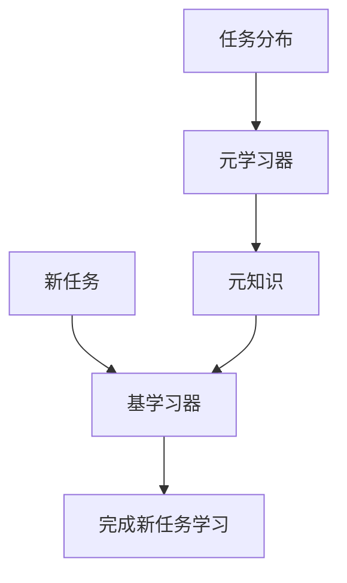

# 模型训练中的元学习策略在推理任务中的创新

> 关键词：元学习、模型训练、推理任务、创新策略、机器学习、深度学习、智能推理

> 摘要：本文聚焦于模型训练中的元学习策略在推理任务中的创新应用。首先介绍了元学习和推理任务的背景知识，阐述了研究的目的、范围、预期读者等内容。接着深入剖析元学习的核心概念与联系，详细讲解其核心算法原理并给出Python代码示例。通过数学模型和公式对元学习进行理论阐释，并结合具体例子说明。在项目实战部分，给出代码实际案例并进行详细解释。探讨了元学习在不同领域的实际应用场景，推荐了相关的学习资源、开发工具框架以及论文著作。最后总结了元学习在推理任务中的未来发展趋势与挑战，解答了常见问题并提供扩展阅读与参考资料，旨在为相关领域的研究和实践提供全面且深入的指导。

## 1. 背景介绍 
### 1.1 目的和范围
元学习（Meta - Learning）作为机器学习领域的前沿技术，旨在让模型具备快速学习和适应新任务的能力。传统的机器学习模型通常需要大量的数据进行训练，且对于新的任务往往需要重新进行复杂的训练过程。而元学习的出现为解决这些问题提供了新的思路。本文的目的在于探讨模型训练中的元学习策略如何在推理任务中实现创新，研究范围涵盖元学习的基本概念、核心算法、数学模型，以及其在实际推理任务中的应用案例等方面。通过对这些内容的研究，揭示元学习在提高推理效率、准确性和适应性等方面的潜力和价值。

### 1.2 预期读者
本文预期读者包括从事机器学习、深度学习、人工智能等相关领域的研究人员、工程师和学生。对于希望深入了解元学习技术，并将其应用于推理任务的专业人士，本文将提供全面的技术知识和实践指导。同时，对于对人工智能前沿技术感兴趣的爱好者，也能通过本文初步了解元学习在推理任务中的创新应用。

### 1.3 文档结构概述
本文首先介绍背景知识，包括目的、范围、预期读者等内容。接着阐述元学习的核心概念与联系，通过文本示意图和Mermaid流程图展示其原理和架构。然后详细讲解元学习的核心算法原理，并用Python代码进行说明。再通过数学模型和公式对元学习进行理论分析，并举例说明。在项目实战部分，给出开发环境搭建步骤、源代码实现和代码解读。之后探讨元学习在实际应用场景中的表现。推荐相关的学习资源、开发工具框架和论文著作。最后总结元学习在推理任务中的未来发展趋势与挑战，解答常见问题并提供扩展阅读与参考资料。

### 1.4 术语表
#### 1.4.1 核心术语定义
- **元学习（Meta - Learning）**：也称为“学习如何学习”，是一种让模型能够从多个任务中学习通用的学习策略，从而快速适应新任务的机器学习方法。
- **推理任务（Inference Task）**：指在模型训练完成后，使用训练好的模型对新的数据进行预测、分类、生成等操作的任务。
- **元知识（Meta - Knowledge）**：元学习过程中学习到的关于如何学习的知识，包括学习率、优化器参数等。
- **基学习器（Base Learner）**：在元学习中，用于具体任务学习的模型。
- **元学习器（Meta - Learner）**：负责学习元知识，指导基学习器快速适应新任务的模型。

#### 1.4.2 相关概念解释
- **少样本学习（Few - Shot Learning）**：是元学习的一个重要应用场景，指在只有少量样本的情况下，模型能够快速学习并完成任务的能力。
- **快速适应（Fast Adaptation）**：元学习模型在面对新任务时，能够迅速调整自身参数以适应新任务的特性。
- **任务分布（Task Distribution）**：在元学习中，多个任务构成的分布，元学习的目标是从这个分布中学习通用的学习策略。

#### 1.4.3 缩略词列表
- **ML（Machine Learning）**：机器学习
- **DL（Deep Learning）**：深度学习
- **MAML（Model - Agnostic Meta - Learning）**：模型无关元学习
- **FOMAML（First - Order Model - Agnostic Meta - Learning）**：一阶模型无关元学习

## 2. 核心概念与联系 

### 元学习的基本原理
元学习的核心思想是“学习如何学习”。传统的机器学习方法通常是针对单个任务进行训练，而元学习则是在多个任务上进行学习，从而学习到通用的学习策略。这些通用的学习策略可以帮助模型在面对新任务时，快速调整自身参数，以适应新任务的要求。

### 元学习的架构
元学习的架构通常包括元学习器和基学习器。元学习器负责学习元知识，如学习率、优化器参数等，而基学习器则是具体用于完成各个任务的模型。元学习器通过对多个任务的学习，将学到的元知识传递给基学习器，使得基学习器能够快速适应新任务。

### 文本示意图
元学习的基本架构可以用以下文本描述：

元学习系统包含一个元学习器和多个基学习器。元学习器从任务分布中获取多个任务，对这些任务进行学习，提取元知识。基学习器在面对新任务时，利用元学习器提供的元知识，快速调整自身参数，完成新任务的学习。

### Mermaid流程图


## 3. 核心算法原理 & 具体操作步骤 

### 模型无关元学习（MAML）算法原理
模型无关元学习（MAML）是一种经典的元学习算法。其核心思想是找到一组初始化参数，使得模型在经过少量的梯度更新后，能够在新任务上取得较好的性能。

### 具体操作步骤
1. **初始化参数**：随机初始化模型的参数 $\theta$。
2. **采样任务**：从任务分布中采样一组任务 $\{T_1, T_2, \cdots, T_n\}$。
3. **内部更新**：对于每个任务 $T_i$，使用当前参数 $\theta$ 初始化基学习器，然后在任务 $T_i$ 的支持集上进行少量的梯度更新，得到更新后的参数 $\theta_i'$。
4. **外部更新**：使用更新后的参数 $\theta_i'$ 在任务 $T_i$ 的查询集上计算损失，然后对参数 $\theta$ 进行更新，以最小化所有任务的查询集损失之和。
5. **重复步骤2 - 4**：不断重复上述步骤，直到模型收敛。

### Python源代码实现
```python
import torch
import torch.nn as nn
import torch.optim as optim

# 定义一个简单的神经网络模型
class SimpleModel(nn.Module):
    def __init__(self, input_size, hidden_size, output_size):
        super(SimpleModel, self).__init__()
        self.fc1 = nn.Linear(input_size, hidden_size)
        self.relu = nn.ReLU()
        self.fc2 = nn.Linear(hidden_size, output_size)

    def forward(self, x):
        out = self.fc1(x)
        out = self.relu(out)
        out = self.fc2(out)
        return out

# 定义MAML算法
def maml(model, tasks, num_inner_steps, inner_lr, outer_lr, num_epochs):
    meta_optimizer = optim.Adam(model.parameters(), lr=outer_lr)

    for epoch in range(num_epochs):
        meta_loss = 0
        for task in tasks:
            # 复制模型参数
            fast_weights = list(model.parameters())

            # 内部更新
            for _ in range(num_inner_steps):
                support_inputs, support_labels = task.get_support_set()
                support_outputs = model.forward(support_inputs)
                support_loss = nn.CrossEntropyLoss()(support_outputs, support_labels)

                grads = torch.autograd.grad(support_loss, fast_weights)
                fast_weights = [w - inner_lr * g for w, g in zip(fast_weights, grads)]

            # 外部更新
            query_inputs, query_labels = task.get_query_set()
            query_outputs = model.forward(query_inputs)
            query_loss = nn.CrossEntropyLoss()(query_outputs, query_labels)
            meta_loss += query_loss

        # 元更新
        meta_optimizer.zero_grad()
        meta_loss.backward()
        meta_optimizer.step()

        if (epoch + 1) % 100 == 0:
            print(f'Epoch {epoch + 1}, Meta Loss: {meta_loss.item()}')

    return model
```

### 代码解释
- `SimpleModel` 类定义了一个简单的两层神经网络模型。
- `maml` 函数实现了MAML算法。在每个epoch中，从任务分布中采样任务，进行内部更新和外部更新，最后使用元优化器对模型参数进行更新。

## 4. 数学模型和公式 & 详细讲解 & 举例说明 

### MAML的数学模型
MAML的目标是找到一组初始化参数 $\theta$，使得在经过少量的梯度更新后，模型在新任务上的损失最小。具体来说，对于一个任务 $T$，其支持集为 $S_T$，查询集为 $Q_T$，MAML的优化目标可以表示为：

$$\min_{\theta} \sum_{T \in \mathcal{T}} \mathcal{L}_T \left( \theta' \right)$$

其中，$\theta'$ 是在支持集 $S_T$ 上进行少量梯度更新后的参数，$\mathcal{L}_T$ 是任务 $T$ 的查询集损失，$\mathcal{T}$ 是任务分布。

### 内部更新公式
在支持集 $S_T$ 上进行一次梯度更新的公式为：

$$\theta' = \theta - \alpha \nabla_{\theta} \mathcal{L}_T(\theta)$$

其中，$\alpha$ 是内部学习率，$\nabla_{\theta} \mathcal{L}_T(\theta)$ 是在支持集 $S_T$ 上计算的损失 $\mathcal{L}_T(\theta)$ 关于参数 $\theta$ 的梯度。

### 外部更新公式
在查询集 $Q_T$ 上计算损失，并对参数 $\theta$ 进行更新的公式为：

$$\theta \leftarrow \theta - \beta \nabla_{\theta} \sum_{T \in \mathcal{T}} \mathcal{L}_T \left( \theta' \right)$$

其中，$\beta$ 是外部学习率。

### 举例说明
假设我们有一个分类任务，输入是一个二维向量，输出是一个类别标签。任务分布包含多个这样的分类任务。我们使用MAML算法来训练模型。

- **初始化参数**：随机初始化模型的参数 $\theta$。
- **采样任务**：从任务分布中采样一个任务 $T$。
- **内部更新**：在任务 $T$ 的支持集上进行一次梯度更新，得到更新后的参数 $\theta'$。
- **外部更新**：在任务 $T$ 的查询集上计算损失，然后对参数 $\theta$ 进行更新。

通过不断重复上述步骤，模型会逐渐学习到通用的学习策略，从而能够快速适应新的分类任务。

## 5. 项目实战：代码实际案例和详细解释说明 

### 5.1  开发环境搭建
- **操作系统**：Ubuntu 20.04
- **Python版本**：Python 3.8
- **深度学习框架**：PyTorch 1.9.0
- **开发工具**：Jupyter Notebook

### 5.2  源代码详细实现和代码解读
```python
import torch
import torch.nn as nn
import torch.optim as optim
import numpy as np

# 定义任务类
class Task:
    def __init__(self, num_samples, input_size, output_size):
        self.input_size = input_size
        self.output_size = output_size
        self.num_samples = num_samples
        self.inputs = torch.randn(num_samples, input_size)
        self.labels = torch.randint(0, output_size, (num_samples,))

    def get_support_set(self):
        support_size = self.num_samples // 2
        return self.inputs[:support_size], self.labels[:support_size]

    def get_query_set(self):
        support_size = self.num_samples // 2
        return self.inputs[support_size:], self.labels[support_size:]

# 定义一个简单的神经网络模型
class SimpleModel(nn.Module):
    def __init__(self, input_size, hidden_size, output_size):
        super(SimpleModel, self).__init__()
        self.fc1 = nn.Linear(input_size, hidden_size)
        self.relu = nn.ReLU()
        self.fc2 = nn.Linear(hidden_size, output_size)

    def forward(self, x):
        out = self.fc1(x)
        out = self.relu(out)
        out = self.fc2(out)
        return out

# 定义MAML算法
def maml(model, tasks, num_inner_steps, inner_lr, outer_lr, num_epochs):
    meta_optimizer = optim.Adam(model.parameters(), lr=outer_lr)

    for epoch in range(num_epochs):
        meta_loss = 0
        for task in tasks:
            # 复制模型参数
            fast_weights = list(model.parameters())

            # 内部更新
            for _ in range(num_inner_steps):
                support_inputs, support_labels = task.get_support_set()
                support_outputs = model.forward(support_inputs)
                support_loss = nn.CrossEntropyLoss()(support_outputs, support_labels)

                grads = torch.autograd.grad(support_loss, fast_weights)
                fast_weights = [w - inner_lr * g for w, g in zip(fast_weights, grads)]

            # 外部更新
            query_inputs, query_labels = task.get_query_set()
            query_outputs = model.forward(query_inputs)
            query_loss = nn.CrossEntropyLoss()(query_outputs, query_labels)
            meta_loss += query_loss

        # 元更新
        meta_optimizer.zero_grad()
        meta_loss.backward()
        meta_optimizer.step()

        if (epoch + 1) % 100 == 0:
            print(f'Epoch {epoch + 1}, Meta Loss: {meta_loss.item()}')

    return model

# 生成任务
num_tasks = 10
tasks = [Task(num_samples=100, input_size=10, output_size=5) for _ in range(num_tasks)]

# 初始化模型
model = SimpleModel(input_size=10, hidden_size=20, output_size=5)

# 训练模型
trained_model = maml(model, tasks, num_inner_steps=1, inner_lr=0.01, outer_lr=0.001, num_epochs=1000)
```

### 5.3  代码解读与分析
- **Task类**：定义了一个任务类，包含任务的输入数据和标签，以及获取支持集和查询集的方法。
- **SimpleModel类**：定义了一个简单的两层神经网络模型。
- **maml函数**：实现了MAML算法，包括内部更新和外部更新过程。
- **生成任务**：生成了10个任务，每个任务包含100个样本，输入维度为10，输出维度为5。
- **初始化模型**：初始化一个简单的神经网络模型。
- **训练模型**：使用MAML算法对模型进行训练，训练1000个epoch。

通过这个项目实战，我们可以看到MAML算法在元学习中的应用，以及如何利用元学习策略快速适应新任务。

## 6. 实际应用场景 
### 少样本图像分类
在图像分类任务中，有时我们只有少量的样本用于训练。传统的机器学习方法在这种情况下往往效果不佳。而元学习可以通过学习多个图像分类任务的通用学习策略，在少样本的情况下快速学习并完成图像分类任务。例如，在生物医学图像分类中，由于某些疾病的样本非常稀缺，元学习可以帮助模型在有限的样本下准确分类。

### 自然语言处理中的文本分类
在自然语言处理中，文本分类是一个常见的任务。元学习可以用于学习不同领域的文本分类任务的通用学习策略，从而在面对新的文本分类任务时，能够快速适应。例如，在新闻文本分类中，不同类型的新闻可能具有不同的语言风格和主题，元学习可以帮助模型快速适应这些变化。

### 机器人学习
在机器人学习中，机器人需要在不同的环境中完成各种任务。元学习可以帮助机器人学习通用的学习策略，从而在面对新的环境和任务时，能够快速调整自己的行为。例如，机器人在不同的地形上行走，元学习可以帮助机器人快速适应地形的变化，调整行走策略。

### 推荐系统
在推荐系统中，用户的兴趣和偏好可能会随着时间和环境的变化而变化。元学习可以帮助推荐系统学习用户兴趣变化的通用模式，从而在用户兴趣发生变化时，能够快速调整推荐策略。例如，在电商推荐系统中，当用户的购买行为发生变化时，元学习可以帮助系统快速推荐符合用户新兴趣的商品。

## 7. 工具和资源推荐
### 7.1 学习资源推荐
#### 7.1.1 书籍推荐
- 《深度学习》（Deep Learning）：由Ian Goodfellow、Yoshua Bengio和Aaron Courville撰写，是深度学习领域的经典教材，涵盖了深度学习的基本原理、算法和应用。
- 《机器学习》（Machine Learning: A Probabilistic Perspective）：由Kevin P. Murphy撰写，从概率的角度介绍了机器学习的基本概念和算法，对理解元学习的理论基础有很大帮助。
- 《元学习：原理与应用》（Meta - Learning: Principles and Applications）：专门介绍元学习的书籍，详细讲解了元学习的算法、模型和应用场景。

#### 7.1.2 在线课程
- Coursera上的“深度学习专项课程”（Deep Learning Specialization）：由Andrew Ng教授讲授，包括深度学习的基础知识、卷积神经网络、循环神经网络等内容，对理解元学习的背景知识有很大帮助。
- edX上的“强化学习基础”（Fundamentals of Reinforcement Learning）：介绍了强化学习的基本概念和算法，元学习与强化学习有一定的联系，学习该课程可以拓宽对元学习的理解。
- OpenAI的“Spinning Up in Deep Reinforcement Learning”：提供了强化学习的入门教程和代码实现，对理解元学习在强化学习中的应用有一定帮助。

#### 7.1.3 技术博客和网站
- Medium上的“Towards Data Science”：有很多关于机器学习、深度学习和元学习的技术文章，作者来自不同的领域，提供了丰富的视角和实践经验。
- arXiv.org：是一个预印本平台，包含了大量的机器学习和人工智能领域的最新研究成果，通过关注相关的研究论文，可以及时了解元学习的最新进展。
- AI社区论坛，如Reddit的r/MachineLearning和r/DeepLearning：可以与其他机器学习爱好者和专业人士交流，分享经验和学习资源。

### 7.2 开发工具框架推荐
#### 7.2.1 IDE和编辑器
- PyCharm：是一款专门为Python开发设计的集成开发环境，提供了丰富的代码编辑、调试和版本控制功能，对深度学习项目的开发非常方便。
- Jupyter Notebook：是一个交互式的开发环境，可以将代码、文本和可视化结果集成在一起，适合进行实验和快速验证想法，在元学习的研究和开发中经常使用。
- Visual Studio Code：是一款轻量级的代码编辑器，支持多种编程语言和插件，具有丰富的扩展功能，可以根据需要安装深度学习相关的插件，提高开发效率。

#### 7.2.2 调试和性能分析工具
- TensorBoard：是TensorFlow的可视化工具，可以用于可视化训练过程中的损失曲线、准确率曲线等指标，帮助我们了解模型的训练情况和性能表现。
- PyTorch Profiler：是PyTorch的性能分析工具，可以帮助我们分析模型的运行时间、内存使用等情况，找出性能瓶颈，优化模型。
- cProfile：是Python的内置性能分析工具，可以对Python代码进行性能分析，找出代码中的性能瓶颈，提高代码的运行效率。

#### 7.2.3 相关框架和库
- PyTorch：是一个开源的深度学习框架，提供了丰富的深度学习模型和算法，支持GPU加速，在元学习的研究和开发中被广泛使用。
- TensorFlow：是另一个流行的深度学习框架，具有强大的分布式训练和部署能力，也有很多关于元学习的实现和应用案例。
- Scikit - learn：是一个开源的机器学习库，提供了各种机器学习算法和工具，如分类、回归、聚类等，对元学习的辅助开发有一定帮助。

### 7.3 相关论文著作推荐
#### 7.3.1 经典论文
- "Model - Agnostic Meta - Learning for Fast Adaptation of Deep Networks"：提出了模型无关元学习（MAML）算法，是元学习领域的经典论文，对后续的元学习研究产生了深远影响。
- "Matching Networks for One Shot Learning"：提出了匹配网络（Matching Networks），用于解决少样本学习问题，是元学习在少样本学习领域的重要成果。
- "Prototypical Networks for Few - Shot Learning"：提出了原型网络（Prototypical Networks），通过计算样本的原型来进行少样本学习，具有简单高效的特点。

#### 7.3.2 最新研究成果
- 关注arXiv.org上最新的元学习相关论文，了解元学习领域的最新研究进展，如新型的元学习算法、元学习在新领域的应用等。
- 参加国际机器学习会议（ICML）、神经信息处理系统大会（NeurIPS）等顶级学术会议，获取元学习领域的最新研究成果和前沿动态。

#### 7.3.3 应用案例分析
- 一些知名的研究机构和企业会发布元学习在实际应用中的案例分析，如Google Brain、OpenAI等。通过学习这些应用案例，可以了解元学习在实际场景中的应用方法和效果。
- 相关的技术博客和网站也会分享元学习的应用案例，如Medium上的“Towards Data Science”，可以从中获取更多的实践经验和启示。

## 8. 总结：未来发展趋势与挑战
### 未来发展趋势
- **与其他技术的融合**：元学习将与强化学习、迁移学习、无监督学习等其他机器学习技术进一步融合，形成更加强大的学习方法。例如，元学习与强化学习的结合可以帮助智能体更快地学习到最优策略，提高智能体的学习效率和性能。
- **应用领域的拓展**：元学习将在更多的领域得到应用，如医疗保健、金融、交通等。在医疗保健领域，元学习可以帮助医生快速诊断疾病，提高诊断的准确性和效率；在金融领域，元学习可以用于风险评估和投资决策，提高金融机构的风险管理能力。
- **理论研究的深入**：元学习的理论研究将不断深入，如元学习的泛化性能分析、收敛性证明等。这些理论研究将为元学习的应用提供更加坚实的理论基础。

### 挑战
- **计算资源的需求**：元学习通常需要大量的计算资源，尤其是在处理大规模任务分布时。如何在有限的计算资源下提高元学习的效率是一个亟待解决的问题。
- **数据的质量和多样性**：元学习的性能很大程度上依赖于数据的质量和多样性。如何获取高质量、多样化的数据，并有效地利用这些数据进行元学习是一个挑战。
- **模型的可解释性**：元学习模型通常比较复杂，其决策过程难以解释。如何提高元学习模型的可解释性，使其能够被用户理解和信任是一个重要的问题。

## 9. 附录：常见问题与解答
### 问题1：元学习与传统机器学习有什么区别？
传统机器学习通常是针对单个任务进行训练，需要大量的数据和复杂的调参过程。而元学习是在多个任务上进行学习，学习到通用的学习策略，能够快速适应新任务，在少样本的情况下也能取得较好的效果。

### 问题2：MAML算法的复杂度如何？
MAML算法的复杂度主要取决于内部更新和外部更新的次数，以及模型的复杂度。在实际应用中，MAML算法的复杂度较高，需要大量的计算资源和时间。

### 问题3：元学习在实际应用中需要注意什么？
在实际应用中，需要注意数据的质量和多样性，选择合适的元学习算法和模型，以及合理设置超参数。同时，还需要考虑计算资源的限制和模型的可解释性。

### 问题4：元学习可以应用于哪些领域？
元学习可以应用于图像分类、自然语言处理、机器人学习、推荐系统等多个领域，尤其是在少样本学习和快速适应新任务的场景中具有很大的优势。

## 10. 扩展阅读 & 参考资料
### 扩展阅读
- "Meta - Learning in Neural Networks: A Survey"：对元学习在神经网络中的应用进行了全面的综述，介绍了各种元学习算法和模型。
- "Meta - Reinforcement Learning"：探讨了元学习与强化学习的结合，介绍了元强化学习的基本概念、算法和应用。
- "Few - Shot Learning: A Survey"：对少样本学习进行了详细的综述，包括少样本学习的方法、应用和挑战。

### 参考资料
- Goodfellow, I., Bengio, Y., & Courville, A. (2016). Deep Learning. MIT Press.
- Murphy, K. P. (2012). Machine Learning: A Probabilistic Perspective. MIT Press.
- Finn, C., Abbeel, P., & Levine, S. (2017). Model - Agnostic Meta - Learning for Fast Adaptation of Deep Networks. Proceedings of the 34th International Conference on Machine Learning - Volume 70.
- Vinyals, O., Blundell, C., Lillicrap, T., Wierstra, D., & others. (2016). Matching Networks for One Shot Learning. Advances in Neural Information Processing Systems.
- Snell, J., Swersky, K., & Zemel, R. S. (2017). Prototypical Networks for Few - Shot Learning. Advances in Neural Information Processing Systems.