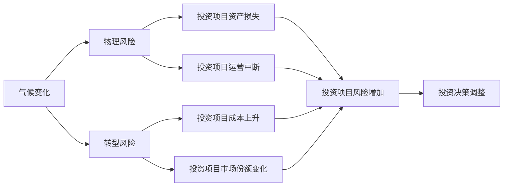

# 气候变化对投资决策的长期影响

> 关键词：气候变化、投资决策、长期影响、风险评估、可持续投资

> 摘要：本文旨在深入探讨气候变化对投资决策的长期影响。随着全球气候变化问题日益严峻，其对各个经济领域的影响愈发显著，投资领域也不例外。文章首先介绍了相关背景，包括目的范围、预期读者等内容；接着阐述了气候变化与投资决策的核心概念及联系；分析了相关核心算法原理与具体操作步骤；探讨了其中涉及的数学模型和公式；通过项目实战案例详细解释了气候变化对投资决策影响的实际情况；介绍了其实际应用场景；推荐了相关的工具和资源；最后总结了未来发展趋势与挑战，并对常见问题进行解答，同时给出扩展阅读和参考资料，帮助读者全面了解气候变化对投资决策长期影响这一重要议题。

## 1. 背景介绍 
### 1.1 目的和范围
本研究的目的在于全面且深入地分析气候变化对投资决策在长期维度上的影响。随着全球气候变暖、极端气候事件频发等气候变化现象的加剧，其对经济活动的影响范围不断扩大，投资领域作为经济活动的重要组成部分，不可避免地受到影响。研究范围涵盖了不同行业、不同类型的投资项目，包括股票、债券、房地产、基础设施等，旨在从多个角度揭示气候变化与投资决策之间的关系，为投资者、企业和政策制定者提供全面的参考依据。

### 1.2 预期读者
本文的预期读者包括各类投资者，如个人投资者、机构投资者（如基金公司、保险公司、养老基金等）；企业管理人员，特别是涉及战略规划、风险管理和投资决策的人员；政策制定者，包括政府部门的相关工作人员和监管机构人员；以及对气候变化和投资领域感兴趣的研究人员和学者。

### 1.3 文档结构概述
本文共分为十个部分。第一部分为背景介绍，阐述研究的目的、范围、预期读者和文档结构，同时对相关术语进行解释。第二部分介绍气候变化与投资决策的核心概念及其联系，并通过文本示意图和 Mermaid 流程图进行说明。第三部分讲解核心算法原理及具体操作步骤，使用 Python 源代码详细阐述。第四部分探讨相关的数学模型和公式，并进行详细讲解和举例说明。第五部分通过项目实战，介绍开发环境搭建、源代码实现及代码解读。第六部分介绍气候变化对投资决策长期影响的实际应用场景。第七部分推荐相关的工具和资源，包括学习资源、开发工具框架和相关论文著作。第八部分总结未来发展趋势与挑战。第九部分为附录，解答常见问题。第十部分提供扩展阅读和参考资料。

### 1.4 术语表
#### 1.4.1 核心术语定义
- **气候变化**：指气候平均状态随时间的变化，通常表现为温度、降水、风速等气候要素的长期变化。这种变化可能是由自然因素引起的，也可能是由人类活动导致的，如温室气体排放。
- **投资决策**：指投资者为了实现一定的投资目标，在对投资项目进行分析、评估和比较的基础上，选择最优投资方案的过程。投资决策涉及到对投资项目的风险、收益、流动性等因素的综合考虑。
- **长期影响**：指在较长的时间跨度内（通常为数年至数十年），气候变化对投资决策产生的持续、累积的影响。这种影响可能是直接的，也可能是间接的，可能会改变投资项目的风险状况、收益预期和市场价值。
- **物理风险**：指由气候变化直接导致的自然现象，如洪水、干旱、飓风、热浪等，对投资项目的资产、运营和供应链造成的损害和损失的风险。
- **转型风险**：指为应对气候变化，政府、企业和社会采取的一系列政策、技术和市场变革措施，可能对投资项目的经营模式、市场需求和竞争力产生的影响和风险。

#### 1.4.2 相关概念解释
- **可持续投资**：指在投资决策过程中，不仅考虑财务回报，还考虑环境、社会和治理（ESG）因素的投资方式。可持续投资旨在通过投资具有良好 ESG 表现的企业和项目，促进经济、社会和环境的可持续发展，同时实现投资的长期价值。
- **碳足迹**：指一个组织、产品、活动或个人在一定时间内直接或间接产生的温室气体排放总量，通常以二氧化碳当量（CO2e）表示。碳足迹是衡量气候变化影响的一个重要指标，投资者可以通过评估投资项目的碳足迹，了解其对气候变化的贡献和潜在风险。
- **气候情景分析**：指通过构建不同的气候情景，模拟未来气候变化的可能趋势和影响，从而评估投资项目在不同情景下的风险和收益状况的分析方法。气候情景分析可以帮助投资者更好地理解气候变化的不确定性，制定相应的投资策略。

#### 1.4.3 缩略词列表
- **ESG**：环境（Environment）、社会（Social）和治理（Governance）的缩写。
- **CO2e**：二氧化碳当量（Carbon Dioxide Equivalent）的缩写。
- **IPCC**：政府间气候变化专门委员会（Intergovernmental Panel on Climate Change）的缩写。

## 2. 核心概念与联系 

### 2.1 气候变化的核心概念
气候变化是一个复杂的自然和社会现象，其主要驱动因素是人类活动导致的温室气体排放增加。温室气体如二氧化碳（CO2）、甲烷（CH4）、氧化亚氮（N2O）等在大气中积聚，形成温室效应，导致全球气温升高，进而引发一系列气候系统的变化，如海平面上升、极端气候事件增多等。

### 2.2 投资决策的核心概念
投资决策是投资者在面临多种投资机会时，根据自身的投资目标、风险承受能力和市场条件等因素，选择最优投资方案的过程。投资决策的核心是对投资项目的风险和收益进行评估和权衡，以实现投资的价值最大化。

### 2.3 气候变化与投资决策的联系
气候变化对投资决策的影响主要通过物理风险和转型风险两个方面体现。物理风险直接影响投资项目的资产价值和运营稳定性，例如洪水可能淹没工厂，导致生产中断和设备损坏；干旱可能影响农业投资项目的产量和质量。转型风险则通过政策、技术和市场变革等因素间接影响投资项目的竞争力和市场前景，例如政府对碳排放的严格限制可能导致高碳行业的企业面临成本上升和市场份额下降的风险，而清洁能源行业则可能迎来发展机遇。

### 2.4 文本示意图
气候变化与投资决策的联系可以用以下文本示意图表示：

气候变化 -> 物理风险（洪水、干旱、飓风等）、转型风险（政策变化、技术进步、市场需求变化等） -> 投资项目的风险和收益变化 -> 投资决策调整

### 2.5 Mermaid 流程图


## 3. 核心算法原理 & 具体操作步骤 

### 3.1 风险评估算法原理
在评估气候变化对投资决策的影响时，一个重要的环节是对投资项目面临的物理风险和转型风险进行评估。这里我们介绍一种基于概率统计的风险评估算法。

假设我们要评估一个投资项目在未来 $n$ 年内面临某种物理风险（如洪水）的损失情况。我们可以通过历史数据和气候模型预测，得到每年发生洪水的概率 $p_i$（$i = 1,2,\cdots,n$），以及每次洪水发生时可能造成的损失 $L_i$。则该投资项目在未来 $n$ 年内因洪水造成的期望损失 $E(L)$ 可以通过以下公式计算：

$E(L)=\sum_{i = 1}^{n}p_iL_i$

### 3.2 Python 源代码实现
```python
# 定义每年发生洪水的概率列表
probabilities = [0.1, 0.15, 0.2, 0.18, 0.22]
# 定义每次洪水发生时可能造成的损失列表
losses = [100000, 120000, 150000, 130000, 160000]

# 初始化期望损失为 0
expected_loss = 0

# 计算期望损失
for i in range(len(probabilities)):
    expected_loss += probabilities[i] * losses[i]

print("该投资项目在未来 5 年内因洪水造成的期望损失为:", expected_loss)
```

### 3.3 具体操作步骤
1. **数据收集**：收集历史气候数据、投资项目的相关信息（如资产价值、地理位置等）以及未来气候情景预测数据。
2. **风险识别**：识别投资项目可能面临的物理风险和转型风险。
3. **概率估计**：根据历史数据和气候模型预测，估计每种风险发生的概率。
4. **损失估计**：评估每种风险发生时可能对投资项目造成的损失。
5. **风险计算**：使用上述算法计算投资项目面临的总风险。
6. **决策调整**：根据风险评估结果，调整投资决策，如选择风险较低的投资项目、采取风险对冲措施等。

## 4. 数学模型和公式 & 详细讲解 & 举例说明 

### 4.1 物理风险评估模型
在物理风险评估中，除了上述的期望损失模型，还可以使用更复杂的风险度量模型，如风险价值（VaR）和条件风险价值（CVaR）。

#### 4.1.1 风险价值（VaR）
风险价值是指在一定的置信水平下，投资项目在未来一段时间内可能遭受的最大损失。假设投资项目的损失 $X$ 是一个随机变量，其概率密度函数为 $f(x)$。则在置信水平 $\alpha$ 下的风险价值 $VaR_{\alpha}$ 可以通过以下公式计算：

$P(X\leq VaR_{\alpha})=\alpha$

#### 4.1.2 条件风险价值（CVaR）
条件风险价值是指在给定损失超过风险价值的条件下，投资项目的平均损失。在置信水平 $\alpha$ 下的条件风险价值 $CVaR_{\alpha}$ 可以通过以下公式计算：

$CVaR_{\alpha}=E(X|X > VaR_{\alpha})$

### 4.2 转型风险评估模型
转型风险评估通常涉及到对政策、技术和市场变化的预测和分析。一种常用的方法是情景分析，通过构建不同的情景，模拟未来可能的政策、技术和市场变化，评估投资项目在不同情景下的风险和收益状况。

假设我们构建了 $m$ 个情景 $S_1,S_2,\cdots,S_m$，每个情景发生的概率为 $q_j$（$j = 1,2,\cdots,m$），投资项目在情景 $S_j$ 下的收益为 $R_j$。则投资项目的期望收益 $E(R)$ 可以通过以下公式计算：

$E(R)=\sum_{j = 1}^{m}q_jR_j$

### 4.3 举例说明
假设一个投资项目面临洪水风险，其损失 $X$ 服从正态分布 $N(100000, 20000^2)$。我们要计算在置信水平为 95% 下的风险价值和条件风险价值。

首先，根据正态分布的性质，我们可以得到：

$VaR_{0.95}=\mu + \sigma\Phi^{-1}(0.95)$

其中，$\mu = 100000$ 是均值，$\sigma = 20000$ 是标准差，$\Phi^{-1}(0.95)$ 是标准正态分布的 95% 分位数，约为 1.645。

$VaR_{0.95}=100000 + 20000\times1.645 = 132900$

接下来，计算条件风险价值：

$CVaR_{0.95}=\mu+\frac{\sigma\varphi(\Phi^{-1}(0.95))}{1 - 0.95}$

其中，$\varphi(x)$ 是标准正态分布的概率密度函数。

$\varphi(\Phi^{-1}(0.95))=\frac{1}{\sqrt{2\pi}}e^{-\frac{(1.645)^2}{2}}\approx0.103$

$CVaR_{0.95}=100000+\frac{20000\times0.103}{0.05}=141200$

## 5. 项目实战：代码实际案例和详细解释说明 

### 5.1  开发环境搭建
在进行项目实战之前，我们需要搭建相应的开发环境。以下是具体步骤：

1. **安装 Python**：从 Python 官方网站（https://www.python.org/downloads/）下载并安装最新版本的 Python。
2. **安装必要的库**：我们需要安装一些用于数据处理、统计分析和可视化的库，如 NumPy、Pandas、Matplotlib 等。可以使用以下命令进行安装：
```sh
pip install numpy pandas matplotlib
```

### 5.2  源代码详细实现和代码解读
以下是一个完整的项目实战代码示例，用于评估气候变化对一个房地产投资项目的物理风险和转型风险，并进行投资决策分析。

```python
import numpy as np
import pandas as pd
import matplotlib.pyplot as plt

# 物理风险评估
# 定义每年发生洪水的概率列表
probabilities_flood = [0.1, 0.15, 0.2, 0.18, 0.22]
# 定义每次洪水发生时可能造成的损失列表
losses_flood = [100000, 120000, 150000, 130000, 160000]

# 计算期望损失
expected_loss_flood = np.sum(np.array(probabilities_flood) * np.array(losses_flood))

# 转型风险评估
# 定义情景列表
scenarios = ['政策宽松', '政策中性', '政策严格']
# 定义每个情景发生的概率
probabilities_scenario = [0.3, 0.4, 0.3]
# 定义投资项目在每个情景下的收益
returns_scenario = [200000, 150000, 100000]

# 计算期望收益
expected_return = np.sum(np.array(probabilities_scenario) * np.array(returns_scenario))

# 投资决策分析
# 假设投资项目的初始成本为 500000
initial_cost = 500000
# 计算净现值
net_present_value = expected_return - expected_loss_flood - initial_cost

# 可视化结果
plt.figure(figsize=(10, 6))
plt.bar(['期望损失（洪水）', '期望收益', '净现值'], [expected_loss_flood, expected_return, net_present_value])
plt.title('气候变化对房地产投资项目的影响评估')
plt.xlabel('指标')
plt.ylabel('金额（元）')
plt.show()

print("该房地产投资项目因洪水造成的期望损失为:", expected_loss_flood)
print("该房地产投资项目的期望收益为:", expected_return)
print("该房地产投资项目的净现值为:", net_present_value)
```

### 5.3  代码解读与分析
1. **物理风险评估**：通过定义每年发生洪水的概率和每次洪水可能造成的损失，使用 `np.sum` 函数计算期望损失。
2. **转型风险评估**：通过定义不同的情景、每个情景发生的概率和投资项目在每个情景下的收益，使用 `np.sum` 函数计算期望收益。
3. **投资决策分析**：假设投资项目的初始成本，计算净现值。净现值是评估投资项目是否可行的一个重要指标，如果净现值大于 0，则说明该投资项目在考虑气候变化风险的情况下具有投资价值。
4. **可视化结果**：使用 `matplotlib` 库绘制柱状图，直观地展示期望损失、期望收益和净现值。

## 6. 实际应用场景 

### 6.1 金融投资领域
在金融投资领域，投资者越来越关注气候变化对投资组合的影响。例如，一些机构投资者开始将气候变化风险纳入投资决策流程，通过筛选具有良好 ESG 表现的企业和项目，降低投资组合的风险。同时，一些金融机构也开始开发与气候变化相关的金融产品，如绿色债券、碳期货等，为投资者提供更多的投资选择。

### 6.2 企业战略规划
企业在制定战略规划时，需要考虑气候变化对自身业务的影响。例如，一些高碳行业的企业需要制定减排战略，以应对政府的碳排放政策和市场的绿色需求；一些位于气候脆弱地区的企业需要加强风险管理，提高应对极端气候事件的能力。

### 6.3 基础设施投资
在基础设施投资领域，气候变化对项目的长期运营和安全性产生重要影响。例如，桥梁、道路等交通基础设施可能受到洪水、飓风等极端气候事件的破坏；能源基础设施可能受到高温、干旱等气候条件的影响。因此，在基础设施投资决策中，需要充分考虑气候变化因素，提高项目的抗灾能力和适应性。

### 6.4 农业投资
农业是对气候变化最为敏感的行业之一。气候变化可能导致农作物产量下降、病虫害增多、水资源短缺等问题，从而影响农业投资项目的收益。因此，农业投资者需要关注气候变化对农业生产的影响，选择具有适应性的农业技术和品种，降低投资风险。

## 7. 工具和资源推荐
### 7.1 学习资源推荐
#### 7.1.1 书籍推荐
- 《气候变化经济学》：本书系统地介绍了气候变化经济学的基本理论和方法，包括气候变化的经济影响、政策评估、碳市场等内容，是学习气候变化经济学的经典教材。
- 《可持续投资：环境、社会和治理因素与投资决策》：本书详细介绍了可持续投资的概念、方法和实践，包括 ESG 评估、绿色金融、社会责任投资等内容，对投资者和企业管理人员具有重要的参考价值。
- 《气候风险管理与投资决策》：本书重点介绍了气候变化对投资决策的影响以及如何进行气候风险管理，包括物理风险评估、转型风险评估、情景分析等内容，为投资者提供了实用的工具和方法。

#### 7.1.2 在线课程
- Coursera 上的“气候变化经济学”课程：由知名大学的教授授课，系统地介绍了气候变化经济学的基本理论和方法，通过案例分析和实际操作，帮助学员掌握相关知识和技能。
- edX 上的“可持续投资与金融”课程：该课程聚焦于可持续投资领域，介绍了 ESG 投资的原则、策略和实践，以及如何将可持续发展目标融入投资决策中。
- Udemy 上的“气候风险管理与投资分析”课程：课程内容包括气候变化对投资的影响、风险评估方法和投资决策模型等，通过实际案例和项目实践，提升学员的气候风险管理和投资分析能力。

#### 7.1.3 技术博客和网站
- 碳信息披露项目（CDP）网站：提供全球企业的碳排放数据和气候变化相关信息，为投资者和企业提供数据支持和决策参考。
- 气候债券倡议组织（CBI）网站：专注于绿色债券市场的发展和推广，提供绿色债券的标准、发行案例和市场动态等信息。
- 彭博新能源财经（BNEF）网站：提供新能源、气候变化和可持续发展领域的研究报告、数据和分析，是了解行业动态和趋势的重要资源。

### 7.2 开发工具框架推荐
#### 7.2.1 IDE和编辑器
- PyCharm：一款专业的 Python 集成开发环境，具有代码编辑、调试、版本控制等功能，适合开发复杂的 Python 项目。
- Jupyter Notebook：一个交互式的开发环境，支持 Python、R 等多种编程语言，适合进行数据分析、模型验证和可视化展示。
- Visual Studio Code：一款轻量级的代码编辑器，支持多种编程语言和插件扩展，具有丰富的开发工具和功能，适合快速开发和调试代码。

#### 7.2.2 调试和性能分析工具
- Py-Spy：一个用于分析 Python 程序性能的工具，可以实时监测程序的 CPU 使用率、函数调用时间等信息，帮助开发者找出性能瓶颈。
- cProfile：Python 内置的性能分析模块，可以统计程序中各个函数的调用次数、执行时间等信息，为优化代码提供依据。
- PDB：Python 内置的调试器，可以在程序运行过程中设置断点、查看变量值、单步执行等，帮助开发者排查代码中的错误。

#### 7.2.3 相关框架和库
- NumPy：一个用于科学计算的 Python 库，提供了高效的数组操作和数学函数，是进行数据分析和数值计算的基础库。
- Pandas：一个用于数据处理和分析的 Python 库，提供了数据结构和数据操作工具，如 DataFrame、Series 等，方便进行数据清洗、转换和分析。
- Scikit-learn：一个用于机器学习的 Python 库，提供了各种机器学习算法和工具，如分类、回归、聚类等，适合进行风险评估和预测模型的开发。

### 7.3 相关论文著作推荐
#### 7.3.1 经典论文
- Nordhaus, W. D. (2018). “The Climate Casino: Risk, Uncertainty, and Economics for a Warming World”. This paper provides a comprehensive analysis of the economic impacts of climate change and the policy options for addressing it.
- Stern, N. (2007). “The Economics of Climate Change: The Stern Review”. This report assesses the economics of climate change and proposes a framework for action to reduce greenhouse gas emissions and mitigate its impacts.

#### 7.3.2 最新研究成果
- IPCC Sixth Assessment Report: The latest report of the Intergovernmental Panel on Climate Change provides the most up-to-date scientific knowledge on climate change, including its causes, impacts, and mitigation strategies.
- Recent research papers on climate finance and sustainable investment in top academic journals such as “The Review of Financial Studies” and “Journal of Financial Economics”.

#### 7.3.3 应用案例分析
- Case studies of companies and investors that have successfully integrated climate change considerations into their decision-making processes, such as Unilever's sustainable business strategy and BlackRock's climate risk assessment framework.
- Analysis of the impact of climate change on specific industries, such as the energy, transportation, and agriculture sectors, and the corresponding investment opportunities and challenges.

## 8. 总结：未来发展趋势与挑战
### 8.1 未来发展趋势
- **可持续投资将成为主流**：随着投资者对气候变化风险的认识不断提高，以及政府对可持续发展的推动，可持续投资将成为未来投资领域的主流趋势。越来越多的投资者将把 ESG 因素纳入投资决策，关注企业的环境绩效和社会责任。
- **气候风险管理将更加精细化**：随着气候模型和数据分析技术的不断发展，投资者将能够更加准确地评估气候变化对投资项目的风险和影响。气候风险管理将从定性分析向定量分析转变，更加注重风险的度量和管理。
- **金融创新将不断涌现**：为了满足投资者对气候变化相关金融产品的需求，金融机构将不断推出新的金融产品和服务，如绿色债券、碳期货、气候保险等。这些金融创新将为投资者提供更多的投资选择，同时也有助于推动气候变化的应对和可持续发展。

### 8.2 挑战
- **数据质量和可用性问题**：目前，气候变化相关的数据质量和可用性还存在一定的问题，如数据不完整、不准确、不一致等。这给投资者进行风险评估和决策分析带来了困难。
- **模型不确定性**：气候模型和风险评估模型存在一定的不确定性，其预测结果可能与实际情况存在偏差。这需要投资者在使用模型进行决策时，充分考虑模型的局限性和不确定性。
- **政策不确定性**：政府的气候变化政策和法规可能会发生变化，这给投资者带来了政策不确定性。投资者需要密切关注政策动态，及时调整投资策略。

## 9. 附录：常见问题与解答
### 9.1 气候变化对投资决策的影响是短期还是长期的？
气候变化对投资决策的影响既有短期的，也有长期的。短期影响主要表现为极端气候事件对投资项目的直接破坏和损失，如洪水、飓风等。长期影响则主要表现为气候变化导致的市场结构调整、政策变化和技术进步等，对投资项目的竞争力和市场前景产生影响。

### 9.2 如何评估气候变化对投资项目的风险？
评估气候变化对投资项目的风险可以从物理风险和转型风险两个方面入手。物理风险可以通过历史数据和气候模型预测，评估投资项目面临的极端气候事件的概率和可能造成的损失。转型风险可以通过情景分析，评估政府政策、技术进步和市场需求变化对投资项目的影响。

### 9.3 可持续投资与传统投资有什么区别？
可持续投资与传统投资的主要区别在于，可持续投资不仅考虑投资项目的财务回报，还考虑其环境、社会和治理（ESG）因素。可持续投资旨在通过投资具有良好 ESG 表现的企业和项目，促进经济、社会和环境的可持续发展，同时实现投资的长期价值。

### 9.4 投资者如何应对气候变化对投资决策的影响？
投资者可以通过以下方式应对气候变化对投资决策的影响：
- 加强风险评估：将气候变化风险纳入投资决策流程，充分评估投资项目面临的物理风险和转型风险。
- 优化投资组合：通过投资具有良好 ESG 表现的企业和项目，降低投资组合的风险。
- 关注政策动态：密切关注政府的气候变化政策和法规，及时调整投资策略。
- 参与可持续发展：通过投资和参与可持续发展项目，为应对气候变化做出贡献，同时获得投资回报。

## 10. 扩展阅读 & 参考资料
### 10.1 扩展阅读
- 《低碳经济：绿色发展与转型》：本书介绍了低碳经济的概念、发展模式和实践案例，对理解气候变化与经济发展的关系具有重要的参考价值。
- 《绿色金融：理论与实践》：本书系统地介绍了绿色金融的理论和实践，包括绿色信贷、绿色债券、碳金融等内容，为投资者和金融机构提供了绿色金融领域的全面知识。
- 《气候适应型城市建设》：本书探讨了城市如何应对气候变化的挑战，提高城市的气候适应能力，对城市基础设施投资和规划具有重要的指导意义。

### 10.2 参考资料
- IPCC. (2021). Climate Change 2021: The Physical Science Basis. Contribution of Working Group I to the Sixth Assessment Report of the Intergovernmental Panel on Climate Change.
- World Bank. (2020). Climate Change and Development.
- UNEP Finance Initiative. (2021). The Principles for Responsible Investment.
- CDP. (2021). Global Climate Change Report.
- CBI. (2021). State of the Climate Bonds Market.