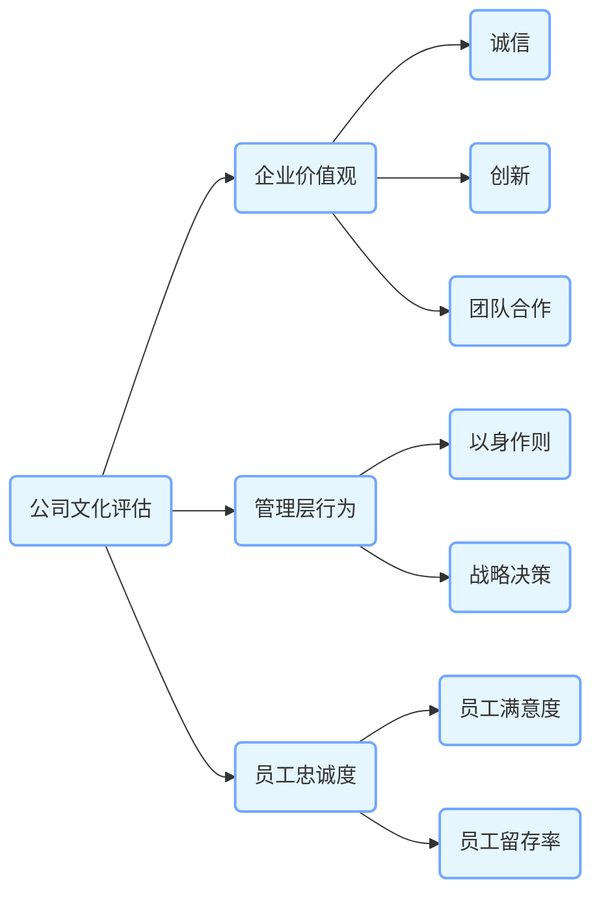

# 沃伦·巴菲特的公司文化评估方法

> 关键词：沃伦·巴菲特、公司文化评估、投资决策、企业价值观、文化指标

> 摘要：本文深入探讨沃伦·巴菲特的公司文化评估方法。从背景介绍入手，阐述其目的、预期读者等内容。详细剖析公司文化评估的核心概念与联系，给出原理和架构示意图。介绍核心算法原理和具体操作步骤，结合 Python 代码进行说明。讲解相关数学模型和公式，并举例分析。通过项目实战，给出代码案例和详细解读。探讨该评估方法的实际应用场景，推荐相关学习资源、开发工具框架以及论文著作。最后总结未来发展趋势与挑战，解答常见问题，并提供扩展阅读和参考资料，旨在为投资者和企业管理者提供全面且深入的关于巴菲特公司文化评估方法的知识体系。

## 1. 背景介绍 
### 1.1 目的和范围
沃伦·巴菲特作为全球著名的投资大师，其投资理念和方法备受关注。公司文化评估在他的投资决策中占据着重要地位。本文的目的在于深入研究巴菲特的公司文化评估方法，剖析其背后的原理、流程和实际应用。范围涵盖了公司文化评估的核心概念、算法原理、数学模型，以及通过实际案例展示如何运用这些方法进行公司文化评估，同时探讨其在投资和企业管理中的应用场景。

### 1.2 预期读者
本文预期读者包括投资者，尤其是希望借鉴巴菲特投资理念，通过评估公司文化来做出更明智投资决策的个人和机构投资者；企业管理者，他们可以从巴菲特的评估方法中获取灵感，审视和塑造自身企业的文化；以及对公司文化和投资理论感兴趣的学者和研究人员。

### 1.3 文档结构概述
本文首先介绍背景信息，让读者了解研究的目的和范围。接着阐述公司文化评估的核心概念与联系，构建理论基础。然后详细讲解核心算法原理和具体操作步骤，结合 Python 代码进行说明。随后介绍相关的数学模型和公式，并举例分析。通过项目实战部分，给出实际代码案例并进行详细解读。探讨该评估方法在实际中的应用场景。推荐相关的学习资源、开发工具框架以及论文著作。最后总结未来发展趋势与挑战，解答常见问题，并提供扩展阅读和参考资料。

### 1.4 术语表
#### 1.4.1 核心术语定义
- **公司文化**：指企业在长期的生产经营过程中形成的价值观、行为准则、经营理念等精神层面的总和，它影响着企业员工的行为和决策方式。
- **文化评估**：对公司文化的各个方面进行系统的分析和评价，以了解公司文化的优势和不足。
- **投资决策**：投资者根据对各种投资对象的评估，决定是否进行投资以及投资的金额和比例。

#### 1.4.2 相关概念解释
- **企业文化价值观**：是企业核心文化的体现，如诚信、创新、团队合作等，它引导着企业的战略方向和员工的行为。
- **文化契合度**：指公司文化与投资者投资理念、企业战略目标等之间的匹配程度。

#### 1.4.3 缩略词列表
- **ROE**：Return on Equity，净资产收益率，是衡量企业盈利能力的重要指标。
- **EPS**：Earnings Per Share，每股收益，反映了普通股的获利水平。

## 2. 核心概念与联系 
### 核心概念原理
沃伦·巴菲特认为，公司文化是企业长期成功的关键因素之一。一个具有良好文化的公司，其员工更有凝聚力和创造力，能够更好地应对市场变化和竞争挑战。公司文化的评估主要围绕企业的价值观、管理层的行为方式、员工的忠诚度等方面展开。

企业价值观是公司文化的核心，它决定了企业的经营方向和决策原则。例如，一家以诚信为核心价值观的公司，在经营过程中会更注重产品质量和客户满意度，从而赢得客户的信任和市场份额。管理层的行为方式对公司文化的形成和传承起着关键作用。如果管理层能够以身作则，践行企业的价值观，那么员工也会受到感染，积极遵循公司的文化准则。员工的忠诚度则是公司文化是否良好的重要体现。一个员工忠诚度高的公司，说明其文化能够满足员工的需求，让员工有归属感和成就感。

### 架构示意图


这个示意图展示了公司文化评估的主要方面，包括企业价值观、管理层行为和员工忠诚度。企业价值观又细分为诚信、创新、团队合作等具体维度；管理层行为包括以身作则和战略决策；员工忠诚度通过员工满意度和员工留存率来体现。这些方面相互关联，共同构成了公司文化评估的整体架构。

## 3. 核心算法原理 & 具体操作步骤 
### 核心算法原理
巴菲特的公司文化评估并没有一个固定的、精确的算法，但可以通过一些指标和方法进行综合评估。我们可以构建一个简单的评估模型，通过对企业价值观、管理层行为和员工忠诚度等方面进行量化评分，然后根据各方面的权重计算出公司文化的综合得分。

### 具体操作步骤
1. **确定评估指标**：
    - 企业价值观：包括诚信、创新、团队合作等，每个价值观可以根据其重要性设定不同的权重。
    - 管理层行为：如管理层的诚信记录、战略决策的合理性等。
    - 员工忠诚度：通过员工满意度调查、员工留存率等数据来衡量。
2. **收集数据**：
    - 对于企业价值观，可以通过查阅公司的官方文件、新闻报道等了解公司对价值观的阐述和实践情况。
    - 管理层行为可以通过分析公司的财务报表、重大决策案例等进行评估。
    - 员工忠诚度数据可以通过内部调查、人力资源部门的数据统计等方式获取。
3. **量化评分**：
    - 对每个评估指标设定评分标准，例如 1 - 5 分，1 分表示最差，5 分表示最好。
    - 根据收集到的数据对每个指标进行评分。
4. **计算综合得分**：
    - 为每个评估方面设定权重，例如企业价值观权重为 0.4，管理层行为权重为 0.3，员工忠诚度权重为 0.3。
    - 综合得分 = 企业价值观得分 × 0.4 + 管理层行为得分 × 0.3 + 员工忠诚度得分 × 0.3

### Python 代码实现
```python
# 定义评估指标得分
values_score = 4  # 企业价值观得分
management_score = 3  # 管理层行为得分
employee_score = 4  # 员工忠诚度得分

# 定义各方面权重
values_weight = 0.4
management_weight = 0.3
employee_weight = 0.3

# 计算综合得分
overall_score = values_score * values_weight + management_score * management_weight + employee_score * employee_weight

print(f"公司文化综合得分: {overall_score}")
```

在这个代码中，我们首先定义了企业价值观、管理层行为和员工忠诚度的得分，然后设定了各方面的权重，最后根据公式计算出公司文化的综合得分并打印输出。

## 4. 数学模型和公式 & 详细讲解 & 举例说明 
### 数学模型和公式
设企业价值观得分为 $V$，管理层行为得分为 $M$，员工忠诚度得分为 $E$，企业价值观权重为 $w_V$，管理层行为权重为 $w_M$，员工忠诚度权重为 $w_E$，公司文化综合得分为 $S$。则数学公式为：

$$S = V \times w_V + M \times w_M + E \times w_E$$

其中，$w_V + w_M + w_E = 1$。

### 详细讲解
这个公式的核心思想是通过对公司文化的不同方面进行量化评分，并根据各方面的重要性赋予不同的权重，最终得到一个综合得分来评估公司文化的优劣。企业价值观是公司文化的基础，它决定了企业的发展方向和行为准则，因此赋予较高的权重。管理层行为对公司文化的形成和执行起着关键作用，也具有重要的影响。员工忠诚度则反映了公司文化对员工的吸引力和凝聚力，同样不可忽视。

### 举例说明
假设一家公司的企业价值观得分 $V = 4$，管理层行为得分 $M = 3$，员工忠诚度得分 $E = 4$，企业价值观权重 $w_V = 0.4$，管理层行为权重 $w_M = 0.3$，员工忠诚度权重 $w_E = 0.3$。

根据公式计算综合得分：

$$S = 4 \times 0.4 + 3 \times 0.3 + 4 \times 0.3$$
$$S = 1.6 + 0.9 + 1.2$$
$$S = 3.7$$

这个综合得分表明该公司的文化整体处于较好的水平，但在管理层行为方面还有一定的提升空间。投资者可以根据这个得分，结合其他因素，如财务状况、市场前景等，来决定是否对该公司进行投资。

## 5. 项目实战：代码实际案例和详细解释说明 
### 5.1  开发环境搭建
为了实现公司文化评估的代码，我们可以使用 Python 编程语言。以下是搭建开发环境的步骤：
1. **安装 Python**：从 Python 官方网站（https://www.python.org/downloads/）下载并安装适合你操作系统的 Python 版本。建议安装 Python 3.7 及以上版本。
2. **安装代码编辑器**：可以选择使用 Visual Studio Code、PyCharm 等代码编辑器。这些编辑器提供了丰富的功能，如代码高亮、自动补全、调试等，方便我们进行代码开发。
3. **创建虚拟环境（可选）**：使用虚拟环境可以隔离项目的依赖，避免不同项目之间的冲突。可以使用 `venv` 模块创建虚拟环境：
```bash
python -m venv myenv
```
激活虚拟环境：
- 在 Windows 上：
```bash
myenv\Scripts\activate
```
- 在 Linux 或 macOS 上：
```bash
source myenv/bin/activate
```

### 5.2  源代码详细实现和代码解读
```python
# 定义评估指标得分
def get_values_score():
    """获取企业价值观得分"""
    # 这里可以根据实际情况从文件、数据库等获取数据
    return 4

def get_management_score():
    """获取管理层行为得分"""
    return 3

def get_employee_score():
    """获取员工忠诚度得分"""
    return 4

# 定义各方面权重
values_weight = 0.4
management_weight = 0.3
employee_weight = 0.3

# 计算综合得分
def calculate_overall_score():
    values_score = get_values_score()
    management_score = get_management_score()
    employee_score = get_employee_score()
    overall_score = values_score * values_weight + management_score * management_weight + employee_score * employee_weight
    return overall_score

# 主函数
if __name__ == "__main__":
    score = calculate_overall_score()
    print(f"公司文化综合得分: {score}")
```

### 代码解读与分析
- **函数定义**：
    - `get_values_score()`、`get_management_score()` 和 `get_employee_score()` 函数分别用于获取企业价值观、管理层行为和员工忠诚度的得分。在实际应用中，可以从文件、数据库等数据源中获取这些数据。
    - `calculate_overall_score()` 函数根据前面定义的公式计算公司文化的综合得分。
- **主函数**：
    - 在 `if __name__ == "__main__":` 块中，调用 `calculate_overall_score()` 函数计算综合得分，并将结果打印输出。

通过这种模块化的设计，代码的可维护性和扩展性得到了提高。如果需要修改评估指标或权重，只需要修改相应的函数或变量即可。

## 6. 实际应用场景 
### 投资决策
对于投资者来说，公司文化评估是投资决策的重要参考因素之一。一个具有良好文化的公司，通常具有更强的竞争力和更稳定的业绩表现。巴菲特在选择投资对象时，会深入了解公司的文化，评估其是否与自己的投资理念相契合。例如，他更倾向于投资那些具有诚信、稳健经营文化的公司，因为这些公司在长期发展中更有可能为股东创造价值。

### 企业管理
企业管理者可以运用巴菲特的公司文化评估方法来审视和塑造自身企业的文化。通过评估企业价值观、管理层行为和员工忠诚度等方面，发现公司文化中存在的问题和不足，并采取相应的措施进行改进。例如，如果发现员工忠诚度较低，可以通过改善工作环境、提供更多的培训和发展机会等方式来提高员工的满意度和归属感。

### 并购重组
在企业进行并购重组时，公司文化的评估也非常重要。如果两家公司的文化差异过大，可能会导致整合困难，影响企业的协同效应和发展前景。因此，在并购前对目标公司的文化进行评估，了解其与自身文化的契合度，有助于制定合理的整合策略，提高并购的成功率。

## 7. 工具和资源推荐
### 7.1 学习资源推荐
#### 7.1.1 书籍推荐
- 《巴菲特致股东的信：投资者和公司高管教程》：这本书收录了巴菲特多年来致股东的信，其中包含了他的投资理念、公司文化评估等方面的重要思想。
- 《聪明的投资者》：本杰明·格雷厄姆的经典著作，对价值投资理念进行了深入阐述，巴菲特是格雷厄姆的学生，这本书对理解巴菲特的投资方法有很大的帮助。
- 《企业文化与经营业绩》：该书研究了企业文化与企业经营业绩之间的关系，提供了关于公司文化评估和管理的理论和实践案例。

#### 7.1.2 在线课程
- Coursera 上的“投资学原理”课程：由知名大学教授授课，涵盖了投资决策的基本原理和方法，包括公司文化评估在投资中的应用。
- edX 上的“企业战略与文化”课程：介绍了企业战略和文化的相互关系，以及如何通过文化评估来制定和实施企业战略。

#### 7.1.3 技术博客和网站
- 雪球网：是一个投资社区，有很多投资者分享关于公司文化评估和投资决策的经验和见解。
- 价值线网站：提供了大量的公司分析报告，其中包含了对公司文化的评估内容。

### 7.2 开发工具框架推荐
#### 7.2.1 IDE和编辑器
- Visual Studio Code：一款轻量级的代码编辑器，支持多种编程语言，具有丰富的插件扩展功能，适合 Python 代码开发。
- PyCharm：专门为 Python 开发设计的集成开发环境，提供了强大的代码调试、代码分析等功能，提高开发效率。

#### 7.2.2 调试和性能分析工具
- `pdb`：Python 自带的调试工具，可以帮助我们定位代码中的问题。
- `cProfile`：用于分析 Python 代码的性能，找出代码中的瓶颈。

#### 7.2.3 相关框架和库
- `pandas`：用于数据处理和分析，可以方便地读取、处理和存储评估所需的数据。
- `matplotlib`：用于数据可视化，将评估结果以图表的形式展示出来，更直观地分析公司文化的情况。

### 7.3 相关论文著作推荐
#### 7.3.1 经典论文
- “Corporate Culture and Economic Performance”：该论文研究了公司文化对经济绩效的影响，为公司文化评估提供了理论基础。
- “The Role of Culture in Organizational Change”：探讨了文化在组织变革中的作用，对企业管理者如何通过文化评估来推动组织变革有重要的启示。

#### 7.3.2 最新研究成果
- 近年来，一些学者开始运用大数据和人工智能技术进行公司文化评估，相关的研究成果可以在学术数据库如 IEEE Xplore、ACM Digital Library 等上查找。

#### 7.3.3 应用案例分析
- 一些商业杂志和研究机构会发布关于公司文化评估的应用案例分析，如《哈佛商业评论》《麦肯锡季刊》等，这些案例可以帮助我们更好地理解如何在实际中运用公司文化评估方法。

## 8. 总结：未来发展趋势与挑战
### 未来发展趋势
- **数字化评估**：随着大数据、人工智能等技术的发展，公司文化评估将越来越多地采用数字化手段。通过收集和分析大量的企业数据，如员工社交媒体数据、企业内部沟通数据等，可以更全面、客观地评估公司文化。
- **跨文化评估**：在全球化的背景下，企业的跨国经营越来越普遍。未来的公司文化评估将更加注重跨文化因素，评估不同文化背景下企业的文化融合和适应性。
- **与战略的深度融合**：公司文化评估将与企业战略更加紧密地结合。通过评估公司文化，为企业战略的制定和调整提供更有力的支持，确保企业战略与文化的一致性。

### 挑战
- **数据获取和质量**：数字化评估需要大量的数据支持，但数据的获取可能面临隐私保护、数据安全等问题。同时，数据的质量也会影响评估结果的准确性。
- **文化的复杂性**：公司文化是一个复杂的概念，难以用精确的指标和模型进行全面评估。不同的文化维度之间相互影响，增加了评估的难度。
- **评估结果的应用**：如何将公司文化评估结果有效地应用到投资决策、企业管理等实际场景中，是一个需要解决的问题。评估结果需要与其他因素进行综合考虑，才能做出合理的决策。

## 9. 附录：常见问题与解答
### 问题 1：公司文化评估的结果准确吗？
解答：公司文化评估的结果具有一定的主观性和局限性。虽然我们可以通过量化指标和数学模型进行评估，但公司文化本身是一个复杂的概念，难以完全用数据来衡量。评估结果可以作为参考，但不能作为唯一的决策依据，需要结合其他因素进行综合分析。

### 问题 2：如何确定评估指标的权重？
解答：评估指标的权重可以根据不同的评估目的和企业特点来确定。一般来说，企业价值观是公司文化的核心，权重可以相对较高。管理层行为和员工忠诚度也很重要，可以根据实际情况分配适当的权重。在确定权重时，可以参考相关的研究成果和行业经验，也可以通过专家咨询等方式来确定。

### 问题 3：公司文化评估需要多长时间？
解答：公司文化评估的时间取决于评估的范围和深度。如果只是进行简单的初步评估，可能需要几天到几周的时间。如果需要进行全面、深入的评估，包括大量的数据收集和分析，可能需要几个月甚至更长的时间。

## 10. 扩展阅读 & 参考资料
### 扩展阅读
- 《从优秀到卓越》：探讨了企业如何从优秀走向卓越，其中涉及到公司文化在企业发展中的重要作用。
- 《基业长青》：研究了一些具有长期竞争优势的企业，分析了它们的公司文化和经营理念。

### 参考资料
- 巴菲特历年致股东的信，可从伯克希尔·哈撒韦公司官方网站获取。
- 相关学术论文和研究报告，可通过学术数据库如知网、万方、Web of Science 等查找。
- 商业杂志和新闻报道，如《财富》《福布斯》等，提供了很多关于企业和公司文化的案例和分析。