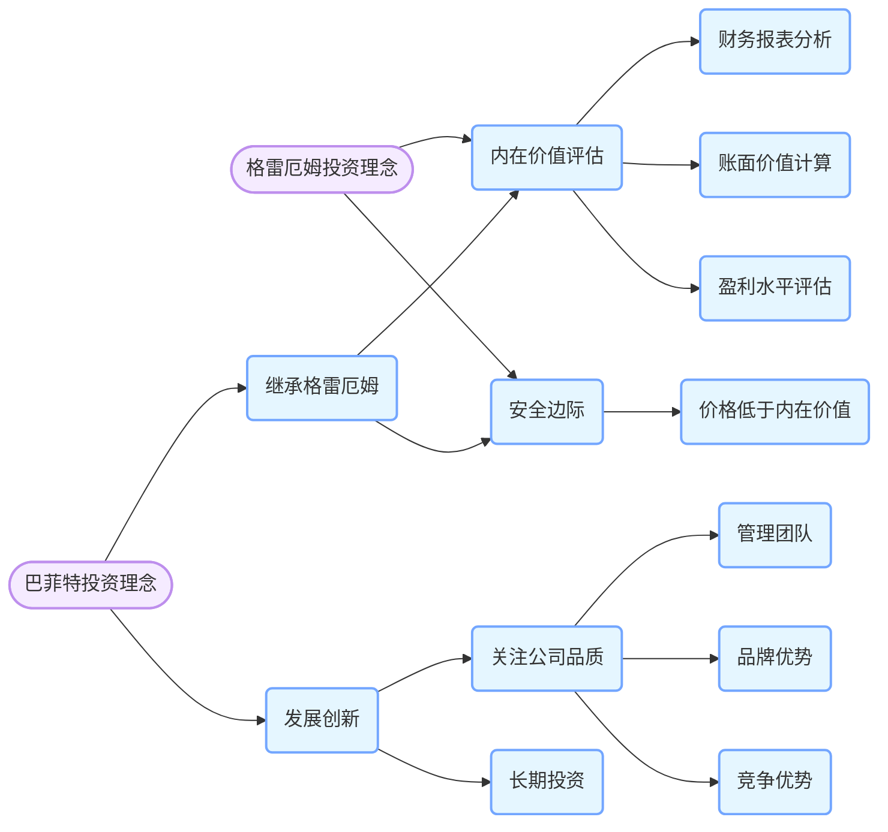

# 沃伦·巴菲特：从格雷厄姆到自己的投资之路

> 关键词：沃伦·巴菲特、格雷厄姆、投资之路、价值投资、投资理念、投资策略、投资进化

> 摘要：本文深入探讨了沃伦·巴菲特从师从本杰明·格雷厄姆到形成自己独特投资风格的全过程。详细介绍了巴菲特投资理念的起源、发展和转变，分析了格雷厄姆投资思想对巴菲特的深刻影响，以及巴菲特如何在实践中不断创新和完善投资策略。通过对核心概念、算法原理、数学模型、实际案例等多方面的阐述，揭示了巴菲特投资成功的秘诀，同时探讨了其投资理念在不同应用场景中的实践，最后对投资领域的未来发展趋势与挑战进行了总结，并提供了相关的学习资源、开发工具和论文著作推荐。

## 1. 背景介绍 
### 1.1 目的和范围
本文的目的是全面剖析沃伦·巴菲特的投资之路，特别是他从学习格雷厄姆的投资理念到形成自己独特投资风格的演变过程。范围涵盖了巴菲特投资生涯的各个阶段，包括他早期受格雷厄姆影响的价值投资实践，以及后期结合自身经验和市场变化所做出的投资理念创新。通过对其投资思想和策略的深入研究，为投资者提供有价值的参考和启示。

### 1.2 预期读者
本文预期读者包括对投资领域感兴趣的初学者、有一定投资经验的专业人士以及对金融市场和投资哲学有研究需求的学者。无论你是想了解巴菲特投资成功的奥秘，还是希望借鉴其投资方法提升自己的投资能力，本文都将为你提供丰富的知识和深入的分析。

### 1.3 文档结构概述
本文将按照以下结构展开：首先介绍核心概念，阐述格雷厄姆和巴菲特投资理念的核心要点及其联系；接着讲解核心算法原理和具体操作步骤，用Python代码模拟巴菲特的投资决策过程；然后通过数学模型和公式对投资策略进行量化分析，并举例说明；再通过实际案例展示巴菲特投资理念在项目实战中的应用；之后探讨巴菲特投资理念的实际应用场景；推荐相关的学习工具和资源；最后总结投资领域的未来发展趋势与挑战，并解答常见问题，提供扩展阅读和参考资料。

### 1.4 术语表
#### 1.4.1 核心术语定义
- **价值投资**：一种基于对公司内在价值评估的投资策略，投资者通过分析公司的财务状况、行业前景等因素，寻找被市场低估的股票进行投资。
- **安全边际**：格雷厄姆提出的概念，指股票的市场价格低于其内在价值的幅度，为投资提供了一定的容错空间。
- **护城河**：巴菲特提出的概念，指公司拥有的能够抵御竞争对手的优势，如品牌优势、技术优势、成本优势等。
- **内在价值**：公司未来现金流的现值，是价值投资中评估股票是否值得投资的重要指标。

#### 1.4.2 相关概念解释
- **格雷厄姆投资思想**：强调以低于内在价值的价格购买股票，注重公司的财务报表分析和资产价值评估，追求投资的安全性。
- **巴菲特投资思想**：在格雷厄姆的基础上，更加注重公司的长期竞争力和发展前景，关注公司的“护城河”，愿意为具有优秀管理团队和长期增长潜力的公司支付合理的价格。

#### 1.4.3 缩略词列表
- **DCF**：Discounted Cash Flow，现金流折现法，用于计算公司内在价值的一种方法。

## 2. 核心概念与联系 
### 2.1 格雷厄姆的投资理念核心
格雷厄姆被尊称为“价值投资之父”，他的投资理念主要基于对公司内在价值的评估和安全边际的考量。其核心要点如下：
- **内在价值评估**：格雷厄姆认为，股票的价值取决于公司的实际资产和盈利能力。他通过对公司财务报表的详细分析，计算公司的账面价值、盈利水平等指标，来估算公司的内在价值。
- **安全边际**：为了降低投资风险，格雷厄姆强调在购买股票时要确保股票的市场价格低于其内在价值，即要有一定的安全边际。这样即使公司的实际表现不如预期，投资者也能在一定程度上避免损失。

### 2.2 巴菲特对格雷厄姆理念的继承与发展
巴菲特在哥伦比亚大学求学时师从格雷厄姆，深受其投资思想的影响。在早期的投资实践中，巴菲特严格遵循格雷厄姆的价值投资原则，寻找被市场低估的股票。然而，随着投资经验的积累和市场环境的变化，巴菲特逐渐对格雷厄姆的理念进行了发展和创新。
- **关注公司品质**：巴菲特不再仅仅关注股票的价格与内在价值的差距，而是更加注重公司的品质和长期发展潜力。他认为，具有优秀管理团队、强大品牌和持续竞争优势的公司，即使市场价格略高于其内在价值，也值得投资。
- **长期投资**：巴菲特倡导长期投资，他认为只要公司的基本面没有发生重大变化，就应该长期持有股票，分享公司成长带来的收益。这种投资理念与格雷厄姆更注重短期交易的策略有所不同。

### 2.3 核心概念的联系与逻辑关系
格雷厄姆的投资理念为巴菲特的投资之路奠定了基础，安全边际和内在价值评估的思想贯穿了巴菲特的整个投资生涯。然而，巴菲特在继承的基础上，结合自己的实践经验和对市场的深刻理解，将投资理念进一步拓展和深化，从单纯的“捡烟蒂”式投资（寻找价格极低的股票）转变为关注具有长期竞争优势的优质公司的投资。这种转变是一个渐进的过程，体现了巴菲特对投资本质的不断探索和认识的不断提高。

### 2.4 核心概念原理和架构的文本示意图
```plaintext
格雷厄姆投资理念
|-- 内在价值评估
|   |-- 财务报表分析
|   |-- 账面价值计算
|   |-- 盈利水平评估
|-- 安全边际
|   |-- 价格低于内在价值

巴菲特投资理念
|-- 继承格雷厄姆
|   |-- 内在价值评估
|   |-- 安全边际
|-- 发展创新
|   |-- 关注公司品质
|   |   |-- 管理团队
|   |   |-- 品牌优势
|   |   |-- 竞争优势
|   |-- 长期投资
```

### 2.5 Mermaid 流程图


## 3. 核心算法原理 & 具体操作步骤 
### 3.1 内在价值评估算法原理
在价值投资中，计算公司的内在价值是关键。一种常用的方法是现金流折现法（DCF）。其原理是将公司未来的现金流按照一定的折现率折现到当前，得到公司的内在价值。

### 3.2 Python 代码实现内在价值评估
```python
def calculate_intrinsic_value(free_cash_flow, growth_rate, discount_rate, years):
    """
    计算公司的内在价值
    :param free_cash_flow: 初始自由现金流
    :param growth_rate: 现金流增长率
    :param discount_rate: 折现率
    :param years: 预测年数
    :return: 内在价值
    """
    intrinsic_value = 0
    for i in range(years):
        future_cash_flow = free_cash_flow * ((1 + growth_rate) ** i)
        discounted_cash_flow = future_cash_flow / ((1 + discount_rate) ** (i + 1))
        intrinsic_value += discounted_cash_flow
    return intrinsic_value

# 示例参数
free_cash_flow = 100  # 初始自由现金流为 100 万元
growth_rate = 0.05  # 现金流增长率为 5%
discount_rate = 0.1  # 折现率为 10%
years = 10  # 预测 10 年

intrinsic_value = calculate_intrinsic_value(free_cash_flow, growth_rate, discount_rate, years)
print(f"公司的内在价值为: {intrinsic_value} 万元")
```

### 3.3 具体操作步骤
1. **确定初始自由现金流**：通过分析公司的财务报表，确定公司当前的自由现金流。自由现金流是指公司在满足了所有运营成本和资本支出后剩余的现金流量。
2. **估计现金流增长率**：根据公司的历史业绩、行业发展趋势和市场前景等因素，估计公司未来的现金流增长率。这需要对公司的业务模式、竞争优势和市场环境有深入的了解。
3. **选择折现率**：折现率反映了投资者对投资回报的要求和对风险的承受能力。一般来说，折现率可以参考市场利率、行业平均回报率等因素来确定。
4. **确定预测年数**：预测年数是指预测公司未来现金流的时间跨度。通常，预测年数可以根据公司的稳定性和可预测性来确定，一般为 5 - 10 年。
5. **计算内在价值**：使用上述公式和参数，计算公司的内在价值。

### 3.4 安全边际的计算与应用
安全边际是指股票的市场价格低于其内在价值的幅度。计算公式为：
$$安全边际 = \frac{内在价值 - 市场价格}{内在价值} \times 100\%$$

在投资决策中，投资者通常会设定一个最低的安全边际要求，只有当股票的安全边际达到或超过该要求时，才会考虑购买该股票。例如，如果投资者设定的最低安全边际为 30%，而某只股票的内在价值为 100 元，市场价格为 70 元，则该股票的安全边际为：
$$安全边际 = \frac{100 - 70}{100} \times 100\% = 30\%$$
满足投资者的要求，可以考虑购买。

## 4. 数学模型和公式 & 详细讲解 & 举例说明 
### 4.1 现金流折现法（DCF）数学模型
现金流折现法的数学模型可以表示为：
$$V = \sum_{t=1}^{n} \frac{FCF_t}{(1 + r)^t}$$
其中：
- $V$ 表示公司的内在价值
- $FCF_t$ 表示第 $t$ 年的自由现金流
- $r$ 表示折现率
- $n$ 表示预测年数

### 4.2 详细讲解
现金流折现法的核心思想是，公司的价值等于其未来产生的所有现金流的现值之和。在计算过程中，需要对未来每年的自由现金流进行预测，并将其按照折现率折现到当前。折现率的选择反映了投资者对投资风险的评估，风险越高，折现率越高。

### 4.3 举例说明
假设一家公司当前的自由现金流为 100 万元，预计未来每年的现金流增长率为 5%，折现率为 10%，预测期为 10 年。则该公司的内在价值计算如下：

第 1 年的自由现金流：$FCF_1 = 100 \times (1 + 0.05) = 105$（万元）
第 2 年的自由现金流：$FCF_2 = 105 \times (1 + 0.05) = 110.25$（万元）
以此类推，计算出未来 10 年的自由现金流。

然后，将每年的自由现金流按照折现率折现到当前：
第 1 年的折现现金流：$\frac{105}{(1 + 0.1)^1} \approx 95.45$（万元）
第 2 年的折现现金流：$\frac{110.25}{(1 + 0.1)^2} \approx 90.91$（万元）
以此类推，计算出未来 10 年的折现现金流。

最后，将每年的折现现金流相加，得到公司的内在价值：
$V = 95.45 + 90.91 + \cdots + \text{（后续各年折现现金流）}$

通过 Python 代码计算，得到该公司的内在价值约为 772.17 万元。

### 4.4 其他相关数学模型和公式
- **市盈率（P/E）**：$P/E = \frac{股票价格}{每股收益}$，用于衡量股票的估值水平。一般来说，市盈率越低，股票越被低估。
- **市净率（P/B）**：$P/B = \frac{股票价格}{每股净资产}$，反映了股票价格与公司净资产的关系。市净率较低的股票可能具有一定的投资价值。

## 5. 项目实战：代码实际案例和详细解释说明 
### 5.1  开发环境搭建
为了实现巴菲特式的投资分析，我们可以使用 Python 编程语言，并结合一些常用的数据分析库，如 Pandas、Numpy 等。以下是搭建开发环境的步骤：
1. **安装 Python**：从 Python 官方网站（https://www.python.org/downloads/）下载并安装 Python 3.x 版本。
2. **安装必要的库**：打开命令行终端，使用以下命令安装 Pandas 和 Numpy：
```sh
pip install pandas numpy
```

### 5.2  源代码详细实现和代码解读
以下是一个简单的 Python 代码示例，用于对股票进行基本的价值分析：
```python
import pandas as pd

# 定义股票数据
stock_data = {
    '股票代码': ['000001', '000002', '000003'],
    '股票名称': ['公司 A', '公司 B', '公司 C'],
    '每股收益': [2.0, 1.5, 1.0],
    '每股净资产': [10.0, 8.0, 6.0],
    '股票价格': [20.0, 15.0, 12.0]
}

# 创建 DataFrame
df = pd.DataFrame(stock_data)

# 计算市盈率和市净率
df['市盈率'] = df['股票价格'] / df['每股收益']
df['市净率'] = df['股票价格'] / df['每股净资产']

# 筛选出市盈率和市净率较低的股票
low_pe_pb_stocks = df[(df['市盈率'] < 10) & (df['市净率'] < 2)]

print("筛选出的低市盈率和市净率股票：")
print(low_pe_pb_stocks)
```

### 5.3  代码解读与分析
1. **数据定义**：首先，我们定义了一个包含股票基本信息的字典 `stock_data`，包括股票代码、股票名称、每股收益、每股净资产和股票价格。
2. **创建 DataFrame**：使用 Pandas 的 `DataFrame` 函数将字典转换为数据框，方便进行数据分析。
3. **计算市盈率和市净率**：通过数据框的列运算，计算出每只股票的市盈率和市净率。
4. **筛选股票**：使用条件筛选，找出市盈率低于 10 且市净率低于 2 的股票。
5. **输出结果**：打印筛选出的股票信息。

通过这个简单的代码示例，我们可以初步筛选出具有一定投资价值的股票。当然，在实际投资中，还需要考虑更多的因素，如公司的财务状况、行业前景、管理团队等。

## 6. 实际应用场景 
### 6.1 股票投资
巴菲特的投资理念在股票投资领域有着广泛的应用。投资者可以通过分析公司的内在价值、财务状况和竞争优势，寻找被市场低估的优质股票进行长期投资。例如，巴菲特长期持有可口可乐、苹果等公司的股票，通过分享公司的成长获得了丰厚的回报。

### 6.2 企业并购
在企业并购中，巴菲特的投资思想也具有重要的指导意义。收购方可以通过评估目标公司的内在价值和发展潜力，判断是否值得进行并购。同时，关注目标公司的“护城河”，确保并购后能够实现协同效应，提升企业的整体竞争力。

### 6.3 基金投资
对于基金投资者来说，了解巴菲特的投资理念可以帮助他们选择优秀的基金经理和基金产品。基金经理如果能够遵循价值投资原则，注重公司的品质和长期发展，往往能够为投资者带来稳定的回报。

### 6.4 个人理财规划
在个人理财规划中，巴菲特的投资理念可以引导投资者树立正确的投资观念，避免盲目跟风和短期投机行为。投资者可以根据自己的风险承受能力和投资目标，选择适合自己的投资标的，并进行长期投资。

## 7. 工具和资源推荐
### 7.1 学习资源推荐
#### 7.1.1 书籍推荐
- 《聪明的投资者》（The Intelligent Investor）：本杰明·格雷厄姆的经典著作，被誉为价值投资的圣经，详细阐述了价值投资的原理和方法。
- 《巴菲特致股东的信：股份公司教程》（Letters to Shareholders of Berkshire Hathaway）：汇集了巴菲特多年来写给股东的信，包含了他的投资思想、管理理念和对市场的看法。
- 《穷查理宝典：查理·芒格的智慧箴言录》（Poor Charlie's Almanack: The Wit and Wisdom of Charles T. Munger）：介绍了巴菲特的合作伙伴查理·芒格的投资智慧和多元思维模型。

#### 7.1.2 在线课程
- Coursera 上的“投资学原理”（Principles of Investing）：由知名教授授课，系统讲解投资学的基本原理和方法。
- edX 上的“价值投资基础”（Foundations of Value Investing）：深入介绍价值投资的理念和实践。

#### 7.1.3 技术博客和网站
- 雪球网（https://xueqiu.com/）：国内知名的投资社区，提供股票、基金等投资产品的分析和讨论。
- Seeking Alpha（https://seekingalpha.com/）：国外知名的金融投资网站，提供专业的投资分析和研究报告。

### 7.2 开发工具框架推荐
#### 7.2.1 IDE和编辑器
- PyCharm：一款专业的 Python 集成开发环境，提供代码编辑、调试、版本控制等功能。
- Jupyter Notebook：一种交互式的编程环境，适合进行数据分析和可视化。

#### 7.2.2 调试和性能分析工具
- PDB：Python 自带的调试工具，用于调试 Python 代码。
- cProfile：Python 的性能分析工具，用于分析代码的运行时间和性能瓶颈。

#### 7.2.3 相关框架和库
- Pandas：用于数据处理和分析的 Python 库，提供了高效的数据结构和数据操作方法。
- Numpy：用于科学计算的 Python 库，提供了高性能的多维数组对象和数学函数。

### 7.3 相关论文著作推荐
#### 7.3.1 经典论文
- Benjamin Graham and David Dodd, "Security Analysis"：格雷厄姆和多德的经典论文，奠定了价值投资的理论基础。
- Warren Buffett, "The Superinvestors of Graham-and-Doddsville"：巴菲特的经典论文，阐述了价值投资的有效性和成功案例。

#### 7.3.2 最新研究成果
- 关注顶尖金融学术期刊，如《Journal of Finance》《Review of Financial Studies》等，了解价值投资领域的最新研究进展。

#### 7.3.3 应用案例分析
- 分析巴菲特投资案例的相关书籍和研究报告，如《巴菲特投资案例集》，深入了解他的投资决策过程和策略。

## 8. 总结：未来发展趋势与挑战
### 8.1 未来发展趋势
- **科技与投资的融合**：随着科技的不断发展，人工智能、大数据等技术将在投资领域得到更广泛的应用。投资者可以利用这些技术进行更精准的数据分析和投资决策。
- **可持续投资的兴起**：越来越多的投资者开始关注企业的社会责任和可持续发展，可持续投资将成为未来投资的重要方向。
- **全球投资的拓展**：随着经济全球化的深入，投资者将有更多机会参与全球市场的投资，寻找更优质的投资标的。

### 8.2 挑战
- **市场不确定性增加**：全球政治、经济环境的不确定性增加，如贸易摩擦、地缘政治冲突等，给投资带来了更大的风险。
- **科技变革带来的挑战**：科技的快速发展使得行业竞争格局变化迅速，投资者需要不断学习和适应新的技术和商业模式，否则可能会错过投资机会或遭受损失。
- **信息过载**：在信息爆炸的时代，投资者面临着海量的信息，如何筛选和分析有价值的信息成为一个挑战。

## 9. 附录：常见问题与解答
### 9.1 巴菲特的投资理念适合所有投资者吗？
巴菲特的投资理念强调长期投资和价值投资，需要投资者具备一定的耐心和专业知识。对于一些追求短期投机和快速获利的投资者来说，可能不太适合。但对于那些希望通过长期投资实现资产增值的投资者来说，巴菲特的投资理念具有很高的参考价值。

### 9.2 如何评估公司的“护城河”？
评估公司的“护城河”可以从多个方面入手，如品牌优势、技术优势、成本优势、网络效应等。投资者可以通过分析公司的历史业绩、市场份额、客户忠诚度、研发投入等指标，来判断公司是否具有可持续的竞争优势。

### 9.3 现金流折现法的局限性是什么？
现金流折现法的局限性主要在于对未来现金流和折现率的预测具有不确定性。未来现金流的预测需要考虑众多因素，如市场需求、竞争状况、技术变革等，很难做到准确预测。折现率的选择也存在主观性，不同的投资者可能会有不同的判断。

## 10. 扩展阅读 & 参考资料
- 本杰明·格雷厄姆. 《聪明的投资者》. 人民邮电出版社.
- 沃伦·巴菲特. 《巴菲特致股东的信：股份公司教程》. 机械工业出版社.
- 查理·芒格. 《穷查理宝典：查理·芒格的智慧箴言录》. 中信出版社.
- 李剑. 《巴菲特投资案例集》. 上海财经大学出版社.
- 《Journal of Finance》《Review of Financial Studies》等金融学术期刊.
- 雪球网、Seeking Alpha 等金融投资网站。