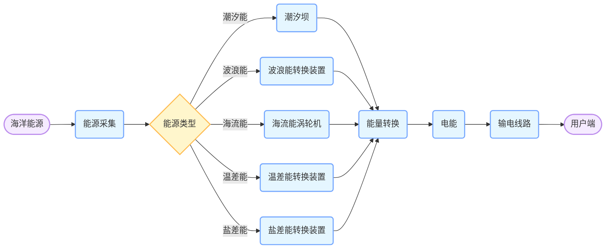

# 海洋能源开发的技术进步与投资机会

> 关键词：海洋能源开发、技术进步、投资机会、可再生能源、海洋能利用

> 摘要：本文围绕海洋能源开发展开，深入探讨了其技术进步的现状、原理、实现步骤等多方面内容。通过分析海洋能源开发的数学模型、实际案例，揭示了海洋能源开发在不同领域的应用场景。同时，为读者提供了丰富的学习资源、开发工具以及相关论文著作推荐。最后，对海洋能源开发的未来发展趋势与挑战进行总结，并解答常见问题，旨在全面展现海洋能源开发的技术要点和投资潜力，为相关从业者和投资者提供有价值的参考。

## 1. 背景介绍 
### 1.1 目的和范围
海洋能源作为一种丰富的可再生能源，其开发对于缓解全球能源危机、减少对传统化石能源的依赖以及实现可持续发展具有重要意义。本文的目的在于详细阐述海洋能源开发的技术进步情况，并分析其中蕴含的投资机会。范围涵盖了海洋能源的主要类型，如潮汐能、波浪能、海流能、温差能和盐差能等，探讨了这些能源开发的技术原理、发展现状以及未来的市场潜力。

### 1.2 预期读者
本文预期读者包括能源领域的从业者，如能源工程师、科研人员，他们可以从技术层面深入了解海洋能源开发的最新进展；投资领域的专业人士，如风险投资家、基金经理等，能够从中发现潜在的投资机会；对能源和环境问题感兴趣的普通读者，可借此了解海洋能源开发的重要性和发展前景。

### 1.3 文档结构概述
本文首先介绍海洋能源开发的背景信息，包括目的、预期读者和文档结构。接着阐述海洋能源开发的核心概念与联系，通过文本示意图和 Mermaid 流程图展示其原理和架构。然后详细讲解核心算法原理及具体操作步骤，结合 Python 源代码进行说明。随后介绍数学模型和公式，并举例说明。在项目实战部分，给出代码实际案例并进行详细解释。之后分析海洋能源开发的实际应用场景，推荐相关的工具和资源。最后总结未来发展趋势与挑战，解答常见问题，并提供扩展阅读和参考资料。

### 1.4 术语表
#### 1.4.1 核心术语定义
- **海洋能源**：指依附在海水中的可再生能源，包括潮汐能、波浪能、海流能、温差能和盐差能等。
- **潮汐能**：因月球和太阳对地球各处海水的引力不同而引起的海水涨落所产生的能量。
- **波浪能**：海洋表面波浪所具有的动能和势能。
- **海流能**：海水流动的动能，主要是指海底水道和海峡中较为稳定的流动以及由于潮汐导致的有规律的海水流动所产生的能量。
- **温差能**：由于表层海水和深层海水之间的温度差而产生的能量。
- **盐差能**：两种含盐浓度不同的海水之间的化学电位差能。

#### 1.4.2 相关概念解释
- **可再生能源**：在自然界中可以不断再生、永续利用的能源，具有取之不尽，用之不竭的特点，主要包括太阳能、风能、水能、生物质能、地热能和海洋能等。
- **能源转换效率**：指能源在转换过程中，输出的有效能量与输入的能量之比，反映了能源转换装置的性能和效率。

#### 1.4.3 缩略词列表
- **OTEC**：Ocean Thermal Energy Conversion（海洋温差能转换）
- **TEC**：Tidal Energy Converter（潮汐能转换器）
- **WEC**：Wave Energy Converter（波浪能转换器）

## 2. 核心概念与联系 
海洋能源开发涉及多种能源形式，它们的核心概念和相互联系如下：

### 核心概念原理
- **潮汐能**：其原理基于天体引潮力。月球和太阳对地球海水的引力作用使得海水产生周期性的涨落。在涨潮和落潮过程中，海水的水位差蕴含着巨大的能量。通过建造潮汐电站，利用水轮机将潮汐的势能转化为机械能，再通过发电机将机械能转化为电能。
- **波浪能**：波浪是由风的作用引起的海水表面的起伏运动。波浪能的利用是通过各种波浪能转换装置，将波浪的动能和势能转化为机械能，再进一步转化为电能。
- **海流能**：海流是大规模的海水流动，具有稳定的流速和流向。海流能的开发利用类似于风力发电，通过海流能涡轮机捕获海流的动能，将其转化为机械能，最终转化为电能。
- **温差能**：热带和亚热带海域的表层海水温度较高，而深层海水温度较低，存在明显的温度差。温差能利用的原理是利用表层温水加热低沸点工质（如氨）使其汽化，推动汽轮机发电，然后用深层冷水将气态工质冷凝为液态，形成循环。
- **盐差能**：当两种含盐浓度不同的海水相遇时，会产生化学电位差。盐差能的利用通常是通过离子交换膜等装置，利用这种电位差产生电流。

### 架构的文本示意图
海洋能源开发的整体架构可以看作是一个从能源获取到能量转换再到能量输出的过程。首先，通过各种能源采集装置（如潮汐坝、波浪能转换装置、海流能涡轮机等）获取海洋能源。然后，将获取的海洋能源通过能量转换装置（如水轮机、汽轮机、发电机等）转化为电能。最后，将电能通过输电线路输送到电网或用户端。

### Mermaid 流程图


## 3. 核心算法原理 & 具体操作步骤 
### 潮汐能核心算法原理及操作步骤
#### 算法原理
潮汐能的能量计算公式为：$E = \frac{1}{2} \rho g A h^2$，其中 $E$ 表示潮汐能（单位：焦耳），$\rho$ 表示海水密度（单位：千克/立方米），$g$ 表示重力加速度（单位：米/秒²），$A$ 表示潮汐水库的面积（单位：平方米），$h$ 表示潮汐的水位差（单位：米）。

#### Python 源代码实现
```python
# 定义常量
rho = 1025  # 海水密度，单位：千克/立方米
g = 9.8  # 重力加速度，单位：米/秒²

def tidal_energy(A, h):
    """
    计算潮汐能
    :param A: 潮汐水库的面积，单位：平方米
    :param h: 潮汐的水位差，单位：米
    :return: 潮汐能，单位：焦耳
    """
    energy = 0.5 * rho * g * A * h ** 2
    return energy

# 示例
A = 10000  # 潮汐水库面积为 10000 平方米
h = 5  # 潮汐水位差为 5 米
tidal_energy_result = tidal_energy(A, h)
print(f"潮汐能为 {tidal_energy_result} 焦耳")
```

#### 具体操作步骤
1. 确定潮汐水库的位置和面积 $A$，可以通过实地测量和地理信息系统（GIS）技术进行确定。
2. 监测潮汐的水位差 $h$，可以使用水位传感器等设备进行实时监测。
3. 将测量得到的 $A$ 和 $h$ 代入潮汐能计算公式，计算出潮汐能。
4. 根据计算结果，设计合适的潮汐电站，选择合适的水轮机和发电机，将潮汐能转化为电能。

### 波浪能核心算法原理及操作步骤
#### 算法原理
波浪能的平均功率计算公式为：$P = \frac{\rho g^2 H^2 T}{64 \pi}$，其中 $P$ 表示波浪能的平均功率（单位：瓦特），$\rho$ 表示海水密度（单位：千克/立方米），$g$ 表示重力加速度（单位：米/秒²），$H$ 表示波浪的有效波高（单位：米），$T$ 表示波浪的周期（单位：秒）。

#### Python 源代码实现
```python
# 定义常量
rho = 1025  # 海水密度，单位：千克/立方米
g = 9.8  # 重力加速度，单位：米/秒²

def wave_energy_power(H, T):
    """
    计算波浪能的平均功率
    :param H: 波浪的有效波高，单位：米
    :param T: 波浪的周期，单位：秒
    :return: 波浪能的平均功率，单位：瓦特
    """
    power = (rho * g ** 2 * H ** 2 * T) / (64 * 3.14)
    return power

# 示例
H = 2  # 波浪有效波高为 2 米
T = 8  # 波浪周期为 8 秒
wave_power_result = wave_energy_power(H, T)
print(f"波浪能的平均功率为 {wave_power_result} 瓦特")
```

#### 具体操作步骤
1. 选择合适的波浪能转换装置，如振荡水柱式、摆式、鸭式等。
2. 利用波浪监测设备，测量波浪的有效波高 $H$ 和周期 $T$。
3. 将测量得到的 $H$ 和 $T$ 代入波浪能平均功率计算公式，计算出波浪能的平均功率。
4. 根据计算结果，确定波浪能转换装置的规格和数量，将波浪能转化为电能。

### 海流能核心算法原理及操作步骤
#### 算法原理
海流能的功率计算公式为：$P = \frac{1}{2} \rho A v^3 C_p$，其中 $P$ 表示海流能的功率（单位：瓦特），$\rho$ 表示海水密度（单位：千克/立方米），$A$ 表示海流能涡轮机的扫掠面积（单位：平方米），$v$ 表示海流的流速（单位：米/秒），$C_p$ 表示海流能涡轮机的功率系数。

#### Python 源代码实现
```python
# 定义常量
rho = 1025  # 海水密度，单位：千克/立方米
C_p = 0.4  # 海流能涡轮机的功率系数

def current_energy_power(A, v):
    """
    计算海流能的功率
    :param A: 海流能涡轮机的扫掠面积，单位：平方米
    :param v: 海流的流速，单位：米/秒
    :return: 海流能的功率，单位：瓦特
    """
    power = 0.5 * rho * A * v ** 3 * C_p
    return power

# 示例
A = 20  # 海流能涡轮机的扫掠面积为 20 平方米
v = 2  # 海流的流速为 2 米/秒
current_power_result = current_energy_power(A, v)
print(f"海流能的功率为 {current_power_result} 瓦特")
```

#### 具体操作步骤
1. 选择合适的海流能涡轮机，根据海流的流速和深度等条件确定涡轮机的规格。
2. 测量海流的流速 $v$ 和海流能涡轮机的扫掠面积 $A$。
3. 将测量得到的 $A$ 和 $v$ 代入海流能功率计算公式，计算出海流能的功率。
4. 根据计算结果，确定海流能发电系统的配置，将海流能转化为电能。

### 温差能核心算法原理及操作步骤
#### 算法原理
温差能的热效率计算公式为：$\eta = \frac{T_1 - T_2}{T_1}$，其中 $\eta$ 表示热效率，$T_1$ 表示表层海水温度（单位：开尔文），$T_2$ 表示深层海水温度（单位：开尔文）。

#### Python 源代码实现
```python
def ocean_thermal_efficiency(T1, T2):
    """
    计算温差能的热效率
    :param T1: 表层海水温度，单位：开尔文
    :param T2: 深层海水温度，单位：开尔文
    :return: 温差能的热效率
    """
    efficiency = (T1 - T2) / T1
    return efficiency

# 示例
T1 = 300  # 表层海水温度为 300 开尔文
T2 = 280  # 深层海水温度为 280 开尔文
thermal_efficiency_result = ocean_thermal_efficiency(T1, T2)
print(f"温差能的热效率为 {thermal_efficiency_result}")
```

#### 具体操作步骤
1. 选择合适的温差能转换系统，如开式循环、闭式循环或混合循环系统。
2. 测量表层海水温度 $T_1$ 和深层海水温度 $T_2$。
3. 将测量得到的 $T_1$ 和 $T_2$ 代入温差能热效率计算公式，计算出温差能的热效率。
4. 根据计算结果，设计温差能发电系统的参数，将温差能转化为电能。

### 盐差能核心算法原理及操作步骤
#### 算法原理
盐差能的电动势计算公式为：$E = \frac{RT}{zF} \ln \frac{C_1}{C_2}$，其中 $E$ 表示电动势（单位：伏特），$R$ 表示气体常数（单位：焦耳/（摩尔·开尔文）），$T$ 表示温度（单位：开尔文），$z$ 表示离子的价数，$F$ 表示法拉第常数（单位：库仑/摩尔），$C_1$ 和 $C_2$ 分别表示两种不同含盐浓度海水的盐浓度（单位：摩尔/升）。

#### Python 源代码实现
```python
# 定义常量
R = 8.314  # 气体常数，单位：焦耳/（摩尔·开尔文）
F = 96485  # 法拉第常数，单位：库仑/摩尔

def salinity_energy_emf(T, z, C1, C2):
    """
    计算盐差能的电动势
    :param T: 温度，单位：开尔文
    :param z: 离子的价数
    :param C1: 高盐浓度海水的盐浓度，单位：摩尔/升
    :param C2: 低盐浓度海水的盐浓度，单位：摩尔/升
    :return: 盐差能的电动势，单位：伏特
    """
    emf = (R * T / (z * F)) * (C1 / C2)
    return emf

# 示例
T = 298  # 温度为 298 开尔文
z = 1  # 离子价数为 1
C1 = 0.5  # 高盐浓度海水的盐浓度为 0.5 摩尔/升
C2 = 0.1  # 低盐浓度海水的盐浓度为 0.1 摩尔/升
salinity_emf_result = salinity_energy_emf(T, z, C1, C2)
print(f"盐差能的电动势为 {salinity_emf_result} 伏特")
```

#### 具体操作步骤
1. 选择合适的盐差能转换装置，如压力延迟渗透（PRO）装置、反向电渗析（RED）装置等。
2. 测量两种不同含盐浓度海水的盐浓度 $C_1$ 和 $C_2$ 以及温度 $T$。
3. 将测量得到的 $T$、$z$、$C_1$ 和 $C_2$ 代入盐差能电动势计算公式，计算出盐差能的电动势。
4. 根据计算结果，设计盐差能发电系统的参数，将盐差能转化为电能。

## 4. 数学模型和公式 & 详细讲解 & 举例说明 
### 潮汐能
#### 数学模型和公式
潮汐能的能量计算公式为：$E = \frac{1}{2} \rho g A h^2$

#### 详细讲解
- $\rho$ 是海水密度，由于海水的成分相对稳定，其密度一般在 1020 - 1030 千克/立方米之间，通常取 1025 千克/立方米。
- $g$ 是重力加速度，在地球表面，其值约为 9.8 米/秒²。
- $A$ 是潮汐水库的面积，它反映了潮汐能的作用范围，面积越大，蕴含的潮汐能越多。
- $h$ 是潮汐的水位差，水位差越大，潮汐能也就越大。

#### 举例说明
假设一个潮汐水库的面积为 5000 平方米，潮汐的水位差为 4 米，海水密度为 1025 千克/立方米，重力加速度为 9.8 米/秒²。则潮汐能为：
$$
\begin{align*}
E &= \frac{1}{2} \times 1025 \times 9.8 \times 5000 \times 4^2\\
&= 0.5 \times 1025 \times 9.8 \times 5000 \times 16\\
&= 401800000 \text{ 焦耳}
\end{align*}
$$

### 波浪能
#### 数学模型和公式
波浪能的平均功率计算公式为：$P = \frac{\rho g^2 H^2 T}{64 \pi}$

#### 详细讲解
- $\rho$ 是海水密度，如前所述，一般取 1025 千克/立方米。
- $g$ 是重力加速度，约为 9.8 米/秒²。
- $H$ 是波浪的有效波高，它反映了波浪的大小，波高越大，波浪能越大。
- $T$ 是波浪的周期，即相邻两个波峰或波谷通过同一点所需要的时间，周期越长，波浪能越大。

#### 举例说明
假设波浪的有效波高为 3 米，周期为 10 秒，海水密度为 1025 千克/立方米，重力加速度为 9.8 米/秒²。则波浪能的平均功率为：
$$
\begin{align*}
P &= \frac{1025 \times 9.8^2 \times 3^2 \times 10}{64 \times 3.14}\\
&= \frac{1025 \times 96.04 \times 9 \times 10}{200.96}\\
&\approx 44247.6 \text{ 瓦特}
\end{align*}
$$

### 海流能
#### 数学模型和公式
海流能的功率计算公式为：$P = \frac{1}{2} \rho A v^3 C_p$

#### 详细讲解
- $\rho$ 是海水密度，通常取 1025 千克/立方米。
- $A$ 是海流能涡轮机的扫掠面积，它与涡轮机的尺寸有关，扫掠面积越大，捕获的海流能越多。
- $v$ 是海流的流速，流速的三次方与海流能功率成正比，因此流速对海流能的影响非常大。
- $C_p$ 是海流能涡轮机的功率系数，它反映了涡轮机将海流能转化为机械能的效率，一般取值在 0.3 - 0.5 之间。

#### 举例说明
假设海流能涡轮机的扫掠面积为 30 平方米，海流的流速为 3 米/秒，海水密度为 1025 千克/立方米，功率系数为 0.4。则海流能的功率为：
$$
\begin{align*}
P &= \frac{1}{2} \times 1025 \times 30 \times 3^3 \times 0.4\\
&= 0.5 \times 1025 \times 30 \times 27 \times 0.4\\
&= 166050 \text{ 瓦特}
\end{align*}
$$

### 温差能
#### 数学模型和公式
温差能的热效率计算公式为：$\eta = \frac{T_1 - T_2}{T_1}$

#### 详细讲解
- $T_1$ 是表层海水温度，$T_2$ 是深层海水温度，两者均需用开尔文温度表示。热效率反映了温差能转换系统将热能转化为电能的效率，温差越大，热效率越高。

#### 举例说明
假设表层海水温度为 305 开尔文，深层海水温度为 285 开尔文。则温差能的热效率为：
$$
\begin{align*}
\eta &= \frac{305 - 285}{305}\\
&= \frac{20}{305}\\
&\approx 0.0656
\end{align*}
$$

### 盐差能
#### 数学模型和公式
盐差能的电动势计算公式为：$E = \frac{RT}{zF} \ln \frac{C_1}{C_2}$

#### 详细讲解
- $R$ 是气体常数，其值为 8.314 焦耳/（摩尔·开尔文）。
- $T$ 是温度，用开尔文温度表示，温度越高，电动势越大。
- $z$ 是离子的价数，不同的盐离子价数不同。
- $F$ 是法拉第常数，其值为 96485 库仑/摩尔。
- $C_1$ 和 $C_2$ 分别是两种不同含盐浓度海水的盐浓度，盐浓度差越大，电动势越大。

#### 举例说明
假设温度为 300 开尔文，离子价数为 1，高盐浓度海水的盐浓度为 0.6 摩尔/升，低盐浓度海水的盐浓度为 0.2 摩尔/升。则盐差能的电动势为：
$$
\begin{align*}
E &= \frac{8.314 \times 300}{1 \times 96485} \ln \frac{0.6}{0.2}\\
&= \frac{2494.2}{96485} \ln 3\\
&\approx 0.0258 \times 1.0986\\
&\approx 0.0283 \text{ 伏特}
\end{align*}
$$

## 5. 项目实战：代码实际案例和详细解释说明 
### 5.1  开发环境搭建
在进行海洋能源开发的项目实战时，我们主要使用 Python 语言进行开发。以下是开发环境搭建的步骤：

#### 安装 Python
首先，从 Python 官方网站（https://www.python.org/downloads/）下载适合你操作系统的 Python 安装包，并按照安装向导进行安装。建议安装 Python 3.7 及以上版本。

#### 安装开发工具
可以选择使用 PyCharm、Visual Studio Code 等集成开发环境（IDE）。这里以 Visual Studio Code 为例，从 Visual Studio Code 官方网站（https://code.visualstudio.com/）下载并安装。安装完成后，在 Visual Studio Code 中安装 Python 扩展，以便更好地支持 Python 开发。

#### 安装必要的库
在命令行中使用以下命令安装必要的库：
```sh
pip install numpy pandas matplotlib
```
- `numpy`：用于数值计算。
- `pandas`：用于数据处理和分析。
- `matplotlib`：用于数据可视化。

### 5.2  源代码详细实现和代码解读
#### 潮汐能发电系统模拟
```python
import numpy as np
import matplotlib.pyplot as plt

# 定义常量
rho = 1025  # 海水密度，单位：千克/立方米
g = 9.8  # 重力加速度，单位：米/秒²

# 模拟潮汐水位差随时间的变化
time = np.linspace(0, 24, 100)  # 时间范围为 0 到 24 小时，取 100 个点
h = 3 * np.sin(2 * np.pi * time / 12) + 5  # 潮汐水位差的模拟函数

# 计算潮汐能随时间的变化
A = 2000  # 潮汐水库面积，单位：平方米
energy = 0.5 * rho * g * A * h ** 2

# 绘制潮汐水位差和潮汐能随时间的变化曲线
plt.figure(figsize=(12, 6))

plt.subplot(2, 1, 1)
plt.plot(time, h)
plt.title('Tidal Water Level Difference')
plt.xlabel('Time (hours)')
plt.ylabel('Water Level Difference (m)')

plt.subplot(2, 1, 2)
plt.plot(time, energy)
plt.title('Tidal Energy')
plt.xlabel('Time (hours)')
plt.ylabel('Energy (Joules)')

plt.tight_layout()
plt.show()
```

#### 代码解读
1. **常量定义**：定义了海水密度 `rho` 和重力加速度 `g`。
2. **潮汐水位差模拟**：使用 `numpy` 库的 `linspace` 函数生成 0 到 24 小时的时间序列，然后使用正弦函数模拟潮汐水位差随时间的变化。
3. **潮汐能计算**：根据潮汐能计算公式，计算每个时间点的潮汐能。
4. **数据可视化**：使用 `matplotlib` 库绘制潮汐水位差和潮汐能随时间的变化曲线。

#### 波浪能发电系统模拟
```python
import numpy as np
import matplotlib.pyplot as plt

# 定义常量
rho = 1025  # 海水密度，单位：千克/立方米
g = 9.8  # 重力加速度，单位：米/秒²

# 模拟波浪有效波高和周期随时间的变化
time = np.linspace(0, 60, 100)  # 时间范围为 0 到 60 分钟，取 100 个点
H = 2 * np.sin(2 * np.pi * time / 20) + 3  # 波浪有效波高的模拟函数
T = 8 * np.sin(2 * np.pi * time / 30) + 10  # 波浪周期的模拟函数

# 计算波浪能平均功率随时间的变化
power = (rho * g ** 2 * H ** 2 * T) / (64 * np.pi)

# 绘制波浪有效波高、周期和波浪能平均功率随时间的变化曲线
plt.figure(figsize=(12, 9))

plt.subplot(3, 1, 1)
plt.plot(time, H)
plt.title('Wave Effective Wave Height')
plt.xlabel('Time (minutes)')
plt.ylabel('Wave Height (m)')

plt.subplot(3, 1, 2)
plt.plot(time, T)
plt.title('Wave Period')
plt.xlabel('Time (minutes)')
plt.ylabel('Period (s)')

plt.subplot(3, 1, 3)
plt.plot(time, power)
plt.title('Wave Energy Average Power')
plt.xlabel('Time (minutes)')
plt.ylabel('Power (Watts)')

plt.tight_layout()
plt.show()
```

#### 代码解读
1. **常量定义**：定义了海水密度 `rho` 和重力加速度 `g`。
2. **波浪参数模拟**：使用 `numpy` 库的 `linspace` 函数生成 0 到 60 分钟的时间序列，然后使用正弦函数模拟波浪有效波高和周期随时间的变化。
3. **波浪能平均功率计算**：根据波浪能平均功率计算公式，计算每个时间点的波浪能平均功率。
4. **数据可视化**：使用 `matplotlib` 库绘制波浪有效波高、周期和波浪能平均功率随时间的变化曲线。

### 5.3  代码解读与分析
#### 潮汐能发电系统模拟分析
- **潮汐水位差变化**：通过正弦函数模拟潮汐水位差的变化，反映了潮汐的周期性。潮汐水位差的变化会直接影响潮汐能的大小。
- **潮汐能变化**：潮汐能与潮汐水位差的平方成正比，因此潮汐能的变化也呈现出周期性，且变化幅度较大。

#### 波浪能发电系统模拟分析
- **波浪参数变化**：波浪有效波高和周期的变化使用正弦函数模拟，反映了波浪的动态特性。
- **波浪能平均功率变化**：波浪能平均功率与波浪有效波高的平方和周期成正比，因此波浪能平均功率的变化也较为复杂，受到波浪参数变化的影响。

## 6. 实际应用场景 
### 海岛供电
对于远离大陆的海岛，传统的输电方式成本高且不稳定。海洋能源开发可以为海岛提供稳定的电力供应。例如，潮汐能电站可以利用海岛附近的潮汐资源，在涨潮和落潮时发电；波浪能装置可以捕获波浪的能量，转化为电能。这些海洋能源发电系统可以满足海岛居民的生活用电和岛上渔业、旅游业等产业的用电需求。

### 海上平台供电
海上石油平台、海上风力发电平台等海上设施需要大量的电力来维持其正常运行。海流能和温差能可以为海上平台提供持续的电力支持。海流能涡轮机可以利用海流的动能发电，而温差能转换系统可以利用海洋表层和深层的温度差发电，减少了对传统燃油发电的依赖，降低了运营成本和环境污染。

### 海水淡化
海水淡化需要消耗大量的能源。盐差能可以为海水淡化过程提供能量。通过盐差能发电系统产生的电能，可以驱动海水淡化设备，将海水转化为淡水，解决沿海地区和海岛的淡水短缺问题。

### 海洋监测系统供电
海洋监测系统需要长期稳定的电力供应来维持其正常运行，以实时监测海洋环境、气象条件等信息。波浪能和海流能可以为海洋监测浮标、水下传感器等设备提供电力，确保监测数据的连续性和准确性。

## 7. 工具和资源推荐
### 7.1 学习资源推荐
#### 7.1.1 书籍推荐
- 《海洋能利用技术》：全面介绍了海洋能的各种利用技术，包括潮汐能、波浪能、海流能、温差能和盐差能等，内容涵盖原理、技术和应用等方面。
- 《可再生能源工程》：系统阐述了可再生能源的基本原理和工程应用，其中包括海洋能源开发的相关内容，对理解海洋能源的整体框架和技术要点有很大帮助。
- 《海洋能源开发与利用》：详细介绍了海洋能源开发的最新技术和研究成果，以及海洋能源开发的经济、环境和政策等方面的内容。

#### 7.1.2 在线课程
- Coursera 平台上的“Renewable Energy Technologies”（可再生能源技术）课程：由知名高校的教授授课，讲解了包括海洋能源在内的各种可再生能源技术的原理和应用。
- edX 平台上的“Ocean Energy Systems”（海洋能源系统）课程：深入介绍了海洋能源系统的设计、运行和管理等方面的知识。
- 中国大学 MOOC 上的“海洋能利用技术”课程：结合国内的实际情况，介绍了海洋能利用的技术和案例。

#### 7.1.3 技术博客和网站
- IRENA（国际可再生能源署）官网（https://www.irena.org/）：提供了关于可再生能源的最新政策、技术和市场信息，包括海洋能源开发的相关内容。
- Ocean Energy Systems（海洋能源系统）官网（https://ocean-energy-systems.org/）：专注于海洋能源开发的国际合作组织的官网，发布了大量的海洋能源研究报告和技术资料。
- Energy.gov（美国能源部官网）：提供了丰富的能源技术信息，包括海洋能源开发的研究成果和项目案例。

### 7.2 开发工具框架推荐
#### 7.2.1 IDE和编辑器
- PyCharm：一款专业的 Python 集成开发环境，具有代码自动完成、调试、版本控制等功能，适合开发海洋能源相关的 Python 程序。
- Visual Studio Code：一款轻量级的代码编辑器，支持多种编程语言，通过安装 Python 扩展可以方便地进行 Python 开发，同时还可以集成各种开发工具和插件。

#### 7.2.2 调试和性能分析工具
- Py-Spy：一个简单易用的 Python 性能分析工具，可以实时监测 Python 程序的 CPU 使用率和函数调用情况，帮助开发者优化代码性能。
- PDB（Python Debugger）：Python 内置的调试器，可以在代码中设置断点，逐步执行代码，查看变量的值和程序的执行流程，方便调试代码。

#### 7.2.3 相关框架和库
- NumPy：用于数值计算的 Python 库，提供了高效的数组操作和数学函数，在海洋能源开发的数值模拟和计算中非常有用。
- Pandas：用于数据处理和分析的 Python 库，可以方便地处理和分析海洋能源开发中的各种数据，如潮汐数据、波浪数据等。
- Matplotlib：用于数据可视化的 Python 库，可以绘制各种类型的图表，如折线图、柱状图、散点图等，帮助开发者直观地展示海洋能源开发的数据和结果。

### 7.3 相关论文著作推荐
#### 7.3.1 经典论文
- “A Review of Wave Energy Converter Technology”：对波浪能转换技术进行了全面的综述，介绍了各种波浪能转换装置的原理、特点和发展现状。
- “Tidal Energy: Current Status and Future Prospects”：分析了潮汐能开发的现状和未来发展前景，探讨了潮汐能开发中的技术、经济和环境等问题。
- “Ocean Thermal Energy Conversion: A Review”：对海洋温差能转换技术进行了回顾，讨论了温差能转换系统的原理、效率和应用前景。

#### 7.3.2 最新研究成果
- 关注《Renewable Energy》《Energy Conversion and Management》等国际知名能源期刊，这些期刊经常发表关于海洋能源开发的最新研究成果和技术进展。
- 参加国际海洋能源会议，如 Ocean Energy Europe Conference、International Conference on Ocean Energy 等，了解最新的研究动态和创新技术。

#### 7.3.3 应用案例分析
- 分析实际的海洋能源开发项目案例，如法国的朗斯潮汐电站、英国的奥克尼群岛波浪能试验场等，了解这些项目的技术方案、建设过程、运行效果和经济效益等方面的情况，为自己的项目提供参考。

## 8. 总结：未来发展趋势与挑战
### 未来发展趋势
#### 技术创新
未来，海洋能源开发技术将不断创新。例如，新型的波浪能转换装置将更加高效、稳定，能够适应不同的海洋环境；温差能转换系统将采用更先进的材料和技术，提高热效率和能量转换效率；盐差能开发技术将不断完善，实现大规模的商业化应用。

#### 规模化发展
随着技术的不断进步和成本的降低，海洋能源开发将逐渐实现规模化发展。更多的海洋能源电站将建设和运行，为社会提供更多的清洁能源。同时，海洋能源产业将形成完整的产业链，包括设备制造、安装、运维等环节，带动相关产业的发展。

#### 多能互补
海洋能源具有多样性和互补性，未来将更多地实现多能互补的开发模式。例如，将潮汐能、波浪能、海流能和温差能等多种海洋能源结合起来，共同为用户提供电力，提高能源供应的稳定性和可靠性。

#### 智能化发展
随着人工智能、物联网等技术的发展，海洋能源开发将向智能化方向发展。智能监测系统将实时监测海洋能源设备的运行状态和海洋环境参数，实现设备的智能控制和优化运行；智能预测系统将能够准确预测海洋能源的变化趋势，为能源调度和管理提供决策支持。

### 挑战
#### 技术难题
海洋能源开发面临着诸多技术难题。例如，海洋环境复杂多变，波浪、海流、潮汐等因素对海洋能源设备的稳定性和可靠性提出了很高的要求；温差能转换系统的热交换效率、盐差能转换装置的离子交换膜性能等技术问题还需要进一步解决。

#### 成本较高
目前，海洋能源开发的成本相对较高。设备的研发、制造、安装和运维成本都比较大，导致海洋能源的电价较高，缺乏市场竞争力。降低成本是海洋能源开发实现商业化应用的关键。

#### 环境影响
海洋能源开发可能会对海洋生态环境产生一定的影响。例如，潮汐电站的建设可能会改变海洋水流和泥沙运动，影响海洋生物的生存和繁殖；海洋能源设备的运行可能会产生噪声和电磁辐射，对海洋生物造成干扰。因此，需要在开发海洋能源的同时，充分考虑环境影响，采取有效的环境保护措施。

#### 政策支持不足
海洋能源开发需要政策的支持和引导。目前，一些国家和地区的政策支持力度还不够，缺乏完善的补贴政策、税收优惠政策和市场准入政策等，影响了海洋能源开发的积极性和发展速度。

## 9. 附录：常见问题与解答
### 1. 海洋能源开发对海洋生态环境有哪些影响？
海洋能源开发可能会对海洋生态环境产生多方面的影响。例如，潮汐电站的建设可能会改变海洋水流和泥沙运动，影响海洋生物的栖息地和洄游路线；海洋能源设备的运行可能会产生噪声和电磁辐射，对海洋生物的听觉、视觉和行为产生干扰；海洋能源开发过程中的废弃物排放可能会污染海洋环境。但是，通过合理的规划和设计，采取有效的环境保护措施，可以将这些影响降到最低。

### 2. 海洋能源开发的成本为什么这么高？
海洋能源开发成本高的原因主要有以下几点：一是海洋环境复杂，对设备的性能和可靠性要求高，导致设备的研发、制造和安装成本较大；二是海洋能源开发需要进行大量的前期调研和勘测工作，包括海洋环境监测、资源评估等，这些工作的成本也比较高；三是海洋能源开发的运维难度大，需要专业的技术人员和设备，运维成本较高。

### 3. 海洋能源开发的技术难度大吗？
海洋能源开发的技术难度较大。海洋环境复杂多变，波浪、海流、潮汐等因素对海洋能源设备的稳定性和可靠性提出了很高的要求。例如，波浪能转换装置需要在复杂的波浪环境中高效地捕获波浪能量，同时还要能够承受波浪的冲击和腐蚀；温差能转换系统需要解决热交换效率、工质选择等技术问题。此外，海洋能源开发还涉及到材料科学、流体力学、电气工程等多个学科领域的知识，需要综合运用多种技术手段。

### 4. 海洋能源开发有哪些政策支持？
不同国家和地区的海洋能源开发政策支持有所不同。一般来说，政策支持包括补贴政策、税收优惠政策、市场准入政策等。例如，一些国家会对海洋能源发电项目给予补贴，降低项目的成本；对海洋能源设备的研发和制造企业给予税收优惠，鼓励企业加大研发投入；制定相关的市场准入政策，保障海洋能源发电能够顺利接入电网。

### 5. 海洋能源开发的前景如何？
海洋能源开发具有广阔的前景。随着全球能源需求的不断增长和对环境保护的重视，海洋能源作为一种丰富的可再生能源，其开发和利用越来越受到关注。未来，随着技术的不断进步和成本的降低，海洋能源开发将逐渐实现规模化和商业化应用，为社会提供更多的清洁能源，对缓解全球能源危机和减少环境污染具有重要意义。

## 10. 扩展阅读 & 参考资料
### 扩展阅读
- 《海洋能源与可持续发展》：深入探讨了海洋能源开发与可持续发展的关系，介绍了海洋能源开发在经济、社会和环境等方面的影响。
- 《海洋工程概论》：涵盖了海洋工程的各个方面，包括海洋能源开发、海洋平台建设、海底管道铺设等，对了解海洋工程的整体知识体系有很大帮助。
- 《可再生能源经济与政策》：分析了可再生能源的经济特性和政策环境，包括海洋能源开发的经济可行性和政策支持措施。

### 参考资料
- IRENA. Renewable Energy Statistics 2023.
- Ocean Energy Systems. Annual Report 2022.
- Energy Information Administration. International Energy Outlook 2023.
- 相关学术期刊发表的论文，如《Renewable Energy》《Energy Conversion and Management》《Journal of Ocean Engineering and Marine Energy》等。