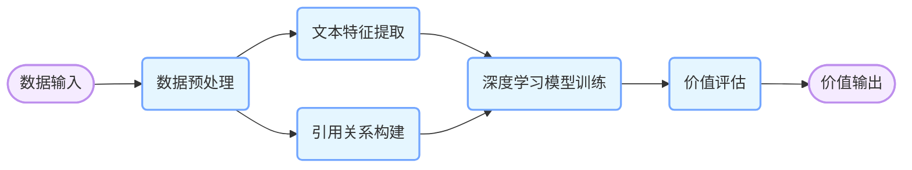

# 深度学习分析公司专利组合价值

> 关键词：深度学习、公司专利组合、价值分析、神经网络、专利评估

> 摘要：本文聚焦于利用深度学习技术对公司专利组合价值进行分析。首先介绍了研究的背景、目的、预期读者等内容，阐述了核心概念及它们之间的联系。接着详细讲解了核心算法原理，包括使用 Python 代码实现，还给出了相关数学模型和公式，并举例说明。通过项目实战展示了代码的实际案例和详细解读，探讨了该技术在实际中的应用场景。同时推荐了学习所需的工具和资源，最后总结了未来发展趋势与挑战，还提供了常见问题解答和扩展阅读资料，旨在为相关领域的研究和实践提供全面的参考。

## 1. 背景介绍 
### 1.1 目的和范围
在当今竞争激烈的商业环境中，专利作为企业创新能力和技术实力的重要体现，其组合价值的评估对于公司的战略决策、投资分析等方面具有至关重要的意义。传统的专利价值评估方法往往依赖于专家经验和简单的统计分析，存在主观性强、效率低等问题。本研究旨在探索利用深度学习技术，挖掘专利文本、引用关系等多源数据中的潜在信息，实现对公司专利组合价值的客观、准确、高效分析。本研究的范围涵盖了深度学习在专利价值评估中的应用原理、算法实现、实际案例分析以及相关工具和资源的推荐。

### 1.2 预期读者
本文的预期读者包括对专利评估和深度学习技术感兴趣的研究人员、企业的知识产权管理人员、投资机构的分析师以及相关领域的学生。研究人员可以从中获取新的研究思路和方法，企业知识产权管理人员能够利用该技术更好地管理和评估公司的专利资产，投资机构分析师可以借助评估结果进行投资决策，学生则可以将其作为学习和研究的参考资料。

### 1.3 文档结构概述
本文将按照以下结构进行组织：首先介绍核心概念及它们之间的联系，包括专利组合价值的定义和深度学习技术的原理；接着详细阐述核心算法原理和具体操作步骤，使用 Python 代码进行示例；然后给出相关的数学模型和公式，并举例说明；通过项目实战展示代码的实际应用和详细解读；探讨该技术在实际中的应用场景；推荐学习所需的工具和资源；最后总结未来发展趋势与挑战，提供常见问题解答和扩展阅读资料。

### 1.4 术语表
#### 1.4.1 核心术语定义
- **专利组合**：指公司拥有的一系列专利的集合，这些专利可能在技术领域、法律状态、商业价值等方面存在差异。
- **专利组合价值**：综合考虑专利的技术创新性、市场应用潜力、法律稳定性等因素，对公司专利组合所具有的经济价值的评估。
- **深度学习**：一种基于人工神经网络的机器学习技术，通过构建多层神经网络模型，自动从大量数据中学习特征和模式。

#### 1.4.2 相关概念解释
- **人工神经网络**：模仿人类神经系统的结构和功能，由大量神经元组成的计算模型，通过神经元之间的连接权重来学习数据的特征和模式。
- **卷积神经网络（CNN）**：一种特殊的人工神经网络，在图像、文本等数据处理中具有良好的效果，通过卷积层、池化层等结构提取数据的局部特征。
- **循环神经网络（RNN）**：一种适用于处理序列数据的神经网络，通过循环结构对序列中的每个元素进行处理，能够捕捉序列中的时间依赖关系。

#### 1.4.3 缩略词列表
- **CNN**：Convolutional Neural Network（卷积神经网络）
- **RNN**：Recurrent Neural Network（循环神经网络）
- **LSTM**：Long Short - Term Memory（长短期记忆网络，一种特殊的 RNN）
- **GRU**：Gated Recurrent Unit（门控循环单元，一种特殊的 RNN）

## 2. 核心概念与联系 

### 2.1 专利组合价值的构成
公司专利组合价值的构成是多维度的，主要包括以下几个方面：
- **技术创新性**：专利所涵盖的技术是否具有新颖性和创造性，是否代表了行业的前沿技术。例如，一家科技公司拥有的关于人工智能算法的专利，如果其算法在性能和效率上优于现有技术，那么该专利的技术创新性就较高。
- **市场应用潜力**：专利技术在市场上的应用前景和商业价值。一些专利虽然技术先进，但由于市场需求不足或应用成本过高，其市场应用潜力可能较低。相反，一些与大众消费市场密切相关的专利，如智能手机的新型交互技术专利，可能具有较高的市场应用潜力。
- **法律稳定性**：专利的法律状态是否稳定，是否存在被无效宣告或侵权纠纷的风险。如果专利的权利要求书撰写清晰、合理，经过了严格的审查程序，那么其法律稳定性就较高。

### 2.2 深度学习技术在专利价值分析中的作用
深度学习技术能够从大量的专利数据中自动学习特征和模式，为专利组合价值的评估提供更客观、准确的依据。具体来说，深度学习可以处理以下几类数据：
- **专利文本数据**：通过对专利的标题、摘要、权利要求书等文本内容进行分析，提取关键词、主题等信息，从而评估专利的技术创新性和市场应用潜力。例如，使用自然语言处理技术和深度学习模型，对专利文本进行分类和情感分析，判断专利技术的优势和劣势。
- **专利引用关系数据**：专利之间的引用关系反映了技术的传承和发展，深度学习可以挖掘引用网络中的潜在信息，评估专利的影响力和重要性。例如，一个被大量其他专利引用的专利，通常具有较高的技术价值和市场应用潜力。
- **其他相关数据**：如专利的申请时间、申请人背景、法律状态等数据，深度学习可以将这些多源数据进行融合，综合评估专利组合的价值。

### 2.3 核心概念原理和架构的文本示意图
```plaintext
专利组合价值评估系统
|-- 数据输入
|   |-- 专利文本数据
|   |-- 专利引用关系数据
|   |-- 其他相关数据（申请时间、申请人背景等）
|-- 深度学习模型
|   |-- 文本处理模块（如 CNN、RNN）
|   |-- 图神经网络模块（处理引用关系）
|   |-- 数据融合模块
|-- 价值评估输出
|   |-- 专利组合总价值
|   |-- 各专利价值分布
```

### 2.4 Mermaid 流程图


## 3. 核心算法原理 & 具体操作步骤 

### 3.1 专利文本特征提取算法
我们可以使用卷积神经网络（CNN）对专利文本进行特征提取。CNN 能够自动提取文本中的局部特征，通过卷积层、池化层和全连接层的组合，将文本转换为固定长度的特征向量。

以下是使用 Python 和 PyTorch 实现的简单 CNN 文本特征提取代码：
```python
import torch
import torch.nn as nn
import torch.nn.functional as F

class TextCNN(nn.Module):
    def __init__(self, vocab_size, embedding_dim, num_filters, filter_sizes, output_dim, dropout):
        super().__init__()
        self.embedding = nn.Embedding(vocab_size, embedding_dim)
        self.convs = nn.ModuleList([
            nn.Conv2d(in_channels = 1, 
                      out_channels = num_filters, 
                      kernel_size = (fs, embedding_dim)) 
            for fs in filter_sizes
        ])
        self.fc = nn.Linear(len(filter_sizes) * num_filters, output_dim)
        self.dropout = nn.Dropout(dropout)
        
    def forward(self, text):
        embedded = self.embedding(text)
        embedded = embedded.unsqueeze(1)
        conved = [F.relu(conv(embedded)).squeeze(3) for conv in self.convs]
        pooled = [F.max_pool1d(conv, conv.shape[2]).squeeze(2) for conv in conved]
        cat = self.dropout(torch.cat(pooled, dim = 1))
        return self.fc(cat)

# 示例参数设置
vocab_size = 10000
embedding_dim = 100
num_filters = 100
filter_sizes = [3, 4, 5]
output_dim = 20
dropout = 0.5

model = TextCNN(vocab_size, embedding_dim, num_filters, filter_sizes, output_dim, dropout)
```

### 3.2 专利引用关系处理算法
对于专利引用关系，我们可以使用图神经网络（GNN）进行处理。图神经网络能够有效地处理图结构数据，挖掘节点（专利）之间的关系信息。以下是使用 PyTorch Geometric 实现的简单 GNN 模型代码：
```python
import torch
import torch.nn.functional as F
from torch_geometric.nn import GCNConv

class GNN(torch.nn.Module):
    def __init__(self, in_channels, hidden_channels, out_channels):
        super(GNN, self).__init__()
        self.conv1 = GCNConv(in_channels, hidden_channels)
        self.conv2 = GCNConv(hidden_channels, out_channels)

    def forward(self, x, edge_index):
        x = self.conv1(x, edge_index)
        x = F.relu(x)
        x = F.dropout(x, training=self.training)
        x = self.conv2(x, edge_index)
        return F.log_softmax(x, dim=1)

# 示例参数设置
in_channels = 10
hidden_channels = 20
out_channels = 5

model = GNN(in_channels, hidden_channels, out_channels)
```

### 3.3 数据融合与价值评估算法
将文本特征和引用关系特征进行融合，我们可以使用全连接神经网络进行价值评估。以下是简单的融合和评估代码：
```python
import torch
import torch.nn as nn

class FusionModel(nn.Module):
    def __init__(self, text_feature_dim, graph_feature_dim, hidden_dim, output_dim):
        super().__init__()
        self.fc1 = nn.Linear(text_feature_dim + graph_feature_dim, hidden_dim)
        self.fc2 = nn.Linear(hidden_dim, output_dim)
        self.relu = nn.ReLU()

    def forward(self, text_features, graph_features):
        combined_features = torch.cat((text_features, graph_features), dim=1)
        x = self.fc1(combined_features)
        x = self.relu(x)
        x = self.fc2(x)
        return x

# 示例参数设置
text_feature_dim = 20
graph_feature_dim = 5
hidden_dim = 10
output_dim = 1

model = FusionModel(text_feature_dim, graph_feature_dim, hidden_dim, output_dim)
```

### 3.4 具体操作步骤
1. **数据收集**：收集公司的专利文本数据、引用关系数据以及其他相关数据。
2. **数据预处理**：对专利文本进行清洗、分词等处理，构建引用关系图。
3. **特征提取**：使用 CNN 提取文本特征，使用 GNN 提取引用关系特征。
4. **数据融合**：将文本特征和引用关系特征进行拼接。
5. **模型训练**：使用融合后的特征训练全连接神经网络，优化模型参数。
6. **价值评估**：使用训练好的模型对公司专利组合进行价值评估。

## 4. 数学模型和公式 & 详细讲解 & 举例说明 

### 4.1 卷积神经网络（CNN）数学模型
在 CNN 中，卷积层的核心操作是卷积运算。假设输入的文本特征矩阵为 $X \in \mathbb{R}^{m \times n}$，其中 $m$ 是文本序列的长度，$n$ 是词向量的维度。卷积核 $W \in \mathbb{R}^{k \times n}$，其中 $k$ 是卷积核的大小。卷积运算可以表示为：
$$
y_{i} = f\left(\sum_{j = 0}^{k - 1} \sum_{l = 0}^{n - 1} W_{j, l} X_{i + j, l}+b\right)
$$
其中 $y_{i}$ 是卷积输出的第 $i$ 个元素，$f$ 是激活函数（如 ReLU），$b$ 是偏置项。

池化层的作用是对卷积输出进行降维，常用的池化方法是最大池化。假设卷积输出为 $Y \in \mathbb{R}^{p}$，最大池化操作可以表示为：
$$
\hat{y} = \max_{i \in S} Y_{i}
$$
其中 $S$ 是池化窗口所覆盖的元素集合。

### 4.2 图神经网络（GNN）数学模型
以简单的图卷积网络（GCN）为例，GCN 的消息传递机制可以表示为：
$$
H^{(l + 1)} = \sigma\left(\tilde{D}^{-\frac{1}{2}}\tilde{A}\tilde{D}^{-\frac{1}{2}}H^{(l)}W^{(l)}\right)
$$
其中 $H^{(l)}$ 是第 $l$ 层的节点特征矩阵，$\tilde{A}=A + I$ 是邻接矩阵加上自环，$\tilde{D}$ 是 $\tilde{A}$ 的度矩阵，$W^{(l)}$ 是第 $l$ 层的可学习权重矩阵，$\sigma$ 是激活函数。

### 4.3 数据融合与价值评估数学模型
在数据融合阶段，将文本特征 $x_{text}$ 和图特征 $x_{graph}$ 进行拼接得到 $x_{combined} = [x_{text}, x_{graph}]$。全连接神经网络的前向传播可以表示为：
$$
h = \sigma\left(W_1x_{combined}+b_1\right)
$$
$$
\hat{y} = W_2h + b_2
$$
其中 $W_1$ 和 $W_2$ 是权重矩阵，$b_1$ 和 $b_2$ 是偏置项，$\sigma$ 是激活函数。

### 4.4 举例说明
假设我们有一个包含 10 个专利的公司专利组合，每个专利的文本序列长度为 20，词向量维度为 10。使用大小为 3 的卷积核进行卷积操作，卷积核数量为 5。那么输入的文本特征矩阵 $X \in \mathbb{R}^{20 \times 10}$，卷积核 $W \in \mathbb{R}^{3 \times 10}$。经过卷积运算后，得到卷积输出 $Y \in \mathbb{R}^{18}$（假设步长为 1）。再经过最大池化操作，将输出降维为一个标量。

对于引用关系图，假设图中有 10 个节点（专利），每个节点的初始特征维度为 5。使用 GCN 进行两层消息传递，每层的隐藏维度为 10。经过 GCN 处理后，每个节点的特征维度变为 10。

最后将文本特征和图特征进行融合，假设文本特征维度为 1，图特征维度为 10，融合后的特征维度为 11。使用全连接神经网络进行价值评估，隐藏层维度为 5，输出维度为 1，得到每个专利的价值评估结果。

## 5. 项目实战：代码实际案例和详细解释说明 

### 5.1  开发环境搭建
#### 5.1.1 安装 Python
首先需要安装 Python 环境，建议使用 Python 3.7 及以上版本。可以从 Python 官方网站（https://www.python.org/downloads/）下载并安装。

#### 5.1.2 安装必要的库
使用 pip 安装以下必要的库：
```bash
pip install torch torchvision torch_geometric numpy pandas scikit-learn
```

### 5.2  源代码详细实现和代码解读
#### 5.2.1 数据加载与预处理
```python
import pandas as pd
import numpy as np
from sklearn.model_selection import train_test_split
from torch.utils.data import Dataset, DataLoader

# 假设我们有一个包含专利文本和引用关系的 CSV 文件
data = pd.read_csv('patent_data.csv')

# 文本数据预处理
text_data = data['text'].values
# 这里可以使用分词、去除停用词等操作
# 简单示例：将文本转换为词索引序列
vocab = {'word1': 1, 'word2': 2,...}  # 假设的词汇表
text_sequences = []
for text in text_data:
    sequence = [vocab[word] if word in vocab else 0 for word in text.split()]
    text_sequences.append(sequence)

# 引用关系数据预处理
graph_data = data[['source', 'target']].values
# 构建邻接矩阵
num_nodes = len(set(graph_data.flatten()))
adj_matrix = np.zeros((num_nodes, num_nodes))
for source, target in graph_data:
    adj_matrix[source, target] = 1

# 划分训练集和测试集
text_train, text_test, graph_train, graph_test, y_train, y_test = train_test_split(
    text_sequences, adj_matrix, data['value'].values, test_size=0.2, random_state=42
)

# 自定义数据集类
class PatentDataset(Dataset):
    def __init__(self, text_data, graph_data, labels):
        self.text_data = text_data
        self.graph_data = graph_data
        self.labels = labels

    def __len__(self):
        return len(self.labels)

    def __getitem__(self, idx):
        text = torch.tensor(self.text_data[idx], dtype=torch.long)
        graph = torch.tensor(self.graph_data[idx], dtype=torch.float)
        label = torch.tensor(self.labels[idx], dtype=torch.float)
        return text, graph, label

# 创建数据加载器
train_dataset = PatentDataset(text_train, graph_train, y_train)
train_loader = DataLoader(train_dataset, batch_size=32, shuffle=True)
test_dataset = PatentDataset(text_test, graph_test, y_test)
test_loader = DataLoader(test_dataset, batch_size=32, shuffle=False)
```
#### 5.2.2 模型定义
```python
import torch
import torch.nn as nn
import torch.nn.functional as F
from torch_geometric.nn import GCNConv

# 文本 CNN 模型
class TextCNN(nn.Module):
    def __init__(self, vocab_size, embedding_dim, num_filters, filter_sizes, output_dim, dropout):
        super().__init__()
        self.embedding = nn.Embedding(vocab_size, embedding_dim)
        self.convs = nn.ModuleList([
            nn.Conv2d(in_channels = 1, 
                      out_channels = num_filters, 
                      kernel_size = (fs, embedding_dim)) 
            for fs in filter_sizes
        ])
        self.fc = nn.Linear(len(filter_sizes) * num_filters, output_dim)
        self.dropout = nn.Dropout(dropout)
        
    def forward(self, text):
        embedded = self.embedding(text)
        embedded = embedded.unsqueeze(1)
        conved = [F.relu(conv(embedded)).squeeze(3) for conv in self.convs]
        pooled = [F.max_pool1d(conv, conv.shape[2]).squeeze(2) for conv in conved]
        cat = self.dropout(torch.cat(pooled, dim = 1))
        return self.fc(cat)

# GNN 模型
class GNN(torch.nn.Module):
    def __init__(self, in_channels, hidden_channels, out_channels):
        super(GNN, self).__init__()
        self.conv1 = GCNConv(in_channels, hidden_channels)
        self.conv2 = GCNConv(hidden_channels, out_channels)

    def forward(self, x, edge_index):
        x = self.conv1(x, edge_index)
        x = F.relu(x)
        x = F.dropout(x, training=self.training)
        x = self.conv2(x, edge_index)
        return F.log_softmax(x, dim=1)

# 融合模型
class FusionModel(nn.Module):
    def __init__(self, text_feature_dim, graph_feature_dim, hidden_dim, output_dim):
        super().__init__()
        self.fc1 = nn.Linear(text_feature_dim + graph_feature_dim, hidden_dim)
        self.fc2 = nn.Linear(hidden_dim, output_dim)
        self.relu = nn.ReLU()

    def forward(self, text_features, graph_features):
        combined_features = torch.cat((text_features, graph_features), dim=1)
        x = self.fc1(combined_features)
        x = self.relu(x)
        x = self.fc2(x)
        return x

# 初始化模型
vocab_size = 10000
embedding_dim = 100
num_filters = 100
filter_sizes = [3, 4, 5]
text_output_dim = 20
dropout = 0.5
in_channels = 10
hidden_channels = 20
graph_output_dim = 5
hidden_dim = 10
output_dim = 1

text_cnn = TextCNN(vocab_size, embedding_dim, num_filters, filter_sizes, text_output_dim, dropout)
gnn = GNN(in_channels, hidden_channels, graph_output_dim)
fusion_model = FusionModel(text_output_dim, graph_output_dim, hidden_dim, output_dim)
```
#### 5.2.3 模型训练与评估
```python
import torch.optim as optim

# 定义损失函数和优化器
criterion = nn.MSELoss()
text_cnn_optimizer = optim.Adam(text_cnn.parameters(), lr=0.001)
gnn_optimizer = optim.Adam(gnn.parameters(), lr=0.001)
fusion_optimizer = optim.Adam(fusion_model.parameters(), lr=0.001)

# 训练模型
num_epochs = 10
for epoch in range(num_epochs):
    text_cnn.train()
    gnn.train()
    fusion_model.train()
    running_loss = 0.0
    for text, graph, labels in train_loader:
        # 文本特征提取
        text_features = text_cnn(text)
        # 图特征提取
        graph_features = gnn(graph)
        # 数据融合与价值评估
        outputs = fusion_model(text_features, graph_features)
        loss = criterion(outputs.squeeze(), labels)

        # 反向传播和优化
        text_cnn_optimizer.zero_grad()
        gnn_optimizer.zero_grad()
        fusion_optimizer.zero_grad()
        loss.backward()
        text_cnn_optimizer.step()
        gnn_optimizer.step()
        fusion_optimizer.step()

        running_loss += loss.item()

    print(f'Epoch {epoch + 1}/{num_epochs}, Loss: {running_loss / len(train_loader)}')

# 评估模型
text_cnn.eval()
gnn.eval()
fusion_model.eval()
total_loss = 0.0
with torch.no_grad():
    for text, graph, labels in test_loader:
        text_features = text_cnn(text)
        graph_features = gnn(graph)
        outputs = fusion_model(text_features, graph_features)
        loss = criterion(outputs.squeeze(), labels)
        total_loss += loss.item()

print(f'Test Loss: {total_loss / len(test_loader)}')
```

### 5.3  代码解读与分析
#### 5.3.1 数据加载与预处理
- 从 CSV 文件中加载专利文本和引用关系数据。
- 对文本数据进行简单的预处理，将文本转换为词索引序列。
- 构建引用关系的邻接矩阵。
- 划分训练集和测试集，并创建自定义数据集类和数据加载器。

#### 5.3.2 模型定义
- **TextCNN**：使用卷积神经网络提取文本特征，通过卷积层、池化层和全连接层将文本转换为固定长度的特征向量。
- **GNN**：使用图卷积网络处理引用关系图，通过消息传递机制更新节点特征。
- **FusionModel**：将文本特征和图特征进行融合，使用全连接神经网络进行价值评估。

#### 5.3.3 模型训练与评估
- 定义损失函数（均方误差损失）和优化器（Adam 优化器）。
- 在训练过程中，依次计算文本特征、图特征，进行数据融合和价值评估，然后进行反向传播和参数更新。
- 在评估过程中，使用测试集数据计算模型的损失，评估模型的性能。

## 6. 实际应用场景 
### 6.1 企业知识产权管理
企业可以利用深度学习技术对自身的专利组合进行价值评估，了解专利的优势和劣势，为专利的维护、转让、许可等决策提供依据。例如，企业可以根据专利的价值评估结果，决定是否继续投入资源进行专利的研发和维护，或者将高价值的专利进行转让或许可，获取经济收益。

### 6.2 投资机构决策
投资机构在进行投资决策时，可以参考公司专利组合的价值评估结果。对于拥有高价值专利组合的公司，投资机构可能更愿意进行投资，因为这些公司具有较强的技术实力和市场竞争力，未来的发展潜力较大。同时，专利价值评估也可以帮助投资机构评估投资风险，避免投资那些专利价值较低或存在法律风险的公司。

### 6.3 技术交易市场
在技术交易市场中，专利的价值评估是交易的重要依据。深度学习技术可以为专利交易双方提供客观、准确的价值评估结果，促进专利的合理定价和交易。例如，专利卖方可以根据评估结果确定合理的转让价格，专利买方可以根据评估结果判断专利的投资价值，从而提高技术交易的效率和成功率。

### 6.4 政府政策制定
政府在制定科技创新政策时，可以参考企业专利组合的价值评估结果。政府可以通过扶持高价值专利的研发和转化，促进产业升级和经济发展。例如，政府可以对拥有高价值专利的企业给予财政补贴、税收优惠等政策支持，鼓励企业加大研发投入，提高自主创新能力。

## 7. 工具和资源推荐
### 7.1 学习资源推荐
#### 7.1.1 书籍推荐
- 《深度学习》（Deep Learning）：由 Ian Goodfellow、Yoshua Bengio 和 Aaron Courville 所著，是深度学习领域的经典教材，涵盖了深度学习的基本原理、算法和应用。
- 《Python 深度学习》（Deep Learning with Python）：由 Francois Chollet 所著，以 Keras 框架为例，介绍了如何使用 Python 进行深度学习开发，适合初学者入门。
- 《图神经网络：基础、前沿与应用》：全面介绍了图神经网络的原理、算法和应用，对于学习专利引用关系处理非常有帮助。

#### 7.1.2 在线课程
- Coursera 上的“深度学习专项课程”（Deep Learning Specialization）：由 Andrew Ng 教授授课，包括神经网络和深度学习、改善深层神经网络、结构化机器学习项目等多个课程，系统地介绍了深度学习的知识和技能。
- edX 上的“人工智能基础”（Fundamentals of Artificial Intelligence）：涵盖了人工智能的基本概念、算法和应用，其中包括深度学习的相关内容。
- 中国大学 MOOC 上的“深度学习”课程：由国内知名高校的教授授课，结合实际案例介绍深度学习的原理和应用。

#### 7.1.3 技术博客和网站
- Medium：上面有很多深度学习领域的技术博客和文章，涵盖了最新的研究成果和应用案例。
- arXiv：提供了大量的学术论文，包括深度学习在各个领域的应用研究。
- Kaggle：是一个数据科学和机器学习的竞赛平台，上面有很多关于深度学习的数据集和竞赛项目，可以通过参与竞赛来提高自己的实践能力。

### 7.2 开发工具框架推荐
#### 7.2.1 IDE和编辑器
- PyCharm：是一款专门为 Python 开发设计的集成开发环境，具有代码编辑、调试、版本控制等功能，非常适合深度学习项目的开发。
- Jupyter Notebook：是一个交互式的开发环境，可以将代码、文本、图表等内容整合在一起，方便进行数据分析和模型实验。
- Visual Studio Code：是一款轻量级的代码编辑器，支持多种编程语言和插件，通过安装相应的插件可以进行深度学习项目的开发。

#### 7.2.2 调试和性能分析工具
- TensorBoard：是 TensorFlow 提供的可视化工具，可以用于监控模型的训练过程、查看模型的结构和参数等。
- PyTorch Profiler：是 PyTorch 提供的性能分析工具，可以帮助开发者分析模型的运行时间、内存使用等情况，优化模型的性能。
- NVIDIA Nsight Systems：是 NVIDIA 提供的性能分析工具，专门用于分析 GPU 加速的深度学习应用程序的性能。

#### 7.2.3 相关框架和库
- PyTorch：是一个开源的深度学习框架，具有动态图计算、易于使用等特点，广泛应用于学术界和工业界。
- TensorFlow：是另一个知名的开源深度学习框架，具有强大的分布式计算能力和丰富的工具库，适合大规模的深度学习项目开发。
- PyTorch Geometric：是一个基于 PyTorch 的图神经网络库，提供了丰富的图神经网络模型和工具，方便进行图数据的处理和分析。

### 7.3 相关论文著作推荐
#### 7.3.1 经典论文
- “Convolutional Neural Networks for Sentence Classification”：介绍了使用卷积神经网络进行文本分类的方法，为文本特征提取提供了重要的思路。
- “Semi-Supervised Classification with Graph Convolutional Networks”：提出了图卷积网络（GCN）的概念，为图数据的处理提供了有效的方法。
- “DeepWalk: Online Learning of Social Representations”：介绍了一种基于随机游走的图嵌入方法，对于处理专利引用关系图具有一定的参考价值。

#### 7.3.2 最新研究成果
- 关注每年的顶级学术会议，如 NeurIPS、ICML、CVPR 等，这些会议上会发表很多关于深度学习的最新研究成果。
- 关注知名学术期刊，如 Journal of Artificial Intelligence Research（JAIR）、Artificial Intelligence 等，这些期刊上会发表高质量的深度学习研究论文。

#### 7.3.3 应用案例分析
- 可以参考一些行业报告和案例分析，了解深度学习在专利价值评估、知识产权管理等领域的实际应用案例，学习他人的经验和方法。

## 8. 总结：未来发展趋势与挑战
### 8.1 未来发展趋势
#### 8.1.1 多模态数据融合
未来的专利价值评估将不仅仅依赖于文本和引用关系数据，还会融合更多的模态数据，如图像、视频等。例如，对于一些涉及到产品外观设计的专利，图像数据可以提供更直观的信息，有助于更准确地评估专利的价值。

#### 8.1.2 强化学习的应用
强化学习可以用于优化专利价值评估模型的决策过程。通过与实际的市场反馈进行交互，强化学习可以不断调整模型的参数，提高评估结果的准确性和实用性。例如，在专利转让和许可决策中，强化学习可以帮助企业选择最优的策略，实现利益最大化。

#### 8.1.3 跨领域融合
深度学习与其他领域的技术，如区块链、物联网等的融合将为专利价值评估带来新的机遇。例如，区块链技术可以保证专利数据的真实性和不可篡改，物联网技术可以提供更多的专利应用场景数据，从而提高专利价值评估的可靠性和全面性。

### 8.2 挑战
#### 8.2.1 数据质量和标注问题
深度学习模型的性能很大程度上依赖于数据的质量和标注的准确性。专利数据通常具有专业性强、结构复杂等特点，数据的收集、清洗和标注工作面临着很大的挑战。此外，专利价值的标注也存在主观性，不同的评估者可能会给出不同的标注结果，这会影响模型的训练和评估效果。

#### 8.2.2 模型可解释性问题
深度学习模型通常是黑盒模型，其决策过程难以解释。在专利价值评估中，模型的可解释性非常重要，因为评估结果需要为企业的决策提供依据。如何提高深度学习模型的可解释性，让评估结果更具可信度，是未来需要解决的一个重要问题。

#### 8.2.3 计算资源和时间成本问题
深度学习模型的训练通常需要大量的计算资源和时间。对于大规模的专利数据，模型的训练和推理过程可能会非常耗时，这会影响评估的效率。如何优化模型的结构和算法，降低计算资源的需求，提高评估的效率，也是未来需要面对的挑战。

## 9. 附录：常见问题与解答
### 9.1 如何选择合适的深度学习模型？
选择合适的深度学习模型需要考虑数据的特点和任务的需求。对于专利文本数据，可以选择卷积神经网络（CNN）或循环神经网络（RNN）进行特征提取；对于专利引用关系数据，图神经网络（GNN）是一个不错的选择。在实际应用中，可以尝试不同的模型，并通过实验比较它们的性能，选择最优的模型。

### 9.2 如何处理专利数据中的噪声和缺失值？
对于专利数据中的噪声，可以使用数据清洗和预处理技术进行处理，如去除停用词、标点符号等。对于缺失值，可以根据数据的特点选择合适的处理方法，如删除缺失值所在的样本、使用均值或中位数进行填充等。

### 9.3 如何评估深度学习模型的性能？
可以使用多种指标来评估深度学习模型的性能，如均方误差（MSE）、均方根误差（RMSE）、决定系数（R²）等。在实际应用中，可以根据任务的需求选择合适的评估指标。此外，还可以使用交叉验证等方法来提高评估结果的可靠性。

### 9.4 如何提高深度学习模型的泛化能力？
可以通过以下方法提高深度学习模型的泛化能力：
- 增加训练数据的多样性和规模，让模型学习到更多的特征和模式。
- 使用正则化技术，如 L1 和 L2 正则化、Dropout 等，防止模型过拟合。
- 进行模型融合，将多个不同的模型进行组合，综合利用它们的优势。

## 10. 扩展阅读 & 参考资料
### 10.1 扩展阅读
- 《自然语言处理入门》：可以帮助读者深入了解自然语言处理技术，更好地处理专利文本数据。
- 《图论及其应用》：对于学习图神经网络和处理专利引用关系图有很大的帮助。
- 《人工智能：现代方法》：全面介绍了人工智能的基本概念、算法和应用，为深度学习在专利价值评估中的应用提供了更广阔的视野。

### 10.2 参考资料
- 各专利数据库的官方文档，如中国专利数据库、美国专利商标局数据库等，提供了专利数据的获取和使用方法。
- 深度学习框架的官方文档，如 PyTorch、TensorFlow 等，提供了框架的详细使用说明和示例代码。
- 相关学术论文和研究报告，为本文的研究提供了理论基础和实践经验。