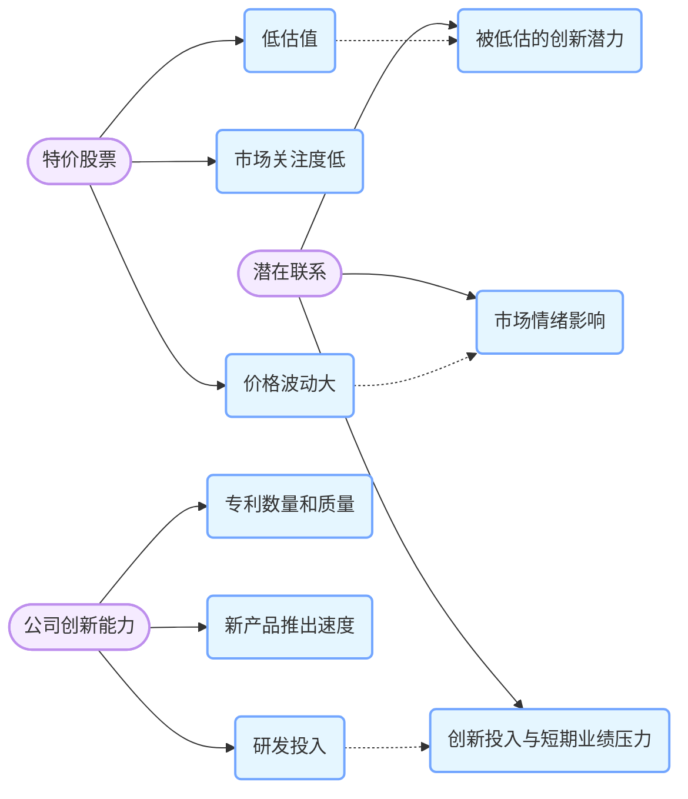

# 特价股票与公司创新能力的潜在关联研究

> 关键词：特价股票、公司创新能力、关联研究、财务指标、创新评估

> 摘要：本文旨在深入探究特价股票与公司创新能力之间的潜在关联。通过对特价股票的定义、特征以及公司创新能力的评估指标进行详细分析，运用数学模型和实际案例研究，揭示两者之间可能存在的联系。同时，介绍了相关的研究方法、工具和资源，最后对未来的发展趋势和挑战进行了总结，并提供了常见问题解答和扩展阅读参考资料，为投资者和研究人员在评估特价股票和公司创新能力时提供有价值的参考。

## 1. 背景介绍 
### 1.1 目的和范围
本研究的主要目的是挖掘特价股票与公司创新能力之间的潜在联系。在金融市场中，特价股票往往因其较低的价格吸引了众多投资者的关注。而公司的创新能力则是其长期发展和竞争力的关键因素。了解两者之间的关联，有助于投资者更全面地评估投资价值，同时也能为公司管理层提供有关创新投入与市场表现之间关系的参考。

本研究的范围涵盖了不同行业的上市公司，通过对其财务数据、创新指标等多方面的分析，试图找出普遍适用的规律和模式。

### 1.2 预期读者
本文的预期读者包括金融投资者、投资分析师、公司管理层、学术研究人员以及对金融市场和公司创新感兴趣的人士。投资者可以借助本文的研究结果优化投资决策，分析师可以将其作为研究报告的参考依据，公司管理层可以从中获取有关创新战略的启示，学术研究人员则可以在此基础上开展更深入的研究。

### 1.3 文档结构概述
本文将按照以下结构展开：首先介绍核心概念，包括特价股票和公司创新能力的定义、特点及相关联系；接着阐述核心算法原理和具体操作步骤，通过 Python 代码进行详细说明；然后介绍数学模型和公式，并结合实际例子进行讲解；随后进行项目实战，展示代码实际案例并详细解释；再探讨实际应用场景；推荐相关的工具和资源；最后总结未来发展趋势与挑战，提供常见问题解答和扩展阅读参考资料。

### 1.4 术语表
#### 1.4.1 核心术语定义
- **特价股票**：指在金融市场中，价格相对其内在价值或行业平均水平较低的股票。通常可以通过一些财务指标，如市盈率、市净率等进行初步判断。
- **公司创新能力**：公司在产品、技术、管理、营销等方面进行创新的能力，包括研发投入、专利数量、新产品推出速度等多个维度的表现。

#### 1.4.2 相关概念解释
- **内在价值**：股票的内在价值是指股票未来现金流的现值，它反映了公司的真实经济价值。通过对公司的财务状况、行业前景、竞争优势等因素的分析，可以估算出股票的内在价值。
- **研发投入**：公司为了开展研究与开发活动而投入的资金，是衡量公司创新意愿和能力的重要指标之一。

#### 1.4.3 缩略词列表
- **PE**：市盈率（Price - Earnings Ratio），是指股票价格除以每股收益的比率，反映了市场对公司盈利的预期。
- **PB**：市净率（Price - Book Ratio），是指股票价格除以每股净资产的比率，用于评估股票的估值水平。
- **R&D**：研究与开发（Research and Development），代表公司在创新方面的投入活动。

## 2. 核心概念与联系 

### 2.1 特价股票的概念与特征
特价股票通常具有以下特征：
- **低估值**：从财务指标来看，其市盈率、市净率等相对较低。例如，一家公司的 PE 低于行业平均水平，可能意味着市场对该公司的盈利预期较低，或者该公司的股价被低估。
- **市场关注度低**：这类股票可能由于公司规模较小、行业知名度不高或近期业绩不佳等原因，受到市场分析师和投资者的关注较少。
- **价格波动大**：由于市场关注度低和信息不对称等因素，特价股票的价格容易受到市场情绪和突发事件的影响，导致价格波动较大。

### 2.2 公司创新能力的评估指标
评估公司创新能力可以从多个维度进行：
- **研发投入**：公司在研发方面的资金投入是创新的基础。研发投入占营业收入的比例越高，通常表示公司对创新的重视程度越高。例如，科技公司往往会将较高比例的收入用于研发。
- **专利数量和质量**：专利是公司创新成果的重要体现。专利数量的增加反映了公司创新活动的活跃程度，而专利的质量，如专利的引用次数、技术领域的重要性等，则更能体现公司创新的核心竞争力。
- **新产品推出速度**：公司能够快速推出新产品，说明其具有较强的创新能力和市场响应能力。新产品的市场占有率和销售额增长情况也是评估创新效果的重要指标。

### 2.3 特价股票与公司创新能力的潜在联系
特价股票与公司创新能力之间可能存在以下潜在联系：
- **被低估的创新潜力**：一些公司可能具有较强的创新能力，但由于市场对其了解不足或短期业绩不佳，导致其股票价格被低估，成为特价股票。一旦公司的创新成果得到市场认可，股价可能会大幅上涨。
- **创新投入与短期业绩压力**：公司在进行大规模创新投入时，可能会对短期业绩产生一定的压力，导致股价下跌，形成特价股票。但从长期来看，创新投入可能会为公司带来巨大的竞争优势和盈利增长。
- **市场情绪影响**：市场情绪往往会过度反应公司的短期表现。如果一家公司在创新过程中遇到暂时的困难，市场可能会过度悲观，导致其股票价格大幅下跌成为特价股票。而实际上，公司的创新能力并未受到根本影响。

### 2.4 核心概念原理和架构的文本示意图
```plaintext
特价股票
|-- 低估值
|   |-- 低市盈率
|   |-- 低市净率
|-- 市场关注度低
|-- 价格波动大

公司创新能力
|-- 研发投入
|   |-- 研发投入占比
|-- 专利数量和质量
|   |-- 专利数量
|   |-- 专利引用次数
|-- 新产品推出速度
|   |-- 新产品上市时间
|   |-- 新产品市场占有率

潜在联系
|-- 被低估的创新潜力
|-- 创新投入与短期业绩压力
|-- 市场情绪影响
```

### 2.5 Mermaid 流程图


## 3. 核心算法原理 & 具体操作步骤 

### 3.1 特价股票筛选算法原理
我们可以通过以下步骤筛选特价股票：
1. **获取股票的财务数据**：包括市盈率（PE）、市净率（PB）等。
2. **计算行业平均财务指标**：对同一行业的所有股票的财务指标进行平均计算。
3. **筛选低估值股票**：选择 PE 和 PB 低于行业平均水平的股票作为特价股票的候选。

以下是使用 Python 实现的示例代码：
```python
import pandas as pd

# 模拟获取股票财务数据
def get_stock_financial_data():
    data = {
        'stock_code': ['000001', '000002', '000003', '000004'],
        'industry': ['Technology', 'Technology', 'Finance', 'Finance'],
        'PE': [10, 15, 8, 12],
        'PB': [1.2, 1.5, 0.8, 1.1]
    }
    df = pd.DataFrame(data)
    return df

# 计算行业平均财务指标
def calculate_industry_avg(df):
    industry_avg = df.groupby('industry')[['PE', 'PB']].mean()
    return industry_avg

# 筛选特价股票
def select_bargain_stocks(df, industry_avg):
    bargain_stocks = []
    for index, row in df.iterrows():
        industry = row['industry']
        pe = row['PE']
        pb = row['PB']
        industry_pe_avg = industry_avg.loc[industry, 'PE']
        industry_pb_avg = industry_avg.loc[industry, 'PB']
        if pe < industry_pe_avg and pb < industry_pb_avg:
            bargain_stocks.append(row['stock_code'])
    return bargain_stocks

# 主函数
def main():
    df = get_stock_financial_data()
    industry_avg = calculate_industry_avg(df)
    bargain_stocks = select_bargain_stocks(df, industry_avg)
    print("特价股票代码：", bargain_stocks)

if __name__ == "__main__":
    main()
```

### 3.2 公司创新能力评估算法原理
评估公司创新能力可以综合考虑研发投入、专利数量和新产品推出速度等指标。我们可以为每个指标分配一定的权重，然后计算综合得分。

以下是使用 Python 实现的示例代码：
```python
import pandas as pd

# 模拟获取公司创新数据
def get_company_innovation_data():
    data = {
        'company_code': ['000001', '000002', '000003', '000004'],
        'R&D_ratio': [0.1, 0.15, 0.08, 0.12],
        'patent_count': [10, 20, 5, 15],
        'new_product_speed': [3, 2, 4, 3]
    }
    df = pd.DataFrame(data)
    return df

# 计算公司创新能力综合得分
def calculate_innovation_score(df):
    # 为每个指标分配权重
    weights = {
        'R&D_ratio': 0.4,
        'patent_count': 0.3,
        'new_product_speed': 0.3
    }
    df['innovation_score'] = (
        df['R&D_ratio'] * weights['R&D_ratio'] +
        df['patent_count'] * weights['patent_count'] +
        df['new_product_speed'] * weights['new_product_speed']
    )
    return df

# 主函数
def main():
    df = get_company_innovation_data()
    df = calculate_innovation_score(df)
    print("公司创新能力综合得分：")
    print(df[['company_code', 'innovation_score']])

if __name__ == "__main__":
    main()
```

### 3.3 分析特价股票与公司创新能力关联的算法原理
为了分析特价股票与公司创新能力之间的关联，我们可以将特价股票筛选结果和公司创新能力评估结果进行匹配，然后计算两者之间的相关性。

以下是使用 Python 实现的示例代码：
```python
import pandas as pd
import numpy as np

# 假设我们已经有了特价股票列表和公司创新能力得分数据
bargain_stocks = ['000001', '000003']
innovation_scores = {
    '000001': 70,
    '000002': 80,
    '000003': 60,
    '000004': 75
}

# 提取特价股票的创新能力得分
bargain_innovation_scores = [innovation_scores[stock] for stock in bargain_stocks if stock in innovation_scores]

# 计算平均创新能力得分
average_innovation_score = np.mean(bargain_innovation_scores)

print("特价股票的平均创新能力得分：", average_innovation_score)
```

## 4. 数学模型和公式 & 详细讲解 & 举例说明 

### 4.1 特价股票筛选的数学模型
#### 公式
设某股票的市盈率为 $PE_i$，市净率为 $PB_i$，所在行业的平均市盈率为 $\overline{PE}$，平均市净率为 $\overline{PB}$。若满足以下条件，则该股票为特价股票候选：
$$
\begin{cases}
PE_i < \overline{PE} \\
PB_i < \overline{PB}
\end{cases}
$$

#### 详细讲解
市盈率反映了市场对公司盈利的预期，市净率则体现了股票价格与公司净资产的关系。当股票的市盈率和市净率都低于行业平均水平时，说明该股票相对行业内其他股票可能被低估，具有成为特价股票的潜力。

#### 举例说明
假设某行业的平均市盈率 $\overline{PE} = 15$，平均市净率 $\overline{PB} = 1.5$。有一家公司的市盈率 $PE_i = 10$，市净率 $PB_i = 1.2$。由于 $10 < 15$ 且 $1.2 < 1.5$，该公司的股票符合特价股票的筛选条件。

### 4.2 公司创新能力评估的数学模型
#### 公式
设公司的研发投入占比为 $R_i$，专利数量为 $P_i$，新产品推出速度为 $N_i$，对应的权重分别为 $w_R$、$w_P$、$w_N$，则公司的创新能力综合得分 $S_i$ 为：
$$
S_i = w_R \times R_i + w_P \times P_i + w_N \times N_i
$$

#### 详细讲解
该公式通过加权求和的方式综合考虑了研发投入、专利数量和新产品推出速度三个指标。权重的分配根据各个指标在评估创新能力中的重要程度来确定。研发投入是创新的基础，专利数量体现了创新成果，新产品推出速度反映了创新的市场转化能力。

#### 举例说明
假设某公司的研发投入占比 $R_i = 0.1$，专利数量 $P_i = 10$，新产品推出速度 $N_i = 3$，权重分别为 $w_R = 0.4$，$w_P = 0.3$，$w_N = 0.3$。则该公司的创新能力综合得分 $S_i$ 为：
$$
\begin{align*}
S_i &= 0.4 \times 0.1 + 0.3 \times 10 + 0.3 \times 3 \\
&= 0.04 + 3 + 0.9 \\
&= 3.94
\end{align*}
$$

### 4.3 相关性分析的数学模型
#### 公式
设特价股票的创新能力得分集合为 $X = \{x_1, x_2, \cdots, x_n\}$，非特价股票的创新能力得分集合为 $Y = \{y_1, y_2, \cdots, y_m\}$。可以使用皮尔逊相关系数 $r$ 来衡量两者之间的相关性：
$$
r = \frac{\sum_{i = 1}^{n}(x_i - \overline{x})(y_i - \overline{y})}{\sqrt{\sum_{i = 1}^{n}(x_i - \overline{x})^2 \sum_{i = 1}^{m}(y_i - \overline{y})^2}}
$$
其中，$\overline{x}$ 和 $\overline{y}$ 分别是 $X$ 和 $Y$ 的平均值。

#### 详细讲解
皮尔逊相关系数 $r$ 的取值范围为 $[-1, 1]$。当 $r > 0$ 时，表示两者正相关，即特价股票的创新能力得分越高，非特价股票的创新能力得分也越高；当 $r < 0$ 时，表示两者负相关；当 $r = 0$ 时，表示两者不相关。

#### 举例说明
假设特价股票的创新能力得分集合 $X = \{70, 60\}$，非特价股票的创新能力得分集合 $Y = \{80, 75\}$。
首先计算平均值：
$\overline{x} = \frac{70 + 60}{2} = 65$，$\overline{y} = \frac{80 + 75}{2} = 77.5$
然后计算分子和分母：
分子：
$$
\begin{align*}
&(70 - 65)(80 - 77.5) + (60 - 65)(75 - 77.5) \\
=& 5 \times 2.5 + (-5) \times (-2.5) \\
=& 12.5 + 12.5 \\
=& 25
\end{align*}
$$
分母：
$$
\begin{align*}
&\sqrt{((70 - 65)^2 + (60 - 65)^2) \times ((80 - 77.5)^2 + (75 - 77.5)^2)} \\
=&\sqrt{(25 + 25) \times (6.25 + 6.25)} \\
=&\sqrt{50 \times 12.5} \\
=&\sqrt{625} \\
=& 25
\end{align*}
$$
则皮尔逊相关系数 $r = \frac{25}{25} = 1$，表示特价股票和非特价股票的创新能力得分完全正相关。

## 5. 项目实战：代码实际案例和详细解释说明 

### 5.1  开发环境搭建
#### 编程语言和版本
本项目使用 Python 3.8 及以上版本进行开发。Python 是一种功能强大、易于学习的编程语言，拥有丰富的库和工具，适合进行数据处理、分析和可视化。

#### 安装必要的库
在项目中，我们需要使用以下库：
- **pandas**：用于数据处理和分析。
- **numpy**：用于数值计算。
- **matplotlib**：用于数据可视化。

可以使用以下命令安装这些库：
```sh
pip install pandas numpy matplotlib
```

### 5.2  源代码详细实现和代码解读
#### 数据获取与预处理
```python
import pandas as pd

# 模拟从文件中读取股票财务数据和公司创新数据
def read_stock_data(file_path):
    df = pd.read_csv(file_path)
    return df

# 数据预处理，处理缺失值和异常值
def preprocess_data(df):
    # 填充缺失值
    df = df.fillna(df.mean())
    # 去除异常值（假设 PE 和 PB 大于 100 为异常值）
    df = df[(df['PE'] < 100) & (df['PB'] < 100)]
    return df

# 主函数
def main():
    stock_financial_data = read_stock_data('stock_financial_data.csv')
    company_innovation_data = read_stock_data('company_innovation_data.csv')
    stock_financial_data = preprocess_data(stock_financial_data)
    company_innovation_data = preprocess_data(company_innovation_data)
    print("股票财务数据：")
    print(stock_financial_data)
    print("公司创新数据：")
    print(company_innovation_data)

if __name__ == "__main__":
    main()
```
代码解读：
- `read_stock_data` 函数用于从 CSV 文件中读取股票财务数据和公司创新数据。
- `preprocess_data` 函数对数据进行预处理，包括填充缺失值和去除异常值。填充缺失值使用平均值填充，去除异常值通过筛选条件过滤掉 PE 和 PB 大于 100 的数据。

#### 特价股票筛选
```python
import pandas as pd

# 计算行业平均财务指标
def calculate_industry_avg(df):
    industry_avg = df.groupby('industry')[['PE', 'PB']].mean()
    return industry_avg

# 筛选特价股票
def select_bargain_stocks(df, industry_avg):
    bargain_stocks = []
    for index, row in df.iterrows():
        industry = row['industry']
        pe = row['PE']
        pb = row['PB']
        industry_pe_avg = industry_avg.loc[industry, 'PE']
        industry_pb_avg = industry_avg.loc[industry, 'PB']
        if pe < industry_pe_avg and pb < industry_pb_avg:
            bargain_stocks.append(row['stock_code'])
    return bargain_stocks

# 主函数
def main():
    stock_financial_data = pd.read_csv('stock_financial_data.csv')
    industry_avg = calculate_industry_avg(stock_financial_data)
    bargain_stocks = select_bargain_stocks(stock_financial_data, industry_avg)
    print("特价股票代码：", bargain_stocks)

if __name__ == "__main__":
    main()
```
代码解读：
- `calculate_industry_avg` 函数使用 `groupby` 方法按行业分组，计算每个行业的平均 PE 和 PB。
- `select_bargain_stocks` 函数遍历每只股票，比较其 PE 和 PB 与所在行业的平均水平，若都低于平均水平，则将其股票代码添加到特价股票列表中。

#### 公司创新能力评估
```python
import pandas as pd

# 计算公司创新能力综合得分
def calculate_innovation_score(df):
    # 为每个指标分配权重
    weights = {
        'R&D_ratio': 0.4,
        'patent_count': 0.3,
        'new_product_speed': 0.3
    }
    df['innovation_score'] = (
        df['R&D_ratio'] * weights['R&D_ratio'] +
        df['patent_count'] * weights['patent_count'] +
        df['new_product_speed'] * weights['new_product_speed']
    )
    return df

# 主函数
def main():
    company_innovation_data = pd.read_csv('company_innovation_data.csv')
    company_innovation_data = calculate_innovation_score(company_innovation_data)
    print("公司创新能力综合得分：")
    print(company_innovation_data[['company_code', 'innovation_score']])

if __name__ == "__main__":
    main()
```
代码解读：
- `calculate_innovation_score` 函数根据前面介绍的公式，为每个指标分配权重，计算公司的创新能力综合得分，并将结果添加到数据框中。

#### 关联分析
```python
import pandas as pd
import numpy as np

# 假设我们已经有了特价股票列表和公司创新能力得分数据
bargain_stocks = ['000001', '000003']
company_innovation_data = pd.read_csv('company_innovation_data.csv')
company_innovation_data = calculate_innovation_score(company_innovation_data)

# 提取特价股票的创新能力得分
bargain_innovation_scores = company_innovation_data[company_innovation_data['company_code'].isin(bargain_stocks)]['innovation_score']
non_bargain_innovation_scores = company_innovation_data[~company_innovation_data['company_code'].isin(bargain_stocks)]['innovation_score']

# 计算皮尔逊相关系数
correlation = np.corrcoef(bargain_innovation_scores, non_bargain_innovation_scores)[0, 1]
print("特价股票与非特价股票创新能力得分的皮尔逊相关系数：", correlation)
```
代码解读：
- 首先假设已经有了特价股票列表和公司创新能力得分数据。
- 然后使用 `isin` 方法提取特价股票和非特价股票的创新能力得分。
- 最后使用 `np.corrcoef` 函数计算两者之间的皮尔逊相关系数。

### 5.3  代码解读与分析
#### 数据处理部分
数据处理是整个项目的基础，通过 `preprocess_data` 函数对数据进行填充缺失值和去除异常值的操作，保证了数据的质量。在实际应用中，数据可能存在各种问题，如缺失值、异常值、数据类型不一致等，因此数据预处理是非常重要的步骤。

#### 特价股票筛选部分
通过比较股票的 PE 和 PB 与行业平均水平，筛选出可能被低估的特价股票。这种筛选方法简单直观，但也有一定的局限性，例如没有考虑公司的未来发展潜力、行业前景等因素。

#### 公司创新能力评估部分
综合考虑研发投入、专利数量和新产品推出速度等指标，使用加权求和的方法计算公司的创新能力综合得分。权重的分配可以根据实际情况进行调整，不同的行业和公司可能对各个指标的重视程度不同。

#### 关联分析部分
使用皮尔逊相关系数来衡量特价股票和非特价股票的创新能力得分之间的相关性。皮尔逊相关系数只能衡量线性相关性，对于非线性关系可能不适用。在实际应用中，可以考虑使用其他方法，如 Spearman 相关系数、Kendall 相关系数等。

## 6. 实际应用场景 
### 投资者决策
投资者可以利用本研究的结果，在选择投资标的时，不仅关注股票的价格和估值，还考虑公司的创新能力。如果发现特价股票同时具有较高的创新能力，那么该股票可能具有较大的投资潜力。例如，一家科技公司的股票由于短期业绩不佳而成为特价股票，但该公司在研发方面投入较大，拥有多项专利和快速的新产品推出速度，投资者可以认为该公司具有较强的创新能力，未来可能会有较好的发展前景，从而考虑投资该股票。

### 公司管理层战略规划
公司管理层可以通过分析特价股票与公司创新能力之间的关系，制定合理的战略规划。如果公司的股票被市场低估成为特价股票，但公司具有较强的创新能力，管理层可以加大对创新的宣传和推广力度，提高市场对公司的认知度和认可度，从而提升股票价格。同时，管理层也可以根据创新能力评估结果，优化研发投入和资源分配，提高创新效率和效果。

### 金融机构研究分析
金融机构如证券公司、基金公司等可以利用本研究的方法和结果，进行深入的研究分析。他们可以对不同行业的特价股票和公司创新能力进行全面评估，为客户提供投资建议和研究报告。此外，金融机构还可以通过分析特价股票与公司创新能力的关联，发现市场中的投资机会和风险，优化投资组合。

### 政府政策制定
政府可以根据本研究的结果，制定相关的政策来促进企业的创新和发展。例如，对于具有创新能力但股票被低估的企业，政府可以提供税收优惠、财政补贴等支持政策，鼓励企业加大创新投入，提高市场竞争力。同时，政府也可以加强对金融市场的监管，减少市场的非理性波动，避免企业股票被过度低估。

## 7. 工具和资源推荐
### 7.1 学习资源推荐
#### 7.1.1 书籍推荐
- 《金融市场与金融机构》：这本书全面介绍了金融市场的各种工具和机构，对于理解股票市场和金融投资有很大的帮助。
- 《创新的扩散》：详细阐述了创新在社会中的传播过程和影响因素，有助于深入理解公司创新能力的重要性和发展规律。
- 《Python 数据分析实战》：以实际案例为导向，介绍了如何使用 Python 进行数据处理、分析和可视化，适合学习 Python 数据分析的读者。

#### 7.1.2 在线课程
- Coursera 上的“Financial Markets”课程：由耶鲁大学教授 Robert Shiller 主讲，深入讲解了金融市场的基本原理和投资策略。
- edX 上的“Introduction to Innovation”课程：介绍了创新的概念、方法和实践，帮助学习者了解公司创新的过程和挑战。
- 网易云课堂上的“Python 数据分析入门”课程：系统地介绍了 Python 数据分析的基础知识和常用工具，适合初学者。

#### 7.1.3 技术博客和网站
- 雪球网：国内知名的财经社区，提供股票行情、财经新闻、投资者交流等服务，是获取股票市场信息和投资建议的重要平台。
- 36氪：专注于科技、创新领域的媒体平台，及时报道国内外的创新动态和科技企业的发展情况。
- Medium 上的“Data Science”专栏：汇集了众多数据科学领域的优秀文章，涵盖了数据分析、机器学习、人工智能等方面的内容。

### 7.2 开发工具框架推荐
#### 7.2.1 IDE和编辑器
- PyCharm：一款功能强大的 Python 集成开发环境，提供代码编辑、调试、版本控制等功能，适合专业的 Python 开发者。
- Jupyter Notebook：一个交互式的编程环境，支持多种编程语言，尤其适合数据探索和分析。可以方便地展示代码、图表和文本，便于分享和交流。
- Visual Studio Code：一款轻量级的代码编辑器，支持多种编程语言和插件扩展，具有丰富的功能和良好的用户体验。

#### 7.2.2 调试和性能分析工具
- pdb：Python 自带的调试工具，可以在代码中设置断点，逐步执行代码，查看变量的值和程序的执行流程，帮助开发者定位和解决问题。
- cProfile：Python 的性能分析工具，可以统计程序中各个函数的执行时间和调用次数，帮助开发者找出性能瓶颈，优化代码。
- Py-Spy：一个跨平台的 Python 性能分析工具，可以实时监控 Python 程序的运行情况，生成火焰图，直观地展示程序的性能瓶颈。

#### 7.2.3 相关框架和库
- pandas：用于数据处理和分析的 Python 库，提供了高效的数据结构和数据操作方法，如数据读取、清洗、转换、统计分析等。
- numpy：用于数值计算的 Python 库，提供了多维数组对象和各种数学函数，是许多科学计算和数据分析库的基础。
- scikit-learn：一个用于机器学习的 Python 库，提供了丰富的机器学习算法和工具，如分类、回归、聚类、降维等，方便开发者进行数据挖掘和机器学习任务。

### 7.3 相关论文著作推荐
#### 7.3.1 经典论文
- Fama, E. F., & French, K. R. (1992). The cross - section of expected stock returns. The Journal of Finance, 47(2), 427 - 465. 这篇论文提出了著名的 Fama - French 三因子模型，对股票收益率的影响因素进行了深入研究。
- Schumpeter, J. A. (1934). The theory of economic development. Harvard University Press. 约瑟夫·熊彼特在这本书中提出了创新理论，强调了创新在经济发展中的重要作用。

#### 7.3.2 最新研究成果
- 近年来，关于金融科技和企业创新的研究不断涌现。可以通过学术数据库，如 Web of Science、IEEE Xplore、ACM Digital Library 等，搜索相关的最新研究论文，了解该领域的前沿动态。

#### 7.3.3 应用案例分析
- 一些知名的商业案例分析网站，如哈佛商业评论案例库、麦肯锡商业评论案例库等，提供了许多企业创新和金融投资的实际案例分析。通过学习这些案例，可以了解企业在创新和投资决策中的实际操作和经验教训。

## 8. 总结：未来发展趋势与挑战
### 未来发展趋势
#### 数据驱动的投资决策
随着大数据和人工智能技术的不断发展，投资者将越来越依赖数据来进行投资决策。通过收集和分析更多的公司财务数据、创新指标数据以及市场情绪数据等，可以更准确地评估特价股票和公司创新能力之间的关联，从而做出更明智的投资选择。

#### 创新能力评估的多元化
未来对公司创新能力的评估将不再局限于研发投入、专利数量和新产品推出速度等传统指标。还将考虑公司的创新文化、团队创新能力、与外部创新生态系统的合作等因素，构建更加多元化和全面的创新能力评估体系。

#### 金融科技与创新的融合
金融科技的发展将为特价股票与公司创新能力的研究和应用带来新的机遇。例如，区块链技术可以提高数据的安全性和透明度，智能合约可以实现自动化的投资决策和风险管理。同时，创新企业也可以借助金融科技平台获得更多的融资支持和发展机会。

### 挑战
#### 数据质量和可靠性
数据质量是影响研究结果准确性的关键因素。在实际应用中，可能会遇到数据缺失、错误、不一致等问题，需要进行复杂的数据清洗和预处理工作。此外，数据的可靠性也需要得到保证，例如专利数据的真实性和有效性、研发投入数据的准确性等。

#### 模型的复杂性和可解释性
为了更准确地描述特价股票与公司创新能力之间的关联，可能需要构建复杂的数学模型和机器学习模型。然而，这些模型往往具有较高的复杂性，难以理解和解释。在实际应用中，需要在模型的准确性和可解释性之间找到平衡。

#### 市场的不确定性和波动性
金融市场具有高度的不确定性和波动性，受到宏观经济环境、政策变化、行业竞争等多种因素的影响。即使通过研究发现了特价股票与公司创新能力之间的关联，也不能保证在未来的市场中这种关联会持续存在。因此，投资者需要具备较强的风险管理能力和应对市场变化的能力。

## 9. 附录：常见问题与解答
### 如何确定特价股票的筛选标准？
特价股票的筛选标准可以根据不同的财务指标和市场情况进行确定。常见的筛选指标包括市盈率、市净率、股息率等。一般来说，可以将股票的这些指标与行业平均水平进行比较，选择低于行业平均水平的股票作为特价股票的候选。同时，还可以结合公司的基本面情况，如盈利能力、偿债能力、发展前景等进行综合判断。

### 公司创新能力评估的权重如何确定？
公司创新能力评估的权重可以根据不同的行业和公司特点进行调整。一般来说，可以通过专家评估、层次分析法、主成分分析法等方法来确定权重。在实际应用中，也可以根据经验和市场情况进行适当的调整。例如，对于科技行业的公司，研发投入和专利数量的权重可以相对较高；对于消费品行业的公司，新产品推出速度的权重可以相对较高。

### 特价股票与公司创新能力之间的关联一定存在吗？
特价股票与公司创新能力之间的关联并不是绝对存在的。市场是复杂多变的，受到多种因素的影响。有些特价股票可能是由于公司基本面不佳、行业竞争激烈等原因导致的，与公司的创新能力无关。因此，在分析两者之间的关联时，需要综合考虑多种因素，并进行深入的研究和分析。

### 如何应用本研究结果进行投资决策？
可以将本研究结果作为投资决策的参考依据之一。在选择投资标的时，首先筛选出特价股票，然后评估这些股票所对应的公司的创新能力。对于同时具有较低估值和较高创新能力的公司，可以进一步研究其基本面情况和发展前景，判断是否具有投资价值。同时，还需要结合自身的投资目标、风险承受能力等因素，制定合理的投资策略。

## 10. 扩展阅读 & 参考资料
### 扩展阅读
- 《聪明的投资者》：本杰明·格雷厄姆的经典著作，介绍了价值投资的理念和方法，对于理解特价股票的投资价值有很大的帮助。
- 《从 0 到 1》：彼得·蒂尔的著作，探讨了创业和创新的本质，对于了解公司创新能力的培养和发展具有启发意义。

### 参考资料
- [Fama, E. F., & French, K. R. (1992). The cross - section of expected stock returns. The Journal of Finance, 47(2), 427 - 465.](https://onlinelibrary.wiley.com/doi/abs/10.1111/j.1540-6261.1992.tb04398.x)
- [Schumpeter, J. A. (1934). The theory of economic development. Harvard University Press.](https://www.hup.harvard.edu/catalog.php?isbn=9780674911023)
- [Python 官方文档](https://docs.python.org/3/)
- [pandas 官方文档](https://pandas.pydata.org/docs/)
- [numpy 官方文档](https://numpy.org/doc/)