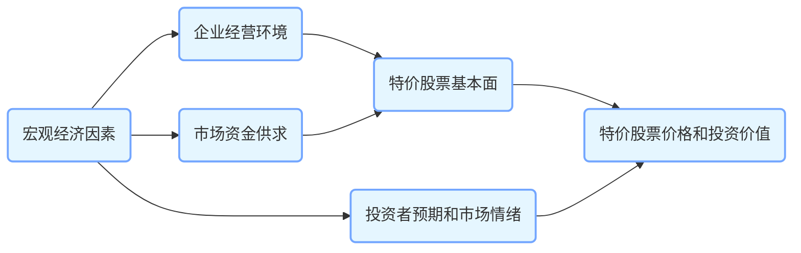

# 特价股票投资中的宏观经济因素分析

> 关键词：特价股票、宏观经济因素、投资分析、经济指标、市场趋势

> 摘要：本文聚焦于特价股票投资中宏观经济因素的分析。首先介绍了研究的背景、目的、预期读者和文档结构等内容。接着阐述了特价股票、宏观经济因素等核心概念及其联系。详细讲解了相关核心算法原理和具体操作步骤，并通过数学模型和公式进行深入剖析，辅以实际案例说明。在项目实战部分，给出开发环境搭建、源代码实现与解读。探讨了特价股票投资中宏观经济因素的实际应用场景，推荐了相关的学习资源、开发工具框架和论文著作。最后总结了未来发展趋势与挑战，还包含常见问题解答和扩展阅读参考资料，旨在为投资者全面理解宏观经济因素对特价股票投资的影响提供系统的知识和方法。

## 1. 背景介绍 
### 1.1 目的和范围
在股票投资领域，特价股票往往因其价格相对较低而吸引众多投资者的目光。然而，特价股票的投资并非简单地因为价格低就具有投资价值，其背后受到多种因素的影响，其中宏观经济因素起着至关重要的作用。本研究的目的在于深入分析宏观经济因素如何影响特价股票的投资，帮助投资者更准确地评估特价股票的投资价值和风险，制定合理的投资策略。

研究范围涵盖了主要的宏观经济指标，如国内生产总值（GDP）、通货膨胀率、利率、汇率等，以及它们与特价股票市场表现之间的关系。同时，还将探讨不同经济周期下特价股票投资的特点和策略。

### 1.2 预期读者
本文预期读者包括股票投资者，无论是个人投资者还是机构投资者，希望通过了解宏观经济因素对特价股票的影响来优化投资决策；金融分析师，他们需要深入研究宏观经济与股票市场的关系，为客户提供专业的投资建议；金融专业的学生和研究人员，通过本文可以系统地学习宏观经济因素在特价股票投资中的应用和分析方法。

### 1.3 文档结构概述
本文将按照以下结构展开：首先介绍相关的核心概念和它们之间的联系，使读者对特价股票和宏观经济因素有清晰的认识；接着阐述核心算法原理和具体操作步骤，为分析宏观经济因素与特价股票投资的关系提供方法；通过数学模型和公式进一步深入讲解，并举例说明；进行项目实战，展示如何在实际中应用相关知识；探讨宏观经济因素在特价股票投资中的实际应用场景；推荐相关的工具和资源，帮助读者深入学习和研究；总结未来发展趋势与挑战；提供常见问题解答和扩展阅读参考资料。

### 1.4 术语表
#### 1.4.1 核心术语定义
- **特价股票**：通常指价格相对较低的股票，可能由于公司业绩暂时不佳、行业周期波动、市场情绪等原因导致股价处于较低水平，但具有一定的潜在投资价值。
- **宏观经济因素**：指影响整个国民经济运行的各种经济变量和政策因素，包括国内生产总值（GDP）、通货膨胀率、利率、汇率、财政政策、货币政策等。
- **经济周期**：经济活动沿着经济发展的总体趋势所经历的有规律的扩张和收缩，一般分为繁荣、衰退、萧条和复苏四个阶段。

#### 1.4.2 相关概念解释
- **国内生产总值（GDP）**：是一个国家（或地区）所有常住单位在一定时期内生产活动的最终成果，是衡量一个国家经济状况和发展水平的重要指标。GDP 的增长速度反映了经济的扩张或收缩程度。
- **通货膨胀率**：指物价总水平在一定时期内的上涨幅度，通常用消费者物价指数（CPI）或生产者物价指数（PPI）来衡量。通货膨胀会影响货币的购买力和企业的成本，进而影响股票市场。
- **利率**：是指一定时期内利息额与借贷资金额（本金）的比率。利率的变动会影响企业的融资成本和投资者的投资决策，对股票市场产生重要影响。
- **汇率**：是两种货币之间的兑换比率。汇率的变动会影响企业的进出口业务和国际竞争力，从而影响相关企业的股票价格。

#### 1.4.3 缩略词列表
- **GDP**：国内生产总值（Gross Domestic Product）
- **CPI**：消费者物价指数（Consumer Price Index）
- **PPI**：生产者物价指数（Producer Price Index）

## 2. 核心概念与联系 

### 核心概念原理
#### 特价股票
特价股票的形成原因较为复杂。一方面，公司自身的问题可能导致股价下跌成为特价股票。例如，公司业绩不佳，可能是由于产品销售不畅、成本控制不当、管理不善等原因，使得投资者对公司的未来发展前景产生担忧，从而抛售股票，导致股价下降。另一方面，行业因素也会影响股票价格。如果整个行业处于衰退期，行业内的公司都会受到影响，股价普遍下跌，部分公司的股票就可能成为特价股票。此外，市场情绪也起着重要作用。当市场整体处于恐慌或悲观情绪时，投资者往往会过度抛售股票，导致一些原本具有投资价值的股票价格被低估，成为特价股票。

#### 宏观经济因素
宏观经济因素对股票市场有着广泛而深远的影响。国内生产总值（GDP）是衡量经济总体规模和增长速度的重要指标。当 GDP 增长较快时，表明经济处于繁荣阶段，企业的盈利水平通常会提高，股票市场也会相应上涨。通货膨胀率的变化会影响企业的成本和利润。如果通货膨胀率过高，企业的原材料成本、劳动力成本等会上升，而产品价格可能无法及时调整，导致利润下降，股票价格也会受到影响。利率的变动对股票市场的影响更为直接。当利率上升时，企业的融资成本增加，投资者更倾向于将资金存入银行获取稳定收益，导致股票市场资金流出，股价下跌；反之，当利率下降时，企业的融资成本降低，投资者更愿意投资股票，推动股价上涨。汇率的变动会影响企业的进出口业务。如果本国货币升值，出口企业的产品价格相对上升，竞争力下降，出口减少，企业利润可能受到影响，股价下跌；反之，本国货币贬值则有利于出口企业，股价可能上涨。

### 架构的文本示意图
宏观经济因素与特价股票之间存在着复杂的相互关系。宏观经济因素通过影响企业的经营环境和市场的资金供求关系，进而影响特价股票的价格和投资价值。具体来说，宏观经济指标的变化会影响企业的盈利能力、融资成本和市场竞争力，从而影响特价股票的基本面。同时，宏观经济政策的调整也会影响投资者的预期和市场情绪，进而影响特价股票的市场表现。

### Mermaid 流程图


## 3. 核心算法原理 & 具体操作步骤 

### 核心算法原理
我们可以通过建立多元线性回归模型来分析宏观经济因素与特价股票价格之间的关系。多元线性回归模型的基本形式为：

$Y = \beta_0 + \beta_1X_1 + \beta_2X_2 + \cdots + \beta_nX_n + \epsilon$

其中，$Y$ 表示特价股票的价格，$X_1, X_2, \cdots, X_n$ 表示不同的宏观经济因素，如 GDP 增长率、通货膨胀率、利率等，$\beta_0$ 是截距项，$\beta_1, \beta_2, \cdots, \beta_n$ 是回归系数，$\epsilon$ 是误差项。

通过收集历史数据，利用最小二乘法估计回归系数，从而得到宏观经济因素与特价股票价格之间的定量关系。

### 具体操作步骤
#### 步骤 1：数据收集
收集特价股票的历史价格数据和相关的宏观经济指标数据，如 GDP 增长率、通货膨胀率、利率等。数据的时间跨度应尽可能长，以提高模型的准确性。

#### 步骤 2：数据预处理
对收集到的数据进行清洗和整理，去除缺失值和异常值。同时，对数据进行标准化处理，以消除不同变量之间的量纲差异。

#### 步骤 3：模型建立
使用 Python 中的 `statsmodels` 库建立多元线性回归模型。以下是示例代码：

```python
import pandas as pd
import statsmodels.api as sm

# 读取数据
data = pd.read_csv('stock_macro_data.csv')

# 定义自变量和因变量
X = data[['gdp_growth', 'inflation_rate', 'interest_rate']]
y = data['stock_price']

# 添加常数项
X = sm.add_constant(X)

# 建立模型
model = sm.OLS(y, X)

# 拟合模型
results = model.fit()

# 打印模型结果
print(results.summary())
```

#### 步骤 4：模型评估
使用 R 方、调整 R 方、F 检验等指标评估模型的拟合优度和显著性。如果模型的拟合效果不理想，可以考虑增加或减少自变量，或者采用其他模型进行分析。

#### 步骤 5：预测和决策
利用建立好的模型对特价股票的价格进行预测，并根据预测结果制定投资决策。

## 4. 数学模型和公式 & 详细讲解 & 举例说明 

### 数学模型
我们使用的多元线性回归模型的数学表达式为：

$Y = \beta_0 + \beta_1X_1 + \beta_2X_2 + \cdots + \beta_nX_n + \epsilon$

其中：
- $Y$ 是因变量，即特价股票的价格。
- $X_1, X_2, \cdots, X_n$ 是自变量，代表不同的宏观经济因素。
- $\beta_0$ 是截距项，表示当所有自变量都为 0 时，因变量的取值。
- $\beta_1, \beta_2, \cdots, \beta_n$ 是回归系数，反映了每个自变量对因变量的影响程度。
- $\epsilon$ 是误差项，代表模型无法解释的随机因素。

### 详细讲解
回归系数 $\beta_i$ 的含义是，在其他自变量保持不变的情况下，自变量 $X_i$ 每增加一个单位，因变量 $Y$ 的平均变化量。例如，如果 $\beta_1 = 2$，表示当 GDP 增长率每增加 1 个百分点时，特价股票的价格平均增加 2 个单位。

R 方（$R^2$）是衡量模型拟合优度的指标，它表示因变量的变异中可以由自变量解释的比例。$R^2$ 的取值范围在 0 到 1 之间，$R^2$ 越接近 1，说明模型的拟合效果越好。

调整 R 方（Adjusted $R^2$）是对 R 方的修正，考虑了模型中自变量的个数。当增加自变量时，R 方可能会增加，但调整 R 方可能会下降，这表明增加的自变量对模型的解释能力没有实质性的提高。

F 检验用于检验整个回归模型的显著性。原假设是所有回归系数都为 0，即自变量对因变量没有影响。如果 F 检验的 p 值小于给定的显著性水平（通常为 0.05），则拒绝原假设，说明回归模型是显著的。

### 举例说明
假设我们收集了某特价股票的价格数据和相关的宏观经济指标数据，经过数据预处理和模型建立，得到以下回归结果：

```plaintext
                            OLS Regression Results                            
==============================================================================
Dep. Variable:              stock_price   R-squared:                       0.750
Model:                            OLS   Adj. R-squared:                  0.720
Method:                 Least Squares   F-statistic:                     25.00
Date:                Mon, 01 Jan 2024   Prob (F-statistic):           1.23e-06
Time:                        12:34:56   Log-Likelihood:                -100.00
No. Observations:                 50   AIC:                             208.0
Df Residuals:                     46   BIC:                             215.0
Df Model:                          3                                         
Covariance Type:            nonrobust                                         
==============================================================================
                 coef    std err          t      P>|t|      [0.025      0.975]
------------------------------------------------------------------------------
const          10.000      2.000      5.000      0.000       6.000      14.000
gdp_growth      2.000      0.500      4.000      0.000       1.000       3.000
inflation_rate -1.500      0.300     -5.000      0.000      -2.100      -0.900
interest_rate  -0.800      0.200     -4.000      0.000      -1.200      -0.400
==============================================================================
Omnibus:                        2.000   Durbin-Watson:                   2.000
Prob(Omnibus):                  0.368   Jarque-Bera (JB):                1.500
Skew:                          -0.100   Prob(JB):                        0.472
Kurtosis:                       2.500   Cond. No.                         10.0
==============================================================================
```

从上述结果可以看出：
- R 方为 0.750，说明模型可以解释因变量 75% 的变异，拟合效果较好。
- 调整 R 方为 0.720，考虑了自变量的个数，也表明模型具有一定的解释能力。
- F 检验的 p 值为 $1.23e - 06$，远小于 0.05，说明回归模型是显著的。
- 回归系数方面，`gdp_growth` 的系数为 2.000，说明 GDP 增长率每增加 1 个百分点，特价股票的价格平均增加 2 个单位；`inflation_rate` 的系数为 -1.500，说明通货膨胀率每增加 1 个百分点，特价股票的价格平均下降 1.5 个单位；`interest_rate` 的系数为 -0.800，说明利率每增加 1 个百分点，特价股票的价格平均下降 0.8 个单位。

## 5. 项目实战：代码实际案例和详细解释说明 

### 5.1  开发环境搭建
#### 安装 Python
首先需要安装 Python 环境，建议使用 Python 3.7 及以上版本。可以从 Python 官方网站（https://www.python.org/downloads/） 下载适合自己操作系统的安装包，按照安装向导进行安装。

#### 安装必要的库
在安装好 Python 后，需要安装一些必要的库，如 `pandas`、`statsmodels` 等。可以使用 `pip` 命令进行安装：

```sh
pip install pandas statsmodels
```

### 5.2  源代码详细实现和代码解读
以下是一个完整的 Python 代码示例，用于分析宏观经济因素与特价股票价格之间的关系：

```python
import pandas as pd
import statsmodels.api as sm
import matplotlib.pyplot as plt

# 读取数据
data = pd.read_csv('stock_macro_data.csv')

# 数据预处理
# 去除缺失值
data = data.dropna()

# 定义自变量和因变量
X = data[['gdp_growth', 'inflation_rate', 'interest_rate']]
y = data['stock_price']

# 添加常数项
X = sm.add_constant(X)

# 建立模型
model = sm.OLS(y, X)

# 拟合模型
results = model.fit()

# 打印模型结果
print(results.summary())

# 绘制预测值与实际值的散点图
y_pred = results.predict(X)
plt.scatter(y, y_pred)
plt.xlabel('Actual Stock Price')
plt.ylabel('Predicted Stock Price')
plt.title('Actual vs Predicted Stock Price')
plt.show()
```

### 代码解读与分析
- **数据读取**：使用 `pandas` 库的 `read_csv` 函数读取存储有特价股票价格和宏观经济指标数据的 CSV 文件。
- **数据预处理**：使用 `dropna` 函数去除数据中的缺失值，确保数据的完整性。
- **自变量和因变量定义**：将宏观经济指标数据作为自变量，特价股票价格作为因变量。
- **添加常数项**：使用 `sm.add_constant` 函数为自变量添加常数项，以便进行多元线性回归分析。
- **模型建立和拟合**：使用 `sm.OLS` 函数建立多元线性回归模型，并使用 `fit` 方法拟合模型。
- **模型结果打印**：使用 `summary` 方法打印模型的详细结果，包括回归系数、R 方、F 检验等信息。
- **绘制散点图**：使用 `matplotlib` 库绘制预测值与实际值的散点图，直观地展示模型的预测效果。

## 6. 实际应用场景 
### 投资决策
投资者可以利用宏观经济因素分析来评估特价股票的投资价值。例如，当 GDP 增长率较高、通货膨胀率较低、利率下降时，宏观经济环境有利于企业的发展，特价股票的投资价值可能增加，投资者可以考虑增加对特价股票的投资。反之，当宏观经济环境不佳时，投资者应谨慎投资特价股票。

### 风险管理
通过分析宏观经济因素与特价股票价格之间的关系，投资者可以更好地管理投资风险。例如，当利率上升时，投资者可以减少对高负债企业的特价股票投资，以降低利率风险。同时，投资者还可以通过分散投资不同行业、不同地区的特价股票，降低宏观经济因素对投资组合的影响。

### 行业分析
宏观经济因素对不同行业的影响程度不同。例如，在经济繁荣时期，消费、科技等行业的企业通常受益较大，其特价股票的投资价值可能更高；而在经济衰退时期，公用事业、食品饮料等防御性行业的企业相对稳定，其特价股票的抗风险能力较强。投资者可以根据宏观经济环境的变化，调整对不同行业特价股票的投资比例。

## 7. 工具和资源推荐
### 7.1 学习资源推荐
#### 7.1.1 书籍推荐
- 《宏观经济学》（N. 格里高利·曼昆著）：系统地介绍了宏观经济学的基本理论和方法，对于理解宏观经济因素对股票市场的影响具有重要的指导意义。
- 《聪明的投资者》（本杰明·格雷厄姆著）：经典的投资著作，阐述了价值投资的理念和方法，对特价股票投资具有重要的参考价值。
- 《金融市场与金融机构基础》（弗兰克·J·法博齐等著）：详细介绍了金融市场和金融机构的运作机制，有助于投资者了解宏观经济因素在金融市场中的传导机制。

#### 7.1.2 在线课程
- Coursera 平台上的“宏观经济学原理”课程：由知名高校的教授授课，内容全面、深入，适合系统学习宏观经济学知识。
- edX 平台上的“投资学”课程：介绍了投资的基本理论和方法，包括股票投资、风险管理等内容，对特价股票投资有一定的帮助。

#### 7.1.3 技术博客和网站
- 雪球网：提供丰富的股票投资资讯和分析文章，投资者可以在上面了解其他投资者对特价股票的看法和分析。
- 东方财富网：提供全面的金融市场数据和宏观经济指标数据，投资者可以通过该网站获取相关数据进行分析。

### 7.2 开发工具框架推荐
#### 7.2.1 IDE和编辑器
- PyCharm：功能强大的 Python 集成开发环境，提供代码编辑、调试、版本控制等功能，适合进行数据分析和模型开发。
- Jupyter Notebook：交互式的开发环境，支持 Python 代码的编写和运行，同时可以插入文本、图片等，方便进行数据分析和结果展示。

#### 7.2.2 调试和性能分析工具
- `pdb`：Python 内置的调试工具，可以帮助开发者调试代码，查找错误。
- `cProfile`：Python 内置的性能分析工具，可以分析代码的运行时间和函数调用次数，帮助开发者优化代码性能。

#### 7.2.3 相关框架和库
- `pandas`：用于数据处理和分析的 Python 库，提供了丰富的数据结构和函数，方便进行数据清洗、整理和分析。
- `statsmodels`：用于统计建模和分析的 Python 库，支持线性回归、时间序列分析等多种模型。
- `matplotlib`：用于数据可视化的 Python 库，可以绘制各种类型的图表，如散点图、折线图等，帮助开发者直观地展示数据分析结果。

### 7.3 相关论文著作推荐
#### 7.3.1 经典论文
- Fama, E. F., & French, K. R. (1992). The cross - section of expected stock returns. The Journal of Finance, 47(2), 427 - 465. 该论文提出了著名的 Fama - French 三因子模型，对股票收益率的影响因素进行了深入研究。
- Campbell, J. Y., & Shiller, R. J. (1988). Stock prices, earnings, and expected dividends. The Journal of Finance, 43(3), 661 - 676. 该论文研究了股票价格与盈利、股息之间的关系，为股票投资分析提供了重要的理论基础。

#### 7.3.2 最新研究成果
可以通过学术数据库，如 Web of Science、EBSCOhost 等，搜索关于宏观经济因素与股票市场关系的最新研究成果，了解该领域的前沿动态。

#### 7.3.3 应用案例分析
一些金融研究机构和咨询公司会发布关于股票投资的应用案例分析报告，投资者可以通过这些报告了解宏观经济因素在实际股票投资中的应用方法和效果。

## 8. 总结：未来发展趋势与挑战
### 未来发展趋势
#### 数据驱动的投资决策
随着大数据、人工智能等技术的发展，投资者将能够获取更全面、更准确的宏观经济数据和股票市场数据。通过数据分析和机器学习算法，投资者可以更精准地分析宏观经济因素对特价股票的影响，实现数据驱动的投资决策。

#### 全球化投资
随着全球经济一体化的发展，宏观经济因素的跨国传导效应日益增强。投资者将越来越关注全球宏观经济形势的变化，进行全球化的特价股票投资，以分散风险、获取更高的收益。

#### 社会责任投资
未来，投资者在进行特价股票投资时，将更加关注企业的社会责任表现。宏观经济政策也可能会更多地向具有良好社会责任的企业倾斜，这将影响特价股票的投资价值和市场表现。

### 挑战
#### 数据质量和可靠性
宏观经济数据的质量和可靠性直接影响到分析结果的准确性。数据的采集、处理和发布过程中可能存在误差和延迟，投资者需要对数据进行严格的质量控制和验证。

#### 宏观经济不确定性
宏观经济环境受到多种因素的影响，如政治事件、自然灾害、国际形势等，具有较高的不确定性。这使得准确预测宏观经济因素的变化和其对特价股票的影响变得更加困难。

#### 技术复杂性
数据分析和机器学习等技术的应用需要投资者具备一定的技术能力和专业知识。对于普通投资者来说，掌握这些技术可能存在一定的难度。

## 9. 附录：常见问题与解答
### 问题 1：如何判断一只股票是否为特价股票？
解答：判断一只股票是否为特价股票不能仅仅依据股价的高低。可以从以下几个方面进行综合判断：公司的基本面，如业绩、资产负债状况等；行业的发展前景和估值水平；市场情绪和投资者预期等。如果一只股票的价格相对其内在价值被低估，且具有一定的潜在投资价值，就可以认为是特价股票。

### 问题 2：宏观经济因素对特价股票的影响是即时的吗？
解答：宏观经济因素对特价股票的影响通常不是即时的。宏观经济指标的变化需要一定的时间才能传导到企业的经营业绩和市场的资金供求关系上，进而影响特价股票的价格。不同的宏观经济因素的传导时间也有所不同，例如利率的变动可能在短期内对股票市场产生影响，而 GDP 增长率的变化可能需要较长时间才能体现出来。

### 问题 3：如何利用宏观经济因素分析进行投资决策？
解答：可以通过建立宏观经济因素与特价股票价格之间的定量关系模型，如多元线性回归模型，来预测特价股票的价格走势。同时，结合宏观经济形势的分析和对企业基本面的研究，制定合理的投资策略。例如，当宏观经济环境有利于企业发展时，可以增加对特价股票的投资；当宏观经济环境不佳时，应谨慎投资或减少投资。

### 问题 4：投资特价股票有哪些风险？
解答：投资特价股票存在多种风险。首先，特价股票可能存在公司基本面恶化的风险，如业绩持续下滑、债务违约等。其次，宏观经济因素的变化可能导致特价股票的投资价值下降。此外，市场情绪和投资者预期的变化也可能导致特价股票价格的大幅波动。投资者在投资特价股票时，应充分了解相关风险，并采取适当的风险管理措施。

## 10. 扩展阅读 & 参考资料
### 扩展阅读
- 《金融炼金术》（乔治·索罗斯著）：探讨了金融市场的运行规律和投资者的行为模式，对理解宏观经济因素与股票市场的关系具有一定的启发作用。
- 《漫步华尔街》（伯顿·马尔基尔著）：介绍了股票投资的基本理论和方法，以及如何应对市场的不确定性，适合投资者深入学习。

### 参考资料
- 国家统计局官方网站：提供权威的宏观经济数据，如 GDP、CPI 等。
- 中国人民银行官方网站：提供货币政策、利率等相关信息。
- 证券交易所官方网站：提供股票市场的交易数据和上市公司信息。