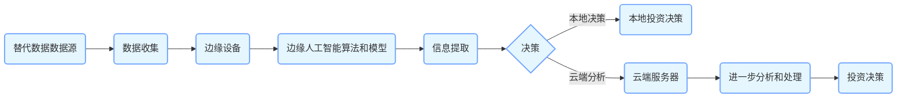

# 特价股票投资中的替代数据分析与边缘人工智能应用

> 关键词：特价股票投资、替代数据、边缘人工智能、数据分析、股票预测

> 摘要：本文聚焦于特价股票投资领域，深入探讨了替代数据分析与边缘人工智能的应用。在当今复杂多变的金融市场中，特价股票投资蕴含着独特的机遇与风险。替代数据作为一种新兴的数据来源，为投资者提供了更全面、更深入的信息视角。边缘人工智能技术则凭借其高效、实时的处理能力，在特价股票投资的决策过程中发挥着关键作用。文章将详细阐述替代数据的概念、来源及分析方法，边缘人工智能的原理与架构，以及如何将二者结合应用于特价股票投资的各个环节，通过实际案例展示其应用效果，并对未来的发展趋势与挑战进行展望。

## 1. 背景介绍 
### 1.1 目的和范围
本研究的主要目的是探索如何利用替代数据分析与边缘人工智能技术提升特价股票投资的决策效率和准确性。特价股票通常是指价格相对较低、被市场低估的股票，这类股票可能具有较大的投资潜力，但同时也伴随着较高的风险。传统的股票分析方法主要依赖于财务报表、宏观经济数据等常规信息，然而这些信息往往具有一定的滞后性和局限性。替代数据的出现为投资者提供了更多元化的信息来源，而边缘人工智能技术则能够对这些数据进行实时、高效的处理和分析，从而帮助投资者更好地把握特价股票的投资机会。

本研究的范围涵盖了替代数据的收集、清洗、分析，边缘人工智能技术的原理、算法和应用，以及如何将二者结合应用于特价股票投资的选股、估值、风险评估等环节。同时，还将通过实际案例分析验证该方法的有效性和可行性。

### 1.2 预期读者
本文的预期读者包括对股票投资感兴趣的个人投资者、金融机构的投资分析师、研究金融科技和人工智能在金融领域应用的学者以及相关领域的技术人员。对于个人投资者来说，本文可以帮助他们了解如何利用先进的技术和数据资源提升自己的投资水平；对于金融机构的投资分析师，本文提供了一种新的投资分析思路和方法；对于学者和技术人员，本文则为他们的研究和实践提供了参考和借鉴。

### 1.3 文档结构概述
本文将按照以下结构进行组织：首先介绍背景信息，包括研究的目的、范围、预期读者和文档结构概述；接着阐述替代数据和边缘人工智能的核心概念与联系，包括其原理、架构和相互关系；然后详细讲解核心算法原理和具体操作步骤，通过 Python 代码进行说明；随后介绍相关的数学模型和公式，并通过举例进行详细讲解；再通过实际项目案例展示替代数据分析与边缘人工智能在特价股票投资中的应用；接着探讨其实际应用场景；之后推荐相关的工具和资源；最后对未来的发展趋势与挑战进行总结，并提供常见问题与解答以及扩展阅读和参考资料。

### 1.4 术语表
#### 1.4.1 核心术语定义
- **特价股票**：指价格相对较低、被市场低估的股票，通常具有一定的投资潜力，但也伴随着较高的风险。
- **替代数据**：指除了传统的财务报表、宏观经济数据等常规信息之外的其他数据来源，如社交媒体数据、卫星图像数据、传感器数据等。
- **边缘人工智能**：指将人工智能算法和模型部署在靠近数据源的边缘设备上，实现数据的实时处理和分析，减少数据传输延迟和带宽需求。
- **股票投资决策**：指投资者根据各种信息和分析方法，对股票的买卖时机、投资金额等进行决策的过程。

#### 1.4.2 相关概念解释
- **数据挖掘**：指从大量的数据中发现有价值的信息和知识的过程，常用的方法包括分类、聚类、关联规则挖掘等。
- **机器学习**：指让计算机通过数据学习模式和规律，从而实现预测和决策的过程，常用的算法包括线性回归、逻辑回归、决策树、神经网络等。
- **深度学习**：指一种基于神经网络的机器学习方法，通过多层神经元的组合和训练，实现对复杂数据的建模和分析。

#### 1.4.3 缩略词列表
- **AI**：Artificial Intelligence，人工智能
- **ML**：Machine Learning，机器学习
- **DL**：Deep Learning，深度学习
- **IoT**：Internet of Things，物联网

## 2. 核心概念与联系 

### 替代数据概念
替代数据是指那些并非传统金融数据来源，但可以为投资决策提供有价值信息的数据。传统金融数据主要包括公司财务报表、宏观经济数据等，这些数据具有一定的局限性，如发布频率低、存在时间滞后等问题。而替代数据则具有更广泛的来源和更高的实时性，能够为投资者提供更全面、更深入的信息视角。

替代数据的来源非常广泛，主要包括以下几类：
- **社交媒体数据**：如 Twitter、Facebook 等社交媒体平台上的用户言论和情绪数据，可以反映市场参与者的情绪和预期。
- **卫星图像数据**：通过卫星图像可以获取企业的生产活动、库存水平等信息，帮助投资者了解企业的实际运营情况。
- **传感器数据**：如交通传感器、气象传感器等数据，可以反映相关行业的运行状况和市场需求。
- **网络搜索数据**：如 Google 搜索指数等数据，可以反映市场参与者对特定主题的关注度和兴趣。

### 边缘人工智能概念
边缘人工智能是指将人工智能算法和模型部署在靠近数据源的边缘设备上，实现数据的实时处理和分析。传统的人工智能应用通常采用云计算的模式，将数据传输到云端进行处理和分析。然而，这种模式存在数据传输延迟、带宽需求大等问题，无法满足一些对实时性要求较高的应用场景。

边缘人工智能的核心优势在于其高效、实时的处理能力。通过将人工智能算法和模型部署在边缘设备上，可以在本地对数据进行处理和分析，减少数据传输延迟和带宽需求，提高系统的响应速度和处理效率。同时，边缘人工智能还可以保护数据隐私和安全，避免数据在传输过程中被泄露和篡改。

### 替代数据与边缘人工智能的联系
替代数据和边缘人工智能在特价股票投资中具有密切的联系。替代数据为边缘人工智能提供了丰富的数据来源，而边缘人工智能则为替代数据的分析和处理提供了强大的技术支持。

一方面，替代数据的多样性和实时性要求高效的数据处理和分析方法。边缘人工智能技术可以在靠近数据源的边缘设备上对替代数据进行实时处理和分析，提取有价值的信息和知识，为投资者提供更及时、更准确的决策支持。

另一方面，边缘人工智能的应用也可以促进替代数据的收集和利用。通过在边缘设备上部署传感器和数据采集设备，可以实时收集各种替代数据，并通过边缘人工智能算法对这些数据进行处理和分析，挖掘其中的潜在价值。

### 核心概念原理和架构的文本示意图
替代数据通过各种数据源（如社交媒体平台、卫星图像系统、传感器网络等）进行收集，然后传输到边缘设备。边缘设备上部署有边缘人工智能算法和模型，对替代数据进行实时处理和分析，提取有价值的信息和特征。这些信息和特征可以通过网络传输到云端服务器，进行进一步的分析和处理，或者直接用于投资决策。

### Mermaid 流程图


## 3. 核心算法原理 & 具体操作步骤 

### 替代数据预处理算法
在对替代数据进行分析之前，需要对其进行预处理，以提高数据的质量和可用性。常见的替代数据预处理算法包括数据清洗、数据集成、数据变换等。

以下是一个使用 Python 实现的数据清洗示例代码：
```python
import pandas as pd

# 读取数据
data = pd.read_csv('alternative_data.csv')

# 处理缺失值
data = data.dropna()  # 删除包含缺失值的行

# 处理重复值
data = data.drop_duplicates()  # 删除重复的行

# 处理异常值
def remove_outliers(data, column):
    q1 = data[column].quantile(0.25)
    q3 = data[column].quantile(0.75)
    iqr = q3 - q1
    lower_bound = q1 - 1.5 * iqr
    upper_bound = q3 + 1.5 * iqr
    data = data[(data[column] >= lower_bound) & (data[column] <= upper_bound)]
    return data

data = remove_outliers(data, 'price')  # 处理价格列的异常值

# 保存处理后的数据
data.to_csv('cleaned_alternative_data.csv', index=False)
```
### 边缘人工智能模型训练算法
在边缘设备上训练人工智能模型需要考虑计算资源和存储资源的限制。常见的边缘人工智能模型包括决策树、随机森林、支持向量机等。

以下是一个使用 Python 和 Scikit-learn 库实现的决策树模型训练示例代码：
```python
from sklearn.tree import DecisionTreeClassifier
from sklearn.model_selection import train_test_split
from sklearn.metrics import accuracy_score
import pandas as pd

# 读取清洗后的数据
data = pd.read_csv('cleaned_alternative_data.csv')

# 划分特征和标签
X = data.drop('label', axis=1)
y = data['label']

# 划分训练集和测试集
X_train, X_test, y_train, y_test = train_test_split(X, y, test_size=0.2, random_state=42)

# 训练决策树模型
model = DecisionTreeClassifier()
model.fit(X_train, y_train)

# 预测
y_pred = model.predict(X_test)

# 评估模型
accuracy = accuracy_score(y_test, y_pred)
print(f"模型准确率: {accuracy}")
```
### 具体操作步骤
1. **数据收集**：通过各种数据源收集替代数据，如社交媒体平台的 API、卫星图像服务提供商、传感器网络等。
2. **数据预处理**：对收集到的替代数据进行清洗、集成、变换等预处理操作，提高数据的质量和可用性。
3. **特征工程**：从预处理后的数据中提取有价值的特征，如统计特征、文本特征、图像特征等。
4. **模型训练**：在边缘设备上选择合适的人工智能模型进行训练，如决策树、随机森林、支持向量机等。
5. **模型评估**：使用测试集对训练好的模型进行评估，计算模型的准确率、召回率、F1 值等指标。
6. **投资决策**：根据模型的预测结果和投资策略，做出投资决策，如买入、卖出、持有等。

## 4. 数学模型和公式 & 详细讲解 & 举例说明 

### 线性回归模型
线性回归是一种常用的机器学习模型，用于预测连续变量的值。其数学模型可以表示为：
$$y = \beta_0 + \beta_1x_1 + \beta_2x_2 + \cdots + \beta_nx_n + \epsilon$$
其中，$y$ 是因变量，$x_1, x_2, \cdots, x_n$ 是自变量，$\beta_0, \beta_1, \beta_2, \cdots, \beta_n$ 是模型的参数，$\epsilon$ 是误差项。

线性回归模型的目标是通过最小化误差项的平方和来估计模型的参数。具体来说，就是要找到一组参数 $\beta_0, \beta_1, \beta_2, \cdots, \beta_n$，使得以下损失函数最小：
$$L(\beta) = \sum_{i=1}^{m}(y_i - \hat{y}_i)^2$$
其中，$m$ 是样本数量，$y_i$ 是第 $i$ 个样本的真实值，$\hat{y}_i$ 是第 $i$ 个样本的预测值。

### 逻辑回归模型
逻辑回归是一种常用的分类模型，用于预测离散变量的值。其数学模型可以表示为：
$$P(y = 1|x) = \frac{1}{1 + e^{-z}}$$
其中，$P(y = 1|x)$ 是给定自变量 $x$ 时，因变量 $y$ 取值为 1 的概率，$z = \beta_0 + \beta_1x_1 + \beta_2x_2 + \cdots + \beta_nx_n$ 是线性组合。

逻辑回归模型的目标是通过最大化似然函数来估计模型的参数。具体来说，就是要找到一组参数 $\beta_0, \beta_1, \beta_2, \cdots, \beta_n$，使得以下似然函数最大：
$$L(\beta) = \prod_{i=1}^{m}P(y_i|x_i)^{y_i}(1 - P(y_i|x_i))^{1 - y_i}$$
其中，$m$ 是样本数量，$y_i$ 是第 $i$ 个样本的真实标签，$P(y_i|x_i)$ 是第 $i$ 个样本的预测概率。

### 举例说明
假设我们要使用线性回归模型预测特价股票的价格。我们收集了一些替代数据，如公司的销售额、利润、市场份额等作为自变量，股票价格作为因变量。

以下是一个使用 Python 和 Scikit-learn 库实现的线性回归模型示例代码：
```python
from sklearn.linear_model import LinearRegression
from sklearn.model_selection import train_test_split
from sklearn.metrics import mean_squared_error
import pandas as pd

# 读取数据
data = pd.read_csv('stock_data.csv')

# 划分特征和标签
X = data.drop('price', axis=1)
y = data['price']

# 划分训练集和测试集
X_train, X_test, y_train, y_test = train_test_split(X, y, test_size=0.2, random_state=42)

# 训练线性回归模型
model = LinearRegression()
model.fit(X_train, y_train)

# 预测
y_pred = model.predict(X_test)

# 评估模型
mse = mean_squared_error(y_test, y_pred)
print(f"均方误差: {mse}")
```
在这个例子中，我们使用线性回归模型对特价股票的价格进行预测，并使用均方误差作为评估指标。通过最小化均方误差，我们可以找到最优的模型参数，从而提高模型的预测准确性。

## 5. 项目实战：代码实际案例和详细解释说明 

### 5.1  开发环境搭建
为了实现替代数据分析与边缘人工智能在特价股票投资中的应用，我们需要搭建相应的开发环境。以下是具体的步骤：

#### 安装 Python
Python 是一种广泛使用的编程语言，在数据科学和人工智能领域有着丰富的库和工具。我们可以从 Python 官方网站（https://www.python.org/downloads/） 下载并安装 Python。

#### 安装必要的库
我们需要安装一些必要的 Python 库，如 Pandas、NumPy、Scikit-learn、Matplotlib 等。可以使用以下命令进行安装：
```sh
pip install pandas numpy scikit-learn matplotlib
```

#### 安装边缘计算设备
如果要在边缘设备上进行开发和测试，需要选择合适的边缘计算设备，如 Raspberry Pi、Jetson Nano 等，并安装相应的操作系统和开发环境。

### 5.2  源代码详细实现和代码解读
以下是一个完整的项目实战代码示例，包括数据收集、数据预处理、模型训练、模型评估和投资决策等环节。

```python
import pandas as pd
from sklearn.tree import DecisionTreeClassifier
from sklearn.model_selection import train_test_split
from sklearn.metrics import accuracy_score

# 数据收集
def collect_data():
    # 模拟从各种数据源收集替代数据
    data = pd.read_csv('alternative_data.csv')
    return data

# 数据预处理
def preprocess_data(data):
    # 处理缺失值
    data = data.dropna()  # 删除包含缺失值的行

    # 处理重复值
    data = data.drop_duplicates()  # 删除重复的行

    # 处理异常值
    def remove_outliers(data, column):
        q1 = data[column].quantile(0.25)
        q3 = data[column].quantile(0.75)
        iqr = q3 - q1
        lower_bound = q1 - 1.5 * iqr
        upper_bound = q3 + 1.5 * iqr
        data = data[(data[column] >= lower_bound) & (data[column] <= upper_bound)]
        return data

    data = remove_outliers(data, 'price')  # 处理价格列的异常值

    return data

# 特征工程
def feature_engineering(data):
    # 提取特征和标签
    X = data.drop('label', axis=1)
    y = data['label']
    return X, y

# 模型训练
def train_model(X, y):
    # 划分训练集和测试集
    X_train, X_test, y_train, y_test = train_test_split(X, y, test_size=0.2, random_state=42)

    # 训练决策树模型
    model = DecisionTreeClassifier()
    model.fit(X_train, y_train)

    # 评估模型
    y_pred = model.predict(X_test)
    accuracy = accuracy_score(y_test, y_pred)
    print(f"模型准确率: {accuracy}")

    return model

# 投资决策
def investment_decision(model, new_data):
    # 预测新数据
    prediction = model.predict(new_data)
    if prediction[0] == 1:
        print("建议买入")
    else:
        print("建议卖出")

# 主函数
def main():
    # 数据收集
    data = collect_data()

    # 数据预处理
    preprocessed_data = preprocess_data(data)

    # 特征工程
    X, y = feature_engineering(preprocessed_data)

    # 模型训练
    model = train_model(X, y)

    # 模拟新数据
    new_data = pd.DataFrame({
        'feature1': [10],
        'feature2': [20],
        'feature3': [30]
    })

    # 投资决策
    investment_decision(model, new_data)

if __name__ == "__main__":
    main()
```
### 5.3  代码解读与分析
1. **数据收集**：`collect_data` 函数模拟从各种数据源收集替代数据，并将其读取为 Pandas DataFrame 对象。
2. **数据预处理**：`preprocess_data` 函数对收集到的替代数据进行清洗、集成、变换等预处理操作，包括处理缺失值、重复值和异常值。
3. **特征工程**：`feature_engineering` 函数从预处理后的数据中提取特征和标签，用于模型训练。
4. **模型训练**：`train_model` 函数使用决策树模型对数据进行训练，并使用测试集对模型进行评估，计算模型的准确率。
5. **投资决策**：`investment_decision` 函数使用训练好的模型对新数据进行预测，并根据预测结果给出投资建议。
6. **主函数**：`main` 函数将上述步骤组合起来，完成整个项目的流程。

通过这个项目实战，我们可以看到如何将替代数据分析与边缘人工智能技术应用于特价股票投资的决策过程中。

## 6. 实际应用场景 
### 选股决策
在特价股票投资中，选股是非常关键的一步。替代数据分析与边缘人工智能技术可以帮助投资者更全面、更准确地了解股票的基本面和市场情况，从而筛选出具有投资潜力的特价股票。

例如，通过分析社交媒体数据可以了解市场参与者对某只股票的情绪和预期，如果大多数人对某只特价股票持乐观态度，那么这只股票可能具有较大的上涨潜力。同时，通过分析卫星图像数据可以了解企业的生产活动和库存水平，如果企业的生产活动活跃、库存水平较低，那么这只股票可能具有较好的业绩表现。

### 估值分析
对特价股票进行准确的估值是投资决策的重要依据。替代数据分析与边缘人工智能技术可以提供更多的信息和视角，帮助投资者更准确地评估股票的价值。

例如，通过分析网络搜索数据可以了解市场参与者对某只股票的关注度和兴趣，如果某只特价股票的搜索指数持续上升，那么这只股票可能被市场低估，具有较高的投资价值。同时，通过分析传感器数据可以了解相关行业的运行状况和市场需求，如果某只特价股票所处的行业前景良好，那么这只股票的估值可能会相应提高。

### 风险评估
在特价股票投资中，风险评估是非常重要的一环。替代数据分析与边缘人工智能技术可以帮助投资者及时发现潜在的风险因素，从而采取相应的风险控制措施。

例如，通过分析社交媒体数据可以了解市场参与者对某只股票的负面评价和担忧，如果某只特价股票的负面情绪较多，那么这只股票可能面临较大的风险。同时，通过分析卫星图像数据可以了解企业的生产安全和环境问题，如果企业存在生产安全隐患或环境问题，那么这只股票的风险可能会相应增加。

### 投资组合优化
替代数据分析与边缘人工智能技术可以帮助投资者优化投资组合，降低投资风险，提高投资收益。

例如，通过分析不同股票之间的相关性和风险收益特征，利用边缘人工智能算法可以构建最优的投资组合。同时，通过实时监测替代数据的变化，及时调整投资组合，以适应市场的变化。

## 7. 工具和资源推荐
### 7.1 学习资源推荐
#### 7.1.1 书籍推荐
- 《Python 数据分析实战》：本书介绍了如何使用 Python 进行数据分析，包括数据清洗、数据可视化、机器学习等内容，适合初学者入门。
- 《机器学习实战》：本书通过实际案例介绍了机器学习的基本算法和应用，包括分类、回归、聚类等，适合有一定编程基础的读者。
- 《深度学习》：本书是深度学习领域的经典著作，介绍了深度学习的基本原理、算法和应用，适合有一定数学基础和编程基础的读者。

#### 7.1.2 在线课程
- Coursera 上的《机器学习》课程：由斯坦福大学的 Andrew Ng 教授主讲，是机器学习领域的经典课程，介绍了机器学习的基本算法和应用。
- edX 上的《深度学习》课程：由微软和伯克利大学联合推出，介绍了深度学习的基本原理、算法和应用。
- Kaggle 上的《数据分析与机器学习微课程》：提供了丰富的数据分析和机器学习实践项目，适合通过实践学习的读者。

#### 7.1.3 技术博客和网站
- Medium：一个技术博客平台，有很多关于数据科学、人工智能和金融科技的文章。
- Towards Data Science：专注于数据科学和机器学习领域的技术博客，提供了很多有价值的文章和教程。
- ArXiv：一个预印本服务器，提供了很多关于人工智能和机器学习的最新研究成果。

### 7.2 开发工具框架推荐
#### 7.2.1 IDE和编辑器
- PyCharm：一款专业的 Python 集成开发环境，提供了丰富的功能和工具，适合开发大型 Python 项目。
- Jupyter Notebook：一个交互式的开发环境，适合进行数据探索和模型实验。
- Visual Studio Code：一款轻量级的代码编辑器，支持多种编程语言和插件，适合快速开发和调试。

#### 7.2.2 调试和性能分析工具
- PDB：Python 自带的调试工具，可以帮助开发者定位和解决代码中的问题。
- cProfile：Python 自带的性能分析工具，可以帮助开发者分析代码的性能瓶颈。
- TensorBoard：TensorFlow 提供的可视化工具，可以帮助开发者可视化模型的训练过程和性能指标。

#### 7.2.3 相关框架和库
- Pandas：一个用于数据处理和分析的 Python 库，提供了丰富的数据结构和函数。
- NumPy：一个用于科学计算的 Python 库，提供了高效的数组操作和数学函数。
- Scikit-learn：一个用于机器学习的 Python 库，提供了丰富的机器学习算法和工具。
- TensorFlow：一个开源的深度学习框架，提供了高效的深度学习模型训练和部署工具。

### 7.3 相关论文著作推荐
#### 7.3.1 经典论文
- 《A Machine Learning Approach to Stock Price Prediction》：介绍了如何使用机器学习算法预测股票价格。
- 《Deep Learning for Financial Applications》：介绍了深度学习在金融领域的应用。
- 《Alternative Data in Investment Management》：介绍了替代数据在投资管理中的应用。

#### 7.3.2 最新研究成果
- 《Edge AI for Real-Time Stock Market Analysis》：介绍了边缘人工智能在实时股票市场分析中的应用。
- 《Using Social Media Data for Stock Price Prediction》：介绍了如何使用社交媒体数据预测股票价格。
- 《Satellite Imagery for Financial Analysis》：介绍了卫星图像数据在金融分析中的应用。

#### 7.3.3 应用案例分析
- 《Case Studies in Alternative Data and AI in Investment》：提供了一些替代数据和人工智能在投资领域的应用案例分析。
- 《Real-World Applications of Edge AI in Finance》：介绍了边缘人工智能在金融领域的实际应用案例。

## 8. 总结：未来发展趋势与挑战
### 未来发展趋势
- **数据来源的多元化**：未来，替代数据的来源将更加多元化，除了现有的社交媒体数据、卫星图像数据、传感器数据等，还将包括更多的非传统数据来源，如物联网设备数据、区块链数据等。这些数据将为投资者提供更全面、更深入的信息视角。
- **边缘人工智能技术的发展**：随着边缘计算技术的不断发展，边缘人工智能技术将越来越成熟。未来，边缘设备将具备更强大的计算能力和存储能力，能够支持更复杂的人工智能算法和模型。同时，边缘人工智能技术将与云计算技术相结合，实现数据的分布式处理和分析。
- **投资决策的智能化**：替代数据分析与边缘人工智能技术的应用将使投资决策更加智能化。未来，投资者将能够利用这些技术实时获取市场信息，进行智能分析和决策，提高投资决策的效率和准确性。
- **跨领域融合**：替代数据分析与边缘人工智能技术将与其他领域的技术进行深度融合，如区块链技术、物联网技术、大数据技术等。这些跨领域的融合将为特价股票投资带来更多的创新和机遇。

### 挑战
- **数据质量和可靠性**：替代数据的质量和可靠性是一个重要的挑战。由于替代数据的来源复杂多样，数据的准确性、完整性和一致性难以保证。因此，需要建立有效的数据质量评估和管理机制，提高替代数据的质量和可靠性。
- **数据隐私和安全**：替代数据中可能包含大量的个人隐私信息和商业机密信息，数据隐私和安全是一个重要的问题。需要采取有效的技术和管理措施，保护数据的隐私和安全，防止数据泄露和滥用。
- **技术复杂度和成本**：边缘人工智能技术的应用需要具备一定的技术能力和资源投入。边缘设备的计算能力和存储能力有限，需要对人工智能算法和模型进行优化和压缩。同时，边缘设备的部署和维护成本也较高，需要考虑成本效益比。
- **法律法规和监管**：替代数据分析与边缘人工智能技术的应用涉及到一系列的法律法规和监管问题。需要建立健全相关的法律法规和监管机制，规范技术的应用和发展，保护投资者的合法权益。

## 9. 附录：常见问题与解答
### 1. 什么是替代数据？
替代数据是指除了传统的财务报表、宏观经济数据等常规信息之外的其他数据来源，如社交媒体数据、卫星图像数据、传感器数据等。

### 2. 什么是边缘人工智能？
边缘人工智能是指将人工智能算法和模型部署在靠近数据源的边缘设备上，实现数据的实时处理和分析，减少数据传输延迟和带宽需求。

### 3. 替代数据和边缘人工智能在特价股票投资中有什么作用？
替代数据可以为投资者提供更全面、更深入的信息视角，帮助投资者更好地了解股票的基本面和市场情况。边缘人工智能技术可以对替代数据进行实时处理和分析，提取有价值的信息和知识，为投资者提供更及时、更准确的决策支持。

### 4. 如何收集替代数据？
替代数据的收集可以通过各种数据源进行，如社交媒体平台的 API、卫星图像服务提供商、传感器网络等。同时，还可以使用网络爬虫技术从互联网上收集相关数据。

### 5. 如何处理替代数据的质量问题？
可以采用数据清洗、数据集成、数据变换等方法处理替代数据的质量问题。例如，删除包含缺失值和重复值的行，处理异常值，对数据进行标准化和归一化等。

### 6. 边缘人工智能模型训练需要注意什么？
在边缘设备上训练人工智能模型需要考虑计算资源和存储资源的限制。可以选择一些轻量级的人工智能模型，如决策树、随机森林、支持向量机等。同时，还可以对模型进行优化和压缩，减少模型的计算量和存储量。

### 7. 替代数据分析与边缘人工智能技术的应用是否会受到法律法规的限制？
替代数据分析与边缘人工智能技术的应用涉及到一系列的法律法规问题，如数据隐私、数据安全、知识产权等。在应用这些技术时，需要遵守相关的法律法规，保护数据的隐私和安全，防止数据泄露和滥用。

## 10. 扩展阅读 & 参考资料
### 扩展阅读
- 《金融科技前沿》：介绍了金融科技领域的最新发展动态和前沿技术。
- 《人工智能与投资》：探讨了人工智能在投资领域的应用和发展趋势。
- 《大数据时代的金融创新》：介绍了大数据技术在金融领域的应用和创新。

### 参考资料
- [1] 《Python 数据分析实战》，作者：[作者姓名]，出版社：[出版社名称]
- [2] 《机器学习实战》，作者：[作者姓名]，出版社：[出版社名称]
- [3] 《深度学习》，作者：[作者姓名]，出版社：[出版社名称]
- [4] 《A Machine Learning Approach to Stock Price Prediction》，作者：[作者姓名]，期刊：[期刊名称]，发表年份：[发表年份]
- [5] 《Deep Learning for Financial Applications》，作者：[作者姓名]，期刊：[期刊名称]，发表年份：[发表年份]
- [6] 《Alternative Data in Investment Management》，作者：[作者姓名]，期刊：[期刊名称]，发表年份：[发表年份]