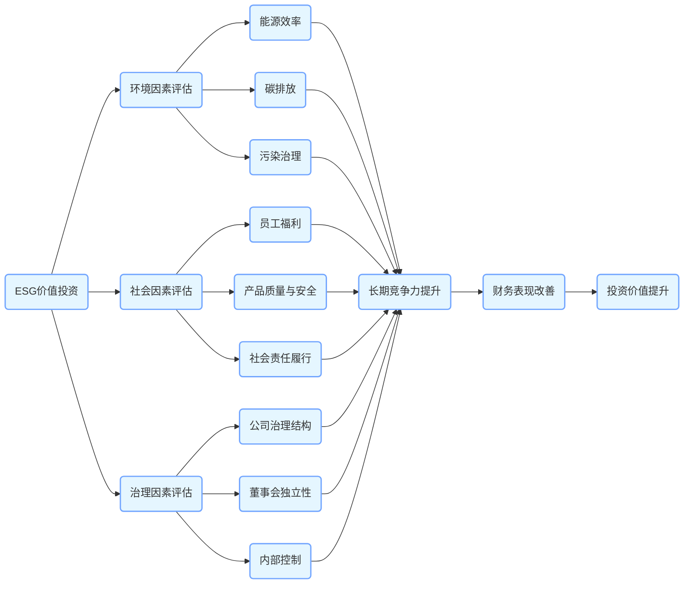

# 珍妮·沙德洛的ESG价值投资：将可持续发展纳入考量

> 关键词：ESG价值投资、珍妮·沙德洛、可持续发展、投资策略、环境社会治理

> 摘要：本文聚焦于珍妮·沙德洛所倡导的ESG价值投资理念，深入探讨将可持续发展纳入投资考量的重要性和具体实践。通过介绍ESG投资的核心概念、算法原理、数学模型，结合项目实战案例和实际应用场景分析，为投资者提供全面的ESG投资指南。同时，推荐相关的学习资源、开发工具和论文著作，最后总结ESG价值投资的未来发展趋势与挑战，并对常见问题进行解答。

## 1. 背景介绍 
### 1.1 目的和范围
随着全球对可持续发展的关注度不断提高，金融市场也在发生深刻变革。ESG（环境、社会和治理）价值投资作为一种新兴的投资理念，逐渐受到投资者的青睐。珍妮·沙德洛在这一领域有着深入的研究和实践经验，本文旨在介绍她的ESG价值投资理念，详细阐述将可持续发展纳入投资考量的具体方法和策略。范围涵盖ESG投资的核心概念、算法原理、数学模型、项目实战以及实际应用场景等方面。

### 1.2 预期读者
本文的预期读者包括对ESG投资感兴趣的投资者、金融从业者、研究人员以及关注可持续发展的相关人士。无论是初学者还是有一定投资经验的专业人士，都能从本文中获取有价值的信息和启示。

### 1.3 文档结构概述
本文将按照以下结构进行阐述：首先介绍ESG投资的核心概念与联系，包括其原理和架构，并通过Mermaid流程图进行直观展示；接着详细讲解核心算法原理和具体操作步骤，使用Python源代码进行说明；然后介绍相关的数学模型和公式，并举例说明；通过项目实战案例，展示ESG投资在实际中的应用；分析ESG投资的实际应用场景；推荐相关的学习资源、开发工具和论文著作；最后总结ESG价值投资的未来发展趋势与挑战，解答常见问题，并提供扩展阅读和参考资料。

### 1.4 术语表
#### 1.4.1 核心术语定义
- **ESG**：即环境（Environmental）、社会（Social）和治理（Governance）的缩写，是一种关注企业在环境保护、社会责任和公司治理方面表现的投资理念和评价标准。
- **ESG价值投资**：将ESG因素纳入投资决策过程，通过评估企业的ESG表现，选择具有可持续发展潜力和长期投资价值的企业进行投资。
- **可持续发展**：指既满足当代人的需求，又不损害后代人满足其需求的能力的发展模式。在投资领域，可持续发展强调企业在经济、环境和社会三个方面的协调发展。

#### 1.4.2 相关概念解释
- **环境因素**：包括企业的能源使用效率、碳排放、污染治理、资源利用等方面。良好的环境表现有助于企业降低环境风险，提高资源利用效率，增强长期竞争力。
- **社会因素**：涉及企业与员工、客户、供应商、社区等利益相关者的关系。例如，企业的员工福利、产品质量与安全、社会责任履行等方面。积极的社会表现可以提升企业的品牌形象和社会认可度。
- **治理因素**：主要关注企业的公司治理结构、董事会独立性、内部控制、信息披露等方面。健全的治理机制有助于保障股东权益，提高企业决策的科学性和透明度。

#### 1.4.3 缩略词列表
- **ESG**：Environmental, Social and Governance
- **ROI**：Return on Investment（投资回报率）

## 2. 核心概念与联系 

### 核心概念原理
ESG价值投资的核心原理是认为企业的可持续发展能力与其财务表现密切相关。通过评估企业在环境、社会和治理方面的表现，可以更全面地了解企业的长期发展潜力和风险状况。具体来说，环境因素反映了企业对自然资源的利用和对环境的影响，良好的环境管理可以降低企业的环境风险，提高资源利用效率，从而提升企业的竞争力。社会因素关注企业与利益相关者的关系，积极履行社会责任可以增强企业的品牌形象和社会认可度，吸引更多的客户和投资者。治理因素则确保企业有健全的决策机制和内部控制体系，保障股东权益，提高企业的运营效率和透明度。

### 架构示意图


从这个架构示意图可以看出，ESG价值投资通过对环境、社会和治理三个方面的因素进行评估，这些因素的良好表现会提升企业的长期竞争力，进而改善企业的财务表现，最终提升企业的投资价值。

## 3. 核心算法原理 & 具体操作步骤 

### 核心算法原理
在ESG价值投资中，我们可以使用多因素评估模型来综合评估企业的ESG表现。该模型将环境、社会和治理三个方面的因素进行量化，并根据其重要性赋予不同的权重，最后计算出企业的ESG综合得分。以下是一个简化的Python代码示例：

```python
# 定义环境、社会和治理因素的权重
weights = {
    'environmental': 0.3,
    'social': 0.3,
    'governance': 0.4
}

# 定义企业的ESG各项得分
company_scores = {
    'environmental': 80,
    'social': 70,
    'governance': 90
}

# 计算ESG综合得分
def calculate_esg_score(weights, scores):
    esg_score = 0
    for factor, weight in weights.items():
        esg_score += weight * scores[factor]
    return esg_score

# 调用函数计算ESG综合得分
esg_score = calculate_esg_score(weights, company_scores)
print(f"该企业的ESG综合得分是: {esg_score}")
```

### 具体操作步骤
1. **数据收集**：收集企业在环境、社会和治理方面的相关数据，这些数据可以来自企业的年报、可持续发展报告、第三方评级机构等。
2. **指标选择**：根据投资目标和重点，选择合适的ESG指标进行评估。例如，环境指标可以包括能源消耗、碳排放等；社会指标可以包括员工满意度、社区贡献等；治理指标可以包括董事会独立性、内部控制等。
3. **数据量化**：将收集到的数据进行量化处理，转化为具体的得分。例如，可以将企业的能源消耗水平与行业平均水平进行比较，根据差异程度给予相应的得分。
4. **权重确定**：根据不同因素的重要性，确定环境、社会和治理因素的权重。权重的确定可以基于专家意见、历史数据或市场趋势等。
5. **综合得分计算**：使用上述的多因素评估模型，根据确定的权重和量化后的得分，计算企业的ESG综合得分。
6. **投资决策**：根据企业的ESG综合得分，结合其他财务和非财务指标，进行投资决策。一般来说，ESG综合得分较高的企业具有更好的可持续发展潜力和投资价值。

## 4. 数学模型和公式 & 详细讲解 & 举例说明 

### 数学模型和公式
在ESG价值投资中，我们使用的多因素评估模型可以用以下公式表示：

$$ ESG_{score} = w_{e} \times E_{score} + w_{s} \times S_{score} + w_{g} \times G_{score} $$

其中：
- $ ESG_{score} $ 表示企业的ESG综合得分；
- $ w_{e} $、$ w_{s} $、$ w_{g} $ 分别表示环境、社会和治理因素的权重，且 $ w_{e} + w_{s} + w_{g} = 1 $；
- $ E_{score} $、$ S_{score} $、$ G_{score} $ 分别表示企业在环境、社会和治理方面的得分。

### 详细讲解
这个公式的核心思想是将企业在不同ESG因素上的表现进行加权求和，得到一个综合的得分。权重的设置反映了不同因素在投资决策中的重要性。例如，如果投资者更关注企业的治理水平，那么可以将治理因素的权重设置得较高。

### 举例说明
假设一家企业在环境方面的得分为75分，社会方面的得分为80分，治理方面的得分为85分，且环境、社会和治理因素的权重分别为0.3、0.3和0.4。则该企业的ESG综合得分可以计算如下：

$$ ESG_{score} = 0.3 \times 75 + 0.3 \times 80 + 0.4 \times 85 $$
$$ = 22.5 + 24 + 34 $$
$$ = 80.5 $$

这意味着该企业的ESG综合表现较好，具有一定的可持续发展潜力和投资价值。

## 5. 项目实战：代码实际案例和详细解释说明 

### 5.1  开发环境搭建
为了实现ESG价值投资的项目实战，我们需要搭建一个Python开发环境。以下是具体的步骤：

1. **安装Python**：从Python官方网站（https://www.python.org/downloads/）下载并安装Python 3.x版本。
2. **安装必要的库**：我们需要安装一些常用的Python库，如`pandas`、`numpy`等。可以使用以下命令进行安装：
```sh
pip install pandas numpy
```

### 5.2  源代码详细实现和代码解读
以下是一个更完整的ESG价值投资项目实战代码示例，包括数据读取、指标计算、综合得分计算和投资决策：

```python
import pandas as pd
import numpy as np

# 读取企业ESG数据
def read_esg_data(file_path):
    data = pd.read_csv(file_path)
    return data

# 计算各项ESG指标得分
def calculate_esg_scores(data):
    # 假设数据中包含环境、社会和治理三个指标列
    environmental_scores = data['environmental']
    social_scores = data['social']
    governance_scores = data['governance']
    return environmental_scores, social_scores, governance_scores

# 定义环境、社会和治理因素的权重
weights = {
    'environmental': 0.3,
    'social': 0.3,
    'governance': 0.4
}

# 计算ESG综合得分
def calculate_esg_score(environmental_scores, social_scores, governance_scores, weights):
    esg_scores = []
    for i in range(len(environmental_scores)):
        esg_score = weights['environmental'] * environmental_scores[i] + \
                    weights['social'] * social_scores[i] + \
                    weights['governance'] * governance_scores[i]
        esg_scores.append(esg_score)
    return esg_scores

# 投资决策
def investment_decision(esg_scores, threshold=80):
    decisions = []
    for score in esg_scores:
        if score >= threshold:
            decisions.append('投资')
        else:
            decisions.append('不投资')
    return decisions

# 主函数
def main():
    file_path = 'esg_data.csv'
    data = read_esg_data(file_path)
    environmental_scores, social_scores, governance_scores = calculate_esg_scores(data)
    esg_scores = calculate_esg_score(environmental_scores, social_scores, governance_scores, weights)
    decisions = investment_decision(esg_scores)
    data['ESG综合得分'] = esg_scores
    data['投资决策'] = decisions
    print(data)

if __name__ == "__main__":
    main()
```

### 代码解读与分析
1. **数据读取**：`read_esg_data`函数用于读取存储企业ESG数据的CSV文件，并将其转换为`pandas`的`DataFrame`对象。
2. **指标计算**：`calculate_esg_scores`函数从`DataFrame`中提取环境、社会和治理三个指标列，并返回对应的得分数组。
3. **综合得分计算**：`calculate_esg_score`函数根据给定的权重，对每个企业的环境、社会和治理得分进行加权求和，得到ESG综合得分。
4. **投资决策**：`investment_decision`函数根据ESG综合得分和设定的阈值，判断是否对该企业进行投资。
5. **主函数**：`main`函数调用上述函数，完成数据读取、指标计算、综合得分计算和投资决策，并将结果添加到`DataFrame`中进行输出。

## 6. 实际应用场景 
### 机构投资者
对于养老基金、保险公司等机构投资者来说，ESG价值投资可以帮助他们降低投资风险，实现长期稳定的回报。通过将ESG因素纳入投资决策过程，机构投资者可以筛选出具有良好可持续发展能力的企业，避免投资那些面临环境、社会和治理风险的企业。例如，一些机构投资者会优先投资那些在环境保护方面表现出色的企业，因为这些企业在未来可能面临更少的环境法规风险，具有更好的长期发展前景。

### 个人投资者
个人投资者也可以通过ESG价值投资来实现自己的投资目标和社会责任。随着人们对可持续发展的关注度不断提高，越来越多的个人投资者希望将自己的投资与自己的价值观相结合。ESG价值投资为个人投资者提供了一个机会，让他们可以投资那些在环境、社会和治理方面表现良好的企业，同时获得合理的投资回报。例如，个人投资者可以选择投资那些致力于减少碳排放、提高员工福利的企业。

### 企业融资
对于企业来说，良好的ESG表现可以吸引更多的投资者，降低融资成本。随着ESG价值投资的兴起，越来越多的投资者将企业的ESG表现作为投资决策的重要因素之一。因此，企业通过改善自身的ESG表现，可以提高自己的市场竞争力，获得更多的融资机会。例如，一些企业通过发布可持续发展报告，展示自己在环境、社会和治理方面的努力和成果，吸引了更多的投资者关注和资金支持。

## 7. 工具和资源推荐
### 7.1 学习资源推荐
#### 7.1.1 书籍推荐
- 《ESG投资：理念、方法与实践》：本书全面介绍了ESG投资的理念、方法和实践案例，适合初学者和有一定经验的投资者阅读。
- 《可持续金融：从理论到实践》：该书深入探讨了可持续金融的理论和实践，包括ESG投资、绿色金融等方面的内容。

#### 7.1.2 在线课程
- Coursera上的“ESG Investing: Principles and Practice”：该课程由知名大学的教授授课，系统介绍了ESG投资的原理和实践。
- edX上的“Sustainable Finance and Investing”：课程涵盖了可持续金融和投资的各个方面，包括ESG评估、绿色债券等。

#### 7.1.3 技术博客和网站
- 晨星（Morningstar）：提供了丰富的ESG研究报告和投资分析工具，帮助投资者了解企业的ESG表现。
- MSCI ESG Research：是全球领先的ESG研究机构，其网站上发布了大量的ESG评级报告和研究成果。

### 7.2 开发工具框架推荐
#### 7.2.1 IDE和编辑器
- PyCharm：是一款专业的Python集成开发环境，具有强大的代码编辑、调试和分析功能，适合开发ESG投资相关的Python项目。
- Jupyter Notebook：是一个交互式的开发环境，支持Python、R等多种编程语言，方便进行数据探索和分析。

#### 7.2.2 调试和性能分析工具
- pdb：是Python自带的调试工具，可以帮助开发者定位代码中的错误和问题。
- cProfile：用于分析Python代码的性能，找出代码中的瓶颈和优化点。

#### 7.2.3 相关框架和库
- pandas：是Python中用于数据处理和分析的强大库，提供了丰富的数据结构和函数，方便进行ESG数据的读取、处理和分析。
- numpy：是Python中用于科学计算的基础库，提供了高效的数组操作和数学函数，可用于ESG指标的计算和分析。

### 7.3 相关论文著作推荐
#### 7.3.1 经典论文
- “Does ESG Matter? Evidence from the Stock Market”：该论文研究了企业的ESG表现与股票市场表现之间的关系，为ESG投资提供了理论支持。
- “ESG and Corporate Financial Performance: Aggregate Evidence from More Than 2000 Empirical Studies”：对超过2000项实证研究进行了综合分析，探讨了ESG与企业财务绩效之间的关系。

#### 7.3.2 最新研究成果
- 近年来，许多学术期刊如《Journal of Sustainable Finance & Investment》《Sustainable Development》等发表了大量关于ESG投资的最新研究成果，投资者可以关注这些期刊获取最新的研究动态。

#### 7.3.3 应用案例分析
- 一些知名的咨询公司如麦肯锡、波士顿咨询等会发布ESG投资的应用案例分析报告，投资者可以通过阅读这些报告了解ESG投资在实际中的应用和效果。

## 8. 总结：未来发展趋势与挑战
### 未来发展趋势
- **市场规模持续扩大**：随着全球对可持续发展的关注度不断提高，ESG价值投资的市场规模有望持续扩大。越来越多的投资者将ESG因素纳入投资决策过程，推动ESG投资产品的不断创新和发展。
- **监管要求不断加强**：各国政府和监管机构对ESG信息披露和投资的监管要求将不断加强。例如，欧盟已经出台了一系列关于ESG信息披露的法规，要求企业更加透明地披露自己的ESG表现。
- **科技应用不断深化**：人工智能、大数据等技术将在ESG投资中得到更广泛的应用。通过这些技术，可以更高效地收集、分析和处理ESG数据，提高投资决策的准确性和效率。

### 挑战
- **数据质量和可比性问题**：目前，ESG数据的质量和可比性存在一定问题。不同企业的ESG信息披露标准和方法不一致，导致数据难以进行有效的比较和分析。
- **投资策略和评估方法有待完善**：虽然已经有一些ESG投资策略和评估方法，但仍需要进一步完善。如何准确地衡量企业的ESG表现，以及如何将ESG因素与投资回报进行有效结合，仍然是一个挑战。
- **投资者教育和意识不足**：部分投资者对ESG价值投资的理念和方法了解不足，缺乏相关的投资经验和知识。因此，需要加强投资者教育，提高投资者对ESG投资的认识和理解。

## 9. 附录：常见问题与解答
### 1. ESG价值投资一定能获得更高的投资回报吗？
ESG价值投资并不一定能保证获得更高的投资回报。虽然一些研究表明，具有良好ESG表现的企业在长期可能具有更好的财务表现，但投资回报还受到多种因素的影响，如市场环境、行业竞争等。ESG价值投资更注重企业的长期可持续发展潜力和风险控制。

### 2. 如何获取企业的ESG数据？
企业的ESG数据可以通过多种渠道获取。常见的渠道包括企业的年报、可持续发展报告、第三方评级机构的报告等。一些金融数据提供商也会提供企业的ESG数据和评级信息。

### 3. ESG投资与传统投资有什么区别？
传统投资主要关注企业的财务指标，如盈利能力、资产负债状况等。而ESG投资在考虑财务指标的基础上，还将企业的环境、社会和治理表现纳入投资决策过程。ESG投资更注重企业的长期可持续发展和社会责任履行。

### 4. 如何评估ESG投资的效果？
评估ESG投资的效果可以从多个方面进行。一方面，可以关注投资组合的财务表现，如投资回报率、风险调整后的收益等。另一方面，可以评估投资组合中企业的ESG表现是否得到改善，以及是否对社会和环境产生了积极的影响。

## 10. 扩展阅读 & 参考资料
### 扩展阅读
- 《绿色金融：推动可持续发展的金融力量》：深入探讨了绿色金融的发展现状和未来趋势，与ESG投资密切相关。
- 《社会责任投资：理念与实践》：介绍了社会责任投资的相关理念和实践案例，为ESG投资提供了更广泛的视角。

### 参考资料
- 相关学术期刊和研究报告，如《Journal of Finance》《Review of Financial Studies》等。
- 国际组织和机构的报告，如联合国环境规划署金融倡议（UNEP FI）发布的相关报告。
- 企业的可持续发展报告和年报，可通过企业官方网站获取。