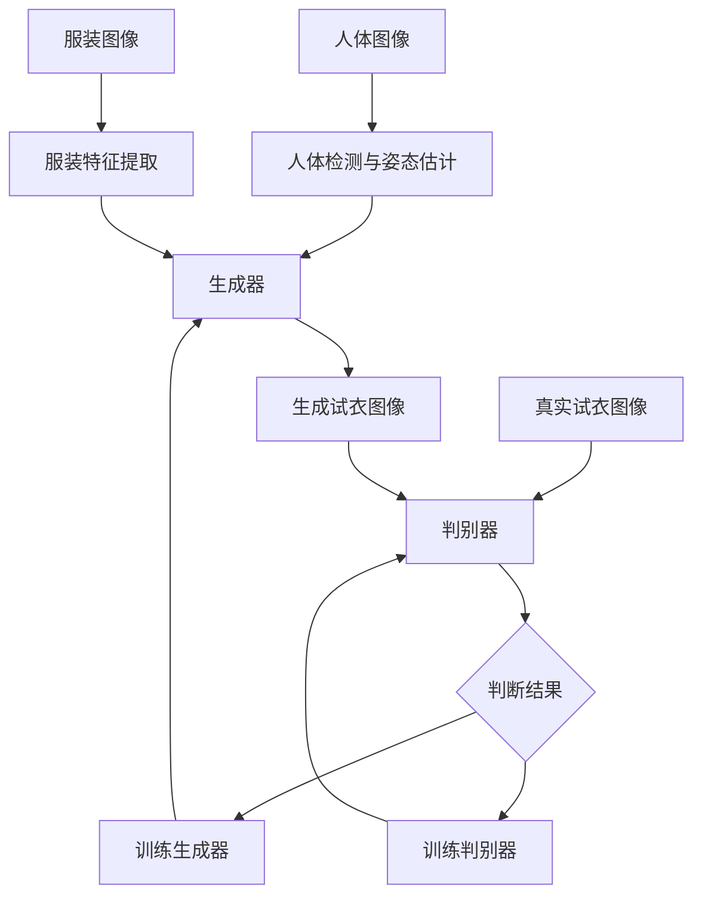

# 生成对抗网络在虚拟试衣系统中的应用

> 关键词：生成对抗网络、虚拟试衣系统、图像生成、深度学习、时尚技术

> 摘要：本文聚焦于生成对抗网络（GAN）在虚拟试衣系统中的应用。首先介绍了虚拟试衣系统的背景和重要性，阐述了生成对抗网络的核心概念与原理。接着详细讲解了相关算法原理及具体操作步骤，通过数学模型和公式深入剖析其工作机制。然后给出项目实战案例，包括开发环境搭建、源代码实现与解读。之后探讨了生成对抗网络在虚拟试衣系统中的实际应用场景。还推荐了相关的学习资源、开发工具框架以及论文著作。最后总结了该领域的未来发展趋势与挑战，并对常见问题进行了解答。旨在全面呈现生成对抗网络在虚拟试衣系统中的应用全貌，为相关领域的研究和实践提供参考。

## 1. 背景介绍 
### 1.1 目的和范围
虚拟试衣系统旨在为用户提供一种便捷、高效且真实的试衣体验，减少实体试衣的时间和精力成本，同时为时尚行业的线上销售和设计提供有力支持。生成对抗网络作为一种强大的深度学习模型，在图像生成、风格迁移等领域取得了显著成果，将其应用于虚拟试衣系统中，可以生成更加逼真、自然的试衣图像，提高虚拟试衣的效果和用户满意度。本文的范围涵盖了生成对抗网络的基本原理、在虚拟试衣系统中的具体应用、相关算法实现、项目实战以及实际应用场景等方面。

### 1.2 预期读者
本文预期读者包括对深度学习、计算机视觉、时尚技术等领域感兴趣的研究人员、工程师、学生以及相关行业的从业者。希望通过本文的介绍，读者能够了解生成对抗网络在虚拟试衣系统中的应用原理和方法，为进一步的研究和实践提供参考。

### 1.3 文档结构概述
本文将按照以下结构进行阐述：首先介绍生成对抗网络和虚拟试衣系统的背景知识；接着详细讲解生成对抗网络的核心概念与联系，包括其原理和架构；然后介绍核心算法原理及具体操作步骤，并给出Python源代码；再通过数学模型和公式深入剖析其工作机制，并举例说明；之后进行项目实战，包括开发环境搭建、源代码实现与解读；探讨生成对抗网络在虚拟试衣系统中的实际应用场景；推荐相关的学习资源、开发工具框架以及论文著作；最后总结该领域的未来发展趋势与挑战，并对常见问题进行解答。

### 1.4 术语表
#### 1.4.1 核心术语定义
- **生成对抗网络（Generative Adversarial Networks，GAN）**：由生成器和判别器两个神经网络组成的深度学习模型，通过对抗训练的方式学习数据的分布，从而生成与真实数据相似的样本。
- **虚拟试衣系统（Virtual Try - on System）**：利用计算机技术模拟用户试穿衣服的过程，为用户提供虚拟试衣的体验。
- **生成器（Generator）**：GAN中的一个神经网络，负责从随机噪声中生成假样本。
- **判别器（Discriminator）**：GAN中的另一个神经网络，负责判断输入的样本是真实样本还是生成器生成的假样本。

#### 1.4.2 相关概念解释
- **对抗训练**：生成器和判别器通过不断对抗的方式进行训练，生成器试图生成更逼真的样本以欺骗判别器，判别器则试图准确区分真实样本和假样本。
- **图像生成**：利用生成对抗网络等技术从随机噪声或其他输入中生成图像。
- **风格迁移**：将一种图像的风格应用到另一种图像上，使目标图像具有源图像的风格。

#### 1.4.3 缩略词列表
- **GAN**：Generative Adversarial Networks（生成对抗网络）
- **CNN**：Convolutional Neural Network（卷积神经网络）
- **RGB**：Red, Green, Blue（红绿蓝，图像的颜色模式）

## 2. 核心概念与联系 
### 2.1 生成对抗网络原理
生成对抗网络由生成器（Generator）和判别器（Discriminator）两个神经网络组成。生成器的输入是随机噪声，它的任务是将随机噪声转换为与真实数据相似的样本。判别器的输入可以是真实样本或生成器生成的假样本，它的任务是判断输入的样本是真实样本还是假样本。在训练过程中，生成器和判别器进行对抗训练，生成器试图生成更逼真的样本以欺骗判别器，判别器则试图准确区分真实样本和假样本。通过不断的对抗训练，生成器和判别器的性能都得到提升，最终生成器可以生成非常逼真的样本。

### 2.2 虚拟试衣系统原理
虚拟试衣系统通常需要完成以下几个主要步骤：人体检测与姿态估计、服装建模、服装与人体的匹配与融合。人体检测与姿态估计用于确定人体的位置和姿态，服装建模用于获取服装的三维模型或二维图像，服装与人体的匹配与融合则将服装图像合理地放置在人体图像上，生成试衣效果。

### 2.3 生成对抗网络与虚拟试衣系统的联系
生成对抗网络可以在虚拟试衣系统的多个环节发挥作用。例如，在服装与人体的匹配与融合环节，生成对抗网络可以学习人体和服装的特征，生成更加自然、逼真的试衣图像。通过对抗训练，生成器可以生成与人体姿态和风格相匹配的服装图像，判别器可以判断生成的试衣图像是否真实合理，从而提高虚拟试衣的效果。

### 2.4 核心概念原理和架构的文本示意图
生成对抗网络在虚拟试衣系统中的应用架构可以描述如下：首先，输入人体图像和服装图像。人体图像经过人体检测与姿态估计模块，得到人体的姿态信息。服装图像经过处理后得到服装的特征信息。然后，将人体姿态信息和服装特征信息输入到生成对抗网络的生成器中，生成器根据这些信息生成试衣图像。生成的试衣图像和真实的试衣图像一起输入到判别器中，判别器判断输入的图像是真实的还是生成的。根据判别器的判断结果，对生成器和判别器进行训练，不断优化生成器的性能，使其生成更加逼真的试衣图像。

### 2.5 Mermaid流程图


## 3. 核心算法原理 & 具体操作步骤 
### 3.1 生成对抗网络核心算法原理
生成对抗网络的核心思想是通过生成器和判别器的对抗训练来学习数据的分布。生成器 $G(z)$ 接受随机噪声 $z$ 作为输入，生成假样本 $G(z)$。判别器 $D(x)$ 接受样本 $x$ 作为输入，输出一个概率值，表示 $x$ 是真实样本的概率。

在训练过程中，生成器和判别器的目标是相互对立的。判别器的目标是最大化正确判断真实样本和假样本的概率，即：
$$\max_{D} V(D, G)=\mathbb{E}_{x\sim p_{data}(x)}[\log D(x)]+\mathbb{E}_{z\sim p_{z}(z)}[\log(1 - D(G(z)))]$$
生成器的目标是最小化判别器正确判断其生成的假样本的概率，即：
$$\min_{G} V(D, G)=\mathbb{E}_{z\sim p_{z}(z)}[\log(1 - D(G(z)))]$$

整个生成对抗网络的训练目标是找到一个纳什均衡，使得生成器和判别器的性能达到最优。

### 3.2 具体操作步骤
#### 3.2.1 数据准备
收集人体图像和服装图像数据集，并进行预处理，包括图像的裁剪、缩放、归一化等操作。同时，将数据集划分为训练集和测试集。

#### 3.2.2 模型定义
定义生成器和判别器的神经网络结构。生成器可以采用卷积神经网络（CNN）的反卷积层来生成图像，判别器可以采用卷积神经网络来判断图像的真实性。

#### 3.2.3 训练过程
1. 初始化生成器和判别器的参数。
2. 循环训练：
    - 训练判别器：从真实数据集中随机选取一批真实样本，同时生成器生成一批假样本。将真实样本和假样本输入到判别器中，计算判别器的损失函数，并更新判别器的参数。
    - 训练生成器：生成器生成一批假样本，将假样本输入到判别器中，计算生成器的损失函数，并更新生成器的参数。
3. 重复步骤2，直到训练收敛。

#### 3.2.4 测试和评估
使用测试集对训练好的生成对抗网络进行测试，评估生成的试衣图像的质量和真实性。可以使用一些指标，如峰值信噪比（PSNR）、结构相似性指数（SSIM）等来评估图像的质量。

### 3.3 Python源代码详细阐述
```python
import torch
import torch.nn as nn
import torch.optim as optim
import torchvision
import torchvision.transforms as transforms
from torch.utils.data import DataLoader

# 定义生成器
class Generator(nn.Module):
    def __init__(self, latent_dim, img_shape):
        super(Generator, self).__init__()
        self.img_shape = img_shape
        self.model = nn.Sequential(
            nn.Linear(latent_dim, 128),
            nn.LeakyReLU(0.2),
            nn.Linear(128, 256),
            nn.BatchNorm1d(256),
            nn.LeakyReLU(0.2),
            nn.Linear(256, 512),
            nn.BatchNorm1d(512),
            nn.LeakyReLU(0.2),
            nn.Linear(512, int(torch.prod(torch.tensor(img_shape)))),
            nn.Tanh()
        )

    def forward(self, z):
        img = self.model(z)
        img = img.view(img.size(0), *self.img_shape)
        return img

# 定义判别器
class Discriminator(nn.Module):
    def __init__(self, img_shape):
        super(Discriminator, self).__init__()
        self.img_shape = img_shape
        self.model = nn.Sequential(
            nn.Linear(int(torch.prod(torch.tensor(img_shape))), 512),
            nn.LeakyReLU(0.2),
            nn.Linear(512, 256),
            nn.LeakyReLU(0.2),
            nn.Linear(256, 1),
            nn.Sigmoid()
        )

    def forward(self, img):
        img_flat = img.view(img.size(0), -1)
        validity = self.model(img_flat)
        return validity

# 超参数设置
latent_dim = 100
img_size = 64
batch_size = 32
epochs = 100
lr = 0.0002

# 数据加载和预处理
transform = transforms.Compose([
    transforms.Resize(img_size),
    transforms.ToTensor(),
    transforms.Normalize([0.5], [0.5])
])

# 假设这里有一个人体和服装图像数据集
# dataset = torchvision.datasets.YourDataset(root='./data', transform=transform)
# dataloader = DataLoader(dataset, batch_size=batch_size, shuffle=True)

# 初始化生成器和判别器
generator = Generator(latent_dim, (3, img_size, img_size))
discriminator = Discriminator((3, img_size, img_size))

# 定义损失函数和优化器
criterion = nn.BCELoss()
optimizer_G = optim.Adam(generator.parameters(), lr=lr)
optimizer_D = optim.Adam(discriminator.parameters(), lr=lr)

# 训练过程
for epoch in range(epochs):
    for i, real_images in enumerate(dataloader):
        # 训练判别器
        optimizer_D.zero_grad()

        # 真实样本
        real_labels = torch.ones((real_images.size(0), 1))
        real_output = discriminator(real_images)
        d_real_loss = criterion(real_output, real_labels)

        # 生成假样本
        z = torch.randn((real_images.size(0), latent_dim))
        fake_images = generator(z)
        fake_labels = torch.zeros((fake_images.size(0), 1))
        fake_output = discriminator(fake_images.detach())
        d_fake_loss = criterion(fake_output, fake_labels)

        # 判别器总损失
        d_loss = d_real_loss + d_fake_loss
        d_loss.backward()
        optimizer_D.step()

        # 训练生成器
        optimizer_G.zero_grad()
        fake_labels = torch.ones((fake_images.size(0), 1))
        fake_output = discriminator(fake_images)
        g_loss = criterion(fake_output, fake_labels)
        g_loss.backward()
        optimizer_G.step()

    print(f'Epoch [{epoch + 1}/{epochs}], D_loss: {d_loss.item()}, G_loss: {g_loss.item()}')
```

## 4. 数学模型和公式 & 详细讲解 & 举例说明 
### 4.1 生成对抗网络的数学模型
生成对抗网络的数学模型主要基于博弈论中的纳什均衡概念。生成器和判别器的目标可以表示为一个二人零和博弈。

判别器的目标函数 $V(D, G)$ 可以展开为：
$$V(D, G)=\int_{x} p_{data}(x)\log D(x)dx+\int_{z} p_{z}(z)\log(1 - D(G(z)))dz$$
其中，$p_{data}(x)$ 是真实数据的分布，$p_{z}(z)$ 是随机噪声的分布。

生成器的目标函数是最小化 $V(D, G)$ 关于 $G$ 的值。

### 4.2 详细讲解
#### 4.2.1 判别器的训练
判别器的目标是最大化正确判断真实样本和假样本的概率。对于真实样本 $x$，判别器希望 $D(x)$ 接近 1；对于生成器生成的假样本 $G(z)$，判别器希望 $D(G(z))$ 接近 0。因此，判别器的损失函数可以表示为：
$$L_D = -\mathbb{E}_{x\sim p_{data}(x)}[\log D(x)]-\mathbb{E}_{z\sim p_{z}(z)}[\log(1 - D(G(z)))]$$
通过最小化 $L_D$ 来更新判别器的参数。

#### 4.2.2 生成器的训练
生成器的目标是最小化判别器正确判断其生成的假样本的概率。即生成器希望 $D(G(z))$ 接近 1。生成器的损失函数可以表示为：
$$L_G = -\mathbb{E}_{z\sim p_{z}(z)}[\log D(G(z))]$$
通过最小化 $L_G$ 来更新生成器的参数。

### 4.3 举例说明
假设我们有一个简单的一维数据集，真实数据的分布是一个高斯分布 $p_{data}(x)\sim\mathcal{N}(0, 1)$。随机噪声的分布是一个均匀分布 $p_{z}(z)\sim U(-1, 1)$。

生成器 $G(z)$ 是一个简单的线性函数 $G(z)=a\times z + b$，判别器 $D(x)$ 是一个逻辑斯蒂函数 $D(x)=\frac{1}{1 + e^{-c\times x + d}}$。

在训练过程中，判别器试图区分真实的高斯分布样本和生成器生成的样本，生成器试图生成与高斯分布相似的样本。通过不断的对抗训练，生成器的参数 $a$ 和 $b$ 以及判别器的参数 $c$ 和 $d$ 会不断更新，最终生成器可以生成接近高斯分布的样本。

### 4.4 数学模型在虚拟试衣系统中的应用
在虚拟试衣系统中，真实数据是真实的试衣图像，随机噪声可以是人体姿态信息和服装特征信息的组合。生成器根据这些信息生成试衣图像，判别器判断生成的试衣图像是否真实。通过上述的数学模型和训练方法，可以不断优化生成器和判别器的性能，生成更加逼真的试衣图像。

## 5. 项目实战：代码实际案例和详细解释说明 
### 5.1  开发环境搭建
#### 5.1.1 操作系统
推荐使用Linux系统，如Ubuntu 18.04或更高版本，也可以使用Windows 10或macOS。

#### 5.1.2 编程语言和框架
- **Python**：推荐使用Python 3.7或更高版本。
- **PyTorch**：深度学习框架，用于构建和训练生成对抗网络。可以使用以下命令安装：
```sh
pip install torch torchvision
```
- **NumPy**：用于数值计算。安装命令：
```sh
pip install numpy
```
- **Matplotlib**：用于图像可视化。安装命令：
```sh
pip install matplotlib
```

#### 5.1.3 硬件要求
如果有条件，建议使用GPU进行训练，以提高训练速度。可以安装CUDA和cuDNN来支持GPU加速。

### 5.2  源代码详细实现和代码解读
```python
import torch
import torch.nn as nn
import torch.optim as optim
import torchvision
import torchvision.transforms as transforms
from torch.utils.data import DataLoader
import matplotlib.pyplot as plt
import numpy as np

# 定义生成器
class Generator(nn.Module):
    def __init__(self, latent_dim, img_shape):
        super(Generator, self).__init__()
        self.img_shape = img_shape
        self.model = nn.Sequential(
            nn.Linear(latent_dim, 128),
            nn.LeakyReLU(0.2),
            nn.Linear(128, 256),
            nn.BatchNorm1d(256),
            nn.LeakyReLU(0.2),
            nn.Linear(256, 512),
            nn.BatchNorm1d(512),
            nn.LeakyReLU(0.2),
            nn.Linear(512, int(torch.prod(torch.tensor(img_shape)))),
            nn.Tanh()
        )

    def forward(self, z):
        img = self.model(z)
        img = img.view(img.size(0), *self.img_shape)
        return img

# 定义判别器
class Discriminator(nn.Module):
    def __init__(self, img_shape):
        super(Discriminator, self).__init__()
        self.img_shape = img_shape
        self.model = nn.Sequential(
            nn.Linear(int(torch.prod(torch.tensor(img_shape))), 512),
            nn.LeakyReLU(0.2),
            nn.Linear(512, 256),
            nn.LeakyReLU(0.2),
            nn.Linear(256, 1),
            nn.Sigmoid()
        )

    def forward(self, img):
        img_flat = img.view(img.size(0), -1)
        validity = self.model(img_flat)
        return validity

# 超参数设置
latent_dim = 100
img_size = 64
batch_size = 32
epochs = 100
lr = 0.0002

# 数据加载和预处理
transform = transforms.Compose([
    transforms.Resize(img_size),
    transforms.ToTensor(),
    transforms.Normalize([0.5], [0.5])
])

# 假设这里有一个人体和服装图像数据集
# dataset = torchvision.datasets.YourDataset(root='./data', transform=transform)
# dataloader = DataLoader(dataset, batch_size=batch_size, shuffle=True)

# 初始化生成器和判别器
generator = Generator(latent_dim, (3, img_size, img_size))
discriminator = Discriminator((3, img_size, img_size))

# 定义损失函数和优化器
criterion = nn.BCELoss()
optimizer_G = optim.Adam(generator.parameters(), lr=lr)
optimizer_D = optim.Adam(discriminator.parameters(), lr=lr)

# 训练过程
for epoch in range(epochs):
    for i, real_images in enumerate(dataloader):
        # 训练判别器
        optimizer_D.zero_grad()

        # 真实样本
        real_labels = torch.ones((real_images.size(0), 1))
        real_output = discriminator(real_images)
        d_real_loss = criterion(real_output, real_labels)

        # 生成假样本
        z = torch.randn((real_images.size(0), latent_dim))
        fake_images = generator(z)
        fake_labels = torch.zeros((fake_images.size(0), 1))
        fake_output = discriminator(fake_images.detach())
        d_fake_loss = criterion(fake_output, fake_labels)

        # 判别器总损失
        d_loss = d_real_loss + d_fake_loss
        d_loss.backward()
        optimizer_D.step()

        # 训练生成器
        optimizer_G.zero_grad()
        fake_labels = torch.ones((fake_images.size(0), 1))
        fake_output = discriminator(fake_images)
        g_loss = criterion(fake_output, fake_labels)
        g_loss.backward()
        optimizer_G.step()

    print(f'Epoch [{epoch + 1}/{epochs}], D_loss: {d_loss.item()}, G_loss: {g_loss.item()}')

    # 可视化生成的图像
    if (epoch + 1) % 10 == 0:
        z = torch.randn((16, latent_dim))
        generated_images = generator(z).detach().cpu().numpy()
        generated_images = (generated_images + 1) / 2.0  # 反归一化

        fig, axes = plt.subplots(4, 4, figsize=(8, 8))
        for i in range(4):
            for j in range(4):
                img = np.transpose(generated_images[i * 4 + j], (1, 2, 0))
                axes[i, j].imshow(img)
                axes[i, j].axis('off')
        plt.show()
```
### 5.3  代码解读与分析
#### 5.3.1 生成器和判别器的定义
- **生成器**：使用全连接层和批量归一化层构建，最后使用Tanh激活函数将输出映射到 $[-1, 1]$ 范围内。
- **判别器**：使用全连接层和LeakyReLU激活函数，最后使用Sigmoid激活函数输出一个概率值。

#### 5.3.2 训练过程
- **判别器训练**：分别计算真实样本和假样本的损失，然后将两者相加得到判别器的总损失，通过反向传播更新判别器的参数。
- **生成器训练**：生成假样本，将其输入到判别器中，计算生成器的损失，通过反向传播更新生成器的参数。

#### 5.3.3 可视化
每隔10个epoch，生成16个假样本并可视化，观察生成器的训练效果。

## 6. 实际应用场景 
### 6.1 在线购物平台
在在线购物平台中，虚拟试衣系统可以帮助用户更直观地了解服装的穿着效果，提高用户的购买意愿。用户可以上传自己的照片或使用系统提供的虚拟模特，选择喜欢的服装进行试穿，查看不同款式和颜色的服装在自己身上的效果，减少因尺码、款式不合适而导致的退货率。

### 6.2 时尚设计领域
设计师可以使用虚拟试衣系统快速验证设计方案的可行性和效果。通过生成不同模特穿着设计服装的图像，设计师可以及时调整设计细节，提高设计效率和质量。同时，虚拟试衣系统还可以用于展示设计作品，吸引客户和投资者。

### 6.3 社交媒体和娱乐
在社交媒体平台上，用户可以使用虚拟试衣功能进行创意拍照和分享，增加社交互动性。此外，在电影、电视剧、游戏等娱乐领域，虚拟试衣系统可以用于角色服装设计和特效制作，提高视觉效果和制作效率。

### 6.4 服装定制
对于服装定制业务，虚拟试衣系统可以帮助客户更准确地选择服装款式和尺寸。客户可以在虚拟试衣系统中试穿不同的定制服装，根据自己的需求进行调整，最终得到满意的定制服装。

## 7. 工具和资源推荐
### 7.1 学习资源推荐
#### 7.1.1 书籍推荐
- 《深度学习》（Deep Learning）：由Ian Goodfellow、Yoshua Bengio和Aaron Courville撰写，是深度学习领域的经典教材，涵盖了生成对抗网络等重要内容。
- 《Python深度学习》（Deep Learning with Python）：由Francois Chollet撰写，以Keras框架为例，介绍了深度学习的基本概念和实践方法，适合初学者。

#### 7.1.2 在线课程
- Coursera上的“深度学习专项课程”（Deep Learning Specialization）：由Andrew Ng教授讲授，包括生成对抗网络等多个深度学习主题。
- edX上的“强化学习基础”（Fundamentals of Reinforcement Learning）：介绍了深度学习和强化学习的基本原理和应用。

#### 7.1.3 技术博客和网站
- Medium：有许多关于深度学习和生成对抗网络的技术博客文章，作者来自不同的领域和背景。
- arXiv：提供了大量的学术论文，包括生成对抗网络的最新研究成果。

### 7.2 开发工具框架推荐
#### 7.2.1 IDE和编辑器
- PyCharm：功能强大的Python集成开发环境，提供代码编辑、调试、版本控制等功能。
- Jupyter Notebook：交互式编程环境，适合进行数据探索和模型实验。

#### 7.2.2 调试和性能分析工具
- TensorBoard：TensorFlow的可视化工具，也可以用于PyTorch模型的可视化和性能分析。
- PyTorch Profiler：PyTorch自带的性能分析工具，可以帮助用户分析模型的运行时间和内存使用情况。

#### 7.2.3 相关框架和库
- PyTorch：深度学习框架，提供了丰富的神经网络层和优化算法，方便用户构建和训练生成对抗网络。
- Torchvision：PyTorch的图像和视频处理库，提供了常用的数据集、模型和图像变换函数。

### 7.3 相关论文著作推荐
#### 7.3.1 经典论文
- “Generative Adversarial Nets”：由Ian Goodfellow等人发表，是生成对抗网络的开创性论文，介绍了生成对抗网络的基本原理和训练方法。
- “Unpaired Image - to - Image Translation using Cycle - Consistent Adversarial Networks”：提出了CycleGAN模型，用于无配对图像到图像的转换，在虚拟试衣等领域有广泛应用。

#### 7.3.2 最新研究成果
- 关注arXiv和顶级学术会议（如CVPR、ICCV、NeurIPS等）上关于生成对抗网络和虚拟试衣系统的最新研究论文，了解该领域的最新进展。

#### 7.3.3 应用案例分析
- 分析一些实际应用中生成对抗网络在虚拟试衣系统中的案例，学习其实现方法和优化策略。

## 8. 总结：未来发展趋势与挑战
### 8.1 未来发展趋势
#### 8.1.1 更高的逼真度
随着生成对抗网络技术的不断发展，未来虚拟试衣系统生成的试衣图像将更加逼真，几乎可以达到与真实照片无异的效果。这将大大提高用户的试衣体验和购买意愿。

#### 8.1.2 多模态融合
未来的虚拟试衣系统将不仅仅局限于图像生成，还将融合语音、手势等多模态信息。用户可以通过语音指令选择服装，通过手势调整服装的位置和大小，实现更加自然和便捷的交互方式。

#### 8.1.3 个性化定制
虚拟试衣系统将更加注重个性化定制，根据用户的身体特征、风格偏好等信息，为用户推荐最适合的服装款式和搭配方案。同时，用户还可以参与到服装的设计过程中，实现真正的个性化定制。

#### 8.1.4 跨平台应用
虚拟试衣系统将在更多的平台上得到应用，如手机应用、智能穿戴设备等。用户可以随时随地进行虚拟试衣，享受更加便捷的购物体验。

### 8.2 挑战
#### 8.2.1 数据质量和隐私问题
虚拟试衣系统需要大量的人体图像和服装图像数据进行训练，数据的质量和多样性直接影响到生成效果。同时，用户的人体图像涉及到隐私问题，如何保护用户的隐私是一个重要的挑战。

#### 8.2.2 模型训练的稳定性
生成对抗网络的训练过程容易出现不稳定的情况，如模式崩溃、梯度消失等问题。如何提高模型训练的稳定性，是虚拟试衣系统开发中的一个关键问题。

#### 8.2.3 计算资源需求
生成高质量的试衣图像需要大量的计算资源，特别是在处理高分辨率图像和复杂场景时。如何降低计算资源的需求，提高系统的运行效率，是未来需要解决的问题。

#### 8.2.4 伦理和法律问题
虚拟试衣系统的应用可能会引发一些伦理和法律问题，如虚假宣传、版权纠纷等。如何制定相应的伦理和法律规范，保障用户和商家的合法权益，是一个亟待解决的问题。

## 9. 附录：常见问题与解答
### 9.1 生成对抗网络训练不稳定怎么办？
可以尝试以下方法来提高训练的稳定性：
- 调整学习率：降低学习率可以使训练过程更加稳定。
- 采用梯度裁剪：限制梯度的范围，防止梯度爆炸。
- 平衡生成器和判别器的训练：调整生成器和判别器的训练步数，避免一方过于强大。
- 使用更复杂的网络结构：如使用残差块、注意力机制等。

### 9.2 如何提高虚拟试衣系统的逼真度？
- 增加训练数据的多样性：收集更多不同风格、不同角度的人体图像和服装图像。
- 优化生成对抗网络的结构：采用更先进的网络架构，如StyleGAN等。
- 引入更多的先验知识：如人体骨骼信息、服装的物理属性等。

### 9.3 虚拟试衣系统如何处理不同身材的用户？
可以采用以下方法：
- 人体姿态估计和三维重建：通过人体姿态估计技术获取用户的身体姿态信息，然后进行三维重建，得到用户的三维模型。
- 服装变形和适配：根据用户的三维模型，对服装进行变形和适配，使其更贴合用户的身材。

### 9.4 虚拟试衣系统的计算资源需求如何降低？
- 采用轻量级的网络结构：选择参数量少、计算量小的网络架构。
- 模型压缩和量化：通过模型压缩和量化技术，减少模型的参数量和计算量。
- 分布式计算：利用分布式计算平台，将计算任务分配到多个设备上进行处理。

## 10. 扩展阅读 & 参考资料
### 10.1 扩展阅读
- 关于生成对抗网络的其他变体和改进算法，如WGAN、LSGAN等。
- 计算机视觉领域的其他相关技术，如人体检测、姿态估计、图像分割等。
- 时尚行业的发展趋势和技术应用，了解虚拟试衣系统在行业中的地位和作用。

### 10.2 参考资料
- Goodfellow, I. J., et al. "Generative adversarial nets." Advances in neural information processing systems. 2014.
- Zhu, J. Y., et al. "Unpaired image - to - image translation using cycle - consistent adversarial networks." Proceedings of the IEEE international conference on computer vision. 2017.
- PyTorch官方文档：https://pytorch.org/docs/stable/index.html
- 相关的学术论文和技术博客文章。