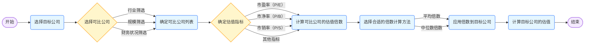

# 相对估值法：市场比较视角下的资产定价

> 关键词：相对估值法、市场比较、资产定价、估值指标、可比公司

> 摘要：本文从市场比较的视角深入探讨相对估值法在资产定价中的应用。首先介绍了相对估值法的背景，包括目的、预期读者、文档结构和相关术语。接着阐述了核心概念与联系，通过文本示意图和 Mermaid 流程图展示其原理和架构。详细讲解了核心算法原理，并给出 Python 代码示例。对涉及的数学模型和公式进行了详细推导和举例说明。通过项目实战，展示了相对估值法的代码实现和解读。分析了其实际应用场景，推荐了相关的学习资源、开发工具框架和论文著作。最后总结了相对估值法的未来发展趋势与挑战，并提供了常见问题解答和扩展阅读参考资料。

## 1. 背景介绍 
### 1.1 目的和范围
相对估值法是一种广泛应用于金融领域的资产定价方法，其目的在于通过与市场上类似资产的比较，来确定目标资产的合理价值。本文的范围将涵盖相对估值法的基本原理、核心算法、数学模型、实际应用案例等方面，旨在为读者提供一个全面且深入的理解，帮助读者掌握如何运用相对估值法进行资产定价，并了解其在不同场景下的应用。

### 1.2 预期读者
本文预期读者包括金融分析师、投资经理、基金管理人、金融专业学生以及对资产定价感兴趣的个人。对于专业人士，本文可以作为一个知识更新和实践参考的资料；对于学生和初学者，本文将提供一个系统的学习框架，帮助他们快速入门相对估值法。

### 1.3 文档结构概述
本文将按照以下结构进行组织：首先介绍相对估值法的背景知识，包括目的、读者和文档结构；接着阐述核心概念与联系，通过示意图和流程图展示其原理；然后详细讲解核心算法原理，并给出 Python 代码示例；再对涉及的数学模型和公式进行推导和举例；通过项目实战展示代码实现和解读；分析实际应用场景；推荐相关的学习资源、开发工具和论文著作；最后总结未来发展趋势与挑战，提供常见问题解答和扩展阅读参考资料。

### 1.4 术语表
#### 1.4.1 核心术语定义
- **相对估值法**：是一种通过比较目标资产与可比资产的某些财务指标或市场指标，来确定目标资产价值的方法。
- **可比公司**：是指与目标公司在业务、规模、财务状况等方面具有相似性的公司。
- **估值指标**：用于衡量资产价值的指标，如市盈率（P/E）、市净率（P/B）、市销率（P/S）等。
- **基准价值**：在相对估值法中，可比公司的平均估值指标所对应的价值。

#### 1.4.2 相关概念解释
- **市场比较**：相对估值法的核心思想是基于市场上类似资产的交易价格来评估目标资产的价值。通过比较目标资产与可比资产的估值指标，判断目标资产的相对价值。
- **倍数法**：相对估值法常用的一种方法，通过计算可比公司的估值倍数（如 P/E 倍数、P/B 倍数等），并将其应用于目标公司的相关财务指标，从而得出目标公司的估值。

#### 1.4.3 缩略词列表
- **P/E**：市盈率（Price-to-Earnings Ratio）
- **P/B**：市净率（Price-to-Book Ratio）
- **P/S**：市销率（Price-to-Sales Ratio）
- **EV/EBITDA**：企业价值与息税折旧摊销前利润之比（Enterprise Value to Earnings Before Interest, Taxes, Depreciation and Amortization）

## 2. 核心概念与联系 
相对估值法的核心概念是通过比较目标资产与可比资产的某些特征和指标，来确定目标资产的价值。其基本原理是认为在相同的市场环境下，类似的资产应该具有相似的估值水平。

### 核心概念原理
相对估值法主要基于以下几个核心原理：
1. **市场有效性假设**：假设市场是有效的，即资产的价格反映了其所有已知的信息。因此，可比公司的市场价格可以作为目标公司价值的参考。
2. **行业相似性**：选择与目标公司处于同一行业或具有相似业务模式的可比公司，因为这些公司面临着相似的市场环境、竞争压力和经营风险。
3. **财务指标可比性**：选择具有可比性的财务指标，如盈利、资产、销售收入等，来衡量公司的价值。通过比较目标公司和可比公司的这些指标，可以判断目标公司的相对估值水平。

### 架构的文本示意图
相对估值法的架构可以用以下文本示意图表示：
```plaintext
目标公司
|
|-- 选择可比公司
|   |-- 行业筛选
|   |-- 规模筛选
|   |-- 财务状况筛选
|
|-- 确定估值指标
|   |-- 市盈率（P/E）
|   |-- 市净率（P/B）
|   |-- 市销率（P/S）
|   |-- 其他指标
|
|-- 计算可比公司的估值倍数
|   |-- 平均倍数
|   |-- 中位数倍数
|
|-- 应用估值倍数到目标公司
|   |-- 根据目标公司的财务指标计算估值
```

### Mermaid 流程图


## 3. 核心算法原理 & 具体操作步骤 
### 核心算法原理
相对估值法的核心算法是通过计算可比公司的估值倍数，并将其应用于目标公司的相关财务指标，从而得出目标公司的估值。以下以市盈率（P/E）为例，详细介绍其算法原理。

市盈率（P/E）是指公司的股价与每股收益（EPS）的比值，计算公式为：
$$P/E = \frac{股价}{每股收益}$$

在相对估值法中，我们首先选择一组可比公司，计算它们的平均市盈率（或中位数市盈率）。然后，根据目标公司的每股收益，乘以可比公司的平均市盈率，即可得到目标公司的估值。

目标公司的估值计算公式为：
$$目标公司估值 = 目标公司每股收益 \times 可比公司平均市盈率$$

### 具体操作步骤
1. **选择目标公司**：确定需要进行估值的目标公司。
2. **选择可比公司**：根据行业、规模、财务状况等因素，选择与目标公司具有相似性的可比公司。
3. **收集数据**：收集目标公司和可比公司的财务数据，包括股价、每股收益、净资产、销售收入等。
4. **计算估值倍数**：根据选择的估值指标（如 P/E、P/B、P/S 等），计算可比公司的估值倍数。
5. **选择合适的倍数计算方法**：可以选择计算可比公司的平均倍数或中位数倍数。
6. **应用估值倍数到目标公司**：根据目标公司的相关财务指标，乘以可比公司的估值倍数，得到目标公司的估值。

### Python 源代码示例
```python
import pandas as pd

# 定义可比公司数据
comparable_companies = {
    '公司名称': ['公司 A', '公司 B', '公司 C'],
    '股价': [20, 30, 25],
    '每股收益': [2, 3, 2.5]
}

# 创建 DataFrame
df = pd.DataFrame(comparable_companies)

# 计算可比公司的市盈率
df['市盈率'] = df['股价'] / df['每股收益']

# 计算可比公司的平均市盈率
average_pe = df['市盈率'].mean()

# 定义目标公司的每股收益
target_eps = 2.2

# 计算目标公司的估值
target_value = target_eps * average_pe

print(f"可比公司的平均市盈率: {average_pe}")
print(f"目标公司的估值: {target_value}")
```

### 代码解释
1. **数据定义**：定义了可比公司的股价和每股收益数据，并创建了一个 DataFrame。
2. **计算市盈率**：通过将股价除以每股收益，计算出可比公司的市盈率。
3. **计算平均市盈率**：使用 `mean()` 函数计算可比公司的平均市盈率。
4. **定义目标公司的每股收益**：假设目标公司的每股收益为 2.2。
5. **计算目标公司的估值**：将目标公司的每股收益乘以可比公司的平均市盈率，得到目标公司的估值。

## 4. 数学模型和公式 & 详细讲解 & 举例说明 
### 常见估值指标的数学模型和公式
#### 市盈率（P/E）
市盈率是最常用的估值指标之一，它反映了投资者为获取公司每一元盈利所愿意支付的价格。计算公式为：
$$P/E = \frac{股价}{每股收益}$$

在相对估值法中，目标公司的估值计算公式为：
$$目标公司估值 = 目标公司每股收益 \times 可比公司平均市盈率$$

**举例说明**：假设可比公司 A 的股价为 20 元，每股收益为 2 元，则其市盈率为 $20 \div 2 = 10$ 倍。可比公司 B 的股价为 30 元，每股收益为 3 元，则其市盈率为 $30 \div 3 = 10$ 倍。可比公司 C 的股价为 25 元，每股收益为 2.5 元，则其市盈率为 $25 \div 2.5 = 10$ 倍。可比公司的平均市盈率为 $(10 + 10 + 10) \div 3 = 10$ 倍。目标公司的每股收益为 2.2 元，则目标公司的估值为 $2.2 \times 10 = 22$ 元。

#### 市净率（P/B）
市净率是指公司的股价与每股净资产的比值，它反映了投资者为获取公司每一元净资产所愿意支付的价格。计算公式为：
$$P/B = \frac{股价}{每股净资产}$$

在相对估值法中，目标公司的估值计算公式为：
$$目标公司估值 = 目标公司每股净资产 \times 可比公司平均市净率$$

**举例说明**：假设可比公司 A 的股价为 20 元，每股净资产为 5 元，则其市净率为 $20 \div 5 = 4$ 倍。可比公司 B 的股价为 30 元，每股净资产为 6 元，则其市净率为 $30 \div 6 = 5$ 倍。可比公司 C 的股价为 25 元，每股净资产为 5 元，则其市净率为 $25 \div 5 = 5$ 倍。可比公司的平均市净率为 $(4 + 5 + 5) \div 3 = 4.67$ 倍。目标公司的每股净资产为 6 元，则目标公司的估值为 $6 \times 4.67 = 28.02$ 元。

#### 市销率（P/S）
市销率是指公司的股价与每股销售收入的比值，它反映了投资者为获取公司每一元销售收入所愿意支付的价格。计算公式为：
$$P/S = \frac{股价}{每股销售收入}$$

在相对估值法中，目标公司的估值计算公式为：
$$目标公司估值 = 目标公司每股销售收入 \times 可比公司平均市销率$$

**举例说明**：假设可比公司 A 的股价为 20 元，每股销售收入为 10 元，则其市销率为 $20 \div 10 = 2$ 倍。可比公司 B 的股价为 30 元，每股销售收入为 15 元，则其市销率为 $30 \div 15 = 2$ 倍。可比公司 C 的股价为 25 元，每股销售收入为 12.5 元，则其市销率为 $25 \div 12.5 = 2$ 倍。可比公司的平均市销率为 $(2 + 2 + 2) \div 3 = 2$ 倍。目标公司的每股销售收入为 12 元，则目标公司的估值为 $12 \times 2 = 24$ 元。

### 其他估值指标
除了上述常见的估值指标外，还有一些其他的估值指标，如企业价值与息税折旧摊销前利润之比（EV/EBITDA）等。

#### 企业价值与息税折旧摊销前利润之比（EV/EBITDA）
企业价值（EV）是指公司的市场价值加上债务减去现金及现金等价物。息税折旧摊销前利润（EBITDA）是指公司的净利润加上利息、所得税、折旧和摊销。计算公式为：
$$EV/EBITDA = \frac{企业价值}{息税折旧摊销前利润}$$

在相对估值法中，目标公司的估值计算公式为：
$$目标公司估值 = 目标公司息税折旧摊销前利润 \times 可比公司平均 EV/EBITDA$$

**举例说明**：假设可比公司 A 的企业价值为 100 亿元，息税折旧摊销前利润为 20 亿元，则其 EV/EBITDA 为 $100 \div 20 = 5$ 倍。可比公司 B 的企业价值为 150 亿元，息税折旧摊销前利润为 30 亿元，则其 EV/EBITDA 为 $150 \div 30 = 5$ 倍。可比公司 C 的企业价值为 120 亿元，息税折旧摊销前利润为 24 亿元，则其 EV/EBITDA 为 $120 \div 24 = 5$ 倍。可比公司的平均 EV/EBITDA 为 $(5 + 5 + 5) \div 3 = 5$ 倍。目标公司的息税折旧摊销前利润为 25 亿元，则目标公司的估值为 $25 \times 5 = 125$ 亿元。

## 5. 项目实战：代码实际案例和详细解释说明 
### 5.1  开发环境搭建
为了实现相对估值法的代码，我们需要搭建以下开发环境：
1. **Python 环境**：建议使用 Python 3.7 及以上版本。
2. **开发工具**：可以使用 Jupyter Notebook、PyCharm 等开发工具。
3. **相关库**：需要安装 `pandas`、`numpy` 等库，用于数据处理和分析。

可以使用以下命令安装所需的库：
```sh
pip install pandas numpy
```

### 5.2  源代码详细实现和代码解读
以下是一个完整的相对估值法的代码示例，使用市盈率（P/E）进行估值：

```python
import pandas as pd

# 定义可比公司数据
comparable_companies = {
    '公司名称': ['公司 A', '公司 B', '公司 C', '公司 D', '公司 E'],
    '股价': [20, 30, 25, 22, 28],
    '每股收益': [2, 3, 2.5, 2.2, 2.8]
}

# 创建 DataFrame
df = pd.DataFrame(comparable_companies)

# 计算可比公司的市盈率
df['市盈率'] = df['股价'] / df['每股收益']

# 计算可比公司的平均市盈率
average_pe = df['市盈率'].mean()

# 定义目标公司的每股收益
target_eps = 2.5

# 计算目标公司的估值
target_value = target_eps * average_pe

# 输出结果
print("可比公司数据：")
print(df)
print(f"\n可比公司的平均市盈率: {average_pe}")
print(f"目标公司的每股收益: {target_eps}")
print(f"目标公司的估值: {target_value}")
```

### 代码解读与分析
1. **数据定义**：定义了可比公司的股价和每股收益数据，并创建了一个 DataFrame。
2. **计算市盈率**：通过将股价除以每股收益，计算出可比公司的市盈率。
3. **计算平均市盈率**：使用 `mean()` 函数计算可比公司的平均市盈率。
4. **定义目标公司的每股收益**：假设目标公司的每股收益为 2.5。
5. **计算目标公司的估值**：将目标公司的每股收益乘以可比公司的平均市盈率，得到目标公司的估值。
6. **输出结果**：打印可比公司的数据、平均市盈率、目标公司的每股收益和估值。

通过这个代码示例，我们可以看到如何使用 Python 实现相对估值法的基本流程。在实际应用中，我们可以根据需要选择不同的估值指标，如市净率（P/B）、市销率（P/S）等，并对数据进行更复杂的处理和分析。

## 6. 实际应用场景 
相对估值法在金融领域有着广泛的应用场景，以下是一些常见的应用场景：

### 股票投资
在股票投资中，相对估值法可以帮助投资者评估股票的价值，判断股票是否被低估或高估。投资者可以选择与目标股票处于同一行业的可比公司，计算可比公司的估值倍数，并将其应用于目标股票的相关财务指标，从而得出目标股票的估值。如果目标股票的市场价格低于其估值，则可能被低估，具有投资价值；反之，如果目标股票的市场价格高于其估值，则可能被高估，需要谨慎投资。

### 并购重组
在并购重组中，相对估值法可以用于评估目标公司的价值，为并购交易提供参考。收购方可以选择与目标公司具有相似业务和规模的可比公司，计算可比公司的估值倍数，并将其应用于目标公司的相关财务指标，从而得出目标公司的估值。收购方可以根据目标公司的估值，与目标公司的股东进行谈判，确定合理的收购价格。

### 企业估值
在企业估值中，相对估值法可以作为一种快速、简便的估值方法，用于初步评估企业的价值。企业可以选择与自身具有相似业务和规模的可比公司，计算可比公司的估值倍数，并将其应用于自身的相关财务指标，从而得出自身的估值。企业可以根据自身的估值，制定合理的发展战略和融资计划。

### 行业分析
在行业分析中，相对估值法可以用于比较不同公司在同一行业中的估值水平，分析行业的整体估值情况。分析师可以选择行业内的可比公司，计算可比公司的估值倍数，并进行比较和分析。通过分析行业内公司的估值水平，分析师可以了解行业的发展趋势和竞争格局，为投资决策提供参考。

## 7. 工具和资源推荐
### 7.1 学习资源推荐
#### 7.1.1 书籍推荐
- 《估值：难点、解决方案及相关案例》（Valuation: Measuring and Managing the Value of Companies）：这本书是估值领域的经典著作，详细介绍了各种估值方法，包括相对估值法、现金流折现法等，并通过实际案例进行了深入分析。
- 《财务报表分析与证券定价》（Financial Statement Analysis and Security Valuation）：本书结合财务报表分析和证券定价，介绍了如何使用财务报表数据进行估值，包括相对估值法的应用。
- 《投资中最简单的事》：作者从投资的角度出发，介绍了相对估值法等投资方法的应用，以及如何在投资中运用这些方法进行决策。

#### 7.1.2 在线课程
- Coursera 上的“Financial Markets”课程：该课程由耶鲁大学教授 Robert Shiller 讲授，介绍了金融市场的基本概念和投资方法，包括相对估值法的原理和应用。
- edX 上的“Valuation for Mergers and Acquisitions”课程：该课程主要介绍了并购估值的方法和技巧，包括相对估值法在并购中的应用。
- 中国大学 MOOC 上的“公司金融”课程：该课程涵盖了公司金融的各个方面，包括估值方法的介绍，对相对估值法有详细的讲解。

#### 7.1.3 技术博客和网站
- Seeking Alpha：这是一个知名的金融投资博客网站，提供了大量的股票分析和估值报告，其中包括相对估值法的应用案例。
- Bloomberg：彭博社的网站提供了丰富的金融数据和分析工具，用户可以通过该网站获取可比公司的财务数据和估值指标，进行相对估值分析。
- 雪球网：这是一个国内的财经社区，有很多投资者和分析师在上面分享股票分析和估值的经验，其中也包括相对估值法的应用。

### 7.2 开发工具框架推荐
#### 7.2.1 IDE和编辑器
- Jupyter Notebook：是一个开源的交互式笔记本，非常适合进行数据分析和代码演示。可以在 Jupyter Notebook 中编写和运行 Python 代码，实现相对估值法的计算和分析。
- PyCharm：是一款专业的 Python 集成开发环境，提供了丰富的代码编辑、调试和分析功能。可以使用 PyCharm 进行相对估值法的代码开发和项目管理。

#### 7.2.2 调试和性能分析工具
- PDB：是 Python 自带的调试工具，可以在代码中设置断点，逐步执行代码，查看变量的值和程序的执行流程，帮助调试相对估值法的代码。
- cProfile：是 Python 的性能分析工具，可以分析代码的运行时间和函数调用次数，帮助优化相对估值法的代码性能。

#### 7.2.3 相关框架和库
- Pandas：是一个强大的数据分析库，提供了丰富的数据结构和数据处理功能。可以使用 Pandas 读取和处理可比公司和目标公司的财务数据，进行相对估值法的计算。
- NumPy：是 Python 的数值计算库，提供了高效的数组操作和数学函数。可以使用 NumPy 进行数值计算和统计分析，辅助相对估值法的实现。

### 7.3 相关论文著作推荐
#### 7.3.1 经典论文
- “Comparative Valuation Using Price Multiples” by Aswath Damodaran：这篇论文详细介绍了相对估值法的原理和应用，对各种估值倍数进行了深入分析，并讨论了如何选择合适的可比公司和估值倍数。
- “The Use of Multiples in Valuation” by Eugene F. Brigham and Joel F. Houston：该论文探讨了相对估值法在企业估值中的应用，分析了不同估值倍数的优缺点，并提出了一些改进建议。

#### 7.3.2 最新研究成果
- 近年来，一些学者开始研究如何结合机器学习和深度学习方法，改进相对估值法的准确性和有效性。例如，使用神经网络模型预测可比公司的估值倍数，或者使用聚类算法选择更合适的可比公司。
- 还有一些研究关注相对估值法在不同市场环境和行业中的应用差异，以及如何调整估值倍数以适应不同的情况。

#### 7.3.3 应用案例分析
- 许多金融机构和投资银行会发布关于相对估值法应用的案例分析报告，这些报告可以帮助读者了解相对估值法在实际投资和并购中的应用过程和效果。
- 一些上市公司的招股说明书和年报中也会包含相对估值法的应用案例，读者可以通过分析这些案例，学习如何使用相对估值法进行企业估值。

## 8. 总结：未来发展趋势与挑战
### 未来发展趋势
1. **与其他估值方法相结合**：相对估值法虽然简单易懂，但也存在一定的局限性。未来，相对估值法可能会与现金流折现法、实物期权法等其他估值方法相结合，以提高估值的准确性和可靠性。
2. **引入大数据和人工智能技术**：随着大数据和人工智能技术的发展，相对估值法可以利用更多的数据来源和更复杂的分析方法。例如，通过分析社交媒体数据、新闻资讯等非结构化数据，获取更多关于可比公司和目标公司的信息，提高可比公司选择的准确性；使用机器学习和深度学习算法，自动调整估值倍数，提高估值的效率和精度。
3. **应用于新兴行业和领域**：随着新兴行业和领域的不断涌现，如人工智能、区块链、生物医药等，相对估值法需要不断适应这些行业的特点和需求。未来，相对估值法可能会开发出更适合新兴行业的估值指标和方法，为这些行业的企业估值提供更好的支持。

### 挑战
1. **可比公司选择的困难**：在实际应用中，选择合适的可比公司是相对估值法的关键。然而，随着市场的不断变化和企业业务的多元化，找到与目标公司完全相似的可比公司越来越困难。此外，不同行业和市场环境下，可比公司的选择标准也可能不同，需要分析师具备丰富的经验和专业知识。
2. **估值指标的局限性**：现有的估值指标（如 P/E、P/B、P/S 等）都有其局限性，不能完全反映公司的真实价值。例如，市盈率可能会受到公司盈利波动的影响，市净率可能无法反映公司的无形资产价值。因此，需要不断探索和开发新的估值指标，以提高估值的准确性。
3. **市场环境的不确定性**：相对估值法基于市场比较的原理，其估值结果受到市场环境的影响较大。在市场波动较大或出现异常情况时，可比公司的估值倍数可能会失真，从而导致目标公司的估值不准确。因此，在使用相对估值法时，需要充分考虑市场环境的不确定性，并进行适当的调整和修正。

## 9. 附录：常见问题与解答
### 1. 如何选择合适的可比公司？
选择合适的可比公司需要考虑以下几个因素：
- **行业相似性**：选择与目标公司处于同一行业或具有相似业务模式的公司。
- **规模相似性**：选择与目标公司规模相近的公司，如营业收入、资产规模等。
- **财务状况相似性**：选择与目标公司财务状况相似的公司，如盈利能力、偿债能力等。
- **市场地位相似性**：选择与目标公司市场地位相似的公司，如市场份额、竞争优势等。

### 2. 不同的估值指标有什么优缺点？
- **市盈率（P/E）**：优点是简单易懂，反映了投资者对公司盈利的预期；缺点是容易受到公司盈利波动的影响，不适用于亏损公司。
- **市净率（P/B）**：优点是可以反映公司的净资产价值，适用于资产密集型行业；缺点是无法反映公司的无形资产价值，对于轻资产公司可能不太适用。
- **市销率（P/S）**：优点是不受公司盈利的影响，适用于亏损公司或盈利不稳定的公司；缺点是无法反映公司的盈利能力和成本控制能力。
- **EV/EBITDA**：优点是考虑了公司的债务和现金状况，更全面地反映了公司的价值；缺点是计算相对复杂，需要获取公司的债务和现金数据。

### 3. 相对估值法的估值结果一定准确吗？
相对估值法的估值结果不一定准确，因为它基于市场比较的原理，受到可比公司选择、估值指标选择、市场环境等多种因素的影响。相对估值法只能提供一个大致的估值范围，不能作为投资决策的唯一依据。在使用相对估值法时，还需要结合其他估值方法和基本面分析，进行综合判断。

### 4. 如何处理可比公司数据的异常值？
处理可比公司数据的异常值可以采用以下方法：
- **删除异常值**：如果异常值是由于数据录入错误或特殊事件导致的，可以直接删除该数据。
- **调整异常值**：如果异常值是由于公司的特殊情况导致的，但仍然具有一定的参考价值，可以对该数据进行调整，如取中位数或进行平滑处理。
- **增加可比公司数量**：如果可比公司数量较少，异常值可能会对估值结果产生较大影响。可以增加可比公司的数量，以减少异常值的影响。

## 10. 扩展阅读 & 参考资料
### 扩展阅读
- 《聪明的投资者》（The Intelligent Investor）：这本书是价值投资的经典著作，虽然没有专门介绍相对估值法，但其中的投资理念和方法对理解相对估值法有很大的帮助。
- 《金融炼金术》（The Alchemy of Finance）：作者乔治·索罗斯通过自己的投资实践，阐述了金融市场的运行规律和投资策略，对相对估值法在金融市场中的应用有一定的启示。
- 《漫步华尔街》（A Random Walk Down Wall Street）：这本书介绍了各种投资理论和方法，包括相对估值法，帮助读者了解如何在投资中做出理性的决策。

### 参考资料
- Damodaran, A. (2012). The Dark Side of Valuation: Valuing Young, Distressed, and Complex Businesses. Pearson.
- Koller, T., Goedhart, M., & Wessels, D. (2015). Valuation: Measuring and Managing the Value of Companies. Wiley.
- Penman, S. H. (2012). Financial Statement Analysis and Security Valuation. McGraw-Hill Education.

以上文章详细介绍了相对估值法从背景到实际应用等多个方面的内容，希望能为读者提供一个全面深入的理解。在实际应用中，读者可以根据具体情况灵活运用相对估值法，并结合其他方法进行综合分析，以做出更准确的投资决策。