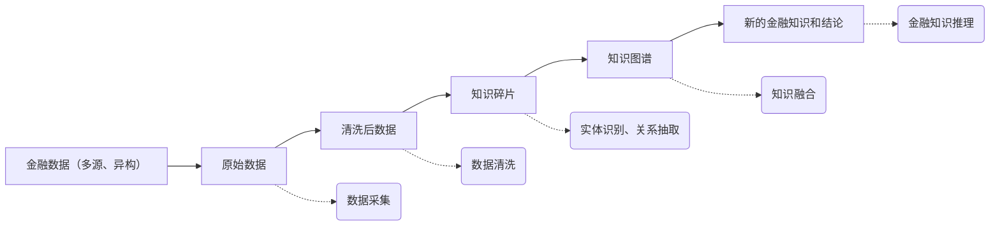

# 知识图谱在金融知识推理中的应用

> 关键词：知识图谱、金融知识推理、语义网络、图数据库、知识表示

> 摘要：本文深入探讨了知识图谱在金融知识推理中的应用。首先介绍了相关背景，包括目的范围、预期读者等内容。接着阐述了知识图谱和金融知识推理的核心概念与联系，通过文本示意图和 Mermaid 流程图进行清晰展示。详细讲解了核心算法原理和具体操作步骤，结合 Python 源代码进行说明。呈现了相关的数学模型和公式，并举例解释。通过项目实战，展示了代码实际案例并进行详细解释。探讨了知识图谱在金融领域的实际应用场景，推荐了相关的工具和资源。最后总结了未来发展趋势与挑战，解答了常见问题并提供扩展阅读和参考资料，旨在全面剖析知识图谱在金融知识推理中的重要作用和应用价值。

## 1. 背景介绍 
### 1.1 目的和范围
随着金融市场的不断发展和复杂化，金融数据呈现出海量、多源、异构的特点。传统的数据处理和分析方法在面对这些复杂数据时，往往难以挖掘出数据背后的潜在关系和知识。知识图谱作为一种强大的知识表示和管理工具，能够将金融领域的实体、关系和属性以图的形式进行组织和存储，为金融知识推理提供了有力的支持。

本文的目的在于系统地介绍知识图谱在金融知识推理中的应用，包括知识图谱的构建、金融知识推理的方法和技术，以及如何利用知识图谱解决金融领域中的实际问题。范围涵盖了金融知识图谱的基本概念、核心算法、数学模型、项目实战、应用场景等多个方面。

### 1.2 预期读者
本文预期读者包括金融行业的从业者，如分析师、投资经理、风险管理人员等，他们希望通过知识图谱技术提升对金融数据的分析和理解能力；计算机科学领域的研究人员和开发者，对知识图谱、人工智能、数据挖掘等技术感兴趣，希望了解其在金融领域的应用；以及相关专业的学生，作为学习和研究金融信息技术的参考资料。

### 1.3 文档结构概述
本文将按照以下结构进行组织：首先介绍知识图谱和金融知识推理的核心概念与联系，包括相关的原理和架构；接着详细讲解核心算法原理和具体操作步骤，并结合 Python 源代码进行说明；然后给出相关的数学模型和公式，并举例进行详细讲解；通过项目实战展示代码实际案例并进行详细解释；探讨知识图谱在金融领域的实际应用场景；推荐相关的工具和资源；最后总结未来发展趋势与挑战，解答常见问题并提供扩展阅读和参考资料。

### 1.4 术语表
#### 1.4.1 核心术语定义
- **知识图谱**：一种用图模型来描述知识和建模世界万物之间的关联关系的技术方法，由实体、关系和属性组成。
- **金融知识推理**：利用金融领域的知识和逻辑规则，从已知的金融事实中推导出新的金融知识和结论的过程。
- **实体**：知识图谱中表示具体对象的元素，如公司、金融产品、客户等。
- **关系**：实体之间的联系，如“投资”“持有”“担保”等。
- **属性**：实体所具有的特征，如公司的注册资本、金融产品的收益率等。

#### 1.4.2 相关概念解释
- **语义网络**：一种基于图的知识表示方法，与知识图谱有相似之处，但知识图谱更强调实体和关系的标准化和结构化。
- **图数据库**：专门用于存储和管理图数据的数据库，能够高效地处理知识图谱中的实体和关系。
- **知识表示**：将知识以计算机能够理解和处理的形式进行表示的方法，是知识图谱构建的基础。

#### 1.4.3 缩略词列表
- **RDF**：Resource Description Framework，资源描述框架，是一种用于表示知识图谱数据的标准格式。
- **OWL**：Web Ontology Language，网络本体语言，用于定义知识图谱中的本体和语义。
- **SPARQL**：SPARQL Protocol and RDF Query Language，用于查询和操作 RDF 数据的语言。

## 2. 核心概念与联系 

### 知识图谱原理
知识图谱的核心思想是将现实世界中的实体、关系和属性以图的形式进行表示。实体是图中的节点，关系是节点之间的边，属性是节点或边的标签。例如，在金融知识图谱中，一家公司可以作为一个实体节点，该公司与其他公司的投资关系可以用一条边来表示，公司的注册资本、成立时间等属性可以作为节点的标签。

知识图谱的构建过程通常包括数据采集、数据清洗、实体识别、关系抽取、知识融合和知识存储等步骤。通过这些步骤，可以将多源、异构的金融数据整合到一个统一的知识图谱中，为金融知识推理提供丰富的知识资源。

### 金融知识推理原理
金融知识推理是基于金融领域的知识和逻辑规则，从已知的金融事实中推导出新的金融知识和结论的过程。推理的方法主要包括基于规则的推理、基于机器学习的推理和基于深度学习的推理等。

基于规则的推理是根据预先定义的规则进行推理，例如，如果 A 公司持有 B 公司的股份超过 50%，则可以推断 A 公司对 B 公司具有控制权。基于机器学习的推理是利用机器学习算法从大量的金融数据中学习推理规则，例如，通过训练分类器来判断一家公司是否存在财务风险。基于深度学习的推理是利用深度学习模型，如神经网络，来进行推理，例如，利用循环神经网络预测金融产品的价格走势。

### 知识图谱与金融知识推理的联系
知识图谱为金融知识推理提供了丰富的知识资源和结构化的数据表示。通过知识图谱，可以清晰地表示金融领域中的实体、关系和属性，为推理提供明确的推理对象和上下文信息。同时，知识图谱的语义信息可以帮助推理系统更好地理解金融数据的含义，提高推理的准确性和效率。

金融知识推理则可以利用知识图谱中的知识和关系，发现潜在的金融信息和规律。通过推理，可以从已知的金融事实中推导出新的金融知识和结论，为金融决策提供支持。例如，通过推理可以发现公司之间的潜在关联关系，预测金融市场的趋势，评估金融风险等。

### 文本示意图
```plaintext
金融数据（多源、异构）
    |
    | 数据采集
    v
原始数据
    |
    | 数据清洗
    v
清洗后数据
    |
    | 实体识别、关系抽取
    v
知识碎片
    |
    | 知识融合
    v
知识图谱
    |
    | 金融知识推理
    v
新的金融知识和结论
```

### Mermaid 流程图


## 3. 核心算法原理 & 具体操作步骤 

### 基于规则的推理算法原理
基于规则的推理是根据预先定义的规则进行推理的方法。规则通常由前提条件和结论组成，当满足前提条件时，就可以推导出相应的结论。例如，在金融领域中，可以定义如下规则：

规则 1：如果 A 公司持有 B 公司的股份超过 50%，则 A 公司对 B 公司具有控制权。

规则 2：如果 A 公司对 B 公司具有控制权，且 B 公司存在财务风险，则 A 公司也存在财务风险。

### Python 源代码实现
```python
# 定义实体和关系数据
entities = {
    "A公司": {},
    "B公司": {}
}

relations = {
    ("A公司", "持有", "B公司"): {"股份比例": 0.6},
    ("B公司", "存在", "财务风险"): {}
}

# 定义规则
rules = [
    lambda e, r: r.get(("A公司", "持有", "B公司"), {}).get("股份比例", 0) > 0.5 and e["A公司"].update({"对B公司具有控制权": True}),
    lambda e, r: e.get("A公司", {}).get("对B公司具有控制权") and r.get(("B公司", "存在", "财务风险")) and e["A公司"].update({"存在财务风险": True})
]

# 进行推理
for rule in rules:
    rule(entities, relations)

# 输出推理结果
print("推理结果：")
for entity, attributes in entities.items():
    print(f"{entity}: {attributes}")
```

### 代码解释
1. **数据定义**：定义了实体和关系数据，其中 `entities` 存储实体及其属性，`relations` 存储实体之间的关系及其属性。
2. **规则定义**：定义了两个规则，每个规则都是一个匿名函数，接受实体和关系数据作为参数，根据条件更新实体的属性。
3. **推理过程**：遍历规则列表，依次应用每个规则进行推理。
4. **结果输出**：输出推理后的实体及其属性。

### 基于机器学习的推理算法原理
基于机器学习的推理是利用机器学习算法从大量的金融数据中学习推理规则的方法。常见的机器学习算法包括决策树、支持向量机、神经网络等。以决策树为例，决策树是一种基于树结构进行决策的模型，通过对训练数据的学习，构建决策树模型，然后根据输入的数据进行推理。

### Python 源代码实现
```python
from sklearn.datasets import make_classification
from sklearn.model_selection import train_test_split
from sklearn.tree import DecisionTreeClassifier
from sklearn.metrics import accuracy_score

# 生成示例数据
X, y = make_classification(n_samples=1000, n_features=10, n_informative=5, n_redundant=0, random_state=42)

# 划分训练集和测试集
X_train, X_test, y_train, y_test = train_test_split(X, y, test_size=0.2, random_state=42)

# 创建决策树分类器
clf = DecisionTreeClassifier()

# 训练模型
clf.fit(X_train, y_train)

# 进行预测
y_pred = clf.predict(X_test)

# 计算准确率
accuracy = accuracy_score(y_test, y_pred)

print(f"预测准确率: {accuracy}")
```

### 代码解释
1. **数据生成**：使用 `make_classification` 函数生成示例数据。
2. **数据划分**：使用 `train_test_split` 函数将数据划分为训练集和测试集。
3. **模型创建**：创建决策树分类器。
4. **模型训练**：使用训练集数据对模型进行训练。
5. **预测和评估**：使用测试集数据进行预测，并计算预测准确率。

## 4. 数学模型和公式 & 详细讲解 & 举例说明 

### 基于规则的推理数学模型
基于规则的推理可以用逻辑表达式来表示。设 $E$ 表示实体集合，$R$ 表示关系集合，$A$ 表示属性集合。规则可以表示为：

$$P \Rightarrow Q$$

其中 $P$ 是前提条件，$Q$ 是结论。前提条件和结论可以是关于实体、关系和属性的逻辑表达式。例如，规则 1 可以表示为：

$$\text{股份比例}(A, \text{持有}, B) > 0.5 \Rightarrow \text{控制权}(A, B)$$

其中 $\text{股份比例}(A, \text{持有}, B)$ 表示 $A$ 公司持有 $B$ 公司的股份比例，$\text{控制权}(A, B)$ 表示 $A$ 公司对 $B$ 公司具有控制权。

### 基于机器学习的推理数学模型
以决策树为例，决策树的数学模型可以表示为一个树形结构。每个内部节点是一个属性上的测试，每个分支是一个测试输出，每个叶节点是一个类别标签。决策树的构建过程可以通过信息增益、基尼指数等指标来选择最优的划分属性。

信息增益的计算公式为：

$$\text{Gain}(D, a) = \text{Ent}(D) - \sum_{v = 1}^{V} \frac{|D^v|}{|D|} \text{Ent}(D^v)$$

其中 $D$ 是数据集，$a$ 是属性，$V$ 是属性 $a$ 的取值个数，$D^v$ 是 $D$ 中在属性 $a$ 上取值为 $v$ 的样本子集，$\text{Ent}(D)$ 是数据集 $D$ 的信息熵，计算公式为：

$$\text{Ent}(D) = - \sum_{k = 1}^{K} p_k \log_2 p_k$$

其中 $K$ 是类别个数，$p_k$ 是第 $k$ 个类别的样本在 $D$ 中所占的比例。

### 举例说明
假设有一个数据集 $D$ 包含 100 个样本，分为两个类别，其中类别 1 有 60 个样本，类别 2 有 40 个样本。则数据集 $D$ 的信息熵为：

$$\text{Ent}(D) = - \frac{60}{100} \log_2 \frac{60}{100} - \frac{40}{100} \log_2 \frac{40}{100} \approx 0.971$$

假设有一个属性 $a$ 有两个取值 $v_1$ 和 $v_2$，$D^{v_1}$ 包含 40 个样本，其中类别 1 有 30 个样本，类别 2 有 10 个样本；$D^{v_2}$ 包含 60 个样本，其中类别 1 有 30 个样本，类别 2 有 30 个样本。则 $D^{v_1}$ 和 $D^{v_2}$ 的信息熵分别为：

$$\text{Ent}(D^{v_1}) = - \frac{30}{40} \log_2 \frac{30}{40} - \frac{10}{40} \log_2 \frac{10}{40} \approx 0.811$$

$$\text{Ent}(D^{v_2}) = - \frac{30}{60} \log_2 \frac{30}{60} - \frac{30}{60} \log_2 \frac{30}{60} = 1$$

则属性 $a$ 的信息增益为：

$$\text{Gain}(D, a) = 0.971 - \frac{40}{100} \times 0.811 - \frac{60}{100} \times 1 \approx 0.047$$

## 5. 项目实战：代码实际案例和详细解释说明 

### 5.1  开发环境搭建
#### 硬件环境
- 处理器：Intel Core i5 及以上
- 内存：8GB 及以上
- 硬盘：至少 500GB 可用空间

#### 软件环境
- 操作系统：Windows 10、Linux（如 Ubuntu 18.04）或 macOS
- Python 版本：3.7 及以上
- 相关库：`numpy`、`pandas`、`scikit-learn`、`networkx`、`rdflib` 等

### 5.2  源代码详细实现和代码解读
#### 数据准备
```python
import pandas as pd

# 读取金融数据
data = pd.read_csv('financial_data.csv')

# 数据清洗
data = data.dropna()

# 实体识别
entities = set(data['公司名称'])

# 关系抽取
relations = []
for index, row in data.iterrows():
    relations.append((row['投资方'], '投资', row['被投资方']))
```

#### 知识图谱构建
```python
import networkx as nx

# 创建有向图
G = nx.DiGraph()

# 添加实体节点
for entity in entities:
    G.add_node(entity)

# 添加关系边
for relation in relations:
    G.add_edge(relation[0], relation[2], label=relation[1])
```

#### 金融知识推理
```python
# 定义规则：如果 A 公司投资了 B 公司，B 公司投资了 C 公司，则 A 公司间接投资了 C 公司
def indirect_investment(G):
    indirect_relations = []
    for u in G.nodes():
        for v in G.successors(u):
            for w in G.successors(v):
                if (u, w) not in G.edges():
                    indirect_relations.append((u, '间接投资', w))
    return indirect_relations

# 进行推理
indirect_relations = indirect_investment(G)

# 添加间接关系到知识图谱
for relation in indirect_relations:
    G.add_edge(relation[0], relation[2], label=relation[1])
```

#### 结果可视化
```python
import matplotlib.pyplot as plt

# 绘制知识图谱
pos = nx.spring_layout(G)
nx.draw(G, pos, with_labels=True, node_color='lightblue', node_size=800, font_size=10)
edge_labels = nx.get_edge_attributes(G, 'label')
nx.draw_networkx_edge_labels(G, pos, edge_labels=edge_labels)
plt.title('金融知识图谱')
plt.show()
```

### 5.3  代码解读与分析
#### 数据准备
1. **数据读取**：使用 `pandas` 库读取金融数据文件。
2. **数据清洗**：删除包含缺失值的行，确保数据的完整性。
3. **实体识别**：从数据中提取公司名称作为实体。
4. **关系抽取**：从数据中提取投资关系。

#### 知识图谱构建
1. **创建有向图**：使用 `networkx` 库创建有向图。
2. **添加实体节点**：将识别出的实体添加到图中作为节点。
3. **添加关系边**：将抽取的关系添加到图中作为边。

#### 金融知识推理
1. **定义规则**：定义了一个规则，用于找出间接投资关系。
2. **进行推理**：遍历图中的节点和边，找出符合规则的间接投资关系。
3. **更新知识图谱**：将推理出的间接投资关系添加到图中。

#### 结果可视化
1. **布局设置**：使用 `spring_layout` 算法设置节点的布局。
2. **绘制节点和边**：使用 `draw` 函数绘制节点和边。
3. **绘制边标签**：使用 `draw_networkx_edge_labels` 函数绘制边的标签。
4. **显示图形**：使用 `show` 函数显示绘制的知识图谱。

## 6. 实际应用场景 
### 风险评估
知识图谱可以整合企业的财务数据、经营数据、关联关系等多源信息，通过知识推理发现潜在的风险因素。例如，通过分析企业之间的股权关系、担保关系等，可以识别出企业的潜在风险传导路径，提前预警风险。

### 投资决策
知识图谱可以提供企业的全面信息，包括企业的业务范围、市场竞争力、行业地位等。通过知识推理，可以对企业的未来发展进行预测，为投资决策提供参考。例如，通过分析企业的产业链关系、技术创新能力等，可以发现具有投资价值的企业。

### 反洗钱
知识图谱可以整合客户的交易数据、身份信息、行为模式等多源信息，通过知识推理发现异常的交易行为。例如，通过分析客户之间的资金往来关系、交易频率、交易金额等，可以识别出洗钱的可疑线索。

### 金融监管
知识图谱可以为金融监管机构提供全面的金融信息，包括金融机构的业务数据、风险状况、关联关系等。通过知识推理，可以发现金融机构的潜在风险和违规行为，提高金融监管的效率和准确性。

## 7. 工具和资源推荐
### 7.1 学习资源推荐
#### 7.1.1 书籍推荐
- 《知识图谱：方法、实践与应用》：全面介绍了知识图谱的基本概念、技术方法和应用案例。
- 《人工智能：一种现代的方法》：经典的人工智能教材，涵盖了知识表示、推理等相关内容。
- 《Python 数据科学手册》：介绍了 Python 在数据处理、分析和挖掘方面的应用，对于知识图谱的开发有很大帮助。

#### 7.1.2 在线课程
- Coursera 上的“Knowledge Graphs”课程：由知名教授授课，系统地介绍了知识图谱的理论和实践。
- edX 上的“Artificial Intelligence”课程：涵盖了人工智能的多个领域，包括知识表示和推理。
- 中国大学 MOOC 上的“数据挖掘与机器学习”课程：介绍了数据挖掘和机器学习的基本算法，对于理解基于机器学习的推理方法有帮助。

#### 7.1.3 技术博客和网站
- 语义网研究社区（Semantic Web Research Community）：提供了知识图谱和语义网领域的最新研究成果和技术动态。
- 开源中国（OSChina）：有很多关于知识图谱和人工智能的技术文章和案例分享。
- 博客园（CNBlogs）：有不少开发者分享知识图谱的开发经验和心得。

### 7.2 开发工具框架推荐
#### 7.2.1 IDE和编辑器
- PyCharm：功能强大的 Python 集成开发环境，提供代码编辑、调试、版本控制等功能。
- Visual Studio Code：轻量级的代码编辑器，支持多种编程语言，有丰富的插件扩展。
- Jupyter Notebook：交互式的开发环境，适合进行数据探索和模型训练。

#### 7.2.2 调试和性能分析工具
- PySnooper：可以自动记录函数的执行过程，方便调试代码。
- cProfile：Python 内置的性能分析工具，可以分析代码的运行时间和调用次数。
- TensorBoard：用于可视化深度学习模型的训练过程和性能指标。

#### 7.2.3 相关框架和库
- NetworkX：用于创建、操作和研究复杂网络的 Python 库，适合知识图谱的构建和分析。
- RDFlib：用于处理 RDF 数据的 Python 库，支持 RDF 数据的解析、查询和存储。
- GraphFrames：基于 Apache Spark 的图处理框架，适合大规模知识图谱的处理和分析。

### 7.3 相关论文著作推荐
#### 7.3.1 经典论文
- “Knowledge Graph Embedding: A Survey of Approaches and Applications”：对知识图谱嵌入技术进行了全面的综述。
- “Semantic Web Technologies: Trends and Research in Ontology-based Systems”：介绍了语义网技术的发展趋势和研究成果。
- “Probabilistic Graphical Models: Principles and Techniques”：详细介绍了概率图模型的原理和应用，对于理解基于概率的知识推理有帮助。

#### 7.3.2 最新研究成果
- 可以关注 AAAI、IJCAI、KDD 等顶级人工智能和数据挖掘会议的论文，了解知识图谱和金融知识推理的最新研究进展。
- 查阅《Journal of Artificial Intelligence Research》《Artificial Intelligence》等学术期刊上的相关论文。

#### 7.3.3 应用案例分析
- 可以参考金融机构的年报、研究报告等资料，了解知识图谱在金融领域的实际应用案例。
- 关注行业媒体和咨询公司发布的关于金融科技应用的案例分析报告。

## 8. 总结：未来发展趋势与挑战
### 未来发展趋势
- **与深度学习的融合**：将知识图谱与深度学习模型相结合，利用知识图谱的先验知识和语义信息，提高深度学习模型的可解释性和泛化能力。
- **多模态知识图谱**：整合文本、图像、音频等多模态数据，构建更加丰富和全面的知识图谱，为金融知识推理提供更多的信息来源。
- **实时知识图谱**：实现知识图谱的实时更新和推理，及时反映金融市场的动态变化，为金融决策提供更及时的支持。
- **跨领域知识图谱**：打破金融领域的界限，构建跨领域的知识图谱，整合金融、经济、科技等多个领域的知识，挖掘更深入的知识和规律。

### 挑战
- **数据质量和一致性**：金融数据来源广泛、格式多样，数据质量和一致性难以保证，这给知识图谱的构建和知识推理带来了挑战。
- **知识表示和推理的复杂性**：金融领域的知识复杂多样，如何准确地表示和推理这些知识是一个难题。
- **计算资源和效率**：大规模知识图谱的存储和推理需要大量的计算资源和时间，如何提高计算效率是一个关键问题。
- **隐私和安全**：金融数据涉及用户的隐私和敏感信息，如何在知识图谱的构建和应用过程中保护数据的隐私和安全是一个重要挑战。

## 9. 附录：常见问题与解答
### 问题 1：知识图谱和传统数据库有什么区别？
知识图谱以图的形式表示实体和关系，更强调数据之间的语义关联和逻辑关系，能够更好地处理复杂的查询和推理任务。而传统数据库主要以表格的形式存储数据，更适合处理结构化的数据查询。

### 问题 2：如何评估知识图谱的质量？
可以从知识的完整性、准确性、一致性和时效性等方面评估知识图谱的质量。例如，检查知识图谱中是否包含了足够的实体和关系，知识的表示是否准确，不同来源的知识是否一致，知识是否及时更新等。

### 问题 3：知识图谱在金融领域的应用是否会受到法律法规的限制？
是的，知识图谱在金融领域的应用需要遵守相关的法律法规，特别是在数据隐私和安全方面。在构建和应用知识图谱时，需要确保数据的收集、使用和存储符合法律法规的要求，保护用户的隐私和权益。

### 问题 4：如何选择合适的知识推理方法？
选择合适的知识推理方法需要考虑具体的应用场景、数据特点和推理任务的要求。如果有明确的规则和逻辑关系，可以选择基于规则的推理方法；如果数据量较大且规则不明确，可以选择基于机器学习或深度学习的推理方法。

## 10. 扩展阅读 & 参考资料
### 扩展阅读
- 《大数据时代：生活、工作与思维的大变革》：介绍了大数据时代的特点和影响，对于理解金融数据的特点和知识图谱的应用背景有帮助。
- 《智能时代：大数据与智能革命重新定义未来》：探讨了智能时代的发展趋势和技术应用，包括知识图谱和人工智能在各个领域的应用。

### 参考资料
- 相关的学术论文和研究报告，如 AAAI、IJCAI 等会议的论文，《Journal of Artificial Intelligence Research》等期刊的文章。
- 金融机构的官方网站和年报，获取金融领域的实际数据和案例。
- 开源项目的文档和代码，如 NetworkX、RDFlib 等库的官方文档。