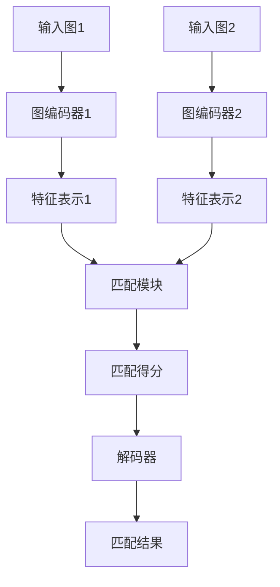

# 神经图匹配在复杂模式识别推理中的创新

> 关键词：神经图匹配、复杂模式识别、推理、图神经网络、深度学习

> 摘要：本文聚焦于神经图匹配在复杂模式识别推理中的创新应用。首先介绍了相关背景知识，包括研究目的、预期读者、文档结构和术语表等。接着阐述了神经图匹配的核心概念与联系，通过文本示意图和 Mermaid 流程图进行直观展示。详细讲解了核心算法原理及具体操作步骤，结合 Python 源代码进行说明。同时给出了相关的数学模型和公式，并举例说明。通过项目实战展示了代码实际案例及详细解释。探讨了神经图匹配在不同领域的实际应用场景。推荐了相关的学习资源、开发工具框架和论文著作。最后总结了未来发展趋势与挑战，并提供了常见问题与解答以及扩展阅读和参考资料，旨在全面深入地探讨神经图匹配在复杂模式识别推理中的创新价值和应用前景。

## 1. 背景介绍 
### 1.1 目的和范围
在当今的信息时代，复杂模式识别推理在众多领域都有着至关重要的作用，如生物信息学、社交网络分析、计算机视觉等。然而，传统的模式识别方法在处理具有复杂结构和语义信息的数据时面临着诸多挑战。神经图匹配作为一种新兴的技术，为解决这些问题提供了新的思路和方法。

本文的目的在于深入探讨神经图匹配在复杂模式识别推理中的创新应用，研究其核心原理、算法实现、实际应用场景等方面的内容。范围涵盖了神经图匹配的基本概念、相关算法、数学模型，以及通过项目实战展示其在实际问题中的应用，同时对未来的发展趋势和挑战进行分析。

### 1.2 预期读者
本文预期读者包括但不限于以下几类人群：
- **研究人员**：从事模式识别、图神经网络、深度学习等相关领域研究的科研人员，希望通过本文了解神经图匹配的最新研究进展和创新应用，为其研究工作提供参考和启发。
- **工程师**：在实际项目中需要处理复杂模式识别推理问题的工程师，如计算机视觉工程师、数据挖掘工程师等，能够从本文中获取神经图匹配的技术细节和实践经验，应用到实际项目中。
- **学生**：对人工智能、模式识别等领域感兴趣的学生，通过阅读本文可以系统地学习神经图匹配的相关知识，为进一步的学习和研究打下基础。

### 1.3 文档结构概述
本文的文档结构如下：
- **核心概念与联系**：介绍神经图匹配的核心概念、原理和架构，通过文本示意图和 Mermaid 流程图进行直观展示。
- **核心算法原理 & 具体操作步骤**：详细讲解神经图匹配的核心算法原理，并使用 Python 源代码进行具体实现和说明。
- **数学模型和公式 & 详细讲解 & 举例说明**：给出神经图匹配相关的数学模型和公式，并进行详细讲解和举例说明。
- **项目实战：代码实际案例和详细解释说明**：通过实际项目案例展示神经图匹配的应用，包括开发环境搭建、源代码详细实现和代码解读。
- **实际应用场景**：探讨神经图匹配在不同领域的实际应用场景。
- **工具和资源推荐**：推荐相关的学习资源、开发工具框架和论文著作。
- **总结：未来发展趋势与挑战**：总结神经图匹配在复杂模式识别推理中的发展趋势和面临的挑战。
- **附录：常见问题与解答**：提供常见问题的解答，帮助读者更好地理解和应用神经图匹配技术。
- **扩展阅读 & 参考资料**：列出相关的扩展阅读资料和参考文献，方便读者进一步深入学习。

### 1.4 术语表
#### 1.4.1 核心术语定义
- **神经图匹配（Neural Graph Matching）**：一种基于神经网络的图匹配方法，通过学习图的结构和节点特征，实现图之间的匹配和对齐。
- **复杂模式识别（Complex Pattern Recognition）**：对具有复杂结构、语义信息和多样性的数据模式进行识别和分类的过程。
- **推理（Reasoning）**：根据已知信息和规则，推导出未知结论的过程。
- **图神经网络（Graph Neural Network，GNN）**：一种专门用于处理图结构数据的神经网络，能够学习图的节点和边的特征表示。
- **深度学习（Deep Learning）**：一类基于人工神经网络的机器学习方法，通过多层神经网络学习数据的复杂特征表示。

#### 1.4.2 相关概念解释
- **图（Graph）**：由节点（Vertex）和边（Edge）组成的数据结构，用于表示对象之间的关系。例如，社交网络可以用图来表示，其中节点表示用户，边表示用户之间的关系。
- **匹配（Matching）**：在两个或多个图之间找到节点和边的对应关系的过程。匹配的结果可以用于图的比较、分类、对齐等任务。
- **特征表示（Feature Representation）**：将图的节点和边的信息转换为向量表示的过程，以便于神经网络进行处理和学习。

#### 1.4.3 缩略词列表
- **GNN**：Graph Neural Network（图神经网络）
- **MLP**：Multi-Layer Perceptron（多层感知机）
- **CNN**：Convolutional Neural Network（卷积神经网络）

## 2. 核心概念与联系 

### 2.1 神经图匹配的基本概念
神经图匹配是一种将神经网络与图匹配相结合的技术，旨在解决传统图匹配方法在处理复杂图结构和语义信息时的局限性。其核心思想是通过神经网络学习图的节点和边的特征表示，然后根据这些特征表示进行图的匹配和对齐。

神经图匹配的主要步骤包括：
1. **图的特征提取**：使用图神经网络（GNN）对图的节点和边的特征进行提取和学习，得到图的特征表示。
2. **匹配得分计算**：根据图的特征表示，计算两个图之间的匹配得分，用于评估图之间的相似度。
3. **匹配结果确定**：根据匹配得分，确定两个图之间的节点和边的对应关系，得到最终的匹配结果。

### 2.2 核心原理和架构
神经图匹配的核心原理基于图神经网络的强大特征学习能力。图神经网络可以自动学习图的结构和节点特征，将图的信息转换为低维的向量表示。通过比较这些向量表示，可以得到图之间的相似度，从而实现图的匹配。

神经图匹配的架构通常包括以下几个部分：
1. **图编码器（Graph Encoder）**：使用图神经网络对图的节点和边的特征进行编码，得到图的特征表示。
2. **匹配模块（Matching Module）**：根据图的特征表示，计算两个图之间的匹配得分。
3. **解码器（Decoder）**：根据匹配得分，确定两个图之间的节点和边的对应关系，得到最终的匹配结果。

以下是神经图匹配的文本示意图：

```plaintext
输入图1 ----> 图编码器1 ----> 特征表示1
输入图2 ----> 图编码器2 ----> 特征表示2
特征表示1、特征表示2 ----> 匹配模块 ----> 匹配得分
匹配得分 ----> 解码器 ----> 匹配结果
```

### 2.3 Mermaid 流程图


## 3. 核心算法原理 & 具体操作步骤 

### 3.1 核心算法原理
神经图匹配的核心算法主要基于图神经网络和匹配算法。常见的图神经网络包括图卷积网络（GCN）、图注意力网络（GAT）等。匹配算法可以使用匈牙利算法、最优传输算法等。

以下以图卷积网络（GCN）和匈牙利算法为例，介绍神经图匹配的核心算法原理。

#### 3.1.1 图卷积网络（GCN）
图卷积网络（GCN）是一种用于处理图结构数据的神经网络。其基本思想是通过聚合节点的邻居信息来更新节点的特征表示。

GCN 的计算公式如下：
$$H^{(l+1)} = \sigma(\tilde{D}^{-\frac{1}{2}}\tilde{A}\tilde{D}^{-\frac{1}{2}}H^{(l)}W^{(l)})$$
其中，$H^{(l)}$ 是第 $l$ 层的节点特征矩阵，$\tilde{A} = A + I$ 是邻接矩阵 $A$ 加上自环的矩阵，$\tilde{D}$ 是 $\tilde{A}$ 的度矩阵，$W^{(l)}$ 是第 $l$ 层的可学习权重矩阵，$\sigma$ 是激活函数。

#### 3.1.2 匈牙利算法
匈牙利算法是一种用于解决二分图最大权匹配问题的算法。在神经图匹配中，可以使用匈牙利算法来确定两个图之间的节点对应关系。

匈牙利算法的基本步骤如下：
1. 初始化匹配矩阵为全零矩阵。
2. 对于每个节点，找到其未匹配的邻居节点，并尝试进行匹配。
3. 如果匹配成功，则更新匹配矩阵；否则，回溯并尝试其他匹配方案。
4. 重复步骤 2 和 3，直到所有节点都被匹配或无法再进行匹配。

### 3.2 具体操作步骤
以下是使用 Python 实现神经图匹配的具体操作步骤：

```python
import torch
import torch.nn as nn
import torch.nn.functional as F
from scipy.optimize import linear_sum_assignment

# 定义图卷积网络（GCN）层
class GCNLayer(nn.Module):
    def __init__(self, in_features, out_features):
        super(GCNLayer, self).__init__()
        self.weight = nn.Parameter(torch.FloatTensor(in_features, out_features))
        self.reset_parameters()

    def reset_parameters(self):
        nn.init.xavier_uniform_(self.weight)

    def forward(self, x, adj):
        support = torch.mm(x, self.weight)
        output = torch.spmm(adj, support)
        return output

# 定义图编码器
class GraphEncoder(nn.Module):
    def __init__(self, in_features, hidden_features, out_features):
        super(GraphEncoder, self).__init__()
        self.gcn1 = GCNLayer(in_features, hidden_features)
        self.gcn2 = GCNLayer(hidden_features, out_features)

    def forward(self, x, adj):
        x = F.relu(self.gcn1(x, adj))
        x = self.gcn2(x, adj)
        return x

# 定义匹配模块
class MatchingModule(nn.Module):
    def __init__(self):
        super(MatchingModule, self).__init__()

    def forward(self, feat1, feat2):
        # 计算匹配得分矩阵
        scores = torch.mm(feat1, feat2.t())
        return scores

# 定义神经图匹配模型
class NeuralGraphMatching(nn.Module):
    def __init__(self, in_features, hidden_features, out_features):
        super(NeuralGraphMatching, self).__init__()
        self.encoder1 = GraphEncoder(in_features, hidden_features, out_features)
        self.encoder2 = GraphEncoder(in_features, hidden_features, out_features)
        self.matching_module = MatchingModule()

    def forward(self, x1, adj1, x2, adj2):
        # 提取图的特征表示
        feat1 = self.encoder1(x1, adj1)
        feat2 = self.encoder2(x2, adj2)
        # 计算匹配得分矩阵
        scores = self.matching_module(feat1, feat2)
        return scores

# 定义训练函数
def train(model, x1, adj1, x2, adj2, optimizer):
    model.train()
    optimizer.zero_grad()
    scores = model(x1, adj1, x2, adj2)
    # 这里可以根据具体任务定义损失函数
    loss = torch.mean(scores)
    loss.backward()
    optimizer.step()
    return loss.item()

# 定义推理函数
def infer(model, x1, adj1, x2, adj2):
    model.eval()
    scores = model(x1, adj1, x2, adj2)
    scores = scores.detach().cpu().numpy()
    row_ind, col_ind = linear_sum_assignment(-scores)
    return row_ind, col_ind

# 示例数据
in_features = 10
hidden_features = 20
out_features = 30
num_nodes1 = 5
num_nodes2 = 5
x1 = torch.randn(num_nodes1, in_features)
adj1 = torch.randn(num_nodes1, num_nodes1)
adj1 = torch.abs(adj1)
adj1 = (adj1 > 0.5).float()
x2 = torch.randn(num_nodes2, in_features)
adj2 = torch.randn(num_nodes2, num_nodes2)
adj2 = torch.abs(adj2)
adj2 = (adj2 > 0.5).float()

# 初始化模型和优化器
model = NeuralGraphMatching(in_features, hidden_features, out_features)
optimizer = torch.optim.Adam(model.parameters(), lr=0.01)

# 训练模型
for epoch in range(100):
    loss = train(model, x1, adj1, x2, adj2, optimizer)
    if epoch % 10 == 0:
        print(f'Epoch {epoch}, Loss: {loss}')

# 推理
row_ind, col_ind = infer(model, x1, adj1, x2, adj2)
print(f'Matching result: {row_ind}, {col_ind}')
```

### 3.3 代码解释
1. **GCNLayer 类**：定义了图卷积网络（GCN）的一层，实现了节点特征的聚合和更新。
2. **GraphEncoder 类**：定义了图编码器，由两层 GCN 组成，用于提取图的特征表示。
3. **MatchingModule 类**：定义了匹配模块，用于计算两个图的特征表示之间的匹配得分矩阵。
4. **NeuralGraphMatching 类**：定义了神经图匹配模型，包括两个图编码器和一个匹配模块。
5. **train 函数**：定义了训练函数，用于训练神经图匹配模型。
6. **infer 函数**：定义了推理函数，使用匈牙利算法确定两个图之间的节点对应关系。
7. **示例数据**：生成了示例的图节点特征矩阵和邻接矩阵。
8. **训练和推理**：初始化模型和优化器，进行训练和推理，并输出匹配结果。

## 4. 数学模型和公式 & 详细讲解 & 举例说明 

### 4.1 图卷积网络（GCN）的数学模型
图卷积网络（GCN）的数学模型可以表示为：
$$H^{(l+1)} = \sigma(\tilde{D}^{-\frac{1}{2}}\tilde{A}\tilde{D}^{-\frac{1}{2}}H^{(l)}W^{(l)})$$
其中，$H^{(l)}$ 是第 $l$ 层的节点特征矩阵，$\tilde{A} = A + I$ 是邻接矩阵 $A$ 加上自环的矩阵，$\tilde{D}$ 是 $\tilde{A}$ 的度矩阵，$W^{(l)}$ 是第 $l$ 层的可学习权重矩阵，$\sigma$ 是激活函数。

#### 4.1.1 详细讲解
- **邻接矩阵 $A$**：表示图中节点之间的连接关系。$A_{ij}$ 表示节点 $i$ 和节点 $j$ 之间是否有边相连，如果有边相连则 $A_{ij} = 1$，否则 $A_{ij} = 0$。
- **自环矩阵 $I$**：一个单位矩阵，用于确保每个节点在聚合邻居信息时考虑自身的信息。
- **度矩阵 $\tilde{D}$**：$\tilde{D}$ 是 $\tilde{A}$ 的度矩阵，$\tilde{D}_{ii}$ 表示节点 $i$ 的度（即与节点 $i$ 相连的边的数量）。
- **权重矩阵 $W^{(l)}$**：第 $l$ 层的可学习权重矩阵，用于对节点特征进行线性变换。
- **激活函数 $\sigma$**：常用的激活函数包括 ReLU、Sigmoid 等，用于引入非线性因素。

#### 4.1.2 举例说明
假设我们有一个简单的图，包含 3 个节点，邻接矩阵 $A$ 为：
$$A = \begin{bmatrix}
0 & 1 & 1 \\
1 & 0 & 1 \\
1 & 1 & 0
\end{bmatrix}$$
则 $\tilde{A} = A + I$ 为：
$$\tilde{A} = \begin{bmatrix}
1 & 1 & 1 \\
1 & 1 & 1 \\
1 & 1 & 1
\end{bmatrix}$$
$\tilde{D}$ 为：
$$\tilde{D} = \begin{bmatrix}
3 & 0 & 0 \\
0 & 3 & 0 \\
0 & 0 & 3
\end{bmatrix}$$
$\tilde{D}^{-\frac{1}{2}}$ 为：
$$\tilde{D}^{-\frac{1}{2}} = \begin{bmatrix}
\frac{1}{\sqrt{3}} & 0 & 0 \\
0 & \frac{1}{\sqrt{3}} & 0 \\
0 & 0 & \frac{1}{\sqrt{3}}
\end{bmatrix}$$
假设第 $l$ 层的节点特征矩阵 $H^{(l)}$ 为：
$$H^{(l)} = \begin{bmatrix}
1 & 2 \\
3 & 4 \\
5 & 6
\end{bmatrix}$$
权重矩阵 $W^{(l)}$ 为：
$$W^{(l)} = \begin{bmatrix}
0.1 & 0.2 \\
0.3 & 0.4
\end{bmatrix}$$
则 $\tilde{D}^{-\frac{1}{2}}\tilde{A}\tilde{D}^{-\frac{1}{2}}H^{(l)}W^{(l)}$ 为：
$$\tilde{D}^{-\frac{1}{2}}\tilde{A}\tilde{D}^{-\frac{1}{2}}H^{(l)}W^{(l)} = \begin{bmatrix}
\frac{1}{3} & \frac{1}{3} & \frac{1}{3} \\
\frac{1}{3} & \frac{1}{3} & \frac{1}{3} \\
\frac{1}{3} & \frac{1}{3} & \frac{1}{3}
\end{bmatrix} \begin{bmatrix}
1 & 2 \\
3 & 4 \\
5 & 6
\end{bmatrix} \begin{bmatrix}
0.1 & 0.2 \\
0.3 & 0.4
\end{bmatrix} = \begin{bmatrix}
3 & 4 \\
3 & 4 \\
3 & 4
\end{bmatrix} \begin{bmatrix}
0.1 & 0.2 \\
0.3 & 0.4
\end{bmatrix} = \begin{bmatrix}
1.5 & 2 \\
1.5 & 2 \\
1.5 & 2
\end{bmatrix}$$
如果激活函数 $\sigma$ 为 ReLU，则 $H^{(l+1)} = \sigma(\tilde{D}^{-\frac{1}{2}}\tilde{A}\tilde{D}^{-\frac{1}{2}}H^{(l)}W^{(l)})$ 为：
$$H^{(l+1)} = \begin{bmatrix}
1.5 & 2 \\
1.5 & 2 \\
1.5 & 2
\end{bmatrix}$$

### 4.2 匈牙利算法的数学模型
匈牙利算法的数学模型可以表示为：
$$\max \sum_{i=1}^{n} \sum_{j=1}^{m} c_{ij} x_{ij}$$
$$\text{s.t.} \quad \sum_{j=1}^{m} x_{ij} = 1, \quad i = 1, \cdots, n$$
$$\sum_{i=1}^{n} x_{ij} = 1, \quad j = 1, \cdots, m$$
$$x_{ij} \in \{0, 1\}, \quad i = 1, \cdots, n, \quad j = 1, \cdots, m$$
其中，$c_{ij}$ 是节点 $i$ 和节点 $j$ 之间的匹配得分，$x_{ij}$ 是匹配变量，如果节点 $i$ 和节点 $j$ 匹配则 $x_{ij} = 1$，否则 $x_{ij} = 0$。

#### 4.2.1 详细讲解
- **目标函数**：$\max \sum_{i=1}^{n} \sum_{j=1}^{m} c_{ij} x_{ij}$ 表示最大化匹配得分的总和。
- **约束条件**：
  - $\sum_{j=1}^{m} x_{ij} = 1, \quad i = 1, \cdots, n$ 表示每个节点 $i$ 只能与一个节点 $j$ 匹配。
  - $\sum_{i=1}^{n} x_{ij} = 1, \quad j = 1, \cdots, m$ 表示每个节点 $j$ 只能与一个节点 $i$ 匹配。
  - $x_{ij} \in \{0, 1\}, \quad i = 1, \cdots, n, \quad j = 1, \cdots, m$ 表示匹配变量 $x_{ij}$ 只能取 0 或 1。

#### 4.2.2 举例说明
假设我们有一个匹配得分矩阵 $C$ 为：
$$C = \begin{bmatrix}
1 & 2 & 3 \\
4 & 5 & 6 \\
7 & 8 & 9
\end{bmatrix}$$
使用匈牙利算法求解最大权匹配问题，得到的匹配结果为：
$$x_{13} = 1, \quad x_{22} = 1, \quad x_{31} = 1$$
即节点 1 与节点 3 匹配，节点 2 与节点 2 匹配，节点 3 与节点 1 匹配，最大匹配得分总和为 $3 + 5 + 7 = 15$。

## 5. 项目实战：代码实际案例和详细解释说明 

### 5.1  开发环境搭建
为了实现神经图匹配的项目实战，我们需要搭建相应的开发环境。以下是具体的步骤：

#### 5.1.1 安装 Python
首先，确保你已经安装了 Python 3.x 版本。可以从 Python 官方网站（https://www.python.org/downloads/） 下载并安装。

#### 5.1.2 安装依赖库
使用以下命令安装所需的依赖库：
```sh
pip install torch torchvision scipy numpy
```
- **torch**：PyTorch 深度学习框架，用于实现神经网络。
- **torchvision**：PyTorch 的视觉库，可用于处理图像数据。
- **scipy**：科学计算库，包含匈牙利算法的实现。
- **numpy**：用于数值计算和数组操作。

### 5.2  源代码详细实现和代码解读
以下是一个完整的神经图匹配项目实战的源代码：

```python
import torch
import torch.nn as nn
import torch.nn.functional as F
from scipy.optimize import linear_sum_assignment
import numpy as np

# 定义图卷积网络（GCN）层
class GCNLayer(nn.Module):
    def __init__(self, in_features, out_features):
        super(GCNLayer, self).__init__()
        self.weight = nn.Parameter(torch.FloatTensor(in_features, out_features))
        self.reset_parameters()

    def reset_parameters(self):
        nn.init.xavier_uniform_(self.weight)

    def forward(self, x, adj):
        support = torch.mm(x, self.weight)
        output = torch.spmm(adj, support)
        return output

# 定义图编码器
class GraphEncoder(nn.Module):
    def __init__(self, in_features, hidden_features, out_features):
        super(GraphEncoder, self).__init__()
        self.gcn1 = GCNLayer(in_features, hidden_features)
        self.gcn2 = GCNLayer(hidden_features, out_features)

    def forward(self, x, adj):
        x = F.relu(self.gcn1(x, adj))
        x = self.gcn2(x, adj)
        return x

# 定义匹配模块
class MatchingModule(nn.Module):
    def __init__(self):
        super(MatchingModule, self).__init__()

    def forward(self, feat1, feat2):
        # 计算匹配得分矩阵
        scores = torch.mm(feat1, feat2.t())
        return scores

# 定义神经图匹配模型
class NeuralGraphMatching(nn.Module):
    def __init__(self, in_features, hidden_features, out_features):
        super(NeuralGraphMatching, self).__init__()
        self.encoder1 = GraphEncoder(in_features, hidden_features, out_features)
        self.encoder2 = GraphEncoder(in_features, hidden_features, out_features)
        self.matching_module = MatchingModule()

    def forward(self, x1, adj1, x2, adj2):
        # 提取图的特征表示
        feat1 = self.encoder1(x1, adj1)
        feat2 = self.encoder2(x2, adj2)
        # 计算匹配得分矩阵
        scores = self.matching_module(feat1, feat2)
        return scores

# 定义训练函数
def train(model, x1, adj1, x2, adj2, optimizer, criterion):
    model.train()
    optimizer.zero_grad()
    scores = model(x1, adj1, x2, adj2)
    # 这里可以根据具体任务定义损失函数
    loss = criterion(scores)
    loss.backward()
    optimizer.step()
    return loss.item()

# 定义推理函数
def infer(model, x1, adj1, x2, adj2):
    model.eval()
    scores = model(x1, adj1, x2, adj2)
    scores = scores.detach().cpu().numpy()
    row_ind, col_ind = linear_sum_assignment(-scores)
    return row_ind, col_ind

# 生成示例数据
def generate_data(num_nodes1, num_nodes2, in_features):
    x1 = torch.randn(num_nodes1, in_features)
    adj1 = torch.randn(num_nodes1, num_nodes1)
    adj1 = torch.abs(adj1)
    adj1 = (adj1 > 0.5).float()
    x2 = torch.randn(num_nodes2, in_features)
    adj2 = torch.randn(num_nodes2, num_nodes2)
    adj2 = torch.abs(adj2)
    adj2 = (adj2 > 0.5).float()
    return x1, adj1, x2, adj2

# 主函数
if __name__ == '__main__':
    in_features = 10
    hidden_features = 20
    out_features = 30
    num_nodes1 = 5
    num_nodes2 = 5
    x1, adj1, x2, adj2 = generate_data(num_nodes1, num_nodes2, in_features)

    # 初始化模型和优化器
    model = NeuralGraphMatching(in_features, hidden_features, out_features)
    optimizer = torch.optim.Adam(model.parameters(), lr=0.01)
    # 定义损失函数
    criterion = lambda scores: torch.mean(scores)

    # 训练模型
    num_epochs = 100
    for epoch in range(num_epochs):
        loss = train(model, x1, adj1, x2, adj2, optimizer, criterion)
        if epoch % 10 == 0:
            print(f'Epoch {epoch}, Loss: {loss}')

    # 推理
    row_ind, col_ind = infer(model, x1, adj1, x2, adj2)
    print(f'Matching result: {row_ind}, {col_ind}')
```

### 5.3  代码解读与分析
1. **GCNLayer 类**：
    - 定义了图卷积网络（GCN）的一层，包含一个可学习的权重矩阵 `self.weight`。
    - `reset_parameters` 方法用于初始化权重矩阵，使用 Xavier 初始化方法。
    - `forward` 方法实现了节点特征的聚合和更新，通过矩阵乘法和稀疏矩阵乘法完成。

2. **GraphEncoder 类**：
    - 定义了图编码器，由两层 GCN 组成。
    - `forward` 方法依次调用两层 GCN，并使用 ReLU 激活函数进行非线性变换。

3. **MatchingModule 类**：
    - 定义了匹配模块，通过矩阵乘法计算两个图的特征表示之间的匹配得分矩阵。

4. **NeuralGraphMatching 类**：
    - 定义了神经图匹配模型，包含两个图编码器和一个匹配模块。
    - `forward` 方法依次调用图编码器和匹配模块，得到最终的匹配得分矩阵。

5. **train 函数**：
    - 定义了训练函数，用于训练神经图匹配模型。
    - 首先将模型设置为训练模式，然后清空梯度，计算匹配得分矩阵，根据损失函数计算损失，进行反向传播和参数更新。

6. **infer 函数**：
    - 定义了推理函数，使用匈牙利算法确定两个图之间的节点对应关系。
    - 首先将模型设置为评估模式，计算匹配得分矩阵，将其转换为 numpy 数组，然后使用 `linear_sum_assignment` 函数求解最大权匹配问题。

7. **generate_data 函数**：
    - 生成示例的图节点特征矩阵和邻接矩阵。

8. **主函数**：
    - 初始化模型、优化器和损失函数，生成示例数据。
    - 进行训练和推理，并输出匹配结果。

## 6. 实际应用场景 
神经图匹配在复杂模式识别推理中有着广泛的实际应用场景，以下是一些常见的应用场景：

### 6.1 生物信息学
在生物信息学中，神经图匹配可以用于蛋白质结构比较、基因调控网络分析等任务。例如，通过比较不同蛋白质的三维结构，可以发现它们之间的相似性和差异性，从而推断它们的功能和进化关系。神经图匹配可以将蛋白质的结构表示为图，节点表示氨基酸残基，边表示残基之间的相互作用，然后通过图匹配的方法比较不同蛋白质的结构。

### 6.2 社交网络分析
在社交网络分析中，神经图匹配可以用于用户行为分析、社区发现、信息传播预测等任务。例如，通过比较不同用户的社交关系图，可以发现用户之间的相似性和关联性，从而进行用户聚类和推荐。神经图匹配可以将社交网络表示为图，节点表示用户，边表示用户之间的社交关系，然后通过图匹配的方法比较不同用户的社交关系图。

### 6.3 计算机视觉
在计算机视觉中，神经图匹配可以用于图像匹配、目标检测、场景理解等任务。例如，通过比较不同图像的特征图，可以找到图像之间的对应关系，从而进行图像拼接和对齐。神经图匹配可以将图像的特征表示为图，节点表示图像的特征点，边表示特征点之间的关系，然后通过图匹配的方法比较不同图像的特征图。

### 6.4 知识图谱
在知识图谱中，神经图匹配可以用于知识融合、实体对齐、关系推理等任务。例如，通过比较不同知识图谱中的实体和关系，可以将它们进行融合和对齐，从而构建更加完整和准确的知识图谱。神经图匹配可以将知识图谱表示为图，节点表示实体，边表示实体之间的关系，然后通过图匹配的方法比较不同知识图谱的结构。

### 6.5 机器人导航
在机器人导航中，神经图匹配可以用于地图匹配、路径规划、环境感知等任务。例如，通过比较机器人当前所处环境的地图和预先构建的地图，可以找到机器人在地图中的位置，从而进行路径规划和导航。神经图匹配可以将地图表示为图，节点表示地图中的位置，边表示位置之间的连接关系，然后通过图匹配的方法比较不同地图的结构。

## 7. 工具和资源推荐
### 7.1 学习资源推荐
#### 7.1.1 书籍推荐
- 《深度学习》（Deep Learning）：由 Ian Goodfellow、Yoshua Bengio 和 Aaron Courville 合著，是深度学习领域的经典教材，介绍了深度学习的基本概念、算法和应用。
- 《图神经网络：基础、前沿与应用》：系统介绍了图神经网络的基本原理、算法和应用，包括图卷积网络、图注意力网络等。
- 《模式识别与机器学习》（Pattern Recognition and Machine Learning）：由 Christopher M. Bishop 著，是模式识别和机器学习领域的经典教材，介绍了模式识别的基本概念、算法和应用。

#### 7.1.2 在线课程
- Coursera 上的“深度学习专项课程”（Deep Learning Specialization）：由 Andrew Ng 教授主讲，包括深度学习的基础知识、卷积神经网络、循环神经网络等内容。
- edX 上的“图神经网络：基础与应用”（Graph Neural Networks: Foundations and Applications）：介绍了图神经网络的基本原理、算法和应用。
- 哔哩哔哩（B 站）上有很多关于深度学习和图神经网络的教学视频，可以帮助初学者快速入门。

#### 7.1.3 技术博客和网站
- arXiv.org：一个预印本服务器，提供了大量关于深度学习、图神经网络等领域的最新研究论文。
- Medium 上有很多关于深度学习和图神经网络的技术博客，可以了解到最新的研究进展和实践经验。
- 知乎上有很多关于深度学习和图神经网络的讨论和分享，可以与其他爱好者交流和学习。

### 7.2 开发工具框架推荐
#### 7.2.1 IDE和编辑器
- PyCharm：一款专业的 Python 集成开发环境（IDE），提供了丰富的功能和插件，方便开发和调试 Python 代码。
- Jupyter Notebook：一个交互式的开发环境，适合进行数据分析、模型训练和实验。
- Visual Studio Code：一款轻量级的代码编辑器，支持多种编程语言和插件，适合快速开发和调试代码。

#### 7.2.2 调试和性能分析工具
- PyTorch Profiler：PyTorch 提供的性能分析工具，可以帮助用户分析模型的性能瓶颈和优化方向。
- TensorBoard：TensorFlow 提供的可视化工具，可以帮助用户可视化模型的训练过程和性能指标。
- NVIDIA Nsight Systems：一款用于分析 GPU 性能的工具，可以帮助用户优化 GPU 计算性能。

#### 7.2.3 相关框架和库
- PyTorch：一个开源的深度学习框架，提供了丰富的神经网络层和优化算法，方便用户实现各种深度学习模型。
- DGL（Deep Graph Library）：一个用于图神经网络的深度学习框架，提供了高效的图数据处理和图神经网络模型实现。
- PyG（PyTorch Geometric）：一个基于 PyTorch 的图神经网络库，提供了丰富的图神经网络层和数据集，方便用户进行图神经网络的研究和开发。

### 7.3 相关论文著作推荐
#### 7.3.1 经典论文
- “Semi-Supervised Classification with Graph Convolutional Networks”：介绍了图卷积网络（GCN）的基本原理和算法，是图神经网络领域的经典论文。
- “Graph Attention Networks”：提出了图注意力网络（GAT），通过引入注意力机制，提高了图神经网络的表达能力。
- “Neural Graph Matching Networks for Few-Shot Learning”：提出了神经图匹配网络，用于少样本学习任务，展示了神经图匹配在模式识别中的应用。

#### 7.3.2 最新研究成果
- 可以关注 arXiv.org 上关于神经图匹配和图神经网络的最新研究论文，了解最新的研究进展和技术创新。
- 参加相关的学术会议，如 NeurIPS、ICML、CVPR 等，听取最新的研究报告和分享。

#### 7.3.3 应用案例分析
- 可以查阅相关的学术期刊和会议论文，了解神经图匹配在不同领域的应用案例和实践经验。
- 关注一些开源项目和博客，了解实际项目中神经图匹配的应用和实现细节。

## 8. 总结：未来发展趋势与挑战
### 8.1 未来发展趋势
- **多模态融合**：将神经图匹配与其他模态的数据（如图像、文本、音频等）进行融合，实现更加复杂和全面的模式识别推理任务。例如，在计算机视觉中，可以将图像的视觉特征和语义信息表示为图，然后使用神经图匹配进行图像匹配和场景理解。
- **强化学习与神经图匹配的结合**：将强化学习与神经图匹配相结合，实现更加智能和自适应的图匹配策略。例如，在机器人导航中，可以使用强化学习训练机器人根据环境的变化动态调整图匹配的参数，从而提高导航的效率和准确性。
- **大规模图数据处理**：随着数据量的不断增加，如何高效地处理大规模图数据是未来的一个重要发展方向。可以研究更加高效的图数据存储和处理方法，以及分布式和并行计算技术，提高神经图匹配的计算效率和可扩展性。
- **跨领域应用拓展**：将神经图匹配应用到更多的领域，如医疗、金融、交通等，解决这些领域中的复杂模式识别推理问题。例如，在医疗领域，可以使用神经图匹配分析医学图像和基因数据，辅助疾病诊断和治疗。

### 8.2 挑战
- **图数据的复杂性**：图数据具有复杂的结构和语义信息，如何有效地表示和处理图数据是一个挑战。例如，图的节点和边的特征可能具有不同的类型和维度，如何进行统一的特征表示和处理是一个需要解决的问题。
- **计算资源的限制**：神经图匹配通常需要大量的计算资源，尤其是在处理大规模图数据时。如何在有限的计算资源下提高神经图匹配的效率和性能是一个挑战。
- **模型的可解释性**：深度学习模型通常具有较高的复杂性和黑盒性，如何提高神经图匹配模型的可解释性是一个重要的问题。例如，在医疗和金融等领域，需要了解模型的决策过程和依据，以便进行合理的决策和风险评估。
- **数据的质量和标注**：神经图匹配的性能很大程度上依赖于数据的质量和标注。如何获取高质量的图数据，并进行准确的标注是一个挑战。例如，在生物信息学中，蛋白质结构数据的获取和标注需要专业的知识和技术。

## 9. 附录：常见问题与解答
### 9.1 神经图匹配与传统图匹配方法有什么区别？
神经图匹配与传统图匹配方法的主要区别在于：
- **特征学习能力**：神经图匹配使用神经网络自动学习图的节点和边的特征表示，能够捕捉图的复杂结构和语义信息；而传统图匹配方法通常需要手动设计特征，特征表达能力有限。
- **适应性**：神经图匹配可以通过训练不断优化模型的参数，适应不同的图数据和任务；而传统图匹配方法的参数通常是固定的，适应性较差。
- **计算效率**：神经图匹配在处理大规模图数据时可以利用 GPU 等硬件加速技术，提高计算效率；而传统图匹配方法的计算效率较低。

### 9.2 如何选择合适的图神经网络模型？
选择合适的图神经网络模型需要考虑以下因素：
- **图数据的特点**：不同的图数据具有不同的结构和特征，需要选择适合的图神经网络模型。例如，如果图数据具有较强的局部结构信息，可以选择图卷积网络（GCN）；如果图数据具有较强的全局结构信息，可以选择图注意力网络（GAT）。
- **任务的需求**：不同的任务对模型的性能和功能有不同的要求，需要选择适合的图神经网络模型。例如，如果任务是图分类，可以选择具有分类功能的图神经网络模型；如果任务是图生成，可以选择具有生成功能的图神经网络模型。
- **计算资源的限制**：不同的图神经网络模型具有不同的计算复杂度和内存需求，需要根据计算资源的限制选择适合的图神经网络模型。例如，如果计算资源有限，可以选择轻量级的图神经网络模型。

### 9.3 神经图匹配的训练过程中可能会遇到哪些问题？
神经图匹配的训练过程中可能会遇到以下问题：
- **过拟合**：如果模型的复杂度过高，训练数据过少，可能会导致模型过拟合，即在训练数据上表现良好，但在测试数据上表现较差。可以通过增加训练数据、正则化等方法来解决过拟合问题。
- **欠拟合**：如果模型的复杂度过低，可能会导致模型欠拟合，即在训练数据和测试数据上的表现都较差。可以通过增加模型的复杂度、调整模型的参数等方法来解决欠拟合问题。
- **梯度消失或梯度爆炸**：在深度神经网络中，可能会出现梯度消失或梯度爆炸的问题，导致模型无法收敛。可以通过使用合适的激活函数、正则化等方法来解决梯度消失或梯度爆炸问题。
- **计算资源不足**：神经图匹配的训练通常需要大量的计算资源，如果计算资源不足，可能会导致训练速度缓慢或无法训练。可以通过使用 GPU 等硬件加速技术、分布式计算等方法来解决计算资源不足的问题。

### 9.4 如何评估神经图匹配的性能？
评估神经图匹配的性能可以使用以下指标：
- **匹配准确率**：表示匹配结果中正确匹配的节点和边的比例，是最常用的评估指标。
- **匹配召回率**：表示真实匹配的节点和边中被正确匹配的比例，反映了模型的召回能力。
- **F1 值**：是匹配准确率和匹配召回率的调和平均数，综合考虑了模型的准确率和召回率。
- **均方误差（MSE）**：用于评估匹配得分的准确性，反映了模型预测的匹配得分与真实匹配得分之间的差异。

## 10. 扩展阅读 & 参考资料
### 10.1 扩展阅读
- “Graph Representation Learning”：这本书全面介绍了图表示学习的相关知识和技术，包括图嵌入、图神经网络等内容，对于深入理解神经图匹配有很大的帮助。
- “Advances in Neural Information Processing Systems (NeurIPS)”：这是人工智能领域的顶级学术会议，每年都会发表很多关于深度学习、图神经网络等领域的最新研究成果，可以关注其中关于神经图匹配的相关论文。
- “Journal of Artificial Intelligence Research (JAIR)”：这是人工智能领域的知名学术期刊，发表了很多关于人工智能理论和应用的高质量论文，可以查阅其中关于神经图匹配的相关研究。

### 10.2 参考资料
- [PyTorch 官方文档](https://pytorch.org/docs/stable/index.html)：提供了 PyTorch 的详细文档和教程，对于学习和使用 PyTorch 实现神经图匹配非常有帮助。
- [DGL 官方文档](https://docs.dgl.ai/)：提供了 DGL 的详细文档和教程，对于学习和使用 DGL 实现图神经网络非常有帮助。
- [PyG 官方文档](https://pytorch-geometric.readthedocs.io/en/latest/)：提供了 PyG 的详细文档和教程，对于学习和使用 PyG 实现图神经网络非常有帮助。
- [arXiv.org](https://arxiv.org/)：一个预印本服务器，提供了大量关于深度学习、图神经网络等领域的最新研究论文，可以查阅其中关于神经图匹配的相关研究。