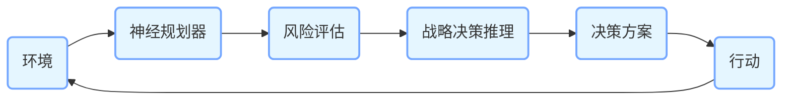

# 神经规划器在战略决策推理中的风险评估能力提升

> 关键词：神经规划器、战略决策推理、风险评估、人工智能、机器学习、决策模型、不确定性分析

> 摘要：本文聚焦于神经规划器在战略决策推理中风险评估能力的提升。首先介绍了研究的背景、目的、预期读者等基础信息，深入剖析神经规划器的核心概念与联系，阐述其工作原理和架构。详细讲解核心算法原理并给出Python源代码示例，通过数学模型和公式进一步说明风险评估的理论依据。结合项目实战，展示代码实现和解读，分析其在实际中的应用效果。探讨神经规划器在不同场景下的实际应用，推荐相关的学习资源、开发工具和论文著作。最后总结神经规划器的未来发展趋势与挑战，解答常见问题并提供扩展阅读和参考资料，旨在为提升神经规划器在战略决策推理中的风险评估能力提供全面的理论和实践指导。

## 1. 背景介绍 
### 1.1 目的和范围
在当今复杂多变的商业、军事、社会等各种领域中，战略决策的重要性不言而喻。战略决策往往伴随着诸多不确定性和风险，准确地评估这些风险对于做出明智的决策至关重要。神经规划器作为一种结合了人工智能和规划技术的工具，在战略决策推理中具有巨大的潜力。本研究的目的在于深入探讨如何提升神经规划器在战略决策推理中的风险评估能力，以更好地应对各种复杂情况，为决策者提供更可靠的依据。

本研究的范围涵盖了神经规划器的基本原理、相关算法、数学模型，以及在不同领域的实际应用。通过理论分析和实际案例研究，探索提升风险评估能力的有效方法和途径。

### 1.2 预期读者
本文预期读者包括人工智能领域的研究人员、工程师、战略决策制定者、企业管理人员等。对于对神经规划器和战略决策推理感兴趣的初学者，也可以作为了解该领域的参考资料。

### 1.3 文档结构概述
本文将按照以下结构展开：首先介绍神经规划器的背景信息，包括目的、预期读者等；接着阐述神经规划器的核心概念与联系，展示其原理和架构；然后详细讲解核心算法原理并给出具体操作步骤，通过Python代码示例进行说明；随后介绍相关的数学模型和公式，并举例说明；通过项目实战展示代码实现和解读；探讨神经规划器在实际中的应用场景；推荐相关的工具和资源；总结神经规划器的未来发展趋势与挑战；解答常见问题并提供扩展阅读和参考资料。

### 1.4 术语表
#### 1.4.1 核心术语定义
- **神经规划器（Neural Planner）**：一种基于神经网络的规划系统，结合了人工智能的学习能力和规划技术的决策能力，用于解决复杂的规划问题。
- **战略决策推理（Strategic Decision Reasoning）**：在面对复杂的战略环境时，通过分析各种因素和信息，做出合理决策的过程。
- **风险评估（Risk Assessment）**：对可能发生的风险进行识别、分析和评估的过程，以确定风险的可能性和影响程度。
- **不确定性（Uncertainty）**：指在决策过程中，由于信息不完整、环境变化等因素导致的结果的不可预测性。

#### 1.4.2 相关概念解释
- **神经网络（Neural Network）**：一种模仿人类神经系统的计算模型，由大量的神经元组成，通过学习数据中的模式和规律来进行预测和决策。
- **规划（Planning）**：在给定目标和约束条件下，寻找一系列行动序列以实现目标的过程。
- **决策模型（Decision Model）**：用于描述决策过程和规则的数学模型，帮助决策者做出最优决策。

#### 1.4.3 缩略词列表
- **AI**：人工智能（Artificial Intelligence）
- **ML**：机器学习（Machine Learning）
- **NN**：神经网络（Neural Network）

## 2. 核心概念与联系 
### 2.1 神经规划器的原理
神经规划器的核心思想是将神经网络的学习能力与传统规划技术相结合。传统规划技术通常基于符号推理和搜索算法，能够处理明确的目标和约束条件，但在面对复杂的、不确定的环境时，其能力有限。而神经网络具有强大的学习能力，能够从大量的数据中提取模式和规律，对不确定性进行建模。

神经规划器通过神经网络对环境进行感知和建模，预测不同行动的结果和风险。然后，基于这些预测，使用规划算法生成最优的行动序列。在这个过程中，神经网络不断学习和更新，以提高对环境的理解和预测能力。

### 2.2 战略决策推理与风险评估的关系
战略决策推理是一个复杂的过程，需要考虑多个因素和目标。风险评估是战略决策推理中的重要环节，它能够帮助决策者识别和量化潜在的风险，从而在决策过程中采取相应的措施来降低风险。

在战略决策推理中，风险评估可以为决策者提供关于不同决策方案的风险信息，帮助他们在追求目标的同时，平衡风险和收益。例如，在企业战略决策中，风险评估可以帮助企业识别市场风险、竞争风险、技术风险等，从而制定相应的风险管理策略。

### 2.3 神经规划器在战略决策推理中的作用
神经规划器在战略决策推理中具有重要作用。它可以通过对环境的感知和建模，提供更准确的风险评估信息。神经规划器能够处理复杂的、不确定的环境，学习环境中的模式和规律，从而更好地预测不同决策方案的风险和结果。

此外，神经规划器还可以根据风险评估结果，生成最优的决策方案。它可以在考虑风险的前提下，寻找实现目标的最佳行动序列，帮助决策者做出更明智的决策。

### 2.4 核心概念架构示意图

该示意图展示了神经规划器在战略决策推理中的工作流程。环境信息输入到神经规划器中，神经规划器进行风险评估，评估结果用于战略决策推理，生成决策方案，最终采取行动，行动的结果又反馈到环境中。

## 3. 核心算法原理 & 具体操作步骤 
### 3.1 神经规划器的核心算法
神经规划器的核心算法通常包括神经网络的训练和规划算法的应用。以下是一个简化的神经规划器算法流程：

1. **环境感知**：使用传感器或其他数据源获取环境信息。
2. **特征提取**：从环境信息中提取有用的特征。
3. **神经网络训练**：使用提取的特征训练神经网络，使其能够预测不同行动的结果和风险。
4. **规划算法**：基于神经网络的预测结果，使用规划算法生成最优的行动序列。
5. **执行行动**：按照生成的行动序列执行行动。
6. **反馈和更新**：根据行动的结果，更新神经网络的参数，以提高其预测能力。

### 3.2 Python源代码示例
以下是一个简单的Python代码示例，展示了神经规划器的基本实现过程。假设我们要解决一个简单的路径规划问题，在一个二维网格环境中找到从起点到终点的最短路径，同时考虑障碍物和风险。

```python
import numpy as np
import torch
import torch.nn as nn
import torch.optim as optim

# 定义神经网络模型
class NeuralPlanner(nn.Module):
    def __init__(self, input_size, hidden_size, output_size):
        super(NeuralPlanner, self).__init__()
        self.fc1 = nn.Linear(input_size, hidden_size)
        self.relu = nn.ReLU()
        self.fc2 = nn.Linear(hidden_size, output_size)

    def forward(self, x):
        out = self.fc1(x)
        out = self.relu(out)
        out = self.fc2(out)
        return out

# 环境定义
grid_size = 10
start = (0, 0)
goal = (9, 9)
obstacles = [(3, 3), (4, 4), (5, 5)]

# 生成训练数据
def generate_data(num_samples):
    data = []
    labels = []
    for _ in range(num_samples):
        state = np.random.randint(0, grid_size, size=(2,))
        action = np.random.randint(0, 4)  # 0: up, 1: down, 2: left, 3: right
        next_state, risk = simulate_action(state, action)
        data.append(np.concatenate((state, [action])))
        labels.append(np.concatenate((next_state, [risk])))
    return np.array(data), np.array(labels)

# 模拟行动结果
def simulate_action(state, action):
    x, y = state
    if action == 0:  # up
        x = max(0, x - 1)
    elif action == 1:  # down
        x = min(grid_size - 1, x + 1)
    elif action == 2:  # left
        y = max(0, y - 1)
    elif action == 3:  # right
        y = min(grid_size - 1, y + 1)
    next_state = (x, y)
    if next_state in obstacles:
        risk = 1
    else:
        risk = 0
    return next_state, risk

# 训练神经网络
input_size = 3
hidden_size = 10
output_size = 3
model = NeuralPlanner(input_size, hidden_size, output_size)
criterion = nn.MSELoss()
optimizer = optim.Adam(model.parameters(), lr=0.001)

num_epochs = 1000
num_samples = 1000
for epoch in range(num_epochs):
    data, labels = generate_data(num_samples)
    data = torch.FloatTensor(data)
    labels = torch.FloatTensor(labels)

    optimizer.zero_grad()
    outputs = model(data)
    loss = criterion(outputs, labels)
    loss.backward()
    optimizer.step()

    if (epoch + 1) % 100 == 0:
        print(f'Epoch [{epoch+1}/{num_epochs}], Loss: {loss.item():.4f}')

# 规划算法（简单的贪心算法）
def greedy_planner(state):
    best_action = None
    best_risk = float('inf')
    for action in range(4):
        next_state, risk = simulate_action(state, action)
        if risk < best_risk:
            best_risk = risk
            best_action = action
    return best_action

# 执行规划
current_state = start
path = [current_state]
while current_state != goal:
    action = greedy_planner(current_state)
    next_state, _ = simulate_action(current_state, action)
    current_state = next_state
    path.append(current_state)

print('Path:', path)
```

### 3.3 具体操作步骤
1. **环境定义**：定义二维网格环境的大小、起点、终点和障碍物位置。
2. **数据生成**：生成训练数据，包括当前状态、行动、下一个状态和风险。
3. **神经网络训练**：使用生成的数据训练神经网络，使其能够预测下一个状态和风险。
4. **规划算法**：使用贪心算法进行路径规划，选择风险最小的行动。
5. **执行规划**：从起点开始，按照规划的路径行动，直到到达终点。

## 4. 数学模型和公式 & 详细讲解 & 举例说明 
### 4.1 风险评估的数学模型
风险评估可以使用概率模型来描述。假设在战略决策中，有 $n$ 个可能的决策方案 $d_1, d_2, \cdots, d_n$，每个决策方案可能面临 $m$ 种风险事件 $r_1, r_2, \cdots, r_m$。

定义风险事件 $r_j$ 发生的概率为 $P(r_j)$，决策方案 $d_i$ 在风险事件 $r_j$ 发生时的损失为 $L(d_i, r_j)$。则决策方案 $d_i$ 的期望风险 $R(d_i)$ 可以表示为：

$$R(d_i) = \sum_{j=1}^{m} P(r_j) \cdot L(d_i, r_j)$$

### 4.2 详细讲解
这个公式的含义是，决策方案 $d_i$ 的期望风险是所有可能风险事件的概率乘以在这些风险事件发生时的损失的总和。通过计算期望风险，我们可以对不同决策方案的风险进行量化比较，从而选择风险最小的方案。

### 4.3 举例说明
假设我们要投资一个项目，有两个决策方案：方案 $A$ 和方案 $B$。可能面临的风险事件有市场风险和技术风险。

市场风险发生的概率 $P(r_1) = 0.3$，技术风险发生的概率 $P(r_2) = 0.2$。

方案 $A$ 在市场风险发生时的损失 $L(A, r_1) = 100$ 万元，在技术风险发生时的损失 $L(A, r_2) = 50$ 万元。

方案 $B$ 在市场风险发生时的损失 $L(B, r_1) = 80$ 万元，在技术风险发生时的损失 $L(B, r_2) = 60$ 万元。

则方案 $A$ 的期望风险为：

$$R(A) = P(r_1) \cdot L(A, r_1) + P(r_2) \cdot L(A, r_2) = 0.3 \times 100 + 0.2 \times 50 = 30 + 10 = 40 \text{ 万元}$$

方案 $B$ 的期望风险为：

$$R(B) = P(r_1) \cdot L(B, r_1) + P(r_2) \cdot L(B, r_2) = 0.3 \times 80 + 0.2 \times 60 = 24 + 12 = 36 \text{ 万元}$$

比较两个方案的期望风险，方案 $B$ 的风险更小，因此在决策时可以优先考虑方案 $B$。

## 5. 项目实战：代码实际案例和详细解释说明 
### 5.1  开发环境搭建
在进行神经规划器的项目实战之前，需要搭建相应的开发环境。以下是具体的步骤：

1. **安装Python**：建议使用Python 3.7及以上版本。可以从Python官方网站（https://www.python.org/downloads/）下载并安装。
2. **安装深度学习框架**：本文使用PyTorch作为深度学习框架。可以使用以下命令安装：
```sh
pip install torch torchvision
```
3. **安装其他依赖库**：根据项目需要，可能还需要安装NumPy、Matplotlib等库。可以使用以下命令安装：
```sh
pip install numpy matplotlib
```

### 5.2  源代码详细实现和代码解读
以下是一个更完整的项目实战代码示例，用于解决一个机器人路径规划问题，同时考虑风险评估。

```python
import numpy as np
import torch
import torch.nn as nn
import torch.optim as optim
import matplotlib.pyplot as plt

# 定义神经网络模型
class NeuralPlanner(nn.Module):
    def __init__(self, input_size, hidden_size, output_size):
        super(NeuralPlanner, self).__init__()
        self.fc1 = nn.Linear(input_size, hidden_size)
        self.relu = nn.ReLU()
        self.fc2 = nn.Linear(hidden_size, output_size)

    def forward(self, x):
        out = self.fc1(x)
        out = self.relu(out)
        out = self.fc2(out)
        return out

# 环境定义
grid_size = 20
start = (0, 0)
goal = (19, 19)
obstacles = [(5, 5), (6, 6), (7, 7), (8, 8), (9, 9)]
risk_areas = [(10, 10), (11, 11), (12, 12), (13, 13), (14, 14)]

# 生成训练数据
def generate_data(num_samples):
    data = []
    labels = []
    for _ in range(num_samples):
        state = np.random.randint(0, grid_size, size=(2,))
        action = np.random.randint(0, 4)  # 0: up, 1: down, 2: left, 3: right
        next_state, risk = simulate_action(state, action)
        data.append(np.concatenate((state, [action])))
        labels.append(np.concatenate((next_state, [risk])))
    return np.array(data), np.array(labels)

# 模拟行动结果
def simulate_action(state, action):
    x, y = state
    if action == 0:  # up
        x = max(0, x - 1)
    elif action == 1:  # down
        x = min(grid_size - 1, x + 1)
    elif action == 2:  # left
        y = max(0, y - 1)
    elif action == 3:  # right
        y = min(grid_size - 1, y + 1)
    next_state = (x, y)
    if next_state in obstacles:
        risk = 100
    elif next_state in risk_areas:
        risk = 10
    else:
        risk = 0
    return next_state, risk

# 训练神经网络
input_size = 3
hidden_size = 20
output_size = 3
model = NeuralPlanner(input_size, hidden_size, output_size)
criterion = nn.MSELoss()
optimizer = optim.Adam(model.parameters(), lr=0.001)

num_epochs = 2000
num_samples = 2000
losses = []
for epoch in range(num_epochs):
    data, labels = generate_data(num_samples)
    data = torch.FloatTensor(data)
    labels = torch.FloatTensor(labels)

    optimizer.zero_grad()
    outputs = model(data)
    loss = criterion(outputs, labels)
    loss.backward()
    optimizer.step()

    losses.append(loss.item())
    if (epoch + 1) % 100 == 0:
        print(f'Epoch [{epoch+1}/{num_epochs}], Loss: {loss.item():.4f}')

# 绘制损失曲线
plt.plot(losses)
plt.xlabel('Epoch')
plt.ylabel('Loss')
plt.title('Training Loss')
plt.show()

# 规划算法（A*算法）
import heapq

def heuristic(state, goal):
    return abs(state[0] - goal[0]) + abs(state[1] - goal[1])

def a_star_planner(start, goal):
    open_list = []
    closed_set = set()
    heapq.heappush(open_list, (0, start, []))
    while open_list:
        _, current_state, path = heapq.heappop(open_list)
        if current_state == goal:
            return path + [current_state]
        if current_state in closed_set:
            continue
        closed_set.add(current_state)
        for action in range(4):
            next_state, risk = simulate_action(current_state, action)
            new_path = path + [current_state]
            cost = len(new_path) + heuristic(next_state, goal) + risk
            heapq.heappush(open_list, (cost, next_state, new_path))
    return None

# 执行规划
path = a_star_planner(start, goal)
print('Path:', path)

# 绘制路径
grid = np.zeros((grid_size, grid_size))
for obs in obstacles:
    grid[obs[0], obs[1]] = 1
for risk_area in risk_areas:
    grid[risk_area[0], risk_area[1]] = 0.5
if path:
    for p in path:
        grid[p[0], p[1]] = 2
plt.imshow(grid, cmap='gray')
plt.title('Path Planning with Risk Assessment')
plt.show()
```

### 5.3  代码解读与分析
1. **神经网络模型**：定义了一个简单的全连接神经网络 `NeuralPlanner`，用于预测下一个状态和风险。
2. **环境定义**：定义了二维网格环境的大小、起点、终点、障碍物和风险区域。
3. **数据生成**：随机生成训练数据，包括当前状态、行动、下一个状态和风险。
4. **神经网络训练**：使用生成的数据训练神经网络，通过最小化均方误差损失来优化模型参数。
5. **规划算法**：使用A*算法进行路径规划，考虑了风险因素。
6. **执行规划**：从起点开始，使用A*算法找到到达终点的路径，并绘制路径图。

通过这个项目实战，我们可以看到神经规划器在路径规划问题中的应用，同时考虑了风险评估。神经网络可以学习环境的模式和规律，为规划算法提供更准确的风险信息，从而生成更优的路径。

## 6. 实际应用场景 
### 6.1 商业决策
在商业领域，神经规划器可以用于战略决策推理和风险评估。例如，在市场进入决策中，企业需要考虑市场需求、竞争态势、政策法规等多种因素，以及可能面临的风险，如市场波动、技术变革、竞争对手反击等。神经规划器可以通过对市场数据的分析和学习，预测不同市场进入策略的风险和收益，帮助企业制定最优的决策方案。

### 6.2 军事战略
在军事领域，战略决策的正确性直接关系到战争的胜负。神经规划器可以用于军事作战计划的制定和风险评估。例如，在制定作战计划时，需要考虑敌方的兵力部署、地形地貌、天气条件等因素，以及可能面临的风险，如敌方的反击、伏击等。神经规划器可以通过对战场信息的感知和分析，预测不同作战计划的风险和效果，帮助指挥官做出更明智的决策。

### 6.3 医疗决策
在医疗领域，神经规划器可以用于疾病诊断和治疗方案的制定。例如，在诊断疾病时，需要考虑患者的症状、体征、检查结果等因素，以及可能的误诊风险。神经规划器可以通过对大量医疗数据的学习，预测不同疾病的可能性和风险，帮助医生做出更准确的诊断。在制定治疗方案时，需要考虑患者的身体状况、疾病的严重程度、治疗方法的副作用等因素，以及可能的治疗失败风险。神经规划器可以通过对患者个体信息的分析，预测不同治疗方案的风险和效果，帮助医生选择最优的治疗方案。

### 6.4 交通规划
在交通领域，神经规划器可以用于交通流量预测和路线规划。例如，在城市交通规划中，需要考虑人口分布、道路状况、交通需求等因素，以及可能的交通拥堵风险。神经规划器可以通过对交通数据的分析和学习，预测不同时间段的交通流量和拥堵风险，帮助交通管理部门制定合理的交通规划和疏导策略。在导航系统中，神经规划器可以根据实时交通信息和用户的目的地，为用户规划最优的路线，同时考虑路线的风险，如道路施工、事故等。

## 7. 工具和资源推荐
### 7.1 学习资源推荐
#### 7.1.1 书籍推荐
- 《人工智能：一种现代的方法》（Artificial Intelligence: A Modern Approach）：这是一本经典的人工智能教材，全面介绍了人工智能的各个领域，包括规划、机器学习、神经网络等。
- 《深度学习》（Deep Learning）：由Ian Goodfellow、Yoshua Bengio和Aaron Courville合著，是深度学习领域的权威著作，详细介绍了深度学习的原理、算法和应用。
- 《Python机器学习》（Python Machine Learning）：本书介绍了如何使用Python进行机器学习，包括神经网络、决策树、支持向量机等算法的实现和应用。

#### 7.1.2 在线课程
- Coursera上的“人工智能基础”（Foundations of Artificial Intelligence）课程：由哥伦比亚大学的教授授课，系统地介绍了人工智能的基本概念、算法和应用。
- edX上的“深度学习专项课程”（Deep Learning Specialization）：由Andrew Ng教授授课，深入讲解了深度学习的原理和实践，包括神经网络、卷积神经网络、循环神经网络等。
- Udemy上的“Python数据科学和机器学习实战”（Python for Data Science and Machine Learning Bootcamp）课程：通过实际案例介绍了如何使用Python进行数据科学和机器学习，适合初学者。

#### 7.1.3 技术博客和网站
- Medium：是一个技术博客平台，有很多关于人工智能、机器学习、神经规划器等领域的优秀文章。
- Towards Data Science：专注于数据科学和机器学习领域，提供了很多实用的技术文章和案例分析。
- arXiv：是一个预印本服务器，包含了很多最新的学术研究论文，对于了解神经规划器的最新研究成果非常有帮助。

### 7.2 开发工具框架推荐
#### 7.2.1 IDE和编辑器
- PyCharm：是一款专门为Python开发设计的集成开发环境（IDE），具有强大的代码编辑、调试、代码分析等功能。
- Jupyter Notebook：是一个交互式的开发环境，适合进行数据探索、模型训练和可视化。
- Visual Studio Code：是一款轻量级的代码编辑器，支持多种编程语言和插件，可用于Python开发。

#### 7.2.2 调试和性能分析工具
- PyTorch Profiler：是PyTorch自带的性能分析工具，可以帮助开发者分析模型的性能瓶颈，优化代码。
- TensorBoard：是TensorFlow的可视化工具，也可以与PyTorch结合使用，用于可视化训练过程和模型性能。
- cProfile：是Python标准库中的性能分析工具，可以帮助开发者分析代码的性能瓶颈。

#### 7.2.3 相关框架和库
- PyTorch：是一个开源的深度学习框架，提供了丰富的神经网络模型和优化算法，适合进行神经规划器的开发。
- TensorFlow：是另一个流行的深度学习框架，具有强大的分布式训练和部署能力。
- NumPy：是Python中用于科学计算的基础库，提供了高效的数组操作和数学函数。
- Matplotlib：是Python中用于数据可视化的库，可以帮助开发者直观地展示数据和模型性能。

### 7.3 相关论文著作推荐
#### 7.3.1 经典论文
- “A* Search Algorithm”：介绍了A*搜索算法的原理和应用，是路径规划领域的经典论文。
- “Neural Networks and Deep Learning”：由Michael Nielsen撰写，系统地介绍了神经网络和深度学习的基本原理和算法。
- “Probabilistic Robotics”：由Sebastian Thrun、Wolfram Burgard和Dieter Fox合著，介绍了概率机器人学的理论和方法，包括机器人的定位、建图和规划等。

#### 7.3.2 最新研究成果
- 可以通过arXiv、IEEE Xplore、ACM Digital Library等学术数据库搜索关于神经规划器、战略决策推理和风险评估的最新研究论文。关注顶级学术会议，如NeurIPS（神经信息处理系统大会）、ICML（国际机器学习会议）、AAAI（美国人工智能协会年会）等，这些会议上发表的论文通常代表了该领域的最新研究成果。

#### 7.3.3 应用案例分析
- 可以参考一些实际应用案例分析的论文和报告，了解神经规划器在不同领域的应用效果和经验教训。例如，一些关于企业战略决策、军事作战计划、医疗诊断和治疗等方面的案例分析，对于理解神经规划器的实际应用具有重要的参考价值。

## 8. 总结：未来发展趋势与挑战
### 8.1 未来发展趋势
- **多模态融合**：未来的神经规划器将更加注重多模态信息的融合，如视觉、听觉、触觉等信息。通过融合多种模态的信息，可以更全面地感知环境，提高风险评估的准确性。
- **强化学习与神经规划的结合**：强化学习可以让神经规划器在与环境的交互中不断学习和优化决策策略。未来，强化学习与神经规划的结合将更加紧密，使神经规划器能够在复杂的动态环境中做出更优的决策。
- **可解释性增强**：随着人工智能技术的广泛应用，对模型可解释性的需求越来越高。未来的神经规划器将更加注重可解释性，能够向决策者解释其决策过程和风险评估结果，提高决策的可信度。
- **跨领域应用拓展**：神经规划器将在更多领域得到应用，如能源管理、环境保护、金融投资等。通过跨领域的应用拓展，可以充分发挥神经规划器的优势，为不同领域的决策提供支持。

### 8.2 挑战
- **数据质量和数量**：神经规划器的性能很大程度上依赖于数据的质量和数量。在实际应用中，获取高质量、大规模的数据往往是一个挑战。此外，数据的标注和预处理也需要耗费大量的人力和时间。
- **计算资源需求**：神经规划器通常需要大量的计算资源来进行模型训练和推理。在一些资源受限的环境中，如嵌入式设备、移动设备等，如何在有限的计算资源下实现高效的神经规划是一个挑战。
- **不确定性处理**：战略决策推理中往往存在大量的不确定性，如环境变化、对手行为等。如何有效地处理这些不确定性，提高神经规划器的鲁棒性和适应性是一个亟待解决的问题。
- **伦理和法律问题**：随着神经规划器在各个领域的应用，伦理和法律问题也日益凸显。例如，如何确保神经规划器的决策符合道德和法律规范，如何处理因神经规划器决策失误导致的责任问题等。

## 9. 附录：常见问题与解答
### 9.1 神经规划器与传统规划算法有什么区别？
神经规划器与传统规划算法的主要区别在于其使用神经网络来处理不确定性和学习环境的模式和规律。传统规划算法通常基于符号推理和搜索算法，适用于处理明确的目标和约束条件。而神经规划器能够从大量的数据中学习，对复杂的、不确定的环境进行建模和预测，从而生成更优的决策方案。

### 9.2 如何评估神经规划器的风险评估能力？
可以通过以下几种方法评估神经规划器的风险评估能力：
- **准确性**：比较神经规划器预测的风险与实际发生的风险之间的差异，评估其预测的准确性。
- **鲁棒性**：在不同的环境条件下，测试神经规划器的风险评估能力，评估其在面对不确定性和干扰时的鲁棒性。
- **可解释性**：评估神经规划器的风险评估结果是否能够被解释和理解，提高决策的可信度。

### 9.3 神经规划器在实际应用中可能面临哪些问题？
神经规划器在实际应用中可能面临以下问题：
- **数据问题**：数据质量和数量不足可能影响神经规划器的性能。
- **计算资源问题**：神经规划器的训练和推理需要大量的计算资源，在资源受限的环境中可能无法正常运行。
- **不确定性问题**：战略决策推理中存在大量的不确定性，神经规划器可能无法准确地处理这些不确定性。
- **伦理和法律问题**：神经规划器的决策可能会对社会和个人产生影响，需要考虑伦理和法律问题。

### 9.4 如何提高神经规划器的风险评估能力？
可以通过以下几种方法提高神经规划器的风险评估能力：
- **数据增强**：通过收集更多的数据、进行数据预处理和数据增强等方法，提高数据的质量和数量。
- **模型优化**：选择合适的神经网络模型和优化算法，对模型进行训练和调优，提高模型的性能。
- **多模态融合**：融合多种模态的信息，如视觉、听觉、触觉等信息，更全面地感知环境，提高风险评估的准确性。
- **不确定性处理**：采用概率模型、贝叶斯方法等技术，有效地处理不确定性，提高神经规划器的鲁棒性和适应性。

## 10. 扩展阅读 & 参考资料
### 10.1 扩展阅读
- 《人工智能与社会》（Artificial Intelligence and Society）：探讨了人工智能技术对社会、经济、伦理等方面的影响，对于理解神经规划器在实际应用中的背景和意义具有重要的参考价值。
- 《智能时代》（The Age of Intelligence）：介绍了智能技术的发展趋势和应用前景，包括人工智能、机器学习、大数据等领域，为读者提供了一个全面的智能时代的视角。
- 《未来简史：从智人到神人》（Homo Deus: A Brief History of Tomorrow）：作者尤瓦尔·赫拉利探讨了人类未来的发展方向，包括人工智能对人类社会的影响，引发读者对未来的思考。

### 10.2 参考资料
- 相关学术论文和研究报告，如在IEEE Xplore、ACM Digital Library、arXiv等学术数据库中搜索到的关于神经规划器、战略决策推理和风险评估的论文。
- 开源代码库，如GitHub上的相关项目，可用于参考和学习神经规划器的实现和应用。
- 官方文档和技术手册，如PyTorch、TensorFlow等深度学习框架的官方文档，可用于了解框架的使用方法和API。