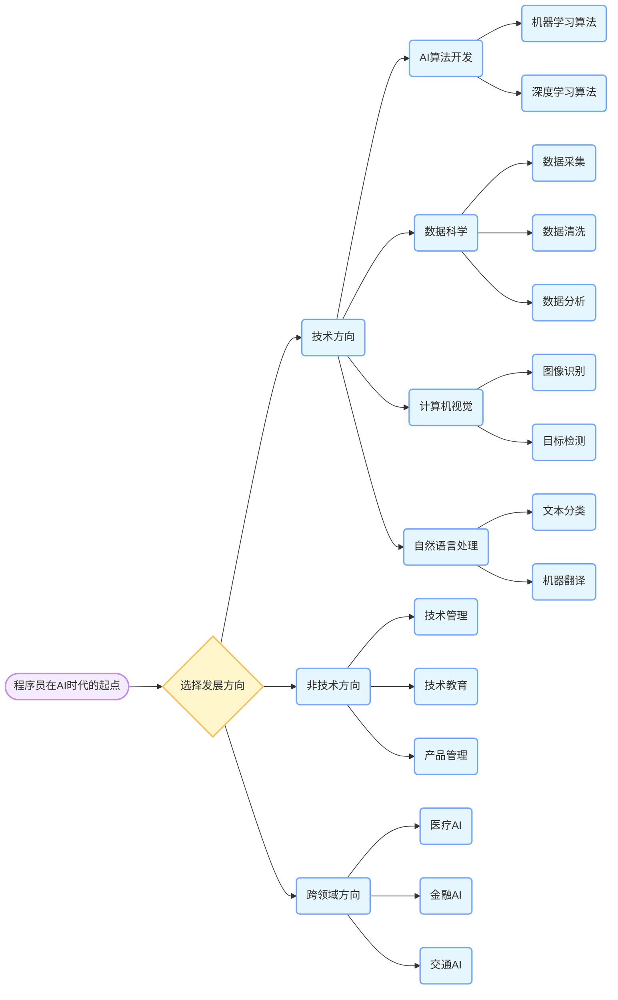

# 程序员在AI时代的多元化发展路径

> 关键词：程序员、AI时代、多元化发展、技术转型、职业路径

> 摘要：随着AI技术的迅猛发展，程序员所处的行业环境发生了深刻变化。本文旨在探讨程序员在AI时代的多元化发展路径，分析背景、核心概念，阐述相关算法原理和数学模型，通过项目实战案例说明具体操作，介绍实际应用场景和相关工具资源，总结未来发展趋势与挑战，解答常见问题，为程序员在AI时代的职业发展提供全面且深入的指导。

## 1. 背景介绍 
### 1.1 目的和范围
在AI技术蓬勃兴起的当下，程序员面临着新的机遇和挑战。本文章的目的在于全面分析程序员在AI时代可以选择的多元化发展路径，涵盖从技术转型到跨领域融合等多个方面。范围涉及AI相关的技术领域、不同行业对程序员的需求变化，以及如何利用AI技术提升程序员的职业价值和竞争力。

### 1.2 预期读者
本文预期读者主要为广大程序员群体，包括有一定编程基础但希望在AI时代拓展职业道路的初级程序员，寻求技术转型和职业突破的中级程序员，以及关注行业趋势、思考战略布局的高级程序员和技术管理者。同时，对IT行业发展趋势感兴趣的相关人员也可以从中获取有价值的信息。

### 1.3 文档结构概述
本文将首先介绍相关背景知识，包括目的、预期读者和文档结构等。接着阐述核心概念与联系，通过文本示意图和Mermaid流程图展示AI与程序员职业发展的关系。然后详细讲解核心算法原理及具体操作步骤，结合Python源代码进行说明。之后介绍数学模型和公式，并举例说明其在实际中的应用。通过项目实战案例，展示代码实现和详细解读。再介绍实际应用场景，推荐相关的工具和资源。最后总结未来发展趋势与挑战，解答常见问题，并提供扩展阅读和参考资料。

### 1.4 术语表
#### 1.4.1 核心术语定义
- **AI（Artificial Intelligence）**：即人工智能，是研究、开发用于模拟、延伸和扩展人的智能的理论、方法、技术及应用系统的一门新的技术科学。
- **机器学习（Machine Learning）**：是一门多领域交叉学科，涉及概率论、统计学、逼近论、凸分析、算法复杂度理论等多门学科。它专门研究计算机怎样模拟或实现人类的学习行为，以获取新的知识或技能，重新组织已有的知识结构使之不断改善自身的性能。
- **深度学习（Deep Learning）**：是机器学习的一个分支领域，它是一种基于对数据进行表征学习的方法。深度学习通过构建具有很多层的神经网络模型，自动从大量数据中学习特征和模式。
- **数据挖掘（Data Mining）**：是指从大量的数据中通过算法搜索隐藏于其中信息的过程。数据挖掘通常与计算机科学有关，并通过统计、在线分析处理、情报检索、机器学习、专家系统（依靠过去的经验法则）和模式识别等诸多方法来实现上述目标。

#### 1.4.2 相关概念解释
- **AI时代**：指人工智能技术在各个领域得到广泛应用和快速发展的时代，这个时代以AI技术为核心驱动力，推动各个行业的变革和创新。
- **多元化发展路径**：指程序员不再局限于传统的编程领域，而是可以在AI相关的多个方向进行发展，如AI算法开发、数据科学、AI与行业应用结合等，也可以向管理、教育等非技术领域拓展。

#### 1.4.3 缩略词列表
- **ML（Machine Learning）**：机器学习
- **DL（Deep Learning）**：深度学习
- **NLP（Natural Language Processing）**：自然语言处理
- **CV（Computer Vision）**：计算机视觉

## 2. 核心概念与联系 
### 核心概念原理
在AI时代，程序员的多元化发展路径主要基于以下几个核心概念：
- **技术融合**：AI技术与传统编程技术相互融合，程序员需要掌握AI相关的算法和工具，将其应用到传统的软件开发中，提升软件的智能水平。例如，在游戏开发中加入AI角色，使其能够根据玩家的行为做出智能反应。
- **跨领域应用**：AI技术可以应用到各个行业，程序员可以结合不同行业的需求，开发出具有针对性的AI应用。比如，在医疗行业，利用AI技术进行疾病诊断和影像分析；在金融行业，利用AI技术进行风险评估和投资决策。
- **数据驱动**：AI的发展离不开大量的数据，程序员需要具备数据处理和分析的能力，从数据中挖掘有价值的信息，为AI模型的训练和优化提供支持。

### 架构的文本示意图
```plaintext
程序员在AI时代的多元化发展路径
|-- 技术方向
|   |-- AI算法开发
|   |   |-- 机器学习算法
|   |   |-- 深度学习算法
|   |-- 数据科学
|   |   |-- 数据采集
|   |   |-- 数据清洗
|   |   |-- 数据分析
|   |-- 计算机视觉
|   |   |-- 图像识别
|   |   |-- 目标检测
|   |-- 自然语言处理
|   |   |-- 文本分类
|   |   |-- 机器翻译
|-- 非技术方向
|   |-- 技术管理
|   |-- 技术教育
|   |-- 产品管理
|-- 跨领域方向
|   |-- 医疗AI
|   |-- 金融AI
|   |-- 交通AI
```

### Mermaid流程图


## 3. 核心算法原理 & 具体操作步骤 
### 机器学习算法原理 - 线性回归
线性回归是一种简单而常用的机器学习算法，用于预测连续数值。其基本原理是通过找到一条直线，使得所有数据点到该直线的距离之和最小。

#### 数学原理
线性回归的模型可以表示为：
$$y = \theta_0 + \theta_1x_1 + \theta_2x_2 + \cdots + \theta_nx_n$$
其中，$y$ 是预测值，$x_1, x_2, \cdots, x_n$ 是输入特征，$\theta_0, \theta_1, \cdots, \theta_n$ 是模型的参数。

我们的目标是找到一组最优的参数 $\theta$，使得预测值 $y$ 与真实值之间的误差最小。通常使用均方误差（Mean Squared Error，MSE）作为损失函数：
$$MSE = \frac{1}{m}\sum_{i=1}^{m}(y^{(i)} - \hat{y}^{(i)})^2$$
其中，$m$ 是样本数量，$y^{(i)}$ 是第 $i$ 个样本的真实值，$\hat{y}^{(i)}$ 是第 $i$ 个样本的预测值。

#### Python源代码实现
```python
import numpy as np

class LinearRegression:
    def __init__(self):
        self.theta = None

    def fit(self, X, y):
        # 添加偏置项
        X_b = np.c_[np.ones((X.shape[0], 1)), X]
        # 使用正规方程求解参数
        self.theta = np.linalg.inv(X_b.T.dot(X_b)).dot(X_b.T).dot(y)

    def predict(self, X):
        X_b = np.c_[np.ones((X.shape[0], 1)), X]
        return X_b.dot(self.theta)

# 示例数据
X = np.array([[1], [2], [3], [4], [5]])
y = np.array([2, 4, 6, 8, 10])

# 创建线性回归模型
model = LinearRegression()
# 训练模型
model.fit(X, y)
# 预测新数据
new_X = np.array([[6]])
prediction = model.predict(new_X)
print("预测值:", prediction)
```

### 具体操作步骤
1. **数据准备**：收集和整理相关的数据，将其分为输入特征 $X$ 和目标值 $y$。
2. **模型选择**：根据问题的特点选择合适的机器学习算法，如线性回归。
3. **模型训练**：使用训练数据对模型进行训练，通过最小化损失函数来调整模型的参数。
4. **模型评估**：使用测试数据对训练好的模型进行评估，计算评估指标，如均方误差、准确率等。
5. **模型应用**：将训练好的模型应用到新的数据上，进行预测或分类。

## 4. 数学模型和公式 & 详细讲解 & 举例说明 
### 逻辑回归的数学模型和公式
逻辑回归是一种用于分类问题的机器学习算法，它通过逻辑函数将线性回归的输出映射到 $[0, 1]$ 之间的概率值。

#### 逻辑函数
逻辑函数（也称为Sigmoid函数）的定义如下：
$$\sigma(z) = \frac{1}{1 + e^{-z}}$$
其中，$z$ 是线性回归的输出：
$$z = \theta_0 + \theta_1x_1 + \theta_2x_2 + \cdots + \theta_nx_n$$

#### 概率模型
逻辑回归的概率模型可以表示为：
$$P(y = 1|x; \theta) = \sigma(\theta^T x)$$
$$P(y = 0|x; \theta) = 1 - \sigma(\theta^T x)$$
其中，$y$ 是类别标签，$x$ 是输入特征，$\theta$ 是模型的参数。

#### 损失函数
逻辑回归通常使用对数损失函数（也称为交叉熵损失函数）：
$$J(\theta) = -\frac{1}{m}\sum_{i=1}^{m}[y^{(i)}\log(\sigma(\theta^T x^{(i)})) + (1 - y^{(i)})\log(1 - \sigma(\theta^T x^{(i)}))]$$
其中，$m$ 是样本数量，$y^{(i)}$ 是第 $i$ 个样本的真实标签，$x^{(i)}$ 是第 $i$ 个样本的输入特征。

#### 举例说明
假设我们有一个二分类问题，要判断一个人是否患有某种疾病。我们收集了一些人的年龄、血压等特征作为输入 $x$，疾病标签（0 表示未患病，1 表示患病）作为目标值 $y$。使用逻辑回归模型进行训练，通过最小化对数损失函数来调整模型的参数 $\theta$。训练好的模型可以对新的人的特征进行预测，输出其患病的概率。

### 深度学习中的神经网络数学模型
深度学习中的神经网络由多个神经元组成，每个神经元可以看作是一个简单的计算单元。

#### 神经元模型
神经元的输入是一组特征 $x_1, x_2, \cdots, x_n$，每个特征有对应的权重 $w_1, w_2, \cdots, w_n$，还有一个偏置 $b$。神经元的输出 $y$ 可以表示为：
$$y = f(\sum_{i=1}^{n}w_ix_i + b)$$
其中，$f$ 是激活函数，常用的激活函数有Sigmoid函数、ReLU函数等。

#### 多层神经网络
多层神经网络由输入层、隐藏层和输出层组成。隐藏层可以有多个，每个层由多个神经元组成。前一层的输出作为后一层的输入，通过不断的计算和传递，最终得到输出层的结果。

#### 反向传播算法
反向传播算法是训练神经网络的核心算法，它通过计算损失函数对每个参数的梯度，然后使用梯度下降法来更新参数。具体来说，反向传播算法从输出层开始，依次计算每个层的误差，然后根据误差更新每个神经元的权重和偏置。

## 5. 项目实战：代码实际案例和详细解释说明 
### 5.1  开发环境搭建
#### 安装Python
首先，需要安装Python环境。可以从Python官方网站（https://www.python.org/downloads/） 下载适合自己操作系统的Python版本，并按照安装向导进行安装。

#### 安装必要的库
在项目中，我们需要使用一些常用的Python库，如NumPy、Pandas、Scikit-learn、TensorFlow等。可以使用以下命令进行安装：
```sh
pip install numpy pandas scikit-learn tensorflow
```

#### 选择开发工具
可以选择使用PyCharm、Jupyter Notebook等开发工具。PyCharm是一款功能强大的Python集成开发环境，适合大型项目的开发；Jupyter Notebook则适合交互式的数据分析和模型训练。

### 5.2  源代码详细实现和代码解读
#### 项目背景
我们要实现一个简单的手写数字识别项目，使用MNIST数据集。MNIST数据集包含60000个训练样本和10000个测试样本，每个样本是一个28x28像素的手写数字图像。

#### 代码实现
```python
import tensorflow as tf
from tensorflow.keras.datasets import mnist
from tensorflow.keras.models import Sequential
from tensorflow.keras.layers import Flatten, Dense
from tensorflow.keras.utils import to_categorical

# 加载MNIST数据集
(train_images, train_labels), (test_images, test_labels) = mnist.load_data()

# 数据预处理
train_images = train_images / 255.0
test_images = test_images / 255.0

train_labels = to_categorical(train_labels)
test_labels = to_categorical(test_labels)

# 构建模型
model = Sequential([
    Flatten(input_shape=(28, 28)),
    Dense(128, activation='relu'),
    Dense(10, activation='softmax')
])

# 编译模型
model.compile(optimizer='adam',
              loss='categorical_crossentropy',
              metrics=['accuracy'])

# 训练模型
model.fit(train_images, train_labels, epochs=5, batch_size=64)

# 评估模型
test_loss, test_acc = model.evaluate(test_images, test_labels)
print('测试准确率:', test_acc)
```

#### 代码解读
1. **数据加载**：使用 `mnist.load_data()` 函数加载MNIST数据集，将其分为训练集和测试集。
2. **数据预处理**：将图像像素值归一化到 $[0, 1]$ 之间，将标签进行one-hot编码。
3. **模型构建**：使用 `Sequential` 模型构建一个简单的神经网络，包含一个Flatten层、一个全连接层和一个输出层。
4. **模型编译**：使用 `adam` 优化器、`categorical_crossentropy` 损失函数和 `accuracy` 评估指标编译模型。
5. **模型训练**：使用 `fit` 方法对模型进行训练，设置训练轮数和批次大小。
6. **模型评估**：使用 `evaluate` 方法对模型进行评估，输出测试集的损失和准确率。

### 5.3  代码解读与分析
#### 模型结构分析
- **Flatten层**：将28x28的图像数据展平为一维向量，方便后续的全连接层处理。
- **Dense层**：全连接层，包含128个神经元，使用ReLU激活函数，增加模型的非线性能力。
- **输出层**：包含10个神经元，使用Softmax激活函数，输出每个类别的概率。

#### 损失函数和优化器分析
- **损失函数**：使用 `categorical_crossentropy` 损失函数，适用于多分类问题。
- **优化器**：使用 `adam` 优化器，它结合了Adagrad和RMSProp的优点，能够自适应地调整学习率。

#### 训练过程分析
通过设置训练轮数和批次大小，模型不断地从训练数据中学习，逐渐提高准确率。在训练过程中，可以观察到损失值逐渐下降，准确率逐渐提高。

## 6. 实际应用场景 
### 医疗领域
- **疾病诊断**：程序员可以利用AI技术开发疾病诊断系统，通过分析患者的病历、影像等数据，辅助医生进行疾病诊断。例如，使用深度学习算法对X光、CT等影像进行分析，检测肺部疾病、肿瘤等。
- **药物研发**：AI可以帮助筛选药物靶点，预测药物的疗效和副作用，加速药物研发的进程。程序员可以参与开发相关的软件和算法，提高药物研发的效率和成功率。

### 金融领域
- **风险评估**：利用AI技术对客户的信用风险、市场风险等进行评估，帮助金融机构做出更准确的决策。程序员可以开发风险评估模型，通过分析客户的财务数据、信用记录等信息，预测客户的违约概率。
- **投资决策**：AI可以分析市场数据、新闻资讯等，为投资者提供投资建议。程序员可以开发投资决策系统，利用机器学习算法对股票、基金等资产进行分析和预测。

### 交通领域
- **自动驾驶**：自动驾驶是AI技术在交通领域的重要应用。程序员可以参与开发自动驾驶汽车的软件系统，包括感知、决策、控制等模块。通过使用计算机视觉、传感器融合等技术，实现车辆的自主行驶。
- **智能交通管理**：利用AI技术对交通流量进行监测和分析，优化交通信号控制，提高交通效率。程序员可以开发智能交通管理系统，通过实时收集和处理交通数据，调整交通信号的时间和频率。

### 教育领域
- **个性化学习**：AI可以根据学生的学习情况和特点，提供个性化的学习方案和辅导。程序员可以开发个性化学习平台，利用机器学习算法对学生的学习数据进行分析，推荐适合学生的学习资源和练习题目。
- **智能教学助手**：开发智能教学助手，帮助教师进行教学管理和学生辅导。例如，使用自然语言处理技术实现智能答疑、作业批改等功能。

## 7. 工具和资源推荐
### 7.1 学习资源推荐
#### 7.1.1 书籍推荐
- 《机器学习》（周志华）：这本书是机器学习领域的经典教材，系统地介绍了机器学习的基本概念、算法和应用。
- 《深度学习》（Ian Goodfellow、Yoshua Bengio、Aaron Courville）：由深度学习领域的三位权威专家撰写，全面介绍了深度学习的理论和实践。
- 《Python机器学习实战》（Sebastian Raschka）：通过实际案例介绍了如何使用Python进行机器学习开发，适合初学者。

#### 7.1.2 在线课程
- Coursera上的《机器学习》（Andrew Ng）：由机器学习领域的知名专家Andrew Ng授课，课程内容丰富，讲解详细。
- edX上的《深度学习》：由多家顶尖高校联合推出的深度学习课程，涵盖了深度学习的各个方面。
- 中国大学MOOC上的《人工智能基础》：适合对AI感兴趣的初学者，介绍了人工智能的基本概念和方法。

#### 7.1.3 技术博客和网站
- Medium：上面有很多关于AI、机器学习、深度学习等领域的技术文章和经验分享。
- arXiv：提供了大量的学术论文，涵盖了AI领域的最新研究成果。
- 机器之心：专注于AI技术的资讯平台，提供了丰富的技术文章、行业动态和案例分析。

### 7.2 开发工具框架推荐
#### 7.2.1 IDE和编辑器
- PyCharm：功能强大的Python集成开发环境，提供了代码编辑、调试、版本控制等功能。
- Jupyter Notebook：交互式的数据分析和模型训练工具，适合快速验证想法和展示结果。
- Visual Studio Code：轻量级的代码编辑器，支持多种编程语言和插件扩展。

#### 7.2.2 调试和性能分析工具
- TensorBoard：TensorFlow的可视化工具，可以帮助用户监控模型的训练过程、查看模型的结构和性能指标。
- PyTorch Profiler：PyTorch的性能分析工具，可以帮助用户找出代码中的性能瓶颈。
- cProfile：Python的内置性能分析工具，可以分析代码的执行时间和函数调用关系。

#### 7.2.3 相关框架和库
- TensorFlow：由Google开发的开源深度学习框架，提供了丰富的工具和库，支持多种深度学习模型的开发和训练。
- PyTorch：由Facebook开发的开源深度学习框架，具有动态图的特点，适合快速开发和实验。
- Scikit-learn：Python的机器学习库，提供了各种机器学习算法和工具，适合初学者和快速原型开发。

### 7.3 相关论文著作推荐
#### 7.3.1 经典论文
- “Gradient-Based Learning Applied to Document Recognition”（Yann LeCun等）：介绍了卷积神经网络（CNN）的经典论文，对图像识别领域产生了深远影响。
- “Attention Is All You Need”（Ashish Vaswani等）：提出了Transformer模型，是自然语言处理领域的重要突破。
- “A Unified Approach to Interpreting Model Predictions”（Scott Lundberg等）：介绍了SHAP值的概念，用于解释机器学习模型的预测结果。

#### 7.3.2 最新研究成果
可以关注顶级学术会议和期刊，如NeurIPS（神经信息处理系统大会）、ICML（国际机器学习会议）、JMLR（机器学习研究杂志）等，了解AI领域的最新研究成果。

#### 7.3.3 应用案例分析
- 《AI未来进行式》（李开复、王咏刚）：通过实际案例介绍了AI技术在各个行业的应用和发展趋势。
- 《智能时代》（吴军）：探讨了AI技术对社会和经济的影响，以及未来的发展方向。

## 8. 总结：未来发展趋势与挑战
### 未来发展趋势
- **技术融合加速**：AI技术将与物联网、大数据、云计算等技术更加深度融合，创造出更多的创新应用。例如，在智能城市建设中，通过AI技术对物联网设备收集的数据进行分析和处理，实现城市的智能化管理。
- **跨领域应用拓展**：AI技术将在更多的行业得到应用，如农业、环保、文化娱乐等。程序员需要具备跨领域的知识和技能，能够将AI技术与不同行业的需求相结合。
- **自动化和智能化程度提高**：随着AI技术的发展，软件开发过程将更加自动化和智能化。例如，自动代码生成、智能调试等工具将提高程序员的开发效率。

### 挑战
- **技术更新换代快**：AI技术发展迅速，新的算法和模型不断涌现。程序员需要不断学习和更新自己的知识，跟上技术的发展步伐。
- **数据隐私和安全问题**：AI的发展离不开大量的数据，数据的隐私和安全问题日益突出。程序员需要在开发过程中考虑数据的保护和安全，遵守相关的法律法规。
- **伦理和社会问题**：AI技术的应用可能会带来一些伦理和社会问题，如就业结构调整、算法偏见等。程序员需要关注这些问题，积极参与相关的讨论和解决方案的制定。

## 9. 附录：常见问题与解答
### 问题1：程序员转型AI需要具备哪些基础知识？
答：程序员转型AI需要具备一定的数学基础，如线性代数、概率论、统计学等；掌握Python编程语言；了解机器学习、深度学习的基本概念和算法。

### 问题2：如何选择适合自己的AI发展方向？
答：可以根据自己的兴趣、专业背景和职业规划来选择。如果对算法研究感兴趣，可以选择AI算法开发方向；如果对数据处理和分析感兴趣，可以选择数据科学方向；如果对某个行业有深入了解，可以选择跨领域应用方向。

### 问题3：AI技术的发展会导致程序员失业吗？
答：AI技术的发展虽然会对程序员的职业产生一定的影响，但也会创造出更多的就业机会。例如，AI系统的开发、维护和优化需要大量的程序员。同时，程序员可以通过学习和转型，适应AI时代的发展需求。

### 问题4：如何提高自己在AI领域的竞争力？
答：可以通过不断学习和实践，掌握最新的AI技术和算法；参与开源项目，积累项目经验；发表技术文章和研究成果，提升自己的知名度和影响力。

## 10. 扩展阅读 & 参考资料
### 扩展阅读
- 《人工智能简史》：了解人工智能的发展历程和重要事件。
- 《AI 3.0》：探讨人工智能的未来发展和挑战。
- 《数据挖掘：概念与技术》：深入学习数据挖掘的理论和方法。

### 参考资料
- 相关学术论文和研究报告。
- 各开源框架和库的官方文档。
- 行业专家的博客和技术分享。