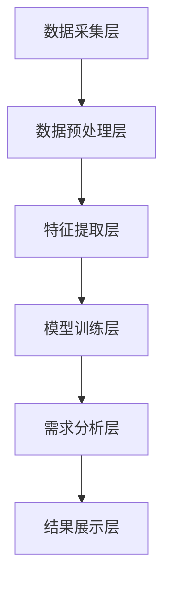

# 程序员如何利用AI进行智能需求分析

> 关键词：程序员、AI、智能需求分析、自然语言处理、机器学习、数据分析、需求理解

> 摘要：本文聚焦于程序员如何借助AI技术开展智能需求分析。首先介绍了智能需求分析的背景和相关概念，阐述了核心概念的原理与联系，并给出了相应的文本示意图和Mermaid流程图。接着详细讲解了核心算法原理，用Python代码进行阐述，还介绍了相关数学模型和公式。通过项目实战展示了代码实际案例和详细解释，探讨了实际应用场景。同时推荐了学习资源、开发工具框架以及相关论文著作。最后总结了未来发展趋势与挑战，提供了常见问题与解答以及扩展阅读和参考资料，旨在帮助程序员全面了解并掌握利用AI进行智能需求分析的方法和技术。

## 1. 背景介绍 
### 1.1 目的和范围
在软件开发过程中，需求分析是至关重要的环节，它直接影响到软件的质量和开发效率。传统的需求分析方法往往依赖于人工沟通和经验，存在效率低、容易出现理解偏差等问题。随着AI技术的快速发展，利用AI进行智能需求分析成为了可能。本文的目的就是探讨程序员如何利用AI技术来提高需求分析的效率和准确性，范围涵盖了智能需求分析的核心概念、算法原理、实际应用以及相关的工具和资源等方面。

### 1.2 预期读者
本文的预期读者主要是程序员、软件工程师、需求分析师以及对智能需求分析和AI技术感兴趣的相关人员。希望通过本文的介绍，能够帮助读者了解如何将AI技术应用到需求分析工作中，提升工作效率和质量。

### 1.3 文档结构概述
本文首先介绍智能需求分析的背景知识，包括目的、预期读者和文档结构概述等。接着阐述核心概念与联系，给出原理和架构的文本示意图和Mermaid流程图。然后详细讲解核心算法原理，并通过Python代码进行说明，同时介绍相关数学模型和公式。通过项目实战展示具体的代码实现和分析，探讨实际应用场景。推荐学习资源、开发工具框架以及相关论文著作。最后总结未来发展趋势与挑战，提供常见问题与解答以及扩展阅读和参考资料。

### 1.4 术语表
#### 1.4.1 核心术语定义
- **智能需求分析**：利用AI技术对用户需求进行自动理解、分类、提取关键信息等操作，以提高需求分析的效率和准确性。
- **自然语言处理（NLP）**：让计算机能够理解、处理和生成人类语言的技术领域，是智能需求分析中常用的技术之一。
- **机器学习（ML）**：一门多领域交叉学科，涉及概率论、统计学、逼近论、凸分析、算法复杂度理论等多门学科。它专门研究计算机怎样模拟或实现人类的学习行为，以获取新的知识或技能，重新组织已有的知识结构使之不断改善自身的性能。
- **需求理解**：对用户提出的需求进行深入分析和理解，把握需求的本质和关键信息。

#### 1.4.2 相关概念解释
- **文本分类**：将文本划分到不同的类别中，在需求分析中可以用于对需求进行分类，例如功能需求、非功能需求等。
- **命名实体识别（NER）**：识别文本中的命名实体，如人名、地名、组织机构名等，在需求分析中可以帮助提取关键信息。
- **情感分析**：分析文本中表达的情感倾向，了解用户对需求的态度和满意度。

#### 1.4.3 缩略词列表
- **NLP**：自然语言处理（Natural Language Processing）
- **ML**：机器学习（Machine Learning）
- **NER**：命名实体识别（Named Entity Recognition）

## 2. 核心概念与联系 

### 核心概念原理
智能需求分析主要基于自然语言处理和机器学习技术。自然语言处理技术用于处理用户输入的自然语言需求，包括文本预处理、词法分析、句法分析、语义分析等。通过这些处理，将自然语言文本转化为计算机能够理解的形式。机器学习技术则用于对处理后的文本进行分类、聚类、预测等操作，以提取需求的关键信息和模式。

需求理解是智能需求分析的核心目标，它需要综合运用自然语言处理和机器学习的方法，对用户需求进行深入分析和挖掘。例如，通过文本分类可以将需求分为不同的类型，如功能需求、性能需求、安全需求等；通过命名实体识别可以提取需求中的关键实体，如系统名称、用户角色、业务流程等；通过情感分析可以了解用户对需求的满意度和关注点。

### 架构的文本示意图
智能需求分析的架构主要包括以下几个部分：
1. **数据采集层**：负责收集用户需求数据，包括用户反馈、需求文档、聊天记录等。
2. **数据预处理层**：对采集到的数据进行清洗、分词、词性标注等预处理操作，将数据转化为适合机器学习算法处理的形式。
3. **特征提取层**：从预处理后的数据中提取特征，如词向量、TF-IDF特征等。
4. **模型训练层**：使用机器学习算法对提取的特征进行训练，构建需求分析模型。
5. **需求分析层**：将待分析的需求数据输入到训练好的模型中，进行分类、聚类、预测等操作，提取需求的关键信息。
6. **结果展示层**：将需求分析的结果以可视化的方式展示给用户，如报表、图表等。

### Mermaid流程图


## 3. 核心算法原理 & 具体操作步骤 

### 核心算法原理
智能需求分析中常用的算法包括文本分类算法、命名实体识别算法和情感分析算法等。

#### 文本分类算法
文本分类是将文本划分到不同的类别中，常用的文本分类算法有朴素贝叶斯算法、支持向量机（SVM）算法、深度学习算法等。这里以朴素贝叶斯算法为例进行介绍。

朴素贝叶斯算法基于贝叶斯定理和特征条件独立假设的分类方法。对于给定的训练数据集，首先基于特征条件独立假设学习输入/输出的联合概率分布；然后基于此模型，对给定的输入 $x$，利用贝叶斯定理求出后验概率最大的输出 $y$。

贝叶斯定理的公式为：
$$P(Y|X)=\frac{P(X|Y)P(Y)}{P(X)}$$
其中，$P(Y|X)$ 是后验概率，$P(X|Y)$ 是似然概率，$P(Y)$ 是先验概率，$P(X)$ 是证据因子。

在文本分类中，假设文本 $X=(x_1,x_2,\cdots,x_n)$ 由 $n$ 个特征组成，类别 $Y$ 有 $k$ 个取值 $y_1,y_2,\cdots,y_k$。朴素贝叶斯算法的分类规则是：
$$y=\arg\max_{y_i}P(Y=y_i|X)=\arg\max_{y_i}\frac{P(X|Y=y_i)P(Y=y_i)}{P(X)}$$
由于 $P(X)$ 对于所有类别都是相同的，所以可以简化为：
$$y=\arg\max_{y_i}P(X|Y=y_i)P(Y=y_i)$$

#### 命名实体识别算法
命名实体识别是识别文本中的命名实体，常用的命名实体识别算法有条件随机场（CRF）算法、循环神经网络（RNN）及其变体（如LSTM、GRU）等。这里以条件随机场算法为例进行介绍。

条件随机场是一种判别式概率模型，用于标注和切分序列数据。在命名实体识别中，将文本看作一个序列，每个词看作一个状态，通过学习序列中相邻状态之间的依赖关系，来预测每个词的标签（如人名、地名、组织机构名等）。

条件随机场的定义为：给定一组输入随机变量 $X=(X_1,X_2,\cdots,X_n)$ 和一组输出随机变量 $Y=(Y_1,Y_2,\cdots,Y_n)$，条件随机场定义了在给定输入 $X$ 的条件下输出 $Y$ 的条件概率分布 $P(Y|X)$。

#### 情感分析算法
情感分析是分析文本中表达的情感倾向，常用的情感分析算法有基于词典的方法、机器学习方法和深度学习方法等。这里以基于机器学习的方法为例进行介绍。

基于机器学习的情感分析方法通常将文本看作一个特征向量，使用分类算法（如朴素贝叶斯算法、支持向量机算法等）对文本的情感倾向进行分类，如积极、消极、中性等。

### 具体操作步骤

#### 数据预处理
```python
import re
import nltk
from nltk.corpus import stopwords
from nltk.tokenize import word_tokenize

nltk.download('stopwords')
nltk.download('punkt')

def preprocess_text(text):
    # 去除特殊字符
    text = re.sub(r'[^\w\s]', '', text)
    # 转换为小写
    text = text.lower()
    # 分词
    tokens = word_tokenize(text)
    # 去除停用词
    stop_words = set(stopwords.words('english'))
    filtered_tokens = [token for token in tokens if token not in stop_words]
    # 拼接成字符串
    preprocessed_text = ' '.join(filtered_tokens)
    return preprocessed_text

# 示例
text = "This is a sample text! It contains some special characters."
preprocessed_text = preprocess_text(text)
print(preprocessed_text)
```

#### 特征提取
```python
from sklearn.feature_extraction.text import TfidfVectorizer

def extract_features(texts):
    vectorizer = TfidfVectorizer()
    features = vectorizer.fit_transform(texts)
    return features, vectorizer

# 示例
texts = ["This is the first text.", "This is the second text."]
features, vectorizer = extract_features(texts)
print(features.toarray())
```

#### 模型训练
```python
from sklearn.naive_bayes import MultinomialNB
from sklearn.model_selection import train_test_split

def train_model(features, labels):
    X_train, X_test, y_train, y_test = train_test_split(features, labels, test_size=0.2, random_state=42)
    model = MultinomialNB()
    model.fit(X_train, y_train)
    accuracy = model.score(X_test, y_test)
    print(f"Model accuracy: {accuracy}")
    return model

# 示例
labels = [0, 1]
model = train_model(features, labels)
```

#### 需求分析
```python
def analyze_requirement(text, vectorizer, model):
    preprocessed_text = preprocess_text(text)
    feature = vectorizer.transform([preprocessed_text])
    prediction = model.predict(feature)
    return prediction

# 示例
text = "This is a new requirement."
prediction = analyze_requirement(text, vectorizer, model)
print(f"Predicted label: {prediction}")
```

## 4. 数学模型和公式 & 详细讲解 & 举例说明 

### 贝叶斯定理
贝叶斯定理的公式为：
$$P(Y|X)=\frac{P(X|Y)P(Y)}{P(X)}$$
其中，$P(Y|X)$ 是后验概率，表示在已知特征 $X$ 的情况下，类别 $Y$ 发生的概率；$P(X|Y)$ 是似然概率，表示在类别 $Y$ 发生的情况下，特征 $X$ 出现的概率；$P(Y)$ 是先验概率，表示类别 $Y$ 发生的概率；$P(X)$ 是证据因子，表示特征 $X$ 出现的概率。

### 详细讲解
在文本分类中，我们的目标是根据文本的特征 $X$ 来预测文本的类别 $Y$。贝叶斯定理提供了一种计算后验概率 $P(Y|X)$ 的方法。通过计算不同类别 $Y$ 的后验概率，我们可以选择后验概率最大的类别作为文本的预测类别。

### 举例说明
假设我们有一个文本分类任务，要将文本分为“体育”和“科技”两类。我们有以下训练数据：

| 文本 | 类别 |
| ---- | ---- |
| 篮球比赛很精彩 | 体育 |
| 手机性能很强大 | 科技 |
| 足球比赛很激烈 | 体育 |
| 电脑软件很实用 | 科技 |

我们可以计算先验概率 $P(Y)$：
- $P(体育)=\frac{2}{4}=0.5$
- $P(科技)=\frac{2}{4}=0.5$

假设我们要对文本“足球比赛很有趣”进行分类，我们可以计算似然概率 $P(X|Y)$：
- $P(足球比赛很有趣|体育)$：在“体育”类别的文本中，出现“足球比赛很有趣”的概率。
- $P(足球比赛很有趣|科技)$：在“科技”类别的文本中，出现“足球比赛很有趣”的概率。

由于“足球比赛很有趣”更符合“体育”类别的文本，所以 $P(足球比赛很有趣|体育)>P(足球比赛很有趣|科技)$。

根据贝叶斯定理，我们可以计算后验概率 $P(Y|X)$：
- $P(体育|足球比赛很有趣)=\frac{P(足球比赛很有趣|体育)P(体育)}{P(足球比赛很有趣)}$
- $P(科技|足球比赛很有趣)=\frac{P(足球比赛很有趣|科技)P(科技)}{P(足球比赛很有趣)}$

由于 $P(足球比赛很有趣|体育)>P(足球比赛很有趣|科技)$ 且 $P(体育)=P(科技)=0.5$，所以 $P(体育|足球比赛很有趣)>P(科技|足球比赛很有趣)$，因此我们可以预测文本“足球比赛很有趣”的类别为“体育”。

## 5. 项目实战：代码实际案例和详细解释说明 

### 5.1  开发环境搭建
在进行智能需求分析的项目实战之前，我们需要搭建开发环境。以下是具体的步骤：

#### 安装Python
首先，我们需要安装Python。可以从Python官方网站（https://www.python.org/downloads/） 下载适合自己操作系统的Python安装包，并按照安装向导进行安装。

#### 创建虚拟环境
为了避免不同项目之间的依赖冲突，我们可以创建一个虚拟环境。在命令行中执行以下命令：
```sh
python -m venv myenv
```
其中，`myenv` 是虚拟环境的名称，可以根据自己的喜好进行修改。

#### 激活虚拟环境
在Windows系统中，执行以下命令激活虚拟环境：
```sh
myenv\Scripts\activate
```
在Linux或Mac系统中，执行以下命令激活虚拟环境：
```sh
source myenv/bin/activate
```

#### 安装依赖库
在激活虚拟环境后，我们需要安装项目所需的依赖库。在命令行中执行以下命令：
```sh
pip install scikit-learn nltk
```

### 5.2  源代码详细实现和代码解读
以下是一个完整的智能需求分析的项目实战代码：

```python
import re
import nltk
from nltk.corpus import stopwords
from nltk.tokenize import word_tokenize
from sklearn.feature_extraction.text import TfidfVectorizer
from sklearn.naive_bayes import MultinomialNB
from sklearn.model_selection import train_test_split

# 数据预处理
nltk.download('stopwords')
nltk.download('punkt')

def preprocess_text(text):
    # 去除特殊字符
    text = re.sub(r'[^\w\s]', '', text)
    # 转换为小写
    text = text.lower()
    # 分词
    tokens = word_tokenize(text)
    # 去除停用词
    stop_words = set(stopwords.words('english'))
    filtered_tokens = [token for token in tokens if token not in stop_words]
    # 拼接成字符串
    preprocessed_text = ' '.join(filtered_tokens)
    return preprocessed_text

# 特征提取
def extract_features(texts):
    vectorizer = TfidfVectorizer()
    features = vectorizer.fit_transform(texts)
    return features, vectorizer

# 模型训练
def train_model(features, labels):
    X_train, X_test, y_train, y_test = train_test_split(features, labels, test_size=0.2, random_state=42)
    model = MultinomialNB()
    model.fit(X_train, y_train)
    accuracy = model.score(X_test, y_test)
    print(f"Model accuracy: {accuracy}")
    return model

# 需求分析
def analyze_requirement(text, vectorizer, model):
    preprocessed_text = preprocess_text(text)
    feature = vectorizer.transform([preprocessed_text])
    prediction = model.predict(feature)
    return prediction

# 示例数据
texts = ["The system should have a user-friendly interface.", "The system should be able to handle a large number of users.", "The software should be secure and reliable."]
labels = [0, 1, 2]

# 数据预处理
preprocessed_texts = [preprocess_text(text) for text in texts]

# 特征提取
features, vectorizer = extract_features(preprocessed_texts)

# 模型训练
model = train_model(features, labels)

# 需求分析
new_text = "The system should be easy to use."
prediction = analyze_requirement(new_text, vectorizer, model)
print(f"Predicted label: {prediction}")
```

### 5.3  代码解读与分析
- **数据预处理**：`preprocess_text` 函数用于对文本进行预处理，包括去除特殊字符、转换为小写、分词和去除停用词等操作。这些操作可以将文本转化为适合机器学习算法处理的形式。
- **特征提取**：`extract_features` 函数使用 `TfidfVectorizer` 类将文本转化为特征向量。`TfidfVectorizer` 是一种常用的文本特征提取方法，它可以计算文本中每个词的TF-IDF值，用于表示词的重要性。
- **模型训练**：`train_model` 函数使用 `MultinomialNB` 类训练一个朴素贝叶斯分类器。`MultinomialNB` 是一种常用的文本分类算法，它基于贝叶斯定理和特征条件独立假设。
- **需求分析**：`analyze_requirement` 函数用于对新的需求文本进行分类预测。首先对文本进行预处理，然后使用训练好的特征提取器将文本转化为特征向量，最后使用训练好的模型进行预测。

## 6. 实际应用场景 
### 软件开发项目
在软件开发项目中，智能需求分析可以帮助程序员更好地理解用户需求，提高需求分析的效率和准确性。通过对用户需求文档、用户反馈等数据进行分析，智能需求分析系统可以自动分类需求、提取关键信息，帮助程序员快速定位问题和制定解决方案。

### 客户服务
在客户服务领域，智能需求分析可以帮助客服人员更好地理解客户需求，提高客户服务的质量和效率。通过对客户咨询、投诉等数据进行分析，智能需求分析系统可以自动分类客户需求、提取关键信息，帮助客服人员快速响应客户需求，提供个性化的服务。

### 市场调研
在市场调研中，智能需求分析可以帮助企业更好地了解市场需求和用户偏好，为产品研发和市场推广提供决策支持。通过对市场调研数据、用户评论等数据进行分析，智能需求分析系统可以自动分类市场需求、提取关键信息，帮助企业发现市场机会和优化产品策略。

## 7. 工具和资源推荐
### 7.1 学习资源推荐
#### 7.1.1 书籍推荐
- 《Python自然语言处理》：本书详细介绍了Python在自然语言处理领域的应用，包括文本预处理、词法分析、句法分析、语义分析等内容。
- 《机器学习》：本书是机器学习领域的经典教材，系统介绍了机器学习的基本概念、算法和应用。
- 《深度学习》：本书是深度学习领域的权威著作，详细介绍了深度学习的原理、算法和应用。

#### 7.1.2 在线课程
- Coursera上的“Natural Language Processing Specialization”：该课程由斯坦福大学的教授授课，系统介绍了自然语言处理的基本概念、算法和应用。
- edX上的“Machine Learning Fundamentals”：该课程由华盛顿大学的教授授课，系统介绍了机器学习的基本概念、算法和应用。
- 网易云课堂上的“深度学习实战”：该课程由一线互联网公司的技术专家授课，介绍了深度学习的实战应用和案例。

#### 7.1.3 技术博客和网站
- 机器之心：提供人工智能领域的最新技术、研究成果和行业动态。
- 开源中国：提供开源软件的相关信息和技术文章。
- 博客园：提供程序员的技术博客和经验分享。

### 7.2 开发工具框架推荐
#### 7.2.1 IDE和编辑器
- PyCharm：一款专业的Python集成开发环境，提供代码编辑、调试、版本控制等功能。
- Visual Studio Code：一款轻量级的代码编辑器，支持多种编程语言，具有丰富的插件生态系统。

#### 7.2.2 调试和性能分析工具
- PySnooper：一款简单易用的Python调试工具，可以自动记录函数的调用过程和变量的值。
- cProfile：Python标准库中的性能分析工具，可以分析代码的运行时间和函数调用次数。

#### 7.2.3 相关框架和库
- NLTK：Python中常用的自然语言处理库，提供了丰富的文本处理工具和数据集。
- scikit-learn：Python中常用的机器学习库，提供了各种机器学习算法和工具。
- TensorFlow：Google开发的深度学习框架，提供了高效的深度学习计算和模型训练功能。

### 7.3 相关论文著作推荐
#### 7.3.1 经典论文
- “A Mathematical Theory of Communication”：信息论的经典论文，由Claude E. Shannon发表，为自然语言处理和机器学习提供了理论基础。
- “The Elements of Statistical Learning”：机器学习领域的经典论文，介绍了机器学习的基本概念、算法和理论。

#### 7.3.2 最新研究成果
- 关注顶级学术会议如ACL（Association for Computational Linguistics）、NIPS（Neural Information Processing Systems）等的最新研究成果，了解自然语言处理和机器学习领域的最新技术和发展趋势。

#### 7.3.3 应用案例分析
- 分析一些实际应用案例，如智能客服系统、智能需求分析平台等，了解如何将AI技术应用到实际项目中，解决实际问题。

## 8. 总结：未来发展趋势与挑战
### 未来发展趋势
- **多模态需求分析**：未来的智能需求分析将不仅仅局限于文本数据，还将结合图像、语音等多模态数据，更全面地理解用户需求。
- **深度学习的广泛应用**：随着深度学习技术的不断发展，深度学习模型将在智能需求分析中得到更广泛的应用，提高需求分析的准确性和效率。
- **个性化需求分析**：根据用户的历史行为、偏好等信息，提供个性化的需求分析服务，更好地满足用户的需求。

### 挑战
- **数据质量问题**：智能需求分析依赖于大量的高质量数据，但是实际应用中数据往往存在噪声、缺失等问题，影响需求分析的准确性。
- **语义理解难题**：自然语言具有复杂性和歧义性，如何准确理解用户需求的语义是智能需求分析面临的一大挑战。
- **隐私和安全问题**：在收集和处理用户需求数据的过程中，需要保护用户的隐私和数据安全，避免数据泄露和滥用。

## 9. 附录：常见问题与解答
### 问题1：智能需求分析的准确性如何保证？
答：可以通过以下方法提高智能需求分析的准确性：
- 收集大量的高质量数据进行模型训练。
- 选择合适的算法和模型，并进行调优。
- 对分析结果进行人工审核和验证，不断优化模型。

### 问题2：智能需求分析可以处理所有类型的需求吗？
答：目前智能需求分析还不能处理所有类型的需求，特别是一些复杂、模糊的需求。但是随着技术的不断发展，智能需求分析的能力将不断提高。

### 问题3：如何选择适合的智能需求分析算法？
答：选择适合的智能需求分析算法需要考虑以下因素：
- 数据的特点和规模。
- 需求分析的任务和目标。
- 算法的性能和复杂度。

## 10. 扩展阅读 & 参考资料
### 扩展阅读
- 《人工智能简史》：了解人工智能的发展历程和重要事件。
- 《智能时代》：探讨人工智能对社会和经济的影响。

### 参考资料
- 相关学术论文和研究报告。
- 开源项目的文档和代码。
- 相关技术书籍和在线教程。