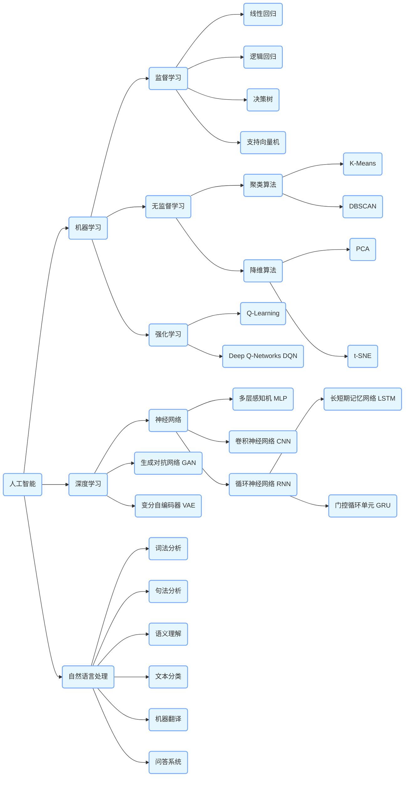

# 程序员如何在AI浪潮中找到机会

> 关键词：程序员、AI浪潮、机会挖掘、技能提升、职业发展

> 摘要：随着人工智能（AI）技术的飞速发展，整个科技行业正经历着前所未有的变革。对于程序员而言，这既是巨大的挑战，也是难得的机遇。本文旨在深入探讨程序员在AI浪潮中寻找机会的方法和途径。从背景介绍出发，阐述AI发展对程序员的影响，接着详细讲解AI相关的核心概念、算法原理、数学模型，通过项目实战案例让程序员了解如何将理论应用于实际。同时，分析AI在不同领域的实际应用场景，推荐相关的学习工具、资源和论文著作。最后总结AI未来发展趋势与挑战，并对常见问题进行解答，为程序员在AI浪潮中找准自身定位、挖掘发展机会提供全面而深入的指导。

## 1. 背景介绍 
### 1.1 目的和范围
在当前AI技术蓬勃发展的大背景下，程序员面临着技术更新换代的压力，但同时也迎来了广阔的职业发展空间。本文的目的在于帮助程序员全面了解AI浪潮带来的机遇，明确在这一浪潮中可以从哪些方面寻找机会，以及如何利用自身的编程技能在AI领域实现突破和发展。文章将涵盖AI相关的核心技术知识、实际应用场景、学习资源和工具推荐等内容，为程序员提供一个系统的指导框架。

### 1.2 预期读者
本文主要面向广大程序员群体，包括有一定编程基础但对AI技术了解有限的初级程序员，希望在职业发展中转型或拓展技能的中级程序员，以及寻求技术创新和突破的高级程序员。同时，对于对AI技术感兴趣的计算机专业学生和相关从业者也具有一定的参考价值。

### 1.3 文档结构概述
本文将按照以下结构展开：首先介绍AI相关的核心概念和它们之间的联系，让程序员对AI有一个基本的认知；接着详细讲解核心算法原理和具体操作步骤，并结合Python代码进行阐述；然后介绍AI中的数学模型和公式，并通过举例说明其应用；通过项目实战案例，展示如何将AI技术应用于实际开发中；分析AI在不同领域的实际应用场景，为程序员提供应用方向；推荐相关的学习工具、资源和论文著作，帮助程序员深入学习和研究AI技术；最后总结AI未来发展趋势与挑战，并对常见问题进行解答。

### 1.4 术语表
#### 1.4.1 核心术语定义
- **人工智能（AI）**：是一门研究如何使计算机能够模拟人类智能的学科和技术，包括学习、推理、感知、语言理解等多个方面。
- **机器学习（ML）**：是AI的一个重要分支，专注于让计算机通过数据学习模式和规律，从而实现预测和决策的能力。
- **深度学习（DL）**：是机器学习的一种特殊形式，基于人工神经网络，尤其是深度神经网络，能够自动从大量数据中学习复杂的特征表示。
- **神经网络（NN）**：是一种模仿人类神经系统的计算模型，由大量的神经元组成，通过神经元之间的连接和权重调整来实现信息处理和学习。
- **自然语言处理（NLP）**：是AI的一个领域，旨在让计算机理解、处理和生成人类语言，包括文本分类、机器翻译、问答系统等应用。

#### 1.4.2 相关概念解释
- **监督学习**：是机器学习中的一种学习方式，训练数据包含输入特征和对应的标签，模型通过学习输入和标签之间的关系来进行预测。
- **无监督学习**：训练数据只包含输入特征，没有对应的标签，模型的任务是发现数据中的内在结构和模式。
- **强化学习**：智能体通过与环境进行交互，根据环境反馈的奖励信号来学习最优的行为策略。
- **卷积神经网络（CNN）**：是一种专门用于处理具有网格结构数据（如图像）的神经网络，通过卷积层、池化层等结构自动提取数据特征。
- **循环神经网络（RNN）**：是一种适用于处理序列数据（如文本、时间序列）的神经网络，具有记忆功能，能够捕捉序列中的上下文信息。

#### 1.4.3 缩略词列表
- **AI**：Artificial Intelligence
- **ML**：Machine Learning
- **DL**：Deep Learning
- **NN**：Neural Network
- **NLP**：Natural Language Processing
- **CNN**：Convolutional Neural Network
- **RNN**：Recurrent Neural Network

## 2. 核心概念与联系 

### 核心概念原理
人工智能是一个广泛的领域，其中机器学习是实现人工智能的重要手段。机器学习又可以分为监督学习、无监督学习和强化学习等不同类型。

监督学习的原理是通过大量带有标签的数据来训练模型，让模型学习输入特征和标签之间的映射关系。例如，在图像分类任务中，输入是图像的像素值，标签是图像所属的类别（如猫、狗等），模型通过学习这些数据来预测新图像的类别。

无监督学习则是在没有标签的数据中寻找模式和结构。例如，聚类算法可以将数据点划分为不同的簇，使得同一簇内的数据点具有较高的相似性。

强化学习是智能体在环境中不断尝试不同的行为，根据环境给予的奖励信号来调整自己的行为策略，以最大化长期累积奖励。例如，在游戏中，智能体通过不断尝试不同的操作，根据游戏得分来学习最优的游戏策略。

深度学习是机器学习的一个子集，它基于深度神经网络。深度神经网络由多个隐藏层组成，能够自动从数据中学习到复杂的特征表示。例如，在图像识别中，CNN可以通过卷积层和池化层自动提取图像的特征，从而实现高效准确的图像分类。

自然语言处理是AI在语言领域的应用，旨在让计算机理解和生成人类语言。它涉及到词法分析、句法分析、语义理解等多个方面。例如，机器翻译系统需要理解源语言的语义，并将其准确地翻译成目标语言。

### 架构的文本示意图
```plaintext
人工智能
├── 机器学习
│   ├── 监督学习
│   │   ├── 线性回归
│   │   ├── 逻辑回归
│   │   ├── 决策树
│   │   ├── 支持向量机
│   ├── 无监督学习
│   │   ├── 聚类算法
│   │   │   ├── K-Means
│   │   │   ├── DBSCAN
│   │   ├── 降维算法
│   │   │   ├── PCA
│   │   │   ├── t-SNE
│   ├── 强化学习
│       ├── Q-Learning
│       ├── Deep Q-Networks (DQN)
├── 深度学习
│   ├── 神经网络
│   │   ├── 多层感知机 (MLP)
│   │   ├── 卷积神经网络 (CNN)
│   │   ├── 循环神经网络 (RNN)
│   │   │   ├── 长短期记忆网络 (LSTM)
│   │   │   ├── 门控循环单元 (GRU)
│   ├── 生成对抗网络 (GAN)
│   ├── 变分自编码器 (VAE)
├── 自然语言处理
│   ├── 词法分析
│   ├── 句法分析
│   ├── 语义理解
│   ├── 文本分类
│   ├── 机器翻译
│   ├── 问答系统
```

### Mermaid 流程图


## 3. 核心算法原理 & 具体操作步骤 

### 线性回归算法原理
线性回归是一种简单而常用的监督学习算法，用于预测连续值的输出。其基本原理是通过拟合一个线性函数来建立输入特征和输出之间的关系。假设我们有一个包含 $n$ 个样本的数据集 $\{(x_1, y_1), (x_2, y_2), \cdots, (x_n, y_n)\}$，其中 $x_i$ 是输入特征向量，$y_i$ 是对应的输出值。线性回归模型可以表示为：

$$y = \theta_0 + \theta_1x_1 + \theta_2x_2 + \cdots + \theta_mx_m$$

其中 $\theta_0, \theta_1, \cdots, \theta_m$ 是模型的参数，$m$ 是特征的数量。我们的目标是找到一组最优的参数 $\theta$，使得模型的预测值 $\hat{y}$ 与真实值 $y$ 之间的误差最小。通常使用均方误差（MSE）作为损失函数：

$$J(\theta) = \frac{1}{2n} \sum_{i=1}^{n} (y_i - \hat{y}_i)^2 = \frac{1}{2n} \sum_{i=1}^{n} (y_i - (\theta_0 + \theta_1x_{i1} + \theta_2x_{i2} + \cdots + \theta_mx_{im}))^2$$

为了找到最优的参数 $\theta$，可以使用梯度下降法。梯度下降法的基本思想是通过不断迭代更新参数，使得损失函数 $J(\theta)$ 逐渐减小。具体来说，参数的更新公式为：

$$\theta_j := \theta_j - \alpha \frac{\partial J(\theta)}{\partial \theta_j}$$

其中 $\alpha$ 是学习率，控制每次更新的步长。

### Python 代码实现
```python
import numpy as np

class LinearRegression:
    def __init__(self, learning_rate=0.01, num_iterations=1000):
        self.learning_rate = learning_rate
        self.num_iterations = num_iterations
        self.weights = None
        self.bias = None

    def fit(self, X, y):
        num_samples, num_features = X.shape
        self.weights = np.zeros(num_features)
        self.bias = 0

        for _ in range(self.num_iterations):
            y_pred = np.dot(X, self.weights) + self.bias

            dw = (1 / num_samples) * np.dot(X.T, (y_pred - y))
            db = (1 / num_samples) * np.sum(y_pred - y)

            self.weights -= self.learning_rate * dw
            self.bias -= self.learning_rate * db

    def predict(self, X):
        return np.dot(X, self.weights) + self.bias
```

### 代码解释
1. **初始化**：在 `__init__` 方法中，我们初始化学习率 `learning_rate` 和迭代次数 `num_iterations`，并将权重 `weights` 和偏置 `bias` 初始化为 `None`。
2. **拟合模型**：在 `fit` 方法中，我们首先获取样本数量和特征数量，然后将权重初始化为零向量，偏置初始化为零。接着，我们进行多次迭代，每次迭代中计算预测值 `y_pred`，并根据梯度下降法更新权重和偏置。
3. **预测**：在 `predict` 方法中，我们根据训练好的权重和偏置计算输入数据的预测值。

### 使用示例
```python
# 生成一些示例数据
X = np.array([[1], [2], [3], [4], [5]])
y = np.array([2, 4, 6, 8, 10])

# 创建线性回归模型
model = LinearRegression(learning_rate=0.01, num_iterations=1000)

# 拟合模型
model.fit(X, y)

# 进行预测
new_X = np.array([[6]])
prediction = model.predict(new_X)
print("预测值:", prediction)
```

## 4. 数学模型和公式 & 详细讲解 & 举例说明 

### 逻辑回归的数学模型和公式
逻辑回归是一种用于二分类问题的监督学习算法。它的基本思想是通过一个逻辑函数（也称为 sigmoid 函数）将线性回归的输出映射到 $[0, 1]$ 区间，从而表示样本属于正类的概率。

#### 逻辑函数（sigmoid 函数）
逻辑函数的定义为：

$$\sigma(z) = \frac{1}{1 + e^{-z}}$$

其中 $z$ 是线性回归的输出，即 $z = \theta_0 + \theta_1x_1 + \theta_2x_2 + \cdots + \theta_mx_m$。逻辑函数的图像是一个 S 形曲线，其取值范围在 $(0, 1)$ 之间。

#### 逻辑回归模型
逻辑回归模型可以表示为：

$$P(y = 1|x) = \sigma(\theta^T x) = \frac{1}{1 + e^{-\theta^T x}}$$

其中 $\theta$ 是模型的参数向量，$x$ 是输入特征向量。$P(y = 1|x)$ 表示在给定输入 $x$ 的情况下，样本属于正类（$y = 1$）的概率。

#### 损失函数
逻辑回归通常使用对数损失函数（也称为交叉熵损失函数）来衡量模型的预测误差。对于单个样本 $(x, y)$，其对数损失函数定义为：

$$L(\theta) = -y \log(P(y = 1|x)) - (1 - y) \log(1 - P(y = 1|x))$$

对于包含 $n$ 个样本的数据集，总的损失函数为：

$$J(\theta) = \frac{1}{n} \sum_{i=1}^{n} [-y_i \log(P(y_i = 1|x_i)) - (1 - y_i) \log(1 - P(y_i = 1|x_i))]$$

#### 参数更新
同样可以使用梯度下降法来更新模型的参数 $\theta$。参数的更新公式为：

$$\theta_j := \theta_j - \alpha \frac{\partial J(\theta)}{\partial \theta_j}$$

其中 $\frac{\partial J(\theta)}{\partial \theta_j}$ 是损失函数关于参数 $\theta_j$ 的偏导数。

### 详细讲解
逻辑回归的核心在于将线性回归的输出通过 sigmoid 函数映射到概率值。当 $\theta^T x$ 趋近于正无穷时，$\sigma(\theta^T x)$ 趋近于 1，表示样本属于正类的概率很高；当 $\theta^T x$ 趋近于负无穷时，$\sigma(\theta^T x)$ 趋近于 0，表示样本属于正类的概率很低。

对数损失函数的设计是为了使得当预测值与真实值接近时，损失函数的值较小；当预测值与真实值相差较大时，损失函数的值较大。通过最小化损失函数，我们可以找到一组最优的参数 $\theta$，使得模型的预测效果最好。

### 举例说明
假设我们有一个简单的二分类问题，输入特征只有一个 $x$，我们要预测样本属于正类（$y = 1$）还是负类（$y = 0$）。我们的逻辑回归模型可以表示为：

$$P(y = 1|x) = \frac{1}{1 + e^{-(\theta_0 + \theta_1x)}}$$

假设我们已经通过训练得到了参数 $\theta_0 = -2$ 和 $\theta_1 = 1$。现在有一个新的样本 $x = 3$，我们可以计算该样本属于正类的概率：

$$P(y = 1|x = 3) = \frac{1}{1 + e^{-(-2 + 1\times3)}} = \frac{1}{1 + e^{-1}} \approx 0.73$$

由于该概率大于 0.5，我们可以预测该样本属于正类。

## 5. 项目实战：代码实际案例和详细解释说明 

### 5.1  开发环境搭建
#### 安装 Python
首先，我们需要安装 Python 编程语言。建议使用 Python 3.6 及以上版本。可以从 Python 官方网站（https://www.python.org/downloads/）下载适合你操作系统的安装包，并按照安装向导进行安装。

#### 安装依赖库
在本项目中，我们将使用一些常用的 Python 库，如 NumPy、Pandas、Scikit-learn 和 Matplotlib。可以使用以下命令来安装这些库：
```sh
pip install numpy pandas scikit-learn matplotlib
```

#### 安装开发工具
可以选择使用 PyCharm、Jupyter Notebook 等开发工具。PyCharm 是一个功能强大的 Python 集成开发环境（IDE），适合大型项目的开发；Jupyter Notebook 则是一个交互式的开发环境，适合进行数据探索和模型实验。

### 5.2  源代码详细实现和代码解读
#### 项目背景
我们将使用鸢尾花数据集进行分类任务。鸢尾花数据集是一个经典的机器学习数据集，包含了 150 个样本，每个样本有 4 个特征（花萼长度、花萼宽度、花瓣长度、花瓣宽度），分为 3 个类别（Setosa、Versicolour、Virginica）。

#### 代码实现
```python
import numpy as np
import pandas as pd
from sklearn.datasets import load_iris
from sklearn.model_selection import train_test_split
from sklearn.preprocessing import StandardScaler
from sklearn.linear_model import LogisticRegression
from sklearn.metrics import accuracy_score
import matplotlib.pyplot as plt

# 加载鸢尾花数据集
iris = load_iris()
X = iris.data
y = iris.target

# 划分训练集和测试集
X_train, X_test, y_train, y_test = train_test_split(X, y, test_size=0.2, random_state=42)

# 数据标准化
scaler = StandardScaler()
X_train = scaler.fit_transform(X_train)
X_test = scaler.transform(X_test)

# 创建逻辑回归模型
model = LogisticRegression()

# 训练模型
model.fit(X_train, y_train)

# 进行预测
y_pred = model.predict(X_test)

# 计算准确率
accuracy = accuracy_score(y_test, y_pred)
print("模型准确率:", accuracy)

# 可视化结果
plt.figure(figsize=(10, 6))
plt.scatter(X_test[:, 0], X_test[:, 1], c=y_pred, cmap='viridis', edgecolor='k')
plt.title('鸢尾花分类结果')
plt.xlabel('花萼长度')
plt.ylabel('花萼宽度')
plt.show()
```

#### 代码解读
1. **数据加载**：使用 `load_iris` 函数从 `sklearn.datasets` 中加载鸢尾花数据集，并将特征数据存储在 `X` 中，标签数据存储在 `y` 中。
2. **数据划分**：使用 `train_test_split` 函数将数据集划分为训练集和测试集，测试集占总数据的 20%。
3. **数据标准化**：使用 `StandardScaler` 对特征数据进行标准化处理，使得每个特征的均值为 0，标准差为 1。这样可以提高模型的训练效果。
4. **模型创建和训练**：创建一个逻辑回归模型，并使用训练集数据对模型进行训练。
5. **模型预测**：使用训练好的模型对测试集数据进行预测，得到预测结果 `y_pred`。
6. **准确率计算**：使用 `accuracy_score` 函数计算模型的预测准确率。
7. **可视化结果**：使用 `matplotlib` 库将测试集数据的前两个特征进行可视化，并根据预测结果进行颜色标记。

### 5.3  代码解读与分析
#### 数据预处理的重要性
数据预处理是机器学习中非常重要的一步。在本项目中，我们对特征数据进行了标准化处理，这有助于模型更快地收敛，提高训练效率和预测准确率。如果不进行标准化处理，不同特征的尺度可能会差异很大，导致模型在训练过程中偏向于尺度较大的特征。

#### 模型选择和评估
逻辑回归是一种简单而有效的分类算法，适用于线性可分的数据集。在本项目中，我们使用逻辑回归模型取得了较高的准确率。在实际应用中，我们可以根据数据集的特点和问题的复杂度选择不同的模型，如决策树、支持向量机、神经网络等。同时，我们使用准确率作为模型的评估指标，但在某些情况下，还需要考虑其他指标，如精确率、召回率、F1 值等。

#### 可视化的作用
可视化可以帮助我们直观地理解模型的预测结果。在本项目中，我们将测试集数据的前两个特征进行可视化，并根据预测结果进行颜色标记，这样可以清晰地看到模型对不同类别的划分情况。可视化还可以帮助我们发现数据中的异常点和模式，为进一步的数据分析和模型优化提供依据。

## 6. 实际应用场景 
### 医疗领域
在医疗领域，AI 技术有着广泛的应用。例如，通过机器学习算法可以对医学影像（如 X 光、CT 等）进行分析，帮助医生检测疾病（如肿瘤、肺炎等）。深度学习模型可以自动识别影像中的病变特征，提高疾病诊断的准确性和效率。此外，AI 还可以用于药物研发，通过分析大量的生物数据和药物信息，预测药物的疗效和副作用，加速药物研发的进程。

### 金融领域
在金融领域，AI 可以用于风险评估、信用评分、欺诈检测等方面。例如，银行可以使用机器学习模型对客户的信用风险进行评估，根据客户的历史数据和行为特征预测其违约概率。在欺诈检测方面，AI 可以实时监测交易数据，识别异常的交易行为，及时防范金融欺诈。此外，AI 还可以用于股票市场预测、投资组合优化等方面。

### 交通领域
在交通领域，AI 技术推动了自动驾驶的发展。自动驾驶汽车通过传感器收集周围环境的信息，使用深度学习模型对这些信息进行处理和分析，从而做出决策（如加速、刹车、转向等）。此外，AI 还可以用于交通流量预测和优化，通过分析交通数据，预测交通拥堵情况，并提供最优的路线规划。

### 教育领域
在教育领域，AI 可以实现个性化学习。通过分析学生的学习数据（如学习进度、答题情况等），AI 系统可以为每个学生制定个性化的学习计划和推荐学习资源。此外，AI 还可以用于智能辅导，自动解答学生的问题，提供实时的反馈和指导。

### 零售领域
在零售领域，AI 可以用于客户细分、商品推荐、库存管理等方面。通过分析客户的购买历史和行为数据，AI 可以将客户分为不同的群体，为每个群体提供个性化的营销策略。商品推荐系统可以根据客户的兴趣和偏好，推荐合适的商品，提高客户的购买转化率。在库存管理方面，AI 可以预测商品的需求，优化库存水平，降低库存成本。

## 7. 工具和资源推荐
### 7.1 学习资源推荐
#### 7.1.1 书籍推荐
- 《机器学习》（周志华）：这本书是机器学习领域的经典教材，系统地介绍了机器学习的基本概念、算法和方法，内容丰富，讲解详细，适合初学者和有一定基础的读者。
- 《深度学习》（Ian Goodfellow、Yoshua Bengio、Aaron Courville）：由深度学习领域的三位顶尖学者撰写，全面介绍了深度学习的理论和实践，是深度学习领域的权威著作。
- 《Python 机器学习实战》（Sebastian Raschka）：本书结合 Python 编程语言，通过实际案例介绍了机器学习的各种算法和应用，注重实践操作，适合希望通过实践学习机器学习的读者。

#### 7.1.2 在线课程
- Coursera 上的《机器学习》课程（Andrew Ng）：由斯坦福大学的 Andrew Ng 教授授课，是机器学习领域最受欢迎的在线课程之一，课程内容深入浅出，适合初学者。
- edX 上的《深度学习微硕士项目》：包含多个深度学习相关的课程，由全球顶尖高校和企业的专家授课，内容涵盖深度学习的各个方面，适合有一定基础的学习者深入学习。
- 哔哩哔哩（B 站）上有很多关于 AI 和机器学习的免费视频教程，如李宏毅教授的《机器学习》课程，讲解生动有趣，易于理解。

#### 7.1.3 技术博客和网站
- Medium：是一个知名的技术博客平台，上面有很多关于 AI、机器学习和深度学习的优质文章，涵盖了最新的研究成果、技术应用和实践经验。
- Towards Data Science：专注于数据科学和机器学习领域，提供了大量的教程、案例分析和研究报告，是数据科学家和机器学习爱好者的重要学习资源。
- 机器之心：是国内知名的 AI 媒体，提供了丰富的 AI 资讯、技术文章和行业报告，有助于了解 AI 领域的最新动态和发展趋势。

### 7.2 开发工具框架推荐
#### 7.2.1 IDE和编辑器
- PyCharm：是一款功能强大的 Python 集成开发环境，具有代码编辑、调试、版本控制等多种功能，适合开发大型的 Python 项目。
- Jupyter Notebook：是一个交互式的开发环境，支持代码、文本、图像等多种元素的混合编辑，非常适合进行数据探索、模型实验和代码演示。
- Visual Studio Code：是一个轻量级的代码编辑器，支持多种编程语言和插件扩展，具有丰富的功能和良好的用户体验，适合快速开发和调试代码。

#### 7.2.2 调试和性能分析工具
- TensorBoard：是 TensorFlow 提供的一个可视化工具，可以帮助我们可视化模型的训练过程、损失函数变化、模型结构等信息，方便我们进行模型调试和性能分析。
- PyTorch Profiler：是 PyTorch 提供的性能分析工具，可以帮助我们分析模型的运行时间、内存使用情况等，找出模型的性能瓶颈，进行优化。
- cProfile：是 Python 标准库中的一个性能分析工具，可以帮助我们分析 Python 代码的运行时间和函数调用情况，找出代码中的性能问题。

#### 7.2.3 相关框架和库
- TensorFlow：是 Google 开发的一个开源深度学习框架，具有广泛的应用和丰富的工具库，支持多种硬件平台，适合大规模的深度学习项目开发。
- PyTorch：是 Facebook 开发的一个开源深度学习框架，具有动态图机制，易于使用和调试，在学术界和工业界都有广泛的应用。
- Scikit-learn：是一个简单易用的机器学习库，提供了各种机器学习算法和工具，如分类、回归、聚类等，适合初学者进行机器学习实验和开发。

### 7.3 相关论文著作推荐
#### 7.3.1 经典论文
- 《Gradient-Based Learning Applied to Document Recognition》（Yann LeCun、Léon Bottou、Yoshua Bengio、Patrick Haffner）：这篇论文介绍了卷积神经网络（CNN）在手写数字识别中的应用，是 CNN 领域的经典论文，奠定了 CNN 在图像识别领域的基础。
- 《Long Short-Term Memory》（Sepp Hochreiter、Jürgen Schmidhuber）：这篇论文提出了长短期记忆网络（LSTM），解决了传统循环神经网络（RNN）在处理长序列时的梯度消失问题，使得 RNN 在自然语言处理等领域得到了广泛的应用。
- 《Generative Adversarial Nets》（Ian Goodfellow 等）：这篇论文提出了生成对抗网络（GAN），是生成式模型领域的重要突破，GAN 在图像生成、数据增强等方面有广泛的应用。

#### 7.3.2 最新研究成果
- OpenAI 的研究成果：OpenAI 是人工智能领域的领先研究机构，其发布的一系列研究成果（如 GPT 系列模型）对自然语言处理和人工智能的发展产生了深远的影响。可以关注 OpenAI 的官方网站（https://openai.com/）获取最新的研究动态。
- Google Brain 的研究成果：Google Brain 是 Google 旗下的人工智能研究团队，在深度学习、强化学习等领域取得了很多重要的研究成果。可以通过 Google Scholar 搜索 Google Brain 团队的最新论文。

#### 7.3.3 应用案例分析
- 《AI Superpowers: China, Silicon Valley, and the New World Order》（李开复）：这本书通过大量的案例分析，介绍了 AI 在各个领域的应用和发展趋势，探讨了中美两国在 AI 领域的竞争和合作关系。
- 《The Hundred-Page Machine Learning Book》（Andriy Burkov）：这本书以简洁明了的方式介绍了机器学习的核心概念和算法，并通过实际案例进行了详细的分析，适合快速了解机器学习的应用场景。

## 8. 总结：未来发展趋势与挑战
### 未来发展趋势
#### 人工智能与其他技术的融合
未来，人工智能将与物联网、大数据、云计算等技术深度融合。例如，物联网设备可以收集大量的实时数据，通过云计算平台进行存储和处理，然后利用人工智能算法对这些数据进行分析和挖掘，实现智能决策和自动化控制。这种融合将推动智能城市、智能家居、工业互联网等领域的快速发展。

#### 强化学习和自动驾驶的发展
强化学习在游戏、机器人控制等领域已经取得了显著的成果，未来将在自动驾驶、智能物流等领域发挥更大的作用。自动驾驶汽车需要在复杂的环境中做出实时决策，强化学习可以帮助车辆学习最优的驾驶策略，提高行驶的安全性和效率。

#### 自然语言处理的突破
自然语言处理是人工智能领域的重要研究方向，未来将在机器翻译、智能对话、文本生成等方面取得更大的突破。随着预训练模型（如 GPT、BERT 等）的不断发展，自然语言处理的性能将不断提高，使得人与计算机之间的交互更加自然和高效。

#### 人工智能的普惠化
随着人工智能技术的不断发展和普及，人工智能将不再是少数大型企业和科研机构的专属，而是逐渐走向普惠化。更多的中小企业和个人将能够利用人工智能技术解决实际问题，推动各行业的创新和发展。

### 挑战
#### 数据隐私和安全问题
人工智能的发展依赖于大量的数据，而这些数据往往包含了用户的个人信息和敏感数据。因此，数据隐私和安全问题成为了人工智能发展面临的重要挑战。如何保护用户的数据隐私，防止数据泄露和滥用，是需要解决的关键问题。

#### 算法偏见和公平性问题
人工智能算法是基于数据进行训练的，如果训练数据存在偏见，那么算法的预测结果也会存在偏见。例如，在招聘、贷款审批等领域，算法可能会对某些群体产生不公平的影响。因此，如何确保算法的公平性，避免算法偏见，是人工智能发展需要关注的重要问题。

#### 人才短缺问题
人工智能领域的快速发展导致了对专业人才的需求急剧增加，而目前相关领域的人才供给相对不足。培养具有人工智能专业知识和技能的人才需要较长的时间和较高的成本，因此人才短缺问题将在一定程度上制约人工智能的发展。

#### 伦理和法律问题
随着人工智能技术的广泛应用，伦理和法律问题也日益凸显。例如，自动驾驶汽车在发生事故时，责任应该如何界定；人工智能系统做出的决策是否应该承担法律责任等。这些问题需要建立相应的伦理和法律框架来进行规范和解决。

## 9. 附录：常见问题与解答
### 问题 1：程序员没有 AI 基础，如何开始学习？
解答：对于没有 AI 基础的程序员，可以从以下几个方面开始学习：
- **学习基础知识**：首先要学习数学基础知识，如线性代数、概率论、统计学等，这些知识是理解 AI 算法的基础。同时，要掌握 Python 编程语言，因为 Python 是 AI 开发中最常用的语言。
- **在线课程学习**：可以选择一些知名的在线课程平台，如 Coursera、edX 等，学习机器学习、深度学习等相关课程。这些课程通常由专业的教授授课，内容系统全面，适合初学者。
- **阅读书籍**：选择一些经典的 AI 书籍，如《机器学习》《深度学习》等，深入学习 AI 的理论和算法。
- **实践项目**：通过实践项目来巩固所学的知识。可以从一些简单的项目开始，如手写数字识别、图像分类等，逐渐提高自己的实践能力。

### 问题 2：AI 领域有哪些热门的技术方向？
解答：目前 AI 领域的热门技术方向包括：
- **深度学习**：是 AI 领域的核心技术之一，在图像识别、语音识别、自然语言处理等领域取得了巨大的成功。
- **自然语言处理**：涉及到机器翻译、智能对话、文本生成等多个方面，随着预训练模型的发展，自然语言处理的性能不断提高。
- **强化学习**：在游戏、机器人控制、自动驾驶等领域有广泛的应用，通过智能体与环境的交互学习最优的行为策略。
- **计算机视觉**：主要研究如何让计算机理解和处理图像和视频，应用场景包括人脸识别、目标检测、图像分割等。
- **生成式模型**：如生成对抗网络（GAN）和变分自编码器（VAE），可以用于图像生成、数据增强等方面。

### 问题 3：如何将 AI 技术应用到实际项目中？
解答：将 AI 技术应用到实际项目中可以按照以下步骤进行：
- **明确问题**：首先要明确项目中需要解决的问题，确定是否适合使用 AI 技术来解决。例如，如果是分类问题，可以考虑使用分类算法；如果是预测问题，可以考虑使用回归算法。
- **数据收集和预处理**：收集相关的数据，并对数据进行预处理，如清洗、归一化、特征提取等。数据的质量和数量对模型的性能有很大的影响。
- **模型选择和训练**：根据问题的特点和数据的情况，选择合适的模型。可以使用现有的开源框架（如 TensorFlow、PyTorch 等）来构建和训练模型。在训练过程中，需要调整模型的参数，以提高模型的性能。
- **模型评估和优化**：使用测试数据对训练好的模型进行评估，计算模型的评估指标（如准确率、召回率、F1 值等）。如果模型的性能不理想，可以对模型进行优化，如调整模型结构、增加数据量等。
- **部署和应用**：将训练好的模型部署到实际环境中，并进行实时的预测和决策。在部署过程中，需要考虑模型的性能、稳定性和可扩展性等问题。

### 问题 4：AI 技术对程序员的职业发展有哪些影响？
解答：AI 技术对程序员的职业发展有以下几个方面的影响：
- **技能提升**：学习和掌握 AI 技术可以提升程序员的技能水平，使他们在就业市场上更具竞争力。程序员可以通过学习机器学习、深度学习等算法，开发智能应用程序，解决复杂的问题。
- **职业转型**：对于一些传统的程序员来说，AI 技术提供了职业转型的机会。例如，从传统的软件开发转向 AI 开发，从事数据科学家、机器学习工程师等职业。
- **创新机会**：AI 技术为程序员提供了更多的创新机会。程序员可以利用 AI 技术开发新的产品和服务，满足市场的需求，推动行业的发展。
- **团队协作**：在 AI 项目中，程序员通常需要与数据科学家、算法工程师、领域专家等不同专业的人员进行协作。这可以提高程序员的团队协作能力和沟通能力。

## 10. 扩展阅读 & 参考资料
### 扩展阅读
- 《人工智能时代与人类未来》（李开复、王咏刚）：这本书探讨了人工智能对人类社会的影响和挑战，以及人类在人工智能时代的未来发展方向。
- 《奇点临近》（雷·库兹韦尔）：作者预测了人工智能和技术发展的未来趋势，提出了“奇点”的概念，引发了人们对未来科技发展的深入思考。
- 《智能时代》（吴军）：介绍了人工智能在各个领域的应用和发展，以及对社会和经济的影响，帮助读者了解智能时代的特点和机遇。

### 参考资料
- 《Python 数据分析实战》（Byron Jacquot、Kathryn Hurchla）：这本书介绍了如何使用 Python 进行数据分析和处理，对于 AI 开发中的数据预处理和分析有很大的帮助。
- 《机器学习实战》（Peter Harrington）：通过实际案例介绍了机器学习的各种算法和应用，适合初学者通过实践学习机器学习。
- 相关学术期刊和会议论文：如《Journal of Artificial Intelligence Research》《Advances in Neural Information Processing Systems》等，这些期刊和会议论文包含了 AI 领域的最新研究成果和技术发展动态。