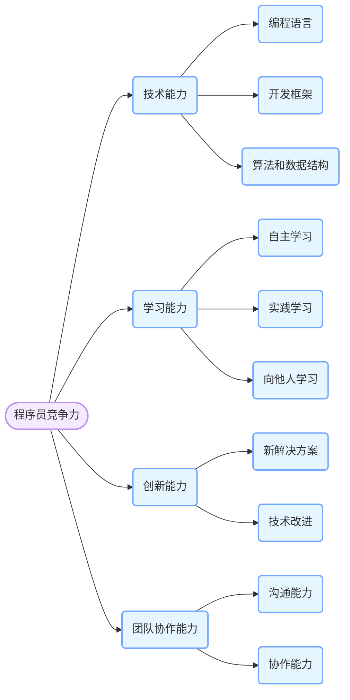

# 程序员如何在技术变革中保持竞争力

> 关键词：程序员、技术变革、竞争力、持续学习、技能升级

> 摘要：在当今快速发展的科技时代，技术变革日新月异，这对程序员的能力和素质提出了更高的要求。本文旨在深入探讨程序员如何在技术变革中保持竞争力，从背景介绍入手，分析技术变革的现状和对程序员的影响；阐述核心概念，明确保持竞争力的关键要素；详细讲解核心算法原理和操作步骤，为程序员提供实用的方法；通过数学模型和公式进一步剖析问题；结合项目实战案例，加深理解和应用；探讨实际应用场景，使理论与实践相结合；推荐相关工具和资源，助力程序员不断提升；最后总结未来发展趋势与挑战，并提供常见问题解答和扩展阅读参考资料，为程序员在技术变革的浪潮中保持竞争力提供全面且有深度的指导。

## 1. 背景介绍 
### 1.1 目的和范围
本文章的主要目的是为广大程序员提供在技术变革背景下保持竞争力的有效策略和方法。范围涵盖了从技术变革的现状分析，到程序员所需具备的核心能力和技能，再到实际的项目操作和应用场景，以及相关的工具资源推荐等多个方面，全面且系统地探讨如何帮助程序员在不断变化的技术环境中脱颖而出。

### 1.2 预期读者
本文预期读者主要为广大程序员群体，包括初入职场的新手程序员、有一定经验的中级程序员以及寻求进一步突破的高级程序员。同时，也可供计算机相关专业的学生、技术管理者以及对技术发展和职业规划感兴趣的人士参考。

### 1.3 文档结构概述
本文将按照以下结构展开：首先介绍背景信息，包括目的、预期读者和文档结构概述等；接着阐述核心概念与联系，明确保持竞争力的关键要素和相互关系；然后详细讲解核心算法原理和具体操作步骤，为程序员提供实用的方法和指导；通过数学模型和公式进一步剖析问题，加深理解；结合项目实战案例，展示如何将理论应用于实际；探讨实际应用场景，使理论与实践相结合；推荐相关工具和资源，助力程序员不断提升；最后总结未来发展趋势与挑战，并提供常见问题解答和扩展阅读参考资料。

### 1.4 术语表
#### 1.4.1 核心术语定义
- **技术变革**：指在科技领域中，由于新的科学发现、创新技术的出现以及市场需求的变化等因素，导致现有技术体系发生重大改变和更新的过程。
- **程序员竞争力**：指程序员在技术能力、学习能力、创新能力、团队协作能力等方面所具备的优势，使其在就业市场和技术领域中能够脱颖而出，获得更好的职业发展机会。
- **持续学习**：指程序员不断地获取新知识、新技能，以适应技术变革和职业发展的需要，保持自身的竞争力。
- **技能升级**：指程序员通过学习和实践，提升自己在现有技术领域的专业技能，或者掌握新的技术和工具，以适应不断变化的技术需求。

#### 1.4.2 相关概念解释
- **技术栈**：指程序员在开发过程中所使用的一系列技术和工具的组合，包括编程语言、框架、数据库、开发环境等。
- **开源社区**：指由开发者自愿参与、共同维护和分享开源软件项目的社区，是程序员获取知识、交流经验和展示自己的重要平台。
- **敏捷开发**：指一种软件开发方法，强调快速响应变化、团队协作和持续交付，能够提高软件开发的效率和质量。

#### 1.4.3 缩略词列表
- **AI**：Artificial Intelligence，人工智能
- **ML**：Machine Learning，机器学习
- **DL**：Deep Learning，深度学习
- **DevOps**：Development and Operations，开发与运维一体化
- **CI/CD**：Continuous Integration/Continuous Delivery，持续集成/持续交付

## 2. 核心概念与联系 

### 核心概念原理
在技术变革的背景下，程序员要保持竞争力，需要关注以下几个核心概念：
- **技术能力**：这是程序员的核心竞争力之一，包括掌握多种编程语言、熟悉各种开发框架和工具、具备良好的算法和数据结构基础等。技术能力的高低直接影响程序员的工作效率和质量。
- **学习能力**：由于技术更新换代速度极快，程序员需要具备强大的学习能力，能够快速掌握新的技术和知识。学习能力不仅包括自主学习的能力，还包括从实践中学习和向他人学习的能力。
- **创新能力**：在激烈的市场竞争中，创新能力是程序员脱颖而出的关键。创新能力包括提出新的解决方案、改进现有技术和产品等方面。
- **团队协作能力**：现代软件开发往往需要团队协作，因此程序员需要具备良好的团队协作能力，能够与团队成员有效地沟通和协作，共同完成项目任务。

### 架构的文本示意图
```plaintext
程序员竞争力
|-- 技术能力
|   |-- 编程语言
|   |-- 开发框架
|   |-- 算法和数据结构
|-- 学习能力
|   |-- 自主学习
|   |-- 实践学习
|   |-- 向他人学习
|-- 创新能力
|   |-- 新解决方案
|   |-- 技术改进
|-- 团队协作能力
|   |-- 沟通能力
|   |-- 协作能力
```

### Mermaid 流程图


## 3. 核心算法原理 & 具体操作步骤 

### 核心算法原理
我们可以将程序员保持竞争力的过程看作一个优化算法，目标是在技术变革的环境中最大化程序员的竞争力。为了实现这个目标，我们需要不断地更新和优化程序员的技术能力、学习能力、创新能力和团队协作能力。可以用以下公式来表示：

$$
\text{竞争力} = f(\text{技术能力}, \text{学习能力}, \text{创新能力}, \text{团队协作能力})
$$

其中，$f$ 是一个复杂的函数，它表示这些能力之间的相互关系和权重。为了提高竞争力，我们需要不断地对这些能力进行评估和改进。

### 具体操作步骤
#### 步骤 1：自我评估
程序员需要对自己的技术能力、学习能力、创新能力和团队协作能力进行全面的评估。可以通过以下方法进行评估：
- **技术能力评估**：通过编写代码、解决算法问题、参加技术面试等方式，评估自己在编程语言、开发框架、算法和数据结构等方面的掌握程度。
- **学习能力评估**：回顾自己学习新技术和知识的速度和效果，评估自己的学习方法和习惯是否有效。
- **创新能力评估**：思考自己在过去的项目中是否提出过新的解决方案或改进过现有技术，评估自己的创新思维和能力。
- **团队协作能力评估**：通过与团队成员的沟通和协作，了解自己在团队中的表现，评估自己的沟通能力和协作能力。

以下是一个简单的 Python 代码示例，用于记录和评估自己的技术能力：
```python
# 定义技术能力评估指标
skills = {
    "编程语言": ["Python", "Java", "C++"],
    "开发框架": ["Django", "Spring", "React"],
    "算法和数据结构": ["排序算法", "搜索算法", "链表", "栈", "队列"]
}

# 初始化评估结果
assessment = {}
for category, skill_list in skills.items():
    assessment[category] = {}
    for skill in skill_list:
        # 这里可以根据实际情况进行评分，例如 0-10 分
        score = int(input(f"请对 {skill} 的掌握程度进行评分（0-10 分）："))
        assessment[category][skill] = score

# 打印评估结果
print("技术能力评估结果：")
for category, skill_scores in assessment.items():
    print(f"{category}:")
    for skill, score in skill_scores.items():
        print(f"  {skill}: {score} 分")
```

#### 步骤 2：制定学习计划
根据自我评估的结果，程序员需要制定一个详细的学习计划，明确自己需要学习和提升的技能。学习计划应该包括学习目标、学习内容、学习时间和学习方法等。例如，如果评估结果显示自己在某个编程语言方面的掌握程度较低，可以制定一个学习该编程语言的计划，包括学习相关的书籍、在线课程、实践项目等。

#### 步骤 3：持续学习和实践
制定好学习计划后，程序员需要按照计划进行持续学习和实践。学习过程中，要注重理论与实践相结合，通过实践项目来巩固所学的知识和技能。可以参加开源项目、自己动手实现一些小的应用程序等。

#### 步骤 4：创新和改进
在学习和实践的过程中，程序员要不断地思考和探索，尝试提出新的解决方案和改进现有技术。可以关注行业的最新动态和研究成果，从中获取灵感。

#### 步骤 5：团队协作和交流
程序员要积极参与团队项目，与团队成员进行有效的沟通和协作。在团队中，要学会倾听他人的意见和建议，不断提升自己的团队协作能力。同时，要积极参加技术交流活动，与其他程序员分享自己的经验和见解。

## 4. 数学模型和公式 & 详细讲解 & 举例说明 

### 数学模型
我们可以将程序员的竞争力用一个多维向量来表示：

$$
\vec{C} = [C_{tech}, C_{learn}, C_{innov}, C_{team}]
$$

其中，$\vec{C}$ 表示程序员的竞争力向量，$C_{tech}$ 表示技术能力，$C_{learn}$ 表示学习能力，$C_{innov}$ 表示创新能力，$C_{team}$ 表示团队协作能力。每个能力维度可以用一个标量来表示，其取值范围可以根据实际情况进行定义，例如 0-10 分。

### 公式
为了综合评估程序员的竞争力，我们可以使用加权求和的方法：

$$
\text{竞争力} = w_{tech} \times C_{tech} + w_{learn} \times C_{learn} + w_{innov} \times C_{innov} + w_{team} \times C_{team}
$$

其中，$w_{tech}$、$w_{learn}$、$w_{innov}$ 和 $w_{team}$ 分别表示技术能力、学习能力、创新能力和团队协作能力的权重，且满足 $w_{tech} + w_{learn} + w_{innov} + w_{team} = 1$。

### 详细讲解
这个公式的含义是，程序员的竞争力是由技术能力、学习能力、创新能力和团队协作能力共同决定的，每个能力的权重反映了其在整体竞争力中的重要程度。例如，如果一个程序员所在的团队更注重技术能力，那么 $w_{tech}$ 的值可以设置得相对较大；如果团队更注重创新能力，那么 $w_{innov}$ 的值可以设置得相对较大。

### 举例说明
假设一个程序员的技术能力评分为 8 分，学习能力评分为 7 分，创新能力评分为 6 分，团队协作能力评分为 8 分，且权重分别为 $w_{tech} = 0.3$，$w_{learn} = 0.2$，$w_{innov} = 0.2$，$w_{team} = 0.3$。则该程序员的竞争力为：

$$
\begin{align*}
\text{竞争力} &= 0.3 \times 8 + 0.2 \times 7 + 0.2 \times 6 + 0.3 \times 8 \\
&= 2.4 + 1.4 + 1.2 + 2.4 \\
&= 7.4
\end{align*}
$$

通过这个例子可以看出，通过合理设置权重，可以更准确地评估程序员的竞争力，并根据评估结果有针对性地进行能力提升。

## 5. 项目实战：代码实际案例和详细解释说明 

### 5.1  开发环境搭建
假设我们要开发一个简单的 Web 应用程序，使用 Python 的 Django 框架。以下是开发环境搭建的步骤：

#### 步骤 1：安装 Python
首先，需要安装 Python 解释器。可以从 Python 官方网站（https://www.python.org/downloads/） 下载适合自己操作系统的 Python 版本，并按照安装向导进行安装。

#### 步骤 2：创建虚拟环境
为了避免不同项目之间的依赖冲突，建议使用虚拟环境。可以使用 Python 的 `venv` 模块来创建虚拟环境：
```bash
python -m venv myenv
```

#### 步骤 3：激活虚拟环境
在 Windows 系统中，可以使用以下命令激活虚拟环境：
```bash
myenv\Scripts\activate
```
在 Linux 或 macOS 系统中，可以使用以下命令激活虚拟环境：
```bash
source myenv/bin/activate
```

#### 步骤 4：安装 Django
激活虚拟环境后，可以使用 `pip` 命令安装 Django：
```bash
pip install django
```

### 5.2  源代码详细实现和代码解读
#### 步骤 1：创建 Django 项目
使用以下命令创建一个新的 Django 项目：
```bash
django-admin startproject myproject
```

#### 步骤 2：创建 Django 应用
进入项目目录，并使用以下命令创建一个新的 Django 应用：
```bash
cd myproject
python manage.py startapp myapp
```

#### 步骤 3：配置项目
打开 `myproject/settings.py` 文件，将 `myapp` 添加到 `INSTALLED_APPS` 列表中：
```python
INSTALLED_APPS = [
    # ...
    'myapp',
]
```

#### 步骤 4：编写视图函数
打开 `myapp/views.py` 文件，编写一个简单的视图函数：
```python
from django.http import HttpResponse

def hello(request):
    return HttpResponse("Hello, World!")
```

#### 步骤 5：配置 URL
打开 `myapp/urls.py` 文件（如果不存在则创建），配置 URL 路由：
```python
from django.urls import path
from . import views

urlpatterns = [
    path('hello/', views.hello, name='hello'),
]
```

然后打开 `myproject/urls.py` 文件，将 `myapp` 的 URL 配置包含进来：
```python
from django.contrib import admin
from django.urls import path, include

urlpatterns = [
    path('admin/', admin.site.urls),
    path('', include('myapp.urls')),
]
```

#### 步骤 6：运行项目
使用以下命令运行 Django 项目：
```bash
python manage.py runserver
```

### 5.3  代码解读与分析
- **视图函数**：`hello` 视图函数是一个简单的函数，它接收一个 `request` 对象作为参数，并返回一个 `HttpResponse` 对象。`HttpResponse` 对象包含了要返回给客户端的内容。
- **URL 配置**：`urls.py` 文件中定义了 URL 路由规则，将 URL 路径映射到相应的视图函数。例如，当用户访问 `/hello/` 路径时，会调用 `hello` 视图函数。
- **项目结构**：Django 项目采用了模块化的结构，将不同的功能模块划分到不同的应用中。`myproject` 是项目的根目录，`myapp` 是一个应用目录，每个应用可以有自己的视图、模型、模板等。

通过这个简单的项目实战，程序员可以加深对 Django 框架的理解和掌握，提升自己的技术能力。

## 6. 实际应用场景 
### 互联网企业
在互联网企业中，技术变革的速度非常快，程序员需要不断地学习和掌握新的技术，以满足业务发展的需求。例如，随着移动互联网的发展，程序员需要掌握移动开发技术，如 Android 和 iOS 开发；随着人工智能和大数据的兴起，程序员需要学习相关的算法和框架，如 TensorFlow 和 PyTorch。同时，互联网企业通常采用敏捷开发方法，要求程序员具备良好的团队协作能力和快速响应变化的能力。

### 金融行业
金融行业对安全性和稳定性要求较高，同时也在不断地进行数字化转型。程序员在金融行业中需要掌握安全编程技术，如加密算法、身份验证等；同时，也需要学习数据分析和机器学习技术，以支持金融业务的决策和风险控制。例如，银行可以利用机器学习算法进行客户信用评估和风险预测。

### 医疗行业
医疗行业的信息化程度越来越高，程序员在医疗行业中可以发挥重要的作用。例如，开发医疗信息系统、电子病历系统等；利用人工智能技术进行疾病诊断和治疗方案推荐。同时，医疗行业对数据的安全性和隐私性要求非常高，程序员需要严格遵守相关的法律法规和行业标准。

### 制造业
制造业正在向智能制造方向发展，程序员可以参与开发工业互联网平台、智能机器人控制系统等。在这个过程中，程序员需要掌握物联网技术、工业自动化技术等，以实现设备的互联互通和智能化控制。

## 7. 工具和资源推荐
### 7.1 学习资源推荐
#### 7.1.1 书籍推荐
- 《Python 编程：从入门到实践》：适合初学者学习 Python 编程语言。
- 《算法导论》：经典的算法书籍，深入讲解了各种算法的原理和实现。
- 《代码大全》：全面介绍了软件开发的各个方面，包括代码设计、编程规范、调试等。
- 《Effective Java》：对于 Java 程序员来说，是一本非常实用的书籍，介绍了 Java 编程的最佳实践。
- 《人工智能：一种现代的方法》：系统地介绍了人工智能的基本概念、算法和应用。

#### 7.1.2 在线课程
- Coursera：提供了丰富的计算机科学和编程相关的在线课程，由全球知名大学和机构的教授授课。
- edX：同样是一个知名的在线学习平台，提供了很多高质量的编程和技术课程。
- Udemy：有大量的编程课程可供选择，价格相对较为灵活。
- 中国大学 MOOC：国内的在线学习平台，提供了很多国内高校的计算机相关课程。

#### 7.1.3 技术博客和网站
- Medium：是一个汇聚了众多技术专家和开发者的博客平台，有很多关于编程、技术趋势等方面的优质文章。
- Stack Overflow：是程序员的问答社区，遇到编程问题可以在这里查找答案和寻求帮助。
- GitHub Blog：可以了解到关于开源项目、软件开发等方面的最新动态和技术分享。
- 开源中国：国内的开源技术社区，提供了很多开源项目的介绍和技术文章。

### 7.2 开发工具框架推荐
#### 7.2.1 IDE和编辑器
- PyCharm：专业的 Python 集成开发环境，功能强大，适合 Python 开发。
- IntelliJ IDEA：优秀的 Java 开发工具，支持多种开发框架和插件。
- Visual Studio Code：轻量级的代码编辑器，支持多种编程语言，有丰富的插件生态系统。
- Sublime Text：简洁高效的代码编辑器，适合快速编写代码。

#### 7.2.2 调试和性能分析工具
- pdb：Python 自带的调试器，可以帮助程序员定位和解决代码中的问题。
- VisualVM：Java 性能分析工具，可以监控 Java 应用程序的性能指标，如内存使用、线程状态等。
- Chrome DevTools：前端开发调试工具，可以帮助开发者调试网页代码、分析性能等。

#### 7.2.3 相关框架和库
- Django：Python 的 Web 开发框架，提供了丰富的功能和工具，适合快速开发 Web 应用程序。
- Spring Boot：Java 的开发框架，简化了 Spring 应用的开发过程，提高了开发效率。
- React：JavaScript 的前端开发框架，用于构建用户界面，具有高效、灵活的特点。
- TensorFlow：开源的机器学习框架，广泛应用于人工智能领域。

### 7.3 相关论文著作推荐
#### 7.3.1 经典论文
- 《A Mathematical Theory of Communication》：香农的经典论文，奠定了信息论的基础。
- 《The Art of Computer Programming》：高德纳的系列著作，是计算机科学领域的经典之作。
- 《RFC 791》：定义了互联网协议（IP）的标准文档。

#### 7.3.2 最新研究成果
- arXiv：预印本平台，提供了很多最新的计算机科学和技术领域的研究论文。
- ACM Digital Library：计算机协会的数字图书馆，收录了很多高质量的学术论文。
- IEEE Xplore：电气和电子工程师协会的数字图书馆，包含了很多关于计算机、通信等领域的研究成果。

#### 7.3.3 应用案例分析
- 《Lean Software Development: An Agile Toolkit》：介绍了精益软件开发的方法和实践，通过实际案例分析了如何提高软件开发的效率和质量。
- 《Continuous Delivery: Reliable Software Releases through Build, Test, and Deployment Automation》：讲述了持续交付的理念和实践，通过案例展示了如何实现软件的快速、可靠发布。

## 8. 总结：未来发展趋势与挑战
### 未来发展趋势
- **人工智能和机器学习的普及**：人工智能和机器学习技术将在各个领域得到更广泛的应用，程序员需要掌握相关的算法和框架，以满足市场需求。
- **云计算和容器化技术的发展**：云计算和容器化技术将继续推动软件开发和部署方式的变革，程序员需要了解相关的技术和工具，如 Docker 和 Kubernetes。
- **物联网的兴起**：物联网将连接更多的设备和系统，程序员需要掌握物联网相关的技术，如传感器技术、通信协议等。
- **低代码和无代码开发的趋势**：低代码和无代码开发平台将降低软件开发的门槛，提高开发效率，程序员需要适应这种变化，学习如何使用这些平台。

### 挑战
- **技术更新换代快**：技术变革的速度越来越快，程序员需要不断地学习和更新自己的知识和技能，以跟上技术发展的步伐。
- **竞争激烈**：随着编程行业的发展，竞争越来越激烈，程序员需要不断提升自己的竞争力，才能在就业市场中脱颖而出。
- **安全和隐私问题**：随着信息技术的发展，安全和隐私问题越来越受到关注，程序员需要具备安全编程的意识和技能，保护用户的数据安全和隐私。
- **跨领域知识需求**：未来的软件开发往往需要涉及多个领域的知识，程序员需要具备跨领域学习和合作的能力。

## 9. 附录：常见问题与解答
### 问题 1：如何选择适合自己的技术方向？
解答：选择适合自己的技术方向需要考虑多个因素，如个人兴趣、市场需求、自身优势等。可以先了解各个技术方向的发展趋势和应用场景，然后结合自己的兴趣和优势进行选择。同时，也可以参考行业内的专家和前辈的建议。

### 问题 2：如何提高自己的学习效率？
解答：提高学习效率可以从以下几个方面入手：制定合理的学习计划，合理安排学习时间；选择适合自己的学习方法，如阅读书籍、观看在线课程、实践项目等；多与他人交流和分享，从他人的经验中学习；及时总结和复习所学的知识，加深理解和记忆。

### 问题 3：如何在工作中保持竞争力？
解答：在工作中保持竞争力需要不断学习和提升自己的技能，关注行业的最新动态和技术发展趋势；积极参与项目，积累实践经验；与团队成员保持良好的沟通和协作，提高团队协作能力；勇于创新，提出新的解决方案和改进现有技术。

### 问题 4：如何应对技术变革带来的挑战？
解答：应对技术变革带来的挑战需要保持积极的学习态度，不断学习新的技术和知识；提高自己的适应能力，能够快速适应技术变革带来的变化；加强与同行的交流和合作，分享经验和资源；关注行业的发展趋势，提前做好准备。

## 10. 扩展阅读 & 参考资料
### 扩展阅读
- 《浪潮之巅》：讲述了科技行业的发展历程和兴衰变迁，对程序员了解行业发展趋势有很大的帮助。
- 《黑客与画家》：探讨了黑客文化和编程的本质，激发程序员的创新思维。
- 《软技能：代码之外的生存指南》：介绍了程序员在职业生涯中需要具备的各种软技能，如沟通、管理、职业规划等。

### 参考资料
- Python 官方文档：https://docs.python.org/
- Django 官方文档：https://docs.djangoproject.com/
- Java 官方文档：https://docs.oracle.com/en/java/
- React 官方文档：https://reactjs.org/docs/getting-started.html
- TensorFlow 官方文档：https://www.tensorflow.org/api_docs

通过阅读这些扩展阅读和参考资料，程序员可以进一步深入了解相关的技术和知识，提升自己的技术水平和竞争力。