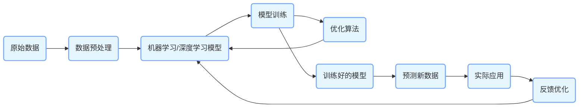

# 程序员如何融合AI技术实现职业升级

> 关键词：程序员、AI技术、职业升级、技术融合、人工智能应用

> 摘要：在当今数字化时代，AI技术迅猛发展，深刻改变着各个领域。对于程序员而言，融合AI技术是实现职业升级的重要途径。本文围绕程序员如何融合AI技术展开，详细阐述AI技术的核心概念与联系，深入剖析其核心算法原理及操作步骤，介绍相关数学模型和公式，并通过项目实战案例进行说明。同时探讨AI技术在实际中的应用场景，推荐学习资源、开发工具和相关论文著作。最后总结未来发展趋势与挑战，解答常见问题，为程序员提供全面、深入的指导，助力其实现职业升级。

## 1. 背景介绍 
### 1.1 目的和范围
本文章的主要目的是为广大程序员提供一套系统的、切实可行的融合AI技术实现职业升级的方法和思路。范围涵盖了AI技术的基本概念、算法原理、数学模型，以及如何在实际项目中应用AI技术，还包括相关的学习资源、开发工具和未来发展趋势等内容，旨在帮助程序员全面了解和掌握融合AI技术的要点。

### 1.2 预期读者
本文预期读者主要是广大程序员群体，包括初级程序员、有一定经验的中级程序员以及寻求技术突破的高级程序员。同时，对AI技术感兴趣，希望了解如何将其与编程结合的技术爱好者也可以从中获得有价值的信息。

### 1.3 文档结构概述
本文将按照以下结构展开：首先介绍背景信息，包括目的、读者和文档结构等；接着阐述AI技术的核心概念与联系，通过文本示意图和Mermaid流程图进行展示；然后深入讲解核心算法原理和具体操作步骤，并使用Python源代码进行详细说明；再介绍相关的数学模型和公式，并举例说明；通过项目实战案例，包括开发环境搭建、源代码实现和代码解读，进一步加深理解；探讨AI技术的实际应用场景；推荐学习资源、开发工具和相关论文著作；总结未来发展趋势与挑战；解答常见问题；最后提供扩展阅读和参考资料。

### 1.4 术语表
#### 1.4.1 核心术语定义
- **AI（Artificial Intelligence）**：人工智能，是研究、开发用于模拟、延伸和扩展人的智能的理论、方法、技术及应用系统的一门新的技术科学。
- **机器学习（Machine Learning）**：一门多领域交叉学科，涉及概率论、统计学、逼近论、凸分析、算法复杂度理论等多门学科。它专门研究计算机怎样模拟或实现人类的学习行为，以获取新的知识或技能，重新组织已有的知识结构使之不断改善自身的性能。
- **深度学习（Deep Learning）**：机器学习的一个分支领域，它是一种基于对数据进行表征学习的方法。深度学习通过构建具有很多层的神经网络模型，自动从大量数据中学习特征和模式。
- **神经网络（Neural Network）**：一种模仿人类神经系统的计算模型，由大量的神经元组成，这些神经元相互连接形成网络，通过对输入数据的处理和学习，实现模式识别、分类、预测等功能。

#### 1.4.2 相关概念解释
- **监督学习（Supervised Learning）**：在监督学习中，训练数据包含输入特征和对应的标签。模型通过学习输入特征和标签之间的关系，来对新的输入数据进行预测。例如，在图像分类任务中，训练数据是包含图像和其对应的类别标签，模型学习图像特征和类别之间的映射关系。
- **无监督学习（Unsupervised Learning）**：无监督学习的训练数据只包含输入特征，没有对应的标签。模型的目标是发现数据中的内在结构和模式，例如聚类分析，将相似的数据点划分到同一个类别中。
- **强化学习（Reinforcement Learning）**：智能体通过与环境进行交互，根据环境反馈的奖励信号来学习最优的行为策略。例如，在游戏中，智能体通过不断尝试不同的动作，根据游戏得分（奖励信号）来学习如何做出最优决策。

#### 1.4.3 缩略词列表
- **CNN（Convolutional Neural Network）**：卷积神经网络，一种专门用于处理具有网格结构数据（如图像）的神经网络。
- **RNN（Recurrent Neural Network）**：循环神经网络，用于处理序列数据，能够捕捉序列中的时间依赖关系。
- **LSTM（Long Short-Term Memory）**：长短期记忆网络，是RNN的一种改进版本，能够有效解决长序列数据中的梯度消失和梯度爆炸问题。
- **GAN（Generative Adversarial Network）**：生成对抗网络，由生成器和判别器组成，通过两者的对抗训练来生成新的数据。

## 2. 核心概念与联系 
### 核心概念原理
人工智能是一个广泛的领域，其中机器学习是实现人工智能的主要方法之一。机器学习通过从数据中学习模式和规律，来实现对未知数据的预测和决策。深度学习作为机器学习的一个分支，通过构建深度神经网络，能够自动从大量数据中学习到复杂的特征表示。

神经网络是深度学习的核心模型，它由输入层、隐藏层和输出层组成。输入层接收原始数据，隐藏层对数据进行非线性变换和特征提取，输出层输出最终的预测结果。神经元是神经网络的基本单元，它接收来自其他神经元的输入，经过加权求和和非线性激活函数处理后，产生输出。

### 架构的文本示意图
AI技术的核心架构可以表示为：数据是基础，通过数据预处理（包括清洗、归一化等操作）将原始数据转换为适合模型处理的格式。然后将处理后的数据输入到机器学习或深度学习模型中进行训练。模型训练过程中，通过优化算法（如梯度下降）不断调整模型的参数，以最小化预测结果与真实标签之间的误差。训练好的模型可以用于对新的数据进行预测和决策，并且可以将预测结果反馈到实际应用中，根据应用效果进一步优化模型。

### Mermaid流程图


## 3. 核心算法原理 & 具体操作步骤 
### 线性回归算法原理
线性回归是一种简单而常用的机器学习算法，用于预测连续值的输出。其基本原理是假设输入特征 $x$ 和输出 $y$ 之间存在线性关系，即 $y = \theta_0 + \theta_1x_1 + \theta_2x_2 + \cdots + \theta_nx_n$，其中 $\theta_i$ 是模型的参数。

### 具体操作步骤
1. **数据准备**：收集包含输入特征和对应输出值的数据集，并将其划分为训练集和测试集。
2. **模型初始化**：随机初始化模型的参数 $\theta$。
3. **定义损失函数**：常用的损失函数是均方误差（Mean Squared Error，MSE），即 $J(\theta) = \frac{1}{2m}\sum_{i=1}^{m}(h_{\theta}(x^{(i)}) - y^{(i)})^2$，其中 $m$ 是样本数量，$h_{\theta}(x^{(i)})$ 是模型对第 $i$ 个样本的预测值，$y^{(i)}$ 是第 $i$ 个样本的真实值。
4. **参数更新**：使用梯度下降算法更新模型的参数，梯度下降的更新公式为 $\theta_j := \theta_j - \alpha\frac{\partial J(\theta)}{\partial \theta_j}$，其中 $\alpha$ 是学习率。
5. **模型评估**：使用测试集评估模型的性能，常用的评估指标包括均方误差、均方根误差（Root Mean Squared Error，RMSE）等。

### Python源代码实现
```python
import numpy as np

class LinearRegression:
    def __init__(self, learning_rate=0.01, num_iterations=1000):
        self.learning_rate = learning_rate
        self.num_iterations = num_iterations
        self.weights = None
        self.bias = None

    def fit(self, X, y):
        num_samples, num_features = X.shape
        self.weights = np.zeros(num_features)
        self.bias = 0

        for _ in range(self.num_iterations):
            y_pred = np.dot(X, self.weights) + self.bias

            dw = (1 / num_samples) * np.dot(X.T, (y_pred - y))
            db = (1 / num_samples) * np.sum(y_pred - y)

            self.weights -= self.learning_rate * dw
            self.bias -= self.learning_rate * db

    def predict(self, X):
        return np.dot(X, self.weights) + self.bias
```

### 代码解释
- `__init__` 方法：初始化模型的学习率和迭代次数，并将权重和偏置初始化为 None。
- `fit` 方法：实现模型的训练过程，包括前向传播计算预测值，计算损失函数的梯度，然后使用梯度下降算法更新权重和偏置。
- `predict` 方法：根据输入的特征数据，计算模型的预测值。

## 4. 数学模型和公式 & 详细讲解 & 举例说明 
### 线性回归的数学模型
线性回归的数学模型可以表示为 $y = \theta^T x + \epsilon$，其中 $\theta$ 是模型的参数向量，$x$ 是输入特征向量，$\epsilon$ 是误差项，通常假设 $\epsilon$ 服从均值为 0，方差为 $\sigma^2$ 的正态分布。

### 损失函数
均方误差损失函数的公式为：
$$J(\theta) = \frac{1}{2m}\sum_{i=1}^{m}(h_{\theta}(x^{(i)}) - y^{(i)})^2$$
其中 $m$ 是样本数量，$h_{\theta}(x^{(i)})$ 是模型对第 $i$ 个样本的预测值，$y^{(i)}$ 是第 $i$ 个样本的真实值。

### 梯度计算
损失函数对参数 $\theta_j$ 的梯度为：
$$\frac{\partial J(\theta)}{\partial \theta_j} = \frac{1}{m}\sum_{i=1}^{m}(h_{\theta}(x^{(i)}) - y^{(i)})x_j^{(i)}$$

### 举例说明
假设我们有一个简单的数据集，包含两个特征 $x_1$ 和 $x_2$，以及对应的输出 $y$。数据集如下：
| $x_1$ | $x_2$ | $y$ |
|-------|-------|-----|
| 1     | 2     | 3   |
| 2     | 3     | 5   |
| 3     | 4     | 7   |

我们使用上述线性回归模型进行训练。首先，将数据集转换为矩阵形式：
$$X = \begin{bmatrix}
1 & 2 \\
2 & 3 \\
3 & 4
\end{bmatrix}, y = \begin{bmatrix}
3 \\
5 \\
7
\end{bmatrix}$$

初始化参数 $\theta = \begin{bmatrix}
0 \\
0
\end{bmatrix}$，偏置 $b = 0$。然后，使用梯度下降算法进行迭代更新。经过多次迭代后，模型的参数会逐渐收敛到最优值，从而得到一个能够较好地拟合数据的线性回归模型。

## 5. 项目实战：代码实际案例和详细解释说明 
### 5.1  开发环境搭建
1. **安装Python**：从Python官方网站（https://www.python.org/downloads/）下载并安装Python 3.x 版本。
2. **安装必要的库**：使用pip命令安装所需的库，包括NumPy、Pandas、Scikit-learn等。
```bash
pip install numpy pandas scikit-learn
```
3. **选择开发工具**：可以选择PyCharm、Jupyter Notebook等作为开发工具。

### 5.2  源代码详细实现和代码解读
我们以波士顿房价预测为例，使用线性回归模型进行项目实战。

```python
import numpy as np
import pandas as pd
from sklearn.datasets import load_boston
from sklearn.model_selection import train_test_split
from sklearn.linear_model import LinearRegression
from sklearn.metrics import mean_squared_error

# 加载数据集
boston = load_boston()
X = pd.DataFrame(boston.data, columns=boston.feature_names)
y = pd.Series(boston.target)

# 划分训练集和测试集
X_train, X_test, y_train, y_test = train_test_split(X, y, test_size=0.2, random_state=42)

# 创建线性回归模型
model = LinearRegression()

# 训练模型
model.fit(X_train, y_train)

# 进行预测
y_pred = model.predict(X_test)

# 计算均方误差
mse = mean_squared_error(y_test, y_pred)
print(f"均方误差: {mse}")
```

### 代码解读
1. **加载数据集**：使用 `load_boston` 函数从Scikit-learn库中加载波士顿房价数据集，并将其转换为Pandas DataFrame和Series对象。
2. **划分训练集和测试集**：使用 `train_test_split` 函数将数据集划分为训练集和测试集，其中测试集占总数据集的20%。
3. **创建线性回归模型**：使用 `LinearRegression` 类创建一个线性回归模型。
4. **训练模型**：使用 `fit` 方法对模型进行训练，将训练集的特征数据和标签数据作为输入。
5. **进行预测**：使用 `predict` 方法对测试集的特征数据进行预测，得到预测结果。
6. **计算均方误差**：使用 `mean_squared_error` 函数计算预测结果和真实标签之间的均方误差，评估模型的性能。

### 5.3  代码解读与分析
通过上述代码，我们可以看到使用线性回归模型进行房价预测的基本流程。首先，我们需要准备好数据集，并将其划分为训练集和测试集。然后，创建线性回归模型并进行训练。最后，使用训练好的模型对测试集进行预测，并计算预测结果的均方误差。

均方误差是一个常用的评估指标，它衡量了预测结果和真实标签之间的平均误差。均方误差越小，说明模型的性能越好。在实际应用中，我们可以通过调整模型的参数（如学习率、迭代次数等）或使用更复杂的模型来提高模型的性能。

## 6. 实际应用场景 
### 图像识别
AI技术在图像识别领域有广泛的应用，例如人脸识别、物体检测、图像分类等。在人脸识别中，通过深度学习模型可以提取人脸的特征，然后进行比对和识别。在物体检测中，模型可以检测出图像中不同物体的位置和类别。图像分类则可以将图像分为不同的类别，如动物、植物、风景等。

### 自然语言处理
自然语言处理是AI技术的另一个重要应用领域，包括文本分类、情感分析、机器翻译、问答系统等。文本分类可以将文本分为不同的类别，如新闻分类、垃圾邮件分类等。情感分析可以分析文本中表达的情感倾向，如积极、消极、中性等。机器翻译可以将一种语言翻译成另一种语言。问答系统可以根据用户的问题提供相应的答案。

### 推荐系统
推荐系统是电商、社交、视频等平台常用的技术，通过AI技术可以根据用户的历史行为、偏好等信息，为用户推荐个性化的商品、内容等。例如，电商平台可以根据用户的购买历史和浏览记录，推荐用户可能感兴趣的商品。视频平台可以根据用户的观看历史，推荐用户可能喜欢的视频。

### 医疗领域
AI技术在医疗领域也有重要的应用，如疾病诊断、医学影像分析、药物研发等。在疾病诊断中，通过分析患者的症状、病历等信息，AI模型可以辅助医生进行疾病的诊断。医学影像分析可以帮助医生更准确地识别影像中的病变。药物研发中，AI技术可以加速药物的筛选和研发过程。

## 7. 工具和资源推荐
### 7.1 学习资源推荐
#### 7.1.1 书籍推荐
- 《Python机器学习》：全面介绍了机器学习的基本概念、算法和Python实现，适合初学者入门。
- 《深度学习》：由深度学习领域的三位顶尖专家编写，是深度学习领域的经典教材，深入讲解了深度学习的理论和实践。
- 《统计学习方法》：系统介绍了统计学习的基本概念、方法和理论，对理解机器学习的原理有很大帮助。

#### 7.1.2 在线课程
- Coursera上的《机器学习》课程：由斯坦福大学的Andrew Ng教授授课，是机器学习领域的经典课程，内容全面、深入浅出。
- edX上的《深度学习》课程：由微软和伯克利大学联合推出，深入讲解了深度学习的理论和实践。
- 哔哩哔哩（B 站）上有很多关于AI技术的教学视频，涵盖了从基础到高级的各个方面，适合不同水平的学习者。

#### 7.1.3 技术博客和网站
- Medium：上面有很多AI领域的技术博客和文章，涵盖了最新的研究成果和实践经验。
- Towards Data Science：专注于数据科学和AI领域的技术文章，内容丰富、质量较高。
- 开源中国：国内知名的技术社区，有很多关于AI技术的讨论和分享。

### 7.2 开发工具框架推荐
#### 7.2.1 IDE和编辑器
- PyCharm：功能强大的Python集成开发环境，提供了代码编辑、调试、版本控制等一系列功能，适合专业的Python开发。
- Jupyter Notebook：交互式的开发环境，支持代码、文本、图表等多种形式的展示，非常适合数据探索和模型实验。
- Visual Studio Code：轻量级的代码编辑器，支持多种编程语言，有丰富的插件扩展，可用于AI开发。

#### 7.2.2 调试和性能分析工具
- TensorBoard：TensorFlow提供的可视化工具，可以帮助开发者可视化模型的训练过程、网络结构、性能指标等。
- PyTorch Profiler：PyTorch提供的性能分析工具，可以帮助开发者分析模型的性能瓶颈，优化代码。
- cProfile：Python内置的性能分析工具，可以分析代码的运行时间和函数调用情况。

#### 7.2.3 相关框架和库
- TensorFlow：由Google开发的开源深度学习框架，提供了丰富的API和工具，支持分布式训练和部署。
- PyTorch：由Facebook开发的开源深度学习框架，具有动态图的优势，易于使用和调试。
- Scikit-learn：简单易用的机器学习库，提供了各种机器学习算法和工具，适合快速开发和实验。

### 7.3 相关论文著作推荐
#### 7.3.1 经典论文
- 《Gradient-based learning applied to document recognition》：介绍了卷积神经网络（CNN）在手写字符识别中的应用，是CNN领域的经典论文。
- 《Long Short-Term Memory》：提出了长短期记忆网络（LSTM），解决了循环神经网络（RNN）中的梯度消失和梯度爆炸问题。
- 《Generative Adversarial Nets》：提出了生成对抗网络（GAN），开创了生成式模型的新领域。

#### 7.3.2 最新研究成果
- 关注顶级学术会议如NeurIPS、ICML、CVPR等的最新论文，了解AI领域的最新研究动态和技术进展。
- 各大科研机构和高校的研究团队也会在arXiv等预印本平台上发布最新的研究成果。

#### 7.3.3 应用案例分析
- 一些知名公司如Google、Facebook、Microsoft等会在其官方博客或技术分享平台上发布AI技术的应用案例，通过学习这些案例可以了解AI技术在实际业务中的应用和优化方法。

## 8. 总结：未来发展趋势与挑战
### 未来发展趋势
- **AI与其他技术的融合**：AI技术将与物联网、区块链、云计算等技术深度融合，创造出更多的应用场景和商业价值。例如，AI与物联网结合可以实现智能城市、智能家居等应用；AI与区块链结合可以提高数据的安全性和可信度。
- **AI的自动化和智能化**：未来的AI系统将更加自动化和智能化，能够自动完成数据处理、模型选择、参数调优等任务，降低AI应用的门槛。
- **AI在更多领域的应用**：AI技术将在医疗、教育、金融、交通等更多领域得到广泛应用，推动这些领域的数字化转型和创新发展。

### 挑战
- **数据隐私和安全**：AI技术的发展需要大量的数据支持，但数据的隐私和安全问题也日益突出。如何保护用户的数据隐私，防止数据泄露和滥用，是AI发展面临的重要挑战。
- **算法的可解释性**：深度学习模型通常是黑盒模型，其决策过程难以解释。在一些关键领域如医疗、金融等，模型的可解释性至关重要。如何提高算法的可解释性，是当前AI研究的热点问题。
- **人才短缺**：AI技术的快速发展导致对相关人才的需求急剧增加，但目前AI领域的专业人才相对短缺。如何培养更多的AI人才，满足市场的需求，是一个亟待解决的问题。

## 9. 附录：常见问题与解答
### 问题1：学习AI技术需要具备哪些基础知识？
答：学习AI技术需要具备一定的数学基础，包括线性代数、概率论、统计学等。同时，还需要掌握一门编程语言，如Python。此外，了解机器学习的基本概念和算法也是必要的。

### 问题2：如何选择适合的AI框架？
答：选择适合的AI框架需要考虑多个因素，如项目需求、个人偏好、社区支持等。如果是初学者，推荐使用Scikit-learn，它简单易用，适合快速开发和实验。如果是进行深度学习项目，可以选择TensorFlow或PyTorch，它们功能强大，有丰富的文档和社区支持。

### 问题3：AI技术在实际应用中面临哪些困难？
答：AI技术在实际应用中面临的困难包括数据质量问题、模型的泛化能力、计算资源限制、法律法规等。数据质量问题可能导致模型的性能下降；模型的泛化能力不足可能导致在新的数据上表现不佳；计算资源限制可能影响模型的训练和部署效率；法律法规的不完善可能导致AI技术的应用存在风险。

## 10. 扩展阅读 & 参考资料
### 扩展阅读
- 《AI未来进行式》：李开复和王咏刚所著，探讨了AI技术对未来社会、经济、生活的影响。
- 《智能时代》：吴军所著，介绍了AI技术的发展历程和应用前景，以及对人类社会的挑战和机遇。

### 参考资料
- 相关学术论文和研究报告，如IEEE、ACM等学术机构发表的论文。
- 各大AI框架的官方文档和教程，如TensorFlow、PyTorch的官方文档。
- 技术社区和论坛的讨论和分享，如Stack Overflow、GitHub等。