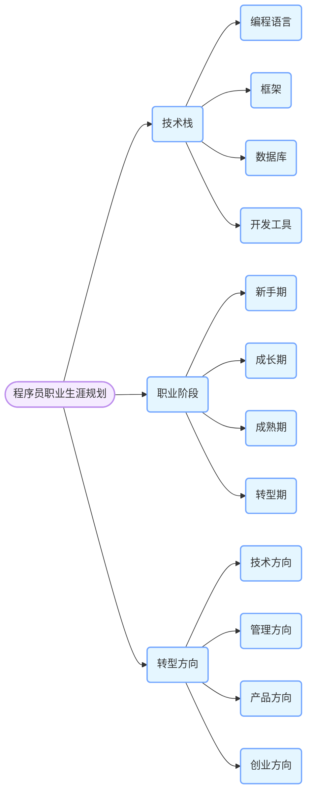

# 程序员的职业生涯规划：适应与转型

> 关键词：程序员、职业生涯规划、适应、转型、技术发展、职业成长

> 摘要：本文围绕程序员的职业生涯规划展开，深入探讨了在快速变化的技术环境中，程序员如何适应新的技术发展并实现成功转型。文章首先介绍了程序员职业生涯规划的背景，包括目的、预期读者、文档结构和相关术语。接着阐述了程序员职业发展中的核心概念与联系，通过示意图和流程图清晰展示。详细讲解了核心算法原理和具体操作步骤，以Python代码为例进行说明。同时给出了相关的数学模型和公式，并举例说明。在项目实战部分，通过实际案例展示了开发环境搭建、源代码实现和代码解读。分析了程序员职业生涯的实际应用场景，推荐了相关的学习资源、开发工具框架和论文著作。最后总结了未来发展趋势与挑战，提供常见问题解答和扩展阅读参考资料，旨在为程序员提供全面、系统的职业生涯规划指导。

## 1. 背景介绍 
### 1.1 目的和范围
在当今数字化时代，信息技术飞速发展，软件行业作为其中的核心领域，变化日新月异。程序员作为软件行业的主力军，面临着前所未有的机遇和挑战。新的编程语言、框架、开发方法不断涌现，技术更新换代的速度越来越快。同时，市场需求也在不断变化，对程序员的技能和综合素质提出了更高的要求。本文章的目的在于为程序员提供一个全面、系统的职业生涯规划指导，帮助他们在不断变化的技术环境中适应新的发展趋势，实现成功的职业转型，从而在职业生涯中取得更好的发展。

本文章的范围涵盖了程序员职业生涯的各个阶段，从初入职场的新手到经验丰富的资深开发者，以及想要从技术岗位向管理、架构师等其他方向转型的程序员。文章将探讨程序员在不同阶段可能面临的问题和挑战，以及相应的应对策略和转型方法。同时，还将介绍相关的技术发展趋势、学习资源、开发工具和论文著作等，为程序员的职业发展提供全方位的支持。

### 1.2 预期读者
本文的预期读者主要是广大程序员群体，包括但不限于以下几类：
1. **新手程序员**：刚刚进入软件行业，对职业生涯规划缺乏清晰认识，希望了解如何在职业生涯初期打下良好基础，快速成长的程序员。
2. **有一定经验的程序员**：已经在行业中工作了一段时间，面临技术瓶颈或职业发展的困惑，希望寻求突破，实现职业转型的程序员。
3. **技术管理者**：负责团队管理和技术指导的管理者，希望了解程序员的职业发展需求，为团队成员提供更好的职业发展规划和支持。
4. **软件行业的从业者和爱好者**：对软件行业的发展趋势和程序员的职业发展感兴趣，希望了解相关知识和经验的人士。

### 1.3 文档结构概述
本文将按照以下结构进行组织：
1. **背景介绍**：介绍文章的目的、范围、预期读者、文档结构和相关术语，为读者提供一个整体的了解。
2. **核心概念与联系**：阐述程序员职业发展中的核心概念，如技术栈、职业阶段、转型方向等，并通过示意图和流程图展示它们之间的联系。
3. **核心算法原理 & 具体操作步骤**：以Python代码为例，讲解程序员在职业生涯规划中可能用到的一些核心算法原理，如技能评估算法、职业路径规划算法等，并给出具体的操作步骤。
4. **数学模型和公式 & 详细讲解 & 举例说明**：介绍与程序员职业生涯规划相关的数学模型和公式，如技能提升曲线模型、职业价值评估公式等，并通过具体例子进行详细讲解。
5. **项目实战：代码实际案例和详细解释说明**：通过实际项目案例，展示开发环境搭建、源代码实现和代码解读，帮助读者更好地理解和应用所学知识。
6. **实际应用场景**：分析程序员在不同职业阶段和场景下的实际应用情况，如技术选型、项目管理、团队协作等。
7. **工具和资源推荐**：推荐相关的学习资源、开发工具框架和论文著作，为读者提供更多的学习和参考途径。
8. **总结：未来发展趋势与挑战**：总结程序员职业生涯规划的未来发展趋势和可能面临的挑战，为读者提供前瞻性的思考。
9. **附录：常见问题与解答**：提供常见问题的解答，帮助读者解决在职业生涯规划过程中遇到的疑惑。
10. **扩展阅读 & 参考资料**：提供相关的扩展阅读资料和参考书籍，供读者进一步深入学习。

### 1.4 术语表
#### 1.4.1 核心术语定义
1. **技术栈**：指程序员在开发过程中所使用的一系列技术和工具的集合，包括编程语言、框架、数据库、开发工具等。
2. **职业阶段**：指程序员在职业生涯中所处的不同阶段，一般包括新手期、成长期、成熟期和转型期。
3. **转型方向**：指程序员从当前的职业角色或技术领域向其他方向转变的方向，如从开发工程师转型为架构师、技术经理、产品经理等。
4. **技能评估**：指对程序员的技术技能、软技能等进行评估，以了解其当前的技能水平和优势劣势。
5. **职业路径规划**：指根据程序员的个人兴趣、技能水平、职业目标等因素，制定合理的职业发展路径和计划。

#### 1.4.2 相关概念解释
1. **技术更新换代**：指随着科技的发展，新的技术、编程语言、框架等不断涌现，旧的技术逐渐被淘汰的过程。
2. **市场需求变化**：指随着社会经济的发展和用户需求的变化，市场对软件产品和服务的需求也在不断变化，从而对程序员的技能和综合素质提出了新的要求。
3. **软技能**：指除了技术技能之外的其他技能，如沟通能力、团队协作能力、问题解决能力、领导力等。
4. **终身学习**：指程序员在职业生涯中需要不断学习和更新知识，以适应技术发展和市场需求的变化。

#### 1.4.3 缩略词列表
1. **IDE**：Integrated Development Environment，集成开发环境。
2. **API**：Application Programming Interface，应用程序编程接口。
3. **DBMS**：Database Management System，数据库管理系统。
4. **AI**：Artificial Intelligence，人工智能。
5. **ML**：Machine Learning，机器学习。

## 2. 核心概念与联系 
### 核心概念原理
#### 技术栈
技术栈是程序员在开发过程中所使用的一系列技术和工具的集合。它反映了程序员的技术能力和专业领域。不同的项目和应用场景可能需要不同的技术栈。例如，一个Web应用开发项目可能需要使用前端技术（如HTML、CSS、JavaScript）、后端技术（如Python、Java、Node.js）和数据库技术（如MySQL、MongoDB）等。随着技术的不断发展，新的技术栈也在不断涌现，程序员需要不断学习和更新自己的技术栈，以适应市场需求。

#### 职业阶段
程序员的职业生涯一般可以分为新手期、成长期、成熟期和转型期四个阶段。
1. **新手期**：通常是程序员刚进入行业的前1 - 2年。在这个阶段，程序员主要是学习基础知识和技能，熟悉开发流程和工具，积累项目经验。
2. **成长期**：一般是工作2 - 5年的时间段。在这个阶段，程序员开始深入学习和掌握特定领域的技术，提高自己的编程能力和解决问题的能力，逐渐成为团队中的骨干力量。
3. **成熟期**：工作5 - 10年左右。在这个阶段，程序员已经具备了丰富的经验和深厚的技术功底，能够独立承担复杂的项目开发和技术难题的解决。他们可能会担任技术专家、架构师等角色。
4. **转型期**：工作10年以上。在这个阶段，程序员可能会面临职业发展的瓶颈，需要考虑向其他方向转型，如技术管理、产品管理、创业等。

#### 转型方向
程序员的转型方向有很多种，常见的包括以下几种：
1. **技术方向**：从普通开发工程师转型为高级开发工程师、架构师、算法工程师等，专注于技术的深入研究和创新。
2. **管理方向**：从技术岗位转型为技术经理、项目经理、部门经理等，负责团队的管理和项目的协调。
3. **产品方向**：从程序员转型为产品经理、产品设计师等，参与产品的规划、设计和管理。
4. **创业方向**：利用自己的技术和经验，创办自己的公司或参与创业项目。

### 架构的文本示意图
```plaintext
程序员职业生涯规划
|-- 技术栈
|   |-- 编程语言
|   |-- 框架
|   |-- 数据库
|   |-- 开发工具
|-- 职业阶段
|   |-- 新手期
|   |-- 成长期
|   |-- 成熟期
|   |-- 转型期
|-- 转型方向
|   |-- 技术方向
|   |-- 管理方向
|   |-- 产品方向
|   |-- 创业方向
```

### Mermaid流程图


## 3. 核心算法原理 & 具体操作步骤 
### 技能评估算法原理
技能评估是程序员职业生涯规划中的重要环节，通过对程序员的技能进行评估，可以了解其当前的技能水平和优势劣势，为职业发展提供参考。以下是一个简单的技能评估算法原理：

#### 算法思路
1. 定义技能列表：列出程序员需要评估的技能，如编程语言、框架、数据库等。
2. 设定技能等级：为每个技能设定不同的等级，如初级、中级、高级等。
3. 评估技能水平：根据程序员的实际掌握情况，对每个技能进行评分，评分范围可以是0 - 100分。
4. 计算综合得分：根据每个技能的权重，计算程序员的综合得分。

#### Python源代码实现
```python
# 定义技能列表和权重
skills = {
    "Python": 0.3,
    "Java": 0.2,
    "JavaScript": 0.2,
    "MySQL": 0.15,
    "Git": 0.15
}

# 定义技能等级和对应的分数
skill_levels = {
    "初级": 30,
    "中级": 60,
    "高级": 90
}

# 输入程序员的技能水平
skill_ratings = {
    "Python": "高级",
    "Java": "中级",
    "JavaScript": "初级",
    "MySQL": "中级",
    "Git": "高级"
}

# 计算综合得分
total_score = 0
for skill, weight in skills.items():
    level = skill_ratings[skill]
    score = skill_levels[level]
    total_score += score * weight

print(f"综合得分: {total_score}")
```

### 具体操作步骤
1. **确定技能列表**：根据自己的职业目标和所在的行业，确定需要评估的技能列表。可以参考招聘信息、行业报告等，了解当前市场对程序员技能的需求。
2. **设定技能等级和评分标准**：根据自己的实际情况，设定每个技能的等级和对应的评分标准。例如，初级水平可以定义为能够使用基本的语法和功能，中级水平可以定义为能够独立完成项目开发，高级水平可以定义为能够进行技术创新和架构设计。
3. **自我评估**：根据设定的评分标准，对自己的每个技能进行自我评估，给出相应的评分。
4. **计算综合得分**：根据每个技能的权重，计算自己的综合得分。权重可以根据技能的重要性和市场需求进行设定。
5. **分析评估结果**：根据综合得分和每个技能的评分，分析自己的优势和劣势。对于优势技能，可以继续保持和提升；对于劣势技能，可以制定学习计划，进行有针对性的学习和提升。

## 4. 数学模型和公式 & 详细讲解 & 举例说明 
### 技能提升曲线模型
技能提升曲线模型可以用来描述程序员在学习和实践过程中技能水平的变化情况。常见的技能提升曲线模型有S型曲线模型。

#### 数学公式
S型曲线模型的数学公式可以表示为：
$$y = \frac{L}{1 + e^{-k(x - x_0)}}$$
其中：
- $y$ 表示技能水平。
- $L$ 表示技能的极限水平，即程序员经过长期学习和实践所能达到的最高技能水平。
- $k$ 表示曲线的斜率，反映了技能提升的速度。
- $x$ 表示学习时间或实践经验。
- $x_0$ 表示曲线的中点，即技能提升速度最快的时间点。

#### 详细讲解
S型曲线模型的特点是在学习初期，技能提升速度较慢；随着学习时间的增加，技能提升速度逐渐加快，达到一个峰值后，技能提升速度又逐渐减慢，最终趋近于技能的极限水平。这是因为在学习初期，程序员需要花费大量的时间和精力来掌握基础知识和技能，而随着经验的积累，学习效率会逐渐提高。但是，当技能水平接近极限时，进一步提升的难度会越来越大，提升速度也会逐渐减慢。

#### 举例说明
假设一个程序员学习Python编程语言，技能的极限水平 $L = 100$，曲线的斜率 $k = 0.1$，曲线的中点 $x_0 = 50$。那么，在学习时间 $x = 10$ 时，技能水平 $y$ 可以计算如下：
$$y = \frac{100}{1 + e^{-0.1(10 - 50)}} \approx 27.4$$
在学习时间 $x = 50$ 时，技能水平 $y$ 为：
$$y = \frac{100}{1 + e^{-0.1(50 - 50)}} = 50$$
在学习时间 $x = 90$ 时，技能水平 $y$ 为：
$$y = \frac{100}{1 + e^{-0.1(90 - 50)}} \approx 90.9$$

### 职业价值评估公式
职业价值评估公式可以用来评估程序员在不同职业阶段的价值。职业价值可以从多个方面进行考虑，如薪资、技能水平、项目经验、影响力等。以下是一个简单的职业价值评估公式：
$$V = w_1S + w_2K + w_3E + w_4I$$
其中：
- $V$ 表示职业价值。
- $S$ 表示薪资水平。
- $K$ 表示技能水平，可以通过技能评估算法得到。
- $E$ 表示项目经验，可以用项目数量、项目复杂度等指标来衡量。
- $I$ 表示影响力，可以用发表的技术文章、开源项目贡献、行业奖项等指标来衡量。
- $w_1, w_2, w_3, w_4$ 分别表示薪资、技能水平、项目经验、影响力的权重，且 $w_1 + w_2 + w_3 + w_4 = 1$。

#### 详细讲解
这个公式综合考虑了程序员的薪资、技能水平、项目经验和影响力等因素，通过加权求和的方式计算职业价值。不同的权重可以根据个人的职业目标和价值观进行设定。例如，如果一个程序员更注重技能提升和职业发展，那么可以适当提高技能水平和项目经验的权重；如果一个程序员更注重经济回报，那么可以适当提高薪资的权重。

#### 举例说明
假设一个程序员的薪资水平 $S = 10000$ 元/月，技能水平 $K = 70$ 分，项目经验 $E = 8$ 个项目，影响力 $I = 5$（根据发表的技术文章数量等指标评估）。设定权重 $w_1 = 0.3$，$w_2 = 0.3$，$w_3 = 0.2$，$w_4 = 0.2$。那么，该程序员的职业价值 $V$ 可以计算如下：
$$V = 0.3 \times 10000 + 0.3 \times 70 + 0.2 \times 8 + 0.2 \times 5 = 3000 + 21 + 1.6 + 1 = 3023.6$$

## 5. 项目实战：代码实际案例和详细解释说明 
### 5.1  开发环境搭建
#### 选择编程语言和框架
在这个项目实战中，我们选择Python作为编程语言，Flask作为Web框架。Flask是一个轻量级的Web框架，易于学习和使用，适合初学者。

#### 安装Python和Flask
1. **安装Python**：从Python官方网站（https://www.python.org/downloads/）下载并安装Python 3.x版本。安装完成后，在命令行中输入 `python --version` 验证Python是否安装成功。
2. **安装Flask**：打开命令行，使用以下命令安装Flask：
```sh
pip install flask
```

#### 配置开发环境
创建一个项目目录，例如 `my_project`，在该目录下创建一个Python文件，例如 `app.py`，用于编写Flask应用代码。

### 5.2  源代码详细实现和代码解读
#### 源代码实现
```python
from flask import Flask

app = Flask(__name__)

@app.route('/')
def hello_world():
    return 'Hello, World!'

if __name__ == '__main__':
    app.run(debug=True)
```

#### 代码解读
1. **导入Flask模块**：`from flask import Flask` 导入Flask类，用于创建Flask应用实例。
2. **创建Flask应用实例**：`app = Flask(__name__)` 创建一个Flask应用实例，`__name__` 是Python中的一个内置变量，表示当前模块的名称。
3. **定义路由和视图函数**：`@app.route('/')` 是一个装饰器，用于定义路由。`/` 表示根路径。`def hello_world():` 定义一个视图函数，该函数返回一个字符串 `'Hello, World!'`。
4. **运行Flask应用**：`if __name__ == '__main__':` 确保代码在直接运行时才会执行。`app.run(debug=True)` 启动Flask应用，并开启调试模式。

### 5.3  代码解读与分析
#### 代码功能分析
这段代码实现了一个简单的Web应用，当用户访问应用的根路径时，会返回一个字符串 `'Hello, World!'`。这是一个典型的Flask应用示例，展示了如何使用Flask创建一个简单的Web服务。

#### 代码优化建议
1. **错误处理**：在实际应用中，需要添加错误处理机制，以处理可能出现的异常情况，提高应用的健壮性。
2. **路由管理**：当应用的功能越来越复杂时，需要对路由进行合理的管理，避免路由代码过于混乱。可以使用蓝图（Blueprint）来组织路由。
3. **数据库集成**：如果应用需要存储和管理数据，需要集成数据库，如MySQL、MongoDB等。

## 6. 实际应用场景 
### 新手期
在新手期，程序员主要是学习基础知识和技能，积累项目经验。实际应用场景包括：
1. **学习课程和教程**：通过在线课程、书籍、教程等学习编程语言、开发工具和开发流程。
2. **参与开源项目**：参与开源项目可以学习到其他开发者的优秀代码和开发经验，同时也可以为开源社区做出贡献。
3. **完成小项目**：通过完成一些小项目，如简单的Web应用、命令行工具等，巩固所学知识和技能。

### 成长期
在成长期，程序员开始深入学习和掌握特定领域的技术，提高自己的编程能力和解决问题的能力。实际应用场景包括：
1. **参与复杂项目开发**：参与公司内部的复杂项目开发，承担重要的模块开发任务，锻炼自己的编程能力和解决问题的能力。
2. **技术研究和探索**：对新的技术和框架进行研究和探索，了解行业的最新发展趋势，为项目的技术选型提供参考。
3. **团队协作和沟通**：在项目开发过程中，与团队成员进行有效的协作和沟通，提高团队协作能力和沟通能力。

### 成熟期
在成熟期，程序员已经具备了丰富的经验和深厚的技术功底，能够独立承担复杂的项目开发和技术难题的解决。实际应用场景包括：
1. **技术架构设计**：负责项目的技术架构设计，选择合适的技术栈和架构模式，确保项目的可扩展性和性能。
2. **技术难题解决**：当项目中遇到技术难题时，能够快速定位问题并提出解决方案，保证项目的顺利进行。
3. **技术指导和培训**：对团队中的新手程序员进行技术指导和培训，帮助他们快速成长。

### 转型期
在转型期，程序员可能会面临职业发展的瓶颈，需要考虑向其他方向转型。实际应用场景包括：
1. **技术管理**：转型为技术经理，负责团队的管理和项目的协调，制定团队的技术发展战略和规划。
2. **产品管理**：转型为产品经理，参与产品的规划、设计和管理，了解用户需求，推动产品的迭代和优化。
3. **创业**：利用自己的技术和经验，创办自己的公司或参与创业项目，实现自己的创业梦想。

## 7. 工具和资源推荐
### 7.1 学习资源推荐
#### 7.1.1 书籍推荐
1. **《Python编程：从入门到实践》**：适合Python初学者，通过实际项目案例介绍Python编程的基础知识和应用。
2. **《Effective Java》**：Java程序员的经典书籍，介绍了Java编程的最佳实践和技巧。
3. **《代码整洁之道》**：强调代码的可读性和可维护性，介绍了编写高质量代码的原则和方法。
4. **《人月神话》**：软件项目管理的经典书籍，探讨了软件开发中的管理问题和团队协作问题。
5. **《产品方法论》**：适合想要转型为产品经理的程序员，介绍了产品管理的基本概念、方法和流程。

#### 7.1.2 在线课程
1. **Coursera**：提供丰富的在线课程，包括计算机科学、软件工程、人工智能等领域的课程。
2. **edX**：与全球顶尖大学和机构合作，提供高质量的在线课程。
3. **Udemy**：有大量的编程课程，涵盖各种编程语言和技术领域。
4. **慕课网**：专注于IT技能培训，提供丰富的编程课程和实战项目。
5. **网易云课堂**：提供多种类型的在线课程，包括编程、设计、管理等领域的课程。

#### 7.1.3 技术博客和网站
1. **Stack Overflow**：全球最大的技术问答社区，程序员可以在这里提问、分享经验和解决技术问题。
2. **GitHub**：全球最大的开源代码托管平台，程序员可以在这里学习优秀的开源代码，参与开源项目。
3. **Medium**：有很多技术专家和开发者在上面分享技术文章和经验。
4. **InfoQ**：关注软件开发、云计算、大数据等领域的最新技术和趋势，提供专业的技术文章和资讯。
5. **开源中国**：国内知名的开源技术社区，提供开源项目推荐、技术文章、技术交流等服务。

### 7.2 开发工具框架推荐
#### 7.2.1 IDE和编辑器
1. **PyCharm**：专业的Python集成开发环境，提供丰富的代码编辑、调试、代码分析等功能。
2. **IntelliJ IDEA**：功能强大的Java集成开发环境，支持多种编程语言和框架。
3. **Visual Studio Code**：轻量级的代码编辑器，支持多种编程语言和插件扩展。
4. **Sublime Text**：简洁高效的代码编辑器，适合快速编写代码。
5. **Eclipse**：开源的集成开发环境，广泛应用于Java开发和其他领域。

#### 7.2.2 调试和性能分析工具
1. **pdb**：Python内置的调试工具，用于调试Python代码。
2. **VisualVM**：Java的性能分析工具，用于监控Java应用的性能和内存使用情况。
3. **Chrome DevTools**：浏览器内置的调试工具，用于调试Web应用的前端代码。
4. **New Relic**：用于监控和分析Web应用的性能和可用性。
5. **GDB**：通用的调试工具，支持多种编程语言。

#### 7.2.3 相关框架和库
1. **Django**：Python的Web框架，提供了丰富的功能和工具，适合开发大型Web应用。
2. **Spring Boot**：Java的Web框架，简化了Spring应用的开发和部署。
3. **React**：JavaScript的前端框架，用于构建用户界面。
4. **Vue.js**：轻量级的JavaScript前端框架，易于学习和使用。
5. **TensorFlow**：开源的机器学习框架，用于开发和训练机器学习模型。

### 7.3 相关论文著作推荐
#### 7.3.1 经典论文
1. **《The Cathedral and the Bazaar》**：探讨了开源软件开发的模式和理念。
2. **《No Silver Bullet — Essence and Accidents of Software Engineering》**：讨论了软件工程中的本质问题和挑战。
3. **《The Mythical Man-Month: Essays on Software Engineering》**：软件项目管理领域的经典论文，提出了“人月神话”的概念。
4. **《A Mathematical Theory of Communication》**：信息论的奠基性论文，对计算机科学和通信领域产生了深远影响。
5. **《An Analysis of the Behavior of a Randomized Quick Sort Algorithm》**：关于快速排序算法的经典论文，分析了快速排序算法的性能和复杂度。

#### 7.3.2 最新研究成果
1. **ACM SIGPLAN Proceedings**：ACM编程语言专业组的会议论文集，涵盖了编程语言、编译技术、程序分析等领域的最新研究成果。
2. **IEEE Transactions on Software Engineering**：IEEE软件工程领域的顶级期刊，发表软件工程领域的最新研究成果和实践经验。
3. **arXiv**：一个预印本服务器，提供计算机科学、物理学、数学等领域的最新研究论文。
4. **NeurIPS Proceedings**：神经信息处理系统大会的会议论文集，聚焦于机器学习、人工智能等领域的最新研究成果。
5. **ICSE Proceedings**：国际软件工程会议的会议论文集，涵盖了软件工程的各个方面，包括软件需求、设计、开发、测试等。

#### 7.3.3 应用案例分析
1. **《Lean Software Development: An Agile Toolkit》**：介绍了精益软件开发的方法和实践，通过实际案例分析了如何提高软件开发的效率和质量。
2. **《Continuous Delivery: Reliable Software Releases through Build, Test, and Deployment Automation》**：阐述了持续交付的理念和方法，通过实际案例展示了如何实现软件的快速、可靠发布。
3. **《The Phoenix Project: A Novel about IT, DevOps, and Helping Your Business Win》**：以小说的形式讲述了一个企业如何通过实施DevOps实现数字化转型的故事，包含了丰富的应用案例和实践经验。
4. **《Scrum: The Art of Doing Twice the Work in Half the Time》**：介绍了Scrum敏捷开发方法，通过实际案例分析了如何使用Scrum提高团队的工作效率和项目的成功率。
5. **《Building Microservices: Designing Fine-Grained Systems》**：讲解了微服务架构的设计和实现，通过实际案例展示了如何构建和管理微服务系统。

## 8. 总结：未来发展趋势与挑战
### 未来发展趋势
#### 技术发展趋势
1. **人工智能和机器学习**：人工智能和机器学习技术将继续快速发展，应用场景将越来越广泛。程序员需要学习和掌握相关的技术，如深度学习、自然语言处理、计算机视觉等，以满足市场需求。
2. **云计算和容器技术**：云计算和容器技术将进一步普及，企业将越来越多地采用云服务和容器化技术来部署和管理应用。程序员需要了解云计算和容器技术的原理和使用方法，如Docker、Kubernetes等。
3. **区块链技术**：区块链技术作为一种新兴的技术，将在金融、供应链、医疗等领域得到更广泛的应用。程序员需要学习和掌握区块链技术的原理和开发方法，如以太坊、Hyperledger等。
4. **物联网技术**：物联网技术将推动万物互联的发展，智能家居、智能交通、工业互联网等领域将迎来更大的发展机遇。程序员需要了解物联网技术的架构和协议，如MQTT、CoAP等。

#### 职业发展趋势
1. **多元化发展**：程序员的职业发展将越来越多元化，除了传统的开发工程师、架构师等角色外，还将出现更多的新兴职业，如数据科学家、人工智能工程师、区块链工程师等。
2. **跨领域融合**：随着技术的发展，不同领域之间的界限将越来越模糊，程序员需要具备跨领域的知识和技能，如计算机科学与生物学、医学、金融等领域的融合。
3. **终身学习**：技术更新换代的速度越来越快，程序员需要不断学习和更新知识，以适应技术发展和市场需求的变化。终身学习将成为程序员职业生涯中的重要组成部分。

### 挑战
#### 技术挑战
1. **技术更新换代快**：新的技术、编程语言、框架等不断涌现，程序员需要不断学习和掌握新的技术，以保持竞争力。
2. **技术复杂度增加**：随着软件系统的规模和复杂度不断增加，对程序员的技术能力和解决问题的能力提出了更高的要求。
3. **安全问题**：随着信息技术的发展，安全问题越来越受到关注。程序员需要了解安全技术和最佳实践，确保软件系统的安全性。

#### 职业挑战
1. **职业竞争激烈**：软件行业是一个竞争激烈的行业，程序员需要不断提升自己的技能和综合素质，以在竞争中脱颖而出。
2. **职业发展瓶颈**：在职业生涯的不同阶段，程序员可能会面临职业发展的瓶颈，如技术瓶颈、管理瓶颈等。需要及时调整职业规划，寻求突破。
3. **工作压力大**：软件项目的开发周期通常较短，任务较重，程序员需要承受较大的工作压力。需要学会合理安排时间和调整心态，保持身心健康。

## 9. 附录：常见问题与解答
### 问题1：新手程序员如何快速成长？
解答：新手程序员可以通过以下方法快速成长：
1. **学习基础知识**：扎实掌握编程语言、数据结构、算法等基础知识。
2. **多实践**：通过完成小项目、参与开源项目等方式，积累实践经验。
3. **学习优秀代码**：学习优秀的开源代码，了解优秀的编程风格和设计模式。
4. **参加培训和课程**：参加专业的培训和在线课程，系统学习知识和技能。
5. **与他人交流**：与其他程序员交流经验和心得，参加技术社区和线下活动。

### 问题2：程序员在职业生涯中需要掌握哪些软技能？
解答：程序员在职业生涯中需要掌握以下软技能：
1. **沟通能力**：与团队成员、客户等进行有效的沟通，确保项目的顺利进行。
2. **团队协作能力**：与团队成员密切协作，共同完成项目任务。
3. **问题解决能力**：遇到问题时能够快速定位问题并提出解决方案。
4. **学习能力**：不断学习和更新知识，适应技术发展和市场需求的变化。
5. **领导力**：在团队中发挥领导作用，带领团队完成项目目标。

### 问题3：程序员如何选择转型方向？
解答：程序员选择转型方向可以考虑以下因素：
1. **个人兴趣**：选择自己感兴趣的方向，能够提高工作的积极性和动力。
2. **技能匹配度**：评估自己的技能和知识，选择与自己现有技能相匹配的转型方向。
3. **市场需求**：了解市场对不同方向的需求情况，选择有发展前景的方向。
4. **职业发展规划**：结合自己的职业发展规划，选择能够实现自己职业目标的方向。

### 问题4：如何应对技术更新换代快的问题？
解答：可以通过以下方法应对技术更新换代快的问题：
1. **保持学习热情**：树立终身学习的观念，保持对新技术的学习热情。
2. **关注行业动态**：关注行业的最新发展趋势和技术动态，及时了解新的技术和工具。
3. **参加培训和研讨会**：参加专业的培训和研讨会，系统学习新的技术和知识。
4. **实践新的技术**：在实际项目中尝试使用新的技术和工具，积累实践经验。
5. **建立学习社区**：与其他程序员建立学习社区，分享学习经验和心得。

### 问题5：程序员如何平衡工作和生活？
解答：程序员可以通过以下方法平衡工作和生活：
1. **合理安排时间**：制定合理的工作计划和时间表，确保工作和生活的时间得到合理分配。
2. **学会放松**：在工作之余，选择适合自己的放松方式，如运动、旅游、阅读等。
3. **保持良好的心态**：面对工作压力，保持积极乐观的心态，学会调整自己的情绪。
4. **与家人和朋友沟通**：与家人和朋友保持良好的沟通，分享自己的工作和生活情况。
5. **设定工作边界**：明确工作和生活的边界，避免工作时间过长影响生活质量。

## 10. 扩展阅读 & 参考资料
### 扩展阅读
1. **《程序员修炼之道：从小工到专家》**：这本书强调了程序员的自我修炼和职业发展，提供了很多实用的建议和方法。
2. **《软技能：代码之外的生存指南》**：介绍了程序员在职业生涯中需要具备的软技能，如沟通、学习、时间管理等。
3. **《浪潮之巅》**：讲述了信息技术产业的发展历程和兴衰变迁，对于了解行业发展趋势和技术变革有很大的帮助。
4. **《创新者的窘境》**：探讨了创新和变革在企业发展中的重要性，对于程序员在职业发展中如何应对变革有一定的启示。
5. **《未来简史：从智人到神人》**：从宏观的角度探讨了人类社会的未来发展趋势，对于程序员思考技术对社会的影响有一定的启发。

### 参考资料
1. 各编程语言官方文档，如Python官方文档（https://docs.python.org/）、Java官方文档（https://docs.oracle.com/en/java/）等。
2. 各框架和库的官方文档，如Flask官方文档（https://flask.palletsprojects.com/）、Django官方文档（https://www.djangoproject.com/）等。
3. 相关技术书籍和论文，如上述推荐的书籍和论文。
4. 技术博客和网站，如Stack Overflow、GitHub、Medium等。
5. 行业报告和研究机构发布的资料，如Gartner、IDC等发布的相关报告。