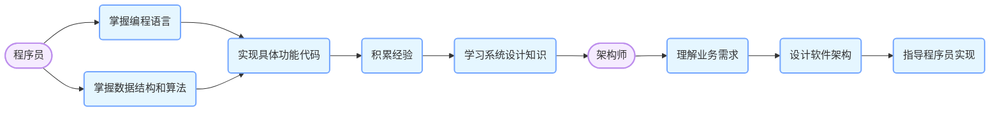

# 程序员的职业生涯：从代码到架构师

> 关键词：程序员、职业生涯、代码、架构师、技术成长、职业规划、技能提升

> 摘要：本文深入探讨了程序员从专注于代码编写逐步成长为架构师的职业生涯发展路径。详细阐述了每个阶段所需的核心技能、知识体系和思维转变，通过对相关概念、算法原理、数学模型的分析，结合项目实战案例，展现了这一职业发展过程中的关键环节和具体操作。同时介绍了在不同阶段可利用的工具和资源，探讨了未来的发展趋势与挑战，旨在为广大程序员提供全面且有深度的职业发展参考。

## 1. 背景介绍 
### 1.1 目的和范围
本文的目的在于为程序员群体提供一份全面且具有指导意义的职业发展指南，帮助他们了解从基础的代码编写工作起步，逐步成长为架构师的整个过程。范围涵盖了这一职业生涯中各个阶段所需的知识、技能、思维方式的转变，以及实际应用场景、相关工具和资源等方面，旨在为程序员的职业发展提供全方位的支持。

### 1.2 预期读者
本文主要面向广大程序员群体，包括刚入行的新手程序员，以及有一定工作经验，希望进一步提升自己职业水平，向架构师方向发展的程序员。同时，对于对软件开发职业发展感兴趣的相关人员，如计算机专业学生、行业研究者等也具有一定的参考价值。

### 1.3 文档结构概述
本文将按照以下结构展开：首先介绍核心概念与联系，帮助读者理解程序员和架构师的角色及他们之间的关联；接着阐述核心算法原理和具体操作步骤，通过 Python 代码示例展示在不同阶段所需的技术实现；然后讲解数学模型和公式，为技术实现提供理论支持；之后通过项目实战案例详细说明如何将理论应用到实际项目中；再介绍实际应用场景，让读者了解不同阶段技能的实际用途；接着推荐相关的工具和资源，助力读者的学习和成长；最后总结未来发展趋势与挑战，并提供常见问题解答和扩展阅读参考资料。

### 1.4 术语表
#### 1.4.1 核心术语定义
- **程序员**：是从事程序开发、维护的专业人员，主要负责编写、调试和优化代码，以实现特定的软件功能。
- **架构师**：是软件系统的设计师，负责定义系统的整体结构、组件关系、技术选型等，确保系统的可扩展性、高性能、高可靠性等。
- **代码质量**：指代码的可读性、可维护性、可扩展性、健壮性等方面的综合指标。
- **软件架构**：是对软件系统的结构、组件、模块及其之间关系的抽象描述，是软件系统的蓝图。

#### 1.4.2 相关概念解释
- **编程范式**：是指编程的基本风格和方法，常见的有面向过程编程、面向对象编程、函数式编程等。不同的编程范式适用于不同的场景，程序员需要根据实际需求选择合适的范式。
- **系统设计模式**：是指在软件开发过程中，针对反复出现的问题所总结归纳出的通用解决方案。常见的设计模式有单例模式、工厂模式、观察者模式等，架构师需要熟练掌握这些设计模式，以提高系统的可维护性和可扩展性。

#### 1.4.3 缩略词列表
- **OOP**：Object-Oriented Programming，面向对象编程
- **FP**：Functional Programming，函数式编程
- **MVC**：Model-View-Controller，模型 - 视图 - 控制器，一种常见的软件架构模式

## 2. 核心概念与联系 

### 程序员的角色与职责
程序员是软件项目的基础实施者，主要负责将软件的需求转化为具体的代码实现。他们需要熟悉至少一种编程语言，如 Python、Java、C++ 等，掌握基本的数据结构和算法，能够根据需求编写高效、稳定的代码。程序员的工作重点在于实现功能，解决具体的技术问题，确保代码的正确性和性能。

### 架构师的角色与职责
架构师是软件项目的整体规划者和设计者，他们需要从宏观层面考虑软件系统的架构设计。架构师需要对业务需求有深入的理解，能够根据需求选择合适的技术栈、设计合理的系统架构，确保系统具有良好的可扩展性、高性能、高可靠性和安全性。架构师的工作重点在于系统的整体规划和设计，协调各个模块之间的关系，解决系统级的问题。

### 程序员与架构师的联系
程序员和架构师是软件项目中紧密相关的两个角色。程序员的工作是架构师设计的具体实现，架构师的设计为程序员提供了指导和框架。程序员在实现过程中遇到的问题和反馈可以帮助架构师优化架构设计，而架构师的设计理念和要求也会影响程序员的代码实现方式。从职业发展的角度来看，程序员可以通过不断学习和积累经验，逐步成长为架构师。

### 核心概念原理和架构的文本示意图
```plaintext
程序员 -> 掌握编程语言、数据结构和算法 -> 实现具体功能代码
                |
                v
积累经验、学习系统设计知识
                |
                v
架构师 -> 理解业务需求 -> 设计软件架构 -> 指导程序员实现
```

### Mermaid 流程图


## 3. 核心算法原理 & 具体操作步骤 

### 数据结构与算法基础（以 Python 为例）
在程序员的职业生涯初期，掌握基本的数据结构和算法是非常重要的。以下是一些常见的数据结构和算法的 Python 实现示例。

#### 数组
数组是一种基本的数据结构，用于存储相同类型的元素。在 Python 中，可以使用列表来模拟数组。

```python
# 创建一个数组
arr = [1, 2, 3, 4, 5]

# 访问数组元素
print(arr[0])  # 输出: 1

# 修改数组元素
arr[2] = 10
print(arr)  # 输出: [1, 2, 10, 4, 5]
```

#### 链表
链表是一种动态数据结构，由节点组成，每个节点包含数据和指向下一个节点的指针。以下是一个简单的链表实现。

```python
class Node:
    def __init__(self, data):
        self.data = data
        self.next = None

class LinkedList:
    def __init__(self):
        self.head = None

    def append(self, data):
        new_node = Node(data)
        if not self.head:
            self.head = new_node
            return
        last_node = self.head
        while last_node.next:
            last_node = last_node.next
        last_node.next = new_node

    def display(self):
        elements = []
        current_node = self.head
        while current_node:
            elements.append(current_node.data)
            current_node = current_node.next
        print(elements)

# 使用链表
llist = LinkedList()
llist.append(1)
llist.append(2)
llist.append(3)
llist.display()  # 输出: [1, 2, 3]
```

#### 排序算法 - 冒泡排序
冒泡排序是一种简单的排序算法，它重复地走访过要排序的数列，一次比较两个元素，如果它们的顺序错误就把它们交换过来。

```python
def bubble_sort(arr):
    n = len(arr)
    for i in range(n):
        for j in range(0, n - i - 1):
            if arr[j] > arr[j + 1]:
                arr[j], arr[j + 1] = arr[j + 1], arr[j]
    return arr

# 使用冒泡排序
arr = [64, 34, 25, 12, 22, 11, 90]
sorted_arr = bubble_sort(arr)
print(sorted_arr)  # 输出: [11, 12, 22, 25, 34, 64, 90]
```

### 系统设计基础
随着程序员经验的积累，需要学习系统设计的基础知识，如分层架构、模块化设计等。以下是一个简单的分层架构示例，使用 Python 实现一个简单的 Web 应用。

```python
# 数据访问层
class DataAccessLayer:
    def __init__(self):
        self.data = []

    def add_data(self, item):
        self.data.append(item)

    def get_data(self):
        return self.data

# 业务逻辑层
class BusinessLogicLayer:
    def __init__(self, dal):
        self.dal = dal

    def add_item(self, item):
        self.dal.add_data(item)

    def get_all_items(self):
        return self.dal.get_data()

# 表示层
class PresentationLayer:
    def __init__(self, bll):
        self.bll = bll

    def display_items(self):
        items = self.bll.get_all_items()
        for item in items:
            print(item)

    def add_new_item(self, item):
        self.bll.add_item(item)

# 使用分层架构
dal = DataAccessLayer()
bll = BusinessLogicLayer(dal)
pl = PresentationLayer(bll)

pl.add_new_item("Item 1")
pl.add_new_item("Item 2")
pl.display_items()  # 输出: Item 1, Item 2
```

## 4. 数学模型和公式 & 详细讲解 & 举例说明 

### 时间复杂度和空间复杂度
在算法分析中，时间复杂度和空间复杂度是衡量算法效率的重要指标。

#### 时间复杂度
时间复杂度是指算法执行所需要的计算工作量，通常用大 O 表示法来描述。以下是一些常见的时间复杂度示例。

- **常数时间复杂度 $O(1)$**：无论输入数据的规模如何，算法的执行时间都是恒定的。例如，访问数组中的一个元素。

```python
arr = [1, 2, 3, 4, 5]
print(arr[2])  # 时间复杂度为 O(1)
```

- **线性时间复杂度 $O(n)$**：算法的执行时间与输入数据的规模成正比。例如，遍历数组中的所有元素。

```python
arr = [1, 2, 3, 4, 5]
for element in arr:
    print(element)  # 时间复杂度为 O(n)
```

- **对数时间复杂度 $O(\log n)$**：算法的执行时间随着输入数据规模的增加而对数级增长。例如，二分查找算法。

```python
def binary_search(arr, target):
    left, right = 0, len(arr) - 1
    while left <= right:
        mid = (left + right) // 2
        if arr[mid] == target:
            return mid
        elif arr[mid] < target:
            left = mid + 1
        else:
            right = mid - 1
    return -1

arr = [1, 2, 3, 4, 5]
target = 3
result = binary_search(arr, target)  # 时间复杂度为 O(log n)
```

#### 空间复杂度
空间复杂度是指算法执行所需要的存储空间，同样用大 O 表示法来描述。以下是一些常见的空间复杂度示例。

- **常数空间复杂度 $O(1)$**：算法的执行过程中只需要固定的额外存储空间。例如，交换两个变量的值。

```python
a = 1
b = 2
a, b = b, a  # 空间复杂度为 O(1)
```

- **线性空间复杂度 $O(n)$**：算法的执行过程中需要的额外存储空间与输入数据的规模成正比。例如，创建一个与输入数组大小相同的新数组。

```python
arr = [1, 2, 3, 4, 5]
new_arr = [x * 2 for x in arr]  # 空间复杂度为 O(n)
```

### 数学模型在系统设计中的应用
在系统设计中，数学模型可以帮助我们分析系统的性能和可靠性。例如，排队论可以用于分析系统的并发性能，可靠性理论可以用于评估系统的可靠性。

#### 排队论示例
排队论是研究排队系统（又称随机服务系统）的数学理论和方法，它可以帮助我们分析系统在不同负载下的性能。例如，一个简单的单服务器排队系统，顾客到达的时间间隔服从指数分布，服务时间也服从指数分布。

设顾客到达率为 $\lambda$，服务率为 $\mu$，则系统的平均顾客数 $L_s$ 和平均等待时间 $W_s$ 可以通过以下公式计算：

$$L_s = \frac{\lambda}{\mu - \lambda}$$

$$W_s = \frac{1}{\mu - \lambda}$$

例如，若顾客到达率 $\lambda = 2$ 人/小时，服务率 $\mu = 3$ 人/小时，则系统的平均顾客数为：

$$L_s = \frac{2}{3 - 2} = 2$$

平均等待时间为：

$$W_s = \frac{1}{3 - 2} = 1$$ 小时

## 5. 项目实战：代码实际案例和详细解释说明 

### 5.1  开发环境搭建
以下以 Python 开发环境为例，介绍如何搭建开发环境。

#### 安装 Python
首先，从 Python 官方网站（https://www.python.org/downloads/） 下载并安装 Python。根据自己的操作系统选择合适的安装包，安装过程中建议勾选 “Add Python to PATH” 选项，这样可以在命令行中直接使用 Python 命令。

#### 安装集成开发环境（IDE）
推荐使用 PyCharm 作为 Python 的集成开发环境。可以从 JetBrains 官方网站（https://www.jetbrains.com/pycharm/download/） 下载并安装 PyCharm。安装完成后，打开 PyCharm，创建一个新的 Python 项目。

#### 安装依赖库
在项目中，可能需要使用一些第三方库。可以使用 `pip` 命令来安装这些库。例如，安装 `Flask` 库用于开发 Web 应用：

```sh
pip install flask
```

### 5.2  源代码详细实现和代码解读
以下是一个使用 Flask 开发的简单 Web 应用示例。

```python
from flask import Flask

# 创建 Flask 应用实例
app = Flask(__name__)

# 定义路由和视图函数
@app.route('/')
def hello_world():
    return 'Hello, World!'

# 启动应用
if __name__ == '__main__':
    app.run(debug=True)
```

#### 代码解读
1. **导入 Flask 模块**：`from flask import Flask` 导入 Flask 类，用于创建 Flask 应用实例。
2. **创建 Flask 应用实例**：`app = Flask(__name__)` 创建一个 Flask 应用实例，`__name__` 是 Python 中的一个特殊变量，表示当前模块的名称。
3. **定义路由和视图函数**：`@app.route('/')` 是一个装饰器，用于定义路由。当用户访问根路径 `/` 时，会调用 `hello_world` 函数，该函数返回一个字符串 `'Hello, World!'`。
4. **启动应用**：`if __name__ == '__main__': app.run(debug=True)` 用于启动 Flask 应用。`debug=True` 表示开启调试模式，方便开发过程中的调试。

### 5.3  代码解读与分析
这个简单的 Web 应用展示了 Flask 的基本使用方法。通过定义路由和视图函数，可以处理不同的 HTTP 请求。在实际项目中，可以根据需求定义更多的路由和视图函数，实现复杂的业务逻辑。同时，还可以使用 Flask 的扩展来实现数据库操作、用户认证等功能。

## 6. 实际应用场景 
### 程序员阶段的应用场景
- **Web 开发**：程序员可以使用各种 Web 开发框架，如 Flask、Django（Python）、Spring Boot（Java）等，开发各种类型的 Web 应用，如电商网站、博客系统、社交平台等。
- **移动应用开发**：使用 Android Studio（Java、Kotlin）或 Xcode（Swift、Objective - C）等开发工具，开发移动应用，满足用户在移动设备上的需求。
- **数据分析与人工智能**：使用 Python 中的数据分析库（如 Pandas、NumPy）和机器学习库（如 Scikit - learn、TensorFlow）进行数据分析和模型训练，为企业提供数据支持和智能决策。

### 架构师阶段的应用场景
- **大型企业级应用架构设计**：架构师需要为企业的核心业务系统设计架构，确保系统的高可用性、高性能、可扩展性和安全性。例如，设计银行的核心业务系统、电商平台的分布式架构等。
- **云计算与分布式系统架构设计**：随着云计算的发展，架构师需要设计基于云计算平台的分布式系统架构，如使用 Amazon Web Services（AWS）、Microsoft Azure 或 Google Cloud Platform（GCP）等云服务，实现系统的弹性伸缩和资源优化。
- **物联网系统架构设计**：在物联网领域，架构师需要设计物联网系统的整体架构，包括传感器网络、数据传输、数据处理和应用层等，确保物联网系统的高效运行。

## 7. 工具和资源推荐
### 7.1 学习资源推荐
#### 7.1.1 书籍推荐
- **《Python 编程：从入门到实践》**：适合初学者学习 Python 编程，通过实际项目案例帮助读者掌握 Python 的基本语法和应用。
- **《算法导论》**：经典的算法书籍，详细介绍了各种算法的原理和实现，是算法学习的必备书籍。
- **《软件架构设计：大型网站技术架构与业务架构融合之道》**：深入探讨了软件架构设计的方法和实践，结合大型网站的案例，帮助读者理解架构设计的要点。

#### 7.1.2 在线课程
- **Coursera**：提供了丰富的计算机科学相关课程，包括编程、算法、系统设计等方面的课程，由全球知名大学和机构的教授授课。
- **Udemy**：有大量的编程和技术课程，价格相对较为实惠，课程内容涵盖了从基础到高级的各个层次。
- **中国大学 MOOC**：国内的在线教育平台，提供了许多高校的计算机专业课程，适合国内学生和开发者学习。

#### 7.1.3 技术博客和网站
- **Stack Overflow**：全球最大的技术问答社区，开发者可以在这里提问、回答问题，学习他人的经验和解决方案。
- **GitHub**：全球最大的代码托管平台，上面有许多优秀的开源项目，可以学习他人的代码和技术实现。
- **InfoQ**：专注于软件开发领域的资讯和技术文章，提供了最新的技术趋势和行业动态。

### 7.2 开发工具框架推荐
#### 7.2.1 IDE和编辑器
- **PyCharm**：专业的 Python 集成开发环境，提供了丰富的代码编辑、调试、自动完成等功能，适合 Python 开发。
- **IntelliJ IDEA**：功能强大的 Java 集成开发环境，支持多种 Java 框架和技术，提高开发效率。
- **Visual Studio Code**：轻量级的代码编辑器，支持多种编程语言，通过安装插件可以扩展其功能，是很多开发者的首选。

#### 7.2.2 调试和性能分析工具
- **pdb**：Python 内置的调试器，可以帮助开发者调试 Python 代码，定位问题。
- **JProfiler**：Java 性能分析工具，可以分析 Java 应用的内存使用、线程状态、方法调用等，帮助优化性能。
- **Chrome DevTools**：浏览器开发者工具，可用于调试 Web 应用，分析页面性能和网络请求。

#### 7.2.3 相关框架和库
- **Flask**：轻量级的 Python Web 框架，适合快速开发小型 Web 应用。
- **Django**：功能强大的 Python Web 框架，提供了丰富的组件和功能，适合开发大型 Web 应用。
- **Spring Boot**：Java 的微服务框架，简化了 Spring 应用的开发过程，提高开发效率。

### 7.3 相关论文著作推荐
#### 7.3.1 经典论文
- **《MapReduce: Simplified Data Processing on Large Clusters》**：介绍了 MapReduce 编程模型，为大数据处理提供了一种简单而有效的方法。
- **《The CAP Theorem》**：阐述了分布式系统中一致性（Consistency）、可用性（Availability）和分区容错性（Partition Tolerance）三者之间的关系。

#### 7.3.2 最新研究成果
- **关注顶级学术会议和期刊**：如 ACM SIGPLAN、IEEE Transactions on Software Engineering 等，了解最新的研究成果和技术趋势。

#### 7.3.3 应用案例分析
- **《大型网站技术架构：核心原理与案例分析》**：通过实际案例分析，介绍了大型网站的技术架构和实现方法，具有很高的参考价值。

## 8. 总结：未来发展趋势与挑战
### 未来发展趋势
- **人工智能与机器学习的融合**：随着人工智能和机器学习技术的不断发展，程序员和架构师需要掌握相关技术，将其应用到软件系统中，实现智能决策和自动化处理。
- **云计算和容器化技术的普及**：云计算和容器化技术将继续发展，架构师需要设计基于云平台的分布式系统架构，利用容器化技术实现应用的快速部署和弹性伸缩。
- **低代码/无代码开发的兴起**：低代码/无代码开发平台的出现，将降低软件开发的门槛，程序员和架构师需要适应这种变化，掌握相关工具和技术，提高开发效率。

### 挑战
- **技术更新换代快**：信息技术领域的技术更新换代非常快，程序员和架构师需要不断学习和更新知识，跟上技术发展的步伐。
- **系统复杂性增加**：随着软件系统的功能越来越复杂，架构设计的难度也越来越大，架构师需要具备更高的技术水平和系统思维能力，确保系统的稳定性和可维护性。
- **安全与隐私问题**：在信息时代，安全和隐私问题越来越受到关注，程序员和架构师需要在系统设计和开发过程中充分考虑安全和隐私因素，防止数据泄露和安全漏洞。

## 9. 附录：常见问题与解答
### 问题 1：从程序员成长为架构师需要多长时间？
答：这个时间因人而异，取决于个人的学习能力、工作经验和努力程度。一般来说，需要 5 - 10 年的时间，在积累了足够的技术经验和业务知识后，才有可能成为一名合格的架构师。

### 问题 2：架构师需要掌握哪些编程语言？
答：架构师需要掌握至少一种主流的编程语言，如 Java、Python、C++ 等。同时，还需要了解其他相关的编程语言和技术，以便根据项目需求选择合适的技术栈。

### 问题 3：如何提高自己的架构设计能力？
答：可以通过学习相关的架构设计理论和方法，阅读优秀的架构设计案例，参与实际的项目开发，与其他架构师交流经验等方式来提高自己的架构设计能力。

## 10. 扩展阅读 & 参考资料
- **书籍**：《代码大全》《重构：改善既有代码的设计》《Effective Java》等。
- **网站**：ACM Digital Library（https://dl.acm.org/）、IEEE Xplore（https://ieeexplore.ieee.org/） 等。
- **论文**：《A Taxonomy and Survey of Cloud Computing Systems》《Software Architecture Patterns》等。