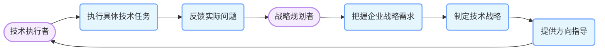

# 程序员的角色转变：从技术执行者到战略规划者

> 关键词：程序员、角色转变、技术执行者、战略规划者、软件开发、技术领导力、企业战略

> 摘要：在当今快速发展的数字化时代，程序员的角色正在经历着深刻的转变。传统上，程序员往往被视为技术执行者，专注于代码的编写和实现。然而，随着技术的不断进步和企业对创新的需求日益增长，程序员需要逐渐从单纯的技术执行者转变为战略规划者，参与到企业的整体战略制定和决策过程中。本文将深入探讨程序员角色转变的背景、核心概念、实现途径以及面临的挑战和机遇，旨在帮助程序员更好地适应这一转变，提升自身的价值和影响力。

## 1. 背景介绍 
### 1.1 目的和范围
本文的目的是全面探讨程序员从技术执行者到战略规划者的角色转变。范围涵盖了这一角色转变的原因、核心概念、实现的具体步骤和方法，以及在实际应用中的案例分析和未来发展趋势。通过对这些内容的详细阐述，为程序员提供一个清晰的路径，帮助他们实现这一重要的角色转变，同时也为企业管理者提供一些关于如何引导和支持程序员进行角色转变的思路。

### 1.2 预期读者
本文预期读者主要包括程序员、软件工程师、技术团队领导者、企业管理者以及对软件开发和技术战略感兴趣的相关人士。对于程序员来说，本文将为他们提供职业发展的指导和方向；对于技术团队领导者和企业管理者，本文有助于他们理解和推动团队中程序员的角色转变，以更好地适应市场变化和企业发展的需求。

### 1.3 文档结构概述
本文将按照以下结构进行阐述：首先介绍程序员角色转变的背景，包括目的、预期读者和文档结构概述等内容；接着探讨核心概念与联系，明确技术执行者和战略规划者的定义和两者之间的关系；然后详细讲解实现角色转变的核心算法原理和具体操作步骤；之后通过数学模型和公式进一步说明角色转变的内在逻辑；再通过项目实战案例展示角色转变在实际中的应用；接着分析实际应用场景；推荐相关的工具和资源；总结未来发展趋势与挑战；最后提供常见问题与解答以及扩展阅读和参考资料。

### 1.4 术语表
#### 1.4.1 核心术语定义
- **技术执行者**：指专注于具体技术任务的执行，如编写代码、调试程序、修复漏洞等，主要关注技术实现细节的程序员角色。
- **战略规划者**：指参与企业战略制定和决策过程，能够从宏观层面考虑技术与业务的结合，为企业的长期发展提供技术方向和战略建议的程序员角色。
- **技术领导力**：指在技术领域中，能够引领团队、制定技术方向、推动技术创新，并对企业战略产生影响的能力。
- **企业战略**：指企业为实现长期目标而制定的总体发展规划和策略，包括市场定位、产品规划、竞争策略等方面。

#### 1.4.2 相关概念解释
- **数字化转型**：指企业利用数字技术对业务模式、流程、组织等进行全面变革，以提高企业的竞争力和创新能力。在数字化转型过程中，程序员的角色从技术执行者向战略规划者的转变具有重要意义。
- **技术创新**：指通过引入新的技术、方法或理念，推动产品或服务的升级和改进，从而为企业创造价值。战略规划者角色的程序员能够更好地把握技术创新的方向，为企业带来竞争优势。
- **业务理解**：指程序员对企业业务的深入了解，包括业务流程、市场需求、客户痛点等方面。只有具备良好的业务理解能力，程序员才能将技术与业务紧密结合，为企业的战略决策提供有价值的建议。

#### 1.4.3 缩略词列表
- **IT**：Information Technology，信息技术
- **AI**：Artificial Intelligence，人工智能
- **ML**：Machine Learning，机器学习
- **DevOps**：Development and Operations，开发与运维一体化

## 2. 核心概念与联系 

### 技术执行者与战略规划者的定义
技术执行者主要负责将设计好的技术方案转化为实际的代码和软件系统。他们通常专注于技术细节，按照既定的规范和要求完成具体的任务。例如，在一个软件开发项目中，技术执行者可能会负责编写某个模块的代码，进行单元测试，确保该模块的功能正常运行。

战略规划者则需要从更宏观的角度考虑问题。他们要理解企业的战略目标和业务需求，结合技术发展趋势，制定出符合企业长远利益的技术战略。战略规划者需要参与到企业的决策过程中，为产品的规划、市场的拓展等提供技术支持和建议。例如，在企业决定进入一个新的市场领域时，战略规划者需要评估技术上的可行性，提出相应的技术方案和发展路径。

### 两者之间的联系
技术执行者是战略规划者的基础。没有扎实的技术执行能力，就无法实现战略规划者所制定的技术战略。战略规划者所提出的方案和设想，最终都需要技术执行者通过具体的技术工作来落地实施。

同时，战略规划者为技术执行者提供方向和指导。战略规划者能够把握技术发展的趋势和企业的战略需求，为技术执行者设定明确的目标和任务。技术执行者在执行过程中，也可以将实际遇到的问题和反馈及时传递给战略规划者，以便战略规划者对技术战略进行调整和优化。

### 文本示意图
技术执行者和战略规划者的关系可以用以下示意图表示：

技术执行者（专注技术实现） <----> 战略规划者（制定技术战略）
  |                                     |
  | 执行具体技术任务                   | 把握企业战略需求
  |                                     |
  | 反馈实际问题                       | 提供方向指导
  |                                     |
  v                                     v
  实现技术战略                        优化技术战略

### Mermaid 流程图


## 3. 核心算法原理 & 具体操作步骤 

### 核心算法原理
从技术执行者转变为战略规划者的过程可以看作是一个逐步提升能力和积累经验的过程。我们可以用一个简单的算法模型来描述这个过程，其中涉及到几个关键的因素：知识学习、经验积累、思维转变和人际关系拓展。

以下是用 Python 代码实现的一个简化的算法模型：

```python
class ProgrammerRoleTransition:
    def __init__(self, initial_technical_ability, initial_business_understanding, initial_strategic_thinking):
        # 初始技术能力
        self.technical_ability = initial_technical_ability
        # 初始业务理解能力
        self.business_understanding = initial_business_understanding
        # 初始战略思维能力
        self.strategic_thinking = initial_strategic_thinking
        # 经验值
        self.experience = 0
        # 人际关系网络大小
        self.network_size = 0

    def learn_knowledge(self, technical_knowledge, business_knowledge, strategic_knowledge):
        # 学习技术知识
        self.technical_ability += technical_knowledge
        # 学习业务知识
        self.business_understanding += business_knowledge
        # 学习战略知识
        self.strategic_thinking += strategic_knowledge

    def gain_experience(self, project_experience):
        # 积累项目经验
        self.experience += project_experience
        # 经验对各项能力有一定的提升作用
        self.technical_ability += project_experience * 0.2
        self.business_understanding += project_experience * 0.3
        self.strategic_thinking += project_experience * 0.5

    def expand_network(self, new_connections):
        # 拓展人际关系网络
        self.network_size += new_connections
        # 人际关系网络对战略思维能力有一定的提升作用
        self.strategic_thinking += new_connections * 0.1

    def evaluate_transition_progress(self):
        # 评估角色转变的进度
        progress = (self.technical_ability * 0.3 + self.business_understanding * 0.3 + self.strategic_thinking * 0.4) / 10
        return progress

# 示例使用
programmer = ProgrammerRoleTransition(80, 30, 20)
programmer.learn_knowledge(10, 15, 20)
programmer.gain_experience(20)
programmer.expand_network(5)
progress = programmer.evaluate_transition_progress()
print(f"角色转变进度: {progress}")
```

### 具体操作步骤
1. **知识学习**
    - **技术知识**：不断学习新的技术和工具，保持对技术发展趋势的关注。可以通过阅读技术书籍、参加技术培训课程、参与开源项目等方式来提升技术能力。
    - **业务知识**：深入了解所在行业的业务流程、市场需求和竞争态势。可以与业务部门的同事交流，参与业务调研和分析，阅读行业报告等方式来增强业务理解能力。
    - **战略知识**：学习企业战略管理的相关知识，了解战略规划的方法和工具。可以阅读战略管理方面的书籍，参加相关的培训课程，向有经验的战略规划者请教等方式来培养战略思维能力。
2. **经验积累**
    - **参与项目**：积极参与不同类型的项目，尤其是涉及到企业战略和业务转型的项目。在项目中承担更多的责任，锻炼自己的综合能力。
    - **解决问题**：遇到问题时，不仅仅局限于解决技术层面的问题，还要从业务和战略的角度去思考问题的根源和解决方案。通过不断解决问题，积累实践经验。
3. **思维转变**
    - **从局部到整体**：改变只关注技术细节的思维方式，学会从企业整体的角度去看待问题。考虑技术方案对企业业务、市场、财务等方面的影响。
    - **从短期到长期**：不仅仅关注项目的短期目标，还要考虑技术方案对企业长期发展的影响。制定技术规划时，要有前瞻性和战略性。
4. **人际关系拓展**
    - **内部沟通**：加强与企业内部不同部门的沟通和协作，建立良好的人际关系。了解其他部门的需求和关注点，为跨部门合作打下基础。
    - **外部交流**：参加行业会议、技术研讨会等活动，结识行业内的专家和同行。通过与他们的交流和学习，拓宽自己的视野和思路。

## 4. 数学模型和公式 & 详细讲解 & 举例说明 

### 数学模型
我们可以用一个多因素线性模型来描述程序员从技术执行者到战略规划者的角色转变过程。设 $P$ 表示角色转变的进度，$T$ 表示技术能力，$B$ 表示业务理解能力，$S$ 表示战略思维能力，$E$ 表示经验值，$N$ 表示人际关系网络大小。则角色转变进度 $P$ 可以表示为：

$$P = \frac{w_T T + w_B B + w_S S}{10}$$

其中，$w_T$、$w_B$ 和 $w_S$ 分别是技术能力、业务理解能力和战略思维能力的权重，且 $w_T + w_B + w_S = 1$。在我们的模型中，$w_T = 0.3$，$w_B = 0.3$，$w_S = 0.4$。

同时，技术能力 $T$、业务理解能力 $B$ 和战略思维能力 $S$ 会受到知识学习、经验积累和人际关系拓展的影响。可以表示为：

$$T = T_0 + \Delta T_{knowledge} + \Delta T_{experience}$$
$$B = B_0 + \Delta B_{knowledge} + \Delta B_{experience}$$
$$S = S_0 + \Delta S_{knowledge} + \Delta S_{experience} + \Delta S_{network}$$

其中，$T_0$、$B_0$ 和 $S_0$ 分别是初始的技术能力、业务理解能力和战略思维能力，$\Delta T_{knowledge}$、$\Delta B_{knowledge}$ 和 $\Delta S_{knowledge}$ 分别是通过知识学习获得的技术、业务和战略知识的提升量，$\Delta T_{experience}$、$\Delta B_{experience}$ 和 $\Delta S_{experience}$ 分别是通过经验积累获得的技术、业务和战略能力的提升量，$\Delta S_{network}$ 是通过人际关系拓展获得的战略思维能力的提升量。

### 详细讲解
- **权重的意义**：权重反映了不同能力在角色转变过程中的重要程度。在我们的模型中，战略思维能力的权重最高，为 0.4，说明在从技术执行者向战略规划者转变的过程中，战略思维能力的提升最为关键。技术能力和业务理解能力的权重相同，均为 0.3，说明这两种能力也不可或缺，需要同步提升。
- **能力的影响因素**：知识学习、经验积累和人际关系拓展是影响技术能力、业务理解能力和战略思维能力的三个主要因素。知识学习可以直接提升各项能力，经验积累不仅可以提升技术能力，还对业务理解能力和战略思维能力有较大的促进作用，人际关系拓展主要对战略思维能力有一定的提升作用。

### 举例说明
假设程序员小李初始的技术能力 $T_0 = 80$，业务理解能力 $B_0 = 30$，战略思维能力 $S_0 = 20$。通过一段时间的学习和实践，他获得了 $\Delta T_{knowledge} = 10$ 的技术知识，$\Delta B_{knowledge} = 15$ 的业务知识，$\Delta S_{knowledge} = 20$ 的战略知识，积累了 $\Delta T_{experience} = 4$，$\Delta B_{experience} = 6$，$\Delta S_{experience} = 10$ 的经验提升，通过人际关系拓展获得了 $\Delta S_{network} = 0.5$ 的战略思维能力提升。

则小李的技术能力 $T = 80 + 10 + 4 = 94$，业务理解能力 $B = 30 + 15 + 6 = 51$，战略思维能力 $S = 20 + 20 + 10 + 0.5 = 50.5$。

根据角色转变进度公式，小李的角色转变进度 $P = \frac{0.3 \times 94 + 0.3 \times 51 + 0.4 \times 50.5}{10} = \frac{28.2 + 15.3 + 20.2}{10} = \frac{63.7}{10} = 6.37$。

这表明小李在从技术执行者向战略规划者的转变过程中已经取得了一定的进展。

## 5. 项目实战：代码实际案例和详细解释说明 

### 5.1  开发环境搭建
在这个项目实战中，我们以一个简单的电子商务系统的升级项目为例，来说明程序员如何从技术执行者转变为战略规划者。

#### 硬件环境
- 服务器：选择一台配置较高的云服务器，如阿里云的 ECS 实例，规格为 4 核 8GB 内存，用于部署电子商务系统。
- 开发机：选择一台性能较好的笔记本电脑，如联想 ThinkPad X1 Carbon，配置为 Intel Core i7 处理器，16GB 内存，512GB SSD 硬盘。

#### 软件环境
- 操作系统：服务器端选择 Linux 操作系统，如 Ubuntu 18.04；开发机选择 Windows 10 操作系统。
- 开发工具：使用 Visual Studio Code 作为代码编辑器，它支持多种编程语言和插件扩展。
- 数据库：选择 MySQL 作为数据库管理系统，用于存储电子商务系统的数据。
- 编程语言和框架：使用 Python 作为主要编程语言，Django 作为 Web 开发框架，它提供了丰富的功能和工具，能够快速开发出稳定的 Web 应用程序。

### 5.2  源代码详细实现和代码解读
#### 项目需求分析
在这个电子商务系统升级项目中，我们的目标是增加用户评价和商品推荐功能，以提升用户体验和促进商品销售。

#### 数据库设计
首先，我们需要设计数据库表来存储用户评价和商品推荐相关的数据。以下是使用 Django 模型定义的数据库表：

```python
from django.db import models
from django.contrib.auth.models import User

class Product(models.Model):
    name = models.CharField(max_length=200)
    price = models.DecimalField(max_digits=10, decimal_places=2)
    description = models.TextField()

    def __str__(self):
        return self.name

class Review(models.Model):
    user = models.ForeignKey(User, on_delete=models.CASCADE)
    product = models.ForeignKey(Product, on_delete=models.CASCADE)
    rating = models.IntegerField(choices=[(1, '1 Star'), (2, '2 Stars'), (3, '3 Stars'), (4, '4 Stars'), (5, '5 Stars')])
    comment = models.TextField()
    created_at = models.DateTimeField(auto_now_add=True)

    def __str__(self):
        return f"Review by {self.user.username} on {self.product.name}"

class Recommendation(models.Model):
    user = models.ForeignKey(User, on_delete=models.CASCADE)
    product = models.ForeignKey(Product, on_delete=models.CASCADE)
    score = models.FloatField()

    def __str__(self):
        return f"Recommendation of {self.product.name} for {self.user.username}"
```

**代码解读**：
- `Product` 模型：用于存储商品的基本信息，包括商品名称、价格和描述。
- `Review` 模型：用于存储用户对商品的评价信息，包括用户、商品、评分、评论和创建时间。
- `Recommendation` 模型：用于存储商品推荐信息，包括用户、商品和推荐得分。

#### 视图和路由设计
接下来，我们需要设计视图和路由来处理用户评价和商品推荐的请求。以下是部分视图和路由的代码实现：

```python
from django.shortcuts import render, redirect
from .models import Product, Review, Recommendation
from .forms import ReviewForm

def product_detail(request, product_id):
    product = Product.objects.get(id=product_id)
    reviews = Review.objects.filter(product=product)
    if request.method == 'POST':
        form = ReviewForm(request.POST)
        if form.is_valid():
            review = form.save(commit=False)
            review.user = request.user
            review.product = product
            review.save()
            return redirect('product_detail', product_id=product_id)
    else:
        form = ReviewForm()
    return render(request, 'product_detail.html', {'product': product, 'reviews': reviews, 'form': form})

def recommend_products(request):
    user = request.user
    recommendations = Recommendation.objects.filter(user=user).order_by('-score')[:5]
    return render(request, 'recommend_products.html', {'recommendations': recommendations})
```

**代码解读**：
- `product_detail` 视图：用于显示商品的详细信息和用户评价，并处理用户提交的评价表单。
- `recommend_products` 视图：用于显示用户的商品推荐列表。

#### 模板设计
最后，我们需要设计模板来展示商品信息、用户评价和商品推荐。以下是部分模板代码：

```html
<!-- product_detail.html -->
<!DOCTYPE html>
<html lang="en">
<head>
    <meta charset="UTF-8">
    <title>{{ product.name }}</title>
</head>
<body>
    <h1>{{ product.name }}</h1>
    <p>{{ product.description }}</p>
    <p>Price: ${{ product.price }}</p>
    <h2>Reviews</h2>
    
        <p>{{ review.user.username }} - {{ review.rating }} Stars</p>
        <p>{{ review.comment }}</p>
    
    <h2>Add a Review</h2>
    <form method="post">
        
        {{ form.as_p }}
        <button type="submit">Submit</button>
    </form>
</body>
</html>

<!-- recommend_products.html -->
<!DOCTYPE html>
<html lang="en">
<head>
    <meta charset="UTF-8">
    <title>Recommended Products</title>
</head>
<body>
    <h1>Recommended Products</h1>
    
        <p>{{ recommendation.product.name }} - Score: {{ recommendation.score }}</p>
    
</body>
</html>
```

### 5.3  代码解读与分析
#### 技术实现层面
从技术实现的角度来看，这个项目使用了 Django 框架来实现 Web 应用程序的开发。Django 提供了强大的功能，如数据库管理、表单处理、视图路由等，使得开发过程更加高效和便捷。通过定义模型、视图和模板，我们实现了用户评价和商品推荐功能的基本逻辑。

#### 战略规划层面
作为战略规划者，我们需要考虑更多的因素。例如，在设计商品推荐算法时，我们需要结合企业的业务目标和用户需求来选择合适的算法。如果企业的目标是提高用户的购买转化率，我们可以选择基于用户行为的推荐算法；如果企业的目标是拓展新用户，我们可以选择基于内容的推荐算法。

同时，我们还需要考虑系统的可扩展性和性能优化。随着用户数量和数据量的增加，系统的性能可能会受到影响。因此，我们需要在设计系统架构时，采用分布式架构、缓存技术等手段来提高系统的性能和可扩展性。

## 6. 实际应用场景 
### 企业数字化转型
在企业数字化转型的过程中，程序员从技术执行者转变为战略规划者具有重要的意义。例如，一家传统的制造业企业决定向智能制造方向转型，程序员需要参与到企业的战略规划中，分析企业的业务流程和需求，制定出符合企业发展方向的技术战略。他们需要考虑如何引入先进的信息技术，如物联网、大数据、人工智能等，来提升企业的生产效率和管理水平。通过参与战略规划，程序员可以更好地将技术与业务相结合，为企业的数字化转型提供有力的支持。

### 新产品研发
在新产品研发过程中，程序员作为战略规划者可以发挥关键作用。例如，一家互联网公司计划推出一款新的社交产品，程序员需要从产品的定位、目标用户群体、市场竞争等方面进行分析，制定出合理的技术方案。他们需要考虑产品的功能需求、性能要求、用户体验等因素，选择合适的技术架构和开发工具。在产品研发过程中，程序员还需要与产品经理、设计师等团队成员密切合作，及时调整技术方案，确保产品能够按时上线并满足市场需求。

### 技术创新与战略决策
在企业面临技术创新和战略决策时，程序员的战略规划能力尤为重要。例如，一家科技公司在考虑是否要进入一个新的技术领域，如区块链技术。程序员需要对区块链技术的发展趋势、应用场景、市场潜力等进行深入研究，为企业的决策提供技术依据。他们需要评估企业在该领域的技术实力和资源投入，分析技术创新可能带来的风险和机遇。通过参与战略决策，程序员可以帮助企业把握技术发展的趋势，做出正确的决策，提升企业的竞争力。

## 7. 工具和资源推荐
### 7.1 学习资源推荐
#### 7.1.1 书籍推荐
- 《企业架构设计：从业务战略到 IT 战略》：本书系统地介绍了企业架构设计的方法和流程，帮助读者理解业务战略与 IT 战略之间的关系，对于程序员从技术执行者向战略规划者转变具有重要的指导意义。
- 《技术领导力：如何引领团队达成更高目标》：本书探讨了技术领导者应具备的能力和素质，包括战略规划、团队管理、技术创新等方面的内容，对于提升程序员的战略思维和领导能力有很大的帮助。
- 《数字化转型：企业破局与重生之道》：本书深入分析了企业数字化转型的背景、挑战和机遇，提供了一系列数字化转型的案例和实践经验，有助于程序员了解数字化转型的趋势和方法。

#### 7.1.2 在线课程
- Coursera 上的“Business Strategy for Tech Companies”：该课程由知名大学的教授授课，介绍了科技公司的战略规划方法和实践，帮助学员掌握如何将技术与业务战略相结合。
- edX 上的“Digital Transformation and Innovation”：该课程探讨了数字化转型和创新的相关理论和实践，通过案例分析和互动讨论，培养学员的战略思维和创新能力。
- Udemy 上的“Technical Leadership Masterclass”：该课程提供了丰富的技术领导力培训内容，包括战略规划、团队管理、沟通技巧等方面的课程，帮助程序员提升自己的领导能力。

#### 7.1.3 技术博客和网站
- InfoQ：一个专注于软件开发和技术创新的资讯平台，提供了大量关于技术趋势、业务战略、数字化转型等方面的文章和案例分析。
- TechCrunch：一个知名的科技媒体网站，报道了最新的科技行业动态和创新成果，对于了解技术发展趋势和市场竞争态势有很大的帮助。
- Harvard Business Review：哈佛商业评论的网站，提供了丰富的商业管理和战略规划方面的文章和研究成果，有助于程序员提升自己的商业思维和战略眼光。

### 7.2 开发工具框架推荐
#### 7.2.1 IDE和编辑器
- Visual Studio Code：一款轻量级的代码编辑器，支持多种编程语言和插件扩展，具有丰富的功能和良好的用户体验。
- IntelliJ IDEA：一款专业的 Java 集成开发环境，提供了强大的代码编辑、调试、重构等功能，适用于大型 Java 项目的开发。
- PyCharm：一款专门为 Python 开发设计的集成开发环境，具有智能代码提示、调试、版本控制等功能，提高了 Python 开发的效率。

#### 7.2.2 调试和性能分析工具
- Chrome DevTools：一款强大的浏览器调试工具，提供了丰富的调试和性能分析功能，如代码调试、网络分析、性能监测等，有助于开发人员快速定位和解决问题。
- New Relic：一款应用性能管理工具，能够实时监测应用程序的性能指标，如响应时间、吞吐量、错误率等，帮助开发人员优化应用程序的性能。
- GitLab CI/CD：一款持续集成和持续部署工具，能够自动化执行代码构建、测试、部署等任务，提高开发效率和软件质量。

#### 7.2.3 相关框架和库
- Django：一个功能强大的 Python Web 开发框架，提供了丰富的功能和工具，如数据库管理、表单处理、视图路由等，能够快速开发出稳定的 Web 应用程序。
- Spring Boot：一个基于 Java 的开发框架，简化了 Spring 应用的开发过程，提供了快速搭建和部署应用程序的能力，适用于构建企业级应用。
- TensorFlow：一个开源的机器学习框架，提供了丰富的机器学习算法和工具，适用于开发人工智能和机器学习应用。

### 7.3 相关论文著作推荐
#### 7.3.1 经典论文
- “The Lean Startup: How Today's Entrepreneurs Use Continuous Innovation to Create Radically Successful Businesses”：这篇论文介绍了精益创业的理念和方法，强调了快速迭代、验证假设和持续创新的重要性，对于程序员在项目开发中如何结合业务需求进行战略规划具有重要的启示。
- “Competitive Advantage: Creating and Sustaining Superior Performance”：这篇论文提出了企业竞争优势的理论和模型，分析了企业如何通过差异化、成本领先等策略来获得竞争优势，有助于程序员理解企业战略的本质和重要性。
- “The Innovator's Dilemma: When New Technologies Cause Great Firms to Fail”：这篇论文探讨了创新者的困境，即企业在面对新技术时如何做出正确的决策，避免陷入创新陷阱，对于程序员在技术创新和战略决策方面具有重要的参考价值。

#### 7.3.2 最新研究成果
- 关注顶级学术会议和期刊上的最新研究成果，如 ACM SIGKDD、IEEE Transactions on Software Engineering 等，了解技术领域的最新发展趋势和研究热点。
- 关注行业研究机构发布的报告和研究成果，如 Gartner、IDC 等，了解行业的发展动态和市场趋势，为战略规划提供参考依据。

#### 7.3.3 应用案例分析
- 研究一些成功的企业数字化转型案例和新产品研发案例，如亚马逊的电子商务平台、特斯拉的电动汽车等，分析这些企业在技术战略规划和实施方面的经验和做法，从中汲取灵感和启示。
- 关注一些创新型企业的发展历程和战略决策，如 Airbnb、Uber 等，了解这些企业如何通过技术创新和战略规划来颠覆传统行业，实现快速发展。

## 8. 总结：未来发展趋势与挑战
### 未来发展趋势
- **技术与业务深度融合**：未来，程序员将更加深入地参与到企业的业务决策中，技术将不再仅仅是实现业务需求的工具，而是成为推动企业业务创新和发展的核心力量。程序员需要具备更强的业务理解能力和战略思维能力，将技术与业务进行深度融合，为企业创造更大的价值。
- **跨领域协作与创新**：随着技术的不断发展和企业业务的多元化，程序员需要与不同领域的专业人员进行协作，如设计师、市场营销人员、数据分析师等。跨领域的协作将促进创新的产生，推动企业的发展。程序员需要具备良好的沟通能力和团队协作能力，能够在跨领域的团队中发挥自己的优势。
- **人工智能与自动化的应用**：人工智能和自动化技术将在软件开发和企业管理中得到更广泛的应用。程序员需要掌握人工智能和自动化技术的相关知识和技能，能够利用这些技术来提高开发效率和质量，优化企业的业务流程。同时，程序员还需要关注人工智能和自动化技术带来的伦理和社会问题，确保技术的合理应用。

### 面临的挑战
- **知识和技能的更新换代**：技术的快速发展要求程序员不断学习和更新自己的知识和技能。从技术执行者向战略规划者转变，需要掌握更多的业务知识、战略管理知识和跨领域的知识。这对于程序员来说是一个巨大的挑战，需要他们具备较强的学习能力和自我驱动力。
- **思维方式的转变**：从专注于技术细节到关注企业战略和业务需求，需要程序员转变自己的思维方式。这需要他们打破传统的思维定式，学会从宏观的角度去思考问题，考虑技术方案对企业整体的影响。思维方式的转变是一个长期的过程，需要程序员不断地实践和反思。
- **人际关系和沟通能力的提升**：作为战略规划者，程序员需要与不同部门的人员进行沟通和协作，建立良好的人际关系。这需要他们具备较强的沟通能力和人际交往能力，能够有效地表达自己的观点和想法，理解他人的需求和关注点。对于一些技术出身的程序员来说，提升人际关系和沟通能力是一个不小的挑战。

## 9. 附录：常见问题与解答
### 问题 1：程序员从技术执行者转变为战略规划者需要多长时间？
答：这个时间因人而异，取决于个人的学习能力、经验积累和思维转变的速度。一般来说，需要几年的时间来逐步实现这个转变。在这个过程中，程序员需要不断学习和实践，积累业务知识和战略思维能力。

### 问题 2：如何平衡技术学习和业务学习的时间？
答：可以根据自己的职业发展目标和当前的工作需求来合理分配时间。在保证技术能力不断提升的前提下，逐渐增加对业务知识的学习。可以利用业余时间阅读业务相关的书籍和报告，参加业务培训课程，与业务部门的同事交流等方式来学习业务知识。

### 问题 3：如果公司没有提供相关的学习和发展机会，该怎么办？
答：可以通过自学和参加外部培训来提升自己的能力。可以利用在线课程、技术博客、书籍等资源进行自学。同时，也可以参加行业会议、技术研讨会等活动，与同行交流和学习。还可以考虑寻找一些兼职或实习机会，参与到不同类型的项目中，积累实践经验。

### 问题 4：在角色转变过程中，如何处理与原有技术团队的关系？
答：要保持良好的沟通和协作。在角色转变过程中，仍然需要与技术团队保持密切的联系，了解技术团队的工作进展和需求。同时，要尊重技术团队成员的意见和建议，分享自己的经验和知识，帮助团队共同成长。可以通过组织技术分享会、团队建设活动等方式来加强与技术团队的关系。

### 问题 5：如何评估自己在角色转变过程中的进展？
答：可以从技术能力、业务理解能力、战略思维能力等方面进行评估。可以通过参加相关的培训课程和考试来检验自己的知识水平，通过参与项目和解决实际问题来评估自己的实践能力。还可以向同事、领导和客户征求反馈意见，了解自己在角色转变过程中的表现和不足之处。

## 10. 扩展阅读 & 参考资料
- 《Effective Java》，Joshua Bloch 著
- 《Clean Code: A Handbook of Agile Software Craftsmanship》，Robert C. Martin 著
- 《The Pragmatic Programmer: Your Journey To Mastery》，Andrew Hunt 和 David Thomas 著
- ACM SIGKDD 会议论文集
- IEEE Transactions on Software Engineering 期刊文章
- Gartner 研究报告
- IDC 行业分析报告
- 各大科技媒体网站，如 TechCrunch、InfoQ 等
- 企业数字化转型和技术战略相关的行业案例和研究报告