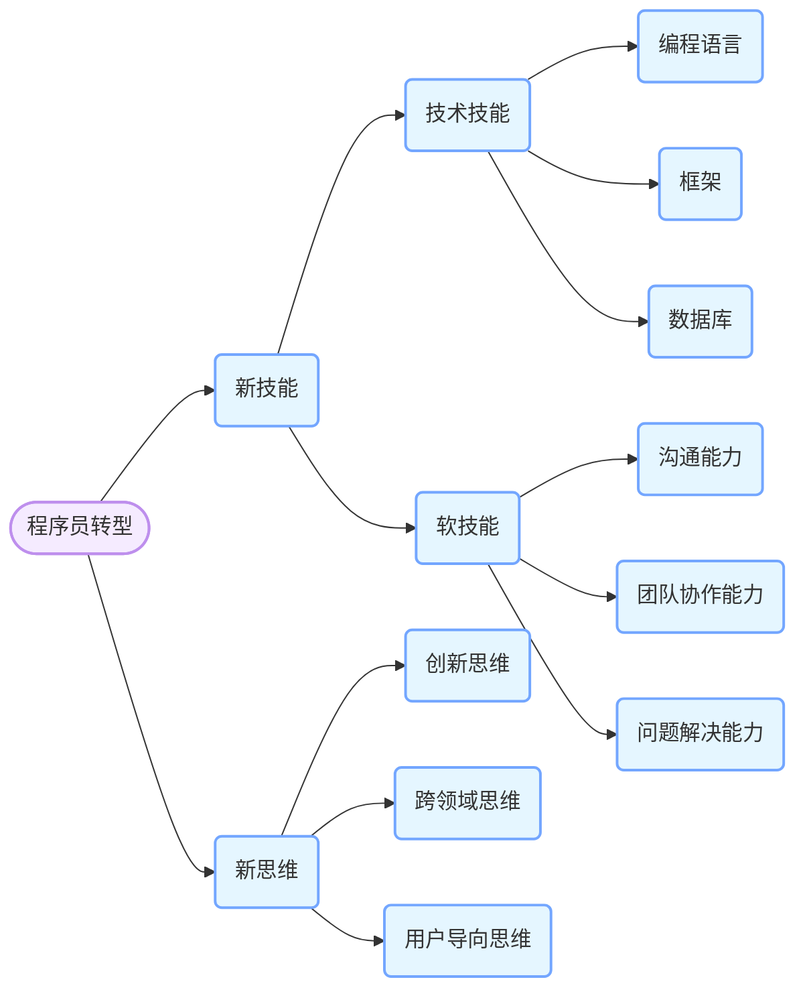

# 程序员的转型路径：新技能与新思维

> 关键词：程序员转型、新技能、新思维、职业发展、技术趋势、跨领域能力、转型策略

> 摘要：在科技飞速发展的今天，程序员面临着前所未有的挑战和机遇。技术的快速迭代使得原有的技能可能迅速过时，因此程序员需要不断探索转型路径，学习新技能并培养新思维。本文旨在深入探讨程序员转型的各个方面，包括背景、核心概念、所需算法与操作步骤、数学模型、项目实战、实际应用场景等，为程序员的职业转型提供全面而深入的指导，帮助他们在不断变化的技术环境中找到新的发展方向。

## 1. 背景介绍 
### 1.1 目的和范围
随着信息技术的不断发展，软件行业也在发生着翻天覆地的变化。新的编程语言、框架和技术不断涌现，市场对程序员的需求也在不断变化。程序员的转型路径研究旨在帮助程序员适应这种变化，提升自身的竞争力，实现职业的可持续发展。本研究的范围涵盖了程序员转型的各个方面，包括新技能的学习、新思维的培养、转型的策略和方法等。

### 1.2 预期读者
本文的预期读者主要是广大程序员群体，包括初级、中级和高级程序员。同时，也适合对软件开发行业感兴趣的相关人员，如技术管理者、人力资源专家等，以及正在考虑进入程序员职业领域的学生和求职者。

### 1.3 文档结构概述
本文将按照以下结构进行阐述：首先介绍背景信息，包括目的、预期读者和文档结构概述；接着讲解核心概念与联系，包括转型的定义、新技能和新思维的内涵以及它们之间的关系；然后深入探讨核心算法原理和具体操作步骤，用 Python 代码示例说明相关技术；再介绍数学模型和公式，并举例说明其在转型中的应用；之后通过项目实战展示转型过程中的代码实现和详细解释；接着分析实际应用场景；再推荐相关的工具和资源；最后总结未来发展趋势与挑战，提供常见问题解答和扩展阅读参考资料。

### 1.4 术语表
#### 1.4.1 核心术语定义
- **程序员转型**：指程序员从现有的技术领域、职业角色或工作模式向新的方向转变的过程，以适应市场需求和个人职业发展的需要。
- **新技能**：指在当前技术发展趋势下，程序员为了实现转型而需要学习和掌握的新的技术、工具和方法。
- **新思维**：指程序员在转型过程中需要培养的创新、跨领域、用户导向等思维方式，以更好地适应新的工作环境和需求。

#### 1.4.2 相关概念解释
- **技术栈**：指程序员在开发过程中使用的一系列技术和工具的集合，包括编程语言、框架、数据库等。
- **跨领域能力**：指程序员具备在多个不同领域或学科之间进行知识融合和应用的能力。
- **用户体验**：指用户在使用软件产品或服务过程中的感受和体验，包括易用性、功能性、美观性等方面。

#### 1.4.3 缩略词列表
- **AI**：Artificial Intelligence，人工智能
- **ML**：Machine Learning，机器学习
- **DL**：Deep Learning，深度学习
- **IoT**：Internet of Things，物联网
- **DevOps**：Development and Operations，开发与运维一体化

## 2. 核心概念与联系 
### 2.1 程序员转型的定义和内涵
程序员转型是一个复杂而多维度的过程，它不仅仅是学习新的技术和工具，更重要的是改变思维方式和工作模式。转型可以分为技术转型、职业角色转型和行业转型等不同类型。技术转型是指从一种技术领域转向另一种技术领域，如从传统的 Web 开发转向人工智能开发；职业角色转型是指从程序员转变为技术管理者、产品经理等其他角色；行业转型是指从一个行业进入另一个行业，如从互联网行业进入金融行业。

### 2.2 新技能的分类和特点
新技能可以分为技术技能和软技能两大类。技术技能包括编程语言、框架、数据库等方面的知识和技能，如 Python、Java、TensorFlow 等。软技能包括沟通能力、团队协作能力、问题解决能力等。新技能的特点是不断更新和发展，需要程序员持续学习和掌握。

### 2.3 新思维的内涵和重要性
新思维包括创新思维、跨领域思维、用户导向思维等。创新思维是指能够提出新颖的想法和解决方案，推动技术和产品的创新；跨领域思维是指能够将不同领域的知识和方法融合起来，解决复杂的问题；用户导向思维是指能够从用户的需求和体验出发，设计和开发产品。新思维对于程序员的转型至关重要，它能够帮助程序员更好地适应新的工作环境和需求，提升自身的竞争力。

### 2.4 新技能与新思维的关系
新技能和新思维是相辅相成的关系。新技能的学习需要新思维的引导，只有具备创新、跨领域等思维方式，才能更好地理解和掌握新技能。同时，新技能的掌握也能够促进新思维的培养，通过实践新的技术和方法，程序员可以不断开拓视野，培养创新能力和跨领域思维能力。

### 2.5 核心概念原理和架构的文本示意图
```plaintext
程序员转型
|
|-- 新技能
|   |-- 技术技能
|   |   |-- 编程语言
|   |   |-- 框架
|   |   |-- 数据库
|   |-- 软技能
|       |-- 沟通能力
|       |-- 团队协作能力
|       |-- 问题解决能力
|
|-- 新思维
|   |-- 创新思维
|   |-- 跨领域思维
|   |-- 用户导向思维
```

### 2.6 Mermaid 流程图


## 3. 核心算法原理 & 具体操作步骤 
### 3.1 学习新技能的算法原理
学习新技能的过程可以看作是一个不断迭代和优化的过程。可以采用以下算法来指导学习：
1. **需求分析**：明确自己的转型目标和需求，确定需要学习的新技能。
2. **资源收集**：收集相关的学习资源，如书籍、在线课程、技术博客等。
3. **学习计划制定**：根据自己的时间和学习能力，制定详细的学习计划。
4. **学习执行**：按照学习计划进行学习，不断实践和巩固所学知识。
5. **反馈和调整**：定期对学习效果进行评估和反馈，根据反馈结果调整学习计划和方法。

### 3.2 Python 代码示例
```python
# 需求分析
def analyze_requirements(transformation_goal):
    if transformation_goal == "AI development":
        required_skills = ["Python", "Machine Learning", "Deep Learning"]
    elif transformation_goal == "Mobile development":
        required_skills = ["Java", "Kotlin", "iOS development"]
    else:
        required_skills = []
    return required_skills

# 资源收集
def collect_resources(skills):
    resources = {}
    for skill in skills:
        if skill == "Python":
            resources[skill] = ["Python Crash Course", "Python for Data Science Handbook", "Online Python courses on Coursera"]
        elif skill == "Machine Learning":
            resources[skill] = ["Hands-On Machine Learning with Scikit-Learn, Keras, and TensorFlow", "Online ML courses on edX"]
        else:
            resources[skill] = []
    return resources

# 学习计划制定
def create_learning_plan(resources, time_available):
    learning_plan = {}
    for skill, resource_list in resources.items():
        if time_available > 0:
            learning_plan[skill] = resource_list[:min(len(resource_list), time_available)]
            time_available -= len(learning_plan[skill])
        else:
            break
    return learning_plan

# 学习执行
def execute_learning_plan(learning_plan):
    for skill, resources in learning_plan.items():
        print(f"Learning {skill} from the following resources:")
        for resource in resources:
            print(f" - {resource}")

# 反馈和调整
def feedback_and_adjust(learning_plan, learning_effect):
    if learning_effect < 0.5:
        # If the learning effect is poor, add more resources
        for skill in learning_plan:
            new_resources = collect_resources([skill])[skill]
            learning_plan[skill].extend(new_resources[:2])
    return learning_plan

# 主函数
if __name__ == "__main__":
    transformation_goal = "AI development"
    required_skills = analyze_requirements(transformation_goal)
    resources = collect_resources(required_skills)
    time_available = 5
    learning_plan = create_learning_plan(resources, time_available)
    execute_learning_plan(learning_plan)
    learning_effect = 0.3  # Assume the learning effect is 0.3
    adjusted_learning_plan = feedback_and_adjust(learning_plan, learning_effect)
    print("Adjusted learning plan:")
    execute_learning_plan(adjusted_learning_plan)
```

### 3.3 具体操作步骤
1. **明确转型目标**：根据自己的兴趣、职业规划和市场需求，确定自己的转型目标。
2. **分析需求**：使用 `analyze_requirements` 函数分析实现转型目标所需的新技能。
3. **收集资源**：使用 `collect_resources` 函数收集学习这些新技能所需的资源。
4. **制定学习计划**：根据自己的时间和学习能力，使用 `create_learning_plan` 函数制定详细的学习计划。
5. **执行学习计划**：按照学习计划，使用 `execute_learning_plan` 函数进行学习。
6. **评估学习效果**：定期对学习效果进行评估，可以通过考试、项目实践等方式进行。
7. **反馈和调整**：根据学习效果，使用 `feedback_and_adjust` 函数调整学习计划和方法。

## 4. 数学模型和公式 & 详细讲解 & 举例说明 
### 4.1 学习效率模型
学习效率可以用以下公式表示：
$$E = \frac{K}{T}$$
其中，$E$ 表示学习效率，$K$ 表示学习到的知识量，$T$ 表示学习时间。

### 4.2 详细讲解
这个公式表明，学习效率与学习到的知识量成正比，与学习时间成反比。在学习新技能的过程中，我们希望在尽可能短的时间内学习到更多的知识，即提高学习效率。为了提高学习效率，我们可以采取以下措施：
- **选择合适的学习资源**：优质的学习资源可以帮助我们更快地学习到知识，提高学习效率。
- **采用有效的学习方法**：如实践学习、项目驱动学习等，可以加深对知识的理解和掌握，提高学习效率。
- **合理安排学习时间**：避免过度学习和疲劳学习，保持良好的学习状态，提高学习效率。

### 4.3 举例说明
假设小明想要学习 Python 编程语言，他选择了一本教材和一个在线课程进行学习。经过 10 个小时的学习，他掌握了 Python 的基本语法和一些常用的库，学习到的知识量可以用一个量化的指标来表示，假设为 50 个知识单元。那么他的学习效率为：
$$E = \frac{50}{10} = 5 \text{ 知识单元/小时}$$

如果小明在学习过程中发现教材的讲解比较晦涩难懂，他更换了一本更适合自己的教材，并且采用了实践学习的方法，经过 8 个小时的学习，他掌握了更多的知识，学习到的知识量达到了 60 个知识单元。那么他的学习效率为：
$$E = \frac{60}{8} = 7.5 \text{ 知识单元/小时}$$

通过这个例子可以看出，选择合适的学习资源和采用有效的学习方法可以提高学习效率。

### 4.4 转型成功率模型
转型成功率可以用以下公式表示：
$$S = \frac{M}{N} \times P$$
其中，$S$ 表示转型成功率，$M$ 表示具备的关键技能数量，$N$ 表示所需的关键技能总数，$P$ 表示个人的适应能力和学习能力。

### 4.5 详细讲解
这个公式表明，转型成功率与具备的关键技能数量成正比，与所需的关键技能总数成反比，同时还与个人的适应能力和学习能力有关。在转型过程中，我们需要尽可能地掌握所需的关键技能，提高自己的适应能力和学习能力，以提高转型成功率。

### 4.6 举例说明
假设小张想要从传统的 Web 开发转型为人工智能开发，所需的关键技能总数为 10 个，他目前已经掌握了 3 个关键技能，他的适应能力和学习能力评估为 0.8。那么他的转型成功率为：
$$S = \frac{3}{10} \times 0.8 = 0.24$$

如果小张通过学习和实践，又掌握了 2 个关键技能，并且通过锻炼提高了自己的适应能力和学习能力，评估为 0.9。那么他的转型成功率为：
$$S = \frac{5}{10} \times 0.9 = 0.45$$

通过这个例子可以看出，掌握更多的关键技能和提高个人的适应能力和学习能力可以提高转型成功率。

## 5. 项目实战：代码实际案例和详细解释说明 
### 5.1  开发环境搭建
假设我们要进行一个简单的人工智能项目，使用 Python 语言和 TensorFlow 框架。以下是开发环境搭建的步骤：
1. **安装 Python**：从 Python 官方网站（https://www.python.org/downloads/）下载并安装 Python 3.x 版本。
2. **安装 TensorFlow**：打开命令行工具，使用以下命令安装 TensorFlow：
```sh
pip install tensorflow
```
3. **安装其他依赖库**：根据项目需求，安装其他必要的依赖库，如 NumPy、Pandas 等：
```sh
pip install numpy pandas
```
4. **选择开发工具**：可以选择 PyCharm、Jupyter Notebook 等开发工具。

### 5.2  源代码详细实现和代码解读
以下是一个简单的手写数字识别项目的代码示例：
```python
import tensorflow as tf
from tensorflow.keras.datasets import mnist
from tensorflow.keras.models import Sequential
from tensorflow.keras.layers import Flatten, Dense

# 加载数据集
(x_train, y_train), (x_test, y_test) = mnist.load_data()

# 数据预处理
x_train, x_test = x_train / 255.0, x_test / 255.0

# 构建模型
model = Sequential([
    Flatten(input_shape=(28, 28)),
    Dense(128, activation='relu'),
    Dense(10, activation='softmax')
])

# 编译模型
model.compile(optimizer='adam',
              loss='sparse_categorical_crossentropy',
              metrics=['accuracy'])

# 训练模型
model.fit(x_train, y_train, epochs=5)

# 评估模型
test_loss, test_acc = model.evaluate(x_test, y_test)
print(f"Test accuracy: {test_acc}")
```

### 5.3  代码解读与分析
1. **加载数据集**：使用 `mnist.load_data()` 函数加载手写数字识别数据集，该数据集包含 60000 个训练样本和 10000 个测试样本。
2. **数据预处理**：将图像数据的像素值从 0 - 255 归一化到 0 - 1 之间，这样可以提高模型的训练效率和准确性。
3. **构建模型**：使用 `Sequential` 模型构建一个简单的神经网络，包含一个 `Flatten` 层将二维图像数据展平为一维向量，一个 `Dense` 层作为隐藏层，使用 `relu` 激活函数，一个 `Dense` 层作为输出层，使用 `softmax` 激活函数。
4. **编译模型**：使用 `adam` 优化器、`sparse_categorical_crossentropy` 损失函数和 `accuracy` 评估指标编译模型。
5. **训练模型**：使用 `fit` 函数对模型进行训练，训练 5 个 epochs。
6. **评估模型**：使用 `evaluate` 函数对模型在测试集上的性能进行评估，输出测试集的准确率。

## 6. 实际应用场景 
### 6.1 人工智能领域
随着人工智能技术的不断发展，程序员向人工智能领域转型的需求越来越大。在人工智能领域，程序员可以参与自然语言处理、计算机视觉、机器学习等项目的开发。例如，开发智能客服系统、图像识别软件、推荐系统等。

### 6.2 大数据领域
大数据技术的应用越来越广泛，程序员可以向大数据领域转型，参与数据挖掘、数据分析、数据仓库等项目的开发。例如，开发电商平台的用户行为分析系统、金融机构的风险评估系统等。

### 6.3 移动开发领域
移动设备的普及使得移动开发市场需求旺盛，程序员可以向移动开发领域转型，开发 iOS 和 Android 应用程序。例如，开发社交应用、游戏应用、办公应用等。

### 6.4 云计算领域
云计算技术的发展为企业提供了更高效、更灵活的 IT 解决方案，程序员可以向云计算领域转型，参与云平台的开发和维护。例如，开发基于云的存储系统、计算资源管理系统等。

### 6.5 物联网领域
物联网技术的兴起使得万物互联成为可能，程序员可以向物联网领域转型，参与物联网设备的开发和管理。例如，开发智能家居系统、智能交通系统、工业物联网系统等。

## 7. 工具和资源推荐
### 7.1 学习资源推荐
#### 7.1.1 书籍推荐
- 《Python 编程：从入门到实践》：适合初学者学习 Python 编程语言。
- 《机器学习实战》：通过实际案例介绍机器学习的基本算法和应用。
- 《深度学习》：深度学习领域的经典教材，全面介绍深度学习的理论和实践。
- 《数据挖掘：概念与技术》：介绍数据挖掘的基本概念、算法和应用。
- 《移动应用开发实战》：介绍 iOS 和 Android 应用开发的技术和方法。

#### 7.1.2 在线课程
- Coursera：提供丰富的在线课程，包括人工智能、机器学习、数据科学等领域的课程。
- edX：与全球顶尖大学和机构合作，提供高质量的在线课程。
- Udemy：提供各种技术课程，价格实惠。
- 中国大学 MOOC：国内知名的在线课程平台，提供丰富的计算机科学课程。

#### 7.1.3 技术博客和网站
- Medium：汇聚了众多技术专家和开发者的博客文章，涵盖各种技术领域。
- Stack Overflow：程序员交流和解决问题的社区，提供大量的技术问答和代码示例。
- GitHub：全球最大的开源代码托管平台，可以学习到优秀的开源项目和代码。
- 开源中国：国内知名的开源技术社区，提供技术资讯、开源项目推荐等服务。

### 7.2 开发工具框架推荐
#### 7.2.1 IDE和编辑器
- PyCharm：专业的 Python 集成开发环境，提供代码编辑、调试、版本控制等功能。
- IntelliJ IDEA：功能强大的 Java 集成开发环境，也支持其他编程语言。
- Visual Studio Code：轻量级的代码编辑器，支持多种编程语言和插件扩展。
- Xcode：苹果官方的 iOS 和 macOS 开发工具。
- Android Studio：谷歌官方的 Android 开发工具。

#### 7.2.2 调试和性能分析工具
- PDB：Python 自带的调试器，用于调试 Python 代码。
- GDB：通用的调试器，支持多种编程语言。
- Chrome DevTools：谷歌浏览器的开发者工具，用于调试 Web 应用程序。
- Profiler：用于分析程序性能的工具，如 Python 的 cProfile 模块。

#### 7.2.3 相关框架和库
- TensorFlow：开源的机器学习框架，广泛应用于深度学习领域。
- PyTorch：另一个流行的深度学习框架，具有动态图的优势。
- Django：Python 的 Web 开发框架，提供快速开发 Web 应用的功能。
- Flask：轻量级的 Python Web 开发框架，适合小型项目和快速原型开发。
- React：用于构建用户界面的 JavaScript 库，广泛应用于前端开发。

### 7.3 相关论文著作推荐
#### 7.3.1 经典论文
- 《A Neural Algorithm of Artistic Style》：提出了一种基于卷积神经网络的艺术风格迁移算法。
- 《Attention Is All You Need》：介绍了 Transformer 模型，在自然语言处理领域取得了巨大成功。
- 《ImageNet Classification with Deep Convolutional Neural Networks》：介绍了 AlexNet 模型，开启了深度学习在计算机视觉领域的革命。

#### 7.3.2 最新研究成果
- arXiv：预印本平台，提供最新的学术研究成果，涵盖人工智能、机器学习等多个领域。
- ACM Digital Library：计算机领域的权威数字图书馆，提供大量的学术论文和研究报告。
- IEEE Xplore：电气和电子工程师协会的数字图书馆，提供丰富的技术文献。

#### 7.3.3 应用案例分析
- 《Artificial Intelligence: A Modern Approach》：介绍了人工智能的理论和应用，包含大量的应用案例分析。
- 《Data Science for Business》：通过实际案例介绍数据科学在商业领域的应用。
- 《Building Machine Learning Powered Applications》：介绍如何使用机器学习技术构建实际应用程序，包含多个应用案例。

## 8. 总结：未来发展趋势与挑战
### 8.1 未来发展趋势
- **技术融合**：不同技术领域之间的融合将越来越明显，如人工智能与物联网、大数据与云计算等的融合。程序员需要具备跨领域的技术能力，以适应这种发展趋势。
- **自动化和智能化**：软件开发过程将越来越自动化和智能化，如自动化测试、智能代码补全、自动部署等。程序员需要掌握相关的工具和技术，提高开发效率。
- **开源和社区化**：开源软件和社区的影响力将越来越大，程序员需要积极参与开源项目，与社区开发者交流和合作，提升自己的技术水平。
- **绿色计算**：随着环保意识的增强，绿色计算将成为未来的发展趋势。程序员需要关注软件的能耗和资源利用效率，开发更加环保的软件。

### 8.2 挑战
- **技术更新换代快**：技术的快速发展使得程序员需要不断学习和更新自己的知识和技能，否则很容易被淘汰。
- **竞争激烈**：随着程序员群体的不断扩大，就业竞争也越来越激烈。程序员需要不断提升自己的竞争力，才能在市场中脱颖而出。
- **跨领域知识要求高**：未来的软件开发需要跨领域的知识和技能，程序员需要学习多个领域的知识，这对他们的学习能力和时间管理能力提出了更高的要求。
- **伦理和法律问题**：随着人工智能、大数据等技术的发展，伦理和法律问题也越来越受到关注。程序员需要了解相关的伦理和法律规定，确保自己的开发工作符合法律和道德要求。

## 9. 附录：常见问题与解答
### 9.1 转型需要多长时间？
转型所需的时间因人而异，取决于转型的目标、个人的学习能力和时间投入等因素。一般来说，从一个技术领域转向另一个技术领域可能需要几个月到一年的时间，而从程序员转变为其他职业角色可能需要更长的时间。

### 9.2 如何选择转型的方向？
选择转型的方向需要考虑自己的兴趣、职业规划、市场需求等因素。可以通过了解行业动态、参加技术交流活动、与同行交流等方式，了解不同领域的发展前景和需求，从而选择适合自己的转型方向。

### 9.3 转型过程中遇到困难怎么办？
在转型过程中遇到困难是很正常的，可以通过以下方式解决：
- **寻求帮助**：向同行、导师或专业人士请教，获取他们的建议和经验。
- **参加培训课程**：参加相关的培训课程，系统地学习新的知识和技能。
- **多实践**：通过实践项目来巩固所学的知识和技能，提高自己的解决问题的能力。

### 9.4 如何平衡工作和学习？
平衡工作和学习需要合理安排时间和制定计划。可以利用业余时间进行学习，如晚上、周末等。同时，要注意合理分配时间，避免过度劳累。可以将学习任务分解成小的目标，逐步完成，提高学习效率。

## 10. 扩展阅读 & 参考资料
- 《程序员职业发展规划》
- 《技术转型的成功之路》
- 各大技术论坛和社区的相关帖子和讨论
- 相关行业报告和研究机构的研究成果