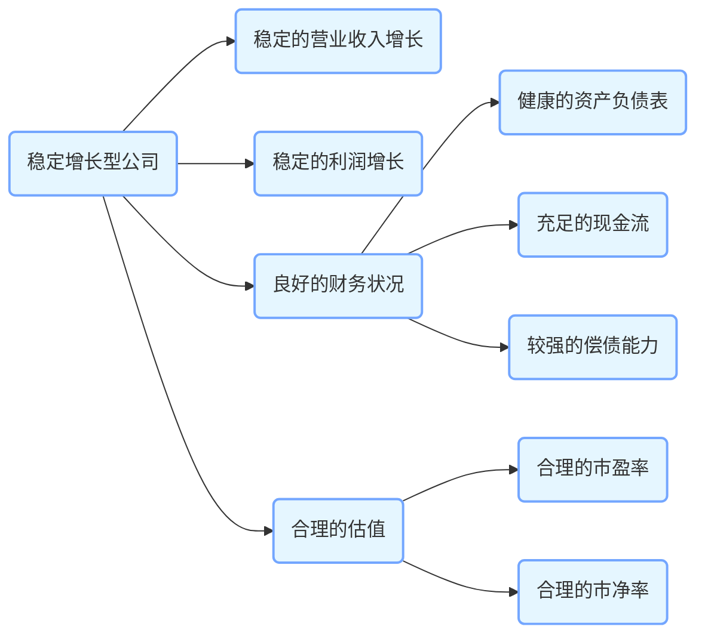

# 稳定增长型公司：彼得林奇的最爱

> 关键词：稳定增长型公司、彼得林奇、投资策略、财务分析、股票投资

> 摘要：本文深入探讨了彼得林奇所钟爱的稳定增长型公司。首先介绍了文章的背景，包括目的、预期读者、文档结构和相关术语。接着阐述了稳定增长型公司的核心概念，通过示意图和流程图展示其架构。详细讲解了评估稳定增长型公司的核心算法原理和操作步骤，并结合Python代码进行说明。还给出了相关的数学模型和公式，并举例解释。通过项目实战案例，展示了如何分析稳定增长型公司的股票。探讨了稳定增长型公司在实际中的应用场景，推荐了学习资源、开发工具和相关论文著作。最后总结了稳定增长型公司的未来发展趋势与挑战，提供了常见问题解答和扩展阅读参考资料。

## 1. 背景介绍 
### 1.1 目的和范围
本文的目的是全面剖析稳定增长型公司为何成为彼得林奇的投资最爱，深入研究这类公司的特点、评估方法以及投资价值。我们将探讨稳定增长型公司的核心概念、核心算法原理、数学模型等理论知识，同时通过项目实战案例展示如何在实际投资中应用这些知识。范围涵盖了稳定增长型公司的基本定义、财务特征、市场表现以及投资策略等多个方面。

### 1.2 预期读者
本文预期读者包括对股票投资感兴趣的初学者，希望通过学习彼得林奇的投资理念和方法，提升自己的投资技能；也包括有一定投资经验的投资者，希望从新的角度深入了解稳定增长型公司，优化自己的投资组合；还适合金融专业的学生和研究人员，用于学术研究和案例分析。

### 1.3 文档结构概述
本文按照以下结构展开：首先介绍稳定增长型公司的背景信息，包括目的、读者和文档结构；接着阐述核心概念与联系，通过示意图和流程图展示其架构；然后讲解核心算法原理和具体操作步骤，并给出Python代码示例；再介绍相关的数学模型和公式，并举例说明；通过项目实战展示代码实现和分析；探讨实际应用场景；推荐学习资源、开发工具和相关论文著作；最后总结未来发展趋势与挑战，提供常见问题解答和扩展阅读参考资料。

### 1.4 术语表
#### 1.4.1 核心术语定义
- **稳定增长型公司**：指那些在较长时间内，营业收入和净利润保持相对稳定增长的公司。这种增长通常是持续的、可预测的，不受宏观经济环境和行业波动的过度影响。
- **彼得林奇**：著名的投资大师，曾任富达麦哲伦基金的基金经理，在他的管理下，麦哲伦基金取得了惊人的业绩。他提出了多种投资策略，对稳定增长型公司的投资有深入的研究和实践。
- **市盈率（P/E）**：指股票价格除以每股收益的比率，反映了市场对公司盈利的预期和估值水平。
- **股息率**：指股息与股票价格的比率，反映了公司向股东分配利润的能力和水平。

#### 1.4.2 相关概念解释
- **投资组合**：指投资者将资金分散投资于不同的资产或证券，以降低风险、实现收益最大化的一种投资策略。
- **财务报表**：指公司定期公布的反映其财务状况和经营成果的报告，包括资产负债表、利润表和现金流量表等。
- **行业分析**：指对特定行业的市场规模、竞争格局、发展趋势等进行研究和分析，以评估该行业的投资价值和风险。

#### 1.4.3 缩略词列表
- **P/E**：市盈率（Price-to-Earnings Ratio）
- **EPS**：每股收益（Earnings Per Share）
- **ROE**：净资产收益率（Return on Equity）

## 2. 核心概念与联系 
稳定增长型公司是彼得林奇投资组合中的重要组成部分。这类公司通常具有以下特点：
- **稳定的营业收入和利润增长**：公司的业务具有较强的市场竞争力和稳定性，能够在不同的经济环境下保持一定的增长速度。
- **良好的财务状况**：公司的资产负债表健康，现金流充足，有较强的偿债能力和抗风险能力。
- **合理的估值**：相对于其增长速度和盈利能力，公司的股票价格具有一定的吸引力，市盈率和市净率等估值指标处于合理范围内。

以下是稳定增长型公司的核心概念架构示意图：



从这个流程图可以看出，稳定增长型公司的核心要素包括稳定的营收和利润增长、良好的财务状况以及合理的估值。这些要素相互关联，共同构成了稳定增长型公司的特征。稳定的营收和利润增长是公司发展的基础，良好的财务状况保证了公司的稳定性和抗风险能力，而合理的估值则为投资者提供了投资机会。

## 3. 核心算法原理 & 具体操作步骤 
### 核心算法原理
评估稳定增长型公司的核心算法主要基于财务分析和估值模型。我们可以通过计算一些关键的财务指标来评估公司的增长能力、盈利能力和财务健康状况。以下是一些常用的指标和计算方法：

- **营业收入增长率**：计算公式为 $营业收入增长率 = \frac{本期营业收入 - 上期营业收入}{上期营业收入} \times 100\%$，该指标反映了公司营业收入的增长速度。
- **净利润增长率**：计算公式为 $净利润增长率 = \frac{本期净利润 - 上期净利润}{上期净利润} \times 100\%$，该指标反映了公司净利润的增长速度。
- **净资产收益率（ROE）**：计算公式为 $ROE = \frac{净利润}{净资产} \times 100\%$，该指标反映了公司利用自有资本获取收益的能力。
- **市盈率（P/E）**：计算公式为 $P/E = \frac{股票价格}{每股收益}$，该指标反映了市场对公司盈利的预期和估值水平。

### 具体操作步骤
以下是使用Python代码实现评估稳定增长型公司的具体操作步骤：

```python
import pandas as pd

# 假设我们有一个包含公司财务数据的CSV文件，文件名为 'financial_data.csv'
# 文件包含以下列：'营业收入', '净利润', '净资产', '股票价格', '每股收益'

# 读取数据
data = pd.read_csv('financial_data.csv')

# 计算营业收入增长率
data['营业收入增长率'] = (data['营业收入'] - data['营业收入'].shift(1)) / data['营业收入'].shift(1) * 100

# 计算净利润增长率
data['净利润增长率'] = (data['净利润'] - data['净利润'].shift(1)) / data['净利润'].shift(1) * 100

# 计算净资产收益率（ROE）
data['ROE'] = data['净利润'] / data['净资产'] * 100

# 计算市盈率（P/E）
data['P/E'] = data['股票价格'] / data['每股收益']

# 打印计算结果
print(data[['营业收入增长率', '净利润增长率', 'ROE', 'P/E']])
```

### 代码解释
1. **导入必要的库**：使用 `pandas` 库来处理和分析数据。
2. **读取数据**：使用 `pd.read_csv` 函数读取包含公司财务数据的CSV文件。
3. **计算指标**：使用 `shift` 函数来获取上一期的数据，然后根据公式计算营业收入增长率、净利润增长率、净资产收益率和市盈率。
4. **打印结果**：打印计算得到的各项指标。

通过以上步骤，我们可以对公司的财务数据进行分析，评估其是否符合稳定增长型公司的特征。

## 4. 数学模型和公式 & 详细讲解 & 举例说明 
### 数学模型和公式
在评估稳定增长型公司时，我们使用了以下几个重要的数学模型和公式：

#### 营业收入增长率
$营业收入增长率 = \frac{本期营业收入 - 上期营业收入}{上期营业收入} \times 100\%$

#### 净利润增长率
$净利润增长率 = \frac{本期净利润 - 上期净利润}{上期净利润} \times 100\%$

#### 净资产收益率（ROE）
$ROE = \frac{净利润}{净资产} \times 100\%$

#### 市盈率（P/E）
$P/E = \frac{股票价格}{每股收益}$

### 详细讲解
- **营业收入增长率**：该指标反映了公司在一定时期内营业收入的增长情况。如果营业收入增长率持续为正且保持在一定水平，说明公司的业务在不断扩张，市场份额在增加。
- **净利润增长率**：该指标反映了公司在一定时期内净利润的增长情况。净利润是公司经营成果的最终体现，净利润增长率的稳定增长表明公司的盈利能力在不断提升。
- **净资产收益率（ROE）**：该指标反映了公司利用自有资本获取收益的能力。ROE越高，说明公司的盈利能力越强，股东的投资回报越高。
- **市盈率（P/E）**：该指标反映了市场对公司盈利的预期和估值水平。一般来说，市盈率较低的公司可能被市场低估，具有一定的投资价值。

### 举例说明
假设某公司在2022年的营业收入为1000万元，2023年的营业收入为1200万元；2022年的净利润为100万元，2023年的净利润为120万元；净资产为500万元；股票价格为20元，每股收益为2元。

#### 营业收入增长率
$营业收入增长率 = \frac{1200 - 1000}{1000} \times 100\% = 20\%$

#### 净利润增长率
$净利润增长率 = \frac{120 - 100}{100} \times 100\% = 20\%$

#### 净资产收益率（ROE）
$ROE = \frac{120}{500} \times 100\% = 24\%$

#### 市盈率（P/E）
$P/E = \frac{20}{2} = 10$

从以上计算结果可以看出，该公司的营业收入和净利润都实现了20%的增长，ROE为24%，说明公司的盈利能力较强；市盈率为10，相对较低，可能具有一定的投资价值。

## 5. 项目实战：代码实际案例和详细解释说明 
### 5.1  开发环境搭建
为了进行稳定增长型公司的分析，我们需要搭建一个Python开发环境。以下是具体的搭建步骤：

1. **安装Python**：从Python官方网站（https://www.python.org/downloads/）下载并安装Python 3.x版本。
2. **安装必要的库**：使用 `pip` 命令安装 `pandas` 和 `numpy` 库，这两个库用于数据处理和分析。
```sh
pip install pandas numpy
```
3. **选择开发工具**：可以选择使用Jupyter Notebook、PyCharm等开发工具。这里我们推荐使用Jupyter Notebook，它可以方便地进行代码编写、运行和结果展示。

### 5.2  源代码详细实现和代码解读
以下是一个完整的Python代码示例，用于分析稳定增长型公司的财务数据：

```python
import pandas as pd
import numpy as np

# 读取数据
data = pd.read_csv('financial_data.csv')

# 检查数据是否包含缺失值
if data.isnull().any().any():
    # 如果有缺失值，进行简单的处理，这里选择用前一个值填充
    data = data.fillna(method='ffill')

# 计算营业收入增长率
data['营业收入增长率'] = (data['营业收入'] - data['营业收入'].shift(1)) / data['营业收入'].shift(1) * 100

# 计算净利润增长率
data['净利润增长率'] = (data['净利润'] - data['净利润'].shift(1)) / data['净利润'].shift(1) * 100

# 计算净资产收益率（ROE）
data['ROE'] = data['净利润'] / data['净资产'] * 100

# 计算市盈率（P/E）
data['P/E'] = data['股票价格'] / data['每股收益']

# 筛选出符合稳定增长型公司特征的股票
# 假设营业收入增长率和净利润增长率连续三年大于10%，ROE连续三年大于15%，P/E小于20
stable_growth_stocks = data[
    (data['营业收入增长率'].rolling(window=3).min() > 10) &
    (data['净利润增长率'].rolling(window=3).min() > 10) &
    (data['ROE'].rolling(window=3).min() > 15) &
    (data['P/E'] < 20)
]

# 打印筛选结果
print(stable_growth_stocks)
```

### 代码解读与分析
1. **导入必要的库**：导入 `pandas` 和 `numpy` 库，用于数据处理和分析。
2. **读取数据**：使用 `pd.read_csv` 函数读取包含公司财务数据的CSV文件。
3. **处理缺失值**：检查数据中是否包含缺失值，如果有则使用前一个值进行填充。
4. **计算指标**：计算营业收入增长率、净利润增长率、净资产收益率和市盈率。
5. **筛选稳定增长型公司**：使用 `rolling` 函数计算连续三年的指标最小值，筛选出营业收入增长率和净利润增长率连续三年大于10%，ROE连续三年大于15%，P/E小于20的股票。
6. **打印结果**：打印筛选出的稳定增长型公司的财务数据。

通过以上代码，我们可以从大量的公司数据中筛选出符合稳定增长型公司特征的股票，为投资决策提供参考。

## 6. 实际应用场景 
稳定增长型公司在股票投资中具有广泛的应用场景，以下是一些常见的应用场景：

### 长期投资组合构建
对于追求长期稳定收益的投资者来说，稳定增长型公司是构建投资组合的重要选择。这些公司的业绩稳定，分红可观，能够为投资者提供持续的现金流和资本增值。投资者可以将一部分资金投资于稳定增长型公司的股票，以降低投资组合的风险，实现长期的财富增长。

### 养老基金投资
养老基金通常具有长期投资的特点，需要追求稳定的收益。稳定增长型公司的业绩和现金流相对稳定，符合养老基金的投资需求。养老基金可以将一部分资金投资于稳定增长型公司的股票，以保障养老金的长期稳定增值。

### 价值投资策略
价值投资是一种基于公司基本面分析的投资策略，强调寻找被市场低估的股票。稳定增长型公司由于其业绩稳定、现金流充足，往往具有较高的内在价值。当市场对这些公司的估值较低时，价值投资者可以买入这些股票，等待市场对其价值的重新发现，从而获得投资收益。

### 风险分散
投资者可以将资金分散投资于不同行业的稳定增长型公司，以降低投资组合的风险。不同行业的稳定增长型公司受到宏观经济环境和行业波动的影响程度不同，通过分散投资可以减少单一行业或公司对投资组合的影响，提高投资组合的稳定性。

## 7. 工具和资源推荐
### 7.1 学习资源推荐
#### 7.1.1 书籍推荐
- 《彼得林奇的成功投资》：彼得林奇的经典著作，详细介绍了他的投资理念和方法，包括如何选择稳定增长型公司的股票。
- 《聪明的投资者》：本杰明·格雷厄姆的经典著作，被誉为投资界的圣经，对价值投资和稳定增长型公司的投资有深入的阐述。
- 《财务报表分析与股票估值》：介绍了如何通过分析公司的财务报表来评估公司的价值，对于理解稳定增长型公司的财务特征和估值方法有很大帮助。

#### 7.1.2 在线课程
- Coursera上的“投资学原理”：由知名大学教授授课，系统介绍了投资学的基本原理和方法，包括股票投资、债券投资等。
- Udemy上的“股票投资实战课程”：结合实际案例，讲解如何进行股票投资分析和决策，对于初学者来说是一个很好的入门课程。

#### 7.1.3 技术博客和网站
- 雪球网：国内知名的投资社区，提供大量的股票投资分析和研究报告，投资者可以在这里交流投资经验和心得。
- Seeking Alpha：国外知名的投资网站，提供全球范围内的股票分析和研究报告，对于了解国际市场的稳定增长型公司有很大帮助。

### 7.2 开发工具框架推荐
#### 7.2.1 IDE和编辑器
- Jupyter Notebook：一个交互式的开发环境，适合进行数据处理和分析，支持Python、R等多种编程语言。
- PyCharm：一款专业的Python集成开发环境，提供丰富的代码编辑、调试和分析功能，适合大规模的Python项目开发。

#### 7.2.2 调试和性能分析工具
- pdb：Python自带的调试工具，可以帮助开发者定位代码中的问题。
- cProfile：Python的性能分析工具，可以分析代码的运行时间和性能瓶颈，帮助开发者优化代码。

#### 7.2.3 相关框架和库
- pandas：用于数据处理和分析的Python库，提供了丰富的数据结构和函数，方便进行财务数据的处理和分析。
- numpy：用于科学计算的Python库，提供了高效的数组和矩阵运算功能，在财务数据的计算中经常使用。

### 7.3 相关论文著作推荐
#### 7.3.1 经典论文
- “The Cross - Section of Expected Stock Returns”（Fama and French，1992）：提出了著名的Fama - French三因子模型，对股票收益率的影响因素进行了深入研究，对于理解稳定增长型公司的股票定价有重要意义。
- “Valuation and Clean Surplus Accounting for Operating and Financial Activities”（Ohlson，1995）：提出了基于干净盈余会计的估值模型，为评估公司的内在价值提供了新的思路。

#### 7.3.2 最新研究成果
- 关注顶级金融学术期刊，如《Journal of Finance》、《Review of Financial Studies》等，这些期刊上发表了很多关于股票投资和公司财务的最新研究成果。

#### 7.3.3 应用案例分析
- 可以参考一些知名投资机构的研究报告和案例分析，了解他们在实际投资中如何选择和评估稳定增长型公司的股票。

## 8. 总结：未来发展趋势与挑战
### 未来发展趋势
- **数字化转型加速**：随着科技的不断发展，稳定增长型公司将加快数字化转型的步伐，利用大数据、人工智能等技术提升运营效率和竞争力。例如，传统零售企业通过数字化转型可以实现线上线下融合，拓展销售渠道，提高客户满意度。
- **可持续发展意识增强**：消费者和投资者对企业的可持续发展越来越关注，稳定增长型公司将更加注重环境保护、社会责任和公司治理。那些在可持续发展方面表现出色的公司将更具竞争力，更容易获得投资者的青睐。
- **行业整合加剧**：在市场竞争日益激烈的背景下，稳定增长型公司将通过并购、重组等方式进行行业整合，扩大市场份额，提高规模效应。例如，在医药行业，大型药企通过并购小型创新药企可以快速获得新技术和新产品，提升自身的研发能力和市场竞争力。

### 挑战
- **宏观经济不确定性**：全球经济增长的不确定性增加，贸易摩擦、通货膨胀、利率波动等因素可能会对稳定增长型公司的业绩产生影响。例如，利率上升可能会增加公司的融资成本，影响公司的投资和扩张计划。
- **技术变革带来的挑战**：科技的快速发展可能会使一些传统行业的稳定增长型公司面临被颠覆的风险。例如，随着电动汽车技术的发展，传统燃油汽车企业可能会面临市场份额下降的压力。
- **竞争加剧**：随着市场竞争的加剧，稳定增长型公司需要不断创新和提升自身的竞争力，否则可能会被竞争对手超越。例如，在智能手机市场，各大品牌之间的竞争非常激烈，只有不断推出创新产品和提供优质服务的公司才能保持市场份额。

## 9. 附录：常见问题与解答
### 问题1：如何判断一家公司是否为稳定增长型公司？
答：可以通过分析公司的财务报表，计算营业收入增长率、净利润增长率、净资产收益率等指标，观察这些指标是否在较长时间内保持稳定增长。同时，还可以考虑公司的行业地位、市场竞争力、管理团队等因素。

### 问题2：稳定增长型公司的股票一定能获得稳定的收益吗？
答：不一定。虽然稳定增长型公司的业绩相对稳定，但股票价格还受到市场情绪、宏观经济环境等多种因素的影响。因此，投资稳定增长型公司的股票仍然存在一定的风险。

### 问题3：如何选择合适的稳定增长型公司进行投资？
答：可以从以下几个方面进行考虑：一是公司的业绩增长是否稳定，二是公司的财务状况是否健康，三是公司的估值是否合理，四是公司所处的行业是否具有发展前景。

### 问题4：稳定增长型公司和成长型公司有什么区别？
答：稳定增长型公司的业绩增长相对平稳，通常处于成熟阶段，具有较强的市场竞争力和稳定的现金流；而成长型公司的业绩增长速度较快，但波动较大，通常处于发展阶段，具有较高的发展潜力和风险。

## 10. 扩展阅读 & 参考资料
### 扩展阅读
- 《漫步华尔街》：介绍了股票市场的基本原理和投资策略，对于理解股票投资有很大帮助。
- 《金融炼金术》：乔治·索罗斯的著作，阐述了他的投资哲学和方法，对于深入思考投资问题有很大启发。

### 参考资料
- 彼得林奇的官方网站和相关访谈资料。
- 各大金融数据库，如Wind、东方财富等，提供了丰富的公司财务数据和市场信息。
- 相关的学术研究论文和报告，可以通过学术数据库如CNKI、万方等进行查找。