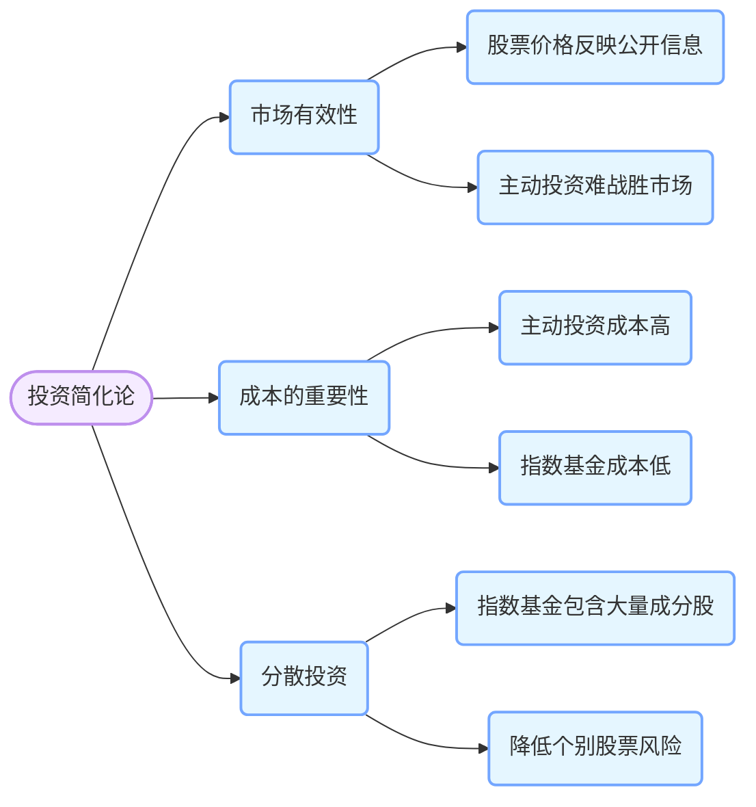

# 约翰·伯格的投资简化论：为什么少即是多

> 关键词：约翰·伯格、投资简化论、少即是多、投资策略、指数基金

> 摘要：本文深入探讨了约翰·伯格提出的投资简化论，即“少即是多”的投资理念。首先介绍了该理论提出的背景，包括目的、适用读者、文档结构和相关术语。接着阐述了核心概念及联系，用示意图和流程图呈现其原理架构。详细讲解了与之相关的核心算法原理和具体操作步骤，结合 Python 代码进行说明。通过数学模型和公式进一步剖析该理论，并举例说明。给出项目实战案例，涵盖开发环境搭建、源代码实现与解读。分析了该理论的实际应用场景，推荐了学习该理论的工具和资源，包括书籍、在线课程、开发工具等。最后总结了其未来发展趋势与挑战，解答常见问题并提供扩展阅读和参考资料。

## 1. 背景介绍 
### 1.1 目的和范围
约翰·伯格（John C. Bogle）是投资界的传奇人物，他创立的先锋集团（Vanguard Group）以推广低成本指数基金而闻名。他的投资简化论“少即是多”旨在为投资者提供一种简单、有效且长期稳定的投资策略。本文的目的是深入解读这一理论，分析其背后的原理和优势，并探讨如何将其应用于实际投资中。范围涵盖了该理论的核心概念、算法原理、数学模型、实际案例以及未来发展趋势等方面。

### 1.2 预期读者
本文预期读者包括各类投资者，无论是新手投资者，希望找到一种简单易懂的投资方法；还是有一定经验的投资者，希望优化自己的投资组合，提高投资效率。同时，对于金融专业的学生、研究人员以及对投资理论感兴趣的人士也具有一定的参考价值。

### 1.3 文档结构概述
本文将按照以下结构进行阐述：首先介绍相关背景知识，包括目的、读者和术语；接着详细讲解核心概念和联系，通过示意图和流程图直观呈现；然后分析核心算法原理和具体操作步骤，结合 Python 代码；再通过数学模型和公式深入剖析；之后给出项目实战案例，包括环境搭建、代码实现和解读；探讨实际应用场景；推荐相关的工具和资源；最后总结未来发展趋势与挑战，解答常见问题并提供扩展阅读和参考资料。

### 1.4 术语表
#### 1.4.1 核心术语定义
- **投资简化论**：约翰·伯格提出的一种投资理念，强调通过简单的投资策略，如投资低成本指数基金，减少不必要的交易和复杂的投资组合，以实现长期稳定的投资回报。
- **少即是多**：该理论的核心观点，意味着在投资中，减少投资的复杂性、交易频率和成本，反而能够获得更好的投资效果。
- **指数基金**：一种按照特定指数（如标普 500 指数）进行投资的基金，其投资组合与指数成分股的比例基本一致，旨在跟踪指数的表现。

#### 1.4.2 相关概念解释
- **主动投资**：投资者通过分析市场、研究公司基本面等方式，主动选择投资标的，试图战胜市场平均水平。
- **被动投资**：与主动投资相对，被动投资通过跟踪特定指数，不进行主动的选股和择时，以获得市场平均回报。指数基金是被动投资的典型代表。
- **投资成本**：包括基金管理费、交易手续费、买卖价差等，这些成本会直接影响投资收益。

#### 1.4.3 缩略词列表
- **ETF**：交易型开放式指数基金（Exchange Traded Fund），是一种可以在证券交易所交易的指数基金。
- **S&P 500**：标准普尔 500 指数（Standard & Poor's 500 Index），是美国股市的重要基准指数，由 500 家大型上市公司的股票组成。

## 2. 核心概念与联系 

### 核心概念原理
约翰·伯格的投资简化论基于以下几个核心原理：
- **市场有效性**：市场在大多数情况下是有效的，即股票价格已经反映了所有公开信息。因此，试图通过主动选股和择时来战胜市场是非常困难的，长期来看，大多数主动投资者难以跑赢市场平均水平。
- **成本的重要性**：投资成本是影响投资收益的重要因素。主动投资通常需要较高的管理费用和交易成本，而这些成本会蚕食投资收益。相比之下，指数基金的管理费用较低，能够为投资者节省成本。
- **分散投资**：通过投资指数基金，投资者可以实现广泛的分散投资，降低个别股票的风险。指数基金通常包含了大量的成分股，能够反映整个市场或特定行业的表现。

### 架构的文本示意图
```plaintext
投资简化论
|
|-- 市场有效性
|   |-- 股票价格反映公开信息
|   |-- 主动投资难战胜市场
|
|-- 成本的重要性
|   |-- 主动投资成本高
|   |-- 指数基金成本低
|
|-- 分散投资
|   |-- 指数基金包含大量成分股
|   |-- 降低个别股票风险
```

### Mermaid 流程图


## 3. 核心算法原理 & 具体操作步骤 

### 核心算法原理
投资简化论的核心算法原理可以用以下简单的公式表示：

投资收益 = 市场平均收益 - 投资成本

对于主动投资，由于投资者试图战胜市场，需要进行大量的研究和交易，因此投资成本较高。而对于指数基金投资，由于其跟踪市场指数，不需要进行主动的选股和择时，投资成本较低。因此，在市场平均收益相同的情况下，指数基金投资能够获得更高的净收益。

### 具体操作步骤
以下是基于投资简化论的具体操作步骤，我们用 Python 代码来详细阐述：

```python
# 步骤 1: 确定投资目标和时间范围
# 假设投资目标是长期获得市场平均收益，时间范围为 20 年
investment_horizon = 20

# 步骤 2: 选择合适的指数基金
# 以标普 500 指数基金为例
index_fund = "S&P 500 Index Fund"

# 步骤 3: 确定投资金额和投资频率
# 假设每月投资 1000 美元
monthly_investment = 1000

# 步骤 4: 定期投资
import numpy as np

# 模拟市场平均年化收益率为 8%
annual_return_rate = 0.08
monthly_return_rate = (1 + annual_return_rate) ** (1/12) - 1

# 初始化投资组合价值
portfolio_value = 0

# 进行每月投资
for i in range(investment_horizon * 12):
    portfolio_value = portfolio_value * (1 + monthly_return_rate) + monthly_investment

# 步骤 5: 长期持有
# 由于投资简化论强调长期持有，不进行频繁交易，所以在整个投资期间不进行买卖操作

# 输出最终投资组合价值
print(f"经过 {investment_horizon} 年的投资，投资组合的价值为: ${portfolio_value:.2f}")
```

### 代码解释
1. **确定投资目标和时间范围**：明确投资的目标是长期获得市场平均收益，并设定投资时间为 20 年。
2. **选择合适的指数基金**：选择标普 500 指数基金作为投资标的。
3. **确定投资金额和投资频率**：每月投资 1000 美元。
4. **定期投资**：使用循环模拟每月投资，根据市场平均年化收益率计算每月的收益率，并更新投资组合的价值。
5. **长期持有**：在整个投资期间不进行买卖操作，体现了投资简化论中减少交易的原则。

## 4. 数学模型和公式 & 详细讲解 & 举例说明 

### 数学模型和公式
#### 复利计算公式
复利是指在每一个计息期后，将所生利息加入本金再计利息。复利计算公式为：

$$A = P(1 + r)^n$$

其中：
- $A$ 是最终的本利和
- $P$ 是初始本金
- $r$ 是每期的利率
- $n$ 是期数

#### 定期投资复利计算公式
在定期投资的情况下，假设每月投资金额为 $M$，月利率为 $r$，投资期数为 $n$，则最终投资组合价值 $V$ 的计算公式为：

$$V = M \frac{(1 + r)^n - 1}{r} (1 + r)$$

### 详细讲解
- **复利计算公式**：复利的核心思想是利滚利，随着时间的推移，复利的效果会越来越明显。例如，初始本金为 1000 美元，年利率为 5%，投资 10 年。则每年的利率 $r = 0.05$，期数 $n = 10$，根据复利计算公式可得：

$$A = 1000(1 + 0.05)^{10} \approx 1628.89$$

- **定期投资复利计算公式**：定期投资复利计算公式考虑了每月定期投入资金的情况。每月投资金额 $M$ 会在每个月产生复利，最终累加得到投资组合的总价值。例如，每月投资 100 美元，月利率为 0.5%，投资 120 个月（10 年）。则 $M = 100$，$r = 0.005$，$n = 120$，根据定期投资复利计算公式可得：

$$V = 100 \frac{(1 + 0.005)^{120} - 1}{0.005} (1 + 0.005) \approx 16469.60$$

### 举例说明
假设投资者每月投资 500 美元到标普 500 指数基金，市场平均年化收益率为 7%，投资期限为 30 年。

首先计算月利率 $r = \frac{0.07}{12} \approx 0.00583$，投资期数 $n = 30 \times 12 = 360$。

然后根据定期投资复利计算公式可得：

$$V = 500 \frac{(1 + 0.00583)^{360} - 1}{0.00583} (1 + 0.00583) \approx 714349.74$$

这意味着经过 30 年的定期投资，投资者的投资组合价值将达到约 714349.74 美元。

## 5. 项目实战：代码实际案例和详细解释说明 

### 5.1  开发环境搭建
要运行上述 Python 代码，需要搭建以下开发环境：
- **Python 安装**：可以从 Python 官方网站（https://www.python.org/downloads/）下载并安装最新版本的 Python。
- **IDE 或编辑器**：推荐使用 PyCharm 或 Visual Studio Code 作为开发工具。安装完成后，配置好 Python 解释器。

### 5.2  源代码详细实现和代码解读
```python
# 步骤 1: 确定投资目标和时间范围
# 假设投资目标是长期获得市场平均收益，时间范围为 30 年
investment_horizon = 30

# 步骤 2: 选择合适的指数基金
# 以标普 500 指数基金为例
index_fund = "S&P 500 Index Fund"

# 步骤 3: 确定投资金额和投资频率
# 假设每月投资 500 美元
monthly_investment = 500

# 步骤 4: 定期投资
import numpy as np

# 模拟市场平均年化收益率为 7%
annual_return_rate = 0.07
monthly_return_rate = (1 + annual_return_rate) ** (1/12) - 1

# 初始化投资组合价值
portfolio_value = 0

# 进行每月投资
for i in range(investment_horizon * 12):
    portfolio_value = portfolio_value * (1 + monthly_return_rate) + monthly_investment

# 步骤 5: 长期持有
# 由于投资简化论强调长期持有，不进行频繁交易，所以在整个投资期间不进行买卖操作

# 输出最终投资组合价值
print(f"经过 {investment_horizon} 年的投资，投资组合的价值为: ${portfolio_value:.2f}")
```

### 代码解读与分析
1. **投资目标和时间范围**：通过 `investment_horizon` 变量设定投资时间为 30 年，明确了投资的长期目标。
2. **选择指数基金**：使用 `index_fund` 变量指定投资的指数基金为标普 500 指数基金。
3. **投资金额和频率**：`monthly_investment` 变量设定每月投资 500 美元，体现了定期投资的原则。
4. **定期投资**：使用 `for` 循环模拟每月投资，根据市场平均年化收益率计算每月的收益率，并更新投资组合的价值。
5. **长期持有**：代码中没有涉及买卖操作，符合投资简化论中减少交易的原则。
6. **输出结果**：最后使用 `print` 函数输出经过 30 年投资后投资组合的价值。

## 6. 实际应用场景 
### 个人投资者
对于个人投资者来说，约翰·伯格的投资简化论具有很高的实用性。个人投资者通常没有专业的投资知识和大量的时间来进行研究和交易。通过投资低成本指数基金，他们可以轻松实现分散投资，降低风险，并获得市场平均收益。例如，一位普通上班族可以每月从工资中拿出一部分资金投资到标普 500 指数基金，长期坚持下去，有望实现资产的稳健增长。

### 退休规划
在退休规划中，投资简化论也非常适用。退休规划需要长期稳定的投资回报，以确保退休后的生活质量。指数基金的低成本和长期稳定性使其成为退休规划的理想选择。投资者可以在年轻时开始定期投资指数基金，随着时间的推移，积累足够的资金用于退休生活。

### 教育储蓄
对于有子女教育需求的家庭，投资简化论同样可以发挥作用。通过定期投资指数基金，为子女的教育费用进行储蓄。指数基金的长期增长潜力可以帮助家庭在子女需要教育资金时，有足够的资金支持。

### 机构投资者
虽然机构投资者通常拥有更专业的投资团队和资源，但投资简化论也可以为他们提供一种参考。一些机构投资者可以将部分资金配置到指数基金中，以降低投资组合的整体成本和风险，同时获得市场平均收益。

## 7. 工具和资源推荐
### 7.1 学习资源推荐
#### 7.1.1 书籍推荐
- 《共同基金常识》（*The Little Book of Common Sense Investing*）：约翰·伯格的经典著作，详细阐述了投资简化论的核心思想和指数基金的投资方法。
- 《漫步华尔街》（*A Random Walk Down Wall Street*）：该书介绍了有效市场假说和指数基金投资的优势，对投资简化论有深入的探讨。
- 《聪明的投资者》（*The Intelligent Investor*）：本杰明·格雷厄姆的经典投资书籍，虽然主要强调价值投资，但其中的一些原则与投资简化论也有相通之处。

#### 7.1.2 在线课程
- Coursera 上的“投资学原理”课程：该课程涵盖了投资的基本原理和方法，包括指数基金投资。
- edX 上的“金融市场”课程：提供了关于金融市场和投资的全面知识，有助于理解投资简化论的背景和应用。

#### 7.1.3 技术博客和网站
- 晨星网（Morningstar）：提供基金评级、分析和研究报告，帮助投资者选择合适的指数基金。
- 先锋集团官网（Vanguard）：约翰·伯格创立的先锋集团是指数基金的先驱，其官网提供了丰富的指数基金产品和投资教育资源。

### 7.2 开发工具框架推荐
#### 7.2.1 IDE和编辑器
- PyCharm：一款专业的 Python 集成开发环境，提供代码编辑、调试、自动完成等功能，适合开发投资相关的 Python 代码。
- Visual Studio Code：一款轻量级的代码编辑器，支持多种编程语言，通过安装 Python 扩展可以方便地进行 Python 开发。

#### 7.2.2 调试和性能分析工具
- PyCharm 的调试功能：可以帮助开发者逐行调试代码，查找代码中的错误和问题。
- cProfile：Python 内置的性能分析工具，可以分析代码的运行时间和函数调用情况，帮助优化代码性能。

#### 7.2.3 相关框架和库
- Pandas：用于数据处理和分析的 Python 库，可以处理投资数据，如基金净值、收益率等。
- Numpy：提供高效的数值计算功能，在投资计算中经常使用。
- Matplotlib：用于数据可视化的 Python 库，可以绘制投资收益曲线等图表。

### 7.3 相关论文著作推荐
#### 7.3.1 经典论文
- Eugene F. Fama 的《有效资本市场：理论与实证研究回顾》（*Efficient Capital Markets: A Review of Theory and Empirical Work*）：该论文提出了有效市场假说，为投资简化论提供了理论基础。
- Burton G. Malkiel 的《随机游走华尔街》（*A Random Walk Down Wall Street*）：论证了股票价格的随机性和指数基金投资的优势。

#### 7.3.2 最新研究成果
- 关注金融学术期刊，如《金融研究评论》（*Review of Financial Studies*）、《金融经济学杂志》（*Journal of Financial Economics*）等，了解关于指数基金和投资简化论的最新研究成果。

#### 7.3.3 应用案例分析
- 一些金融研究机构和咨询公司会发布关于指数基金投资的应用案例分析报告，可以从中了解实际应用中的经验和教训。

## 8. 总结：未来发展趋势与挑战
### 未来发展趋势
- **指数基金市场的持续增长**：随着投资者对投资简化论的认识不断提高，指数基金市场有望继续保持增长。越来越多的投资者会选择指数基金作为主要的投资工具，尤其是年轻一代投资者更加倾向于简单、低成本的投资方式。
- **创新型指数基金的出现**：为了满足不同投资者的需求，未来可能会出现更多创新型的指数基金，如主题指数基金、策略指数基金等。这些指数基金将更加精准地跟踪特定的市场板块或投资策略。
- **科技与投资简化论的融合**：随着科技的发展，投资简化论可能会与金融科技进一步融合。例如，通过智能投顾平台，投资者可以更加便捷地进行指数基金投资，实现自动化的投资管理。

### 挑战
- **市场波动的影响**：尽管指数基金具有分散投资的优势，但市场波动仍然会对其产生影响。在市场大幅下跌时，指数基金的净值也会下降，投资者可能会面临短期的损失。
- **投资者教育不足**：虽然投资简化论的理念相对简单，但仍然需要投资者具备一定的金融知识和投资意识。目前，很多投资者对指数基金和投资简化论的了解还不够深入，需要加强投资者教育。
- **竞争加剧**：随着指数基金市场的发展，竞争也会日益激烈。基金公司可能会通过降低费率、推出创新产品等方式来吸引投资者，这可能会导致市场竞争的加剧和行业格局的变化。

## 9. 附录：常见问题与解答
### 问题 1：指数基金一定能获得市场平均收益吗？
解答：理论上，指数基金旨在跟踪特定指数的表现，应该能够获得市场平均收益。但在实际操作中，由于基金的管理费用、跟踪误差等因素，指数基金的实际收益可能会略低于市场平均收益。不过，与主动投资相比，指数基金的收益通常更接近市场平均水平。

### 问题 2：投资简化论适合所有投资者吗？
解答：投资简化论并不适合所有投资者。对于一些有专业投资知识和丰富经验的投资者，他们可能更愿意通过主动投资来获取超额收益。但对于大多数普通投资者来说，投资简化论提供了一种简单、有效且长期稳定的投资策略，是一种不错的选择。

### 问题 3：如何选择合适的指数基金？
解答：选择合适的指数基金可以从以下几个方面考虑：
- **跟踪指数**：选择跟踪市场代表性强、流动性好的指数的基金，如标普 500 指数、沪深 300 指数等。
- **管理费用**：选择管理费用较低的基金，因为管理费用会直接影响投资收益。
- **基金规模**：一般来说，基金规模较大的基金流动性更好，跟踪误差相对较小。
- **历史业绩**：虽然历史业绩不能代表未来表现，但可以作为参考，选择历史业绩稳定的基金。

### 问题 4：投资指数基金需要注意什么？
解答：投资指数基金需要注意以下几点：
- **长期投资**：投资简化论强调长期持有，因此投资者应该有长期投资的观念，避免短期频繁交易。
- **分散投资**：可以通过投资不同类型的指数基金，如国内指数基金、国际指数基金、行业指数基金等，实现更广泛的分散投资。
- **定期评估**：定期评估投资组合的表现，根据市场情况和个人投资目标进行适当的调整。

## 10. 扩展阅读 & 参考资料
### 扩展阅读
- 《金融炼金术》（*The Alchemy of Finance*）：乔治·索罗斯的著作，探讨了金融市场的运行规律和投资哲学。
- 《投资最重要的事》（*The Most Important Thing Illuminated*）：霍华德·马克斯的投资心得，对投资中的风险、价值等重要概念有深入的阐述。

### 参考资料
- Bogle, John C. *The Little Book of Common Sense Investing*. Wiley, 2007.
- Fama, Eugene F. "Efficient Capital Markets: A Review of Theory and Empirical Work." *The Journal of Finance*, vol. 25, no. 2, 1970, pp. 383-417.
- Malkiel, Burton G. *A Random Walk Down Wall Street*. W. W. Norton & Company, 2019.