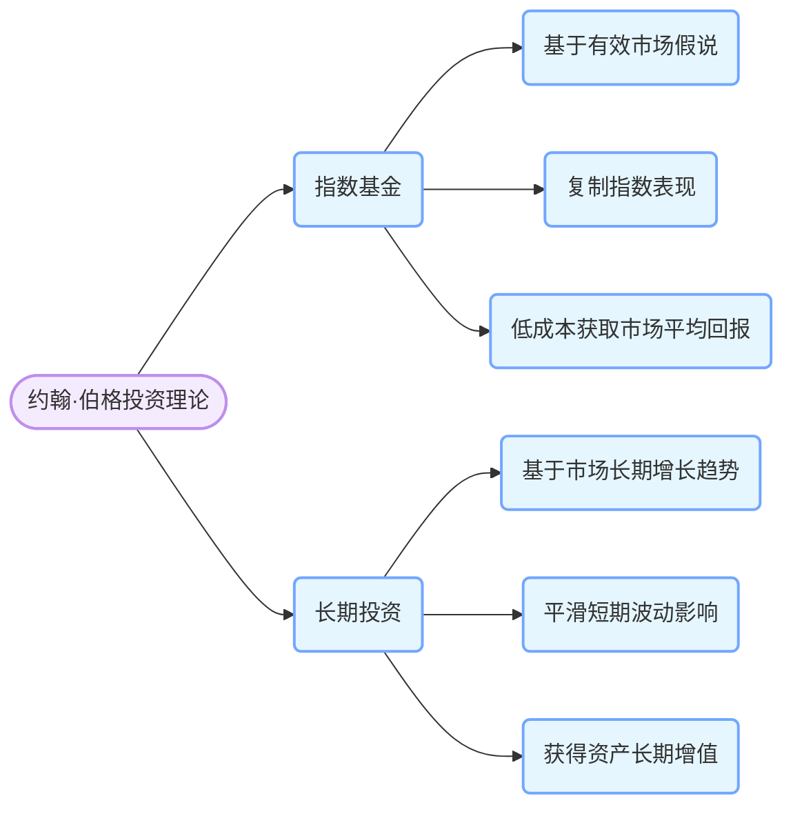

# 约翰·伯格的投资者行为分析

> 关键词：约翰·伯格、投资者行为、投资理念、指数基金、长期投资

> 摘要：本文深入剖析约翰·伯格的投资者行为分析理论。约翰·伯格作为投资界的传奇人物，其理念对投资者行为产生了深远影响。文章首先介绍背景信息，包括目的、预期读者等。接着阐述核心概念，如指数基金、长期投资等及其联系。详细讲解核心算法原理及操作步骤，通过数学模型和公式进行理论支撑，并举例说明。通过项目实战展示实际应用，分析常见的投资者行为案例。探讨实际应用场景，推荐相关工具和资源，最后总结未来发展趋势与挑战，解答常见问题并提供扩展阅读与参考资料，旨在帮助投资者更好地理解约翰·伯格的理念，优化自身投资行为。

## 1. 背景介绍 
### 1.1 目的和范围
本文的目的在于全面、深入地分析约翰·伯格的投资者行为分析理论。通过对其理论的剖析，帮助投资者理解如何在投资过程中做出更明智的决策，避免常见的投资误区。范围涵盖约翰·伯格提出的核心投资理念，如指数基金投资、长期投资策略等，并探讨这些理念如何影响投资者的行为和决策过程。同时，会结合实际案例和数据，展示这些理论在现实投资中的应用和效果。

### 1.2 预期读者
预期读者包括各类投资者，无论是初涉投资领域的新手，还是有一定投资经验的专业人士。对于新手投资者，本文可以作为了解投资基本理念和正确投资行为的入门指南；对于专业投资者，能够从约翰·伯格的独特视角中获取新的思路和启发，进一步优化投资策略。此外，金融专业的学生、研究人员以及对投资行为学感兴趣的人士也可以从本文中获得有价值的信息。

### 1.3 文档结构概述
本文将按照以下结构展开：首先介绍核心概念，明确约翰·伯格投资理论中的关键概念及其相互联系；接着详细讲解核心算法原理和具体操作步骤，通过Python代码进行阐述；引入数学模型和公式，对理论进行量化分析，并举例说明；进行项目实战，展示实际案例和代码实现；探讨实际应用场景，分析这些理论在不同市场环境下的应用；推荐相关的工具和资源，帮助读者进一步学习和实践；总结未来发展趋势与挑战，对投资领域的发展进行展望；最后提供附录，解答常见问题，并列出扩展阅读和参考资料。

### 1.4 术语表
#### 1.4.1 核心术语定义
- **指数基金**：是一种按照特定指数（如沪深300指数、标普500指数等）的成分股组成及权重进行投资的基金产品。它通过复制指数的表现，力求获得与指数相近的投资回报。
- **长期投资**：指投资者将资金投入市场，并持有较长时间（通常为数年甚至数十年），以获取资产的长期增值。长期投资强调忽略短期市场波动，注重资产的长期增长潜力。
- **有效市场假说**：该假说认为在有效市场中，资产价格已经反映了所有可用的信息，投资者无法通过分析历史价格、财务报表等信息来获得超额收益。

#### 1.4.2 相关概念解释
- **主动投资**：投资者通过积极分析市场、研究公司基本面等方式，试图选择表现优于市场平均水平的投资标的，以获取超额收益。
- **被动投资**：与主动投资相对，被动投资主要通过投资指数基金等方式，跟踪市场指数的表现，不进行主动的选股和择时操作。
- **投资组合**：投资者将不同的资产（如股票、债券、基金等）按照一定的比例组合在一起，以达到分散风险、实现特定投资目标的目的。

#### 1.4.3 缩略词列表
- **ETF**：交易型开放式指数基金（Exchange Traded Fund），是一种可以在证券交易所交易的指数基金。
- **CAPM**：资本资产定价模型（Capital Asset Pricing Model），用于描述资产预期收益率与风险之间的关系。

## 2. 核心概念与联系 

### 核心概念原理
约翰·伯格的投资理论核心围绕指数基金和长期投资展开。

#### 指数基金原理
指数基金的设计基于有效市场假说。由于市场是有效的，资产价格已经反映了所有可用信息，主动投资很难持续战胜市场。因此，指数基金通过复制特定指数的成分股和权重，以较低的成本获得市场平均回报。例如，一只跟踪沪深300指数的基金，会按照沪深300指数的成分股构成和权重进行投资，其表现基本与沪深300指数一致。

#### 长期投资原理
长期投资基于市场的长期增长趋势。虽然市场在短期内会出现波动，但从长期来看，经济总体是增长的，股票市场也会随之上涨。通过长期持有资产，投资者可以平滑短期波动的影响，获得资产的长期增值。例如，过去几十年美国股票市场虽然经历了多次金融危机和市场调整，但从长期来看，整体呈现出上升趋势。

### 架构的文本示意图
```plaintext
约翰·伯格投资理论
|-- 指数基金
|   |-- 基于有效市场假说
|   |-- 复制指数表现
|   |-- 低成本获取市场平均回报
|-- 长期投资
|   |-- 基于市场长期增长趋势
|   |-- 平滑短期波动影响
|   |-- 获得资产长期增值
```

### Mermaid 流程图


## 3. 核心算法原理 & 具体操作步骤 

### 指数基金投资算法原理
指数基金投资的核心是跟踪指数的表现。假设我们要构建一个简单的指数基金，跟踪一个包含 $n$ 只股票的指数。每只股票在指数中的权重为 $w_i$（$i = 1,2,\cdots,n$），且 $\sum_{i=1}^{n} w_i = 1$。

我们可以通过以下步骤来模拟指数基金的投资：
1. 确定指数的成分股和权重。
2. 根据权重分配资金到每只股票上。
3. 定期调整投资组合，以保持与指数的权重一致。

以下是一个简单的Python代码示例，用于模拟指数基金的投资：

```python
import numpy as np

# 假设指数包含3只股票
n = 3
# 每只股票的权重
weights = np.array([0.3, 0.4, 0.3])
# 初始资金
initial_funds = 10000

# 分配资金到每只股票上
allocated_funds = initial_funds * weights

print("每只股票分配的资金：", allocated_funds)
```

### 长期投资操作步骤
1. **设定投资目标**：明确自己的投资目标，如养老、子女教育、财富增值等。根据投资目标确定投资期限和风险承受能力。
2. **选择投资标的**：根据自己的投资目标和风险承受能力，选择适合的投资标的。对于长期投资，指数基金是一个不错的选择。
3. **定期投入资金**：采用定期定额投资的方式，如每月固定投入一定金额的资金。这样可以避免因市场波动而做出错误的投资决策。
4. **忽略短期波动**：在投资过程中，要忽略短期市场波动，坚持长期投资策略。不要因为市场的短期下跌而恐慌卖出，也不要因为市场的短期上涨而盲目追高。
5. **定期调整投资组合**：根据市场情况和自己的投资目标，定期调整投资组合的比例。例如，随着年龄的增长，逐渐降低股票投资的比例，增加债券投资的比例。

以下是一个简单的Python代码示例，用于模拟定期定额投资：

```python
import matplotlib.pyplot as plt

# 初始资金
initial_funds = 0
# 每月投入资金
monthly_investment = 1000
# 投资期限（月）
investment_period = 120
# 年化收益率
annual_return_rate = 0.08

# 计算每月收益率
monthly_return_rate = (1 + annual_return_rate) ** (1/12) - 1

# 记录每月资产价值
asset_values = []
current_asset = initial_funds

for i in range(investment_period):
    # 投入资金
    current_asset += monthly_investment
    # 资产增值
    current_asset *= (1 + monthly_return_rate)
    asset_values.append(current_asset)

# 绘制资产价值变化曲线
plt.plot(range(1, investment_period + 1), asset_values)
plt.xlabel('Month')
plt.ylabel('Asset Value')
plt.title('Regular Investment Simulation')
plt.show()
```

## 4. 数学模型和公式 & 详细讲解 & 举例说明 

### 资本资产定价模型（CAPM）
资本资产定价模型用于描述资产预期收益率与风险之间的关系。其公式为：

$$E(R_i) = R_f + \beta_i [E(R_m) - R_f]$$

其中：
- $E(R_i)$ 是资产 $i$ 的预期收益率；
- $R_f$ 是无风险收益率，通常可以用国债收益率来近似表示；
- $\beta_i$ 是资产 $i$ 的贝塔系数，用于衡量资产 $i$ 的系统性风险；
- $E(R_m)$ 是市场组合的预期收益率。

### 详细讲解
贝塔系数 $\beta_i$ 反映了资产 $i$ 的收益率对市场组合收益率变动的敏感性。当 $\beta_i > 1$ 时，资产 $i$ 的波动幅度大于市场组合；当 $\beta_i < 1$ 时，资产 $i$ 的波动幅度小于市场组合；当 $\beta_i = 1$ 时，资产 $i$ 的波动幅度与市场组合相同。

资本资产定价模型的核心思想是，资产的预期收益率由无风险收益率和风险溢价两部分组成。风险溢价是对投资者承担系统性风险的补偿，与资产的贝塔系数成正比。

### 举例说明
假设无风险收益率 $R_f = 3\%$，市场组合的预期收益率 $E(R_m) = 10\%$，某股票的贝塔系数 $\beta = 1.2$。根据资本资产定价模型，该股票的预期收益率为：

$$E(R) = 0.03 + 1.2\times(0.1 - 0.03) = 0.114 = 11.4\%$$

这意味着投资者投资该股票，预期可以获得 $11.4\%$ 的收益率。如果该股票的实际收益率低于 $11.4\%$，则说明该股票的表现不如预期，可能存在高估的情况；如果实际收益率高于 $11.4\%$，则说明该股票的表现优于预期，可能存在低估的情况。

### 投资组合的预期收益率和风险
假设投资组合由 $n$ 种资产组成，每种资产的权重为 $w_i$（$i = 1,2,\cdots,n$），预期收益率为 $E(R_i)$，则投资组合的预期收益率 $E(R_p)$ 为：

$$E(R_p) = \sum_{i=1}^{n} w_i E(R_i)$$

投资组合的风险可以用方差 $\sigma_p^2$ 来衡量，其公式为：

$$\sigma_p^2 = \sum_{i=1}^{n} \sum_{j=1}^{n} w_i w_j \sigma_{ij}$$

其中，$\sigma_{ij}$ 是资产 $i$ 和资产 $j$ 的协方差。

### 举例说明
假设投资组合由两种资产组成，资产 A 的权重 $w_A = 0.6$，预期收益率 $E(R_A) = 12\%$，标准差 $\sigma_A = 0.2$；资产 B 的权重 $w_B = 0.4$，预期收益率 $E(R_B) = 8\%$，标准差 $\sigma_B = 0.15$，资产 A 和资产 B 的相关系数 $\rho_{AB} = 0.3$。

首先计算协方差 $\sigma_{AB}$：

$$\sigma_{AB} = \rho_{AB} \sigma_A \sigma_B = 0.3\times0.2\times0.15 = 0.009$$

然后计算投资组合的预期收益率 $E(R_p)$：

$$E(R_p) = w_A E(R_A) + w_B E(R_B) = 0.6\times0.12 + 0.4\times0.08 = 0.104 = 10.4\%$$

最后计算投资组合的方差 $\sigma_p^2$：

$$\sigma_p^2 = w_A^2 \sigma_A^2 + w_B^2 \sigma_B^2 + 2 w_A w_B \sigma_{AB}$$
$$= 0.6^2\times0.2^2 + 0.4^2\times0.15^2 + 2\times0.6\times0.4\times0.009$$
$$= 0.0144 + 0.0036 + 0.00432 = 0.02232$$

投资组合的标准差 $\sigma_p = \sqrt{0.02232} \approx 0.1494$。

## 5. 项目实战：代码实际案例和详细解释说明 

### 5.1  开发环境搭建
在进行投资分析的项目实战时，我们可以使用Python作为开发语言。以下是搭建开发环境的步骤：

1. **安装Python**：从Python官方网站（https://www.python.org/downloads/）下载并安装Python 3.x版本。
2. **安装必要的库**：我们需要安装一些常用的Python库，如`pandas`用于数据处理，`numpy`用于数值计算，`matplotlib`用于数据可视化。可以使用以下命令进行安装：

```sh
pip install pandas numpy matplotlib
```

### 5.2  源代码详细实现和代码解读

#### 模拟指数基金投资组合的构建
```python
import pandas as pd
import numpy as np

# 假设指数包含5只股票
n = 5
# 每只股票的权重
weights = np.array([0.2, 0.2, 0.2, 0.2, 0.2])
# 每只股票的初始价格
initial_prices = np.array([100, 120, 90, 110, 130])
# 初始资金
initial_funds = 10000

# 计算每只股票的购买数量
shares = (initial_funds * weights) / initial_prices

# 创建DataFrame存储股票信息
stocks = pd.DataFrame({
    'Stock': ['A', 'B', 'C', 'D', 'E'],
    'Weight': weights,
    'Initial Price': initial_prices,
    'Shares': shares
})

print(stocks)
```

**代码解读**：
1. 首先，我们定义了指数包含的股票数量`n`和每只股票的权重`weights`。
2. 然后，设定每只股票的初始价格`initial_prices`和初始资金`initial_funds`。
3. 通过计算`(initial_funds * weights) / initial_prices`得到每只股票的购买数量`shares`。
4. 最后，使用`pandas`的`DataFrame`将股票信息存储起来并打印输出。

#### 模拟长期投资过程
```python
import matplotlib.pyplot as plt
import numpy as np

# 初始资金
initial_funds = 0
# 每月投入资金
monthly_investment = 1000
# 投资期限（月）
investment_period = 360
# 年化收益率（模拟市场波动）
annual_return_rates = np.random.normal(0.08, 0.2, investment_period)

# 记录每月资产价值
asset_values = []
current_asset = initial_funds

for i in range(investment_period):
    # 投入资金
    current_asset += monthly_investment
    # 计算当月收益率
    monthly_return_rate = (1 + annual_return_rates[i]) ** (1/12) - 1
    # 资产增值
    current_asset *= (1 + monthly_return_rate)
    asset_values.append(current_asset)

# 绘制资产价值变化曲线
plt.plot(range(1, investment_period + 1), asset_values)
plt.xlabel('Month')
plt.ylabel('Asset Value')
plt.title('Long-term Investment Simulation')
plt.show()
```

**代码解读**：
1. 定义初始资金`initial_funds`、每月投入资金`monthly_investment`和投资期限`investment_period`。
2. 使用`np.random.normal`生成模拟的年化收益率序列`annual_return_rates`，模拟市场的波动。
3. 在循环中，每月投入资金并根据当月收益率计算资产增值，将每月的资产价值记录在`asset_values`列表中。
4. 最后，使用`matplotlib`绘制资产价值随时间变化的曲线。

### 5.3  代码解读与分析
#### 指数基金投资组合构建代码分析
通过构建指数基金投资组合的代码，我们可以清晰地看到如何根据指数成分股的权重和初始资金来确定每只股票的购买数量。这种方法可以确保投资组合的权重与指数一致，从而实现对指数的跟踪。

#### 长期投资过程代码分析
在长期投资过程的模拟代码中，我们引入了随机的年化收益率来模拟市场的波动。这使得模拟结果更加接近真实的投资环境。通过定期投入资金和资产增值的计算，我们可以观察到长期投资的效果。从模拟结果的曲线可以看出，尽管市场存在波动，但长期来看资产价值总体呈现上升趋势，这体现了长期投资的优势。

## 6. 实际应用场景 
### 个人投资者的养老规划
对于个人投资者来说，养老规划是一个重要的投资目标。根据约翰·伯格的理念，长期投资指数基金是一个不错的选择。投资者可以每月定期定额投资指数基金，忽略短期市场波动，坚持长期投资。随着时间的推移，资产会不断增值，为养老生活提供保障。例如，一位30岁的投资者每月投资1000元到沪深300指数基金，假设年化收益率为8%，到60岁时，他的资产将达到约160万元。

### 机构投资者的资产配置
机构投资者如保险公司、养老金管理机构等，需要进行大规模的资产配置。指数基金由于其低成本、分散风险的特点，成为机构投资者资产配置的重要组成部分。机构投资者可以根据自身的风险偏好和投资目标，将一定比例的资金投资于不同的指数基金，如股票指数基金、债券指数基金等，以实现资产的长期稳定增值。

### 教育基金规划
家长为子女的教育费用进行规划时，也可以采用长期投资指数基金的策略。从孩子出生开始，每月定期投入一定金额的资金到指数基金中，经过十几年的积累，资金可以满足孩子上大学等教育费用的需求。这种投资方式不仅可以获得资产的增值，还可以避免因市场波动而导致的投资损失。

## 7. 工具和资源推荐
### 7.1 学习资源推荐
#### 7.1.1 书籍推荐
- 《共同基金常识》（*The Little Book of Common Sense Investing*）：约翰·伯格的经典著作，详细阐述了指数基金投资的理念和方法。
- 《聪明的投资者》（*The Intelligent Investor*）：本杰明·格雷厄姆的著作，被誉为投资界的圣经，对价值投资和投资者行为进行了深入探讨。
- 《漫步华尔街》（*A Random Walk Down Wall Street*）：伯顿·马尔基尔的著作，介绍了有效市场假说和指数基金投资的优势。

#### 7.1.2 在线课程
- Coursera上的“投资学原理”课程：由知名高校教授授课，系统介绍投资学的基本原理和方法。
- edX上的“金融市场”课程：涵盖金融市场的各个方面，包括股票市场、债券市场等，对投资者了解市场有很大帮助。

#### 7.1.3 技术博客和网站
- 雪球网：国内知名的投资社区，提供丰富的投资资讯和投资者交流平台。
- 价值投资网：专注于价值投资理念的传播，有很多关于投资分析和研究的文章。

### 7.2 开发工具框架推荐
#### 7.2.1 IDE和编辑器
- PyCharm：功能强大的Python集成开发环境，提供代码编辑、调试、版本控制等功能。
- Jupyter Notebook：交互式的开发环境，适合进行数据分析和可视化，方便展示代码和结果。

#### 7.2.2 调试和性能分析工具
- `pdb`：Python自带的调试工具，可以帮助开发者调试代码，定位问题。
- `cProfile`：Python的性能分析工具，可以分析代码的运行时间和函数调用情况，帮助优化代码性能。

#### 7.2.3 相关框架和库
- `pandas`：用于数据处理和分析的Python库，提供了丰富的数据结构和函数。
- `numpy`：用于数值计算的Python库，提供了高效的数组操作和数学函数。
- `matplotlib`：用于数据可视化的Python库，可以绘制各种类型的图表。

### 7.3 相关论文著作推荐
#### 7.3.1 经典论文
- 《有效资本市场：理论与实证研究回顾》（*Efficient Capital Markets: A Review of Theory and Empirical Work*）：尤金·法玛的经典论文，提出了有效市场假说。
- 《资本资产定价：风险条件下的市场均衡理论》（*Capital Asset Prices: A Theory of Market Equilibrium under Conditions of Risk*）：威廉·夏普的论文，提出了资本资产定价模型。

#### 7.3.2 最新研究成果
- 近年来关于行为金融学的研究成果，探讨投资者的心理和行为对投资决策的影响。
- 关于指数基金发展和创新的研究，如Smart Beta指数基金等。

#### 7.3.3 应用案例分析
- 分析国内外机构投资者使用指数基金进行资产配置的成功案例，了解其投资策略和效果。
- 研究个人投资者通过长期投资指数基金实现财富增值的案例，总结经验教训。

## 8. 总结：未来发展趋势与挑战
### 未来发展趋势
#### 指数基金市场持续增长
随着投资者对指数基金优势的认识不断提高，指数基金市场将继续保持增长。越来越多的投资者会选择指数基金作为长期投资的工具，尤其是在市场有效性不断提高的情况下，主动投资战胜市场的难度越来越大，指数基金的吸引力将进一步增强。

#### 智能化投资服务兴起
随着人工智能和大数据技术的发展，智能化投资服务将成为未来的发展趋势。智能投顾平台可以根据投资者的风险偏好、投资目标等因素，为投资者提供个性化的投资组合建议。同时，利用大数据分析市场趋势和投资者行为，帮助投资者做出更明智的投资决策。

#### 可持续投资理念深入人心
投资者对环境、社会和治理（ESG）因素的关注度不断提高，可持续投资理念将深入人心。未来，指数基金可能会更多地纳入符合ESG标准的企业，满足投资者对社会责任投资的需求。

### 挑战
#### 市场竞争加剧
随着指数基金市场的增长，市场竞争将加剧。基金公司需要不断降低成本、提高服务质量，以吸引更多的投资者。同时，市场上可能会出现更多的指数基金产品，投资者需要在众多产品中做出选择，增加了投资决策的难度。

#### 技术风险
智能化投资服务依赖于人工智能和大数据技术，这些技术存在一定的风险。例如，算法模型可能存在偏差，导致投资建议不准确；数据安全和隐私问题也需要引起重视，防止投资者信息泄露。

#### 市场波动风险
尽管长期投资可以平滑市场波动的影响，但市场波动仍然是投资面临的重要风险。全球经济形势、政治局势等因素都可能导致市场大幅波动，投资者需要具备一定的风险承受能力和应对市场波动的能力。

## 9. 附录：常见问题与解答
### 问题1：指数基金一定能获得市场平均回报吗？
答：理论上，指数基金通过复制指数的表现，力求获得与指数相近的回报。但在实际操作中，由于基金的管理费用、跟踪误差等因素的影响，指数基金的实际回报可能会略低于市场平均回报。不过，总体来说，指数基金的表现通常会接近市场平均水平。

### 问题2：长期投资是否意味着一直持有，不进行任何调整？
答：长期投资并不意味着一直持有，不进行任何调整。投资者需要根据市场情况和自己的投资目标，定期调整投资组合的比例。例如，随着年龄的增长，投资者的风险承受能力会降低，需要逐渐降低股票投资的比例，增加债券投资的比例。同时，如果市场出现重大变化，也需要对投资组合进行适当调整。

### 问题3：智能投顾平台的投资建议可靠吗？
答：智能投顾平台的投资建议是基于算法模型和数据分析得出的，具有一定的科学性和客观性。但算法模型可能存在局限性，不能完全预测市场的变化。因此，投资者在参考智能投顾平台的投资建议时，还需要结合自己的投资经验和风险承受能力，进行综合判断。

### 问题4：可持续投资是否会影响投资回报？
答：可持续投资并不一定会影响投资回报。一些研究表明，符合ESG标准的企业通常具有更好的风险管理能力和长期发展潜力，其股票表现可能并不逊色于传统企业。同时，随着投资者对可持续投资的需求增加，符合ESG标准的企业可能会获得更多的资金支持，从而推动其股价上涨。

## 10. 扩展阅读 & 参考资料
### 扩展阅读
- 《行为金融学》：深入探讨投资者的心理和行为对投资决策的影响。
- 《金融炼金术》（*The Alchemy of Finance*）：乔治·索罗斯的著作，介绍了他的投资哲学和实践经验。

### 参考资料
- John C. Bogle. *The Little Book of Common Sense Investing*. Wiley, 2007.
- Eugene F. Fama. *Efficient Capital Markets: A Review of Theory and Empirical Work*. Journal of Finance, 1970.
- William F. Sharpe. *Capital Asset Prices: A Theory of Market Equilibrium under Conditions of Risk*. Journal of Finance, 1964.