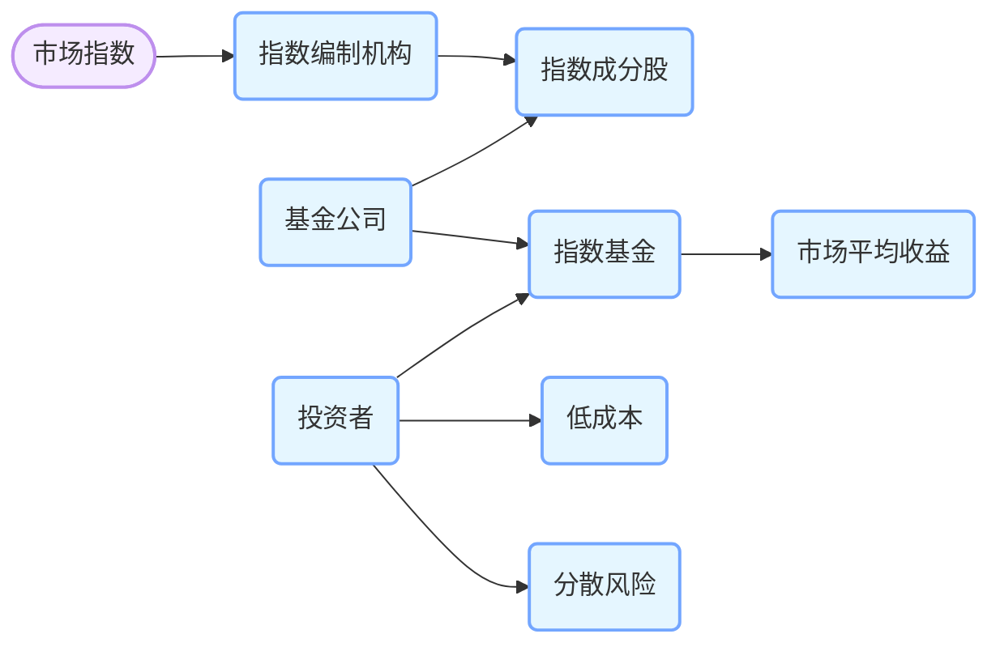

# 约翰·伯格的指数化革命

> 关键词：约翰·伯格、指数化革命、指数基金、投资理念、金融市场

> 摘要：本文深入探讨了约翰·伯格所引发的指数化革命。约翰·伯格是金融投资领域的传奇人物，他通过创立先锋集团并推出全球首只面向个人投资者的指数基金，彻底改变了投资行业的格局。文章首先介绍了这场革命的背景，包括当时金融市场的状况以及伯格理念诞生的土壤。接着阐述了指数化投资的核心概念、原理和架构，并通过Python代码展示相关算法原理。同时，运用数学模型和公式对指数化投资进行详细讲解和举例说明。在项目实战部分，给出了实际案例和代码解释。之后探讨了指数化投资的实际应用场景，推荐了相关的学习资源、开发工具框架以及论文著作。最后总结了指数化革命的未来发展趋势与挑战，并对常见问题进行解答，还提供了扩展阅读和参考资料。

## 1. 背景介绍 
### 1.1 目的和范围
本文的目的在于全面剖析约翰·伯格发起的指数化革命，深入理解这场革命对金融投资行业产生的深远影响。我们将探讨指数化投资的核心概念、原理、算法，通过实际案例展示其应用，并分析其未来发展趋势。范围涵盖金融投资领域，包括指数基金的起源、发展、运作机制以及在不同市场环境下的表现。

### 1.2 预期读者
本文预期读者包括金融投资领域的从业者，如基金经理、投资顾问、分析师等，他们可以从本文中深入了解指数化投资的理论和实践，为其工作提供参考。同时，对于普通投资者，尤其是对指数基金感兴趣的个人，本文能够帮助他们更好地理解指数化投资的原理和优势，做出更明智的投资决策。此外，金融专业的学生和研究人员也可以从本文中获取关于指数化投资的系统知识和研究思路。

### 1.3 文档结构概述
本文将按照以下结构展开：首先介绍指数化革命的背景，包括相关术语的定义和解释。接着阐述指数化投资的核心概念、原理和架构，通过文本示意图和Mermaid流程图进行直观展示。然后详细讲解核心算法原理，并给出Python源代码示例。之后运用数学模型和公式对指数化投资进行分析，并举例说明。在项目实战部分，将展示代码实际案例并进行详细解释。随后探讨指数化投资的实际应用场景。推荐相关的学习资源、开发工具框架和论文著作。最后总结未来发展趋势与挑战，解答常见问题，并提供扩展阅读和参考资料。

### 1.4 术语表
#### 1.4.1 核心术语定义
- **指数基金**：是一种按照特定指数（如沪深300指数、标普500指数等）的成分股组成及权重进行投资的基金，旨在复制指数的表现。
- **指数化投资**：通过投资指数基金，以获取市场平均收益为目标的投资策略，避免了主动选股和择时带来的风险。
- **先锋集团**：由约翰·伯格创立的全球知名基金管理公司，以推广指数化投资而闻名。
- **市场有效性**：指市场价格能够及时、准确地反映所有可用信息的程度。有效市场假说认为，在强有效市场中，主动管理无法持续战胜市场。

#### 1.4.2 相关概念解释
- **主动投资**：基金经理通过研究、分析和判断，主动选择投资标的和时机，试图战胜市场平均收益的投资方式。与指数化投资相对。
- **被动投资**：即指数化投资，不进行主动的选股和择时，而是跟随指数进行投资，以获取市场平均回报。
- **跟踪误差**：指数基金的收益率与所跟踪指数收益率之间的差异，反映了基金复制指数的准确程度。

#### 1.4.3 缩略词列表
- **ETF**：交易型开放式指数基金（Exchange Traded Fund），是一种在证券交易所上市交易的、基金份额可变的开放式指数基金。
- **SPDR**：标准普尔存托凭证（Standard & Poor's Depositary Receipts），是一种基于标普500指数的ETF。

## 2. 核心概念与联系 
### 指数化投资的核心概念
指数化投资的核心思想是基于市场有效性假说。在一个有效的市场中，股票价格已经反映了所有可用的信息，因此很难通过主动选股和择时来持续战胜市场。指数基金通过复制特定指数的成分股及其权重，以获取市场的平均收益。

例如，标普500指数是美国股市的重要指标，它包含了美国500家大型上市公司的股票。一只跟踪标普500指数的基金，会按照标普500指数的成分股构成和权重，购买相应的股票，从而实现对指数的跟踪。

### 指数化投资的原理和架构
指数化投资的原理基于以下几点：
1. **分散投资**：指数基金投资于一篮子股票，分散了个别股票的风险。例如，沪深300指数包含了沪深两市300只具有代表性的股票，投资于沪深300指数基金就相当于同时投资了这300只股票，降低了单一股票波动对投资组合的影响。
2. **低成本**：由于指数基金不需要进行大量的研究和分析来选股和择时，其管理费用相对较低。相比之下，主动管理型基金需要支付高额的研究费用和基金经理的薪酬，这会降低基金的实际收益。
3. **市场平均收益**：在长期投资中，市场平均收益是一个较为稳定的收益水平。指数基金通过跟踪指数，能够获得市场的平均收益，避免了主动投资可能带来的跑输市场的风险。

以下是指数化投资的架构示意图：



## 3. 核心算法原理 & 具体操作步骤 
### 核心算法原理
指数基金的核心算法是跟踪指数的成分股及其权重。假设我们有一个简单的指数，包含三只股票A、B、C，其权重分别为0.3、0.5、0.2。指数基金需要按照这个权重来配置资金。

以下是一个用Python实现的简单示例，模拟指数基金的资金配置：

```python
# 指数成分股及其权重
stocks = ['A', 'B', 'C']
weights = [0.3, 0.5, 0.2]

# 总投资金额
total_investment = 10000

# 计算每只股票的投资金额
investment_amounts = [weight * total_investment for weight in weights]

# 输出结果
for i in range(len(stocks)):
    print(f"投资股票 {stocks[i]} 的金额为: {investment_amounts[i]} 元")
```

### 具体操作步骤
1. **选择指数**：基金公司首先需要选择一个合适的指数作为跟踪目标。这需要考虑指数的代表性、市场认可度、流动性等因素。例如，先锋集团的标普500指数基金选择跟踪标普500指数，因为该指数是美国股市的重要代表。
2. **确定成分股和权重**：根据所选指数的编制规则，确定指数的成分股及其权重。指数编制机构会定期调整指数的成分股和权重，基金公司需要及时跟进这些调整。
3. **资金配置**：按照成分股的权重，将资金分配到各个成分股上。在实际操作中，还需要考虑交易成本、流动性等因素，以确保资金配置的有效性。
4. **定期调整**：为了保持对指数的跟踪，基金公司需要定期对投资组合进行调整。这包括根据指数成分股的调整进行相应的买卖操作，以及根据市场情况对权重进行微调。

## 4. 数学模型和公式 & 详细讲解 & 举例说明 
### 跟踪误差的数学模型
跟踪误差是衡量指数基金跟踪指数效果的重要指标。其计算公式为：

$$TE = \sqrt{\frac{1}{n - 1} \sum_{i = 1}^{n} (R_{p,i} - R_{b,i})^2}$$

其中，$TE$ 表示跟踪误差，$n$ 是样本数量，$R_{p,i}$ 是指数基金在第 $i$ 期的收益率，$R_{b,i}$ 是所跟踪指数在第 $i$ 期的收益率。

### 详细讲解
跟踪误差反映了指数基金的收益率与所跟踪指数收益率之间的差异程度。跟踪误差越小，说明基金对指数的跟踪效果越好。跟踪误差的产生主要源于以下几个方面：
1. **交易成本**：基金在买卖成分股时需要支付交易费用，这会影响基金的实际收益。
2. **成分股调整**：指数成分股的定期调整可能导致基金无法及时跟进，从而产生跟踪误差。
3. **现金管理**：基金可能会持有一定比例的现金，以应对投资者的赎回需求。现金的存在会影响基金的收益率，从而产生跟踪误差。

### 举例说明
假设我们有一个跟踪沪深300指数的基金，在过去10个交易日的收益率数据如下：

| 日期 | 基金收益率 ($R_{p}$) | 沪深300指数收益率 ($R_{b}$) |
| ---- | ---- | ---- |
| 1 | 0.01 | 0.012 |
| 2 | -0.005 | -0.003 |
| 3 | 0.008 | 0.007 |
| 4 | -0.01 | -0.009 |
| 5 | 0.002 | 0.003 |
| 6 | 0.006 | 0.005 |
| 7 | -0.003 | -0.002 |
| 8 | 0.004 | 0.005 |
| 9 | -0.001 | -0.001 |
| 10 | 0.007 | 0.006 |

首先，计算每期的收益率差值 $(R_{p,i} - R_{b,i})$：

| 日期 | 收益率差值 |
| ---- | ---- |
| 1 | -0.002 |
| 2 | -0.002 |
| 3 | 0.001 |
| 4 | -0.001 |
| 5 | -0.001 |
| 6 | 0.001 |
| 7 | -0.001 |
| 8 | -0.001 |
| 9 | 0 |
| 10 | 0.001 |

然后，计算差值的平方和：

$$\sum_{i = 1}^{10} (R_{p,i} - R_{b,i})^2 = (-0.002)^2 + (-0.002)^2 + 0.001^2 + (-0.001)^2 + (-0.001)^2 + 0.001^2 + (-0.001)^2 + (-0.001)^2 + 0^2 + 0.001^2 = 0.000014$$

最后，根据公式计算跟踪误差：

$$TE = \sqrt{\frac{1}{10 - 1} \times 0.000014} \approx 0.00125$$

这意味着该基金在过去10个交易日的跟踪误差约为0.125%。

## 5. 项目实战：代码实际案例和详细解释说明 
### 5.1  开发环境搭建
为了实现一个简单的指数基金模拟项目，我们需要搭建以下开发环境：
1. **Python环境**：建议使用Python 3.7及以上版本。可以从Python官方网站（https://www.python.org/downloads/）下载并安装。
2. **开发工具**：可以使用PyCharm、Jupyter Notebook等开发工具。PyCharm是一个功能强大的Python集成开发环境，适合大型项目的开发；Jupyter Notebook则更适合交互式编程和数据分析。
3. **必要的库**：我们需要安装`pandas`、`numpy`等库，用于数据处理和分析。可以使用以下命令进行安装：

```sh
pip install pandas numpy
```

### 5.2  源代码详细实现和代码解读
以下是一个简单的指数基金模拟项目的代码示例：

```python
import pandas as pd
import numpy as np

# 模拟指数成分股及其权重
stocks = ['A', 'B', 'C']
weights = [0.3, 0.5, 0.2]

# 模拟初始投资金额
initial_investment = 10000

# 模拟股票价格数据
prices = pd.DataFrame({
    'A': [100, 102, 105, 103, 106],
    'B': [200, 205, 203, 206, 208],
    'C': [150, 152, 155, 153, 156]
})

# 计算每只股票的初始投资数量
initial_quantities = [initial_investment * weight / prices[stock][0] for stock, weight in zip(stocks, weights)]

# 计算每日投资组合价值
portfolio_values = []
for i in range(len(prices)):
    value = sum([quantity * prices[stock][i] for stock, quantity in zip(stocks, initial_quantities)])
    portfolio_values.append(value)

# 计算每日收益率
returns = np.diff(portfolio_values) / portfolio_values[:-1]

# 输出结果
print("每日投资组合价值:")
print(portfolio_values)
print("每日收益率:")
print(returns)
```

### 代码解读与分析
1. **模拟指数成分股及其权重**：我们定义了三只股票`A`、`B`、`C`及其权重`0.3`、`0.5`、`0.2`。
2. **模拟初始投资金额**：设定初始投资金额为10000元。
3. **模拟股票价格数据**：使用`pandas`的`DataFrame`来模拟三只股票在5个交易日的价格数据。
4. **计算每只股票的初始投资数量**：根据权重和初始投资金额，计算每只股票的初始投资数量。
5. **计算每日投资组合价值**：通过遍历每个交易日，计算投资组合在该日的价值。
6. **计算每日收益率**：使用`numpy`的`diff`函数计算相邻两日投资组合价值的差值，再除以昨日的投资组合价值，得到每日收益率。
7. **输出结果**：打印每日投资组合价值和每日收益率。

通过这个简单的示例，我们可以模拟指数基金的投资过程，并计算其收益率。

## 6. 实际应用场景 
### 个人投资者的长期投资
对于个人投资者来说，指数基金是一种非常适合长期投资的工具。由于指数基金具有低成本、分散风险、获取市场平均收益的特点，个人投资者可以通过定期定额投资指数基金，实现资产的长期增值。例如，一个年轻的上班族可以每月拿出一部分工资投资于沪深300指数基金，经过多年的积累，有望获得较为可观的收益。

### 机构投资者的资产配置
机构投资者如养老基金、保险公司等，通常需要进行大规模的资产配置。指数基金可以作为其资产配置的重要组成部分，用于获取市场的基本收益，同时降低投资组合的风险。例如，养老基金可以将一部分资金投资于全球主要市场的指数基金，以实现资产的多元化和长期稳定增值。

### 投资组合的对冲工具
指数基金还可以作为投资组合的对冲工具。当投资者持有大量的主动管理型基金或个别股票时，可以通过投资指数基金来对冲市场风险。例如，如果投资者担心市场整体下跌，可以适当增加指数基金的投资比例，以平衡投资组合的风险。

## 7. 工具和资源推荐
### 7.1 学习资源推荐
#### 7.1.1 书籍推荐
- 《漫步华尔街》（A Random Walk Down Wall Street）：作者是伯顿·马尔基尔（Burton Malkiel），这本书详细介绍了有效市场假说和指数化投资的理念，是投资领域的经典之作。
- 《聪明的投资者》（The Intelligent Investor）：作者是本杰明·格雷厄姆（Benjamin Graham），虽然这本书主要强调价值投资，但也对指数化投资有一定的论述，对于理解投资的基本原理非常有帮助。
- 《约翰·伯格的投资50年》（John Bogle on Investing: The First 50 Years）：这本书全面介绍了约翰·伯格的投资理念和先锋集团的发展历程，是了解指数化革命的重要读物。

#### 7.1.2 在线课程
- Coursera上的“投资学原理”（Principles of Investing）课程：由宾夕法尼亚大学的教授授课，涵盖了投资的基本概念、资产定价、投资组合管理等内容，其中也包括指数化投资的相关知识。
- edX上的“金融市场”（Financial Markets）课程：由耶鲁大学的教授授课，深入讲解了金融市场的运作机制和投资策略，对指数化投资有详细的分析。

#### 7.1.3 技术博客和网站
- 晨星网（Morningstar）：提供基金评级、分析和研究报告，是投资者了解指数基金的重要信息来源。
- 雪球网：一个投资者交流社区，有很多关于指数化投资的讨论和分享，可以帮助投资者获取不同的观点和经验。

### 7.2 开发工具框架推荐
#### 7.2.1 IDE和编辑器
- PyCharm：功能强大的Python集成开发环境，适合专业的Python开发人员。它提供了代码自动补全、调试、版本控制等功能，提高开发效率。
- Jupyter Notebook：交互式编程环境，非常适合数据分析和可视化。可以在浏览器中直接编写和运行代码，方便进行实验和探索。

#### 7.2.2 调试和性能分析工具
- `pdb`：Python自带的调试器，可以帮助开发者定位和解决代码中的问题。通过设置断点、单步执行等功能，深入了解代码的执行过程。
- `cProfile`：Python的性能分析工具，可以分析代码的运行时间和函数调用次数，帮助开发者找出性能瓶颈。

#### 7.2.3 相关框架和库
- `pandas`：强大的数据处理和分析库，提供了高效的数据结构和数据操作方法，适用于处理金融数据。
- `numpy`：Python的数值计算库，提供了高效的数组和矩阵运算功能，是很多金融计算的基础。
- `matplotlib`：用于数据可视化的库，可以绘制各种类型的图表，帮助开发者直观地展示数据和分析结果。

### 7.3 相关论文著作推荐
#### 7.3.1 经典论文
- “Efficient Capital Markets: A Review of Theory and Empirical Work”（有效资本市场：理论与实证研究综述）：作者是尤金·法玛（Eugene F. Fama），这篇论文奠定了有效市场假说的基础，对指数化投资的发展产生了深远影响。
- “The Arithmetic of Active Management”（主动管理的算术）：作者是威廉·夏普（William F. Sharpe），通过数学推导证明了在市场中，主动管理型基金的平均收益必然低于市场平均收益，为指数化投资提供了理论支持。

#### 7.3.2 最新研究成果
- 一些金融学术期刊如《Journal of Finance》（金融杂志）、《Review of Financial Studies》（金融研究评论）等会发表关于指数化投资的最新研究成果，关注这些期刊可以了解该领域的前沿动态。

#### 7.3.3 应用案例分析
- 一些金融研究机构和咨询公司会发布指数化投资的应用案例分析报告，这些报告可以帮助投资者了解指数基金在不同市场环境下的表现和应用策略。

## 8. 总结：未来发展趋势与挑战
### 未来发展趋势
1. **规模持续增长**：随着投资者对指数化投资理念的认可度不断提高，指数基金的规模有望继续增长。尤其是在新兴市场，指数基金的发展空间巨大。
2. **产品创新**：未来可能会出现更多类型的指数基金，如主题指数基金、因子指数基金等。这些创新产品将满足投资者多样化的投资需求。
3. **国际化发展**：指数基金的国际化程度将不断提高，投资者可以通过投资全球不同市场的指数基金，实现资产的全球配置。

### 挑战
1. **市场竞争加剧**：随着指数基金市场的不断发展，竞争将日益激烈。基金公司需要不断降低成本、提高服务质量，以吸引投资者。
2. **跟踪误差控制**：尽管指数基金的目标是跟踪指数，但由于各种因素的影响，跟踪误差仍然存在。基金公司需要不断优化投资策略和管理方法，以降低跟踪误差。
3. **市场波动风险**：指数基金虽然分散了个别股票的风险，但仍然面临市场整体波动的风险。在市场大幅下跌时，指数基金的净值也会受到影响。

## 9. 附录：常见问题与解答
### 问题1：指数基金和主动管理型基金有什么区别？
指数基金是被动投资工具，通过复制指数的成分股及其权重来获取市场平均收益，管理费用较低；而主动管理型基金由基金经理主动选股和择时，试图战胜市场平均收益，管理费用较高。

### 问题2：指数基金一定能获得市场平均收益吗？
虽然指数基金的目标是跟踪指数，获取市场平均收益，但由于跟踪误差的存在，实际收益可能会与市场平均收益有所差异。

### 问题3：如何选择适合自己的指数基金？
投资者可以考虑以下因素：指数的代表性、基金的规模、跟踪误差、管理费用等。同时，要根据自己的投资目标和风险承受能力来选择。

### 问题4：指数基金适合短期投资吗？
指数基金更适合长期投资。短期市场波动较大，指数基金的净值也会随之波动。长期来看，市场具有向上的趋势，指数基金能够获得较为稳定的市场平均收益。

## 10. 扩展阅读 & 参考资料
### 扩展阅读
- 《金融炼金术》（The Alchemy of Finance）：作者是乔治·索罗斯（George Soros），这本书探讨了金融市场的运行机制和投资者的心理因素，对理解金融市场有很大帮助。
- 《黑天鹅》（The Black Swan）：作者是纳西姆·尼古拉斯·塔勒布（Nassim Nicholas Taleb），介绍了不可预测的重大事件对金融市场的影响，提醒投资者要关注尾部风险。

### 参考资料
- 先锋集团官方网站：https://www.vanguard.com/
- 中国证券投资基金业协会网站：https://www.amac.org.cn/
- 美国证券交易委员会网站：https://www.sec.gov/

通过以上对约翰·伯格的指数化革命的全面分析，我们可以看到这场革命对金融投资行业产生了深远的影响。指数化投资以其低成本、分散风险、获取市场平均收益的特点，成为越来越多投资者的选择。随着市场的发展和技术的进步，指数化投资有望在未来继续发挥重要作用。同时，我们也应该认识到指数化投资面临的挑战，合理运用指数基金，实现资产的保值增值。