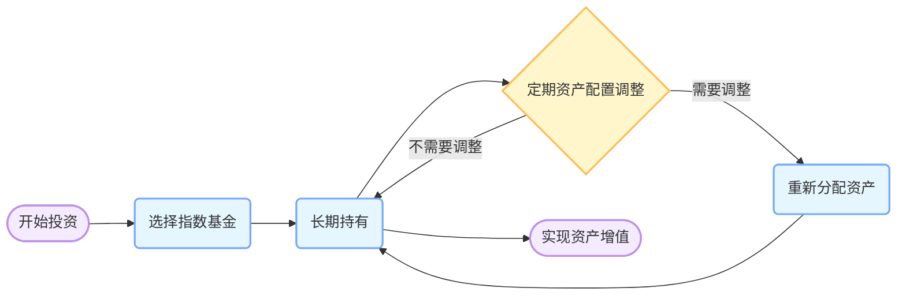

# 约翰·伯格的简单投资法则

> 关键词：约翰·伯格、简单投资法则、指数基金、长期投资、资产配置

> 摘要：本文深入探讨了约翰·伯格所提出的简单投资法则。约翰·伯格作为投资领域的传奇人物，其法则以简洁有效著称。文章首先介绍了法则提出的背景，包括目的、预期读者等。接着阐述了核心概念，如指数基金等，并给出了相关的架构示意图和流程图。详细讲解了核心算法原理及操作步骤，用数学模型和公式进行了进一步说明。通过项目实战案例展示了如何运用这些法则进行投资。分析了法则在不同场景下的实际应用，推荐了学习、开发工具和相关论文著作。最后总结了未来发展趋势与挑战，解答了常见问题，并提供了扩展阅读和参考资料，旨在帮助投资者深入理解并运用约翰·伯格的简单投资法则实现合理的资产增值。

## 1. 背景介绍 
### 1.1 目的和范围
约翰·伯格的简单投资法则旨在为广大投资者提供一种易于理解和操作的投资方式，帮助他们在复杂多变的金融市场中实现资产的稳健增长。该法则的核心思想是避免过度复杂的投资策略和频繁的交易，强调长期投资和低成本投资的重要性。本文的范围将涵盖对约翰·伯格简单投资法则的全面解读，包括其核心概念、算法原理、实际应用等方面，并通过具体的案例和数据进行详细说明。

### 1.2 预期读者
本文的预期读者包括各类投资者，无论是初涉投资领域的新手，还是有一定投资经验的专业人士。对于新手投资者来说，约翰·伯格的简单投资法则提供了一种入门级的投资方法，易于理解和实践；对于专业投资者来说，法则中的一些理念和方法也可以作为参考，帮助他们优化投资组合，降低投资风险。此外，金融从业者、研究人员等也可以从本文中获取有价值的信息，进一步深入研究投资理论和实践。

### 1.3 文档结构概述
本文将按照以下结构进行组织：首先介绍约翰·伯格简单投资法则的背景，包括目的、预期读者和文档结构概述；接着阐述核心概念与联系，通过文本示意图和 Mermaid 流程图进行说明；然后详细讲解核心算法原理和具体操作步骤，并给出 Python 源代码示例；之后介绍数学模型和公式，并进行详细讲解和举例说明；通过项目实战展示代码实际案例和详细解释；分析该法则在实际应用中的场景；推荐相关的学习资源、开发工具和论文著作；最后总结未来发展趋势与挑战，解答常见问题，并提供扩展阅读和参考资料。

### 1.4 术语表
#### 1.4.1 核心术语定义
- **指数基金**：一种按照特定指数（如沪深 300 指数、标普 500 指数等）的成分股组成及权重进行投资的基金产品。它通过复制指数的表现，为投资者提供一种低成本、广泛分散投资的方式。
- **长期投资**：指投资者将资金投入某项资产，并持有较长的时间周期，通常为数年甚至数十年。长期投资的目的是通过资产的长期增值来实现财富的积累。
- **资产配置**：指投资者根据自身的风险承受能力、投资目标等因素，将资金分配到不同类型的资产（如股票、债券、现金等）中，以达到分散风险、优化投资组合的目的。

#### 1.4.2 相关概念解释
- **被动投资**：与主动投资相对，被动投资不试图通过预测市场走势或选择个别股票来获取超额收益，而是通过跟踪市场指数来获得市场平均收益。指数基金是被动投资的典型代表。
- **复利效应**：指在投资过程中，将投资收益再投资，使得本金和收益都能产生新的收益。随着时间的推移，复利效应会使投资收益呈现指数级增长。

#### 1.4.3 缩略词列表
- **ETF**：交易型开放式指数基金（Exchange Traded Fund），是一种在交易所上市交易的、基金份额可变的开放式指数基金。
- **SPDR**：标准普尔存托凭证（Standard & Poor's Depositary Receipts），是一种跟踪标普 500 指数的 ETF。

## 2. 核心概念与联系 

### 核心概念原理
约翰·伯格简单投资法则的核心概念主要围绕指数基金、长期投资和资产配置展开。

- **指数基金**：指数基金的原理是通过复制特定指数的成分股组成和权重，实现对市场整体表现的跟踪。由于不需要基金经理进行主动的股票选择和市场时机把握，指数基金的管理费用相对较低。同时，由于广泛分散投资于指数成分股，降低了个别股票的风险，能够获得市场平均收益。

- **长期投资**：长期投资基于复利效应和市场的长期向上趋势。在长期投资过程中，短期的市场波动会被平滑，投资者可以享受到资产的长期增值。此外，长期投资还可以减少交易成本和税收负担。

- **资产配置**：资产配置的原理是根据不同资产的风险收益特征，将资金分配到不同类型的资产中，以实现风险和收益的平衡。不同资产在不同的市场环境下表现不同，通过合理的资产配置，可以降低投资组合的整体风险，提高投资的稳定性。

### 架构的文本示意图
```plaintext
              约翰·伯格简单投资法则
                    |
        +---------------------+
        |                     |
    指数基金             长期投资
        |                     |
        |                     |
    低成本投资         复利效应
        |                     |
        |                     |
    分散风险             资产增值
        |                     |
        |                     |
        +---------------------+
                    |
               资产配置
                    |
             风险收益平衡
```

### Mermaid 流程图


## 3. 核心算法原理 & 具体操作步骤 

### 核心算法原理
约翰·伯格简单投资法则的核心算法原理主要涉及资产配置的比例计算和投资组合的定期调整。

假设投资者的投资组合由股票指数基金和债券指数基金组成，根据投资者的风险承受能力和投资目标，可以确定股票和债券的初始配置比例。例如，对于风险承受能力较高的投资者，可以将股票和债券的配置比例设定为 80:20；对于风险承受能力较低的投资者，可以将配置比例设定为 30:70。

在投资过程中，由于股票和债券的价格波动，投资组合的实际比例会偏离初始配置比例。因此，需要定期（如每年或每半年）对投资组合进行调整，使其恢复到初始配置比例。

### 具体操作步骤
1. **确定投资目标和风险承受能力**：投资者需要根据自己的年龄、收入、财务状况、投资经验等因素，确定自己的投资目标（如资产增值、养老储备、子女教育等）和风险承受能力。
2. **选择合适的指数基金**：根据投资目标和风险承受能力，选择适合的股票指数基金和债券指数基金。例如，对于国内投资者，可以选择沪深 300 指数基金、中证 500 指数基金等作为股票指数基金，选择国债指数基金、企业债指数基金等作为债券指数基金。
3. **确定资产配置比例**：根据投资目标和风险承受能力，确定股票和债券的初始配置比例。例如，对于年轻的投资者，由于风险承受能力较高，可以将股票和债券的配置比例设定为 70:30；对于即将退休的投资者，由于风险承受能力较低，可以将配置比例设定为 40:60。
4. **进行投资**：按照确定的资产配置比例，将资金分别投资于股票指数基金和债券指数基金。
5. **定期调整投资组合**：定期（如每年或每半年）检查投资组合的实际比例，根据市场情况和资产价格波动，对投资组合进行调整，使其恢复到初始配置比例。

### Python 源代码示例
```python
import numpy as np

# 定义初始投资金额
initial_investment = 100000

# 定义股票和债券的初始配置比例
stock_ratio = 0.7
bond_ratio = 0.3

# 定义股票和债券的初始投资金额
stock_investment = initial_investment * stock_ratio
bond_investment = initial_investment * bond_ratio

# 模拟股票和债券的年化收益率
stock_return_rate = 0.1
bond_return_rate = 0.05

# 定义投资年限
years = 10

# 初始化股票和债券的价值数组
stock_values = np.zeros(years + 1)
bond_values = np.zeros(years + 1)

# 初始值
stock_values[0] = stock_investment
bond_values[0] = bond_investment

# 模拟每年的投资情况
for i in range(1, years + 1):
    stock_values[i] = stock_values[i - 1] * (1 + stock_return_rate)
    bond_values[i] = bond_values[i - 1] * (1 + bond_return_rate)

    # 计算当前投资组合的总价值
    total_value = stock_values[i] + bond_values[i]

    # 计算当前股票和债券的实际比例
    current_stock_ratio = stock_values[i] / total_value
    current_bond_ratio = bond_values[i] / total_value

    # 检查是否需要调整投资组合
    if abs(current_stock_ratio - stock_ratio) > 0.05:
        # 重新计算调整后的投资金额
        new_stock_investment = total_value * stock_ratio
        new_bond_investment = total_value * bond_ratio

        # 更新股票和债券的价值
        stock_values[i] = new_stock_investment
        bond_values[i] = new_bond_investment

# 输出最终结果
print(f"第 {years} 年末股票的价值: {stock_values[years]:.2f}")
print(f"第 {years} 年末债券的价值: {bond_values[years]:.2f}")
print(f"第 {years} 年末投资组合的总价值: {stock_values[years] + bond_values[years]:.2f}")
```

## 4. 数学模型和公式 & 详细讲解 & 举例说明 

### 数学模型和公式
- **复利计算公式**：复利是指在每一个计息期后，将所生利息加入本金再计利息。复利计算公式为：
$$A = P(1 + r)^n$$
其中，$A$ 表示最终的本利和，$P$ 表示本金，$r$ 表示年利率，$n$ 表示投资年限。

- **资产配置比例计算公式**：假设投资组合由两种资产组成，资产 $A$ 和资产 $B$，其初始配置比例分别为 $w_A$ 和 $w_B$，且 $w_A + w_B = 1$。投资一段时间后，资产 $A$ 的价值变为 $V_A$，资产 $B$ 的价值变为 $V_B$，则此时资产 $A$ 和资产 $B$ 的实际比例分别为：
$$w_{A_{actual}} = \frac{V_A}{V_A + V_B}$$
$$w_{B_{actual}} = \frac{V_B}{V_A + V_B}$$

### 详细讲解
- **复利计算公式**：复利计算公式体现了复利效应的本质。在长期投资中，复利效应会使投资收益呈现指数级增长。例如，假设投资者初始投资 $10000$ 元，年利率为 $10\%$，投资年限为 $20$ 年。根据复利计算公式，$A = 10000\times(1 + 0.1)^{20} \approx 67274.99$ 元。可以看到，经过 20 年的投资，初始投资 10000 元变成了约 67274.99 元，增长了约 6.73 倍。

- **资产配置比例计算公式**：资产配置比例计算公式用于计算投资组合中各资产的实际比例。通过定期计算实际比例，并与初始配置比例进行比较，可以判断是否需要对投资组合进行调整。例如，假设投资者初始将资金按照 70:30 的比例投资于股票和债券，投资一段时间后，股票的价值变为 75000 元，债券的价值变为 25000 元。则此时股票的实际比例为 $w_{stock_{actual}} = \frac{75000}{75000 + 25000} = 0.75$，债券的实际比例为 $w_{bond_{actual}} = \frac{25000}{75000 + 25000} = 0.25$。由于股票的实际比例偏离了初始配置比例 0.7，因此需要对投资组合进行调整。

### 举例说明
假设投资者初始投资 100000 元，按照 60:40 的比例投资于股票指数基金和债券指数基金。股票指数基金的年化收益率为 12%，债券指数基金的年化收益率为 5%，投资年限为 15 年。

- **计算初始投资金额**：
股票指数基金的初始投资金额为 $100000\times0.6 = 60000$ 元，债券指数基金的初始投资金额为 $100000\times0.4 = 40000$ 元。

- **计算 15 年后的本利和**：
根据复利计算公式，15 年后股票指数基金的价值为 $A_{stock} = 60000\times(1 + 0.12)^{15} \approx 316804.84$ 元，债券指数基金的价值为 $A_{bond} = 40000\times(1 + 0.05)^{15} \approx 83420.16$ 元。

- **计算 15 年后的实际比例**：
15 年后投资组合的总价值为 $316804.84 + 83420.16 = 400225$ 元。股票指数基金的实际比例为 $w_{stock_{actual}} = \frac{316804.84}{400225} \approx 0.79$，债券指数基金的实际比例为 $w_{bond_{actual}} = \frac{83420.16}{400225} \approx 0.21$。由于股票指数基金的实际比例偏离了初始配置比例 0.6，因此需要对投资组合进行调整。

## 5. 项目实战：代码实际案例和详细解释说明 

### 5.1  开发环境搭建
- **Python 安装**：首先需要安装 Python 环境，建议安装 Python 3.7 及以上版本。可以从 Python 官方网站（https://www.python.org/downloads/）下载适合自己操作系统的安装包，并按照安装向导进行安装。
- **IDE 选择**：可以选择 PyCharm、VS Code 等集成开发环境（IDE）来编写和运行 Python 代码。这里以 VS Code 为例，在 VS Code 中安装 Python 扩展，即可进行 Python 代码的开发。
- **第三方库安装**：在本项目中，需要使用 `numpy` 库进行数值计算。可以使用以下命令安装 `numpy` 库：
```sh
pip install numpy
```

### 5.2  源代码详细实现和代码解读
```python
import numpy as np

# 定义初始投资金额
initial_investment = 100000

# 定义股票和债券的初始配置比例
stock_ratio = 0.6
bond_ratio = 0.4

# 定义股票和债券的初始投资金额
stock_investment = initial_investment * stock_ratio
bond_investment = initial_investment * bond_ratio

# 模拟股票和债券的年化收益率
stock_return_rate = 0.12
bond_return_rate = 0.05

# 定义投资年限
years = 15

# 初始化股票和债券的价值数组
stock_values = np.zeros(years + 1)
bond_values = np.zeros(years + 1)

# 初始值
stock_values[0] = stock_investment
bond_values[0] = bond_investment

# 模拟每年的投资情况
for i in range(1, years + 1):
    stock_values[i] = stock_values[i - 1] * (1 + stock_return_rate)
    bond_values[i] = bond_values[i - 1] * (1 + bond_return_rate)

    # 计算当前投资组合的总价值
    total_value = stock_values[i] + bond_values[i]

    # 计算当前股票和债券的实际比例
    current_stock_ratio = stock_values[i] / total_value
    current_bond_ratio = bond_values[i] / total_value

    # 检查是否需要调整投资组合
    if abs(current_stock_ratio - stock_ratio) > 0.05:
        # 重新计算调整后的投资金额
        new_stock_investment = total_value * stock_ratio
        new_bond_investment = total_value * bond_ratio

        # 更新股票和债券的价值
        stock_values[i] = new_stock_investment
        bond_values[i] = new_bond_investment

# 输出最终结果
print(f"第 {years} 年末股票的价值: {stock_values[years]:.2f}")
print(f"第 {years} 年末债券的价值: {bond_values[years]:.2f}")
print(f"第 {years} 年末投资组合的总价值: {stock_values[years] + bond_values[years]:.2f}")
```

### 代码解读与分析
- **导入必要的库**：使用 `import numpy as np` 导入 `numpy` 库，用于进行数值计算。
- **定义初始参数**：定义初始投资金额、股票和债券的初始配置比例、年化收益率和投资年限等参数。
- **初始化价值数组**：使用 `np.zeros` 函数初始化股票和债券的价值数组，用于存储每年的价值。
- **模拟投资过程**：使用 `for` 循环模拟每年的投资情况，根据复利计算公式更新股票和债券的价值。
- **计算实际比例**：在每年的投资结束后，计算投资组合的总价值和股票、债券的实际比例。
- **调整投资组合**：如果股票或债券的实际比例偏离初始配置比例超过 5%，则对投资组合进行调整，使其恢复到初始配置比例。
- **输出最终结果**：输出第 15 年末股票、债券的价值和投资组合的总价值。

通过这个代码示例，我们可以看到如何运用约翰·伯格的简单投资法则进行投资组合的模拟和调整，帮助投资者更好地理解和实践该法则。

## 6. 实际应用场景 
### 个人养老储备
对于个人投资者来说，养老储备是一个重要的投资目标。约翰·伯格的简单投资法则非常适合用于个人养老储备。投资者可以根据自己的年龄和风险承受能力，选择合适的股票指数基金和债券指数基金进行投资，并确定合理的资产配置比例。例如，年轻的投资者可以将股票的配置比例设定得较高，以获取较高的长期收益；随着年龄的增长，逐渐降低股票的配置比例，增加债券的配置比例，以降低投资风险。通过长期投资和定期调整投资组合，投资者可以实现养老资产的稳健增长。

### 子女教育基金
为子女教育储备资金也是许多投资者的重要目标之一。使用约翰·伯格的简单投资法则，投资者可以在子女年幼时，将大部分资金投资于股票指数基金，以获取较高的长期收益。随着子女接近入学年龄，逐渐增加债券指数基金的配置比例，以保证资金的安全性和稳定性。这样可以在满足子女教育资金需求的同时，降低投资风险。

### 家庭资产配置
对于家庭投资者来说，合理的资产配置是实现家庭财富稳健增长的关键。约翰·伯格的简单投资法则可以帮助家庭投资者构建一个多元化的投资组合。家庭可以根据家庭的财务状况、收入稳定性、风险承受能力等因素，确定股票、债券和现金等资产的配置比例。通过定期调整投资组合，保持资产配置的合理性，实现家庭资产的长期增值。

### 机构投资者资产配置
机构投资者如养老基金、保险公司等，也可以运用约翰·伯格的简单投资法则进行资产配置。这些机构投资者通常具有较大的资金规模和较长的投资期限，更适合采用长期投资和被动投资的策略。通过投资指数基金，机构投资者可以降低管理成本和交易成本，同时获得市场平均收益。合理的资产配置可以帮助机构投资者实现资产的保值增值，满足其长期的资金需求。

## 7. 工具和资源推荐
### 7.1 学习资源推荐
#### 7.1.1 书籍推荐
- 《共同基金常识》（*Common Sense on Mutual Funds*）：约翰·伯格的经典著作，详细阐述了他的投资理念和简单投资法则，是投资者必读的书籍之一。
- 《漫步华尔街》（*A Random Walk Down Wall Street*）：该书介绍了有效市场假说和指数基金的优势，为投资者提供了一种理性的投资思路。
- 《聪明的投资者》（*The Intelligent Investor*）：本杰明·格雷厄姆的经典著作，强调了价值投资和风险控制的重要性，对投资者具有很高的指导意义。

#### 7.1.2 在线课程
- Coursera 上的“投资学原理”课程：该课程由知名大学的教授授课，系统地介绍了投资学的基本原理和方法，包括资产配置、股票投资、债券投资等内容。
- edX 上的“金融市场”课程：该课程深入讲解了金融市场的运行机制和投资策略，适合有一定金融基础的投资者学习。

#### 7.1.3 技术博客和网站
- 雪球网：国内知名的投资社区，提供了丰富的投资资讯、研究报告和投资者交流平台，投资者可以在上面学习到不同的投资策略和经验。
- 晨星网：全球知名的基金评级机构，提供基金的评级、分析和研究报告，帮助投资者选择合适的基金产品。

### 7.2 开发工具框架推荐
#### 7.2.1 IDE和编辑器
- PyCharm：专业的 Python 集成开发环境，具有代码自动补全、调试、版本控制等功能，适合开发复杂的 Python 程序。
- VS Code：轻量级的代码编辑器，支持多种编程语言，通过安装 Python 扩展可以进行 Python 代码的开发，具有丰富的插件生态系统。

#### 7.2.2 调试和性能分析工具
- `pdb`：Python 内置的调试工具，可以帮助开发者在代码中设置断点、单步执行、查看变量值等，方便调试代码。
- `cProfile`：Python 标准库中的性能分析工具，可以帮助开发者分析代码的运行时间和函数调用情况，找出性能瓶颈。

#### 7.2.3 相关框架和库
- `numpy`：用于进行数值计算的 Python 库，提供了高效的数组操作和数学函数，在投资组合模拟和计算中非常有用。
- `pandas`：用于数据处理和分析的 Python 库，提供了数据结构和数据操作方法，方便处理和分析投资数据。

### 7.3 相关论文著作推荐
#### 7.3.1 经典论文
- Eugene F. Fama 的《有效资本市场：理论与实证研究回顾》（*Efficient Capital Markets: A Review of Theory and Empirical Work*）：该论文提出了有效市场假说，对投资理论和实践产生了深远的影响。
- Harry Markowitz 的《投资组合选择》（*Portfolio Selection*）：该论文提出了现代投资组合理论，为资产配置提供了理论基础。

#### 7.3.2 最新研究成果
- 近年来，随着金融科技的发展，关于智能投资和量化投资的研究不断涌现。可以关注一些顶级学术期刊如《金融研究》《管理科学学报》等，获取最新的研究成果。

#### 7.3.3 应用案例分析
- 一些金融机构和研究机构会发布关于投资组合管理和资产配置的应用案例分析报告。可以通过查阅这些报告，了解实际应用中约翰·伯格简单投资法则的效果和应用方法。

## 8. 总结：未来发展趋势与挑战
### 未来发展趋势
- **智能化投资**：随着人工智能和机器学习技术的不断发展，智能化投资将成为未来的发展趋势。智能投顾可以根据投资者的风险承受能力、投资目标等因素，自动为投资者制定个性化的投资组合，并进行实时调整。约翰·伯格的简单投资法则可以为智能投顾提供基础的投资理念和策略。
- **全球资产配置**：随着全球经济一体化的发展，投资者越来越倾向于进行全球资产配置。通过投资不同国家和地区的资产，可以进一步分散风险，提高投资收益。约翰·伯格的简单投资法则可以应用于全球资产配置中，帮助投资者选择合适的全球指数基金进行投资。
- **可持续投资**：越来越多的投资者开始关注可持续发展和社会责任，可持续投资将成为未来的重要发展方向。指数基金可以通过跟踪可持续发展指数，为投资者提供一种参与可持续投资的方式。约翰·伯格的简单投资法则可以与可持续投资相结合，推动可持续投资的发展。

### 挑战
- **市场波动**：尽管约翰·伯格的简单投资法则强调长期投资和资产配置，但市场波动仍然是投资者面临的主要挑战之一。在市场大幅下跌时，投资者可能会面临资产价值缩水的风险，需要有足够的耐心和信心坚持长期投资。
- **金融创新**：金融市场的不断创新带来了新的投资产品和策略，如衍生品、量化投资等。这些新的投资产品和策略可能会对约翰·伯格的简单投资法则产生一定的冲击，投资者需要不断学习和适应新的市场环境。
- **投资者教育**：约翰·伯格的简单投资法则需要投资者具备一定的投资知识和理性思维。然而，目前许多投资者缺乏基本的投资知识和风险意识，容易受到市场情绪的影响。因此，加强投资者教育，提高投资者的投资素养，是推广约翰·伯格简单投资法则的关键。

## 9. 附录：常见问题与解答
### 问题 1：指数基金一定能获得市场平均收益吗？
答：指数基金的目标是跟踪特定指数的表现，理论上可以获得市场平均收益。但在实际操作中，由于基金的管理费用、跟踪误差等因素，指数基金的实际收益可能会略低于市场平均收益。不过，与主动管理型基金相比，指数基金的费用较低，长期来看，其收益更接近市场平均收益。

### 问题 2：如何确定自己的风险承受能力？
答：确定自己的风险承受能力需要考虑多个因素，如年龄、收入、财务状况、投资经验等。一般来说，年轻的投资者风险承受能力较高，可以适当增加股票的配置比例；年龄较大的投资者风险承受能力较低，应增加债券的配置比例。此外，投资者还可以通过一些风险测评问卷来了解自己的风险承受能力。

### 问题 3：定期调整投资组合有什么好处？
答：定期调整投资组合可以使投资组合的资产配置比例保持在初始设定的水平，避免因市场波动导致资产配置失衡。通过调整投资组合，可以实现风险和收益的平衡，提高投资的稳定性。例如，在股票市场上涨时，股票的比例会增加，通过调整投资组合，可以卖出部分股票，买入债券，降低投资组合的风险。

### 问题 4：指数基金和主动管理型基金哪个更好？
答：指数基金和主动管理型基金各有优缺点。指数基金具有费用低、分散风险、跟踪市场表现等优点，适合大多数投资者。主动管理型基金则通过基金经理的主动选股和市场时机把握，试图获得超额收益，但管理费用较高，且并非所有的主动管理型基金都能跑赢市场。对于普通投资者来说，指数基金是一种更简单、更有效的投资方式。

## 10. 扩展阅读 & 参考资料
### 扩展阅读
- 《金融炼金术》（*The Alchemy of Finance*）：乔治·索罗斯的著作，介绍了他的反身性理论和投资哲学，对投资者有一定的启发。
- 《非理性繁荣》（*Irrational Exuberance*）：罗伯特·席勒的著作，探讨了金融市场中的非理性行为和泡沫现象，帮助投资者更好地理解市场。

### 参考资料
- John C. Bogle. *Common Sense on Mutual Funds*. John Wiley & Sons, 2009.
- Burton G. Malkiel. *A Random Walk Down Wall Street*. W. W. Norton & Company, 2016.
- Benjamin Graham. *The Intelligent Investor*. HarperBusiness, 2003.
- Eugene F. Fama. "Efficient Capital Markets: A Review of Theory and Empirical Work." *The Journal of Finance*, 1970.
- Harry Markowitz. "Portfolio Selection." *The Journal of Finance*, 1952.