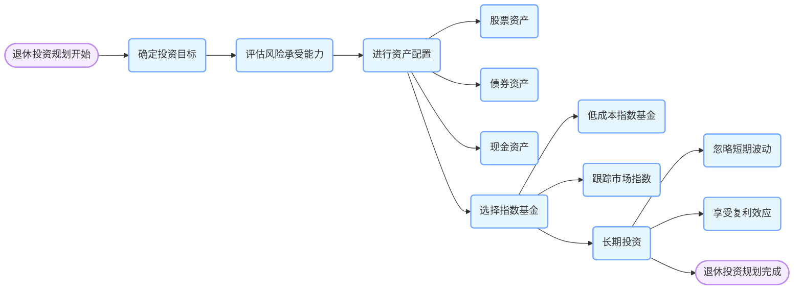

# 约翰·伯格的退休投资规划方法

> 关键词：约翰·伯格、退休投资规划、指数基金、资产配置、长期投资

> 摘要：本文深入探讨了约翰·伯格的退休投资规划方法。约翰·伯格作为投资界的传奇人物，其提出的以指数基金为核心、合理资产配置和坚持长期投资等理念，为投资者实现退休目标提供了行之有效的策略。文章从背景介绍入手，详细阐述核心概念与联系、核心算法原理及操作步骤、数学模型与公式等内容，通过项目实战案例展示具体应用，分析实际应用场景，推荐相关工具和资源，最后总结未来发展趋势与挑战，并提供常见问题解答和扩展阅读参考资料，旨在帮助投资者更好地理解和运用约翰·伯格的退休投资规划方法。

## 1. 背景介绍 
### 1.1 目的和范围
本文的目的是全面剖析约翰·伯格的退休投资规划方法，深入理解其投资理念的核心要点，并探讨如何将这些方法应用于实际的退休投资规划中。范围涵盖了约翰·伯格投资理念的各个方面，包括指数基金的选择、资产配置的原则、长期投资的策略等，同时通过实际案例和数学模型来验证和解释这些方法的有效性。

### 1.2 预期读者
本文预期读者主要包括对退休投资规划感兴趣的普通投资者、金融从业者以及相关领域的研究人员。对于普通投资者，希望能够通过本文了解到实用的退休投资策略；对于金融从业者，本文可以提供理论和实践相结合的参考；对于研究人员，有助于进一步深入研究退休投资规划领域的相关问题。

### 1.3 文档结构概述
本文将按照以下结构进行阐述：首先介绍约翰·伯格退休投资规划方法的背景和相关概念，包括核心术语和原理；接着详细讲解核心算法原理和具体操作步骤，并通过数学模型和公式进行深入分析；然后通过项目实战展示实际案例和代码实现；之后探讨该方法的实际应用场景；再推荐相关的工具和资源；最后总结未来发展趋势与挑战，提供常见问题解答和扩展阅读参考资料。

### 1.4 术语表
#### 1.4.1 核心术语定义
- **指数基金**：一种按照特定指数构成的标准，购买该指数包含的全部或部分证券的基金，以达到与该指数相同的收益水平。例如，沪深 300 指数基金就是按照沪深 300 指数的成分股进行投资的基金。
- **资产配置**：指根据投资需求将投资资金在不同资产类别之间进行分配，通常是将资产在低风险、低收益证券与高风险、高收益证券之间进行分配。常见的资产类别包括股票、债券、现金等。
- **长期投资**：指不考虑短期内市场的波动，持有投资标的较长时间，以获取资产的长期增值。一般来说，长期投资的时间跨度在 5 年以上。

#### 1.4.2 相关概念解释
- **市场有效性**：市场有效性理论认为，在有效市场中，资产价格已经反映了所有可用的信息。约翰·伯格的投资理念在一定程度上基于市场有效性，认为通过主动管理很难长期战胜市场，因此更倾向于通过指数基金进行被动投资。
- **复利效应**：复利是指在每一个计息期后，将所生利息加入本金再计利息。长期投资中，复利效应可以使资产实现快速增长。例如，每年收益率为 10%，初始投资 10000 元，经过 10 年，最终资产将达到 $10000\times(1 + 0.1)^{10}\approx25937$ 元。

#### 1.4.3 缩略词列表
- **ETF**：交易型开放式指数基金（Exchange Traded Fund），是一种在交易所上市交易的、基金份额可变的开放式基金，通常跟踪特定的指数。
- **ROI**：投资回报率（Return on Investment），是指通过投资而应返回的价值，即企业从一项投资活动中得到的经济回报。计算公式为：$ROI=\frac{投资收益 - 投资成本}{投资成本}\times100\%$。

## 2. 核心概念与联系 

### 核心概念原理
约翰·伯格的退休投资规划方法主要基于以下几个核心概念：
- **指数基金的优势**：指数基金具有低成本、广泛分散投资、紧跟市场等特点。由于其是被动跟踪指数，不需要进行大量的研究和分析，因此管理费用较低。同时，通过投资指数基金可以实现对整个市场的广泛分散投资，降低个别股票或债券的风险。
- **合理的资产配置**：根据投资者的年龄、风险承受能力和投资目标，合理分配资产在股票、债券和现金等不同资产类别之间的比例。一般来说，随着年龄的增长，应逐渐降低股票资产的比例，增加债券和现金等保守资产的比例，以降低投资组合的风险。
- **长期投资的重要性**：市场短期波动是不可预测的，但从长期来看，股票市场总体呈上升趋势。通过长期投资，可以平滑市场波动的影响，充分享受复利效应带来的资产增值。

### 架构的文本示意图
```plaintext
退休投资规划
|-- 指数基金投资
|   |-- 选择低成本指数基金
|   |-- 跟踪市场指数
|-- 资产配置
|   |-- 根据年龄和风险承受能力分配资产
|   |   |-- 股票资产
|   |   |-- 债券资产
|   |   |-- 现金资产
|-- 长期投资策略
|   |-- 忽略短期市场波动
|   |-- 享受复利效应
```

### Mermaid 流程图


## 3. 核心算法原理 & 具体操作步骤 

### 核心算法原理
约翰·伯格的退休投资规划方法主要围绕资产配置和长期投资展开。资产配置的核心算法可以基于年龄来确定股票和债券的比例。一种常见的方法是“100 减去年龄”规则，即股票资产的比例为 100 减去投资者的年龄，剩余部分为债券资产的比例。例如，一个 30 岁的投资者，股票资产的比例可以设定为 $100 - 30 = 70\%$，债券资产的比例为 $1 - 70\% = 30\%$。

### Python 源代码实现
```python
def asset_allocation(age):
    """
    根据年龄计算股票和债券的资产配置比例
    :param age: 投资者的年龄
    :return: 股票资产比例和债券资产比例
    """
    stock_ratio = (100 - age) / 100
    bond_ratio = 1 - stock_ratio
    return stock_ratio, bond_ratio

# 示例：计算 30 岁投资者的资产配置比例
age = 30
stock_ratio, bond_ratio = asset_allocation(age)
print(f"年龄为 {age} 岁的投资者，股票资产比例为 {stock_ratio * 100:.2f}%，债券资产比例为 {bond_ratio * 100:.2f}%")
```

### 具体操作步骤
1. **确定投资目标**：明确退休后的生活目标和资金需求，例如每月的生活费用、医疗费用等。
2. **评估风险承受能力**：考虑投资者的年龄、收入稳定性、财务状况等因素，评估其对风险的承受能力。
3. **进行资产配置**：根据“100 减去年龄”规则或其他适合的方法，确定股票、债券和现金等资产的配置比例。
4. **选择指数基金**：选择低成本、跟踪市场指数效果好的指数基金。可以参考基金的历史业绩、管理费用、跟踪误差等指标。
5. **长期投资**：定期投入资金，忽略短期市场波动，坚持长期投资，让复利效应发挥作用。

## 4. 数学模型和公式 & 详细讲解 & 举例说明 

### 复利计算公式
复利的计算公式为：$A = P(1 + r)^n$，其中：
- $A$ 表示最终的本利和；
- $P$ 表示初始本金；
- $r$ 表示年利率；
- $n$ 表示投资年限。

### 详细讲解
复利的本质是将每一期的利息加入本金，在下一期继续计算利息。随着时间的推移，复利效应会使资产实现快速增长。例如，初始投资 10000 元，年利率为 10%，投资年限为 10 年。根据复利公式，最终的本利和为：
$$A = 10000\times(1 + 0.1)^{10}\approx25937.42$$
这意味着在 10 年后，初始投资的 10000 元将增长到约 25937.42 元。

### 举例说明
假设一个 30 岁的投资者，每月投入 1000 元到一个年化收益率为 8% 的指数基金中，到 60 岁退休时，投资年限为 30 年。我们可以使用复利公式来计算最终的资产规模。

首先，将每月投入转换为每年投入，每年投入为 $1000\times12 = 12000$ 元。

然后，使用年金终值公式：$FVA = A\times\frac{(1 + r)^n - 1}{r}$，其中：
- $FVA$ 表示年金终值；
- $A$ 表示每年投入的金额；
- $r$ 表示年利率；
- $n$ 表示投资年限。

将数据代入公式：
$$FVA = 12000\times\frac{(1 + 0.08)^{30} - 1}{0.08}\approx12000\times113.2832\approx1359398.4$$
这意味着到 60 岁退休时，该投资者的资产规模将达到约 1359398.4 元。

## 5. 项目实战：代码实际案例和详细解释说明 

### 5.1  开发环境搭建
- **编程语言**：Python
- **开发工具**：Jupyter Notebook 或 PyCharm
- **所需库**：`numpy`、`pandas`、`matplotlib`

可以使用以下命令安装所需库：
```bash
pip install numpy pandas matplotlib
```

### 5.2  源代码详细实现和代码解读
```python
import numpy as np
import pandas as pd
import matplotlib.pyplot as plt

# 定义投资参数
initial_investment = 10000  # 初始投资金额
annual_contribution = 12000  # 每年投入金额
annual_return_rate = 0.08  # 年化收益率
investment_years = 30  # 投资年限

# 计算每年的资产规模
years = np.arange(1, investment_years + 1)
asset_values = []
current_asset = initial_investment

for year in years:
    current_asset = current_asset * (1 + annual_return_rate) + annual_contribution
    asset_values.append(current_asset)

# 创建 DataFrame 存储数据
data = pd.DataFrame({'Year': years, 'Asset Value': asset_values})

# 绘制资产增长曲线
plt.figure(figsize=(10, 6))
plt.plot(data['Year'], data['Asset Value'])
plt.title('Asset Growth Over Time')
plt.xlabel('Year')
plt.ylabel('Asset Value')
plt.grid(True)
plt.show()

# 输出最终资产规模
final_asset_value = asset_values[-1]
print(f"经过 {investment_years} 年的投资，最终资产规模为: {final_asset_value:.2f} 元")
```

### 代码解读与分析
1. **导入所需库**：导入 `numpy`、`pandas` 和 `matplotlib` 库，用于数据处理和可视化。
2. **定义投资参数**：设置初始投资金额、每年投入金额、年化收益率和投资年限。
3. **计算每年的资产规模**：使用循环和复利公式计算每年的资产规模，并将结果存储在列表中。
4. **创建 DataFrame**：将年份和资产规模数据存储在 `pandas` 的 `DataFrame` 中，方便后续处理和分析。
5. **绘制资产增长曲线**：使用 `matplotlib` 绘制资产增长曲线，直观展示资产随时间的变化情况。
6. **输出最终资产规模**：输出经过指定投资年限后的最终资产规模。

通过这个代码示例，我们可以清晰地看到长期投资和复利效应的作用，以及如何使用 Python 来模拟和分析退休投资规划。

## 6. 实际应用场景 
### 个人退休规划
对于普通投资者来说，约翰·伯格的退休投资规划方法非常适合用于个人退休规划。通过合理的资产配置和长期投资指数基金，可以在退休时积累足够的财富，保障退休后的生活质量。例如，一位 35 岁的上班族，每月拿出一部分工资投入到指数基金中，按照“100 减去年龄”规则进行资产配置，随着年龄的增长逐渐调整资产比例，到 60 岁退休时有望实现财务自由。

### 企业年金管理
企业年金是企业及其职工在依法参加基本养老保险的基础上，自愿建立的补充养老保险制度。企业年金的管理需要考虑风险控制和长期收益，约翰·伯格的方法可以为企业年金的投资管理提供参考。企业可以根据员工的年龄结构和风险承受能力，合理配置资产，选择合适的指数基金进行投资，以实现企业年金的保值增值。

### 养老基金投资
养老基金是为了保障老年人的生活而设立的基金，其投资目标是长期稳定的收益。约翰·伯格的退休投资规划方法强调长期投资和资产配置，与养老基金的投资理念相契合。养老基金可以通过投资指数基金，实现广泛分散投资，降低风险，同时享受市场的长期增长。

## 7. 工具和资源推荐
### 7.1 学习资源推荐
#### 7.1.1 书籍推荐
- 《共同基金常识》（*Common Sense on Mutual Funds*）：约翰·伯格的经典著作，详细阐述了指数基金的优势和投资理念，是学习退休投资规划的必读书籍。
- 《漫步华尔街》（*A Random Walk Down Wall Street*）：该书介绍了市场有效性理论和长期投资策略，对理解约翰·伯格的投资方法有很大帮助。
- 《聪明的投资者》（*The Intelligent Investor*）：本杰明·格雷厄姆的经典之作，强调价值投资和风险控制，为退休投资规划提供了重要的理论基础。

#### 7.1.2 在线课程
- Coursera 上的“投资学原理”（*Principles of Investing*）课程：由知名教授授课，涵盖了投资的基本原理和方法，包括资产配置、股票投资、债券投资等内容。
- edX 上的“金融市场”（*Financial Markets*）课程：耶鲁大学教授罗伯特·席勒主讲，深入探讨了金融市场的运行机制和投资策略。

#### 7.1.3 技术博客和网站
- 雪球网：国内知名的投资社区，提供了丰富的投资资讯、研究报告和投资者交流平台。
- 晨星网：全球著名的基金评级机构，提供基金的评级、分析和研究报告，帮助投资者选择合适的基金。

### 7.2 开发工具框架推荐
#### 7.2.1 IDE和编辑器
- PyCharm：功能强大的 Python 集成开发环境，提供代码编辑、调试、版本控制等功能，适合开发复杂的投资分析程序。
- Jupyter Notebook：交互式的开发环境，支持代码、文本、图表等多种形式的展示，方便进行数据分析和可视化。

#### 7.2.2 调试和性能分析工具
- `pdb`：Python 内置的调试工具，可以帮助开发者定位和解决代码中的问题。
- `cProfile`：Python 的性能分析工具，可以分析代码的运行时间和资源消耗情况，帮助优化代码性能。

#### 7.2.3 相关框架和库
- `pandas`：用于数据处理和分析的 Python 库，提供了丰富的数据结构和数据操作方法，方便处理投资数据。
- `numpy`：Python 的数值计算库，提供了高效的数组操作和数学函数，用于实现投资算法和模型。
- `matplotlib`：Python 的绘图库，用于绘制各种类型的图表，直观展示投资数据和结果。

### 7.3 相关论文著作推荐
#### 7.3.1 经典论文
- Eugene F. Fama 的《有效资本市场：理论与实证研究回顾》（*Efficient Capital Markets: A Review of Theory and Empirical Work*）：提出了有效市场假说，为指数基金的发展提供了理论基础。
- Harry Markowitz 的《资产选择：投资的有效分散化》（*Portfolio Selection: Efficient Diversification of Investments*）：开创了现代投资组合理论，阐述了资产配置的重要性。

#### 7.3.2 最新研究成果
- 可以关注《金融研究》《经济学季刊》等学术期刊，了解退休投资规划领域的最新研究成果。
- 参加金融学术会议，与国内外的专家学者交流，获取最新的研究动态。

#### 7.3.3 应用案例分析
- 一些金融机构和研究机构会发布退休投资规划的应用案例分析报告，可以通过这些报告了解实际应用中的经验和教训。
- 关注行业媒体和财经网站，获取相关的案例分析和报道。

## 8. 总结：未来发展趋势与挑战
### 未来发展趋势
- **智能化投资**：随着人工智能和大数据技术的发展，智能化投资将成为未来退休投资规划的重要趋势。智能投顾可以根据投资者的个人情况和市场情况，自动生成个性化的投资方案，提高投资效率和准确性。
- **可持续投资**：越来越多的投资者开始关注环境、社会和治理（ESG）因素，可持续投资将在退休投资规划中占据更重要的地位。投资者可以选择投资符合 ESG 标准的基金，实现经济利益和社会利益的双赢。
- **全球化投资**：随着全球经济的一体化，全球化投资将成为退休投资规划的必然选择。投资者可以通过投资海外市场的指数基金，实现资产的全球配置，降低单一市场的风险。

### 挑战
- **市场不确定性**：市场的不确定性是退休投资规划面临的最大挑战之一。市场波动、经济衰退、政策变化等因素都可能影响投资收益，投资者需要具备较强的风险承受能力和应对能力。
- **投资者教育不足**：许多投资者对退休投资规划的认识不足，缺乏必要的投资知识和技能。这导致他们在投资过程中容易受到市场情绪的影响，做出不理性的投资决策。
- **监管政策变化**：监管政策的变化可能会对退休投资规划产生影响。例如，税收政策、基金监管政策等的调整都可能影响投资者的投资收益和投资策略。

## 9. 附录：常见问题与解答
### 1. 指数基金一定能赚钱吗？
指数基金并不能保证一定能赚钱。虽然从长期来看，股票市场总体呈上升趋势，但市场短期波动是不可避免的。指数基金的收益取决于所跟踪的指数表现，如果市场下跌，指数基金的净值也会下降。不过，通过长期投资和合理的资产配置，可以降低风险，提高获得正收益的概率。

### 2. 如何选择适合自己的指数基金？
选择适合自己的指数基金可以从以下几个方面考虑：
- **跟踪指数**：选择跟踪市场主流指数的基金，如沪深 300 指数、中证 500 指数等，这些指数具有代表性和广泛的市场覆盖。
- **管理费用**：尽量选择管理费用低的指数基金，因为费用越低，对投资收益的影响越小。
- **历史业绩**：参考基金的历史业绩，但要注意历史业绩不代表未来表现，不能仅仅根据历史业绩来选择基金。
- **跟踪误差**：跟踪误差是指基金净值与所跟踪指数的偏离程度，跟踪误差越小，说明基金对指数的跟踪效果越好。

### 3. 资产配置比例需要定期调整吗？
需要定期调整资产配置比例。随着投资者年龄的增长、市场情况的变化和投资目标的调整，资产配置比例也需要相应地调整。一般来说，可以每年或每半年对资产配置进行一次评估和调整，以确保投资组合的风险和收益符合投资者的需求。

### 4. 长期投资是不是意味着一直持有不卖出？
长期投资并不意味着一直持有不卖出。长期投资的核心是忽略短期市场波动，坚持投资策略，但在一些特殊情况下，如市场出现极端情况、投资目标发生变化或基金表现不佳等，投资者可以考虑卖出部分或全部投资。不过，卖出决策应该基于理性分析，而不是受市场情绪的影响。

## 10. 扩展阅读 & 参考资料
### 扩展阅读
- 《投资中最简单的事》：作者邱国鹭，介绍了投资的基本原理和方法，对退休投资规划有一定的参考价值。
- 《财务自由之路》：作者博多·舍费尔，提供了实现财务自由的实用建议和方法，帮助读者规划退休生活。

### 参考资料
- John C. Bogle. *Common Sense on Mutual Funds*. Wiley, 2009.
- Burton G. Malkiel. *A Random Walk Down Wall Street*. W. W. Norton & Company, 2016.
- Benjamin Graham. *The Intelligent Investor*. HarperBusiness, 2003.
- Eugene F. Fama. "Efficient Capital Markets: A Review of Theory and Empirical Work." *The Journal of Finance*, Vol. 25, No. 2, 1970.
- Harry Markowitz. "Portfolio Selection." *The Journal of Finance*, Vol. 7, No. 1, 1952.