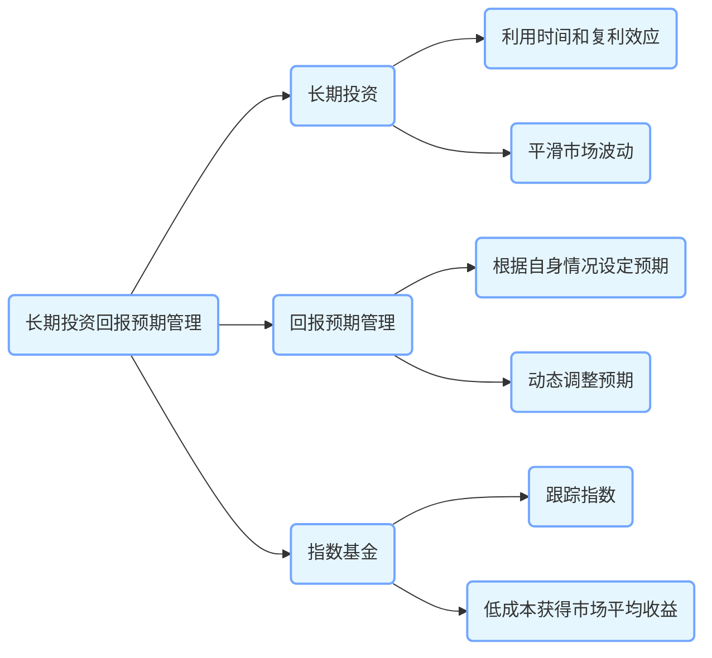

# 约翰·伯格的长期投资回报预期管理

> 关键词：约翰·伯格、长期投资、回报预期管理、投资理念、指数基金

> 摘要：本文围绕约翰·伯格的长期投资回报预期管理展开深入探讨。详细介绍了约翰·伯格投资理念产生的背景，阐述了长期投资、回报预期管理等核心概念及其联系。通过数学模型和公式分析投资回报的计算方式，结合Python代码展示具体的算法原理和操作步骤。以实际案例说明如何在项目中应用这些理念进行投资决策，探讨了其在不同场景下的实际应用。同时推荐了相关的学习资源、开发工具框架以及论文著作，最后总结了未来投资领域的发展趋势与挑战，并对常见问题进行解答，为投资者提供全面且深入的投资知识参考。

## 1. 背景介绍 
### 1.1 目的和范围
本文旨在深入剖析约翰·伯格的长期投资回报预期管理理念。目的是帮助投资者理解伯格的投资哲学，掌握如何进行合理的长期投资回报预期设定与管理，从而在投资实践中做出更明智的决策。范围涵盖伯格投资理念的核心概念、相关算法原理、数学模型、实际应用案例以及未来发展趋势等方面。

### 1.2 预期读者
本文预期读者包括广大个人投资者，无论是初涉投资领域的新手，还是有一定投资经验的人士，都能从本文中获取有价值的信息。同时，金融专业的学生、投资研究人员以及金融从业者也可以将本文作为研究和实践的参考资料。

### 1.3 文档结构概述
本文首先介绍了约翰·伯格投资理念产生的背景信息，包括目的、预期读者和文档结构等内容。接着阐述了长期投资、回报预期管理等核心概念及其相互联系，并通过示意图和流程图进行直观展示。然后详细讲解了核心算法原理和具体操作步骤，使用Python代码进行演示。随后介绍了相关的数学模型和公式，并举例说明其应用。通过实际案例展示了如何在项目中应用这些理念进行投资决策。探讨了该理念在不同场景下的实际应用。推荐了学习资源、开发工具框架以及相关论文著作。最后总结了未来投资领域的发展趋势与挑战，解答了常见问题，并提供了扩展阅读和参考资料。

### 1.4 术语表
#### 1.4.1 核心术语定义
- **长期投资**：指投资者将资金投入到某项资产中，并持有较长时间，通常为数年甚至数十年，以获取资产的长期增值和收益。
- **回报预期管理**：投资者根据自身的投资目标、风险承受能力和市场情况等因素，对投资回报进行合理的预测和设定，并在投资过程中进行动态调整和控制的过程。
- **指数基金**：一种按照特定指数的成分股组成及权重进行投资的基金，旨在跟踪指数的表现，获得与指数相近的收益。

#### 1.4.2 相关概念解释
- **复利**：指在每一个计息期后，将所生利息加入本金再计利息，逐期滚算，俗称“利滚利”。复利的效果在长期投资中尤为显著，可以使投资收益实现指数级增长。
- **市场有效性**：指市场价格能够及时、准确地反映所有可用信息的程度。在有效市场中，投资者很难通过分析公开信息获得超额收益。

#### 1.4.3 缩略词列表
- **ETF**：交易型开放式指数基金（Exchange Traded Fund），是一种在交易所上市交易的、基金份额可变的开放式基金。

## 2. 核心概念与联系 
### 核心概念原理
约翰·伯格的长期投资回报预期管理理念基于几个核心概念：

#### 长期投资
长期投资的核心原理在于利用时间的力量和复利效应。市场在短期内可能会出现波动，但从长期来看，经济通常是呈增长趋势的。通过长期持有资产，投资者可以平滑市场波动的影响，享受资产增值带来的收益。例如，股票市场虽然短期内可能会经历大幅涨跌，但从几十年的时间跨度来看，整体呈现出上升的趋势。

#### 回报预期管理
回报预期管理要求投资者根据自身的投资目标、风险承受能力和市场情况等因素，合理设定投资回报预期。过高的回报预期可能导致投资者承担过高的风险，而过低的回报预期则可能无法实现投资者的财务目标。投资者需要对不同资产的历史表现、市场趋势等进行分析，以确定合理的回报预期，并在投资过程中根据实际情况进行调整。

#### 指数基金
指数基金是伯格投资理念中的重要工具。由于市场的有效性，主动管理型基金很难长期战胜市场。而指数基金通过跟踪特定指数，能够以较低的成本获得市场平均收益。指数基金的投资组合与所跟踪的指数成分股一致，避免了主动管理型基金可能存在的选股失误和高交易成本等问题。

### 架构的文本示意图
```plaintext
长期投资回报预期管理
|
|-- 长期投资
|   |-- 利用时间和复利效应
|   |-- 平滑市场波动
|
|-- 回报预期管理
|   |-- 根据自身情况设定预期
|   |-- 动态调整预期
|
|-- 指数基金
|   |-- 跟踪指数
|   |-- 低成本获得市场平均收益
```

### Mermaid 流程图


## 3. 核心算法原理 & 具体操作步骤 
### 核心算法原理
在长期投资回报预期管理中，一个重要的算法是计算投资的复利收益。复利计算公式为：

$A = P(1 + r)^n$

其中：
- $A$ 是最终的投资总额
- $P$ 是初始投资本金
- $r$ 是每期的利率
- $n$ 是投资的期数

### 具体操作步骤
以下是使用Python代码实现复利计算的示例：

```python
def compound_interest(principal, rate, periods):
    """
    计算复利收益
    :param principal: 初始投资本金
    :param rate: 每期的利率
    :param periods: 投资的期数
    :return: 最终的投资总额
    """
    return principal * (1 + rate) ** periods

# 示例数据
initial_investment = 10000  # 初始投资本金为10000元
annual_interest_rate = 0.08  # 年利率为8%
investment_years = 20  # 投资期限为20年

# 计算最终投资总额
final_amount = compound_interest(initial_investment, annual_interest_rate, investment_years)

print(f"初始投资 {initial_investment} 元，年利率为 {annual_interest_rate * 100}%，投资 {investment_years} 年后的最终总额为: {final_amount:.2f} 元")
```

### 代码解释
- `compound_interest` 函数接受三个参数：`principal`（初始投资本金）、`rate`（每期的利率）和 `periods`（投资的期数）。
- 在函数内部，使用复利公式 $A = P(1 + r)^n$ 计算最终的投资总额，并将结果返回。
- 在主程序中，定义了初始投资本金、年利率和投资期限等示例数据，调用 `compound_interest` 函数计算最终投资总额，并将结果打印输出。

## 4. 数学模型和公式 & 详细讲解 & 举例说明 
### 复利模型
复利模型是长期投资回报计算的基础，其公式为：

$$A = P(1 + r)^n$$

#### 详细讲解
- $P$（初始投资本金）：投资者最初投入的资金数额。例如，小明打算投资10000元购买基金，那么 $P = 10000$ 元。
- $r$（每期的利率）：投资在每个计息期内获得的收益率。如果基金的年利率为8%，则 $r = 0.08$。
- $n$（投资的期数）：投资持续的时间，通常以年为单位。假设小明打算投资20年，那么 $n = 20$。
- $A$（最终的投资总额）：经过 $n$ 期投资后，本金和利息的总和。

#### 举例说明
假设小红有5000元的初始资金，她打算投资一只年化收益率为7%的指数基金，投资期限为15年。根据复利公式计算最终的投资总额：

$P = 5000$，$r = 0.07$，$n = 15$

$A = 5000\times(1 + 0.07)^{15}$

```python
principal = 5000
rate = 0.07
periods = 15
final_amount = principal * (1 + rate) ** periods
print(f"最终投资总额为: {final_amount:.2f} 元")
```

运行上述代码，可得到最终投资总额约为 13795.16 元。这表明，通过长期投资和复利效应，小红的初始投资在15年后实现了显著的增长。

### 投资组合预期收益模型
在投资组合中，预期收益可以通过各资产的权重和预期收益率来计算。假设投资组合中有 $n$ 种资产，第 $i$ 种资产的权重为 $w_i$，预期收益率为 $r_i$，则投资组合的预期收益率 $R_p$ 计算公式为：

$$R_p = \sum_{i = 1}^{n} w_i r_i$$

#### 详细讲解
- $w_i$：第 $i$ 种资产在投资组合中所占的权重，且 $\sum_{i = 1}^{n} w_i = 1$。例如，一个投资组合由股票和债券组成，股票的权重为0.6，债券的权重为0.4，则 $w_1 = 0.6$，$w_2 = 0.4$。
- $r_i$：第 $i$ 种资产的预期收益率。假设股票的预期收益率为12%，债券的预期收益率为5%，则 $r_1 = 0.12$，$r_2 = 0.05$。
- $R_p$：投资组合的预期收益率。

#### 举例说明
假设一个投资组合由三种资产组成，资产A的权重为0.3，预期收益率为10%；资产B的权重为0.5，预期收益率为8%；资产C的权重为0.2，预期收益率为6%。根据投资组合预期收益模型计算该投资组合的预期收益率：

$w_1 = 0.3$，$r_1 = 0.1$；$w_2 = 0.5$，$r_2 = 0.08$；$w_3 = 0.2$，$r_3 = 0.06$

$R_p = 0.3\times0.1 + 0.5\times0.08 + 0.2\times0.06$

```python
weights = [0.3, 0.5, 0.2]
returns = [0.1, 0.08, 0.06]
portfolio_return = sum([w * r for w, r in zip(weights, returns)])
print(f"投资组合的预期收益率为: {portfolio_return * 100:.2f}%")
```

运行上述代码，可得到该投资组合的预期收益率为 8.20%。

## 5. 项目实战：代码实际案例和详细解释说明 
### 5.1  开发环境搭建
#### 安装Python
首先，需要安装Python环境。可以从Python官方网站（https://www.python.org/downloads/）下载适合自己操作系统的Python安装包，并按照安装向导进行安装。建议安装Python 3.x 版本。

#### 安装必要的库
在本项目中，我们主要使用 `pandas` 和 `matplotlib` 库进行数据处理和可视化。可以使用以下命令进行安装：

```sh
pip install pandas matplotlib
```

### 5.2  源代码详细实现和代码解读
以下是一个模拟长期投资指数基金并计算投资回报的Python代码示例：

```python
import pandas as pd
import matplotlib.pyplot as plt

# 定义初始参数
initial_investment = 10000  # 初始投资本金
annual_contribution = 2000  # 每年追加投资金额
annual_return_rate = 0.07  # 年化收益率
investment_years = 30  # 投资期限

# 创建一个空的DataFrame来存储每年的投资信息
investment_data = pd.DataFrame(columns=['Year', 'Initial Balance', 'Contribution', 'Return', 'Ending Balance'])

# 初始化第一年的信息
initial_balance = initial_investment
for year in range(1, investment_years + 1):
    # 计算当年的收益
    return_amount = initial_balance * annual_return_rate
    # 计算当年追加投资后的总金额
    ending_balance = initial_balance + annual_contribution + return_amount
    
    # 将当年的信息添加到DataFrame中
    investment_data = investment_data.append({
        'Year': year,
        'Initial Balance': initial_balance,
        'Contribution': annual_contribution,
        'Return': return_amount,
        'Ending Balance': ending_balance
    }, ignore_index=True)
    
    # 更新下一年的初始余额
    initial_balance = ending_balance

# 打印投资信息
print(investment_data)

# 绘制投资余额随时间变化的折线图
plt.figure(figsize=(10, 6))
plt.plot(investment_data['Year'], investment_data['Ending Balance'])
plt.xlabel('Year')
plt.ylabel('Ending Balance')
plt.title('Long-term Investment in Index Fund')
plt.grid(True)
plt.show()
```

### 5.3  代码解读与分析
#### 代码功能概述
该代码模拟了一个长期投资指数基金的过程，考虑了初始投资本金、每年追加投资金额和年化收益率等因素。通过循环计算每年的投资收益和期末余额，并将结果存储在 `pandas` 的 `DataFrame` 中。最后，打印出每年的投资信息，并使用 `matplotlib` 库绘制投资余额随时间变化的折线图。

#### 代码详细解读
1. **导入必要的库**：导入 `pandas` 和 `matplotlib.pyplot` 库，分别用于数据处理和可视化。
2. **定义初始参数**：设置初始投资本金、每年追加投资金额、年化收益率和投资期限等参数。
3. **创建DataFrame**：创建一个空的 `DataFrame` 用于存储每年的投资信息，包括年份、初始余额、追加投资金额、收益和期末余额。
4. **循环计算每年的投资信息**：使用 `for` 循环遍历投资期限内的每一年，计算当年的收益、追加投资后的总金额，并将相关信息添加到 `DataFrame` 中。同时，更新下一年的初始余额。
5. **打印投资信息**：打印存储投资信息的 `DataFrame`。
6. **绘制折线图**：使用 `matplotlib` 库绘制投资余额随时间变化的折线图，直观展示投资的增长情况。

#### 分析
通过该代码示例，我们可以看到长期投资和复利效应的强大作用。随着时间的推移，投资余额呈现出明显的增长趋势。同时，每年追加投资也进一步加速了投资的增长。投资者可以根据自己的实际情况调整初始参数，模拟不同的投资方案，以制定合理的投资计划。

## 6. 实际应用场景 
### 个人养老规划
在个人养老规划中，约翰·伯格的长期投资回报预期管理理念具有重要的应用价值。随着人口老龄化的加剧，个人养老储备变得越来越重要。投资者可以通过长期投资指数基金，设定合理的回报预期，为自己的养老生活积累足够的资金。

例如，一位30岁的投资者计划在60岁退休，他可以每月定期投资一定金额的指数基金。假设年化收益率为7%，经过30年的投资，复利效应将使他的投资资金大幅增长。通过合理的回报预期管理，他可以根据自己的养老目标和风险承受能力，调整投资金额和投资期限，确保在退休时能够获得足够的养老金。

### 教育基金规划
对于有子女教育需求的家庭来说，长期投资回报预期管理也可以帮助他们制定教育基金规划。家长可以从孩子出生开始，每月或每年定期投资一定金额的指数基金，为孩子的大学教育或其他教育费用储备资金。

以孩子18岁上大学为例，家长可以根据预计的教育费用和投资期限，设定合理的回报预期。通过长期投资和复利效应，在孩子上大学时，投资资金可能已经积累到足够支付教育费用的水平。同时，家长可以根据市场情况和家庭财务状况，动态调整投资策略和回报预期。

### 财富传承
在财富传承方面，长期投资回报预期管理可以帮助家族实现财富的保值和增值，并顺利传承给下一代。家族可以设立家族信托或投资组合，长期投资于指数基金等稳健资产。通过合理的回报预期管理，确保家族财富在长期内保持增长，并能够满足家族成员的生活需求和发展目标。

例如，一个家族将一部分资产投资于指数基金，设定长期的回报预期为每年6%。经过几代人的传承，家族财富将不断积累和增长。同时，家族可以制定明确的财富传承规则和计划，确保财富能够合理分配给下一代。

## 7. 工具和资源推荐
### 7.1 学习资源推荐
#### 7.1.1 书籍推荐
- 《共同基金常识》（*Common Sense on Mutual Funds*）：约翰·伯格的经典著作，深入阐述了他的投资理念和对共同基金的见解，是投资者必读的书籍之一。
- 《聪明的投资者》（*The Intelligent Investor*）：本杰明·格雷厄姆的传世之作，介绍了价值投资的基本原理和方法，对投资者培养正确的投资思维有很大帮助。
- 《漫步华尔街》（*A Random Walk Down Wall Street*）：伯顿·马尔基尔的著作，探讨了有效市场假说和随机漫步理论，强调了长期投资和指数基金的重要性。

#### 7.1.2 在线课程
- Coursera平台上的“投资学原理”（*Principles of Investing*）课程：由知名教授授课，系统介绍了投资学的基本概念、理论和方法。
- edX平台上的“金融市场”（*Financial Markets*）课程：耶鲁大学教授罗伯特·席勒主讲，深入分析了金融市场的运行机制和投资策略。

#### 7.1.3 技术博客和网站
- 雪球网（https://xueqiu.com/）：国内知名的投资社区，提供丰富的投资资讯、研究报告和投资者交流平台。
- 晨星网（https://cn.morningstar.com/）：专业的基金评级和研究机构，提供基金数据、分析报告和投资建议。

### 7.2 开发工具框架推荐
#### 7.2.1 IDE和编辑器
- PyCharm：一款功能强大的Python集成开发环境，提供代码编辑、调试、版本控制等多种功能，适合专业开发者使用。
- Jupyter Notebook：一个交互式的开发环境，支持Python、R等多种编程语言，方便进行数据分析和可视化。

#### 7.2.2 调试和性能分析工具
- `pdb`：Python内置的调试器，可以帮助开发者定位代码中的错误和问题。
- `cProfile`：Python的性能分析模块，可以分析代码的运行时间和函数调用情况，帮助开发者优化代码性能。

#### 7.2.3 相关框架和库
- `pandas`：用于数据处理和分析的Python库，提供了强大的数据结构和数据操作功能。
- `numpy`：Python的数值计算库，提供了高效的数组操作和数学函数。
- `matplotlib`：用于数据可视化的Python库，可以绘制各种类型的图表和图形。

### 7.3 相关论文著作推荐
#### 7.3.1 经典论文
- Eugene F. Fama的《有效资本市场：理论与实证研究回顾》（*Efficient Capital Markets: A Review of Theory and Empirical Work*）：提出了有效市场假说，对金融市场的研究产生了深远影响。
- Harry Markowitz的《投资组合选择》（*Portfolio Selection*）：奠定了现代投资组合理论的基础，提出了通过资产组合分散风险的方法。

#### 7.3.2 最新研究成果
- 关注顶级金融学术期刊，如《Journal of Finance》、《Review of Financial Studies》等，这些期刊发表了许多关于投资、金融市场等领域的最新研究成果。
- 参加金融学术会议，如美国金融协会（AFA）年会等，与国内外顶尖学者和研究人员交流最新的研究进展。

#### 7.3.3 应用案例分析
- 可以参考一些知名投资机构的研究报告和案例分析，了解他们在实际投资中如何应用各种投资策略和理念。例如，桥水基金（Bridgewater Associates）的研究报告经常分享他们对宏观经济和投资市场的分析和见解。

## 8. 总结：未来发展趋势与挑战
### 未来发展趋势
#### 指数基金的持续增长
随着投资者对约翰·伯格投资理念的认识不断加深，指数基金的规模有望继续扩大。指数基金以其低成本、分散风险和跟踪市场的特点，将吸引更多投资者的关注。同时，随着金融科技的发展，指数基金的交易和投资将更加便捷，进一步推动其市场份额的增长。

#### 个性化投资服务的兴起
未来，投资者对个性化投资服务的需求将不断增加。投资机构将利用大数据、人工智能等技术，根据投资者的风险承受能力、投资目标和偏好等因素，为投资者提供更加个性化的投资组合建议和回报预期管理方案。

#### 社会责任投资的发展
社会责任投资（SRI）将成为未来投资领域的一个重要发展方向。投资者越来越关注企业的社会责任和环境影响，将倾向于投资那些具有良好社会形象和可持续发展能力的企业。指数基金也将推出更多与社会责任相关的产品，满足投资者的需求。

### 挑战
#### 市场波动和不确定性
尽管长期投资可以平滑市场波动的影响，但市场的短期波动和不确定性仍然是投资者面临的挑战之一。全球经济形势、政治局势、自然灾害等因素都可能导致市场出现大幅波动，影响投资者的回报预期和投资决策。

#### 技术变革带来的挑战
金融科技的快速发展带来了新的投资机会，但也带来了一些挑战。例如，人工智能和算法交易的广泛应用可能导致市场的复杂性增加，投资者需要不断学习和适应新的技术和投资方式。同时，技术安全和数据隐私问题也需要引起投资者的关注。

#### 投资者教育不足
目前，仍有许多投资者对投资知识和回报预期管理缺乏足够的了解。投资者教育不足可能导致投资者做出不理性的投资决策，无法实现合理的投资回报。因此，加强投资者教育，提高投资者的金融素养，是未来投资领域需要解决的重要问题之一。

## 9. 附录：常见问题与解答
### 1. 长期投资是否适合所有投资者？
长期投资并不适合所有投资者。长期投资需要投资者具备一定的资金实力和风险承受能力。对于短期有资金需求或风险承受能力较低的投资者来说，长期投资可能并不合适。投资者在进行长期投资之前，应该根据自己的财务状况、投资目标和风险承受能力等因素，综合考虑是否适合进行长期投资。

### 2. 如何确定合理的回报预期？
确定合理的回报预期需要考虑多个因素，包括市场情况、投资品种、投资期限和自身风险承受能力等。投资者可以参考历史数据和专业机构的研究报告，了解不同投资品种的平均收益率。同时，投资者应该根据自己的投资目标和风险承受能力，合理调整回报预期。例如，如果投资者的风险承受能力较低，那么回报预期也应该相应降低。

### 3. 指数基金是否一定会获得市场平均收益？
虽然指数基金的目标是跟踪特定指数的表现，获得与指数相近的收益，但在实际操作中，指数基金的收益可能会与指数存在一定的偏差。这是因为指数基金存在管理费用、交易成本等因素，会对基金的收益产生一定的影响。此外，指数的编制和调整也可能导致指数基金的收益与指数不完全一致。

### 4. 长期投资过程中是否需要调整投资组合？
在长期投资过程中，投资者可以根据市场情况和自身投资目标的变化，适当调整投资组合。例如，如果市场出现大幅波动，投资者可以根据自己的风险承受能力，调整投资组合中不同资产的比例，以降低风险。同时，如果投资者的投资目标发生了变化，如提前退休或子女教育需求提前等，也需要相应调整投资组合。

## 10. 扩展阅读 & 参考资料
### 扩展阅读
- 《投资最重要的事》（*The Most Important Thing Illuminated*）：霍华德·马克斯的著作，分享了他在投资领域的经验和见解，对投资者培养正确的投资思维有很大帮助。
- 《金融炼金术》（*The Alchemy of Finance*）：乔治·索罗斯的著作，介绍了他的反身性理论和投资策略，对投资者理解金融市场的运行机制有重要启示。

### 参考资料
- 约翰·伯格的官方网站和相关访谈资料，获取他的最新投资观点和理念。
- 金融数据提供商，如Wind、Bloomberg等，获取准确的金融市场数据和分析报告。
- 相关的金融学术数据库，如EBSCOhost、JSTOR等，查阅金融领域的学术论文和研究成果。