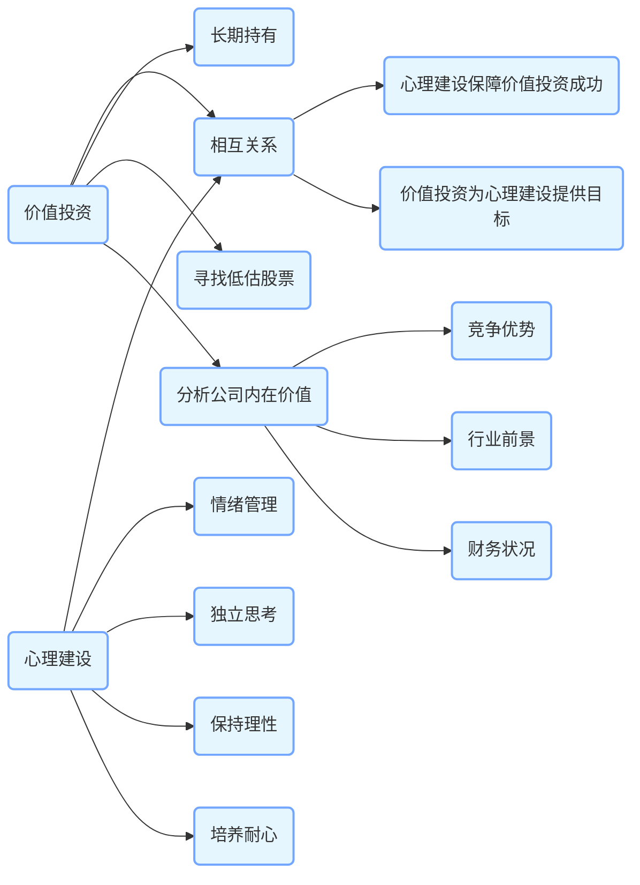

# 约翰·聂夫的价值投资者心理建设

> 关键词：约翰·聂夫、价值投资、心理建设、投资心态、风险应对

> 摘要：本文围绕约翰·聂夫的价值投资理念，深入探讨价值投资者的心理建设问题。通过对约翰·聂夫投资思想的剖析，阐述价值投资者在投资过程中应具备的核心心理要素，包括耐心、理性、独立思考等。同时，详细讲解如何在实践中运用这些心理特质进行投资决策，以及应对投资过程中遇到的各种挑战。结合实际案例和数学模型，帮助读者更好地理解和掌握价值投资者心理建设的重要性和方法，为投资者在价值投资领域取得成功提供有益的指导。

## 1. 背景介绍 
### 1.1 目的和范围
本文旨在深入研究约翰·聂夫的价值投资理念，并聚焦于价值投资者的心理建设这一关键领域。通过对约翰·聂夫投资生涯和思想的分析，揭示价值投资者在面对市场波动、信息干扰等复杂情况时，应如何构建健康、稳定的心理状态，以实现长期的投资成功。范围涵盖了价值投资心理建设的核心概念、算法原理、数学模型，以及在实际投资项目中的应用和相关工具资源推荐等方面。

### 1.2 预期读者
本文预期读者主要包括对价值投资感兴趣的个人投资者、金融从业者、投资研究人员以及相关专业的学生。无论是初涉投资领域的新手，还是有一定投资经验的专业人士，都能从本文中获取关于价值投资者心理建设的有价值信息和启示。

### 1.3 文档结构概述
本文将按照以下结构展开：首先介绍核心概念与联系，明确价值投资和心理建设的基本原理和相互关系；接着阐述核心算法原理及具体操作步骤，通过 Python 代码详细说明如何在投资决策中运用心理因素；然后讲解数学模型和公式，并结合实例进行说明；之后通过项目实战展示代码的实际应用和解读；再探讨实际应用场景，分析心理建设在不同投资场景中的作用；推荐相关的工具和资源，帮助读者进一步学习和实践；最后总结未来发展趋势与挑战，解答常见问题，并提供扩展阅读和参考资料。

### 1.4 术语表
#### 1.4.1 核心术语定义
- **价值投资**：一种投资策略，强调通过分析公司的基本面，寻找被市场低估的股票，以长期持有获取价值回归带来的收益。
- **心理建设**：指投资者通过自我认知、情绪管理和思维训练等方式，培养适应投资环境的心理品质和能力。
- **安全边际**：在价值投资中，指股票的市场价格低于其内在价值的幅度，用于降低投资风险。

#### 1.4.2 相关概念解释
- **市场先生**：由本杰明·格雷厄姆提出的概念，将市场比喻为一个情绪不稳定的“先生”，其报价会受到情绪和短期因素的影响，投资者应利用市场先生的错误定价进行投资。
- **投资组合**：投资者将资金分散投资于多种资产的集合，旨在降低单一资产的风险，实现风险和收益的平衡。

#### 1.4.3 缩略词列表
- **PE**：市盈率（Price-to-Earnings Ratio），指股票价格与每股收益的比率，用于衡量股票的估值水平。
- **PB**：市净率（Price-to-Book Ratio），指股票价格与每股净资产的比率，反映股票的市场价值与账面价值的关系。

## 2. 核心概念与联系 

### 价值投资的核心原理
价值投资的核心原理基于对公司内在价值的评估。内在价值是指公司未来现金流的现值，通过对公司的财务状况、行业前景、竞争优势等因素进行分析，可以估算出公司的内在价值。当股票的市场价格低于其内在价值时，就存在投资机会。

### 心理建设的重要性
在价值投资过程中，心理建设起着至关重要的作用。市场波动是常态，投资者可能会面临股价的大幅下跌、市场的短期热点诱惑等情况。如果没有良好的心理建设，投资者很容易受到情绪的影响，做出错误的投资决策。例如，在股价下跌时恐慌抛售，错过价值回归的机会；或者在市场热点面前盲目跟风，追高买入高估的股票。

### 核心概念的联系
价值投资和心理建设是相辅相成的关系。价值投资为心理建设提供了目标和方向，投资者基于对公司内在价值的判断进行投资，从而在面对市场波动时更有信心和底气。而心理建设则是价值投资成功的保障，帮助投资者克服恐惧、贪婪等情绪，坚持价值投资的理念和策略。

### 文本示意图
```plaintext
价值投资
    |
    |-- 分析公司内在价值
    |   |-- 财务状况
    |   |-- 行业前景
    |   |-- 竞争优势
    |
    |-- 寻找低估股票
    |
    |-- 长期持有
    |
    心理建设
    |
    |-- 培养耐心
    |-- 保持理性
    |-- 独立思考
    |-- 情绪管理
    |
    相互关系
    |
    |-- 价值投资为心理建设提供目标
    |-- 心理建设保障价值投资成功
```

### Mermaid 流程图


## 3. 核心算法原理 & 具体操作步骤 

### 核心算法原理
在价值投资的心理建设中，我们可以将投资者的决策过程看作一个基于情绪和理性因素的算法。设投资者的决策函数为 $D$，情绪因素为 $E$，理性因素为 $R$，则决策函数可以表示为：

$D = f(E, R)$

其中，情绪因素 $E$ 包括恐惧、贪婪、乐观、悲观等情绪对投资者决策的影响；理性因素 $R$ 包括公司的内在价值评估、市场估值水平、投资组合的风险收益分析等。

### 具体操作步骤
#### 步骤 1：情绪评估
投资者需要定期对自己的情绪状态进行评估，判断自己是否处于恐惧、贪婪等极端情绪中。可以通过自我反思、记录投资决策时的情绪感受等方式进行评估。

#### 步骤 2：理性分析
在进行投资决策前，投资者需要进行全面的理性分析。这包括对公司的财务报表进行分析，计算市盈率、市净率等估值指标；研究行业的发展趋势和竞争格局；评估投资组合的风险和收益等。

#### 步骤 3：决策调整
根据情绪评估和理性分析的结果，投资者需要调整自己的投资决策。如果情绪因素导致决策偏差较大，投资者应尽量克服情绪的影响，回归理性决策；如果理性分析表明投资机会较大，但情绪上存在担忧，投资者可以通过分散投资、设定止损等方式降低风险，增强信心。

### Python 代码实现
```python
import numpy as np

# 情绪评估函数，这里简单用一个随机数模拟情绪状态，0 表示极度恐惧，1 表示极度贪婪
def emotion_evaluation():
    return np.random.uniform(0, 1)

# 理性分析函数，这里简单用一个随机数模拟理性分析的结果，0 表示不建议投资，1 表示强烈建议投资
def rational_analysis():
    return np.random.uniform(0, 1)

# 决策函数
def decision_function(emotion, rational):
    # 这里简单地将情绪和理性因素加权平均，情绪因素权重为 0.3，理性因素权重为 0.7
    decision_score = 0.3 * emotion + 0.7 * rational
    if decision_score > 0.5:
        return "买入"
    else:
        return "卖出"

# 主程序
if __name__ == "__main__":
    emotion = emotion_evaluation()
    rational = rational_analysis()
    decision = decision_function(emotion, rational)
    print(f"情绪评估得分: {emotion}")
    print(f"理性分析得分: {rational}")
    print(f"投资决策: {decision}")
```

### 代码解释
- `emotion_evaluation` 函数：用于模拟投资者的情绪评估，返回一个 0 到 1 之间的随机数，表示投资者的情绪状态。
- `rational_analysis` 函数：用于模拟投资者的理性分析，返回一个 0 到 1 之间的随机数，表示理性分析的结果。
- `decision_function` 函数：根据情绪评估和理性分析的结果，计算决策得分，并根据得分判断是买入还是卖出。
- 主程序：调用上述函数，输出情绪评估得分、理性分析得分和投资决策。

## 4. 数学模型和公式 & 详细讲解 & 举例说明 

### 内在价值评估模型
在价值投资中，常用的内在价值评估模型是现金流折现模型（DCF）。该模型的基本思想是将公司未来的现金流折现到当前，得到公司的内在价值。

#### 公式
$V = \sum_{t=1}^{n} \frac{CF_t}{(1 + r)^t} + \frac{TV}{(1 + r)^n}$

其中：
- $V$ 表示公司的内在价值
- $CF_t$ 表示第 $t$ 期的现金流
- $r$ 表示折现率
- $n$ 表示预测期数
- $TV$ 表示终值

#### 详细讲解
现金流折现模型的核心是预测公司未来的现金流，并选择合适的折现率将其折现到当前。预测现金流需要对公司的业务模式、市场前景、竞争优势等进行深入分析。折现率反映了投资者对投资风险的预期，一般可以使用资本资产定价模型（CAPM）来确定。终值是指预测期结束后公司的价值，可以使用永续增长模型或退出倍数法来估算。

#### 举例说明
假设一家公司预计未来 5 年的现金流分别为 100 万元、120 万元、150 万元、180 万元和 200 万元，预测期结束后的终值为 2000 万元，折现率为 10%。则该公司的内在价值计算如下：

$V = \frac{100}{(1 + 0.1)^1} + \frac{120}{(1 + 0.1)^2} + \frac{150}{(1 + 0.1)^3} + \frac{180}{(1 + 0.1)^4} + \frac{200}{(1 + 0.1)^5} + \frac{2000}{(1 + 0.1)^5}$

$V \approx 90.91 + 99.17 + 112.69 + 122.94 + 124.18 + 1241.84$

$V \approx 1791.73$（万元）

### 安全边际计算
安全边际是价值投资中的重要概念，用于衡量投资的风险程度。安全边际越大，投资的风险越低。

#### 公式
$安全边际 = \frac{内在价值 - 市场价格}{内在价值} \times 100\%$

#### 详细讲解
安全边际的计算基于公司的内在价值和市场价格。内在价值是通过上述的现金流折现模型等方法估算出来的，市场价格则是股票在市场上的实时交易价格。安全边际反映了股票价格相对于内在价值的低估程度，投资者可以根据安全边际的大小来判断是否具有投资价值。

#### 举例说明
假设上述公司的内在价值为 1791.73 万元，其股票的市场总市值为 1500 万元，则该股票的安全边际为：

$安全边际 = \frac{1791.73 - 1500}{1791.73} \times 100\% \approx 16.28\%$

这意味着该股票的市场价格相对于内在价值低估了约 16.28%，具有一定的投资价值。

## 5. 项目实战：代码实际案例和详细解释说明 

### 5.1 开发环境搭建
#### 操作系统
本项目可以在 Windows、Linux 或 macOS 等主流操作系统上进行开发。建议使用较新的操作系统版本，以确保兼容性和稳定性。

#### 编程语言和库
- **Python**：选择 Python 作为开发语言，因为它具有丰富的科学计算和数据分析库，适合用于价值投资的分析和决策。建议使用 Python 3.7 及以上版本。
- **Pandas**：用于数据处理和分析，提供了高效的数据结构和数据操作方法。
- **Numpy**：用于数值计算，提供了高性能的多维数组对象和数学函数。
- **Matplotlib**：用于数据可视化，能够绘制各种图表，帮助投资者直观地分析数据。

#### 安装步骤
可以使用以下命令来安装所需的库：
```sh
pip install pandas numpy matplotlib
```

### 5.2 源代码详细实现和代码解读
```python
import pandas as pd
import numpy as np
import matplotlib.pyplot as plt

# 模拟公司未来 5 年的现金流数据
cash_flows = [100, 120, 150, 180, 200]
# 预测期结束后的终值
terminal_value = 2000
# 折现率
discount_rate = 0.1

# 计算内在价值
def calculate_intrinsic_value(cash_flows, terminal_value, discount_rate):
    n = len(cash_flows)
    present_values = []
    for t in range(n):
        present_value = cash_flows[t] / ((1 + discount_rate) ** (t + 1))
        present_values.append(present_value)
    terminal_present_value = terminal_value / ((1 + discount_rate) ** n)
    intrinsic_value = sum(present_values) + terminal_present_value
    return intrinsic_value

# 计算安全边际
def calculate_margin_of_safety(intrinsic_value, market_price):
    margin_of_safety = (intrinsic_value - market_price) / intrinsic_value * 100
    return margin_of_safety

# 主程序
if __name__ == "__main__":
    # 计算内在价值
    intrinsic_value = calculate_intrinsic_value(cash_flows, terminal_value, discount_rate)
    print(f"公司的内在价值: {intrinsic_value:.2f} 万元")

    # 假设市场价格为 1500 万元
    market_price = 1500
    # 计算安全边际
    margin_of_safety = calculate_margin_of_safety(intrinsic_value, market_price)
    print(f"安全边际: {margin_of_safety:.2f}%")

    # 可视化现金流折现过程
    years = np.arange(1, len(cash_flows) + 1)
    present_values = [cash_flows[t] / ((1 + discount_rate) ** (t + 1)) for t in range(len(cash_flows))]
    plt.bar(years, present_values, label='每年现金流现值')
    plt.axhline(y=terminal_value / ((1 + discount_rate) ** len(cash_flows)), color='r', linestyle='--', label='终值现值')
    plt.xlabel('年份')
    plt.ylabel('现值（万元）')
    plt.title('现金流折现过程')
    plt.legend()
    plt.show()
```

### 5.3 代码解读与分析
- **数据模拟**：首先模拟了公司未来 5 年的现金流数据、预测期结束后的终值和折现率。
- **内在价值计算**：`calculate_intrinsic_value` 函数用于计算公司的内在价值。通过遍历每年的现金流，将其折现到当前，并加上终值的现值，得到公司的内在价值。
- **安全边际计算**：`calculate_margin_of_safety` 函数用于计算安全边际。根据内在价值和市场价格的差值，计算出安全边际的百分比。
- **主程序**：调用上述函数，计算并输出公司的内在价值和安全边际。同时，使用 `matplotlib` 库绘制了现金流折现过程的可视化图表，帮助投资者更直观地理解折现过程。

## 6. 实际应用场景 
### 股票投资
在股票投资中，价值投资者可以运用约翰·聂夫的心理建设方法，克服市场波动带来的恐惧和贪婪情绪。当股票价格下跌时，投资者可以通过理性分析公司的内在价值和安全边际，判断是否是买入的机会，而不是盲目跟风抛售。例如，在市场整体下跌时，一些优质公司的股票价格可能会被低估，此时投资者如果能够保持耐心和理性，坚持价值投资的理念，就有可能以较低的价格买入这些股票，等待价值回归。

### 基金投资
对于基金投资者来说，心理建设同样重要。基金的净值会随着市场行情的波动而变化，投资者可能会因为短期的净值下跌而感到焦虑，甚至赎回基金。然而，通过学习价值投资的心理建设方法，投资者可以更加关注基金的长期业绩和投资策略，避免被短期的市场波动所左右。例如，投资者可以选择投资那些具有良好基本面和长期业绩表现的基金，并在市场下跌时适当增加投资份额，以实现长期的资产增值。

### 资产配置
在进行资产配置时，投资者需要根据自己的风险承受能力和投资目标，合理分配资金到不同的资产类别中。心理建设可以帮助投资者在资产配置过程中保持冷静和理性，避免过度集中投资或盲目跟风投资。例如，投资者可以通过分散投资到股票、债券、基金等不同资产类别中，降低单一资产的风险。同时，在市场行情发生变化时，投资者可以根据自己的心理状态和投资策略，适时调整资产配置比例。

## 7. 工具和资源推荐
### 7.1 学习资源推荐
#### 7.1.1 书籍推荐
- 《约翰·聂夫的成功投资》：本书是约翰·聂夫的投资经验总结，详细介绍了他的价值投资理念和方法，对于学习价值投资的心理建设具有重要的参考价值。
- 《聪明的投资者》：本杰明·格雷厄姆的经典著作，被誉为价值投资的圣经。书中阐述了价值投资的基本原理和方法，以及投资者应具备的心理品质。
- 《巴菲特致股东的信：投资者和公司高管教程》：通过巴菲特致股东的信，读者可以深入了解巴菲特的投资思想和理念，学习如何在投资中保持理性和耐心。

#### 7.1.2 在线课程
- Coursera 上的“投资学原理”：该课程由知名高校的教授授课，系统地介绍了投资学的基本原理和方法，包括价值投资的相关内容。
- 网易云课堂上的“价值投资实战课程”：课程结合实际案例，讲解价值投资的分析方法和投资策略，帮助学员掌握价值投资的技巧。

#### 7.1.3 技术博客和网站
- 雪球网：国内知名的投资社区，汇集了众多投资者的经验分享和投资分析文章，是学习价值投资和交流投资心得的好去处。
- 价值投资网：专注于价值投资领域，提供价值投资的理论研究、案例分析和投资工具等资源。

### 7.2 开发工具框架推荐
#### 7.2.1 IDE和编辑器
- PyCharm：一款专业的 Python 集成开发环境，提供了丰富的代码编辑、调试和项目管理功能，适合用于价值投资的数据分析和代码开发。
- Jupyter Notebook：一个交互式的开发环境，支持 Python 代码的编写、运行和可视化展示，方便投资者进行数据探索和分析。

#### 7.2.2 调试和性能分析工具
- PDB：Python 自带的调试工具，可以帮助开发者定位代码中的错误和问题。
- cProfile：Python 的性能分析工具，用于分析代码的运行时间和资源消耗情况，优化代码性能。

#### 7.2.3 相关框架和库
- Pandas：用于数据处理和分析，提供了高效的数据结构和数据操作方法。
- Numpy：用于数值计算，提供了高性能的多维数组对象和数学函数。
- Matplotlib：用于数据可视化，能够绘制各种图表，帮助投资者直观地分析数据。

### 7.3 相关论文著作推荐
#### 7.3.1 经典论文
- 《证券分析》（Security Analysis）：本杰明·格雷厄姆和戴维·多德的经典著作，奠定了价值投资的理论基础。
- 《有效市场假说》（Efficient Markets Hypothesis）：由尤金·法玛提出，探讨了市场效率和股票价格的关系，对价值投资的理论和实践产生了重要影响。

#### 7.3.2 最新研究成果
- 关注顶级金融学术期刊，如《Journal of Finance》《Journal of Financial Economics》等，这些期刊发表了大量关于投资理论和实践的最新研究成果。
- 参加金融学术会议，与国内外的学者和专家交流，了解价值投资领域的最新研究动态。

#### 7.3.3 应用案例分析
- 研究知名价值投资者的投资案例，如巴菲特、约翰·聂夫等，分析他们的投资决策过程和心理变化，从中吸取经验教训。
- 关注上市公司的年报和财务报告，通过对公司基本面的分析，了解价值投资在实际中的应用。

## 8. 总结：未来发展趋势与挑战
### 未来发展趋势
- **数字化和智能化**：随着科技的不断发展，价值投资领域也将迎来数字化和智能化的变革。投资者可以利用大数据、人工智能等技术，更高效地进行公司基本面分析和市场趋势预测，提高投资决策的准确性和效率。
- **全球化投资**：全球经济一体化的趋势将促使价值投资者更加关注全球市场的投资机会。投资者可以通过投资海外市场，分散投资风险，获取更广泛的投资回报。
- **社会责任投资**：越来越多的投资者开始关注企业的社会责任和可持续发展。未来，价值投资可能会与社会责任投资相结合，投资者在追求经济回报的同时，也会考虑企业的环境、社会和治理（ESG）因素。

### 挑战
- **市场不确定性增加**：全球政治经济形势的不确定性增加，如贸易摩擦、地缘政治冲突等，可能会导致市场波动加剧，给价值投资者带来更大的挑战。投资者需要更加灵活地应对市场变化，调整投资策略。
- **信息过载**：互联网的发展使得信息传播速度加快，投资者面临着海量的信息。如何从众多信息中筛选出有价值的信息，并进行准确的分析和判断，是价值投资者需要解决的问题。
- **投资者心理压力增大**：市场的波动和不确定性可能会给投资者带来更大的心理压力。投资者需要不断加强心理建设，提高应对压力的能力，避免因情绪波动而做出错误的投资决策。

## 9. 附录：常见问题与解答
### 问题 1：价值投资是否适合所有投资者？
价值投资并不适合所有投资者。价值投资需要投资者具备一定的财务知识和分析能力，能够对公司的基本面进行深入研究。同时，价值投资强调长期持有，需要投资者有足够的耐心和定力。对于那些追求短期收益、缺乏耐心和风险承受能力较低的投资者来说，价值投资可能并不是最佳选择。

### 问题 2：如何判断股票是否被低估？
判断股票是否被低估需要综合考虑多个因素。可以通过分析公司的财务报表，计算市盈率、市净率等估值指标，并与同行业的其他公司进行比较。同时，还需要考虑公司的行业前景、竞争优势、管理层能力等因素。此外，还可以使用现金流折现模型等方法估算公司的内在价值，将其与股票的市场价格进行对比，判断股票是否被低估。

### 问题 3：在市场下跌时，应该如何应对？
在市场下跌时，投资者首先要保持冷静，避免恐慌抛售。可以通过理性分析公司的基本面和安全边际，判断股票的下跌是由于市场整体环境还是公司自身的问题。如果公司的基本面没有发生变化，且安全边际较大，那么可以考虑适当增加投资份额。同时，投资者也可以通过分散投资、设定止损等方式降低风险。

### 问题 4：如何培养价值投资所需的心理品质？
培养价值投资所需的心理品质需要长期的实践和训练。投资者可以通过学习价值投资的理论和方法，提高自己的投资认知水平。同时，在投资过程中，要不断总结经验教训，学会控制自己的情绪，避免贪婪和恐惧的影响。此外，还可以通过阅读相关的书籍和文章，参加投资交流活动等方式，与其他投资者分享经验，互相学习，共同提高。

## 10. 扩展阅读 & 参考资料
### 扩展阅读
- 《金融炼金术》：乔治·索罗斯的著作，介绍了他的反身性理论和投资哲学，对于理解市场的复杂性和投资者的心理有一定的帮助。
- 《非理性繁荣》：罗伯特·席勒的著作，探讨了金融市场中的非理性行为和泡沫现象，提醒投资者要警惕市场的非理性波动。

### 参考资料
- 《约翰·聂夫的成功投资》，机械工业出版社
- 《聪明的投资者》，人民邮电出版社
- 《巴菲特致股东的信：投资者和公司高管教程》，机械工业出版社
- Coursera 官方网站：https://www.coursera.org/
- 网易云课堂官方网站：https://study.163.com/
- 雪球网官方网站：https://xueqiu.com/
- 价值投资网官方网站：https://www.value-investing.net/