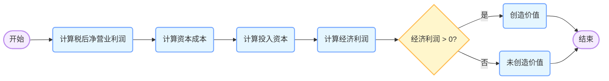

# 经济利润模型：衡量真实价值创造的工具

> 关键词：经济利润模型、真实价值创造、价值衡量、财务管理、企业决策

> 摘要：本文围绕经济利润模型展开，深入探讨其作为衡量真实价值创造工具的原理、应用及意义。首先介绍了经济利润模型的背景知识，包括目的、预期读者、文档结构和相关术语。接着阐述了核心概念与联系，通过文本示意图和 Mermaid 流程图展示其架构。详细讲解了核心算法原理，并用 Python 代码进行了具体实现。同时给出了数学模型和公式，并结合实例进行说明。通过项目实战，展示了经济利润模型在实际中的应用，包括开发环境搭建、源代码实现和代码解读。分析了经济利润模型的实际应用场景，推荐了相关的学习资源、开发工具框架和论文著作。最后总结了经济利润模型的未来发展趋势与挑战，解答了常见问题，并提供了扩展阅读和参考资料，旨在帮助读者全面理解和应用经济利润模型来衡量企业的真实价值创造。

## 1. 背景介绍 

### 1.1 目的和范围
在当今竞争激烈的商业环境中，准确衡量企业的真实价值创造至关重要。传统的会计利润指标往往不能全面反映企业的经营绩效和价值创造能力，因为它们没有考虑到资本成本。经济利润模型作为一种更为先进的衡量工具，将资本成本纳入考量，能够更准确地评估企业在一定时期内为股东创造的价值。

本文的目的是深入介绍经济利润模型的原理、算法、应用及相关资源，帮助读者理解如何使用该模型来衡量企业的真实价值创造。范围涵盖经济利润模型的基本概念、核心算法、数学模型、实际应用案例，以及相关的学习资源和工具推荐等方面。

### 1.2 预期读者
本文的预期读者包括企业管理人员、财务分析师、投资者、学术研究人员以及对财务管理和价值评估感兴趣的人士。对于企业管理人员来说，经济利润模型可以帮助他们更好地制定战略决策，优化资源配置；财务分析师可以利用该模型更准确地评估企业的财务状况和经营绩效；投资者可以借助经济利润模型判断企业的投资价值；学术研究人员则可以深入研究该模型的理论和应用。

### 1.3 文档结构概述
本文将按照以下结构进行阐述：首先介绍经济利润模型的背景知识，包括目的、预期读者、文档结构和相关术语；接着详细讲解核心概念与联系，通过文本示意图和 Mermaid 流程图展示其架构；然后阐述核心算法原理，并使用 Python 代码进行具体实现；给出数学模型和公式，并结合实例进行说明；通过项目实战，展示经济利润模型在实际中的应用，包括开发环境搭建、源代码实现和代码解读；分析经济利润模型的实际应用场景；推荐相关的学习资源、开发工具框架和论文著作；最后总结经济利润模型的未来发展趋势与挑战，解答常见问题，并提供扩展阅读和参考资料。

### 1.4 术语表

#### 1.4.1 核心术语定义
- **经济利润（Economic Profit）**：又称经济增加值（EVA），是指企业税后净营业利润减去全部资本成本后的余额。它反映了企业在扣除所有成本（包括权益资本成本和债务资本成本）后所创造的价值。
- **税后净营业利润（NOPAT）**：是指企业在不考虑利息支出的情况下，经过调整后的税后净利润。它是衡量企业经营盈利能力的重要指标。
- **资本成本（Cost of Capital）**：是指企业为筹集和使用资金而付出的代价，包括权益资本成本和债务资本成本。权益资本成本是指股东要求的最低回报率，债务资本成本是指企业支付给债权人的利息率。
- **投入资本（Invested Capital）**：是指企业在经营活动中所投入的全部资本，包括股东权益和债务资本。它反映了企业的投资规模和资金来源。

#### 1.4.2 相关概念解释
- **会计利润（Accounting Profit）**：是指企业在一定会计期间的经营成果，通常按照会计准则计算得出。会计利润只考虑了显性成本，如原材料成本、人工成本、折旧等，没有考虑到权益资本成本。
- **机会成本（Opportunity Cost）**：是指企业为了获取某种收益而放弃的其他可能的最大收益。在经济利润模型中，权益资本成本可以看作是股东将资金投入该企业而放弃的其他投资机会的机会成本。
- **价值创造（Value Creation）**：是指企业通过经营活动为股东和社会创造的价值。经济利润模型认为，只有当企业的经济利润大于零时，企业才真正创造了价值。

#### 1.4.3 缩略词列表
- **EVA**：Economic Value Added，经济增加值
- **NOPAT**：Net Operating Profit After Tax，税后净营业利润
- **WACC**：Weighted Average Cost of Capital，加权平均资本成本

## 2. 核心概念与联系 

经济利润模型的核心概念主要包括税后净营业利润（NOPAT）、资本成本和投入资本。这些概念之间存在着紧密的联系，通过经济利润的计算公式相互关联。

### 核心概念原理
经济利润的计算公式为：
$$经济利润 = 税后净营业利润 - 资本成本×投入资本$$

税后净营业利润反映了企业的经营盈利能力，是企业在不考虑利息支出的情况下，经过调整后的税后净利润。资本成本是企业为筹集和使用资金而付出的代价，包括权益资本成本和债务资本成本。投入资本是企业在经营活动中所投入的全部资本，包括股东权益和债务资本。

经济利润模型的原理是，企业只有在创造的收益超过其资本成本时，才真正为股东创造了价值。如果经济利润为正，说明企业的经营活动创造了超过资本成本的价值，股东的财富得到了增加；如果经济利润为负，说明企业的经营活动未能弥补资本成本，股东的财富受到了损失。

### 架构的文本示意图
```plaintext
                经济利润模型
                   |
                   |
           +----------------+
           |  税后净营业利润  |
           +----------------+
                   |
                   |
           +----------------+
           |    资本成本    |
           +----------------+
                   |
                   |
           +----------------+
           |    投入资本    |
           +----------------+
                   |
                   |
           +----------------+
           |    经济利润    |
           +----------------+
```

### Mermaid 流程图


## 3. 核心算法原理 & 具体操作步骤 

### 核心算法原理
经济利润的计算主要涉及三个步骤：计算税后净营业利润、计算资本成本和计算投入资本，最后根据经济利润的计算公式得出结果。

#### 计算税后净营业利润
税后净营业利润的计算公式为：
$$税后净营业利润 = 净利润 + 利息支出×(1 - 所得税税率)$$

其中，净利润是企业在一定会计期间的经营成果，利息支出是企业支付给债权人的利息费用，所得税税率是企业适用的所得税税率。

#### 计算资本成本
资本成本通常使用加权平均资本成本（WACC）来衡量，其计算公式为：
$$WACC = 权益资本比重×权益资本成本 + 债务资本比重×债务资本成本×(1 - 所得税税率)$$

其中，权益资本比重是指股东权益占投入资本的比例，债务资本比重是指债务资本占投入资本的比例，权益资本成本是指股东要求的最低回报率，债务资本成本是指企业支付给债权人的利息率。

#### 计算投入资本
投入资本的计算公式为：
$$投入资本 = 股东权益 + 债务资本$$

#### 计算经济利润
根据经济利润的计算公式：
$$经济利润 = 税后净营业利润 - 资本成本×投入资本$$

### 具体操作步骤
以下是使用 Python 代码实现经济利润计算的具体步骤：

```python
# 步骤 1: 定义参数
net_income = 1000000  # 净利润
interest_expense = 200000  # 利息支出
tax_rate = 0.25  # 所得税税率
equity = 5000000  # 股东权益
debt = 3000000  # 债务资本
equity_cost = 0.1  # 权益资本成本
debt_cost = 0.05  # 债务资本成本

# 步骤 2: 计算税后净营业利润
nopat = net_income + interest_expense * (1 - tax_rate)

# 步骤 3: 计算投入资本
invested_capital = equity + debt

# 步骤 4: 计算权益资本比重和债务资本比重
equity_weight = equity / invested_capital
debt_weight = debt / invested_capital

# 步骤 5: 计算加权平均资本成本 (WACC)
wacc = equity_weight * equity_cost + debt_weight * debt_cost * (1 - tax_rate)

# 步骤 6: 计算经济利润
economic_profit = nopat - wacc * invested_capital

# 步骤 7: 输出结果
print(f"税后净营业利润: {nopat}")
print(f"投入资本: {invested_capital}")
print(f"加权平均资本成本 (WACC): {wacc}")
print(f"经济利润: {economic_profit}")
```

### 代码解释
- **步骤 1**：定义了计算所需的参数，包括净利润、利息支出、所得税税率、股东权益、债务资本、权益资本成本和债务资本成本。
- **步骤 2**：根据税后净营业利润的计算公式，计算出税后净营业利润。
- **步骤 3**：根据投入资本的计算公式，计算出投入资本。
- **步骤 4**：计算权益资本比重和债务资本比重。
- **步骤 5**：根据加权平均资本成本的计算公式，计算出加权平均资本成本。
- **步骤 6**：根据经济利润的计算公式，计算出经济利润。
- **步骤 7**：输出计算结果，包括税后净营业利润、投入资本、加权平均资本成本和经济利润。

## 4. 数学模型和公式 & 详细讲解 & 举例说明 

### 数学模型和公式
经济利润模型的核心数学模型和公式如下：

#### 税后净营业利润计算公式
$$NOPAT = 净利润 + 利息支出×(1 - 所得税税率)$$

#### 加权平均资本成本计算公式
$$WACC = w_e×r_e + w_d×r_d×(1 - t)$$

其中，$w_e$ 是权益资本比重，$r_e$ 是权益资本成本，$w_d$ 是债务资本比重，$r_d$ 是债务资本成本，$t$ 是所得税税率。

#### 投入资本计算公式
$$投入资本 = 股东权益 + 债务资本$$

#### 经济利润计算公式
$$经济利润 = NOPAT - WACC×投入资本$$

### 详细讲解
- **税后净营业利润（NOPAT）**：该公式考虑了利息支出的抵税作用。由于利息支出可以在税前扣除，因此在计算税后净营业利润时，需要将利息支出乘以 $(1 - 所得税税率)$ 后加回到净利润中。这样可以更准确地反映企业的经营盈利能力。
- **加权平均资本成本（WACC）**：该公式综合考虑了权益资本成本和债务资本成本，以及它们在投入资本中所占的比重。权益资本成本反映了股东要求的最低回报率，债务资本成本反映了企业支付给债权人的利息率。由于债务利息可以在税前扣除，因此债务资本成本需要乘以 $(1 - 所得税税率)$。
- **投入资本**：投入资本是企业在经营活动中所投入的全部资本，包括股东权益和债务资本。它反映了企业的投资规模和资金来源。
- **经济利润**：经济利润是企业税后净营业利润减去全部资本成本后的余额。它反映了企业在扣除所有成本（包括权益资本成本和债务资本成本）后所创造的价值。

### 举例说明
假设某企业的相关财务数据如下：
- 净利润：$500,000$ 元
- 利息支出：$100,000$ 元
- 所得税税率：$25\%$
- 股东权益：$2,000,000$ 元
- 债务资本：$1,000,000$ 元
- 权益资本成本：$10\%$
- 债务资本成本：$5\%$

#### 计算税后净营业利润
$$NOPAT = 500000 + 100000×(1 - 0.25) = 500000 + 75000 = 575000$$（元）

#### 计算投入资本
$$投入资本 = 2000000 + 1000000 = 3000000$$（元）

#### 计算权益资本比重和债务资本比重
$$w_e = \frac{2000000}{3000000} = \frac{2}{3}$$
$$w_d = \frac{1000000}{3000000} = \frac{1}{3}$$

#### 计算加权平均资本成本（WACC）
$$WACC = \frac{2}{3}×0.1 + \frac{1}{3}×0.05×(1 - 0.25) = \frac{2}{3}×0.1 + \frac{1}{3}×0.0375 \approx 0.0667 + 0.0125 = 0.0792$$

#### 计算经济利润
$$经济利润 = 575000 - 0.0792×3000000 = 575000 - 237600 = 337400$$（元）

通过计算可知，该企业的经济利润为 $337,400$ 元，说明企业在扣除所有成本后创造了一定的价值。

## 5. 项目实战：代码实际案例和详细解释说明 

### 5.1  开发环境搭建
为了实现经济利润模型的计算，我们可以使用 Python 编程语言。以下是搭建开发环境的步骤：

#### 安装 Python
首先，需要从 Python 官方网站（https://www.python.org/downloads/）下载并安装 Python。根据自己的操作系统选择合适的版本进行下载和安装。

#### 安装开发工具
可以选择使用集成开发环境（IDE）或文本编辑器来编写 Python 代码。常用的 IDE 有 PyCharm、VS Code 等，文本编辑器有 Sublime Text、Notepad++ 等。这里以 PyCharm 为例，从 JetBrains 官方网站（https://www.jetbrains.com/pycharm/download/）下载并安装 PyCharm。

#### 创建项目
打开 PyCharm，选择 `File` -> `New Project`，创建一个新的 Python 项目。选择合适的项目路径和 Python 解释器，然后点击 `Create` 按钮创建项目。

### 5.2  源代码详细实现和代码解读
以下是一个完整的 Python 代码示例，用于计算经济利润：

```python
# 定义计算经济利润的函数
def calculate_economic_profit(net_income, interest_expense, tax_rate, equity, debt, equity_cost, debt_cost):
    # 计算税后净营业利润
    nopat = net_income + interest_expense * (1 - tax_rate)
    # 计算投入资本
    invested_capital = equity + debt
    # 计算权益资本比重和债务资本比重
    equity_weight = equity / invested_capital
    debt_weight = debt / invested_capital
    # 计算加权平均资本成本 (WACC)
    wacc = equity_weight * equity_cost + debt_weight * debt_cost * (1 - tax_rate)
    # 计算经济利润
    economic_profit = nopat - wacc * invested_capital
    return economic_profit

# 定义参数
net_income = 800000  # 净利润
interest_expense = 150000  # 利息支出
tax_rate = 0.2  # 所得税税率
equity = 4000000  # 股东权益
debt = 2000000  # 债务资本
equity_cost = 0.12  # 权益资本成本
debt_cost = 0.06  # 债务资本成本

# 调用函数计算经济利润
ep = calculate_economic_profit(net_income, interest_expense, tax_rate, equity, debt, equity_cost, debt_cost)

# 输出结果
print(f"经济利润: {ep}")
```

### 代码解读与分析
- **函数定义**：`calculate_economic_profit` 函数接受净利润、利息支出、所得税税率、股东权益、债务资本、权益资本成本和债务资本成本作为参数，用于计算经济利润。函数内部按照经济利润的计算步骤，依次计算税后净营业利润、投入资本、加权平均资本成本和经济利润，并返回经济利润的值。
- **参数定义**：定义了计算所需的参数，包括净利润、利息支出、所得税税率、股东权益、债务资本、权益资本成本和债务资本成本。
- **函数调用**：调用 `calculate_economic_profit` 函数，传入定义好的参数，计算经济利润。
- **结果输出**：使用 `print` 函数输出计算得到的经济利润。

通过这个代码示例，我们可以方便地计算不同企业的经济利润，从而评估企业的真实价值创造能力。

## 6. 实际应用场景 
经济利润模型在企业管理、投资决策、业绩评价等方面有着广泛的应用。

### 企业战略决策
企业在制定战略决策时，需要考虑项目或业务的价值创造能力。经济利润模型可以帮助企业管理层评估不同战略方案的可行性和价值创造潜力。例如，在进行投资决策时，企业可以使用经济利润模型计算不同投资项目的经济利润，选择经济利润最大的项目进行投资，从而实现企业价值的最大化。

### 业绩评价
经济利润模型可以作为一种更准确的业绩评价指标，用于评估企业管理层的经营绩效。传统的会计利润指标没有考虑到资本成本，可能会导致管理层追求短期利润而忽视了企业的长期价值创造。而经济利润模型将资本成本纳入考量，能够更真实地反映企业管理层为股东创造的价值。企业可以根据经济利润的大小对管理层进行绩效考核，激励管理层采取有利于企业价值创造的决策和行动。

### 投资者决策
投资者在选择投资对象时，通常会关注企业的盈利能力和价值创造能力。经济利润模型可以帮助投资者更准确地评估企业的投资价值。投资者可以通过计算企业的经济利润，了解企业在扣除所有成本后是否真正创造了价值。如果企业的经济利润持续为正，说明企业具有较强的价值创造能力，可能是一个值得投资的对象；反之，如果企业的经济利润长期为负，说明企业的经营活动未能弥补资本成本，投资者需要谨慎考虑是否投资该企业。

### 企业并购与重组
在企业并购与重组过程中，经济利润模型可以用于评估目标企业的价值和并购重组的协同效应。通过计算目标企业的经济利润，并购方可以了解目标企业的真实价值创造能力，从而合理确定并购价格。同时，经济利润模型还可以帮助企业评估并购重组后的协同效应，即并购重组后企业的经济利润是否会增加。如果协同效应显著，说明并购重组具有可行性；反之，如果协同效应不明显或为负，企业需要重新考虑并购重组的决策。

## 7. 工具和资源推荐

### 7.1 学习资源推荐

#### 7.1.1 书籍推荐
- 《经济增加值基础教程》：本书详细介绍了经济增加值（EVA）的基本概念、计算方法和应用案例，是学习经济利润模型的入门佳作。
- 《价值评估：公司价值的衡量与管理》：该书全面阐述了企业价值评估的理论和方法，包括经济利润模型等多种价值评估模型，适合有一定财务基础的读者深入学习。
- 《财务管理学》：这是一本经典的财务管理教材，其中包含了经济利润模型等财务管理的核心内容，对于系统学习财务管理知识非常有帮助。

#### 7.1.2 在线课程
- Coursera 平台上的“财务管理基础”课程：该课程由知名高校的教授授课，涵盖了财务管理的基本概念、财务报表分析、资本预算等内容，其中也包括经济利润模型的讲解。
- edX 平台上的“企业价值评估”课程：课程详细介绍了企业价值评估的各种方法，包括经济利润模型的应用，通过案例分析和实践操作，帮助学员掌握企业价值评估的技能。

#### 7.1.3 技术博客和网站
- 财新网：提供了丰富的财经资讯和专业的财务分析文章，其中不乏关于经济利润模型在企业财务分析中的应用案例和研究成果。
- 雪球网：是一个投资者交流社区，有很多投资者分享自己对企业价值评估的经验和见解，包括对经济利润模型的应用和讨论。

### 7.2 开发工具框架推荐

#### 7.2.1 IDE和编辑器
- PyCharm：是一款专门为 Python 开发设计的集成开发环境，具有强大的代码编辑、调试、自动补全和代码分析等功能，非常适合开发经济利润模型的 Python 代码。
- VS Code：是一款轻量级的文本编辑器，支持多种编程语言，通过安装 Python 扩展插件，可以方便地进行 Python 代码的开发和调试。

#### 7.2.2 调试和性能分析工具
- pdb：是 Python 自带的调试工具，可以帮助开发者在代码执行过程中设置断点、查看变量值和执行流程，方便排查代码中的错误。
- cProfile：是 Python 的性能分析工具，可以分析代码的运行时间和函数调用情况，帮助开发者找出代码中的性能瓶颈，进行优化。

#### 7.2.3 相关框架和库
- NumPy：是 Python 的一个科学计算库，提供了高效的多维数组对象和各种数学函数，在进行经济利润模型的计算时，可以使用 NumPy 进行数值计算和数组操作。
- Pandas：是 Python 的一个数据处理和分析库，提供了 DataFrame 和 Series 等数据结构，方便进行数据的读取、清洗、分析和可视化，在处理经济利润模型所需的财务数据时非常有用。

### 7.3 相关论文著作推荐

#### 7.3.1 经典论文
- 《Economic Value Added: A New Approach to Performance Measurement》：该论文首次提出了经济增加值（EVA）的概念，并详细阐述了其计算方法和应用价值，是经济利润模型领域的经典之作。
- 《The Link Between EVA and Market Value》：论文研究了经济增加值（EVA）与企业市场价值之间的关系，通过实证分析证明了 EVA 能够更准确地反映企业的价值创造能力。

#### 7.3.2 最新研究成果
- 《EVA-Based Performance Evaluation and Incentive Mechanisms in Chinese Listed Companies》：该研究关注了经济增加值（EVA）在中国上市公司业绩评价和激励机制中的应用，分析了 EVA 在我国企业中的实践效果和存在的问题。
- 《The Impact of EVA on Corporate Governance: Evidence from Emerging Markets》：论文探讨了经济增加值（EVA）对新兴市场企业治理的影响，通过实证研究发现 EVA 的应用有助于提高企业的治理水平和价值创造能力。

#### 7.3.3 应用案例分析
- 《Case Study: Applying EVA in a Manufacturing Company》：该案例分析了一家制造企业如何应用经济增加值（EVA）进行业绩评价和战略决策，详细介绍了 EVA 的计算过程和应用效果，为其他企业提供了借鉴。
- 《EVA Implementation in a Financial Institution: Lessons Learned》：案例研究了一家金融机构实施经济增加值（EVA）的过程和经验教训，分析了 EVA 在金融行业的应用特点和挑战。

## 8. 总结：未来发展趋势与挑战
经济利润模型作为一种衡量企业真实价值创造的工具，在过去几十年中得到了广泛的应用和发展。随着经济环境的变化和企业管理理念的更新，经济利润模型也面临着新的发展趋势和挑战。

### 未来发展趋势
- **与战略管理的深度融合**：未来，经济利润模型将不仅仅是一个财务指标，而是与企业的战略管理更加紧密地结合。企业将利用经济利润模型来评估战略方案的可行性和价值创造潜力，制定更加科学合理的战略决策。同时，战略的实施过程也将以经济利润的增长为导向，通过优化资源配置和业务流程，提高企业的价值创造能力。
- **考虑更多的非财务因素**：传统的经济利润模型主要关注财务指标，忽略了一些非财务因素对企业价值创造的影响。未来，经济利润模型将逐渐纳入更多的非财务因素，如客户满意度、员工满意度、创新能力等。这些非财务因素虽然难以直接用货币计量，但对企业的长期发展和价值创造具有重要的影响。通过考虑非财务因素，经济利润模型可以更全面地反映企业的真实价值创造能力。
- **在新兴领域的应用拓展**：随着科技的不断进步和新兴产业的兴起，经济利润模型将在更多的新兴领域得到应用。例如，在共享经济、人工智能、区块链等领域，企业的商业模式和价值创造方式与传统行业有很大的不同。经济利润模型需要不断创新和改进，以适应这些新兴领域的特点和需求，为企业的价值评估和决策提供更加准确的依据。

### 挑战
- **数据获取和准确性**：经济利润模型的计算需要大量的财务数据和市场数据，如净利润、利息支出、权益资本成本、债务资本成本等。然而，在实际应用中，数据的获取可能存在困难，尤其是一些非上市公司或新兴企业的数据可能不完整或不准确。此外，数据的质量也会影响经济利润模型的计算结果，因此需要建立有效的数据收集和管理机制，确保数据的准确性和可靠性。
- **资本成本的确定**：资本成本是经济利润模型中的一个重要参数，其确定方法存在一定的主观性和复杂性。权益资本成本的计算通常需要考虑市场风险、企业特定风险等因素，不同的计算方法可能会得出不同的结果。债务资本成本的确定也受到市场利率、企业信用评级等因素的影响。因此，如何准确地确定资本成本是经济利润模型应用中的一个挑战。
- **模型的复杂性和可理解性**：随着经济利润模型的不断发展和完善，其计算方法和模型结构变得越来越复杂。这对于一些非专业人士来说，理解和应用经济利润模型可能存在一定的困难。因此，需要对经济利润模型进行简化和普及，提高其可理解性和实用性，以便更多的企业和投资者能够使用该模型来评估企业的价值创造能力。

## 9. 附录：常见问题与解答
### 问题 1：经济利润和会计利润有什么区别？
答：会计利润是指企业在一定会计期间的经营成果，通常按照会计准则计算得出。会计利润只考虑了显性成本，如原材料成本、人工成本、折旧等，没有考虑到权益资本成本。而经济利润是指企业税后净营业利润减去全部资本成本后的余额，它将权益资本成本纳入考量，能够更准确地反映企业在扣除所有成本后所创造的价值。

### 问题 2：如何确定权益资本成本？
答：确定权益资本成本的方法有多种，常见的方法包括资本资产定价模型（CAPM）、股息折现模型（DDM）等。资本资产定价模型（CAPM）的计算公式为：$r_e = r_f + \beta×(r_m - r_f)$，其中 $r_e$ 是权益资本成本，$r_f$ 是无风险利率，$\beta$ 是股票的贝塔系数，$r_m$ 是市场收益率。股息折现模型（DDM）则是根据股票的股息支付情况来计算权益资本成本。

### 问题 3：经济利润模型适用于所有企业吗？
答：经济利润模型适用于大多数企业，但在某些情况下可能存在一定的局限性。例如，对于一些处于初创期或高速发展期的企业，由于其未来的现金流和盈利情况具有较大的不确定性，经济利润模型的计算结果可能不够准确。此外，对于一些非盈利组织或公共事业企业，其目标可能不是追求经济利润最大化，经济利润模型的应用可能不太合适。

### 问题 4：如何提高企业的经济利润？
答：提高企业的经济利润可以从以下几个方面入手：一是提高税后净营业利润，通过优化业务流程、降低成本、提高产品或服务的价格等方式来增加企业的营业收入和利润；二是降低资本成本，通过合理安排资本结构、优化融资渠道等方式来降低权益资本成本和债务资本成本；三是合理配置投入资本，将资本投入到回报率较高的项目或业务中，提高资本的使用效率。

## 10. 扩展阅读 & 参考资料
### 扩展阅读
- 《公司财务原理》：本书深入探讨了公司财务的基本原理和方法，包括资本预算、资本结构、股利政策等内容，对于进一步理解经济利润模型在企业财务决策中的应用具有重要的参考价值。
- 《金融市场与金融机构》：了解金融市场和金融机构的运作机制，有助于更好地理解资本成本的确定和企业的融资决策，从而更准确地应用经济利润模型。

### 参考资料
- 《经济增加值与价值管理》：为经济利润模型的研究和应用提供了丰富的理论和实践案例。
- 《财务管理分析》：详细介绍了财务管理的各种分析方法和工具，其中包括经济利润模型的分析和应用。
- 相关的学术期刊和研究报告，如《会计研究》、《金融研究》等，提供了经济利润模型领域的最新研究成果和实践经验。