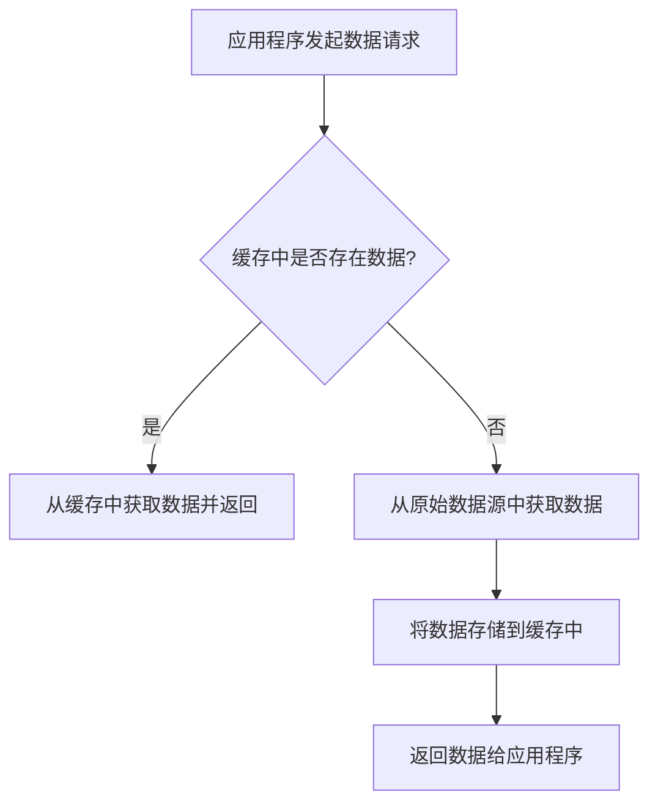

# 缓存策略优化：性能提升方案

> 关键词：缓存策略、性能优化、缓存算法、缓存命中率、缓存淘汰、分布式缓存、本地缓存

> 摘要：本文围绕缓存策略优化展开，旨在深入探讨如何通过合理的缓存策略来提升系统性能。首先介绍了缓存的背景知识，包括目的、预期读者等内容。接着详细阐述了缓存的核心概念与联系，通过文本示意图和 Mermaid 流程图进行清晰展示。然后深入讲解了核心算法原理，结合 Python 源代码进行说明，并给出了相关的数学模型和公式。通过项目实战，展示了缓存策略在实际代码中的应用和详细解释。之后探讨了缓存策略的实际应用场景，推荐了学习、开发工具和相关论文著作等资源。最后对缓存策略的未来发展趋势与挑战进行总结，并提供了常见问题与解答以及扩展阅读和参考资料，为读者全面了解和优化缓存策略提供了系统的指导。

## 1. 背景介绍 
### 1.1 目的和范围
在当今的软件开发和系统设计中，性能是一个至关重要的指标。随着数据量的不断增长和用户访问量的日益增加，系统的响应时间和吞吐量面临着巨大的挑战。缓存作为一种提高系统性能的有效手段，被广泛应用于各种场景中。本文的目的是深入探讨缓存策略的优化方法，以提升系统的性能。范围涵盖了常见的缓存类型（如本地缓存、分布式缓存）、缓存算法（如 LRU、LFU 等）、缓存的使用场景以及如何根据不同的需求选择和优化缓存策略。

### 1.2 预期读者
本文的预期读者包括软件开发人员、系统架构师、性能优化工程师等对系统性能有追求的技术人员。对于正在学习缓存相关知识的初学者，也可以通过本文建立起对缓存策略的全面认识；对于有一定经验的专业人士，本文提供的深入分析和优化方案可以作为参考，帮助他们进一步提升系统的性能。

### 1.3 文档结构概述
本文将按照以下结构进行组织：首先介绍缓存的背景知识，包括目的、预期读者和文档结构概述等内容；接着阐述缓存的核心概念与联系，通过文本示意图和 Mermaid 流程图进行展示；然后讲解核心算法原理，结合 Python 源代码进行说明，并给出相关的数学模型和公式；通过项目实战，展示缓存策略在实际代码中的应用和详细解释；之后探讨缓存策略的实际应用场景；推荐学习、开发工具和相关论文著作等资源；最后对缓存策略的未来发展趋势与挑战进行总结，并提供常见问题与解答以及扩展阅读和参考资料。

### 1.4 术语表
#### 1.4.1 核心术语定义
- **缓存（Cache）**：是一种高速数据存储区域，用于存储经常访问的数据，以便在后续访问时能够快速获取，减少对原始数据源（如数据库、磁盘等）的访问，从而提高系统性能。
- **缓存命中率（Cache Hit Rate）**：指的是在缓存中成功找到所需数据的请求次数与总请求次数的比值，是衡量缓存性能的重要指标之一。
- **缓存淘汰策略（Cache Eviction Policy）**：当缓存空间不足时，用于决定哪些数据需要从缓存中移除的策略。
- **本地缓存（Local Cache）**：是指在应用程序进程内部的缓存，数据存储在应用程序所在的服务器内存中，访问速度快，但缓存空间有限，且无法在多个应用实例之间共享。
- **分布式缓存（Distributed Cache）**：是一种在多个服务器节点之间共享的缓存系统，通过网络连接多个缓存节点，扩大了缓存的容量，并且可以在多个应用实例之间共享数据。

#### 1.4.2 相关概念解释
- **主存（Main Memory）**：即计算机的内存，是计算机运行时程序和数据存储的主要区域，与缓存相比，访问速度较慢。
- **磁盘存储（Disk Storage）**：是一种长期的数据存储方式，如硬盘、固态硬盘等，访问速度远低于缓存和主存。
- **数据一致性（Data Consistency）**：在使用缓存时，需要保证缓存中的数据与原始数据源中的数据一致，否则可能会导致数据错误。

#### 1.4.3 缩略词列表
- **LRU（Least Recently Used）**：最近最少使用算法，是一种常见的缓存淘汰策略。
- **LFU（Least Frequently Used）**：最不经常使用算法，也是一种缓存淘汰策略。
- **FIFO（First In First Out）**：先进先出算法，同样可作为缓存淘汰策略。
- **Redis（Remote Dictionary Server）**：是一个开源的、高性能的键值对存储数据库，常被用作分布式缓存。

## 2. 核心概念与联系 

### 核心概念原理
缓存的核心原理是利用数据的局部性原理，即程序在一段时间内往往会频繁访问相同或相近的数据。通过将这些数据存储在高速的缓存中，当再次访问这些数据时，就可以直接从缓存中获取，而不需要从慢速的原始数据源中读取，从而提高系统的性能。

缓存的工作流程一般如下：当有数据访问请求时，首先检查缓存中是否存在该数据。如果存在，则直接从缓存中返回数据，这称为缓存命中（Cache Hit）；如果不存在，则从原始数据源中获取数据，并将其存储到缓存中，然后再返回数据，这称为缓存未命中（Cache Miss）。

### 架构的文本示意图
```plaintext
+----------------+           +----------------+           +----------------+
| 应用程序        | <------> | 缓存系统        | <------> | 原始数据源      |
+----------------+           +----------------+           +----------------+
```
在这个示意图中，应用程序首先尝试从缓存系统中获取数据。如果缓存命中，应用程序直接从缓存中获取数据；如果缓存未命中，缓存系统会从原始数据源中获取数据，并将其存储在缓存中，然后返回给应用程序。

### Mermaid 流程图


## 3. 核心算法原理 & 具体操作步骤 

### 常见缓存算法原理
#### LRU（Least Recently Used）算法
LRU 算法的核心思想是，当缓存空间不足时，优先淘汰最近最少使用的数据。其实现原理可以使用双向链表和哈希表的组合。双向链表用于维护数据的访问顺序，哈希表用于快速查找数据。

以下是使用 Python 实现的 LRU 缓存类：
```python
class LRUCache:
    def __init__(self, capacity):
        self.capacity = capacity
        self.cache = {}
        self.order = []

    def get(self, key):
        if key in self.cache:
            # 将访问的元素移到链表尾部，表示最近使用
            self.order.remove(key)
            self.order.append(key)
            return self.cache[key]
        else:
            return -1

    def put(self, key, value):
        if key in self.cache:
            # 如果 key 已经存在，更新 value 并移到链表尾部
            self.order.remove(key)
        elif len(self.cache) == self.capacity:
            # 如果缓存已满，淘汰最旧的元素
            oldest_key = self.order.pop(0)
            del self.cache[oldest_key]
        # 添加新元素到链表尾部
        self.cache[key] = value
        self.order.append(key)
```

#### LFU（Least Frequently Used）算法
LFU 算法的核心思想是，当缓存空间不足时，优先淘汰使用频率最低的数据。其实现可以使用哈希表和最小堆的组合，哈希表用于存储数据和对应的访问频率，最小堆用于快速找到使用频率最低的数据。

以下是一个简化的 LFU 缓存类的 Python 实现：
```python
import heapq
from collections import defaultdict

class LFUCache:
    def __init__(self, capacity):
        self.capacity = capacity
        self.cache = {}
        self.frequency = defaultdict(int)
        self.heap = []
        self.counter = 0

    def get(self, key):
        if key in self.cache:
            self.frequency[key] += 1
            self.counter += 1
            # 重新调整堆
            for i, (freq, count, k) in enumerate(self.heap):
                if k == key:
                    self.heap[i] = (self.frequency[key], self.counter, key)
                    heapq.heapify(self.heap)
                    break
            return self.cache[key]
        else:
            return -1

    def put(self, key, value):
        if self.capacity == 0:
            return
        if key in self.cache:
            self.frequency[key] += 1
            self.counter += 1
            # 重新调整堆
            for i, (freq, count, k) in enumerate(self.heap):
                if k == key:
                    self.heap[i] = (self.frequency[key], self.counter, key)
                    heapq.heapify(self.heap)
                    break
        else:
            if len(self.cache) == self.capacity:
                # 淘汰使用频率最低的元素
                _, _, oldest_key = heapq.heappop(self.heap)
                del self.cache[oldest_key]
                del self.frequency[oldest_key]
            self.frequency[key] = 1
            self.counter += 1
            heapq.heappush(self.heap, (1, self.counter, key))
        self.cache[key] = value
```

### 具体操作步骤
1. **初始化缓存**：根据缓存的容量和使用的算法，创建相应的缓存对象。
2. **数据访问**：当有数据访问请求时，调用缓存对象的 `get` 方法，检查缓存中是否存在该数据。
3. **缓存更新**：如果数据不存在，从原始数据源中获取数据，并调用缓存对象的 `put` 方法将数据存储到缓存中。
4. **缓存淘汰**：当缓存空间不足时，根据使用的缓存淘汰算法，自动淘汰相应的数据。

## 4. 数学模型和公式 & 详细讲解 & 举例说明 

### 缓存命中率公式
缓存命中率（Cache Hit Rate）是衡量缓存性能的重要指标，其计算公式为：
$$
\text{Cache Hit Rate} = \frac{\text{Cache Hits}}{\text{Total Requests}}
$$
其中，$\text{Cache Hits}$ 表示在缓存中成功找到所需数据的请求次数，$\text{Total Requests}$ 表示总的数据访问请求次数。

### 缓存性能提升公式
缓存可以显著提升系统的性能，假设原始数据源的访问时间为 $T_d$，缓存的访问时间为 $T_c$，缓存命中率为 $H$，则使用缓存后的平均访问时间 $T_{avg}$ 可以通过以下公式计算：
$$
T_{avg} = H \times T_c + (1 - H) \times T_d
$$

### 详细讲解
缓存命中率反映了缓存的有效性，命中率越高，说明缓存中存储的数据越能满足用户的访问需求，系统的性能提升越明显。

平均访问时间公式表明，缓存的性能提升主要取决于缓存命中率和缓存与原始数据源的访问时间差。当缓存命中率接近 1 时，平均访问时间接近缓存的访问时间，系统性能得到极大提升；当缓存命中率接近 0 时，平均访问时间接近原始数据源的访问时间，缓存的作用不明显。

### 举例说明
假设原始数据源的访问时间 $T_d = 100$ 毫秒，缓存的访问时间 $T_c = 1$ 毫秒。
- 当缓存命中率 $H = 0.9$ 时，平均访问时间为：
$$
T_{avg} = 0.9 \times 1 + (1 - 0.9) \times 100 = 0.9 + 10 = 10.9 \text{ 毫秒}
$$
- 当缓存命中率 $H = 0.5$ 时，平均访问时间为：
$$
T_{avg} = 0.5 \times 1 + (1 - 0.5) \times 100 = 0.5 + 50 = 50.5 \text{ 毫秒}
$$

从上述例子可以看出，缓存命中率对系统性能的影响非常大。提高缓存命中率是优化缓存策略的关键目标之一。

## 5. 项目实战：代码实际案例和详细解释说明 

### 5.1  开发环境搭建
本项目使用 Python 语言进行开发，以下是开发环境的搭建步骤：
1. **安装 Python**：从 Python 官方网站（https://www.python.org/downloads/）下载并安装 Python 3.x 版本。
2. **安装 Redis（如果使用分布式缓存）**：从 Redis 官方网站（https://redis.io/download）下载并安装 Redis 服务器。安装完成后，启动 Redis 服务器。
3. **安装相关 Python 库**：使用 `pip` 安装所需的 Python 库，如 `redis` 库（如果使用 Redis 作为分布式缓存）。
```bash
pip install redis
```

### 5.2  源代码详细实现和代码解读
#### 本地缓存示例
以下是一个使用 Python 字典实现的简单本地缓存示例：
```python
class LocalCache:
    def __init__(self, capacity):
        self.capacity = capacity
        self.cache = {}

    def get(self, key):
        if key in self.cache:
            return self.cache[key]
        else:
            return -1

    def put(self, key, value):
        if len(self.cache) == self.capacity:
            # 简单的淘汰策略：删除第一个元素
            oldest_key = next(iter(self.cache))
            del self.cache[oldest_key]
        self.cache[key] = value


# 使用示例
cache = LocalCache(3)
cache.put('key1', 'value1')
cache.put('key2', 'value2')
cache.put('key3', 'value3')
print(cache.get('key2'))  # 输出: value2
cache.put('key4', 'value4')
print(cache.get('key1'))  # 输出: -1，因为 key1 已被淘汰
```
**代码解读**：
- `__init__` 方法：初始化缓存的容量和缓存字典。
- `get` 方法：检查缓存中是否存在指定的键，如果存在则返回对应的值，否则返回 -1。
- `put` 方法：如果缓存已满，删除第一个元素，然后添加新的键值对到缓存中。

#### 分布式缓存示例（使用 Redis）
以下是一个使用 Redis 作为分布式缓存的示例：
```python
import redis

# 连接到 Redis 服务器
r = redis.Redis(host='localhost', port=6379, db=0)

def get_data(key):
    data = r.get(key)
    if data:
        return data.decode('utf-8')
    else:
        # 模拟从原始数据源获取数据
        data = 'data from original source'
        r.set(key, data)
        return data


# 使用示例
print(get_data('test_key'))
```
**代码解读**：
- `redis.Redis` 方法：连接到本地的 Redis 服务器。
- `get_data` 方法：首先检查 Redis 缓存中是否存在指定的键，如果存在则返回对应的值；如果不存在，则模拟从原始数据源获取数据，并将数据存储到 Redis 缓存中，然后返回数据。

### 5.3  代码解读与分析
#### 本地缓存分析
本地缓存的优点是访问速度快，因为数据存储在应用程序的内存中。但是，本地缓存的容量有限，且无法在多个应用实例之间共享数据。在上述示例中，使用了简单的淘汰策略（删除第一个元素），实际应用中可以根据需求选择更合适的缓存淘汰算法。

#### 分布式缓存分析
分布式缓存的优点是可以在多个应用实例之间共享数据，并且可以通过增加缓存节点来扩大缓存容量。但是，分布式缓存的访问速度相对较慢，因为需要通过网络进行数据传输。在上述示例中，使用 Redis 作为分布式缓存，Redis 提供了丰富的数据结构和操作命令，可以方便地实现缓存功能。

## 6. 实际应用场景 
### Web 应用
在 Web 应用中，缓存可以用于缓存网页内容、数据库查询结果等。例如，对于一些静态页面或不经常变化的页面，可以将其缓存到本地或分布式缓存中，当用户访问这些页面时，直接从缓存中返回页面内容，减少服务器的负载和响应时间。对于数据库查询结果，可以将经常使用的查询结果缓存起来，避免重复查询数据库，提高系统的性能。

### 移动应用
在移动应用中，缓存可以用于缓存图片、音频、视频等资源。当用户第一次访问某个资源时，将其缓存到本地，下次访问时直接从本地缓存中获取，减少网络流量和加载时间，提高用户体验。

### 大数据处理
在大数据处理中，缓存可以用于缓存中间计算结果。例如，在 MapReduce 等大数据处理框架中，将中间计算结果缓存到内存中，避免重复计算，提高处理效率。

### 游戏开发
在游戏开发中，缓存可以用于缓存游戏资源，如纹理、模型等。当游戏启动时，将这些资源缓存到内存中，游戏运行时直接从缓存中获取资源，提高游戏的加载速度和运行性能。

## 7. 工具和资源推荐
### 7.1 学习资源推荐
#### 7.1.1 书籍推荐
- 《计算机体系结构：量化研究方法》：这本书全面介绍了计算机体系结构的相关知识，包括缓存的原理和设计，是学习缓存的经典书籍。
- 《Redis 实战》：详细介绍了 Redis 的使用方法和应用场景，对于学习分布式缓存非常有帮助。
- 《高性能网站建设指南》：从性能优化的角度出发，介绍了如何使用缓存等技术来提高网站的性能。

#### 7.1.2 在线课程
- Coursera 上的“计算机体系结构”课程：由知名大学的教授授课，系统地讲解了计算机体系结构的知识，包括缓存的原理和设计。
- 慕课网上的“Redis 分布式缓存实战”课程：通过实际项目案例，详细介绍了 Redis 的使用方法和应用场景。

#### 7.1.3 技术博客和网站
- 掘金：是一个面向开发者的技术社区，上面有很多关于缓存和性能优化的技术文章。
- 开源中国：提供了丰富的开源项目和技术文章，对于学习缓存和相关技术有很大的帮助。
- Redis 官方文档：是学习 Redis 的权威资料，详细介绍了 Redis 的各种功能和使用方法。

### 7.2 开发工具框架推荐
#### 7.2.1 IDE和编辑器
- PyCharm：是一款专业的 Python 集成开发环境，提供了丰富的代码编辑、调试和性能分析工具，非常适合开发 Python 缓存相关的项目。
- Visual Studio Code：是一款轻量级的代码编辑器，支持多种编程语言，并且有丰富的插件可以扩展其功能，对于开发缓存相关的项目也很方便。

#### 7.2.2 调试和性能分析工具
- RedisInsight：是 Redis 官方提供的可视化管理工具，可以方便地查看和管理 Redis 缓存中的数据，进行调试和性能分析。
- cProfile：是 Python 内置的性能分析工具，可以用于分析 Python 代码的性能，找出性能瓶颈。

#### 7.2.3 相关框架和库
- Flask-Caching：是 Flask 框架的缓存扩展库，提供了简单易用的缓存功能，可以方便地在 Flask 应用中使用缓存。
- Django-Cache：是 Django 框架的缓存模块，提供了多种缓存后端和配置选项，可以满足不同的缓存需求。

### 7.3 相关论文著作推荐
#### 7.3.1 经典论文
- "Cache Performance for Program Traces"：该论文深入研究了程序跟踪的缓存性能，对于理解缓存的工作原理和优化缓存策略有重要的参考价值。
- "The Working Set Model for Program Behavior"：提出了工作集模型，用于描述程序的内存访问行为，对于缓存的设计和优化有重要的指导意义。

#### 7.3.2 最新研究成果
- 关注 ACM SIGARCH、IEEE Micro 等计算机体系结构领域的顶级会议和期刊，这些会议和期刊上会发表关于缓存技术的最新研究成果。

#### 7.3.3 应用案例分析
- 可以参考一些大型互联网公司的技术博客，如阿里巴巴、腾讯、谷歌等公司的技术博客，上面会分享他们在缓存技术应用方面的经验和案例。

## 8. 总结：未来发展趋势与挑战
### 未来发展趋势
- **智能化缓存**：随着人工智能和机器学习技术的发展，缓存系统将越来越智能化。例如，通过分析用户的访问行为和数据特征，自动调整缓存策略，提高缓存命中率。
- **混合缓存架构**：未来的缓存系统可能会采用混合缓存架构，结合本地缓存和分布式缓存的优点，提供更高的性能和可扩展性。
- **缓存与区块链的结合**：区块链技术的去中心化和不可篡改的特性可以为缓存系统提供更高的安全性和可靠性。未来可能会出现基于区块链的缓存系统，用于存储和管理敏感数据。

### 挑战
- **数据一致性**：在分布式缓存环境中，保证缓存中的数据与原始数据源中的数据一致是一个挑战。当原始数据源中的数据发生变化时，需要及时更新缓存中的数据，否则可能会导致数据不一致的问题。
- **缓存穿透和缓存雪崩**：缓存穿透是指大量请求访问缓存中不存在的数据，导致请求直接穿透到原始数据源，增加了数据源的负载。缓存雪崩是指缓存中的大量数据同时过期，导致大量请求直接访问原始数据源，可能会引发系统崩溃。如何有效地防止缓存穿透和缓存雪崩是缓存系统面临的重要挑战。
- **缓存容量管理**：随着数据量的不断增长，缓存的容量管理变得越来越重要。如何合理地分配缓存空间，提高缓存的利用率，是缓存系统需要解决的问题。

## 9. 附录：常见问题与解答
### 1. 如何选择合适的缓存淘汰策略？
选择合适的缓存淘汰策略需要考虑数据的访问模式和应用场景。如果数据的访问具有时间局部性，即最近访问的数据很可能在未来再次被访问，那么 LRU 算法是一个不错的选择；如果数据的访问具有频率局部性，即访问频率高的数据很可能在未来再次被访问，那么 LFU 算法更合适；如果对数据的访问没有明显的规律，那么 FIFO 算法可以作为一种简单的淘汰策略。

### 2. 如何提高缓存命中率？
提高缓存命中率可以从以下几个方面入手：
- 合理设置缓存的容量，避免缓存空间过小导致频繁淘汰数据。
- 选择合适的缓存淘汰策略，根据数据的访问模式和应用场景进行调整。
- 对数据进行合理的分组和划分，将经常一起访问的数据存储在同一个缓存中。
- 定期清理缓存中的过期数据，避免无效数据占用缓存空间。

### 3. 如何处理缓存穿透和缓存雪崩问题？
- **缓存穿透**：可以采用布隆过滤器等技术，在缓存之前过滤掉不存在的请求；也可以将不存在的数据也缓存起来，设置一个较短的过期时间。
- **缓存雪崩**：可以采用缓存数据的过期时间随机化的方法，避免大量数据同时过期；也可以使用多级缓存，当一级缓存失效时，从二级缓存中获取数据。

### 4. 如何保证分布式缓存的数据一致性？
保证分布式缓存的数据一致性可以采用以下方法：
- **缓存更新策略**：当原始数据源中的数据发生变化时，及时更新缓存中的数据。可以采用同步更新或异步更新的方式。
- **版本控制**：为缓存中的数据添加版本号，当数据发生变化时，更新版本号。在读取缓存数据时，检查版本号是否一致，如果不一致则重新从原始数据源中获取数据。
- **消息队列**：使用消息队列来通知缓存节点数据的变化，确保各个缓存节点的数据及时更新。

## 10. 扩展阅读 & 参考资料
### 扩展阅读
- 《数据密集型应用系统设计》：深入介绍了数据密集型应用系统的设计原则和实践方法，包括缓存、数据库等方面的内容。
- 《高性能 Java 虚拟机》：详细介绍了 Java 虚拟机的性能优化方法，对于理解缓存和 Java 应用的性能优化有很大的帮助。

### 参考资料
- 《计算机组成原理》教材
- Redis 官方文档（https://redis.io/documentation）
- Python 官方文档（https://docs.python.org/3/）
- 相关技术博客和论坛上的文章和讨论