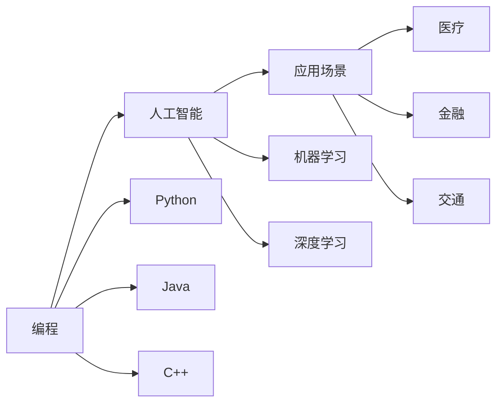

# 编程成为通用技能：AI的推动力量

> 关键词：编程、通用技能、人工智能、推动力量、技术变革、教育转型、职业发展

> 摘要：本文深入探讨了在人工智能时代编程逐渐成为通用技能这一趋势背后的推动力量。首先介绍了编程成为通用技能的背景，包括目的、预期读者等。接着阐述了编程与人工智能的核心概念及联系，分析了相关算法原理和数学模型。通过项目实战展示编程在实际中的应用，探讨了编程作为通用技能的实际应用场景。同时推荐了学习编程和人工智能的工具和资源，最后总结了未来发展趋势与挑战，并解答常见问题，提供扩展阅读和参考资料，旨在全面剖析AI推动编程成为通用技能这一重要现象及其深远影响。

## 1. 背景介绍 
### 1.1 目的和范围
在当今数字化和智能化快速发展的时代，人工智能（AI）技术正以前所未有的速度改变着我们的生活、工作和社会。编程作为实现AI的关键手段，其重要性日益凸显。本文的目的在于深入探讨AI是如何推动编程成为一种通用技能的，范围涵盖编程和AI的基本概念、相关技术原理、实际应用场景、学习资源等多个方面，旨在为读者全面呈现这一趋势的全貌和内在逻辑。

### 1.2 预期读者
本文预期读者包括对编程和人工智能感兴趣的初学者，希望了解行业发展趋势的技术从业者，关注教育变革的教育工作者，以及对未来职业发展有规划的学生和职场人士等。无论你是刚刚接触编程的新手，还是在技术领域有一定经验的专业人士，都能从本文中获得有价值的信息和启发。

### 1.3 文档结构概述
本文将按照以下结构展开：首先介绍编程成为通用技能的背景信息，包括目的、预期读者和文档结构等；接着阐述编程和人工智能的核心概念及其相互联系；然后详细讲解相关的核心算法原理和具体操作步骤，并给出数学模型和公式；通过项目实战展示编程在实际中的应用和实现过程；探讨编程作为通用技能的实际应用场景；推荐学习编程和人工智能的工具和资源；总结未来发展趋势与挑战；解答常见问题；最后提供扩展阅读和参考资料，方便读者进一步深入学习。

### 1.4 术语表
#### 1.4.1 核心术语定义
- **编程**：是指使用特定的程序设计语言，按照一定的规则和逻辑，编写指令序列，以实现特定功能或解决特定问题的过程。
- **人工智能**：是研究、开发用于模拟、延伸和扩展人的智能的理论、方法、技术及应用系统的一门新的技术科学。它试图了解智能的实质，并生产出一种新的能以人类智能相似的方式做出反应的智能机器。
- **通用技能**：是指在多个领域和场景中都能发挥作用，具有广泛适用性和价值的技能。

#### 1.4.2 相关概念解释
- **机器学习**：是人工智能的一个重要分支，它致力于研究如何通过算法让计算机从数据中自动学习规律，并利用这些规律对未知数据进行预测和决策。
- **深度学习**：是机器学习的一种特殊形式，它基于人工神经网络，通过构建多层的神经网络模型，自动从大量数据中学习复杂的模式和特征，从而实现更强大的智能处理能力。

#### 1.4.3 缩略词列表
- **AI**：Artificial Intelligence（人工智能）
- **ML**：Machine Learning（机器学习）
- **DL**：Deep Learning（深度学习）

## 2. 核心概念与联系 
### 编程的概念与原理
编程是人类与计算机沟通的桥梁。计算机本身是一台按照指令执行操作的机器，而编程就是我们给计算机下达指令的过程。不同的编程语言就像是不同的语言体系，每种语言都有自己的语法规则和表达方式，但它们的核心目的都是让计算机理解我们的意图并执行相应的任务。

例如，在Python语言中，我们可以使用简单的语句来实现一个加法运算：
```python
a = 5
b = 3
result = a + b
print(result)
```
这段代码的原理是，首先我们定义了两个变量 `a` 和 `b`，并分别给它们赋值为 5 和 3。然后将 `a` 和 `b` 相加的结果赋值给变量 `result`，最后使用 `print` 函数将结果输出到控制台。

### 人工智能的概念与原理
人工智能是让计算机模拟人类智能的过程。它包括多个领域，如自然语言处理、计算机视觉、机器学习等。机器学习是实现人工智能的重要手段之一，它通过让计算机从数据中学习模式和规律，从而实现对未知数据的预测和决策。

以简单的线性回归模型为例，它是机器学习中的一种基本算法。假设我们有一组数据点 $(x_1, y_1), (x_2, y_2), \cdots, (x_n, y_n)$，我们希望找到一条直线 $y = wx + b$ 来拟合这些数据点，使得这些数据点到直线的距离之和最小。这里的 $w$ 和 $b$ 就是我们需要学习的参数。

### 编程与人工智能的联系
编程是实现人工智能的基础。人工智能的各种算法和模型都需要通过编程来实现。无论是简单的机器学习算法，还是复杂的深度学习模型，都需要使用编程语言来编写代码。同时，人工智能的发展也推动了编程技术的不断进步。例如，为了处理大规模的数据和复杂的模型，编程语言不断发展出更高效的数据处理和计算库，如Python中的NumPy、Pandas和TensorFlow等。

以下是一个使用Python和Scikit-learn库实现简单线性回归的示例：
```python
import numpy as np
from sklearn.linear_model import LinearRegression

# 生成一些示例数据
x = np.array([1, 2, 3, 4, 5]).reshape(-1, 1)
y = np.array([2, 4, 6, 8, 10])

# 创建线性回归模型
model = LinearRegression()

# 训练模型
model.fit(x, y)

# 进行预测
new_x = np.array([6]).reshape(-1, 1)
prediction = model.predict(new_x)
print(prediction)
```
在这个示例中，我们使用Python的NumPy库来生成和处理数据，使用Scikit-learn库中的 `LinearRegression` 类来创建和训练线性回归模型，最后使用训练好的模型进行预测。

### 核心概念原理和架构的文本示意图
编程是基础，它提供了实现各种功能的工具和方法。人工智能则是基于编程实现的更高级的智能应用。编程为人工智能提供了实现的手段，而人工智能的需求又推动了编程技术的发展。可以用以下文本描述它们的架构关系：

编程层：包括各种编程语言（如Python、Java、C++等）和编程工具（如IDE、编辑器等），负责实现具体的功能和算法。

人工智能层：基于编程层实现的各种人工智能算法和模型，如机器学习、深度学习等，用于处理复杂的智能任务。

应用层：将人工智能技术应用到各个领域，如医疗、金融、交通等，为人们的生活和工作带来便利和创新。

### Mermaid 流程图


## 3. 核心算法原理 & 具体操作步骤 
### 机器学习算法原理 - 以决策树为例
决策树是一种常用的机器学习算法，它通过构建树形结构来进行决策。决策树的每个内部节点是一个属性上的测试，每个分支是一个测试输出，每个叶节点是一个类别或值。

#### 算法原理
决策树的构建过程是一个递归的过程，其核心思想是选择最优的属性来划分数据集，使得划分后的子集尽可能地“纯净”。常用的划分标准有信息增益、信息增益率、基尼指数等。

以信息增益为例，信息增益是指在划分数据集前后信息熵的变化。信息熵是对数据集不确定性的度量，信息熵越大，数据集的不确定性越高。信息增益越大，说明划分后数据集的不确定性降低得越多，划分越有效。

信息熵的计算公式为：
$$H(D) = -\sum_{i=1}^{k}p_i\log_2p_i$$
其中，$D$ 是数据集，$k$ 是数据集中类别的数量，$p_i$ 是第 $i$ 个类别的概率。

信息增益的计算公式为：
$$Gain(D, A) = H(D) - \sum_{v=1}^{V}\frac{|D^v|}{|D|}H(D^v)$$
其中，$A$ 是属性，$V$ 是属性 $A$ 的取值数量，$D^v$ 是属性 $A$ 取值为 $v$ 的子集。

#### 具体操作步骤
1. 计算数据集的信息熵 $H(D)$。
2. 对于每个属性 $A$，计算其信息增益 $Gain(D, A)$。
3. 选择信息增益最大的属性作为当前节点的划分属性。
4. 根据划分属性的取值，将数据集划分为多个子集。
5. 对每个子集递归地执行步骤 1 - 4，直到子集满足终止条件（如子集只包含一个类别或达到最大深度等）。

### Python 源代码实现
```python
import numpy as np

# 计算信息熵
def entropy(y):
    classes, counts = np.unique(y, return_counts=True)
    probabilities = counts / len(y)
    entropy = -np.sum(probabilities * np.log2(probabilities))
    return entropy

# 计算信息增益
def information_gain(X, y, feature_index):
    parent_entropy = entropy(y)
    values = np.unique(X[:, feature_index])
    weighted_entropy = 0
    for value in values:
        subset_indices = X[:, feature_index] == value
        subset_y = y[subset_indices]
        subset_entropy = entropy(subset_y)
        subset_weight = len(subset_y) / len(y)
        weighted_entropy += subset_weight * subset_entropy
    information_gain = parent_entropy - weighted_entropy
    return information_gain

# 找到最佳划分属性
def best_split(X, y):
    num_features = X.shape[1]
    best_feature_index = None
    best_information_gain = -1
    for feature_index in range(num_features):
        ig = information_gain(X, y, feature_index)
        if ig > best_information_gain:
            best_information_gain = ig
            best_feature_index = feature_index
    return best_feature_index

# 决策树节点类
class DecisionTreeNode:
    def __init__(self, feature_index=None, threshold=None, left=None, right=None, value=None):
        self.feature_index = feature_index
        self.threshold = threshold
        self.left = left
        self.right = right
        self.value = value

    def is_leaf(self):
        return self.value is not None

# 构建决策树
def build_tree(X, y, depth=0, max_depth=10):
    num_samples, num_features = X.shape
    num_classes = len(np.unique(y))

    # 终止条件
    if num_classes == 1 or depth >= max_depth or num_samples < 2:
        leaf_value = np.bincount(y).argmax()
        return DecisionTreeNode(value=leaf_value)

    # 找到最佳划分属性
    best_feature_index = best_split(X, y)

    # 划分数据集
    feature_values = X[:, best_feature_index]
    thresholds = np.unique(feature_values)
    best_threshold = None
    best_ig = -1
    for threshold in thresholds:
        left_indices = feature_values < threshold
        right_indices = feature_values >= threshold
        if len(left_indices) > 0 and len(right_indices) > 0:
            left_y = y[left_indices]
            right_y = y[right_indices]
            ig = information_gain(X, y, best_feature_index)
            if ig > best_ig:
                best_ig = ig
                best_threshold = threshold

    # 递归构建左右子树
    left_indices = X[:, best_feature_index] < best_threshold
    right_indices = X[:, best_feature_index] >= best_threshold
    left_subtree = build_tree(X[left_indices], y[left_indices], depth + 1, max_depth)
    right_subtree = build_tree(X[right_indices], y[right_indices], depth + 1, max_depth)

    return DecisionTreeNode(feature_index=best_feature_index, threshold=best_threshold, left=left_subtree, right=right_subtree)

# 决策树预测
def predict(tree, X):
    def traverse_tree(x, node):
        if node.is_leaf():
            return node.value
        if x[node.feature_index] < node.threshold:
            return traverse_tree(x, node.left)
        else:
            return traverse_tree(x, node.right)

    predictions = []
    for x in X:
        prediction = traverse_tree(x, tree)
        predictions.append(prediction)
    return np.array(predictions)

# 示例数据
X = np.array([[2.771244718, 1.784783929],
              [1.728571309, 1.169761413],
              [3.678319846, 2.81281357],
              [3.961043357, 2.61995032],
              [2.999208922, 2.209014212],
              [7.497545867, 3.162953546],
              [9.00220326, 3.339047188],
              [7.444542326, 0.476683375],
              [10.12493903, 3.234550982],
              [6.642287351, 3.319983761]])
y = np.array([0, 0, 0, 0, 0, 1, 1, 1, 1, 1])

# 构建决策树
tree = build_tree(X, y)

# 进行预测
new_X = np.array([[3.0, 2.0], [8.0, 3.0]])
predictions = predict(tree, new_X)
print(predictions)
```

## 4. 数学模型和公式 & 详细讲解 & 举例说明 
### 线性回归模型
#### 数学模型
线性回归是一种用于建立自变量 $x$ 和因变量 $y$ 之间线性关系的模型。其基本形式为：
$$y = wx + b + \epsilon$$
其中，$w$ 是斜率，$b$ 是截距，$\epsilon$ 是误差项，通常假设 $\epsilon$ 服从均值为 0 的正态分布。

#### 目标函数
线性回归的目标是找到最优的 $w$ 和 $b$，使得预测值 $\hat{y} = wx + b$ 与真实值 $y$ 之间的误差最小。常用的误差度量方法是均方误差（MSE），其计算公式为：
$$MSE = \frac{1}{n}\sum_{i=1}^{n}(y_i - \hat{y}_i)^2 = \frac{1}{n}\sum_{i=1}^{n}(y_i - (wx_i + b))^2$$
其中，$n$ 是样本数量，$y_i$ 是第 $i$ 个样本的真实值，$\hat{y}_i$ 是第 $i$ 个样本的预测值。

#### 求解方法
为了找到最优的 $w$ 和 $b$，我们可以使用最小二乘法。最小二乘法的原理是对目标函数 $MSE$ 分别关于 $w$ 和 $b$ 求偏导数，并令偏导数等于 0，得到以下方程组：
$$\frac{\partial MSE}{\partial w} = -\frac{2}{n}\sum_{i=1}^{n}x_i(y_i - (wx_i + b)) = 0$$
$$\frac{\partial MSE}{\partial b} = -\frac{2}{n}\sum_{i=1}^{n}(y_i - (wx_i + b)) = 0$$
解这个方程组可以得到 $w$ 和 $b$ 的最优解：
$$w = \frac{\sum_{i=1}^{n}(x_i - \bar{x})(y_i - \bar{y})}{\sum_{i=1}^{n}(x_i - \bar{x})^2}$$
$$b = \bar{y} - w\bar{x}$$
其中，$\bar{x}$ 和 $\bar{y}$ 分别是 $x$ 和 $y$ 的均值。

#### 举例说明
假设我们有以下数据集：
| $x$ | $y$ |
|---|---|
| 1 | 2 |
| 2 | 4 |
| 3 | 6 |
| 4 | 8 |
| 5 | 10 |

首先，计算 $x$ 和 $y$ 的均值：
$$\bar{x} = \frac{1 + 2 + 3 + 4 + 5}{5} = 3$$
$$\bar{y} = \frac{2 + 4 + 6 + 8 + 10}{5} = 6$$

然后，计算 $w$：
$$\sum_{i=1}^{5}(x_i - \bar{x})(y_i - \bar{y}) = (1 - 3)(2 - 6) + (2 - 3)(4 - 6) + (3 - 3)(6 - 6) + (4 - 3)(8 - 6) + (5 - 3)(10 - 6) = 20$$
$$\sum_{i=1}^{5}(x_i - \bar{x})^2 = (1 - 3)^2 + (2 - 3)^2 + (3 - 3)^2 + (4 - 3)^2 + (5 - 3)^2 = 10$$
$$w = \frac{20}{10} = 2$$

最后，计算 $b$：
$$b = \bar{y} - w\bar{x} = 6 - 2\times3 = 0$$

所以，线性回归模型为 $y = 2x$。

### 逻辑回归模型
#### 数学模型
逻辑回归是一种用于二分类问题的模型。它通过将线性回归的输出值通过一个逻辑函数（也称为Sigmoid函数）映射到 $[0, 1]$ 区间，得到一个概率值。逻辑函数的计算公式为：
$$\sigma(z) = \frac{1}{1 + e^{-z}}$$
其中，$z = wx + b$。

逻辑回归的预测概率为：
$$P(y = 1|x) = \sigma(wx + b) = \frac{1}{1 + e^{-(wx + b)}}$$
$$P(y = 0|x) = 1 - P(y = 1|x) = \frac{e^{-(wx + b)}}{1 + e^{-(wx + b)}}$$

#### 目标函数
逻辑回归的目标是最大化似然函数。似然函数是指在给定模型参数 $w$ 和 $b$ 的情况下，观测到数据集的概率。对于二分类问题，似然函数可以表示为：
$$L(w, b) = \prod_{i=1}^{n}P(y_i|x_i)^{y_i}(1 - P(y_i|x_i))^{1 - y_i}$$
为了方便计算，通常对似然函数取对数，得到对数似然函数：
$$\log L(w, b) = \sum_{i=1}^{n}[y_i\log P(y_i|x_i) + (1 - y_i)\log(1 - P(y_i|x_i))]$$
逻辑回归的目标是最大化对数似然函数，等价于最小化负对数似然函数（也称为交叉熵损失函数）：
$$J(w, b) = -\log L(w, b) = -\sum_{i=1}^{n}[y_i\log P(y_i|x_i) + (1 - y_i)\log(1 - P(y_i|x_i))]$$

#### 求解方法
为了最小化交叉熵损失函数 $J(w, b)$，通常使用梯度下降法。梯度下降法的基本思想是沿着损失函数的负梯度方向更新模型参数 $w$ 和 $b$，直到损失函数收敛到最小值。

梯度下降法的更新公式为：
$$w = w - \alpha\frac{\partial J(w, b)}{\partial w}$$
$$b = b - \alpha\frac{\partial J(w, b)}{\partial b}$$
其中，$\alpha$ 是学习率，控制每次更新的步长。

#### 举例说明
假设我们有以下数据集：
| $x$ | $y$ |
|---|---|
| 1 | 0 |
| 2 | 0 |
| 3 | 1 |
| 4 | 1 |

我们可以使用Python和Scikit-learn库来实现逻辑回归模型：
```python
import numpy as np
from sklearn.linear_model import LogisticRegression

# 数据
X = np.array([[1], [2], [3], [4]])
y = np.array([0, 0, 1, 1])

# 创建逻辑回归模型
model = LogisticRegression()

# 训练模型
model.fit(X, y)

# 进行预测
new_X = np.array([[2.5]])
prediction = model.predict(new_X)
print(prediction)
```

## 5. 项目实战：代码实际案例和详细解释说明 
### 5.1  开发环境搭建
#### 安装Python
首先，我们需要安装Python。可以从Python官方网站（https://www.python.org/downloads/） 下载适合你操作系统的Python安装包，并按照安装向导进行安装。安装完成后，可以在命令行中输入 `python --version` 来验证Python是否安装成功。

#### 安装开发工具
推荐使用集成开发环境（IDE）来进行Python开发，如PyCharm、VS Code等。这些IDE提供了代码编辑、调试、自动补全、版本控制等功能，能够提高开发效率。

#### 安装必要的库
在本项目中，我们需要使用一些Python库，如NumPy、Pandas、Scikit-learn等。可以使用以下命令来安装这些库：
```sh
pip install numpy pandas scikit-learn
```

### 5.2  源代码详细实现和代码解读
#### 项目需求
我们要实现一个简单的鸢尾花分类项目，使用鸢尾花数据集，通过机器学习算法对鸢尾花的类别进行预测。

#### 代码实现
```python
import numpy as np
from sklearn.datasets import load_iris
from sklearn.model_selection import train_test_split
from sklearn.tree import DecisionTreeClassifier
from sklearn.metrics import accuracy_score

# 加载鸢尾花数据集
iris = load_iris()
X = iris.data
y = iris.target

# 划分训练集和测试集
X_train, X_test, y_train, y_test = train_test_split(X, y, test_size=0.2, random_state=42)

# 创建决策树分类器
model = DecisionTreeClassifier()

# 训练模型
model.fit(X_train, y_train)

# 进行预测
y_pred = model.predict(X_test)

# 计算准确率
accuracy = accuracy_score(y_test, y_pred)
print(f"Accuracy: {accuracy}")
```

#### 代码解读
1. **数据加载**：使用 `load_iris` 函数从Scikit-learn库中加载鸢尾花数据集。数据集包含四个特征（花萼长度、花萼宽度、花瓣长度、花瓣宽度）和三个类别（山鸢尾、变色鸢尾、维吉尼亚鸢尾）。
2. **数据划分**：使用 `train_test_split` 函数将数据集划分为训练集和测试集，其中测试集占总数据集的 20%。
3. **模型创建**：使用 `DecisionTreeClassifier` 类创建一个决策树分类器。
4. **模型训练**：使用 `fit` 方法对模型进行训练，将训练集的特征和标签作为输入。
5. **模型预测**：使用 `predict` 方法对测试集的特征进行预测，得到预测结果。
6. **准确率计算**：使用 `accuracy_score` 函数计算预测结果的准确率，即预测正确的样本数占总样本数的比例。

### 5.3  代码解读与分析
#### 模型选择
在本项目中，我们选择了决策树分类器作为模型。决策树是一种简单而有效的分类算法，它通过构建树形结构来进行决策，具有可解释性强、计算效率高等优点。

#### 数据划分
数据划分的目的是为了评估模型的泛化能力。通过将数据集划分为训练集和测试集，我们可以在训练集上训练模型，在测试集上评估模型的性能。如果直接在整个数据集上训练和评估模型，可能会导致模型过拟合，即模型在训练集上表现很好，但在新数据上表现很差。

#### 准确率评估
准确率是一种常用的分类模型评估指标，它反映了模型预测正确的样本数占总样本数的比例。但准确率并不是评估模型性能的唯一指标，在某些情况下，还需要考虑其他指标，如召回率、F1值等。

## 6. 实际应用场景 
### 医疗领域
编程和人工智能在医疗领域有着广泛的应用。例如，通过机器学习算法可以对医学影像（如X光、CT、MRI等）进行分析，帮助医生检测疾病、诊断病情。深度学习模型可以从大量的医学影像数据中学习到疾病的特征和模式，从而提高诊断的准确性和效率。

另外，人工智能还可以用于药物研发。通过对生物分子结构和药物活性数据的分析，人工智能算法可以预测药物的疗效和副作用，加速药物研发的过程。

### 金融领域
在金融领域，编程和人工智能可以用于风险评估、信用评分、投资决策等。例如，银行可以使用机器学习算法对客户的信用历史、收入情况、资产状况等数据进行分析，评估客户的信用风险，从而决定是否给予贷款。

量化投资也是人工智能在金融领域的一个重要应用。通过对市场数据的分析和建模，人工智能算法可以预测股票、债券等金融资产的价格走势，帮助投资者做出更明智的投资决策。

### 交通领域
自动驾驶是编程和人工智能在交通领域的典型应用。通过使用传感器（如摄像头、雷达、激光雷达等）收集车辆周围的环境信息，人工智能算法可以对这些信息进行处理和分析，实现车辆的自主导航、避障、决策等功能。

智能交通系统也是人工智能在交通领域的重要应用。通过对交通流量、路况等数据的分析，人工智能算法可以优化交通信号控制，提高交通效率，减少拥堵。

### 教育领域
编程和人工智能可以为教育带来创新和变革。例如，智能辅导系统可以根据学生的学习情况和特点，提供个性化的学习建议和辅导，帮助学生提高学习效果。

人工智能还可以用于教育评估。通过对学生的作业、考试等数据的分析，人工智能算法可以评估学生的学习能力和知识掌握程度，为教师提供教学反馈，改进教学方法。

## 7. 工具和资源推荐
### 7.1 学习资源推荐
#### 7.1.1 书籍推荐
- 《Python 机器学习》：本书详细介绍了Python在机器学习领域的应用，包括各种机器学习算法的原理、实现和应用。
- 《深度学习》：由深度学习领域的三位先驱 Ian Goodfellow、Yoshua Bengio 和 Aaron Courville 合著，是深度学习领域的经典教材。
- 《人工智能：一种现代的方法》：全面介绍了人工智能的各个领域，包括搜索算法、知识表示、机器学习、自然语言处理等。

#### 7.1.2 在线课程
- Coursera 上的《机器学习》课程：由斯坦福大学教授 Andrew Ng 授课，是机器学习领域的经典课程。
- edX 上的《深度学习》课程：由百度公司的吴恩达教授授课，深入介绍了深度学习的原理和应用。
- 中国大学MOOC上的《Python 语言程序设计》课程：适合初学者学习Python语言。

#### 7.1.3 技术博客和网站
- Medium：是一个技术博客平台，上面有很多关于编程、人工智能等领域的优质文章。
- Towards Data Science：专注于数据科学和机器学习领域的技术博客，提供了很多实用的教程和案例。
- Kaggle：是一个数据科学竞赛平台，上面有很多数据集和优秀的解决方案，可以学习到很多数据科学和机器学习的实践经验。

### 7.2 开发工具框架推荐
#### 7.2.1 IDE和编辑器
- PyCharm：是一款专门为Python开发设计的集成开发环境，提供了丰富的功能和插件，适合专业的Python开发者。
- VS Code：是一款轻量级的代码编辑器，支持多种编程语言，具有丰富的插件生态系统，适合初学者和快速开发。
- Jupyter Notebook：是一个交互式的开发环境，适合进行数据探索、模型训练和可视化等工作。

#### 7.2.2 调试和性能分析工具
- Py-Spy：是一个Python性能分析工具，可以实时分析Python程序的性能瓶颈。
- pdb：是Python自带的调试器，可以帮助开发者调试Python代码。
- TensorBoard：是TensorFlow提供的可视化工具，可以用于可视化模型的训练过程和性能指标。

#### 7.2.3 相关框架和库
- NumPy：是Python中用于科学计算的基础库，提供了高效的多维数组对象和各种数学函数。
- Pandas：是Python中用于数据处理和分析的库，提供了数据结构和数据操作工具。
- Scikit-learn：是Python中用于机器学习的库，提供了各种机器学习算法和工具。
- TensorFlow：是一个开源的深度学习框架，由Google开发，广泛应用于深度学习领域。
- PyTorch：是一个开源的深度学习框架，由Facebook开发，具有动态图的优势，适合快速开发和研究。

### 7.3 相关论文著作推荐
#### 7.3.1 经典论文
- 《Gradient-Based Learning Applied to Document Recognition》：由Yann LeCun等人发表，介绍了卷积神经网络（CNN）在手写字符识别中的应用，是深度学习领域的经典论文。
- 《Long Short-Term Memory》：由Sepp Hochreiter和Jürgen Schmidhuber发表，介绍了长短期记忆网络（LSTM）的原理和应用，是循环神经网络（RNN）领域的重要论文。
- 《Attention Is All You Need》：由Google Brain团队发表，介绍了Transformer架构，是自然语言处理领域的重要突破。

#### 7.3.2 最新研究成果
- 可以关注顶级学术会议，如NeurIPS（神经信息处理系统大会）、ICML（国际机器学习会议）、CVPR（计算机视觉与模式识别会议）等，了解人工智能领域的最新研究成果。
- 也可以关注知名学术期刊，如Journal of Artificial Intelligence Research（JAIR）、Artificial Intelligence等。

#### 7.3.3 应用案例分析
- 《Hands-On Machine Learning with Scikit-Learn, Keras, and TensorFlow》：书中包含了很多机器学习和深度学习的应用案例，通过实际案例帮助读者理解和掌握相关技术。
- Kaggle上的优秀解决方案：可以学习到很多数据科学和机器学习的实际应用案例，了解不同领域的问题解决思路和方法。

## 8. 总结：未来发展趋势与挑战
### 未来发展趋势
#### 编程与AI的深度融合
未来，编程和人工智能将更加紧密地融合在一起。随着人工智能技术的不断发展，编程将成为实现人工智能应用的基础和关键。同时，人工智能也将为编程带来更多的便利和创新，如自动代码生成、智能代码补全、代码漏洞检测等。

#### 编程教育的普及
编程将逐渐成为一种通用技能，编程教育也将得到更广泛的普及。从小学到大学，编程课程将成为教育体系的重要组成部分。同时，在线编程教育平台也将不断发展，为更多的人提供便捷的编程学习渠道。

#### AI应用的拓展
人工智能的应用领域将不断拓展，从医疗、金融、交通等传统领域扩展到更多的领域，如农业、环保、文化娱乐等。人工智能将为这些领域带来新的机遇和变革，提高生产效率和生活质量。

### 挑战
#### 技术瓶颈
虽然人工智能技术取得了很大的进展，但仍然面临一些技术瓶颈，如模型的可解释性、数据的隐私和安全、算法的鲁棒性等。这些问题需要进一步的研究和解决，以推动人工智能技术的健康发展。

#### 人才短缺
随着编程和人工智能的快速发展，对相关人才的需求也越来越大。目前，全球范围内都面临着编程和人工智能人才短缺的问题。如何培养更多的高素质编程和人工智能人才，是未来需要解决的重要问题。

#### 伦理和法律问题
人工智能的发展也带来了一些伦理和法律问题，如人工智能的责任归属、算法歧视、隐私保护等。这些问题需要制定相应的伦理准则和法律法规来规范和约束，以确保人工智能技术的合理应用和发展。

## 9. 附录：常见问题与解答
### 编程难学吗？
编程的难度因人而异。对于初学者来说，编程可能会有一定的难度，需要学习编程语言的语法规则、编程逻辑和算法等知识。但只要有足够的耐心和毅力，通过不断的学习和实践，就能够掌握编程技能。同时，现在有很多优秀的编程学习资源和工具，也可以帮助初学者更快地入门。

### 人工智能和机器学习有什么区别？
人工智能是一个更广泛的概念，它试图让计算机模拟人类的智能。机器学习是人工智能的一个重要分支，它致力于研究如何让计算机从数据中自动学习规律，并利用这些规律对未知数据进行预测和决策。可以说，机器学习是实现人工智能的一种重要手段。

### 学习编程需要具备哪些基础知识？
学习编程需要具备一定的数学基础，如线性代数、概率论、数理统计等。这些数学知识在机器学习、深度学习等领域中有着重要的应用。此外，还需要具备一定的逻辑思维能力和问题解决能力。

### 如何选择适合自己的编程语言？
选择适合自己的编程语言需要考虑多个因素，如学习目的、应用领域、个人兴趣等。如果是初学者，建议选择Python语言，因为Python语言语法简单、易于学习，且有丰富的库和工具，适合快速开发和学习。如果是从事系统开发、游戏开发等领域，可以选择C、C++等语言。如果是从事Web开发，可以选择Java、JavaScript等语言。

## 10. 扩展阅读 & 参考资料
### 扩展阅读
- 《人类简史：从动物到上帝》：这本书从人类的进化和发展角度，探讨了人类与技术的关系，对于理解编程和人工智能的发展背景有一定的帮助。
- 《未来简史：从智人到神人》：书中对未来人类社会的发展进行了大胆的预测，包括人工智能、生物技术等领域的发展对人类社会的影响。
- 《失控：全人类的最终命运和结局》：探讨了复杂系统的自组织、进化和控制等问题，对于理解人工智能和编程中的一些概念和思想有一定的启发。

### 参考资料
- Python官方文档：https://docs.python.org/
- Scikit-learn官方文档：https://scikit-learn.org/
- TensorFlow官方文档：https://www.tensorflow.org/
- PyTorch官方文档：https://pytorch.org/