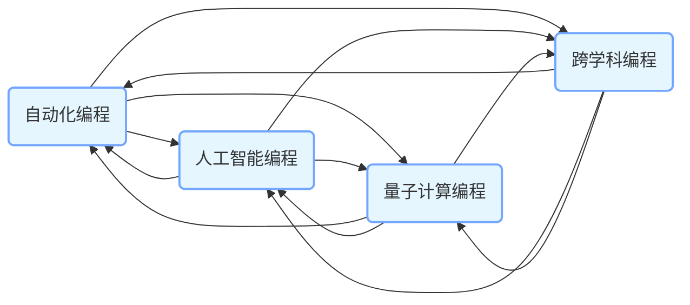

# 编程的未来：技能与思维的双重提升

> 关键词：编程未来、技能提升、思维提升、人工智能、自动化编程、量子计算编程、跨学科编程

> 摘要：本文深入探讨了编程在未来的发展趋势，着重强调了技能与思维双重提升的重要性。通过分析背景知识，阐述核心概念与联系，讲解核心算法原理及操作步骤，引入数学模型和公式，结合项目实战案例，探讨实际应用场景，推荐相关工具和资源，最后总结未来发展趋势与挑战并解答常见问题，旨在为读者全面呈现编程未来的发展方向以及如何在这个过程中实现技能与思维的双重蜕变，以适应不断变化的编程世界。

## 1. 背景介绍 
### 1.1 目的和范围
本文章的目的在于帮助读者全面了解编程的未来发展趋势，以及在这个过程中如何实现技能与思维的双重提升。范围涵盖了从编程领域的技术变革到对程序员个人素养的要求，从核心概念的解释到实际项目的操作，从常见的应用场景到相关的工具资源推荐等多个方面。通过对这些内容的探讨，为读者提供一个全面且深入的关于编程未来发展的视角，引导读者更好地应对未来编程领域的挑战和机遇。

### 1.2 预期读者
本文预期读者包括在校的计算机相关专业学生、在职的程序员、对编程领域发展趋势感兴趣的技术爱好者以及关注科技发展的相关人士。无论您是初学者希望了解编程的未来方向，还是有一定经验的专业人士想要进一步提升自己的技能和思维，都能从本文中获取有价值的信息。

### 1.3 文档结构概述
本文将按照以下结构进行阐述：首先介绍编程领域的背景知识，包括目的、预期读者和文档结构概述等内容；接着讲解编程未来发展中涉及的核心概念与联系，通过文本示意图和 Mermaid 流程图进行直观展示；然后详细阐述核心算法原理并给出具体操作步骤，结合 Python 源代码进行讲解；之后引入数学模型和公式，并进行详细讲解和举例说明；再通过项目实战案例，包括开发环境搭建、源代码实现和代码解读等，加深读者对编程实践的理解；随后探讨编程在实际应用中的场景；推荐相关的工具和资源，包括学习资源、开发工具框架和相关论文著作；最后总结编程的未来发展趋势与挑战，解答常见问题并提供扩展阅读和参考资料。

### 1.4 术语表
#### 1.4.1 核心术语定义
- **自动化编程**：利用计算机程序自动生成代码的过程，减少人工编写代码的工作量，提高编程效率。
- **量子计算编程**：针对量子计算机进行编程，利用量子力学原理处理信息，具有强大的计算能力。
- **跨学科编程**：将编程与其他学科知识相结合，如生物学、物理学、经济学等，解决复杂的跨学科问题。
- **人工智能编程**：运用人工智能技术进行编程，实现智能决策、机器学习、自然语言处理等功能。

#### 1.4.2 相关概念解释
- **低代码/无代码编程**：一种通过可视化界面和少量代码或无需代码即可创建应用程序的编程方式，降低了编程门槛，使非专业程序员也能参与到软件开发中。
- **函数式编程**：一种编程范式，强调将计算视为函数的求值，避免使用共享状态和可变数据，具有更高的可维护性和可测试性。
- **面向对象编程**：一种以对象为基础的编程范式，通过封装、继承和多态等特性，提高代码的复用性和可扩展性。

#### 1.4.3 缩略词列表
- **AI**：Artificial Intelligence，人工智能
- **ML**：Machine Learning，机器学习
- **NLP**：Natural Language Processing，自然语言处理
- **QC**：Quantum Computing，量子计算

## 2. 核心概念与联系 

### 核心概念原理和架构的文本示意图
编程的未来涉及多个核心概念，这些概念相互关联、相互影响。自动化编程通过预设的规则和模板，利用计算机程序自动生成代码，减少了人工编程的工作量和错误率。人工智能编程则利用机器学习、深度学习等技术，使程序能够自动学习和适应环境，实现智能决策和处理。量子计算编程借助量子力学的特性，如量子比特、量子纠缠等，提供了远超传统计算机的计算能力，为解决复杂问题提供了新的途径。跨学科编程将编程与其他学科知识相结合，打破了学科之间的界限，能够解决更加复杂和多样化的问题。

这些概念之间的联系在于，自动化编程可以为人工智能编程提供基础的代码框架，提高开发效率；人工智能编程可以为自动化编程提供智能决策和优化算法，使其更加智能和灵活。量子计算编程可以为人工智能和自动化编程提供更强大的计算支持，加速算法的运行和优化。跨学科编程则可以将各个领域的知识和技术融合在一起，为人工智能、自动化编程和量子计算编程提供更广阔的应用场景和问题解决方案。

### Mermaid 流程图


## 3. 核心算法原理 & 具体操作步骤 

### 自动化编程算法原理及 Python 实现
自动化编程的核心思想是通过预设的规则和模板，根据输入的需求自动生成代码。以下是一个简单的自动化编程示例，用于生成一个简单的 Python 函数。

```python
# 定义函数模板
def function_template(func_name, param_list, return_type):
    param_str = ", ".join(param_list)
    code = f"def {func_name}({param_str}):\n"
    code += f"    # 这里是函数的具体实现\n"
    code += f"    return {return_type}()"
    return code

# 输入函数信息
func_name = "add_numbers"
param_list = ["a", "b"]
return_type = "int"

# 生成代码
generated_code = function_template(func_name, param_list, return_type)
print(generated_code)
```

### 操作步骤
1. 定义函数模板：在 `function_template` 函数中，我们定义了一个函数的基本结构，包括函数名、参数列表和返回类型。
2. 输入函数信息：通过变量 `func_name`、`param_list` 和 `return_type` 输入函数的具体信息。
3. 生成代码：调用 `function_template` 函数，传入函数信息，生成相应的代码。
4. 输出代码：将生成的代码打印输出。

### 人工智能编程算法原理及 Python 实现
人工智能编程中，机器学习是一个重要的领域。以下是一个简单的线性回归示例，用于预测房价。

```python
import numpy as np
from sklearn.linear_model import LinearRegression

# 准备数据
X = np.array([[1], [2], [3], [4], [5]])
y = np.array([2, 4, 6, 8, 10])

# 创建线性回归模型
model = LinearRegression()

# 训练模型
model.fit(X, y)

# 预测新数据
new_X = np.array([[6]])
prediction = model.predict(new_X)
print("预测结果:", prediction)
```

### 操作步骤
1. 准备数据：使用 `numpy` 数组准备输入数据 `X` 和目标数据 `y`。
2. 创建模型：使用 `sklearn` 库中的 `LinearRegression` 类创建线性回归模型。
3. 训练模型：调用模型的 `fit` 方法，传入输入数据和目标数据，训练模型。
4. 预测新数据：使用训练好的模型对新数据进行预测，调用 `predict` 方法。
5. 输出结果：将预测结果打印输出。

### 量子计算编程算法原理及 Python 实现
量子计算编程通常使用专门的量子计算框架，如 Qiskit。以下是一个简单的量子比特翻转示例。

```python
from qiskit import QuantumCircuit, Aer, execute

# 创建量子电路
qc = QuantumCircuit(1, 1)

# 应用 X 门翻转量子比特
qc.x(0)

# 测量量子比特
qc.measure(0, 0)

# 选择模拟器
backend = Aer.get_backend('qasm_simulator')

# 执行量子电路
job = execute(qc, backend, shots=1000)
result = job.result()

# 获取测量结果
counts = result.get_counts(qc)
print("测量结果:", counts)
```

### 操作步骤
1. 创建量子电路：使用 `Qiskit` 库中的 `QuantumCircuit` 类创建一个包含 1 个量子比特和 1 个经典比特的量子电路。
2. 应用量子门：使用 `x` 门翻转量子比特。
3. 测量量子比特：使用 `measure` 方法测量量子比特，并将结果存储在经典比特中。
4. 选择模拟器：使用 `Aer` 库中的 `qasm_simulator` 作为模拟器。
5. 执行量子电路：使用 `execute` 函数执行量子电路，设置测量次数为 1000 次。
6. 获取测量结果：使用 `result.get_counts` 方法获取测量结果，并打印输出。

## 4. 数学模型和公式 & 详细讲解 & 举例说明 

### 自动化编程的数学模型
自动化编程可以看作是一个从需求描述到代码生成的映射过程。假设需求描述为 $R$，代码生成规则为 $f$，生成的代码为 $C$，则可以用以下公式表示：

$$C = f(R)$$

其中，$f$ 是一个复杂的映射函数，它包含了语法规则、语义规则和代码模板等信息。例如，在上面的自动化编程示例中，需求描述 $R$ 可以表示为函数名、参数列表和返回类型的组合，代码生成规则 $f$ 就是 `function_template` 函数，生成的代码 $C$ 就是根据需求描述生成的 Python 函数代码。

### 人工智能编程的数学模型
在机器学习中，线性回归是一种常见的模型。假设输入数据为 $X$，目标数据为 $y$，模型的参数为 $\theta$，则线性回归模型可以表示为：

$$y = X\theta + \epsilon$$

其中，$\epsilon$ 是误差项，表示模型无法完全拟合数据的部分。线性回归的目标是找到最优的参数 $\theta$，使得误差项的平方和最小，即：

$$\min_{\theta} \sum_{i=1}^{n} (y_i - X_i\theta)^2$$

在上面的人工智能编程示例中，我们使用 `sklearn` 库中的 `LinearRegression` 类来求解这个最优参数 $\theta$。

### 量子计算编程的数学模型
量子比特是量子计算的基本单位，它可以处于 $|0\rangle$ 和 $|1\rangle$ 的叠加态。假设一个量子比特的状态为 $|\psi\rangle$，则可以表示为：

$$|\psi\rangle = \alpha|0\rangle + \beta|1\rangle$$

其中，$\alpha$ 和 $\beta$ 是复数，且满足 $|\alpha|^2 + |\beta|^2 = 1$。在上面的量子计算编程示例中，我们使用 `X` 门来翻转量子比特的状态。`X` 门的矩阵表示为：

$$X = \begin{bmatrix} 0 & 1 \\ 1 & 0 \end{bmatrix}$$

当对一个处于 $|0\rangle$ 状态的量子比特应用 `X` 门时，其状态变为：

$$X|0\rangle = \begin{bmatrix} 0 & 1 \\ 1 & 0 \end{bmatrix} \begin{bmatrix} 1 \\ 0 \end{bmatrix} = \begin{bmatrix} 0 \\ 1 \end{bmatrix} = |1\rangle$$

这就是量子比特翻转的数学原理。

## 5. 项目实战：代码实际案例和详细解释说明 

### 5.1  开发环境搭建
#### 自动化编程开发环境
- **Python 环境**：安装 Python 3.x 版本，可以从 Python 官方网站下载安装包进行安装。
- **文本编辑器**：推荐使用 Visual Studio Code、PyCharm 等集成开发环境（IDE），方便编写和调试 Python 代码。

#### 人工智能编程开发环境
- **Python 环境**：同样需要安装 Python 3.x 版本。
- **机器学习库**：安装 `numpy`、`pandas`、`scikit-learn` 等机器学习库，可以使用 `pip` 命令进行安装，例如：
```sh
pip install numpy pandas scikit-learn
```
- **深度学习框架**：如果需要进行深度学习开发，可以安装 `TensorFlow`、`PyTorch` 等深度学习框架，例如：
```sh
pip install tensorflow
```

#### 量子计算编程开发环境
- **Python 环境**：安装 Python 3.x 版本。
- **量子计算框架**：安装 `Qiskit` 量子计算框架，可以使用 `pip` 命令进行安装：
```sh
pip install qiskit
```

### 5.2  源代码详细实现和代码解读
#### 自动化编程项目
以下是一个更复杂的自动化编程项目，用于生成一个简单的 Web 应用程序的代码。

```python
# 定义 HTML 模板
html_template = """
<!DOCTYPE html>
<html lang="en">
<head>
    <meta charset="UTF-8">
    <meta name="viewport" content="width=device-width, initial-scale=1.0">
    <title>{title}</title>
</head>
<body>
    <h1>{heading}</h1>
    <p>{content}</p>
</body>
</html>
"""

# 输入网页信息
title = "My Web Page"
heading = "Welcome to My Web Page"
content = "This is a sample web page generated by automated programming."

# 生成 HTML 代码
generated_html = html_template.format(title=title, heading=heading, content=content)

# 保存 HTML 文件
with open("index.html", "w") as file:
    file.write(generated_html)

print("HTML 文件已生成")
```

#### 代码解读
1. **定义 HTML 模板**：使用字符串模板 `html_template` 定义了一个简单的 HTML 页面的结构，其中包含了标题、头部和内容等部分。
2. **输入网页信息**：通过变量 `title`、`heading` 和 `content` 输入网页的具体信息。
3. **生成 HTML 代码**：使用字符串的 `format` 方法，将输入的网页信息填充到 HTML 模板中，生成最终的 HTML 代码。
4. **保存 HTML 文件**：使用 `open` 函数打开一个名为 `index.html` 的文件，将生成的 HTML 代码写入文件中。
5. **输出结果**：打印提示信息，表示 HTML 文件已生成。

#### 人工智能编程项目
以下是一个使用深度学习框架 `TensorFlow` 进行手写数字识别的项目。

```python
import tensorflow as tf
from tensorflow.keras.datasets import mnist
from tensorflow.keras.models import Sequential
from tensorflow.keras.layers import Flatten, Dense

# 加载 MNIST 数据集
(x_train, y_train), (x_test, y_test) = mnist.load_data()

# 数据预处理
x_train, x_test = x_train / 255.0, x_test / 255.0

# 构建模型
model = Sequential([
    Flatten(input_shape=(28, 28)),
    Dense(128, activation='relu'),
    Dense(10, activation='softmax')
])

# 编译模型
model.compile(optimizer='adam',
              loss='sparse_categorical_crossentropy',
              metrics=['accuracy'])

# 训练模型
model.fit(x_train, y_train, epochs=5)

# 评估模型
test_loss, test_acc = model.evaluate(x_test, y_test)
print(f"测试准确率: {test_acc}")
```

#### 代码解读
1. **加载数据集**：使用 `tensorflow.keras.datasets` 中的 `mnist.load_data` 函数加载 MNIST 手写数字数据集。
2. **数据预处理**：将图像数据的像素值归一化到 0 到 1 之间，方便模型训练。
3. **构建模型**：使用 `Sequential` 模型构建一个简单的神经网络，包括一个 `Flatten` 层将图像数据展平，一个 `Dense` 层作为隐藏层，一个 `Dense` 层作为输出层，使用 `softmax` 激活函数输出每个数字的概率。
4. **编译模型**：使用 `adam` 优化器、`sparse_categorical_crossentropy` 损失函数和 `accuracy` 指标编译模型。
5. **训练模型**：使用 `fit` 方法训练模型，设置训练轮数为 5 次。
6. **评估模型**：使用 `evaluate` 方法评估模型在测试集上的性能，输出测试准确率。

#### 量子计算编程项目
以下是一个使用 `Qiskit` 进行量子纠缠实验的项目。

```python
from qiskit import QuantumCircuit, Aer, execute
from qiskit.visualization import plot_histogram
import matplotlib.pyplot as plt

# 创建量子电路
qc = QuantumCircuit(2, 2)

# 应用 Hadamard 门
qc.h(0)

# 应用 CNOT 门
qc.cx(0, 1)

# 测量量子比特
qc.measure([0, 1], [0, 1])

# 选择模拟器
backend = Aer.get_backend('qasm_simulator')

# 执行量子电路
job = execute(qc, backend, shots=1000)
result = job.result()

# 获取测量结果
counts = result.get_counts(qc)

# 绘制测量结果直方图
plot_histogram(counts).show()
```

#### 代码解读
1. **创建量子电路**：使用 `QuantumCircuit` 类创建一个包含 2 个量子比特和 2 个经典比特的量子电路。
2. **应用量子门**：使用 `h` 门对第一个量子比特应用 Hadamard 门，使其处于叠加态，然后使用 `cx` 门对两个量子比特应用 CNOT 门，实现量子纠缠。
3. **测量量子比特**：使用 `measure` 方法测量两个量子比特，并将结果存储在经典比特中。
4. **选择模拟器**：使用 `Aer` 库中的 `qasm_simulator` 作为模拟器。
5. **执行量子电路**：使用 `execute` 函数执行量子电路，设置测量次数为 1000 次。
6. **获取测量结果**：使用 `result.get_counts` 方法获取测量结果。
7. **绘制测量结果直方图**：使用 `plot_histogram` 函数绘制测量结果的直方图，直观展示量子纠缠的效果。

### 5.3  代码解读与分析
#### 自动化编程项目分析
自动化编程的优势在于提高开发效率和减少错误率。通过预设的模板和规则，可以快速生成大量的代码，减少了人工编写代码的工作量。但是，自动化编程也有一定的局限性，例如无法处理复杂的逻辑和需求变化。在实际应用中，需要根据具体情况选择合适的自动化编程工具和方法。

#### 人工智能编程项目分析
人工智能编程可以实现智能决策和预测，提高系统的性能和效率。在手写数字识别项目中，通过深度学习模型可以准确地识别手写数字，具有较高的准确率。但是，人工智能编程也面临着数据隐私、算法可解释性等问题。在实际应用中，需要注意数据的安全和隐私保护，同时提高算法的可解释性和透明度。

#### 量子计算编程项目分析
量子计算编程具有强大的计算能力，可以解决传统计算机难以解决的问题。在量子纠缠实验项目中，通过量子电路实现了量子纠缠的效果，展示了量子计算的独特魅力。但是，量子计算编程也面临着硬件限制、量子比特的稳定性等问题。在实际应用中，需要不断改进量子计算硬件和算法，提高量子计算的可靠性和实用性。

## 6. 实际应用场景 
### 自动化编程的应用场景
- **代码生成**：在软件开发中，可以使用自动化编程工具生成重复的代码，如数据库访问代码、界面布局代码等，提高开发效率。
- **配置文件生成**：根据不同的环境和需求，自动生成配置文件，减少人工配置的工作量和错误率。
- **测试用例生成**：根据软件的功能和需求，自动生成测试用例，提高测试覆盖率和效率。

### 人工智能编程的应用场景
- **图像识别**：在安防、医疗、交通等领域，使用人工智能编程实现图像识别，如人脸识别、车牌识别、医学影像诊断等。
- **自然语言处理**：在智能客服、机器翻译、文本分类等领域，使用人工智能编程实现自然语言处理，如语音识别、语义理解、文本生成等。
- **推荐系统**：在电商、社交、娱乐等领域，使用人工智能编程实现推荐系统，如商品推荐、好友推荐、音乐推荐等。

### 量子计算编程的应用场景
- **密码学**：量子计算可以破解传统的加密算法，同时也可以开发更加安全的量子加密算法，保障信息安全。
- **药物研发**：量子计算可以模拟分子的结构和行为，加速药物研发的过程，提高研发效率。
- **金融风险分析**：量子计算可以处理大量的金融数据，进行复杂的风险分析和预测，为金融决策提供支持。

### 跨学科编程的应用场景
- **生物信息学**：将编程与生物学知识相结合，处理和分析生物数据，如基因序列分析、蛋白质结构预测等。
- **物理学模拟**：将编程与物理学知识相结合，模拟物理现象和过程，如天体运动模拟、流体力学模拟等。
- **经济学建模**：将编程与经济学知识相结合，建立经济模型，进行经济预测和分析，如市场趋势预测、风险评估等。

## 7. 工具和资源推荐
### 7.1 学习资源推荐
#### 7.1.1 书籍推荐
- 《Python 编程从入门到实践》：适合初学者学习 Python 编程，内容丰富，案例实用。
- 《深度学习》：由深度学习领域的三位顶尖专家撰写，系统介绍了深度学习的理论和实践。
- 《量子计算与量子信息》：全面介绍了量子计算的基本概念、算法和应用，是量子计算领域的经典教材。

#### 7.1.2 在线课程
- Coursera 平台上的《机器学习》课程：由 Andrew Ng 教授授课，是机器学习领域的经典课程。
- edX 平台上的《Python 基础》课程：适合初学者学习 Python 编程，内容全面，讲解详细。
- Qiskit 官方网站上的《量子计算基础》课程：介绍了量子计算的基本概念和编程方法，适合初学者入门。

#### 7.1.3 技术博客和网站
- Medium：上面有很多关于编程、人工智能、量子计算等领域的技术文章和经验分享。
- Stack Overflow：是程序员交流和解决问题的重要平台，可以在上面找到很多编程相关的问题和答案。
- arXiv：是一个预印本数据库，上面有很多关于计算机科学、物理学等领域的最新研究成果。

### 7.2 开发工具框架推荐
#### 7.2.1 IDE和编辑器
- Visual Studio Code：是一款轻量级的集成开发环境，支持多种编程语言，具有丰富的插件和扩展功能。
- PyCharm：是专门为 Python 开发设计的集成开发环境，具有强大的代码编辑、调试和分析功能。
- Jupyter Notebook：是一个交互式的编程环境，适合进行数据分析、机器学习等领域的开发和实验。

#### 7.2.2 调试和性能分析工具
- PDB：是 Python 自带的调试工具，可以帮助程序员定位和解决代码中的问题。
- cProfile：是 Python 自带的性能分析工具，可以分析代码的运行时间和性能瓶颈。
- TensorBoard：是 TensorFlow 提供的可视化工具，可以帮助用户可视化训练过程和模型性能。

#### 7.2.3 相关框架和库
- Django：是一个高级的 Python Web 框架，具有快速开发、安全可靠等特点。
- Flask：是一个轻量级的 Python Web 框架，适合快速搭建小型 Web 应用。
- Scikit-learn：是一个常用的机器学习库，提供了丰富的机器学习算法和工具。
- PyTorch：是一个开源的深度学习框架，具有动态计算图、易于使用等特点。

### 7.3 相关论文著作推荐
#### 7.3.1 经典论文
- 《A Mathematical Theory of Communication》：由 Claude E. Shannon 撰写，奠定了信息论的基础。
- 《Learning Representations by Back-propagating Errors》：由 David E. Rumelhart、Geoffrey E. Hinton 和 Ronald J. Williams 撰写，介绍了反向传播算法，是神经网络领域的经典论文。
- 《Quantum Computation and Quantum Information》：由 Michael A. Nielsen 和 Isaac L. Chuang 撰写，是量子计算领域的经典著作。

#### 7.3.2 最新研究成果
- 关注顶级学术会议，如 NeurIPS（神经信息处理系统大会）、ICML（国际机器学习会议）、QIP（量子信息处理会议）等，了解人工智能、量子计算等领域的最新研究成果。
- 阅读顶级学术期刊，如 Journal of Artificial Intelligence Research（JAIR）、Quantum Information & Computation 等，获取最新的研究论文。

#### 7.3.3 应用案例分析
- 研究一些成功的人工智能、自动化编程、量子计算等领域的应用案例，了解这些技术在实际中的应用场景和实现方法。
- 参考一些开源项目，如 TensorFlow 的官方示例、Qiskit 的教程代码等，学习如何使用相关框架和库进行开发。

## 8. 总结：未来发展趋势与挑战
### 未来发展趋势
- **自动化程度不断提高**：随着人工智能和机器学习技术的发展，自动化编程将越来越普及，能够处理更加复杂的任务和需求。
- **跨学科融合加深**：编程将与更多的学科进行融合，如生物学、物理学、经济学等，解决更加复杂和多样化的问题。
- **量子计算逐渐成熟**：量子计算技术将不断发展，硬件性能将不断提高，应用场景将不断扩大。
- **低代码/无代码编程兴起**：低代码/无代码编程将降低编程门槛，使更多的非专业程序员能够参与到软件开发中。

### 挑战
- **技术更新换代快**：编程领域的技术更新换代非常快，程序员需要不断学习和更新知识，以适应技术的发展。
- **数据隐私和安全问题**：随着人工智能和量子计算等技术的发展，数据隐私和安全问题将变得更加突出，需要采取有效的措施进行保护。
- **人才短缺**：编程领域的快速发展导致对高素质人才的需求不断增加，人才短缺将成为制约行业发展的重要因素。
- **伦理和社会问题**：人工智能、量子计算等技术的发展可能会带来一些伦理和社会问题，如算法歧视、就业结构变化等，需要引起足够的重视。

## 9. 附录：常见问题与解答
### 自动化编程会取代程序员吗？
自动化编程虽然可以提高开发效率，减少人工编写代码的工作量，但它无法完全取代程序员。程序员在需求分析、设计架构、解决复杂问题等方面仍然发挥着重要作用。自动化编程只是一种辅助工具，帮助程序员更快地完成一些重复性的任务。

### 量子计算编程难学吗？
量子计算编程相对传统编程来说有一定的难度，因为它涉及到量子力学的基本概念和原理。但是，随着量子计算技术的发展和教育资源的丰富，学习量子计算编程的门槛正在逐渐降低。对于有一定编程基础和物理知识的人来说，通过学习相关的教材和在线课程，逐步掌握量子计算编程并不是一件难事。

### 人工智能编程需要哪些数学基础？
人工智能编程需要一定的数学基础，主要包括线性代数、概率论与数理统计、微积分等。线性代数用于处理矩阵和向量的运算，是机器学习算法中常用的数学工具。概率论与数理统计用于处理数据的概率分布和统计特征，是机器学习算法中模型训练和评估的重要依据。微积分用于求解优化问题，是机器学习算法中参数更新的重要方法。

### 跨学科编程需要掌握哪些学科知识？
跨学科编程需要掌握编程知识和相关学科的基础知识。例如，在生物信息学中，需要掌握生物学的基本概念和方法，如基因序列、蛋白质结构等；在物理学模拟中，需要掌握物理学的基本原理和公式，如牛顿力学、电磁学等；在经济学建模中，需要掌握经济学的基本理论和模型，如市场供求关系、宏观经济指标等。

## 10. 扩展阅读 & 参考资料
- 《Python 核心编程》：详细介绍了 Python 编程的核心知识和高级特性。
- 《人工智能：一种现代的方法》：全面介绍了人工智能的基本概念、算法和应用，是人工智能领域的经典教材。
- 《量子计算原理与实现》：深入介绍了量子计算的原理和实现方法，适合有一定物理基础的读者阅读。
- 官方文档：Python 官方文档、TensorFlow 官方文档、Qiskit 官方文档等，是学习和使用相关技术的重要参考资料。
- 学术论文数据库：IEEE Xplore、ACM Digital Library 等，提供了大量的计算机科学领域的学术论文。