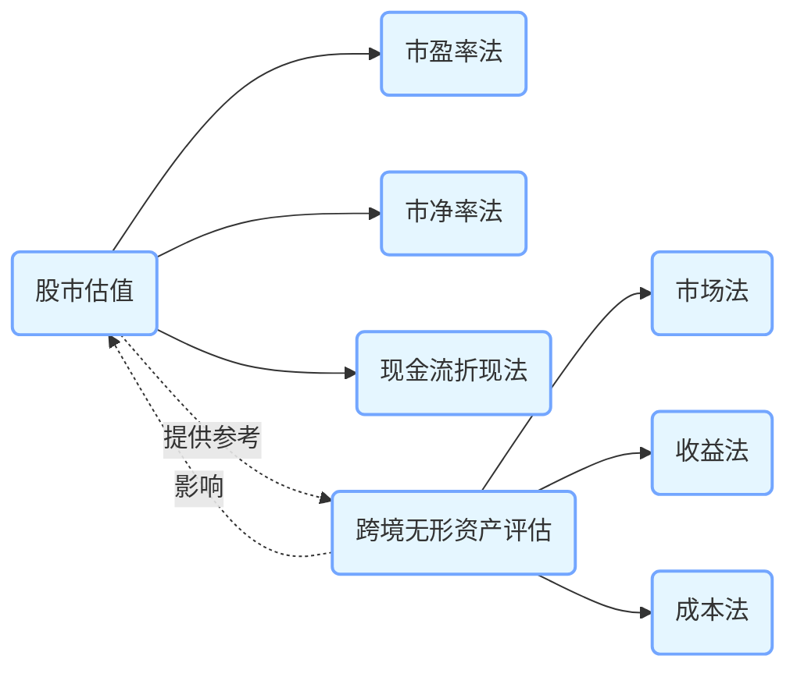

# 股市估值在跨境无形资产评估中的应用

> 关键词：股市估值、跨境无形资产评估、价值评估方法、市场法、应用案例

> 摘要：本文聚焦于股市估值在跨境无形资产评估中的应用。首先阐述了相关的背景信息，包括目的、预期读者等内容。接着详细介绍了股市估值和跨境无形资产评估的核心概念及其联系，剖析了核心算法原理并给出具体操作步骤，同时借助数学模型和公式进行深入讲解。通过项目实战案例，展示了股市估值在跨境无形资产评估中的具体实现过程。探讨了其实际应用场景，推荐了相关的工具和资源。最后对未来发展趋势与挑战进行总结，并提供常见问题解答和扩展阅读参考资料，旨在全面深入地探讨股市估值在跨境无形资产评估领域的重要作用和应用方式。

## 1. 背景介绍 
### 1.1 目的和范围
随着经济全球化的不断推进，跨境投资、并购等经济活动日益频繁，无形资产在企业价值中所占的比重越来越大。准确评估跨境无形资产的价值对于企业的决策、财务报告以及投资者的判断都具有至关重要的意义。股市估值作为一种重要的价值评估手段，其在跨境无形资产评估中的应用也越来越受到关注。本文的目的在于深入探讨股市估值在跨境无形资产评估中的应用原理、方法和实际操作，范围涵盖了股市估值和跨境无形资产评估的基本概念、相关算法、数学模型，以及通过实际案例展示其应用过程等方面。

### 1.2 预期读者
本文预期读者包括从事资产评估、财务分析、投资决策等领域的专业人士，以及对跨境经济活动和无形资产评估感兴趣的学者、研究人员和学生。对于那些参与跨境投资、并购等业务的企业管理人员和金融从业者，本文也能为他们提供有价值的参考信息。

### 1.3 文档结构概述
本文首先介绍相关的背景知识，包括目的、预期读者和文档结构等内容。然后详细阐述股市估值和跨境无形资产评估的核心概念及其联系，给出相应的文本示意图和 Mermaid 流程图。接着讲解核心算法原理和具体操作步骤，并使用 Python 源代码进行详细阐述。之后介绍数学模型和公式，通过举例说明其应用。再通过项目实战案例，展示开发环境搭建、源代码实现和代码解读等过程。探讨实际应用场景，推荐相关的工具和资源。最后对未来发展趋势与挑战进行总结，提供常见问题解答和扩展阅读参考资料。

### 1.4 术语表
#### 1.4.1 核心术语定义
- **股市估值**：是指对股票的价值进行评估，通过各种方法和模型来确定股票的内在价值，以便投资者判断股票的投资价值和市场价格的合理性。
- **跨境无形资产**：是指企业在跨境经济活动中所拥有或控制的，不具有实物形态但能为企业带来经济利益的资产，如专利、商标、品牌、技术诀窍等。
- **无形资产评估**：是指专业评估机构和评估人员依据特定的评估目的，遵循公允、法定的评估标准和程序，运用科学的评估方法，对无形资产的现时价值进行评定和估算的过程。

#### 1.4.2 相关概念解释
- **市场法**：是一种通过比较被评估资产与类似资产在市场上的交易价格来确定被评估资产价值的评估方法。在股市估值和跨境无形资产评估中，市场法常常被用于参考类似企业或资产的市场价格来进行估值。
- **收益法**：是基于资产未来预期收益的现值来评估资产价值的方法。在跨境无形资产评估中，收益法可以通过预测无形资产未来产生的经济收益，并将其折现到当前来确定其价值。
- **成本法**：是指按照重新购置或建造与被评估资产具有同等功能效用的全新资产的现行成本，减去被评估资产的实体性贬值、功能性贬值和经济性贬值等因素，来确定被评估资产价值的方法。

#### 1.4.3 缩略词列表
- **DCF**：Discounted Cash Flow，折现现金流，是收益法中常用的一种计算方法。
- **P/E**：Price-to-Earnings Ratio，市盈率，是股市估值中常用的指标之一。
- **P/B**：Price-to-Book Ratio，市净率，也是股市估值中常用的指标之一。

## 2. 核心概念与联系 

### 股市估值的核心概念
股市估值是投资者进行股票投资决策的重要依据，其目的是确定股票的内在价值，以便判断股票价格是否合理。常见的股市估值方法包括市盈率法、市净率法、现金流折现法等。

- **市盈率法（P/E）**：是指股票价格与每股收益的比率，反映了投资者为获取公司每一元盈利所愿意支付的价格。计算公式为：$P/E=\frac{股票价格}{每股收益}$。
- **市净率法（P/B）**：是指股票价格与每股净资产的比率，反映了市场对公司净资产的估值水平。计算公式为：$P/B=\frac{股票价格}{每股净资产}$。
- **现金流折现法（DCF）**：是通过预测公司未来的自由现金流，并将其折现到当前来确定公司的内在价值。计算公式为：$V=\sum_{t=1}^{n}\frac{FCF_t}{(1+r)^t}$，其中 $V$ 表示公司的内在价值，$FCF_t$ 表示第 $t$ 期的自由现金流，$r$ 表示折现率，$n$ 表示预测期数。

### 跨境无形资产评估的核心概念
跨境无形资产评估是在跨境经济活动中对无形资产价值进行评定和估算的过程。由于无形资产的特殊性，其评估方法主要包括市场法、收益法和成本法。

- **市场法**：通过比较被评估无形资产与类似无形资产在市场上的交易价格来确定其价值。在跨境评估中，需要考虑不同国家和地区的市场差异。
- **收益法**：基于无形资产未来预期产生的经济收益的现值来评估其价值。需要准确预测无形资产的收益流和合适的折现率。
- **成本法**：按照重新开发或购置与被评估无形资产具有同等功能效用的全新资产的成本，减去相关的贬值因素来确定其价值。

### 股市估值与跨境无形资产评估的联系
股市估值和跨境无形资产评估之间存在着密切的联系。一方面，股市估值中的一些方法和指标可以为跨境无形资产评估提供参考。例如，通过分析同行业上市公司的市盈率、市净率等指标，可以了解市场对该行业无形资产的估值水平，从而为跨境无形资产评估提供市场参考。另一方面，跨境无形资产的价值也会影响企业的股市估值。优质的跨境无形资产可以提升企业的竞争力和盈利能力，进而提高企业的股市估值。

### 文本示意图
```plaintext
股市估值
|-- 市盈率法
|-- 市净率法
|-- 现金流折现法

跨境无形资产评估
|-- 市场法
|-- 收益法
|-- 成本法

联系：股市估值指标为跨境无形资产评估提供参考，跨境无形资产价值影响股市估值
```

### Mermaid 流程图


## 3. 核心算法原理 & 具体操作步骤 

### 市盈率法在跨境无形资产评估中的应用原理及步骤
#### 原理
市盈率法是基于市场对企业盈利的预期来评估企业价值的方法。在跨境无形资产评估中，可以通过参考同行业上市公司的市盈率，结合被评估企业的盈利情况来估算其价值，进而推断无形资产的价值。

#### 具体操作步骤
1. **选择可比公司**：在跨境评估中，需要选择与被评估企业处于同一行业、具有相似业务模式和市场环境的上市公司作为可比公司。
2. **计算可比公司的市盈率**：收集可比公司的股票价格和每股收益数据，计算其市盈率。计算公式为：$P/E=\frac{股票价格}{每股收益}$。
3. **确定被评估企业的盈利预测**：对被评估企业的未来盈利进行预测，可以采用历史数据分析法、行业趋势分析法等方法。
4. **计算被评估企业的价值**：用可比公司的平均市盈率乘以被评估企业的预测每股收益，得到被评估企业的价值。计算公式为：$企业价值 = 平均市盈率 \times 预测每股收益 \times 总股本$。
5. **估算无形资产的价值**：从企业价值中减去有形资产的价值，得到无形资产的价值。

#### Python 源代码实现
```python
# 定义可比公司的股票价格和每股收益数据
comparable_companies = [
    {"stock_price": 50, "eps": 2},
    {"stock_price": 60, "eps": 2.5},
    {"stock_price": 45, "eps": 1.8}
]

# 计算可比公司的市盈率
pe_ratios = []
for company in comparable_companies:
    pe = company["stock_price"] / company["eps"]
    pe_ratios.append(pe)

# 计算平均市盈率
average_pe = sum(pe_ratios) / len(pe_ratios)

# 被评估企业的预测每股收益和总股本
estimated_eps = 2.2
total_shares = 1000000

# 计算被评估企业的价值
company_value = average_pe * estimated_eps * total_shares

# 有形资产的价值
tangible_assets_value = 5000000

# 估算无形资产的价值
intangible_assets_value = company_value - tangible_assets_value

print(f"可比公司的平均市盈率: {average_pe}")
print(f"被评估企业的价值: {company_value}")
print(f"无形资产的价值: {intangible_assets_value}")
```

### 现金流折现法在跨境无形资产评估中的应用原理及步骤
#### 原理
现金流折现法是基于资产未来预期产生的现金流的现值来评估资产价值的方法。在跨境无形资产评估中，需要预测无形资产未来产生的现金流，并选择合适的折现率将其折现到当前。

#### 具体操作步骤
1. **预测无形资产的现金流**：分析无形资产的业务模式和市场前景，预测其未来各期的现金流。可以采用市场调研、专家评估等方法。
2. **确定折现率**：折现率反映了投资者对投资风险的预期。在跨境评估中，需要考虑不同国家和地区的风险因素，如政治风险、汇率风险等。可以采用资本资产定价模型（CAPM）等方法确定折现率。
3. **计算现金流的现值**：将预测的各期现金流按照折现率折现到当前。计算公式为：$PV=\frac{CF}{(1+r)^t}$，其中 $PV$ 表示现值，$CF$ 表示现金流，$r$ 表示折现率，$t$ 表示期数。
4. **计算无形资产的价值**：将各期现金流的现值相加，得到无形资产的价值。

#### Python 源代码实现
```python
import numpy as np

# 预测无形资产的现金流
cash_flows = [100000, 120000, 150000, 180000, 200000]

# 确定折现率
discount_rate = 0.1

# 计算现金流的现值
present_values = []
for i, cf in enumerate(cash_flows):
    pv = cf / (1 + discount_rate) ** (i + 1)
    present_values.append(pv)

# 计算无形资产的价值
intangible_assets_value = sum(present_values)

print(f"无形资产的价值: {intangible_assets_value}")
```

## 4. 数学模型和公式 & 详细讲解 & 举例说明 

### 市盈率法的数学模型和公式
市盈率法的核心公式为：$P/E=\frac{股票价格}{每股收益}$，$企业价值 = 平均市盈率 \times 预测每股收益 \times 总股本$，$无形资产价值 = 企业价值 - 有形资产价值$。

#### 详细讲解
- **市盈率（P/E）**：反映了市场对企业盈利的预期。较高的市盈率意味着市场对企业的未来发展前景较为乐观，愿意为每一元盈利支付更高的价格。
- **企业价值**：通过平均市盈率乘以预测每股收益和总股本得到。预测每股收益的准确性对企业价值的计算至关重要，需要综合考虑企业的历史业绩、行业趋势等因素。
- **无形资产价值**：从企业价值中减去有形资产的价值得到。有形资产的价值可以通过资产负债表等财务报表进行确定。

#### 举例说明
假设某行业有三家可比上市公司，其股票价格和每股收益数据如下：
| 公司 | 股票价格（元） | 每股收益（元） |
| ---- | ---- | ---- |
| A | 40 | 2 |
| B | 50 | 2.5 |
| C | 45 | 2.2 |

首先计算可比公司的市盈率：
- 公司 A 的市盈率：$P/E_A=\frac{40}{2}=20$
- 公司 B 的市盈率：$P/E_B=\frac{50}{2.5}=20$
- 公司 C 的市盈率：$P/E_C=\frac{45}{2.2}\approx20.45$

平均市盈率：$\bar{P/E}=\frac{20 + 20 + 20.45}{3}\approx20.15$

被评估企业的预测每股收益为 2.3 元，总股本为 800000 股，有形资产价值为 4000000 元。

企业价值：$企业价值 = 20.15 \times 2.3 \times 800000 = 36976000$（元）

无形资产价值：$无形资产价值 = 36976000 - 4000000 = 32976000$（元）

### 现金流折现法的数学模型和公式
现金流折现法的核心公式为：$V=\sum_{t=1}^{n}\frac{FCF_t}{(1+r)^t}$，其中 $V$ 表示资产的价值，$FCF_t$ 表示第 $t$ 期的自由现金流，$r$ 表示折现率，$n$ 表示预测期数。

#### 详细讲解
- **自由现金流（FCF）**：是指企业在满足了所有营运成本和资本支出后剩余的现金流量，反映了企业的实际盈利能力。
- **折现率（r）**：反映了投资者对投资风险的预期。折现率越高，说明投资者对风险的要求越高，资产的现值越低。
- **预测期数（n）**：需要根据无形资产的使用寿命、市场前景等因素进行合理确定。

#### 举例说明
假设某无形资产未来 5 年的自由现金流预测如下：
| 年份 | 自由现金流（元） |
| ---- | ---- |
| 1 | 100000 |
| 2 | 120000 |
| 3 | 150000 |
| 4 | 180000 |
| 5 | 200000 |

折现率为 10%。

计算各期现金流的现值：
- 第 1 期：$PV_1=\frac{100000}{(1 + 0.1)^1}\approx90909.09$（元）
- 第 2 期：$PV_2=\frac{120000}{(1 + 0.1)^2}\approx99173.55$（元）
- 第 3 期：$PV_3=\frac{150000}{(1 + 0.1)^3}\approx112697.22$（元）
- 第 4 期：$PV_4=\frac{180000}{(1 + 0.1)^4}\approx122942.44$（元）
- 第 5 期：$PV_5=\frac{200000}{(1 + 0.1)^5}\approx124184.26$（元）

无形资产的价值：$V = 90909.09 + 99173.55 + 112697.22 + 122942.44 + 124184.26 = 549906.56$（元）

## 5. 项目实战：代码实际案例和详细解释说明 

### 5.1  开发环境搭建
本次项目实战使用 Python 语言进行开发，需要安装以下必要的库：
- **pandas**：用于数据处理和分析。
- **numpy**：用于数值计算。
- **matplotlib**：用于数据可视化。

可以使用以下命令进行安装：
```sh
pip install pandas numpy matplotlib
```

### 5.2  源代码详细实现和代码解读
```python
import pandas as pd
import numpy as np
import matplotlib.pyplot as plt

# 定义可比公司的数据
comparable_companies_data = {
    "company_name": ["A", "B", "C"],
    "stock_price": [40, 50, 45],
    "eps": [2, 2.5, 2.2]
}

# 创建 DataFrame
comparable_companies_df = pd.DataFrame(comparable_companies_data)

# 计算可比公司的市盈率
comparable_companies_df["pe_ratio"] = comparable_companies_df["stock_price"] / comparable_companies_df["eps"]

# 计算平均市盈率
average_pe = comparable_companies_df["pe_ratio"].mean()

# 被评估企业的预测每股收益和总股本
estimated_eps = 2.3
total_shares = 800000

# 计算被评估企业的价值
company_value = average_pe * estimated_eps * total_shares

# 有形资产的价值
tangible_assets_value = 4000000

# 估算无形资产的价值
intangible_assets_value = company_value - tangible_assets_value

# 打印结果
print(f"可比公司的平均市盈率: {average_pe}")
print(f"被评估企业的价值: {company_value}")
print(f"无形资产的价值: {intangible_assets_value}")

# 可视化可比公司的市盈率
plt.bar(comparable_companies_df["company_name"], comparable_companies_df["pe_ratio"])
plt.xlabel("Company Name")
plt.ylabel("P/E Ratio")
plt.title("P/E Ratios of Comparable Companies")
plt.show()
```

### 5.3  代码解读与分析
1. **数据定义和 DataFrame 创建**：使用字典定义可比公司的数据，包括公司名称、股票价格和每股收益。然后使用 `pandas` 库的 `DataFrame` 函数创建数据框。
2. **市盈率计算**：通过将股票价格除以每股收益，计算可比公司的市盈率，并将结果添加到数据框中。
3. **平均市盈率计算**：使用 `mean` 函数计算可比公司市盈率的平均值。
4. **企业价值和无形资产价值计算**：根据平均市盈率、预测每股收益和总股本计算被评估企业的价值，然后从企业价值中减去有形资产的价值得到无形资产的价值。
5. **结果打印**：使用 `print` 函数打印可比公司的平均市盈率、被评估企业的价值和无形资产的价值。
6. **数据可视化**：使用 `matplotlib` 库的 `bar` 函数绘制可比公司市盈率的柱状图，直观展示各公司的市盈率情况。

## 6. 实际应用场景 
### 跨境并购
在跨境并购中，准确评估目标企业的无形资产价值对于确定并购价格至关重要。股市估值可以为无形资产评估提供市场参考，帮助并购方了解目标企业无形资产在市场上的价值水平。例如，通过分析同行业上市公司的市盈率、市净率等指标，并购方可以判断目标企业的无形资产是否具有较高的价值，从而决定是否进行并购以及确定合理的并购价格。

### 跨境投资
在跨境投资中，投资者需要评估投资项目的价值和风险。无形资产作为企业的重要资产之一，其价值的评估对于投资决策具有重要影响。股市估值方法可以帮助投资者评估目标企业的无形资产价值，从而判断投资项目的潜在收益和风险。例如，投资者可以通过现金流折现法预测目标企业无形资产未来产生的现金流，并结合市场情况确定合适的折现率，进而评估投资项目的价值。

### 财务报告
在跨境企业的财务报告中，准确披露无形资产的价值对于投资者和其他利益相关者了解企业的财务状况和经营成果具有重要意义。股市估值方法可以为无形资产的计量和披露提供参考，提高财务报告的准确性和可靠性。例如，企业可以采用市盈率法或现金流折现法评估无形资产的价值，并在财务报表中进行相应的披露。

### 技术转让
在跨境技术转让中，确定技术的合理价格是关键。股市估值可以帮助评估技术的市场价值，为技术转让双方提供参考。例如，通过分析同行业上市公司中与该技术相关的无形资产的估值情况，转让双方可以确定技术转让的合理价格，促进技术的跨境流动和应用。

## 7. 工具和资源推荐
### 7.1 学习资源推荐
#### 7.1.1 书籍推荐
- 《资产评估学》：全面介绍了资产评估的基本理论、方法和应用，包括无形资产评估的相关内容。
- 《公司金融》：涵盖了公司估值、投资决策等方面的知识，对于理解股市估值和跨境无形资产评估的原理和方法有很大帮助。
- 《价值评估：公司价值的衡量与管理》：详细阐述了各种价值评估方法，包括市场法、收益法和成本法，以及如何在实际中应用这些方法进行企业和资产的估值。

#### 7.1.2 在线课程
- Coursera 上的“Financial Markets”：由耶鲁大学教授 Robert Shiller 讲授，介绍了金融市场的基本原理和估值方法。
- edX 上的“Corporate Finance”：提供了公司金融的系统知识，包括估值模型和投资决策等内容。
- 中国大学 MOOC 上的“资产评估学”：国内高校开设的资产评估课程，详细讲解了资产评估的理论和实践。

#### 7.1.3 技术博客和网站
- Seeking Alpha：提供了丰富的股票分析和估值文章，对于了解股市估值方法和市场动态有很大帮助。
- Bloomberg：全球知名的金融信息服务提供商，提供了大量的金融数据和分析报告，可用于跨境无形资产评估的参考。
- 中国资产评估协会官网：发布了资产评估的相关政策、法规和行业动态，是了解国内无形资产评估行业的重要渠道。

### 7.2 开发工具框架推荐
#### 7.2.1 IDE和编辑器
- PyCharm：一款专业的 Python 集成开发环境，具有强大的代码编辑、调试和分析功能，适合进行股市估值和跨境无形资产评估的代码开发。
- Jupyter Notebook：一种交互式的开发环境，支持 Python 代码的编写、运行和可视化展示，方便进行数据探索和分析。
- Visual Studio Code：一款轻量级的代码编辑器，支持多种编程语言和插件扩展，可用于快速编写和调试代码。

#### 7.2.2 调试和性能分析工具
- pdb：Python 内置的调试器，可用于调试 Python 代码，帮助开发者查找和解决代码中的问题。
- cProfile：Python 标准库中的性能分析工具，可用于分析代码的执行时间和性能瓶颈，优化代码性能。
- Py-Spy：一个简单易用的 Python 性能分析工具，可实时监控 Python 程序的性能，帮助开发者快速定位性能问题。

#### 7.2.3 相关框架和库
- pandas：用于数据处理和分析，提供了高效的数据结构和数据操作方法，方便处理和分析股市和无形资产评估相关的数据。
- numpy：用于数值计算，提供了丰富的数学函数和数组操作功能，可用于实现各种估值算法。
- scikit-learn：一个强大的机器学习库，可用于构建预测模型，辅助进行无形资产的收益预测和价值评估。

### 7.3 相关论文著作推荐
#### 7.3.1 经典论文
- "The Theory of Investment Value" by John Burr Williams：提出了现金流折现法的基本理论，为资产估值提供了重要的理论基础。
- "Capital Asset Pricing Model: Theory and Evidence" by Eugene F. Fama and Kenneth R. French：对资本资产定价模型进行了深入的研究和实证分析，为确定折现率提供了理论依据。
- "Valuation of Intangible Assets" by Baruch Lev：系统地阐述了无形资产评估的理论和方法，对跨境无形资产评估具有重要的参考价值。

#### 7.3.2 最新研究成果
- 关注国际知名学术期刊，如《Journal of Finance》、《Review of Financial Studies》等，这些期刊经常发表关于资产估值和无形资产评估的最新研究成果。
- 参加国际学术会议，如美国金融协会年会（AFA）、欧洲金融协会年会（EFA）等，了解行业内的最新研究动态和前沿技术。

#### 7.3.3 应用案例分析
- 阅读专业的资产评估报告和案例集，了解不同行业、不同类型无形资产的评估方法和实践经验。
- 分析上市公司的财务报表和年报，了解企业在无形资产评估和披露方面的实际做法和应用案例。

## 8. 总结：未来发展趋势与挑战
### 未来发展趋势
- **数据驱动的评估方法**：随着信息技术的不断发展，大量的金融数据和企业信息可以被获取和分析。未来，股市估值和跨境无形资产评估将更加依赖于数据驱动的方法，通过大数据分析、机器学习等技术，提高评估的准确性和效率。
- **国际标准的统一**：在经济全球化的背景下，跨境经济活动日益频繁，对无形资产评估的国际标准统一的需求也越来越强烈。未来，国际评估准则将不断完善和统一，为跨境无形资产评估提供更加规范和一致的标准。
- **无形资产价值的重视**：随着知识经济的发展，无形资产在企业价值中所占的比重越来越大。未来，企业和投资者将更加重视无形资产的价值评估，股市估值在跨境无形资产评估中的应用也将更加广泛和深入。

### 挑战
- **数据质量和可靠性**：股市估值和跨境无形资产评估需要大量的数据支持，但数据的质量和可靠性可能存在问题。不同国家和地区的数据标准、统计方法可能存在差异，数据的真实性和完整性也需要进行验证。
- **风险评估的复杂性**：在跨境评估中，需要考虑不同国家和地区的政治、经济、法律等风险因素，风险评估的复杂性增加。如何准确评估这些风险，并将其纳入估值模型中，是一个挑战。
- **评估方法的局限性**：目前的股市估值和跨境无形资产评估方法都存在一定的局限性。例如，市盈率法可能受到市场情绪的影响，现金流折现法的预测准确性依赖于对未来现金流和折现率的估计。如何改进和完善评估方法，提高评估的准确性和可靠性，是未来需要解决的问题。

## 9. 附录：常见问题与解答
### 问题 1：股市估值方法在跨境无形资产评估中的适用范围是什么？
股市估值方法在跨境无形资产评估中适用于具有一定市场活跃度和可比性的企业和无形资产。例如，对于同行业上市公司较多的行业，可以采用市盈率法、市净率法等市场法进行评估。对于能够预测未来现金流的无形资产，可以采用现金流折现法进行评估。但对于一些独特的、缺乏可比市场数据的无形资产，股市估值方法的适用性可能会受到限制。

### 问题 2：如何选择合适的可比公司进行市盈率法评估？
选择可比公司时，需要考虑以下因素：
- **行业相同**：选择与被评估企业处于同一行业的上市公司，以确保市场环境和业务模式的相似性。
- **规模相近**：可比公司的规模应与被评估企业相近，包括资产规模、营业收入等方面。
- **财务状况相似**：可比公司的财务指标，如盈利能力、偿债能力等，应与被评估企业相似。
- **地域因素**：在跨境评估中，需要考虑可比公司的地域因素，尽量选择与被评估企业所在国家或地区市场环境相似的公司。

### 问题 3：现金流折现法中如何确定折现率？
折现率的确定可以采用以下方法：
- **资本资产定价模型（CAPM）**：$r = R_f + \beta \times (R_m - R_f)$，其中 $r$ 表示折现率，$R_f$ 表示无风险利率，$\beta$ 表示资产的系统性风险系数，$R_m$ 表示市场收益率。
- **加权平均资本成本（WACC）**：考虑企业的债务成本和股权成本，根据企业的资本结构计算加权平均资本成本作为折现率。
- **风险调整法**：在无风险利率的基础上，根据无形资产的风险程度进行调整，确定折现率。

### 问题 4：跨境无形资产评估中需要考虑哪些特殊因素？
跨境无形资产评估中需要考虑以下特殊因素：
- **法律和监管环境**：不同国家和地区的法律和监管环境不同，可能会影响无形资产的价值和评估方法的选择。
- **税收政策**：税收政策的差异可能会影响无形资产的收益和成本，进而影响其价值。
- **汇率波动**：汇率波动会影响跨境无形资产的现金流和价值，需要在评估中进行考虑。
- **文化差异**：文化差异可能会影响无形资产的市场接受度和价值，例如品牌在不同文化背景下的认知度和影响力可能不同。

## 10. 扩展阅读 & 参考资料
- 资产评估准则委员会. 资产评估准则[M]. 中国财政经济出版社, 20XX.
- 财政部. 企业会计准则[M]. 经济科学出版社, 20XX.
- 相关上市公司的年报和财务报表.
- 国际评估准则理事会（IVSC）发布的相关准则和报告.
- 国内外知名金融机构和研究机构发布的研究报告和分析文章.