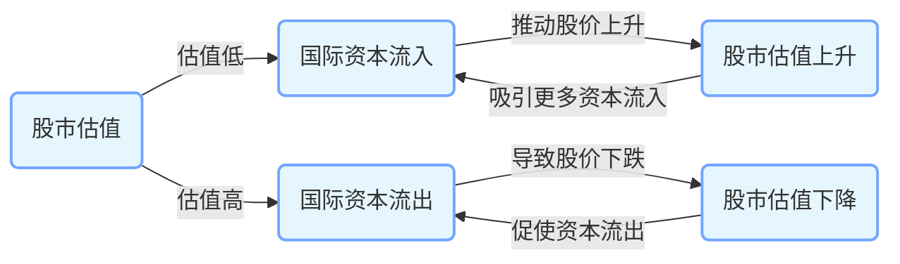

# 股市估值对国际资本流动的影响

> 关键词：股市估值、国际资本流动、估值指标、资本流动机制、市场影响

> 摘要：本文聚焦于股市估值对国际资本流动的影响这一重要议题。通过深入探讨股市估值的相关概念、影响因素，详细分析国际资本流动的机制，以及二者之间的内在联系，揭示股市估值如何引导国际资本的流向。同时结合数学模型、实际案例和应用场景进行阐述，为投资者、政策制定者等提供全面的理论依据和实践参考，以更好地理解和应对国际资本流动的变化。

## 1. 背景介绍 
### 1.1 目的和范围
随着经济全球化的深入发展，国际资本流动的规模和速度不断增加，对各国金融市场和实体经济产生着深远的影响。股市作为金融市场的重要组成部分，其估值水平的高低不仅反映了市场对上市公司的预期，也在很大程度上影响着国际资本的流动决策。本文旨在深入研究股市估值对国际资本流动的影响机制，探讨不同估值水平下国际资本的流动趋势，以及这种流动对各国股市和经济的影响。研究范围涵盖全球主要股票市场，包括发达经济体和新兴经济体的股市。

### 1.2 预期读者
本文预期读者包括金融市场投资者，如个人投资者、机构投资者等，他们可以通过了解股市估值与国际资本流动的关系，优化投资决策；金融从业者，如银行、证券、基金等行业的工作人员，有助于他们更好地理解市场动态和客户需求；政策制定者，能够为其制定相关政策，维护金融市场稳定和促进经济发展提供参考；以及对金融市场和国际资本流动感兴趣的研究人员和学者。

### 1.3 文档结构概述
本文首先介绍背景信息，包括目的、预期读者和文档结构概述等。接着阐述股市估值和国际资本流动的核心概念及其联系，通过文本示意图和 Mermaid 流程图进行直观展示。然后详细讲解影响股市估值和国际资本流动的核心算法原理和具体操作步骤，并给出 Python 源代码示例。再通过数学模型和公式对相关关系进行量化分析，并举例说明。之后通过项目实战，展示代码实际案例并进行详细解释。进一步探讨实际应用场景，推荐相关工具和资源。最后总结未来发展趋势与挑战，解答常见问题，并提供扩展阅读和参考资料。

### 1.4 术语表
#### 1.4.1 核心术语定义
- **股市估值**：是指对股票市场中上市公司的价值进行评估的过程和结果，通常通过一系列估值指标来衡量，如市盈率（P/E）、市净率（P/B）等。
- **国际资本流动**：是指资本在不同国家或地区之间的转移和流动，包括国际直接投资、国际证券投资等多种形式。
- **估值指标**：用于衡量股市估值水平的具体指标，常见的有市盈率、市净率、股息率等。

#### 1.4.2 相关概念解释
- **市盈率（P/E）**：是指股票价格与每股收益的比率，反映了市场对公司未来盈利的预期。较高的市盈率可能表示市场对公司前景较为乐观，也可能意味着股票被高估。
- **市净率（P/B）**：是指股票价格与每股净资产的比率，反映了市场对公司净资产的估值。较低的市净率可能表示股票具有一定的投资价值。
- **国际直接投资（FDI）**：是指投资者在国外直接设立企业或收购现有企业的股权，以获得对企业的控制权和经营管理权。
- **国际证券投资**：是指投资者通过购买国外的股票、债券等证券资产，以获取投资收益的行为。

#### 1.4.3 缩略词列表
- **P/E**：市盈率（Price - Earnings Ratio）
- **P/B**：市净率（Price - Book Ratio）
- **FDI**：国际直接投资（Foreign Direct Investment）

## 2. 核心概念与联系 

### 2.1 股市估值核心概念
股市估值是对股票市场中上市公司价值的评估，其目的是确定股票的合理价格，为投资者提供投资决策的依据。常见的估值方法包括相对估值法和绝对估值法。

相对估值法是通过比较同行业或类似公司的估值指标来评估目标公司的价值，常见的估值指标有市盈率、市净率、市销率等。例如，市盈率是股票价格与每股收益的比值，反映了投资者为获取公司每一元盈利所愿意支付的价格。市净率是股票价格与每股净资产的比值，反映了投资者为获取公司每一元净资产所愿意支付的价格。

绝对估值法是通过对公司未来现金流的折现来评估公司的价值，常见的方法有股息折现模型（DDM）、自由现金流折现模型（FCFF）等。股息折现模型认为股票的价值等于其未来股息的现值之和，自由现金流折现模型认为公司的价值等于其未来自由现金流的现值之和。

### 2.2 国际资本流动核心概念
国际资本流动是指资本在不同国家或地区之间的转移和流动，其目的是实现资本的增值和配置效率的提高。国际资本流动可以分为长期资本流动和短期资本流动。

长期资本流动是指期限在一年以上的资本流动，包括国际直接投资、国际证券投资和国际贷款等。国际直接投资是指投资者在国外直接设立企业或收购现有企业的股权，以获得对企业的控制权和经营管理权。国际证券投资是指投资者通过购买国外的股票、债券等证券资产，以获取投资收益的行为。国际贷款是指一国政府、金融机构或企业向另一国政府、金融机构或企业提供的贷款。

短期资本流动是指期限在一年以下的资本流动，包括贸易性资本流动、金融性资本流动和投机性资本流动等。贸易性资本流动是指由于国际贸易而引起的资本流动，如进出口贸易中的延期付款、预付款等。金融性资本流动是指由于金融市场的变化而引起的资本流动，如短期证券投资、银行间同业拆借等。投机性资本流动是指为了获取投机利润而进行的资本流动，如外汇投机、期货投机等。

### 2.3 股市估值与国际资本流动的联系
股市估值与国际资本流动之间存在着密切的联系。当一国股市估值较低时，意味着该国股票具有较高的投资价值，国际资本可能会流入该国股市，以获取投资收益。相反，当一国股市估值较高时，意味着该国股票可能被高估，国际资本可能会流出该国股市，以避免投资风险。

此外，股市估值的变化也会影响国际资本流动的方向和规模。如果一国股市估值持续上升，国际资本可能会加速流入该国股市；如果一国股市估值持续下降，国际资本可能会加速流出该国股市。

### 2.4 文本示意图
```plaintext
股市估值 <---- 相互影响 ----> 国际资本流动
|                          |
| 估值指标（P/E、P/B等）   | 流动形式（FDI、证券投资等）
|                          |
| 影响因素（经济增长、利率） | 影响因素（政策、汇率）
```

### 2.5 Mermaid 流程图


## 3. 核心算法原理 & 具体操作步骤 

### 3.1 股市估值计算算法原理
#### 3.1.1 市盈率（P/E）计算
市盈率是股票价格与每股收益的比值，计算公式为：
$$P/E=\frac{股价}{每股收益}$$

在 Python 中实现市盈率计算的代码如下：
```python
def calculate_pe(stock_price, earnings_per_share):
    if earnings_per_share == 0:
        return None
    return stock_price / earnings_per_share

# 示例使用
stock_price = 50
earnings_per_share = 5
pe_ratio = calculate_pe(stock_price, earnings_per_share)
print(f"市盈率: {pe_ratio}")
```
#### 3.1.2 市净率（P/B）计算
市净率是股票价格与每股净资产的比值，计算公式为：
$$P/B=\frac{股价}{每股净资产}$$

在 Python 中实现市净率计算的代码如下：
```python
def calculate_pb(stock_price, book_value_per_share):
    if book_value_per_share == 0:
        return None
    return stock_price / book_value_per_share

# 示例使用
stock_price = 50
book_value_per_share = 10
pb_ratio = calculate_pb(stock_price, book_value_per_share)
print(f"市净率: {pb_ratio}")
```

### 3.2 国际资本流动模拟算法原理
国际资本流动受到多种因素的影响，包括股市估值、利率、汇率、政策等。我们可以使用简单的线性回归模型来模拟国际资本流动与股市估值之间的关系。

假设国际资本流动（$CF$）与股市估值（$V$）之间的关系可以表示为：
$$CF = \beta_0+\beta_1V+\epsilon$$
其中，$\beta_0$ 是截距，$\beta_1$ 是斜率，$\epsilon$ 是误差项。

在 Python 中实现简单线性回归模型的代码如下：
```python
import numpy as np
from sklearn.linear_model import LinearRegression

# 示例数据
stock_valuations = np.array([10, 20, 30, 40, 50]).reshape(-1, 1)
capital_flows = np.array([100, 200, 300, 400, 500])

# 创建线性回归模型
model = LinearRegression()
model.fit(stock_valuations, capital_flows)

# 预测
new_valuation = np.array([60]).reshape(-1, 1)
predicted_flow = model.predict(new_valuation)
print(f"预测的国际资本流动: {predicted_flow[0]}")
```

### 3.3 具体操作步骤
#### 3.3.1 数据收集
收集各国股市的相关数据，包括股票价格、每股收益、每股净资产等，用于计算股市估值指标。同时收集国际资本流动的数据，包括国际直接投资、国际证券投资等。

#### 3.3.2 数据预处理
对收集到的数据进行清洗、整理和标准化处理，去除缺失值、异常值等，以提高数据的质量。

#### 3.3.3 计算股市估值指标
根据上述算法原理，计算各国股市的市盈率、市净率等估值指标。

#### 3.3.4 建立模型
使用收集到的数据和计算得到的估值指标，建立国际资本流动与股市估值之间的关系模型，如线性回归模型、时间序列模型等。

#### 3.3.5 模型评估和优化
使用交叉验证、均方误差等方法对建立的模型进行评估和优化，以提高模型的准确性和稳定性。

#### 3.3.6 预测和决策
使用优化后的模型对未来的国际资本流动进行预测，并根据预测结果进行投资决策和政策制定。

## 4. 数学模型和公式 & 详细讲解 & 举例说明 

### 4.1 股市估值模型
#### 4.1.1 股息折现模型（DDM）
股息折现模型认为股票的价值等于其未来股息的现值之和，基本公式为：
$$V=\sum_{t = 1}^{\infty}\frac{D_t}{(1 + r)^t}$$
其中，$V$ 是股票的价值，$D_t$ 是第 $t$ 期的股息，$r$ 是折现率。

在实际应用中，为了简化计算，通常假设股息以固定的增长率 $g$ 增长，即 $D_t=D_{t - 1}(1 + g)$，则公式可以简化为：
$$V=\frac{D_1}{r - g}$$
其中，$D_1$ 是下一期的股息。

例如，某股票下一期的股息为 $2$ 元，折现率为 $10\%$，股息增长率为 $5\%$，则该股票的价值为：
$$V=\frac{2}{0.1 - 0.05}=40$$（元）

#### 4.1.2 自由现金流折现模型（FCFF）
自由现金流折现模型认为公司的价值等于其未来自由现金流的现值之和，基本公式为：
$$V=\sum_{t = 1}^{\infty}\frac{FCFF_t}{(1 + WACC)^t}$$
其中，$V$ 是公司的价值，$FCFF_t$ 是第 $t$ 期的自由现金流，$WACC$ 是加权平均资本成本。

### 4.2 国际资本流动模型
#### 4.2.1 利率平价理论
利率平价理论认为，两国之间的利率差异会导致资本的流动，从而使两国货币的汇率达到均衡。利率平价理论的公式为：
$$\frac{F}{S}=\frac{1 + i_d}{1 + i_f}$$
其中，$F$ 是远期汇率，$S$ 是即期汇率，$i_d$ 是本国利率，$i_f$ 是外国利率。

例如，假设本国利率为 $5\%$，外国利率为 $3\%$，即期汇率为 $1$ 美元兑换 $6$ 元人民币，则远期汇率为：
$$F = S\times\frac{1 + i_d}{1 + i_f}=6\times\frac{1 + 0.05}{1 + 0.03}\approx6.12$$（元人民币/美元）

#### 4.2.2 资产组合理论
资产组合理论认为，投资者会根据不同资产的预期收益率、风险和相关性等因素，选择最优的资产组合，以实现风险最小化和收益最大化。资产组合理论的公式为：
$$E(R_p)=\sum_{i = 1}^{n}w_iE(R_i)$$
$$\sigma_p^2=\sum_{i = 1}^{n}\sum_{j = 1}^{n}w_iw_j\sigma_{ij}$$
其中，$E(R_p)$ 是资产组合的预期收益率，$w_i$ 是第 $i$ 种资产的权重，$E(R_i)$ 是第 $i$ 种资产的预期收益率，$\sigma_p^2$ 是资产组合的方差，$\sigma_{ij}$ 是第 $i$ 种资产和第 $j$ 种资产的协方差。

### 4.3 股市估值与国际资本流动的关系模型
我们可以使用多元线性回归模型来描述股市估值与国际资本流动之间的关系，公式为：
$$CF=\beta_0+\beta_1P/E+\beta_2P/B+\beta_3r+\beta_4e+\epsilon$$
其中，$CF$ 是国际资本流动，$P/E$ 是市盈率，$P/B$ 是市净率，$r$ 是利率，$e$ 是汇率，$\beta_0,\beta_1,\beta_2,\beta_3,\beta_4$ 是回归系数，$\epsilon$ 是误差项。

例如，通过对历史数据的回归分析，得到回归系数 $\beta_0 = 100$，$\beta_1=- 5$，$\beta_2=- 3$，$\beta_3 = 20$，$\beta_4=- 10$，当市盈率为 $20$，市净率为 $3$，利率为 $5\%$，汇率为 $6$ 时，预测的国际资本流动为：
$$CF=100-5\times20 - 3\times3+20\times0.05-10\times6=-59$$

## 5. 项目实战：代码实际案例和详细解释说明 

### 5.1  开发环境搭建
#### 5.1.1 安装 Python
首先需要安装 Python 开发环境，建议使用 Python 3.7 及以上版本。可以从 Python 官方网站（https://www.python.org/downloads/）下载并安装。

#### 5.1.2 安装必要的库
在项目中需要使用一些 Python 库，如 pandas、numpy、scikit - learn 等。可以使用以下命令进行安装：
```sh
pip install pandas numpy scikit-learn matplotlib
```

### 5.2  源代码详细实现和代码解读
#### 5.2.1 数据获取和预处理
```python
import pandas as pd
import numpy as np

# 模拟数据获取
data = {
    'stock_price': [50, 60, 70, 80, 90],
    'earnings_per_share': [5, 6, 7, 8, 9],
    'book_value_per_share': [10, 12, 14, 16, 18],
    'capital_flow': [100, 120, 140, 160, 180]
}
df = pd.DataFrame(data)

# 计算市盈率和市净率
df['pe_ratio'] = df['stock_price'] / df['earnings_per_share']
df['pb_ratio'] = df['stock_price'] / df['book_value_per_share']

# 数据预处理：去除缺失值
df = df.dropna()

print(df)
```
代码解读：
- 首先，我们使用字典模拟了股票价格、每股收益、每股净资产和国际资本流动的数据，并将其转换为 Pandas 数据框。
- 然后，计算了市盈率和市净率，并将其添加到数据框中。
- 最后，使用 `dropna()` 方法去除数据框中的缺失值。

#### 5.2.2 建立线性回归模型
```python
from sklearn.linear_model import LinearRegression
from sklearn.model_selection import train_test_split
from sklearn.metrics import mean_squared_error

# 特征和目标变量
X = df[['pe_ratio', 'pb_ratio']]
y = df['capital_flow']

# 划分训练集和测试集
X_train, X_test, y_train, y_test = train_test_split(X, y, test_size=0.2, random_state=42)

# 创建线性回归模型
model = LinearRegression()

# 训练模型
model.fit(X_train, y_train)

# 预测
y_pred = model.predict(X_test)

# 评估模型
mse = mean_squared_error(y_test, y_pred)
print(f"均方误差: {mse}")
```
代码解读：
- 首先，我们从数据框中提取了市盈率和市净率作为特征变量，国际资本流动作为目标变量。
- 然后，使用 `train_test_split()` 方法将数据划分为训练集和测试集，测试集占比为 $20\%$。
- 接着，创建了线性回归模型，并使用训练集数据对模型进行训练。
- 最后，使用测试集数据进行预测，并计算了均方误差来评估模型的性能。

### 5.3  代码解读与分析
#### 5.3.1 数据预处理的重要性
数据预处理是数据分析和建模的重要步骤，它可以提高数据的质量和可用性，减少模型的误差。在本项目中，我们去除了数据中的缺失值，避免了因缺失值导致的模型训练错误。

#### 5.3.2 线性回归模型的局限性
线性回归模型是一种简单而有效的建模方法，但它也有一定的局限性。例如，它假设特征变量和目标变量之间存在线性关系，对于非线性关系的数据集，线性回归模型的性能可能会受到影响。在实际应用中，可以考虑使用更复杂的模型，如决策树、神经网络等。

#### 5.3.3 模型评估的意义
模型评估是模型选择和优化的重要依据，通过计算均方误差等评估指标，可以了解模型的性能和准确性。在本项目中，我们使用均方误差来评估线性回归模型的性能，均方误差越小，说明模型的预测结果越接近真实值。

## 6. 实际应用场景 
### 6.1 投资者决策
投资者可以根据股市估值和国际资本流动的关系，制定投资策略。当一国股市估值较低时，国际资本可能会流入该国股市，投资者可以考虑增加对该国股票的投资；当一国股市估值较高时，国际资本可能会流出该国股市，投资者可以考虑减少对该国股票的投资。

例如，在 2008 年全球金融危机后，美国股市估值大幅下降，吸引了大量国际资本流入。一些投资者抓住了这个机会，增加了对美国股票的投资，获得了较高的收益。

### 6.2 政策制定
政策制定者可以通过调整股市估值和国际资本流动的相关政策，来维护金融市场的稳定和促进经济的发展。例如，当股市估值过高时，政策制定者可以采取加息、提高印花税等措施，抑制股市泡沫，防止国际资本大规模流出；当股市估值过低时，政策制定者可以采取降息、降低印花税等措施，刺激股市上涨，吸引国际资本流入。

例如，在 2020 年新冠疫情爆发后，全球股市大幅下跌，各国政府纷纷采取降息、量化宽松等政策措施，以稳定股市和吸引国际资本流入。

### 6.3 金融机构风险管理
金融机构可以根据股市估值和国际资本流动的变化，调整资产配置和风险管理策略。例如，当国际资本大规模流入时，金融机构可以增加对股票等风险资产的配置；当国际资本大规模流出时，金融机构可以增加对债券等安全资产的配置。

例如，一些银行在国际资本流动频繁的时期，会加强对资产负债表的管理，提高资本充足率，以应对可能的风险。

### 6.4 跨国公司战略规划
跨国公司可以根据不同国家股市估值和国际资本流动的情况，制定全球战略规划。例如，当一国股市估值较低且国际资本流入时，跨国公司可以考虑在该国进行投资和并购活动；当一国股市估值较高且国际资本流出时，跨国公司可以考虑减少在该国的投资和业务。

例如，一些跨国公司在新兴经济体股市估值较低时，会加大在这些国家的投资，以获取更高的回报。

## 7. 工具和资源推荐
### 7.1 学习资源推荐
#### 7.1.1 书籍推荐
- 《金融学》（兹维·博迪、罗伯特·C·莫顿著）：全面介绍了金融学的基本概念、理论和方法，是学习金融学的经典教材。
- 《投资学》（滋维·博迪、亚历克斯·凯恩、艾伦·J·马库斯著）：系统阐述了投资学的原理和实践，包括资产定价、投资组合管理、衍生工具等内容。
- 《金融市场与金融机构基础》（弗兰克·J·法博齐、弗朗哥·莫迪利亚尼等著）：介绍了金融市场和金融机构的基本知识和运行机制。

#### 7.1.2 在线课程
- Coursera 上的“Financial Markets”（耶鲁大学公开课）：由著名经济学家罗伯特·希勒教授授课，讲解了金融市场的基本原理和运作机制。
- edX 上的“Introduction to Financial Markets”（哥伦比亚大学公开课）：介绍了金融市场的基本概念、金融工具和投资策略。
- 中国大学 MOOC 上的“公司金融”：由国内知名高校的教授授课，讲解了公司金融的基本理论和方法。

#### 7.1.3 技术博客和网站
- 雪球网（https://xueqiu.com/）：是一个股票投资社区，提供股票行情、资讯、研报等内容，同时也有很多投资者分享自己的投资经验和观点。
- 东方财富网（https://www.eastmoney.com/）：是国内知名的金融门户网站，提供股票、基金、债券等金融产品的行情、资讯和分析。
- Seeking Alpha（https://seekingalpha.com/）：是一个全球知名的金融投资网站，提供股票、基金、宏观经济等方面的分析和评论。

### 7.2 开发工具框架推荐
#### 7.2.1 IDE和编辑器
- PyCharm：是一款专业的 Python 集成开发环境，具有代码编辑、调试、版本控制等功能，适合开发复杂的 Python 项目。
- Jupyter Notebook：是一个交互式的开发环境，支持 Python、R 等多种编程语言，适合进行数据分析和模型开发。
- Visual Studio Code：是一款轻量级的代码编辑器，支持多种编程语言和插件，具有丰富的扩展功能。

#### 7.2.2 调试和性能分析工具
- pdb：是 Python 自带的调试工具，可以在代码中设置断点，逐行调试代码。
- cProfile：是 Python 自带的性能分析工具，可以分析代码的运行时间和函数调用情况。
- Py-Spy：是一个基于 Rust 编写的 Python 性能分析工具，可以实时分析 Python 程序的性能。

#### 7.2.3 相关框架和库
- Pandas：是一个强大的数据处理和分析库，提供了 DataFrame 等数据结构，方便进行数据清洗、整理和分析。
- NumPy：是一个科学计算库，提供了多维数组和数学函数，支持高效的数值计算。
- Scikit - learn：是一个机器学习库，提供了各种机器学习算法和工具，如分类、回归、聚类等。

### 7.3 相关论文著作推荐
#### 7.3.1 经典论文
- Markowitz, H. M. (1952). Portfolio Selection. The Journal of Finance, 7(1), 77 - 91. 这篇论文提出了资产组合理论，奠定了现代投资组合理论的基础。
- Modigliani, F., & Miller, M. H. (1958). The Cost of Capital, Corporation Finance and the Theory of Investment. The American Economic Review, 48(3), 261 - 297. 这篇论文提出了 MM 定理，对公司金融理论的发展产生了深远影响。

#### 7.3.2 最新研究成果
- 通过 Google Scholar 等学术搜索引擎，可以搜索到关于股市估值和国际资本流动的最新研究成果。例如，一些研究探讨了新兴经济体股市估值与国际资本流动的关系，以及数字化时代国际资本流动的新趋势。

#### 7.3.3 应用案例分析
- 国际货币基金组织（IMF）、世界银行等国际组织的官方网站上，会发布一些关于国际资本流动的研究报告和应用案例分析。这些案例可以帮助我们更好地理解股市估值和国际资本流动在实际中的应用和影响。

## 8. 总结：未来发展趋势与挑战
### 8.1 未来发展趋势
#### 8.1.1 数字化趋势
随着信息技术的不断发展，金融市场的数字化程度将不断提高。股市估值和国际资本流动的信息将更加透明和及时，投资者可以通过互联网和移动终端获取更多的信息和分析工具。同时，数字货币的发展也可能会对国际资本流动产生影响，改变传统的资本流动模式。

#### 8.1.2 新兴经济体崛起
新兴经济体的经济增长速度较快，股市规模不断扩大，其股市估值和国际资本流动的影响力也将不断增强。未来，新兴经济体的股市可能会吸引更多的国际资本流入，成为全球金融市场的重要组成部分。

#### 8.1.3 绿色金融发展
随着全球对环境保护和可持续发展的重视，绿色金融将成为未来金融市场的重要发展方向。股市估值和国际资本流动也将受到绿色金融的影响，投资者可能会更加关注企业的环境、社会和治理（ESG）表现，将更多的资本投向绿色产业和可持续发展项目。

### 8.2 挑战
#### 8.2.1 市场波动风险
股市估值和国际资本流动的变化可能会导致金融市场的波动加剧，给投资者和金融机构带来风险。例如，国际资本的大规模流入和流出可能会引发股市泡沫和金融危机，影响金融市场的稳定。

#### 8.2.2 政策协调难度
不同国家的政策目标和政策措施可能存在差异，这增加了政策协调的难度。例如，当一国采取加息政策以抑制通货膨胀时，可能会导致国际资本流入，对其他国家的金融市场产生影响。因此，需要加强国际政策协调，共同应对国际资本流动带来的挑战。

#### 8.2.3 数据安全和隐私问题
随着金融市场数字化程度的提高，数据安全和隐私问题也日益突出。股市估值和国际资本流动的数据涉及到大量的个人和企业信息，如果数据安全和隐私得不到保障，可能会导致信息泄露和金融诈骗等问题。

## 9. 附录：常见问题与解答
### 9.1 股市估值指标有哪些局限性？
股市估值指标如市盈率、市净率等虽然可以反映股票的相对价值，但也存在一定的局限性。例如，市盈率可能受到会计政策、盈利波动等因素的影响，不能准确反映公司的真实价值；市净率可能无法反映公司的无形资产和未来发展潜力。

### 9.2 国际资本流动对股市估值有哪些影响？
国际资本的流入可能会推动股市上涨，提高股市估值；国际资本的流出可能会导致股市下跌，降低股市估值。此外，国际资本流动还可能影响市场的供求关系、投资者情绪等，进而影响股市估值。

### 9.3 如何准确预测国际资本流动？
准确预测国际资本流动是非常困难的，因为它受到多种因素的影响，如经济增长、利率、汇率、政策等。可以通过建立数学模型、分析历史数据、关注宏观经济形势等方法，对国际资本流动进行预测，但预测结果仍然存在一定的不确定性。

### 9.4 股市估值和国际资本流动之间的关系是否稳定？
股市估值和国际资本流动之间的关系不是稳定不变的，它会受到多种因素的影响，如市场环境、政策变化、突发事件等。在不同的时期和市场条件下，二者之间的关系可能会发生变化。

## 10. 扩展阅读 & 参考资料
### 10.1 扩展阅读
- 《金融炼金术》（乔治·索罗斯著）：介绍了索罗斯的投资哲学和金融市场理论，对理解股市估值和国际资本流动有一定的启发。
- 《聪明的投资者》（本杰明·格雷厄姆著）：是价值投资的经典著作，讲解了如何通过分析公司基本面来进行股票投资。

### 10.2 参考资料
- 国际货币基金组织（IMF）的官方网站（https://www.imf.org/）：提供了全球金融市场和国际资本流动的相关数据和研究报告。
- 世界银行的官方网站（https://www.worldbank.org/）：提供了各国经济和金融市场的相关数据和分析。
- 各国证券交易所的官方网站：提供了本国股市的行情、上市公司信息等数据。