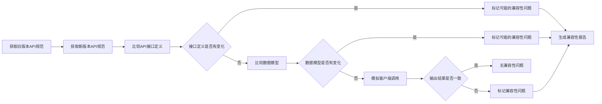

# 自动化API版本兼容性检查:简化升级流程

> 关键词：自动化API版本兼容性检查、API升级、兼容性测试、简化流程、自动化测试

> 摘要：本文围绕自动化API版本兼容性检查展开，旨在探讨如何通过自动化手段简化API升级流程。首先介绍了该技术的背景，包括目的、预期读者、文档结构和相关术语。接着阐述了核心概念与联系，通过文本示意图和Mermaid流程图进行直观展示。详细讲解了核心算法原理及具体操作步骤，结合Python源代码进行说明。深入分析了数学模型和公式，并举例说明。通过项目实战，展示了开发环境搭建、源代码实现和代码解读。探讨了实际应用场景，推荐了相关的工具和资源，包括学习资源、开发工具框架和论文著作。最后总结了未来发展趋势与挑战，提供了常见问题与解答以及扩展阅读和参考资料，帮助读者全面了解自动化API版本兼容性检查技术。

## 1. 背景介绍 
### 1.1 目的和范围
随着软件系统的不断发展和迭代，API（Application Programming Interface）的版本升级变得越来越频繁。API版本升级可能会引入新的功能、修复漏洞或优化性能，但同时也可能会对现有的客户端应用程序产生兼容性问题。手动进行API版本兼容性检查是一项繁琐且容易出错的任务，尤其是在API规模较大、调用关系复杂的情况下。因此，实现自动化API版本兼容性检查具有重要的现实意义。

本文的目的是详细介绍自动化API版本兼容性检查的技术原理、实现方法和实际应用，帮助开发者简化API升级流程，提高开发效率和软件质量。范围涵盖了从核心概念的解释到具体的代码实现，以及实际应用场景和相关工具资源的推荐。

### 1.2 预期读者
本文主要面向以下几类读者：
- **软件开发者**：希望了解如何实现自动化API版本兼容性检查，以简化API升级过程，减少兼容性问题带来的风险。
- **测试人员**：需要掌握自动化API兼容性测试的方法和技术，提高测试效率和准确性。
- **软件架构师**：关注API设计和版本管理，希望通过自动化手段确保API的兼容性和可维护性。
- **技术管理者**：对软件开发生命周期和质量控制感兴趣，希望了解如何通过自动化技术优化API升级流程。

### 1.3 文档结构概述
本文将按照以下结构进行组织：
1. **背景介绍**：介绍自动化API版本兼容性检查的目的、预期读者、文档结构和相关术语。
2. **核心概念与联系**：阐述API版本兼容性的核心概念，通过文本示意图和Mermaid流程图展示其原理和架构。
3. **核心算法原理 & 具体操作步骤**：详细讲解自动化API版本兼容性检查的核心算法原理，并给出具体的操作步骤，结合Python源代码进行说明。
4. **数学模型和公式 & 详细讲解 & 举例说明**：建立数学模型，给出相关公式，并通过具体例子进行详细讲解。
5. **项目实战：代码实际案例和详细解释说明**：通过一个实际的项目案例，展示开发环境搭建、源代码实现和代码解读。
6. **实际应用场景**：探讨自动化API版本兼容性检查在不同领域的实际应用场景。
7. **工具和资源推荐**：推荐相关的学习资源、开发工具框架和论文著作。
8. **总结：未来发展趋势与挑战**：总结自动化API版本兼容性检查的未来发展趋势和面临的挑战。
9. **附录：常见问题与解答**：解答读者在学习和实践过程中可能遇到的常见问题。
10. **扩展阅读 & 参考资料**：提供相关的扩展阅读材料和参考资料。

### 1.4 术语表
#### 1.4.1 核心术语定义
- **API（Application Programming Interface）**：应用程序编程接口，是一组定义、协议和工具，用于构建软件应用程序之间的交互。
- **API版本兼容性**：指在API升级过程中，新版本的API能够与旧版本的API在功能和数据处理上保持一致，使得现有的客户端应用程序能够正常使用新版本的API。
- **自动化API版本兼容性检查**：通过自动化工具和技术，对API的不同版本进行比较和分析，检测是否存在兼容性问题。
- **API规范**：定义API的接口定义、请求和响应格式、参数说明等信息的文档。

#### 1.4.2 相关概念解释
- **向后兼容性**：新版本的API能够支持旧版本API的所有功能，即旧版本的客户端应用程序可以无缝迁移到新版本的API。
- **向前兼容性**：旧版本的API能够支持新版本API的部分功能，即新版本的客户端应用程序可以在一定程度上使用旧版本的API。
- **语义兼容性**：除了语法层面的兼容性外，还考虑API的功能和业务逻辑是否保持一致。

#### 1.4.3 缩略词列表
- **API**：Application Programming Interface
- **JSON**：JavaScript Object Notation
- **XML**：eXtensible Markup Language
- **REST**：Representational State Transfer

## 2. 核心概念与联系 

### 核心概念原理
自动化API版本兼容性检查的核心原理是通过对API的不同版本进行比较和分析，检测是否存在兼容性问题。具体来说，主要包括以下几个方面：
- **API规范比较**：比较不同版本的API规范，检查接口定义、请求和响应格式、参数说明等是否发生变化。
- **数据模型比较**：比较不同版本的API所使用的数据模型，检查数据结构、数据类型、数据约束等是否发生变化。
- **行为比较**：通过模拟客户端调用，比较不同版本的API在相同输入下的输出结果，检查API的行为是否保持一致。

### 架构的文本示意图
```plaintext
自动化API版本兼容性检查系统架构

客户端应用程序 <----------------------> API版本兼容性检查工具
                                         |
                                         |
                                         v
                                  API管理平台
                                         |
                                         |
                                         v
                                 API规范存储库
                                         |
                                         |
                                         v
                                 API数据模型存储库
```
解释：客户端应用程序需要调用API，API版本兼容性检查工具负责对API的不同版本进行兼容性检查。该工具与API管理平台进行交互，获取API的相关信息。API管理平台将API规范和数据模型存储在相应的存储库中，供检查工具使用。

### Mermaid流程图

解释：首先获取旧版本和新版本的API规范，然后比较API接口定义。如果接口定义有变化，则标记可能的兼容性问题。如果接口定义没有变化，则比较数据模型。如果数据模型有变化，也标记可能的兼容性问题。如果数据模型没有变化，则模拟客户端调用，比较输出结果。如果输出结果不一致，则标记兼容性问题。最后，将所有标记的问题生成兼容性报告。

## 3. 核心算法原理 & 具体操作步骤 

### 核心算法原理
自动化API版本兼容性检查的核心算法主要基于以下几个步骤：
1. **解析API规范**：将API规范（如OpenAPI Specification）解析为数据结构，以便后续比较。
2. **比较API接口定义**：比较不同版本的API接口定义，包括接口路径、请求方法、请求参数、响应状态码等。
3. **比较数据模型**：比较不同版本的API所使用的数据模型，包括数据结构、数据类型、数据约束等。
4. **模拟客户端调用**：使用模拟数据调用不同版本的API，比较输出结果。

### 具体操作步骤及Python源代码
以下是一个简单的Python示例，演示如何比较两个OpenAPI规范文件的接口定义：

```python
import yaml

def load_openapi_spec(file_path):
    with open(file_path, 'r') as file:
        spec = yaml.safe_load(file)
    return spec

def compare_api_interfaces(old_spec, new_spec):
    old_paths = old_spec.get('paths', {})
    new_paths = new_spec.get('paths', {})
    compatibility_issues = []

    # 检查新规范中是否有旧规范中不存在的接口
    for path in new_paths:
        if path not in old_paths:
            compatibility_issues.append(f"新接口 {path} 被添加")

    # 检查旧规范中是否有新规范中不存在的接口
    for path in old_paths:
        if path not in new_paths:
            compatibility_issues.append(f"旧接口 {path} 被移除")

    # 比较相同接口的请求方法
    for path in set(old_paths.keys()) & set(new_paths.keys()):
        old_methods = old_paths[path].keys()
        new_methods = new_paths[path].keys()
        for method in new_methods:
            if method not in old_methods:
                compatibility_issues.append(f"接口 {path} 新增请求方法 {method}")
        for method in old_methods:
            if method not in new_methods:
                compatibility_issues.append(f"接口 {path} 移除请求方法 {method}")

    return compatibility_issues

# 加载旧版本和新版本的OpenAPI规范
old_spec = load_openapi_spec('old_api_spec.yaml')
new_spec = load_openapi_spec('new_api_spec.yaml')

# 比较API接口定义
issues = compare_api_interfaces(old_spec, new_spec)

# 输出兼容性问题
if issues:
    print("发现以下兼容性问题：")
    for issue in issues:
        print(issue)
else:
    print("未发现接口定义方面的兼容性问题。")
```
解释：
1. `load_openapi_spec` 函数用于加载OpenAPI规范文件，将其解析为Python字典。
2. `compare_api_interfaces` 函数用于比较两个OpenAPI规范的接口定义，检查是否有接口的添加、移除或请求方法的变化。
3. 最后，加载旧版本和新版本的OpenAPI规范，调用 `compare_api_interfaces` 函数进行比较，并输出兼容性问题。

## 4. 数学模型和公式 & 详细讲解 & 举例说明 

### 数学模型
为了更精确地描述API版本兼容性检查的过程，我们可以建立一个数学模型。假设我们有两个API版本 $V_1$ 和 $V_2$，每个版本的API可以用一个三元组表示：

$$API = (I, D, B)$$

其中：
- $I$ 表示API的接口定义集合，每个接口定义可以用一个元组 $(P, M, R)$ 表示，其中 $P$ 是接口路径，$M$ 是请求方法，$R$ 是响应状态码集合。
- $D$ 表示API所使用的数据模型集合，每个数据模型可以用一个元组 $(N, S, T)$ 表示，其中 $N$ 是数据模型名称，$S$ 是数据结构，$T$ 是数据类型。
- $B$ 表示API的行为集合，每个行为可以用一个函数 $f(x)$ 表示，其中 $x$ 是输入数据，$f(x)$ 是输出结果。

### 兼容性判断公式
#### 接口定义兼容性
接口定义兼容性可以通过比较两个版本的接口定义集合 $I_1$ 和 $I_2$ 来判断。如果 $I_1 \subseteq I_2$，则称 $V_2$ 对于 $V_1$ 在接口定义上是向后兼容的。

#### 数据模型兼容性
数据模型兼容性可以通过比较两个版本的数据模型集合 $D_1$ 和 $D_2$ 来判断。对于每个数据模型 $d_1 \in D_1$，如果存在 $d_2 \in D_2$ 使得 $d_1$ 和 $d_2$ 的数据结构和数据类型兼容，则称 $V_2$ 对于 $V_1$ 在数据模型上是兼容的。

#### 行为兼容性
行为兼容性可以通过比较两个版本的行为集合 $B_1$ 和 $B_2$ 来判断。对于每个行为 $f_1 \in B_1$，如果存在 $f_2 \in B_2$ 使得对于相同的输入 $x$，$f_1(x) = f_2(x)$，则称 $V_2$ 对于 $V_1$ 在行为上是兼容的。

### 举例说明
假设我们有两个API版本 $V_1$ 和 $V_2$，其接口定义集合分别为：

$$I_1 = \{ ("/users", "GET", \{200\}), ("/users/{id}", "GET", \{200, 404\}) \}$$

$$I_2 = \{ ("/users", "GET", \{200\}), ("/users/{id}", "GET", \{200, 404\}), ("/users", "POST", \{201\}) \}$$

由于 $I_1 \subseteq I_2$，所以 $V_2$ 对于 $V_1$ 在接口定义上是向后兼容的。

再假设数据模型集合分别为：

$$D_1 = \{ ("User", \{ "name": "string", "age": "integer" \}, "object") \}$$

$$D_2 = \{ ("User", \{ "name": "string", "age": "integer", "email": "string" \}, "object") \}$$

由于 $D_2$ 中的数据模型在 $D_1$ 的基础上增加了一个字段，所以 $V_2$ 对于 $V_1$ 在数据模型上也是兼容的。

## 5. 项目实战：代码实际案例和详细解释说明 

### 5.1  开发环境搭建
为了实现自动化API版本兼容性检查，我们可以使用以下工具和技术：
- **Python**：作为主要的开发语言。
- **OpenAPI Specification**：用于描述API的规范。
- **PyYAML**：用于解析OpenAPI规范文件。
- **Requests**：用于模拟客户端调用API。

以下是搭建开发环境的步骤：
1. 安装Python：从Python官方网站下载并安装Python 3.x版本。
2. 创建虚拟环境：使用 `venv` 模块创建一个虚拟环境。
```bash
python -m venv api_compatibility_env
```
3. 激活虚拟环境：
- 在Windows上：
```bash
api_compatibility_env\Scripts\activate
```
- 在Linux或Mac上：
```bash
source api_compatibility_env/bin/activate
```
4. 安装依赖库：
```bash
pip install pyyaml requests
```

### 5.2  源代码详细实现和代码解读
以下是一个完整的Python代码示例，实现了自动化API版本兼容性检查：

```python
import yaml
import requests

def load_openapi_spec(file_path):
    with open(file_path, 'r') as file:
        spec = yaml.safe_load(file)
    return spec

def compare_api_interfaces(old_spec, new_spec):
    old_paths = old_spec.get('paths', {})
    new_paths = new_spec.get('paths', {})
    compatibility_issues = []

    # 检查新规范中是否有旧规范中不存在的接口
    for path in new_paths:
        if path not in old_paths:
            compatibility_issues.append(f"新接口 {path} 被添加")

    # 检查旧规范中是否有新规范中不存在的接口
    for path in old_paths:
        if path not in new_paths:
            compatibility_issues.append(f"旧接口 {path} 被移除")

    # 比较相同接口的请求方法
    for path in set(old_paths.keys()) & set(new_paths.keys()):
        old_methods = old_paths[path].keys()
        new_methods = new_paths[path].keys()
        for method in new_methods:
            if method not in old_methods:
                compatibility_issues.append(f"接口 {path} 新增请求方法 {method}")
        for method in old_methods:
            if method not in new_methods:
                compatibility_issues.append(f"接口 {path} 移除请求方法 {method}")

    return compatibility_issues

def compare_api_responses(old_spec, new_spec, base_url):
    old_paths = old_spec.get('paths', {})
    new_paths = new_spec.get('paths', {})
    compatibility_issues = []

    for path in set(old_paths.keys()) & set(new_paths.keys()):
        for method in set(old_paths[path].keys()) & set(new_paths[path].keys()):
            old_response_codes = old_paths[path][method].get('responses', {}).keys()
            new_response_codes = new_paths[path][method].get('responses', {}).keys()

            # 检查响应状态码是否有变化
            for code in new_response_codes:
                if code not in old_response_codes:
                    compatibility_issues.append(f"接口 {path} {method} 新增响应状态码 {code}")
            for code in old_response_codes:
                if code not in new_response_codes:
                    compatibility_issues.append(f"接口 {path} {method} 移除响应状态码 {code}")

            # 模拟客户端调用，比较响应内容
            if method == 'get':
                old_url = base_url + path
                new_url = base_url + path
                try:
                    old_response = requests.get(old_url)
                    new_response = requests.get(new_url)
                    if old_response.json() != new_response.json():
                        compatibility_issues.append(f"接口 {path} {method} 响应内容不一致")
                except Exception as e:
                    compatibility_issues.append(f"调用接口 {path} {method} 时出错: {e}")

    return compatibility_issues

# 加载旧版本和新版本的OpenAPI规范
old_spec = load_openapi_spec('old_api_spec.yaml')
new_spec = load_openapi_spec('new_api_spec.yaml')

# 比较API接口定义
interface_issues = compare_api_interfaces(old_spec, new_spec)

# 比较API响应
base_url = 'http://example.com/api'
response_issues = compare_api_responses(old_spec, new_spec, base_url)

# 输出兼容性问题
all_issues = interface_issues + response_issues
if all_issues:
    print("发现以下兼容性问题：")
    for issue in all_issues:
        print(issue)
else:
    print("未发现兼容性问题。")
```
代码解读：
1. `load_openapi_spec` 函数：用于加载OpenAPI规范文件，将其解析为Python字典。
2. `compare_api_interfaces` 函数：比较两个OpenAPI规范的接口定义，检查是否有接口的添加、移除或请求方法的变化。
3. `compare_api_responses` 函数：比较两个版本的API响应，包括响应状态码和响应内容。通过模拟客户端调用，比较相同接口在不同版本下的响应结果。
4. 最后，加载旧版本和新版本的OpenAPI规范，分别调用 `compare_api_interfaces` 和 `compare_api_responses` 函数进行比较，并输出兼容性问题。

### 5.3  代码解读与分析
- **接口定义比较**：`compare_api_interfaces` 函数通过比较两个版本的接口路径和请求方法，检测是否有接口的添加、移除或请求方法的变化。这种比较是基于静态的API规范文件，不需要实际调用API。
- **响应比较**：`compare_api_responses` 函数不仅比较了响应状态码的变化，还通过模拟客户端调用，比较了相同接口在不同版本下的响应内容。这种比较是动态的，需要实际调用API，因此需要提供API的基础URL。
- **错误处理**：在模拟客户端调用时，使用 `try-except` 块捕获可能的异常，并将异常信息作为兼容性问题记录下来。

## 6. 实际应用场景 
自动化API版本兼容性检查在以下几个方面具有重要的实际应用场景：

### 微服务架构
在微服务架构中，各个微服务之间通过API进行通信。当某个微服务进行版本升级时，可能会影响到其他依赖该微服务的微服务。通过自动化API版本兼容性检查，可以及时发现兼容性问题，避免系统出现故障。

### 第三方API集成
当企业集成第三方API时，第三方API的版本升级可能会对企业的应用程序产生影响。自动化API版本兼容性检查可以帮助企业快速评估第三方API升级的影响，提前做好应对措施。

### 开源项目
在开源项目中，API的兼容性对于项目的生态系统非常重要。通过自动化API版本兼容性检查，可以确保项目的API在不同版本之间保持兼容性，方便开发者使用和扩展。

### 移动应用开发
移动应用通常依赖于后端API提供的数据和服务。当后端API进行版本升级时，需要确保移动应用能够正常使用新版本的API。自动化API版本兼容性检查可以帮助开发者快速发现并解决兼容性问题，提高移动应用的稳定性和用户体验。

## 7. 工具和资源推荐
### 7.1 学习资源推荐
#### 7.1.1 书籍推荐
- 《RESTful Web APIs》：这本书详细介绍了RESTful API的设计和实现，对于理解API的基本概念和规范非常有帮助。
- 《OpenAPI Specification: Up and Running》：深入讲解了OpenAPI Specification的使用，包括如何编写和解析API规范文件。
- 《Python Testing with pytest》：介绍了使用pytest进行Python测试的方法，对于实现自动化API测试有很大的帮助。

#### 7.1.2 在线课程
- Coursera上的《API Design and Development Specialization》：提供了API设计和开发的全面课程，包括API版本管理和兼容性测试。
- Udemy上的《Automated API Testing with Python》：专门讲解了如何使用Python进行自动化API测试，适合初学者。
- Pluralsight上的《REST API Design Best Practices》：介绍了REST API设计的最佳实践，对于提高API的质量和兼容性有很大的帮助。

#### 7.1.3 技术博客和网站
- API Evangelist（https://apievangelist.com/）：提供了丰富的API相关的文章和案例，对于了解API的最新趋势和应用场景非常有帮助。
- OpenAPI Initiative（https://www.openapis.org/）：官方网站，提供了OpenAPI Specification的详细文档和资源。
- DevOps.com（https://devops.com/）：涵盖了DevOps和API开发的相关内容，包括自动化测试和持续集成。

### 7.2 开发工具框架推荐
#### 7.2.1 IDE和编辑器
- PyCharm：一款强大的Python集成开发环境，提供了丰富的代码编辑、调试和测试功能。
- Visual Studio Code：轻量级的代码编辑器，支持多种编程语言和插件，适合快速开发和调试。
- IntelliJ IDEA：功能强大的Java和Python开发工具，对于大型项目的开发和管理非常方便。

#### 7.2.2 调试和性能分析工具
- Postman：一款流行的API调试工具，可以方便地发送HTTP请求，查看响应结果，并进行API测试。
- Charles Proxy：用于拦截和分析HTTP/HTTPS请求，帮助开发者调试和优化API。
- New Relic：提供了API性能监控和分析功能，帮助开发者及时发现和解决性能问题。

#### 7.2.3 相关框架和库
- OpenAPI Generator：可以根据OpenAPI规范文件自动生成客户端和服务器代码，提高开发效率。
- pytest：一个简单而强大的Python测试框架，支持自动化API测试。
- requests：Python中常用的HTTP请求库，用于模拟客户端调用API。

### 7.3 相关论文著作推荐
#### 7.3.1 经典论文
- “Architectural Styles and the Design of Network-based Software Architectures” by Roy Fielding：提出了REST架构风格，对于API设计和开发具有重要的指导意义。
- “Semantic Versioning 2.0.0” by Tom Preston-Werner：介绍了语义化版本控制的概念和规范，对于API版本管理非常有帮助。

#### 7.3.2 最新研究成果
- 关注ACM SIGSOFT和IEEE Software等会议和期刊，这些会议和期刊经常发表关于API设计、测试和兼容性的最新研究成果。

#### 7.3.3 应用案例分析
- 可以在GitHub和Stack Overflow等平台上搜索API版本兼容性检查的开源项目和案例分析，学习其他开发者的经验和实践。

## 8. 总结：未来发展趋势与挑战
### 未来发展趋势
- **智能化检查**：随着人工智能和机器学习技术的发展，自动化API版本兼容性检查将越来越智能化。可以通过机器学习算法自动识别API的变化模式和潜在的兼容性问题，提高检查的准确性和效率。
- **与DevOps集成**：自动化API版本兼容性检查将更加紧密地与DevOps流程集成，实现持续集成和持续部署。在代码提交、构建和部署的过程中自动进行兼容性检查，及时发现和解决问题。
- **多语言和多协议支持**：未来的自动化API版本兼容性检查工具将支持更多的编程语言和协议，如GraphQL、gRPC等，满足不同项目的需求。
- **云原生支持**：随着云原生技术的普及，自动化API版本兼容性检查将更好地支持云原生架构，如容器化和无服务器计算。

### 挑战
- **语义兼容性判断**：除了语法层面的兼容性，语义兼容性的判断更加复杂。如何准确地判断API的功能和业务逻辑是否保持一致，是未来需要解决的一个重要问题。
- **大规模API管理**：对于大规模的API系统，兼容性检查的复杂度会显著增加。如何高效地管理和检查大量的API版本，是一个挑战。
- **动态API变化**：在一些动态环境中，API的定义和行为可能会随时发生变化。如何实时监测和处理这些动态变化，确保API的兼容性，是一个亟待解决的问题。

## 9. 附录：常见问题与解答
### 问题1：自动化API版本兼容性检查是否可以完全替代手动测试？
解答：自动化API版本兼容性检查可以发现大部分的兼容性问题，但不能完全替代手动测试。手动测试可以进行一些复杂的业务逻辑测试和用户体验测试，而自动化测试主要侧重于接口定义和数据模型的比较。因此，建议将自动化测试和手动测试结合使用，以提高测试的全面性和准确性。

### 问题2：如何处理API规范文件中的注释和元数据？
解答：在解析API规范文件时，通常可以忽略注释和元数据，只关注与接口定义和数据模型相关的信息。可以使用相应的解析工具（如PyYAML）来提取所需的信息。

### 问题3：如果API使用了自定义的数据类型，如何进行兼容性检查？
解答：对于自定义的数据类型，可以在数据模型比较时，定义相应的兼容性规则。例如，可以比较数据类型的名称、字段结构和数据约束等。如果自定义数据类型有特定的序列化和反序列化规则，还需要考虑这些规则在不同版本之间的兼容性。

### 问题4：如何处理API的安全认证和授权问题？
解答：在模拟客户端调用API时，需要考虑API的安全认证和授权问题。可以在请求头中添加相应的认证信息（如Token），或者使用OAuth等认证协议。在自动化测试脚本中，可以将认证信息作为参数进行配置，以便在不同的环境中使用。

## 10. 扩展阅读 & 参考资料
### 扩展阅读
- 《Continuous Delivery: Reliable Software Releases through Build, Test, and Deployment Automation》：介绍了持续交付的概念和实践，对于理解自动化API版本兼容性检查在DevOps流程中的应用有很大的帮助。
- 《Designing Evolvable Web APIs with ASP.NET》：详细讲解了如何设计可演进的Web API，包括API版本管理和兼容性处理。

### 参考资料
- OpenAPI Specification官方文档：https://swagger.io/specification/
- Python官方文档：https://docs.python.org/3/
- requests库文档：https://requests.readthedocs.io/en/latest/
- pytest库文档：https://docs.pytest.org/en/stable/