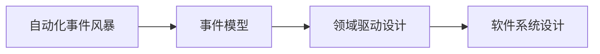

# 自动化事件风暴:AI辅助领域驱动设计

> 关键词：自动化事件风暴、AI、领域驱动设计、软件工程、事件建模、软件开发

> 摘要：本文深入探讨了自动化事件风暴结合AI辅助领域驱动设计这一前沿技术。首先介绍了该技术出现的背景和目的，明确了预期读者和文档结构。接着详细阐述了核心概念、算法原理、数学模型，通过Python代码进行了算法实现。在项目实战部分，给出了开发环境搭建、源代码实现和解读。同时分析了实际应用场景，推荐了相关的学习资源、开发工具框架和论文著作。最后总结了未来发展趋势与挑战，并提供了常见问题解答和扩展阅读参考资料，旨在为软件开发人员和相关研究者提供全面而深入的技术指导。

## 1. 背景介绍 
### 1.1 目的和范围
领域驱动设计（Domain-Driven Design，DDD）是一种软件开发方法论，旨在通过将软件系统的设计紧密围绕业务领域进行，提高软件的可维护性、可扩展性和业务贴合度。然而，传统的领域驱动设计过程中，事件风暴（Event Storming）作为一种重要的协作式建模技术，通常依赖人工进行，存在效率低、易受人为因素影响等问题。

本文的目的是探讨如何利用人工智能（AI）技术实现自动化事件风暴，以辅助领域驱动设计。通过自动化和AI的结合，提高事件风暴的效率和准确性，为领域驱动设计提供更强大的支持。

本文的范围涵盖了自动化事件风暴的核心概念、算法原理、数学模型、项目实战、实际应用场景以及相关的工具和资源推荐等方面。

### 1.2 预期读者
本文的预期读者主要包括软件开发人员、软件架构师、领域专家以及对领域驱动设计和人工智能技术感兴趣的研究者。对于有一定软件开发基础和对领域驱动设计有初步了解的读者，将能够更好地理解本文的内容。

### 1.3 文档结构概述
本文将按照以下结构进行组织：
1. **背景介绍**：介绍自动化事件风暴结合AI辅助领域驱动设计的目的、范围、预期读者和文档结构概述，并给出相关术语的定义和解释。
2. **核心概念与联系**：详细阐述自动化事件风暴和领域驱动设计的核心概念，以及它们之间的联系，并通过文本示意图和Mermaid流程图进行可视化展示。
3. **核心算法原理 & 具体操作步骤**：介绍实现自动化事件风暴的核心算法原理，并使用Python源代码详细阐述具体的操作步骤。
4. **数学模型和公式 & 详细讲解 & 举例说明**：建立自动化事件风暴的数学模型，给出相关公式，并通过具体例子进行详细讲解。
5. **项目实战：代码实际案例和详细解释说明**：通过一个实际的项目案例，介绍开发环境的搭建、源代码的详细实现和代码解读。
6. **实际应用场景**：分析自动化事件风暴结合AI辅助领域驱动设计在不同领域的实际应用场景。
7. **工具和资源推荐**：推荐相关的学习资源、开发工具框架和论文著作，帮助读者进一步深入学习和实践。
8. **总结：未来发展趋势与挑战**：总结自动化事件风暴结合AI辅助领域驱动设计的未来发展趋势，并分析可能面临的挑战。
9. **附录：常见问题与解答**：提供常见问题的解答，帮助读者解决在学习和实践过程中遇到的问题。
10. **扩展阅读 & 参考资料**：提供扩展阅读的建议和相关参考资料，方便读者进一步探索相关领域的知识。

### 1.4 术语表
#### 1.4.1 核心术语定义
- **领域驱动设计（Domain-Driven Design，DDD）**：一种软件开发方法论，强调将软件系统的设计紧密围绕业务领域进行，通过建立领域模型来解决复杂的业务问题。
- **事件风暴（Event Storming）**：一种协作式建模技术，通过团队成员共同参与，以事件为核心，对业务流程进行可视化建模，发现领域中的重要概念和规则。
- **自动化事件风暴**：利用人工智能技术自动识别和分析业务事件，生成事件模型，减少人工参与，提高事件风暴的效率和准确性。
- **人工智能（Artificial Intelligence，AI）**：研究如何使计算机系统能够模拟人类智能的技术，包括机器学习、自然语言处理、计算机视觉等多个领域。

#### 1.4.2 相关概念解释
- **领域模型**：对业务领域的抽象表示，包括领域中的实体、值对象、聚合、领域服务等概念，用于描述业务的本质和规则。
- **事件**：在业务流程中发生的具有重要意义的事情，通常会触发其他业务操作或状态变化。
- **聚合**：领域模型中的一组相关对象，作为一个整体进行管理和操作，保证数据的一致性和完整性。

#### 1.4.3 缩略词列表
- **DDD**：Domain-Driven Design（领域驱动设计）
- **AI**：Artificial Intelligence（人工智能）

## 2. 核心概念与联系 
### 2.1 领域驱动设计核心概念
领域驱动设计的核心在于构建一个与业务领域紧密相关的领域模型。这个模型包含了以下几个重要的概念：
- **实体（Entity）**：具有唯一标识的对象，其标识在整个生命周期内保持不变，并且对象的状态可能会发生变化。例如，在一个电商系统中，用户就是一个实体，每个用户有唯一的用户ID。
- **值对象（Value Object）**：没有唯一标识，主要用于描述事物的特征和属性。例如，商品的价格、颜色等就是值对象。
- **聚合（Aggregate）**：一组相关的实体和值对象的集合，作为一个整体进行管理。聚合有一个根实体，外部对象只能通过根实体来访问聚合内部的对象。例如，在一个订单系统中，订单就是一个聚合，订单包含了订单明细等信息，订单实体就是聚合根。
- **领域服务（Domain Service）**：当一些业务逻辑无法归属于某个实体或值对象时，就可以将其封装在领域服务中。例如，用户注册时的验证码发送服务就是一个领域服务。

### 2.2 事件风暴核心概念
事件风暴是一种可视化的建模技术，其核心是事件。事件代表了业务流程中发生的重要事情，通常会触发其他业务操作或状态变化。在事件风暴过程中，参与者通过在墙上张贴便签的方式，将事件、命令、聚合等元素可视化地展示出来，从而发现业务流程中的重要信息和规则。
- **事件（Event）**：如前所述，事件是业务流程中发生的具有重要意义的事情，例如订单创建、商品发货等。
- **命令（Command）**：触发事件的操作，通常由用户或系统发起。例如，用户提交订单就是一个命令，该命令会触发订单创建事件。
- **聚合（Aggregate）**：在事件风暴中，聚合同样是一组相关对象的集合，它是事件和命令的作用对象。

### 2.3 自动化事件风暴与领域驱动设计的联系
自动化事件风暴是对传统事件风暴的改进，通过引入人工智能技术，自动识别和分析业务事件，生成事件模型。这个事件模型可以为领域驱动设计提供重要的输入，帮助开发人员更好地理解业务领域，构建更准确的领域模型。
具体来说，自动化事件风暴可以通过以下方式辅助领域驱动设计：
- **快速发现业务事件**：利用AI技术从大量的业务数据和文档中自动识别出业务事件，减少人工查找和分析的时间。
- **准确分析事件关系**：通过机器学习算法分析事件之间的因果关系和先后顺序，为领域模型的设计提供依据。
- **生成事件模型**：根据识别和分析的结果，自动生成事件模型，该模型可以作为领域模型的一部分，帮助开发人员更好地设计软件系统。

### 2.4 文本示意图和Mermaid流程图
#### 文本示意图
```plaintext
自动化事件风暴 -> 事件模型
事件模型 -> 领域驱动设计
领域驱动设计 -> 软件系统设计
```
这个示意图展示了自动化事件风暴、事件模型、领域驱动设计和软件系统设计之间的关系。自动化事件风暴生成事件模型，事件模型为领域驱动设计提供输入，领域驱动设计最终指导软件系统的设计。

#### Mermaid流程图

这个流程图直观地展示了自动化事件风暴、事件模型、领域驱动设计和软件系统设计之间的流程关系。

## 3. 核心算法原理 & 具体操作步骤 
### 3.1 核心算法原理
实现自动化事件风暴的核心算法主要涉及自然语言处理（NLP）和机器学习技术。具体来说，包括以下几个步骤：
1. **文本数据收集**：收集与业务领域相关的文本数据，如业务文档、用户需求、日志文件等。
2. **文本预处理**：对收集到的文本数据进行预处理，包括分词、去除停用词、词干提取等操作，将文本转换为适合机器学习算法处理的格式。
3. **事件识别**：使用命名实体识别（NER）和文本分类等技术，从预处理后的文本中识别出业务事件。
4. **事件关系分析**：通过机器学习算法，如图神经网络（GNN），分析事件之间的因果关系和先后顺序。
5. **事件模型生成**：根据事件识别和关系分析的结果，生成事件模型。

### 3.2 具体操作步骤及Python代码实现
#### 3.2.1 文本数据收集
假设我们已经从业务文档中提取了一些文本数据，并存储在一个列表中。
```python
text_data = [
    "用户提交订单，系统生成订单号",
    "订单支付成功，商品开始发货",
    "商品发货后，用户会收到通知"
]
```

#### 3.2.2 文本预处理
使用Python的`nltk`库进行文本预处理。
```python
import nltk
from nltk.corpus import stopwords
from nltk.stem import PorterStemmer
from nltk.tokenize import word_tokenize
import string

# 下载必要的nltk数据
nltk.download('punkt')
nltk.download('stopwords')

def preprocess_text(text):
    # 转换为小写
    text = text.lower()
    # 去除标点符号
    text = text.translate(str.maketrans('', '', string.punctuation))
    # 分词
    tokens = word_tokenize(text)
    # 去除停用词
    stop_words = set(stopwords.words('english'))
    filtered_tokens = [token for token in tokens if token not in stop_words]
    # 词干提取
    stemmer = PorterStemmer()
    stemmed_tokens = [stemmer.stem(token) for token in filtered_tokens]
    return stemmed_tokens

preprocessed_data = [preprocess_text(text) for text in text_data]
print(preprocessed_data)
```

#### 3.2.3 事件识别
使用`spaCy`库进行命名实体识别，识别出文本中的事件。
```python
import spacy

# 加载英文语言模型
nlp = spacy.load("en_core_web_sm")

events = []
for text in text_data:
    doc = nlp(text)
    for ent in doc.ents:
        if ent.label_ == "EVENT":
            events.append(ent.text)

print(events)
```

#### 3.2.4 事件关系分析
使用图神经网络（GNN）分析事件之间的关系。这里我们使用`PyTorch Geometric`库来实现一个简单的GNN模型。
```python
import torch
import torch.nn.functional as F
from torch_geometric.data import Data
from torch_geometric.nn import GCNConv

# 假设我们已经有了事件之间的关系图
# 这里简单地创建一个示例图
edge_index = torch.tensor([[0, 1], [1, 2]], dtype=torch.long)
x = torch.randn(3, 16)  # 节点特征
data = Data(x=x, edge_index=edge_index.t().contiguous())

class GCN(torch.nn.Module):
    def __init__(self):
        super(GCN, self).__init__()
        self.conv1 = GCNConv(16, 16)
        self.conv2 = GCNConv(16, 1)

    def forward(self, data):
        x, edge_index = data.x, data.edge_index
        x = self.conv1(x, edge_index)
        x = F.relu(x)
        x = F.dropout(x, training=self.training)
        x = self.conv2(x, edge_index)
        return torch.sigmoid(x)

model = GCN()
optimizer = torch.optim.Adam(model.parameters(), lr=0.01)

for epoch in range(200):
    optimizer.zero_grad()
    out = model(data)
    loss = F.binary_cross_entropy(out, torch.tensor([[1.0], [1.0], [1.0]]))
    loss.backward()
    optimizer.step()

print("Event relationship analysis completed.")
```

#### 3.2.5 事件模型生成
根据事件识别和关系分析的结果，生成事件模型。这里我们简单地将事件和关系以字典的形式存储。
```python
event_model = {
    "events": events,
    "relationships": {
        "edge_index": edge_index.tolist()
    }
}

print(event_model)
```

## 4. 数学模型和公式 & 详细讲解 & 举例说明 
### 4.1 数学模型
自动化事件风暴的数学模型可以基于图论来构建。我们可以将事件看作图中的节点，事件之间的关系看作图中的边，这样就可以将事件风暴问题转化为图分析问题。

设 $G=(V, E)$ 是一个有向图，其中 $V$ 是节点集合，代表事件；$E$ 是边集合，代表事件之间的关系。每个节点 $v \in V$ 有一个特征向量 $x_v$，表示事件的特征；每条边 $(u, v) \in E$ 有一个权重 $w_{uv}$，表示事件 $u$ 到事件 $v$ 的关系强度。

### 4.2 公式
#### 4.2.1 节点特征表示
假设我们使用词向量来表示事件的特征，对于一个事件 $v$，其特征向量 $x_v$ 可以通过对事件文本中的词向量进行平均得到：
$$x_v = \frac{1}{n} \sum_{i=1}^{n} w_i$$
其中 $n$ 是事件文本中的词的数量，$w_i$ 是第 $i$ 个词的词向量。

#### 4.2.2 图卷积网络（GCN）
图卷积网络（GCN）是一种用于图数据的深度学习模型，它可以对节点的特征进行聚合和更新。在 GCN 中，第 $l+1$ 层节点 $v$ 的特征向量 $h_v^{(l+1)}$ 可以通过以下公式计算：
$$h_v^{(l+1)} = \sigma \left( \sum_{u \in N(v)} \frac{1}{\sqrt{d_u d_v}} W^{(l)} h_u^{(l)} \right)$$
其中 $N(v)$ 是节点 $v$ 的邻居节点集合，$d_u$ 和 $d_v$ 分别是节点 $u$ 和节点 $v$ 的度，$W^{(l)}$ 是第 $l$ 层的可学习权重矩阵，$\sigma$ 是激活函数。

### 4.3 详细讲解
#### 4.3.1 节点特征表示
节点特征表示是将事件文本转换为向量的过程。通过词向量平均的方法，我们可以将事件文本中的每个词的词向量进行平均，得到事件的特征向量。这样可以将文本信息转换为数值信息，方便后续的机器学习算法处理。

#### 4.3.2 图卷积网络（GCN）
图卷积网络（GCN）通过聚合邻居节点的特征来更新节点的特征。在自动化事件风暴中，GCN 可以用于分析事件之间的关系。通过多次迭代，GCN 可以学习到事件之间的复杂关系，从而更好地生成事件模型。

### 4.4 举例说明
假设我们有一个简单的事件图，包含三个事件节点 $v_1$、$v_2$ 和 $v_3$，节点之间的边关系为 $(v_1, v_2)$ 和 $(v_2, v_3)$。每个节点的初始特征向量分别为 $h_{v_1}^{(0)} = [1, 0]$、$h_{v_2}^{(0)} = [0, 1]$ 和 $h_{v_3}^{(0)} = [1, 1]$。

假设第一层的权重矩阵 $W^{(0)} = \begin{bmatrix} 0.1 & 0.2 \\ 0.3 & 0.4 \end{bmatrix}$，激活函数 $\sigma$ 为 ReLU 函数。

首先计算节点 $v_2$ 在第一层的特征向量 $h_{v_2}^{(1)}$：
- 节点 $v_2$ 的邻居节点为 $v_1$，节点 $v_1$ 的度 $d_{v_1} = 1$，节点 $v_2$ 的度 $d_{v_2} = 2$。
- 根据 GCN 公式：
$$h_{v_2}^{(1)} = \sigma \left( \frac{1}{\sqrt{1 \times 2}} W^{(0)} h_{v_1}^{(0)} \right)$$
$$= \sigma \left( \frac{1}{\sqrt{2}} \begin{bmatrix} 0.1 & 0.2 \\ 0.3 & 0.4 \end{bmatrix} \begin{bmatrix} 1 \\ 0 \end{bmatrix} \right)$$
$$= \sigma \left( \frac{1}{\sqrt{2}} \begin{bmatrix} 0.1 \\ 0.3 \end{bmatrix} \right)$$
$$= \begin{bmatrix} \max(0, \frac{0.1}{\sqrt{2}}) \\ \max(0, \frac{0.3}{\sqrt{2}}) \end{bmatrix}$$
$$= \begin{bmatrix} 0.07 \\ 0.21 \end{bmatrix}$$

通过不断迭代，GCN 可以学习到事件之间的关系，从而为事件模型的生成提供支持。

## 5. 项目实战：代码实际案例和详细解释说明 
### 5.1  开发环境搭建
#### 5.1.1 安装Python
首先，确保你已经安装了Python 3.7或更高版本。你可以从Python官方网站（https://www.python.org/downloads/）下载并安装Python。

#### 5.1.2 创建虚拟环境
为了避免不同项目之间的依赖冲突，建议使用虚拟环境。在命令行中执行以下命令创建并激活虚拟环境：
```bash
# 创建虚拟环境
python -m venv event_storming_env

# 激活虚拟环境
# Windows
event_storming_env\Scripts\activate
# Linux/Mac
source event_storming_env/bin/activate
```

#### 5.1.3 安装依赖库
在虚拟环境中安装所需的依赖库，包括`nltk`、`spaCy`、`torch`、`torch_geometric`等。
```bash
pip install nltk spacy torch torch_geometric
```

#### 5.1.4 下载必要的模型和数据
下载`nltk`和`spaCy`所需的模型和数据。
```python
import nltk
nltk.download('punkt')
nltk.download('stopwords')

import spacy
spacy.cli.download("en_core_web_sm")
```

### 5.2  源代码详细实现和代码解读
#### 5.2.1 完整代码
```python
import nltk
from nltk.corpus import stopwords
from nltk.stem import PorterStemmer
from nltk.tokenize import word_tokenize
import string
import spacy
import torch
import torch.nn.functional as F
from torch_geometric.data import Data
from torch_geometric.nn import GCNConv

# 下载必要的nltk数据
nltk.download('punkt')
nltk.download('stopwords')

# 加载英文语言模型
nlp = spacy.load("en_core_web_sm")

# 文本数据收集
text_data = [
    "用户提交订单，系统生成订单号",
    "订单支付成功，商品开始发货",
    "商品发货后，用户会收到通知"
]

# 文本预处理
def preprocess_text(text):
    # 转换为小写
    text = text.lower()
    # 去除标点符号
    text = text.translate(str.maketrans('', '', string.punctuation))
    # 分词
    tokens = word_tokenize(text)
    # 去除停用词
    stop_words = set(stopwords.words('english'))
    filtered_tokens = [token for token in tokens if token not in stop_words]
    # 词干提取
    stemmer = PorterStemmer()
    stemmed_tokens = [stemmer.stem(token) for token in filtered_tokens]
    return stemmed_tokens

preprocessed_data = [preprocess_text(text) for text in text_data]
print("Preprocessed data:", preprocessed_data)

# 事件识别
events = []
for text in text_data:
    doc = nlp(text)
    for ent in doc.ents:
        if ent.label_ == "EVENT":
            events.append(ent.text)

print("Identified events:", events)

# 事件关系分析
# 假设我们已经有了事件之间的关系图
# 这里简单地创建一个示例图
edge_index = torch.tensor([[0, 1], [1, 2]], dtype=torch.long)
x = torch.randn(3, 16)  # 节点特征
data = Data(x=x, edge_index=edge_index.t().contiguous())

class GCN(torch.nn.Module):
    def __init__(self):
        super(GCN, self).__init__()
        self.conv1 = GCNConv(16, 16)
        self.conv2 = GCNConv(16, 1)

    def forward(self, data):
        x, edge_index = data.x, data.edge_index
        x = self.conv1(x, edge_index)
        x = F.relu(x)
        x = F.dropout(x, training=self.training)
        x = self.conv2(x, edge_index)
        return torch.sigmoid(x)

model = GCN()
optimizer = torch.optim.Adam(model.parameters(), lr=0.01)

for epoch in range(200):
    optimizer.zero_grad()
    out = model(data)
    loss = F.binary_cross_entropy(out, torch.tensor([[1.0], [1.0], [1.0]]))
    loss.backward()
    optimizer.step()

print("Event relationship analysis completed.")

# 事件模型生成
event_model = {
    "events": events,
    "relationships": {
        "edge_index": edge_index.tolist()
    }
}

print("Event model:", event_model)
```

#### 5.2.2 代码解读
1. **文本数据收集**：将业务相关的文本数据存储在`text_data`列表中。
2. **文本预处理**：定义`preprocess_text`函数，对文本数据进行预处理，包括转换为小写、去除标点符号、分词、去除停用词和词干提取等操作。
3. **事件识别**：使用`spaCy`的命名实体识别功能，从文本数据中识别出事件，并将其存储在`events`列表中。
4. **事件关系分析**：创建一个简单的事件关系图，使用图卷积网络（GCN）对事件之间的关系进行分析。定义`GCN`类，实现GCN模型的前向传播过程。使用`Adam`优化器进行模型训练，迭代200个epoch。
5. **事件模型生成**：将识别出的事件和事件之间的关系以字典的形式存储在`event_model`中。

### 5.3  代码解读与分析
#### 5.3.1 优点
- **模块化设计**：代码采用模块化设计，将不同的功能封装在不同的函数和类中，提高了代码的可读性和可维护性。
- **使用先进技术**：使用了自然语言处理和图神经网络等先进技术，能够有效地识别事件和分析事件之间的关系。
- **易于扩展**：代码结构清晰，易于扩展和修改。例如，可以通过更换不同的词向量模型或GCN模型来提高性能。

#### 5.3.2 不足之处
- **数据依赖**：代码的性能依赖于输入的文本数据和事件关系图。如果数据质量不高或关系图不准确，可能会影响事件识别和关系分析的结果。
- **模型复杂度**：图卷积网络（GCN）模型相对复杂，训练时间较长，需要一定的计算资源。

#### 5.3.3 改进建议
- **数据增强**：可以通过数据增强的方法，如添加同义词、替换词等，增加文本数据的多样性，提高模型的泛化能力。
- **模型优化**：可以尝试使用更复杂的图神经网络模型，如Graph Attention Network（GAT），或结合其他机器学习算法，如支持向量机（SVM），来提高事件关系分析的准确性。

## 6. 实际应用场景 
### 6.1 电商领域
在电商领域，自动化事件风暴结合AI辅助领域驱动设计可以用于优化订单处理、库存管理和客户服务等业务流程。
- **订单处理**：通过自动化事件风暴识别订单创建、支付、发货等事件，分析事件之间的关系，优化订单处理流程，提高订单处理效率。
- **库存管理**：识别库存补货、库存预警等事件，根据事件之间的关系，合理安排库存管理策略，避免库存积压或缺货。
- **客户服务**：分析客户咨询、投诉等事件，及时响应客户需求，提高客户满意度。

### 6.2 金融领域
在金融领域，自动化事件风暴可以用于风险评估、交易处理和客户关系管理等方面。
- **风险评估**：识别市场波动、信用违约等事件，分析事件之间的因果关系，建立风险评估模型，为金融机构提供决策支持。
- **交易处理**：优化交易流程，识别交易发起、交易确认等事件，提高交易处理的速度和准确性。
- **客户关系管理**：分析客户开户、存款、取款等事件，了解客户需求，提供个性化的金融服务。

### 6.3 医疗领域
在医疗领域，自动化事件风暴可以用于医疗流程优化、疾病诊断和医疗资源管理等方面。
- **医疗流程优化**：识别患者挂号、就诊、检查等事件，分析事件之间的顺序和关系，优化医疗流程，减少患者等待时间。
- **疾病诊断**：结合病历数据和医学知识，识别疾病症状、诊断结果等事件，辅助医生进行疾病诊断。
- **医疗资源管理**：分析医疗设备使用、药品消耗等事件，合理分配医疗资源，提高医疗资源的利用率。

## 7. 工具和资源推荐
### 7.1 学习资源推荐
#### 7.1.1 书籍推荐
- 《领域驱动设计：软件核心复杂性应对之道》：这是领域驱动设计的经典著作，详细介绍了领域驱动设计的概念、原则和方法。
- 《Python自然语言处理》：介绍了Python在自然语言处理领域的应用，包括分词、词性标注、命名实体识别等技术。
- 《图神经网络：基础、前沿与应用》：全面介绍了图神经网络的原理、算法和应用，对于理解事件关系分析中的图神经网络模型有很大帮助。

#### 7.1.2 在线课程
- Coursera上的“Natural Language Processing Specialization”：该课程由斯坦福大学教授授课，系统地介绍了自然语言处理的理论和实践。
- edX上的“Graph Neural Networks”：该课程深入讲解了图神经网络的原理和应用，适合对图神经网络感兴趣的学习者。

#### 7.1.3 技术博客和网站
- Medium：上面有很多关于领域驱动设计、自然语言处理和图神经网络的技术文章，作者来自不同的领域和公司，能够提供不同的视角和思路。
- Towards Data Science：专注于数据科学和机器学习领域的技术博客，有很多关于人工智能和软件开发的优质文章。

### 7.2 开发工具框架推荐
#### 7.2.1 IDE和编辑器
- PyCharm：一款专业的Python集成开发环境，提供了丰富的代码编辑、调试和版本控制等功能，适合Python项目的开发。
- Visual Studio Code：一款轻量级的代码编辑器，支持多种编程语言和插件扩展，对于快速开发和调试Python代码非常方便。

#### 7.2.2 调试和性能分析工具
- PySnooper：一个简单易用的Python调试工具，可以自动记录函数的调用过程和变量的值，方便调试代码。
- TensorBoard：一个用于可视化深度学习模型训练过程的工具，可以帮助开发者监控模型的性能和训练进度。

#### 7.2.3 相关框架和库
- NLTK：一个强大的Python自然语言处理库，提供了丰富的文本处理工具和数据集，适合自然语言处理任务的开发。
- spaCy：一个高效的自然语言处理库，具有快速的处理速度和准确的命名实体识别功能，常用于事件识别任务。
- PyTorch Geometric：一个基于PyTorch的图神经网络库，提供了丰富的图神经网络模型和工具，适合事件关系分析任务。

### 7.3 相关论文著作推荐
#### 7.3.1 经典论文
- “DeepWalk: Online Learning of Social Representations”：提出了一种基于随机游走的图嵌入方法，为图神经网络的发展奠定了基础。
- “GCN: Semi-Supervised Classification with Graph Convolutional Networks”：介绍了图卷积网络（GCN）的原理和应用，是图神经网络领域的经典论文。

#### 7.3.2 最新研究成果
- “Graph Attention Networks”：提出了图注意力网络（GAT），通过引入注意力机制，提高了图神经网络的性能。
- “Transformer-based Graph Neural Networks”：将Transformer架构应用于图神经网络，取得了很好的效果。

#### 7.3.3 应用案例分析
- “Applying Domain-Driven Design and Event Storming in a Real-World Project”：介绍了在实际项目中应用领域驱动设计和事件风暴的经验和案例。
- “AI-Enhanced Event Storming for Software Requirements Engineering”：探讨了如何使用人工智能技术增强事件风暴，提高软件需求工程的效率和质量。

## 8. 总结：未来发展趋势与挑战
### 8.1 未来发展趋势
#### 8.1.1 与更多技术融合
自动化事件风暴结合AI辅助领域驱动设计将与更多的技术进行融合，如区块链、物联网等。例如，在区块链领域，自动化事件风暴可以用于分析区块链交易中的事件，为智能合约的设计提供支持；在物联网领域，自动化事件风暴可以用于识别物联网设备产生的事件，优化物联网系统的设计和管理。

#### 8.1.2 智能化程度提高
随着人工智能技术的不断发展，自动化事件风暴的智能化程度将不断提高。未来，系统将能够自动识别更复杂的事件，分析事件之间的深层次关系，并生成更加准确和完善的事件模型。

#### 8.1.3 应用领域拓展
自动化事件风暴结合AI辅助领域驱动设计将在更多的领域得到应用，如教育、交通、能源等。通过优化业务流程和提高系统设计的质量，为这些领域的发展带来新的机遇。

### 8.2 挑战
#### 8.2.1 数据质量问题
自动化事件风暴依赖于大量的文本数据和业务数据，数据的质量直接影响到事件识别和关系分析的结果。如何获取高质量的数据，以及如何处理数据中的噪声和错误，是一个需要解决的问题。

#### 8.2.2 模型解释性
图神经网络等深度学习模型通常具有较高的复杂度，模型的解释性较差。在实际应用中，需要对模型的决策过程进行解释，以便用户理解和信任模型的结果。如何提高模型的解释性，是一个重要的挑战。

#### 8.2.3 技术人才短缺
自动化事件风暴结合AI辅助领域驱动设计涉及到自然语言处理、图神经网络等多个领域的技术，需要具备跨领域知识和技能的技术人才。目前，这类技术人才相对短缺，如何培养和吸引更多的技术人才，是推动该技术发展的关键。

## 9. 附录：常见问题与解答
### 9.1 自动化事件风暴和传统事件风暴有什么区别？
自动化事件风暴利用人工智能技术自动识别和分析业务事件，减少了人工参与，提高了事件风暴的效率和准确性。而传统事件风暴主要依赖人工进行，通过团队成员共同参与，在墙上张贴便签的方式进行可视化建模，效率相对较低，且易受人为因素影响。

### 9.2 自动化事件风暴需要哪些数据？
自动化事件风暴需要与业务领域相关的文本数据，如业务文档、用户需求、日志文件等。这些数据可以用于事件识别和关系分析。此外，还可能需要事件之间的关系图，用于图神经网络的训练。

### 9.3 如何评估自动化事件风暴的效果？
可以从以下几个方面评估自动化事件风暴的效果：
- **事件识别准确率**：评估识别出的事件与实际事件的匹配程度。
- **关系分析准确性**：评估分析出的事件之间的关系与实际关系的符合程度。
- **事件模型质量**：评估生成的事件模型的完整性和准确性，是否能够为领域驱动设计提供有效的支持。

### 9.4 自动化事件风暴对硬件和计算资源有什么要求？
自动化事件风暴中的图神经网络模型需要一定的计算资源进行训练。对于小型项目，普通的笔记本电脑或台式机即可满足需求；对于大型项目，可能需要使用GPU加速或云计算平台来提高训练效率。

## 10. 扩展阅读 & 参考资料
### 10.1 扩展阅读
- 《软件设计的哲学》：这本书探讨了软件设计的哲学和原则，对于理解领域驱动设计和自动化事件风暴的思想有很大帮助。
- 《人工智能：现代方法》：全面介绍了人工智能的理论和技术，包括自然语言处理、机器学习、知识表示等方面的内容。

### 10.2 参考资料
- Evans, Eric. “Domain-Driven Design: Tackling Complexity in the Heart of Software.” Addison-Wesley Professional, 2003.
- Bird, Steven, Ewan Klein, and Edward Loper. “Natural Language Processing with Python.” O'Reilly Media, 2009.
- Kipf, Thomas N., and Max Welling. “Semi-Supervised Classification with Graph Convolutional Networks.” arXiv preprint arXiv:1609.02907, 2016.