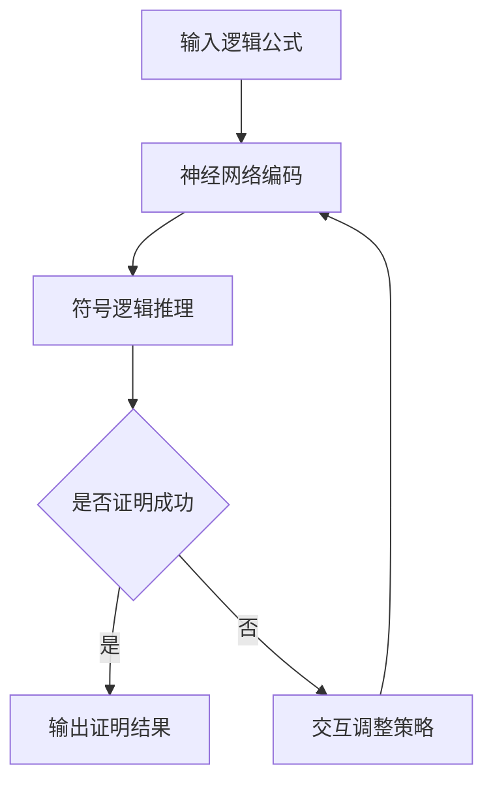

# 自动定理证明中神经符号推理的前沿方法

> 关键词：自动定理证明、神经符号推理、前沿方法、深度学习、符号逻辑

> 摘要：本文聚焦于自动定理证明中神经符号推理的前沿方法。首先介绍了自动定理证明和神经符号推理的背景知识，包括其目的、适用读者、文档结构和相关术语。接着详细阐述了核心概念及其联系，给出了原理和架构的文本示意图与 Mermaid 流程图。通过 Python 代码讲解了核心算法原理和具体操作步骤，同时给出了相关的数学模型和公式并举例说明。在项目实战部分，展示了代码实际案例，包括开发环境搭建、源代码实现和代码解读。探讨了神经符号推理在自动定理证明中的实际应用场景，推荐了学习资源、开发工具框架以及相关论文著作。最后总结了未来发展趋势与挑战，并给出常见问题解答和扩展阅读参考资料，旨在为读者全面深入地了解自动定理证明中神经符号推理的前沿方法提供指引。

## 1. 背景介绍 
### 1.1 目的和范围
自动定理证明是计算机科学中的一个重要领域，其目标是使用计算机程序来证明数学定理和逻辑命题的正确性。传统的自动定理证明方法主要基于符号逻辑和搜索算法，但这些方法在处理复杂问题时往往效率低下。神经符号推理作为一种新兴的方法，结合了神经网络的强大学习能力和符号逻辑的精确推理能力，为自动定理证明带来了新的思路和方法。

本文的目的是介绍自动定理证明中神经符号推理的前沿方法，包括其核心概念、算法原理、数学模型、实际应用场景等方面。通过对这些方法的深入分析和探讨，帮助读者了解神经符号推理在自动定理证明中的应用现状和发展趋势，为相关领域的研究和实践提供参考。

### 1.2 预期读者
本文的预期读者包括计算机科学、数学、逻辑学等领域的研究人员、工程师和学生。对于那些对自动定理证明、机器学习、深度学习等领域感兴趣的读者，本文也具有一定的参考价值。

### 1.3 文档结构概述
本文的结构如下：
- 核心概念与联系：介绍自动定理证明和神经符号推理的核心概念，以及它们之间的联系。
- 核心算法原理 & 具体操作步骤：详细讲解神经符号推理在自动定理证明中的核心算法原理，并给出具体的操作步骤。
- 数学模型和公式 & 详细讲解 & 举例说明：给出神经符号推理的数学模型和公式，并通过具体的例子进行详细讲解。
- 项目实战：代码实际案例和详细解释说明：通过一个实际的项目案例，展示神经符号推理在自动定理证明中的应用，并对代码进行详细解释。
- 实际应用场景：探讨神经符号推理在自动定理证明中的实际应用场景。
- 工具和资源推荐：推荐一些学习和实践神经符号推理的工具和资源。
- 总结：未来发展趋势与挑战：总结神经符号推理在自动定理证明中的发展趋势和面临的挑战。
- 附录：常见问题与解答：解答一些常见的问题。
- 扩展阅读 & 参考资料：提供一些扩展阅读的资料和参考文献。

### 1.4 术语表
#### 1.4.1 核心术语定义
- **自动定理证明（Automated Theorem Proving）**：使用计算机程序来证明数学定理和逻辑命题的正确性的过程。
- **神经符号推理（Neural-Symbolic Reasoning）**：结合神经网络的学习能力和符号逻辑的推理能力，进行知识表示和推理的方法。
- **神经网络（Neural Network）**：一种模仿人类神经系统的计算模型，由大量的神经元组成，用于学习数据中的模式和规律。
- **符号逻辑（Symbolic Logic）**：一种使用符号和规则来表示和推理逻辑命题的方法。

#### 1.4.2 相关概念解释
- **深度学习（Deep Learning）**：一种基于神经网络的机器学习方法，通过多层神经网络来学习数据中的复杂模式和规律。
- **知识图谱（Knowledge Graph）**：一种用于表示和存储知识的图结构，由实体、关系和属性组成。
- **强化学习（Reinforcement Learning）**：一种通过智能体与环境进行交互，以最大化累积奖励的机器学习方法。

#### 1.4.3 缩略词列表
- **ATP**：Automated Theorem Proving（自动定理证明）
- **NSR**：Neural-Symbolic Reasoning（神经符号推理）
- **NN**：Neural Network（神经网络）
- **SL**：Symbolic Logic（符号逻辑）

## 2. 核心概念与联系 

### 2.1 自动定理证明的基本概念
自动定理证明是指利用计算机程序来证明数学定理或逻辑命题的正确性。其基本思想是将定理或命题表示为逻辑公式，然后使用搜索算法在逻辑空间中寻找证明路径。传统的自动定理证明方法主要基于符号逻辑，如归结原理、自然演绎等。这些方法具有严格的逻辑基础，但在处理复杂问题时往往效率低下。

### 2.2 神经符号推理的基本概念
神经符号推理是一种将神经网络和符号逻辑相结合的推理方法。神经网络具有强大的学习能力，可以从大量的数据中学习到模式和规律；而符号逻辑则具有精确的推理能力，可以进行严格的逻辑推导。神经符号推理的核心思想是利用神经网络来学习符号逻辑中的知识和规则，然后使用符号逻辑来进行推理。

### 2.3 核心概念的联系
在自动定理证明中，神经符号推理可以发挥重要的作用。一方面，神经网络可以用于学习定理证明中的启发式信息，如证明策略、搜索方向等，从而提高证明的效率。另一方面，符号逻辑可以用于保证证明的正确性和可靠性。通过将神经网络和符号逻辑相结合，可以充分发挥两者的优势，提高自动定理证明的性能。

### 2.4 原理和架构的文本示意图
神经符号推理在自动定理证明中的原理和架构可以描述如下：

输入：待证明的定理或命题，以逻辑公式的形式表示。
处理过程：
1. **神经网络模块**：对输入的逻辑公式进行编码，学习其中的特征和模式。
2. **符号逻辑模块**：根据神经网络学习到的信息，使用符号逻辑规则进行推理。
3. **交互模块**：神经网络和符号逻辑模块之间进行交互，不断调整推理策略。
输出：证明结果，即定理或命题是否成立。

### 2.5 Mermaid 流程图


## 3. 核心算法原理 & 具体操作步骤 

### 3.1 核心算法原理
神经符号推理在自动定理证明中的核心算法主要包括两个部分：神经网络的学习和符号逻辑的推理。

#### 3.1.1 神经网络的学习
神经网络的学习目标是从大量的证明数据中学习到证明的启发式信息。常见的方法是使用深度学习模型，如卷积神经网络（CNN）、循环神经网络（RNN）或图神经网络（GNN）。这些模型可以对逻辑公式进行编码，学习其中的特征和模式。

例如，使用图神经网络对逻辑公式进行编码。逻辑公式可以表示为一个图，其中节点表示逻辑符号，边表示符号之间的关系。图神经网络可以对这个图进行处理，学习到图的特征表示。

#### 3.1.2 符号逻辑的推理
符号逻辑的推理是根据神经网络学习到的信息，使用符号逻辑规则进行推理。常见的符号逻辑规则包括归结原理、自然演绎等。在推理过程中，可以使用启发式信息来指导搜索方向，提高推理效率。

### 3.2 具体操作步骤

#### 3.2.1 数据准备
收集大量的定理证明数据，包括定理的逻辑公式和对应的证明过程。将这些数据进行预处理，如编码、标注等。

#### 3.2.2 神经网络训练
使用预处理后的数据对神经网络进行训练。可以使用监督学习、强化学习等方法进行训练。训练的目标是使神经网络能够学习到证明的启发式信息。

#### 3.2.3 符号逻辑推理
在进行定理证明时，首先使用训练好的神经网络对输入的逻辑公式进行编码，得到启发式信息。然后，根据这些启发式信息，使用符号逻辑规则进行推理。在推理过程中，如果遇到困难，可以返回神经网络进行调整，重新获取启发式信息。

### 3.3 Python 源代码详细阐述

```python
import torch
import torch.nn as nn
import torch.optim as optim

# 定义一个简单的图神经网络模型
class GNN(nn.Module):
    def __init__(self, input_dim, hidden_dim, output_dim):
        super(GNN, self).__init__()
        self.fc1 = nn.Linear(input_dim, hidden_dim)
        self.fc2 = nn.Linear(hidden_dim, output_dim)

    def forward(self, x):
        x = torch.relu(self.fc1(x))
        x = self.fc2(x)
        return x

# 数据准备
# 假设我们有一些逻辑公式的图表示，这里简单用随机数据代替
input_data = torch.randn(100, 10)  # 100 个样本，每个样本 10 维特征
target_data = torch.randn(100, 1)  # 对应的目标值

# 初始化模型
model = GNN(input_dim=10, hidden_dim=20, output_dim=1)

# 定义损失函数和优化器
criterion = nn.MSELoss()
optimizer = optim.Adam(model.parameters(), lr=0.001)

# 训练模型
num_epochs = 100
for epoch in range(num_epochs):
    optimizer.zero_grad()
    outputs = model(input_data)
    loss = criterion(outputs, target_data)
    loss.backward()
    optimizer.step()
    if (epoch + 1) % 10 == 0:
        print(f'Epoch [{epoch+1}/{num_epochs}], Loss: {loss.item():.4f}')

# 在实际的定理证明中，这里可以使用训练好的模型获取启发式信息
# 然后结合符号逻辑规则进行推理
```

在上述代码中，我们定义了一个简单的图神经网络模型 `GNN`，并使用随机数据进行训练。在实际的自动定理证明中，需要使用真实的逻辑公式数据进行训练，并结合符号逻辑规则进行推理。

## 4. 数学模型和公式 & 详细讲解 & 举例说明 

### 4.1 神经网络的数学模型
以简单的多层感知机（MLP）为例，其数学模型可以表示为：

设输入向量为 $\mathbf{x} \in \mathbb{R}^n$，隐藏层的神经元数量为 $m$，输出层的神经元数量为 $k$。则隐藏层的输出 $\mathbf{h}$ 可以表示为：

$$\mathbf{h} = \sigma(\mathbf{W}_1\mathbf{x} + \mathbf{b}_1)$$

其中，$\mathbf{W}_1 \in \mathbb{R}^{m \times n}$ 是输入层到隐藏层的权重矩阵，$\mathbf{b}_1 \in \mathbb{R}^m$ 是隐藏层的偏置向量，$\sigma$ 是激活函数，如 sigmoid 函数、ReLU 函数等。

输出层的输出 $\mathbf{y}$ 可以表示为：

$$\mathbf{y} = \sigma(\mathbf{W}_2\mathbf{h} + \mathbf{b}_2)$$

其中，$\mathbf{W}_2 \in \mathbb{R}^{k \times m}$ 是隐藏层到输出层的权重矩阵，$\mathbf{b}_2 \in \mathbb{R}^k$ 是输出层的偏置向量。

### 4.2 符号逻辑的数学基础
符号逻辑主要基于命题逻辑和谓词逻辑。

#### 4.2.1 命题逻辑
命题逻辑中的基本元素是命题，命题可以是真或假。命题之间可以通过逻辑连接词（如 $\wedge$（与）、$\vee$（或）、$\neg$（非）等）组合成复合命题。

例如，设 $p$ 和 $q$ 是两个命题，则 $p \wedge q$ 表示 $p$ 和 $q$ 同时为真时该复合命题为真。

#### 4.2.2 谓词逻辑
谓词逻辑是命题逻辑的扩展，引入了变量和量词（如 $\forall$（全称量词）、$\exists$（存在量词）等）。

例如，$\forall x P(x)$ 表示对于所有的 $x$，命题 $P(x)$ 都成立。

### 4.3 神经符号推理的数学模型
神经符号推理的数学模型可以看作是神经网络和符号逻辑的结合。设神经网络的输出为 $\mathbf{y}$，符号逻辑的推理规则可以表示为一个函数 $R$。则神经符号推理的过程可以表示为：

$$\text{Result} = R(\mathbf{y})$$

其中，$\text{Result}$ 是推理的结果。

### 4.4 举例说明
假设我们要证明一个简单的命题逻辑定理：$(p \wedge q) \to p$。

#### 4.4.1 神经网络编码
首先，使用神经网络对命题 $(p \wedge q) \to p$ 进行编码。可以将命题表示为一个向量，然后输入到神经网络中。神经网络学习到该命题的特征表示。

#### 4.4.2 符号逻辑推理
根据神经网络输出的特征表示，使用符号逻辑规则进行推理。在命题逻辑中，根据蕴含的定义，$(p \wedge q) \to p$ 等价于 $\neg(p \wedge q) \vee p$。再根据德摩根定律，$\neg(p \wedge q) \vee p$ 等价于 $(\neg p \vee \neg q) \vee p$。最后，根据结合律和排中律，可以证明该命题恒为真。

## 5. 项目实战：代码实际案例和详细解释说明 

### 5.1  开发环境搭建
#### 5.1.1 操作系统
建议使用 Linux 或 macOS 操作系统，因为这些系统对 Python 和深度学习框架的支持较好。

#### 5.1.2 Python 环境
安装 Python 3.7 或以上版本。可以使用 Anaconda 来管理 Python 环境，创建一个新的虚拟环境：

```bash
conda create -n nsr-atp python=3.8
conda activate nsr-atp
```

#### 5.1.3 深度学习框架
安装 PyTorch 深度学习框架。可以根据自己的 CUDA 版本选择合适的安装命令：

```bash
pip install torch torchvision torchaudio
```

#### 5.1.4 其他依赖库
安装其他必要的依赖库，如 `numpy`、`matplotlib` 等：

```bash
pip install numpy matplotlib
```

### 5.2  源代码详细实现和代码解读

#### 5.2.1 数据生成
我们将生成一些简单的命题逻辑公式数据来进行实验。

```python
import random

# 生成命题逻辑公式数据
def generate_data(num_samples):
    data = []
    for _ in range(num_samples):
        p = random.choice([True, False])
        q = random.choice([True, False])
        # 生成一个简单的命题逻辑公式 (p and q) -> p
        formula = (p and q) -> p
        input_data = [int(p), int(q)]
        target_data = int(formula)
        data.append((input_data, target_data))
    return data

# 生成 100 个样本
train_data = generate_data(100)
```

#### 5.2.2 神经网络模型定义
定义一个简单的多层感知机模型。

```python
import torch
import torch.nn as nn

class MLP(nn.Module):
    def __init__(self, input_dim, hidden_dim, output_dim):
        super(MLP, self).__init__()
        self.fc1 = nn.Linear(input_dim, hidden_dim)
        self.relu = nn.ReLU()
        self.fc2 = nn.Linear(hidden_dim, output_dim)

    def forward(self, x):
        x = self.fc1(x)
        x = self.relu(x)
        x = self.fc2(x)
        return x

# 初始化模型
model = MLP(input_dim=2, hidden_dim=10, output_dim=1)
```

#### 5.2.3 训练模型
使用生成的数据对模型进行训练。

```python
import torch.optim as optim

# 定义损失函数和优化器
criterion = nn.BCEWithLogitsLoss()
optimizer = optim.Adam(model.parameters(), lr=0.001)

# 训练模型
num_epochs = 100
for epoch in range(num_epochs):
    total_loss = 0
    for input_data, target_data in train_data:
        input_tensor = torch.tensor(input_data, dtype=torch.float32).unsqueeze(0)
        target_tensor = torch.tensor(target_data, dtype=torch.float32).unsqueeze(0)

        optimizer.zero_grad()
        outputs = model(input_tensor)
        loss = criterion(outputs, target_tensor)
        loss.backward()
        optimizer.step()

        total_loss += loss.item()

    if (epoch + 1) % 10 == 0:
        print(f'Epoch [{epoch+1}/{num_epochs}], Loss: {total_loss/len(train_data):.4f}')
```

### 5.3  代码解读与分析
#### 5.3.1 数据生成部分
`generate_data` 函数用于生成命题逻辑公式数据。通过随机选择 $p$ 和 $q$ 的真值，生成命题 $(p \wedge q) \to p$ 的真值作为目标数据。输入数据是 $p$ 和 $q$ 的真值的整数表示。

#### 5.3.2 神经网络模型部分
`MLP` 类定义了一个简单的多层感知机模型。该模型包含一个输入层、一个隐藏层和一个输出层。输入层将输入数据映射到隐藏层，隐藏层使用 ReLU 激活函数进行非线性变换，输出层将隐藏层的输出映射到一个标量值。

#### 5.3.3 训练部分
在训练过程中，使用二元交叉熵损失函数 `BCEWithLogitsLoss` 来衡量模型的输出和目标数据之间的差异。使用 Adam 优化器来更新模型的参数。在每个 epoch 中，遍历所有的训练数据，计算损失并进行反向传播更新参数。

## 6. 实际应用场景 
### 6.1 数学定理证明
在数学领域，神经符号推理可以用于证明复杂的数学定理。传统的自动定理证明方法在处理一些高级数学定理时往往效率低下，而神经符号推理可以通过学习大量的数学证明数据，找到证明的启发式信息，从而提高证明的效率。例如，在几何定理证明、代数定理证明等方面都有潜在的应用。

### 6.2 软件验证
在软件开发中，需要对软件的正确性进行验证。神经符号推理可以用于验证软件的规格说明和程序代码之间的一致性。通过将软件规格说明和代码表示为逻辑公式，使用神经符号推理方法进行推理，可以发现软件中的潜在错误和漏洞。

### 6.3 智能合约验证
智能合约是区块链技术中的重要应用，其正确性直接关系到区块链系统的安全性和可靠性。神经符号推理可以用于验证智能合约的正确性，确保合约的执行符合预期。例如，在金融领域的智能合约中，验证合约的交易规则和资金流动是否正确。

### 6.4 知识图谱推理
知识图谱是一种用于表示和存储知识的图结构。神经符号推理可以用于知识图谱中的推理任务，如实体关系预测、知识补全、知识问答等。通过结合神经网络的学习能力和符号逻辑的推理能力，可以提高知识图谱推理的准确性和效率。

## 7. 工具和资源推荐
### 7.1 学习资源推荐
#### 7.1.1 书籍推荐
- 《Artificial Intelligence: A Modern Approach》：这是一本经典的人工智能教材，涵盖了自动定理证明、机器学习、知识表示等多个领域的内容。
- 《Deep Learning》：由 Ian Goodfellow、Yoshua Bengio 和 Aaron Courville 所著，是深度学习领域的权威书籍，介绍了神经网络的原理和应用。
- 《Handbook of Automated Reasoning》：这是一本关于自动推理的权威手册，包含了自动定理证明的各种方法和技术。

#### 7.1.2 在线课程
- Coursera 上的 “Artificial Intelligence” 课程：由斯坦福大学的 Sebastian Thrun 和 Peter Norvig 教授授课，介绍了人工智能的基本概念和方法。
- edX 上的 “Deep Learning Specialization” 课程：由 Andrew Ng 教授授课，系统地介绍了深度学习的理论和实践。
- Udemy 上的 “Automated Theorem Proving” 课程：专门介绍自动定理证明的方法和技术。

#### 7.1.3 技术博客和网站
- Medium 上的人工智能和机器学习相关博客：有很多专业人士分享的关于自动定理证明和神经符号推理的文章。
- arXiv 网站：可以查找最新的学术研究论文，了解自动定理证明和神经符号推理的前沿进展。
- OpenAI 的官方博客：发布了很多关于人工智能技术的最新研究成果和应用案例。

### 7.2 开发工具框架推荐
#### 7.2.1 IDE和编辑器
- PyCharm：是一款专业的 Python 集成开发环境，提供了丰富的代码编辑、调试和分析功能。
- Jupyter Notebook：是一个交互式的开发环境，适合进行数据探索和模型实验。
- Visual Studio Code：是一款轻量级的代码编辑器，支持多种编程语言和插件，具有强大的代码编辑和调试功能。

#### 7.2.2 调试和性能分析工具
- PyTorch Profiler：是 PyTorch 框架自带的性能分析工具，可以帮助用户分析模型的运行时间和内存使用情况。
- TensorBoard：是 TensorFlow 框架的可视化工具，也可以用于 PyTorch 模型的可视化和性能分析。
- cProfile：是 Python 内置的性能分析工具，可以分析 Python 代码的运行时间和函数调用情况。

#### 7.2.3 相关框架和库
- PyTorch：是一个开源的深度学习框架，提供了丰富的神经网络模型和工具，方便用户进行模型开发和训练。
- TensorFlow：是另一个流行的深度学习框架，具有强大的分布式训练和部署能力。
- DGL（Deep Graph Library）：是一个用于图神经网络的开源框架，适合处理逻辑公式的图表示。

### 7.3 相关论文著作推荐
#### 7.3.1 经典论文
- “A Machine-Oriented Logic Based on the Resolution Principle”：由 J. A. Robinson 所著，介绍了归结原理在自动定理证明中的应用，是自动定理证明领域的经典论文。
- “Neural Theorem Prover”：提出了一种基于神经网络的定理证明方法，将神经网络和符号逻辑相结合。
- “Differentiable Reasoning on Large Knowledge Bases”：研究了在大规模知识图谱上进行可微推理的方法。

#### 7.3.2 最新研究成果
- 在 NeurIPS、ICML、ACL 等顶级学术会议上发表的关于自动定理证明和神经符号推理的论文，反映了该领域的最新研究进展。
- arXiv 上的预印本论文，很多研究人员会在上面发布最新的研究成果。

#### 7.3.3 应用案例分析
- 一些实际应用案例的论文，如在软件验证、智能合约验证等领域的应用案例，介绍了神经符号推理在实际场景中的应用方法和效果。

## 8. 总结：未来发展趋势与挑战
### 8.1 未来发展趋势
#### 8.1.1 融合更多的知识表示方法
未来的神经符号推理方法可能会融合更多的知识表示方法，如知识图谱、语义网等，以更全面地表示和利用知识。通过将不同类型的知识进行融合，可以提高推理的准确性和效率。

#### 8.1.2 强化学习与神经符号推理的结合
强化学习可以通过智能体与环境的交互来学习最优的推理策略。将强化学习与神经符号推理相结合，可以使推理系统更加灵活和智能，能够根据不同的情况自动调整推理策略。

#### 8.1.3 跨领域应用的拓展
神经符号推理在自动定理证明之外的其他领域也有很大的应用潜力，如自然语言处理、计算机视觉、机器人等。未来，该方法可能会在更多的跨领域应用中得到推广和应用。

### 8.2 挑战
#### 8.2.1 知识表示和融合的挑战
如何有效地表示和融合不同类型的知识是一个挑战。不同的知识表示方法具有不同的特点和适用场景，需要找到一种合适的方法将它们进行融合，以实现更高效的推理。

#### 8.2.2 计算资源的挑战
神经符号推理通常需要大量的计算资源，特别是在处理大规模数据和复杂问题时。如何优化算法和模型，减少计算资源的消耗，是一个需要解决的问题。

#### 8.2.3 可解释性和可靠性的挑战
神经网络的黑盒性质使得神经符号推理系统的可解释性和可靠性受到质疑。如何提高系统的可解释性，确保推理结果的可靠性，是未来研究的一个重要方向。

## 9. 附录：常见问题与解答
### 9.1 神经符号推理与传统自动定理证明方法有什么区别？
传统的自动定理证明方法主要基于符号逻辑和搜索算法，如归结原理、自然演绎等。这些方法具有严格的逻辑基础，但在处理复杂问题时往往效率低下。神经符号推理结合了神经网络的学习能力和符号逻辑的推理能力，通过学习大量的证明数据，找到证明的启发式信息，从而提高证明的效率。

### 9.2 神经符号推理在实际应用中存在哪些局限性？
神经符号推理在实际应用中存在一些局限性，如知识表示和融合的困难、计算资源的需求较大、可解释性和可靠性较低等。此外，神经符号推理的性能还受到数据质量和数量的影响。

### 9.3 如何选择合适的神经网络模型用于神经符号推理？
选择合适的神经网络模型需要考虑问题的特点和数据的类型。对于逻辑公式的处理，可以使用图神经网络、卷积神经网络等。同时，还需要根据模型的复杂度、训练时间和性能等因素进行综合考虑。

### 9.4 神经符号推理的训练数据从哪里获取？
神经符号推理的训练数据可以从多个来源获取，如数学定理证明库、软件验证案例、知识图谱等。此外，还可以通过人工标注和生成的方式来获取训练数据。

## 10. 扩展阅读 & 参考资料
### 10.1 扩展阅读
- 《Probabilistic Reasoning in Intelligent Systems: Networks of Plausible Inference》：介绍了概率推理的方法和技术，与神经符号推理有一定的关联。
- 《Knowledge Representation and Reasoning》：深入探讨了知识表示和推理的理论和方法。
- 《Artificial Intelligence and Soft Computing》：涵盖了人工智能的多个领域，包括自动定理证明和神经符号推理。

### 10.2 参考资料
- Robinson, J. A. (1965). A machine-oriented logic based on the resolution principle. Journal of the ACM, 12(1), 23-41.
- Rocktäschel, T., & Riedel, S. (2017). End-to-end differentiable proving. arXiv preprint arXiv:1705.11040.
- Dong, H., & Mooney, R. J. (2018). Neural theorem proving for knowledge base reasoning. arXiv preprint arXiv:1804.01886.